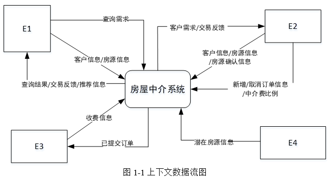
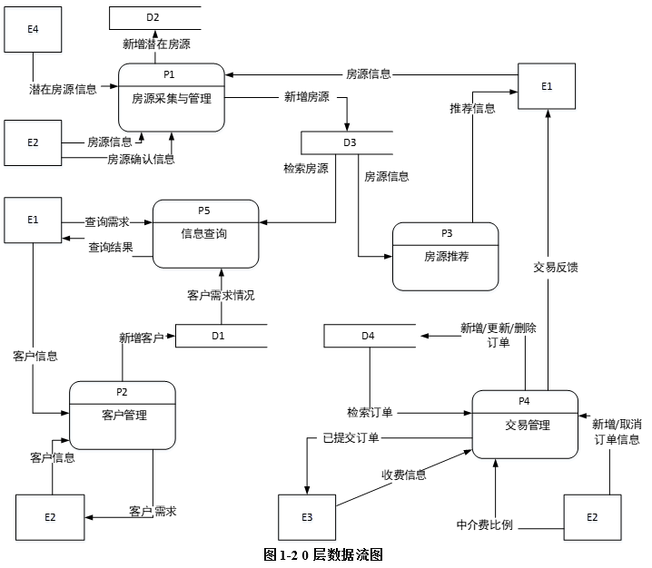
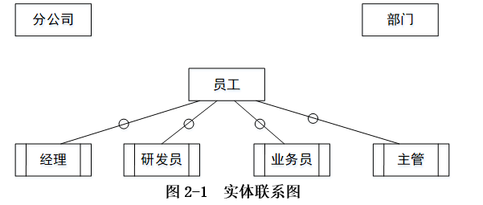
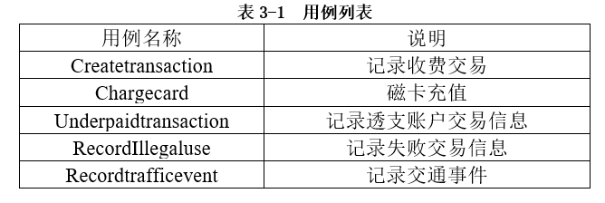
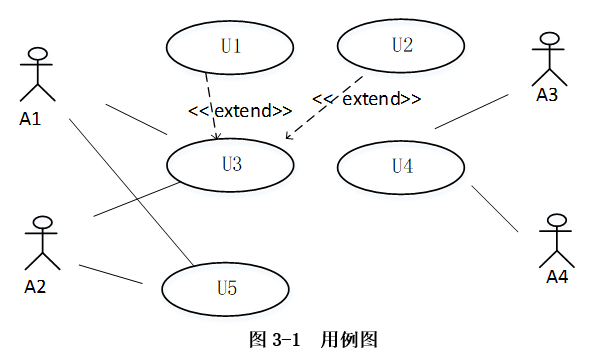
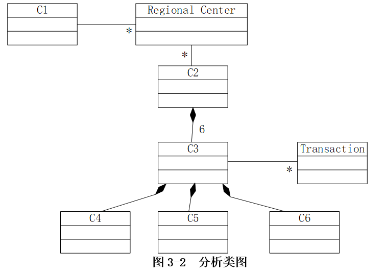
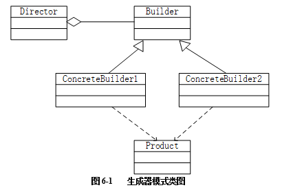

# 案例题模拟考试训练第4轮

## 考试说明

- 本卷为软件设计师下午案例题模拟考试训练第4轮。
- 本卷共 5 题，每题 15 分，总分 75 分。
- 建议限时 150 分钟。
- 试题五固定为 **Java 方向设计模式题**。
- 试题二涉及图形补全作答，请在同目录文件 **`案例题模拟考试训练第4轮-试题二.drawio`** 中完成图形补充。
- 本文件仅提供题干，不包含答案。

## 题型分布

| 试题 | 题型 | 分值 | 题源 | 作答方式 |
|---|---|---:|---|---|
| 试题一 | DFD / 结构化分析 | 15 | 2018 下半年案例题 第 1 题 | 本文件作答区 |
| 试题二 | 数据库设计 / ER 图 / 关系模式 | 15 | 2018 下半年案例题 第 2 题 | `案例题模拟考试训练第4轮-试题二.drawio` + 本文件作答区 |
| 试题三 | UML / 面向对象分析设计 | 15 | 2018 上半年案例题 第 3 题 | 本文件作答区 |
| 试题四 | 算法与程序设计 / C 语言代码填空 | 15 | 2018 上半年案例题 第 4 题 | 本文件作答区 |
| 试题五 | 设计模式 / Java 代码填空 | 15 | 2018 上半年案例题 第 6 题 | 本文件作答区 |

---

## 试题一：DFD / 结构化分析（15 分）

**题源：2018 下半年案例题 第 1 题**

阅读下列说明和图，回答问题 1 至问题 4，将解答填入答题纸的对应栏内。

### 说明

某房产中介连锁企业欲开发一个基于 Web 的房屋中介信息系统，以有效管理房源和客户，提高成交率。该系统的主要功能是：

1. **房源采集与管理。** 系统自动采集外部网站的潜在房源信息，保存为潜在房源。由经纪人联系确认的潜在房源变为房源，并添加出售/出租房源的客户。由经纪人或者客户登记的出售/出租房源，系统将其保存为房源。房源信息包括基本情况、配套设施、交易类型、委托方式、业主等。经纪人可以对房源进行更新等管理操作。
2. **客户管理。** 求租/求购客户进行注册、更新，推送客户需求给经纪人，或由经纪人对求租/求购客户进行登记、更新。客户信息包括身份证号、姓名、手机号、需求情况、委托方式等。
3. **房源推荐。** 根据客户的需求情况（求购/求租需求情况以及出售/出租房源信息），向已登录的客户推荐房源。
4. **交易管理。** 经纪人对租售客户双方进行交易信息管理，包括订单提交和取消，设置收取中介费比例。财务人员收取中介费之后，表示该订单已完成，系统更新订单状态和房源状态，向客户和经纪人发送交易反馈。
5. **信息查询。** 客户根据自身查询需求查询房屋供需信息。

现采用结构化方法对房屋中介信息系统进行分析与设计，获得如图 1-1 所示的上下文数据流图和图 1-2 所示的 0 层数据流图。





### 问题

**问题 1（4 分）**  使用说明中的词语，给出图 1-1 中的实体 E1～E4 的名称。

**问题 2（4 分）**  使用说明中的词语，给出图 1-2 中的数据存储 D1～D4 的名称。

**问题 3（3 分）**  根据说明和图中术语，补充图 1-2 中缺失的数据流及其起点和终点。

**问题 4（4 分）**  根据说明中术语，给出图 1-1 中数据流“客户信息”“房源信息”的组成。

### 作答区

- 问题 1：  
E1：客户  
E2：经纪人  
E3：财务人员  
E4：外部网站  

- 问题 2：  
D1：客户信息存储  
D2：潜在房源信息存储  
D3：房源信息存储  
D4：订单信息存储  
- 问题 3：  
数据流：客户需求情况，起点：D1客户信息存储，终点：P3房源推荐  
数据流：交易反馈，起点：P4交易管理，终点：E2经纪人  
数据流：更新房源，起点：P1房源采集与管理，终点：D3房源信息存储  
数据流：更新客户，起点：P2客户管理，终点：D1客户信息存储  

- 问题 4：  
客户信息：身份证号、姓名、手机号、需求情况、委托方式  
房源信息：基本情况、配套设施、交易类型、委托方式、业主  

---

## 试题二：数据库设计 / ER 图 / 关系模式（15 分）

**题源：2018 下半年案例题 第 2 题**

> 图形作答文件：`案例题模拟考试训练第4轮-试题二.drawio`

阅读下列说明，回答问题 1 至问题 4，将解答填入答题纸的对应栏内。

### 说明

某集团公司拥有多个分公司，为了方便集团公司对分公司各项业务活动进行有效管理，集团公司决定构建一个信息系统以满足公司的业务管理需求。

### 需求分析

1. **分公司关系**需要记录的信息包括：分公司编号、名称、经理、联系地址和电话。分公司编号唯一标识分公司信息中的每一个元组。每个分公司只有一名经理，负责该分公司的管理工作。每个分公司设立仅为本分公司服务的多个业务部门，如研发部、财务部、采购部、销售部等。
2. **部门关系**需要记录的信息包括：部门号、部门名称、主管号、电话和分公司编号。部门号唯一标识部门信息中的每一个元组。每个部门只有一名主管，负责部门的管理工作。每个部门有多名员工，每名员工只能隶属于一个部门。
3. **员工关系**需要记录的信息包括：员工号、姓名、隶属部门、岗位、电话和基本工资。其中，员工号唯一标识员工信息中的每一个元组。岗位包括：经理、主管、研发员、业务员等。

### 概念模型设计

根据需求阶段收集的信息，设计的实体联系图和关系模式（不完整）如图 2-1 所示：



### 关系模式设计

- 分公司（分公司编号，名称，（a），联系地址，电话）
- 部门（部门号，部门名称，（b），电话）
- 员工（员工号，姓名，（c），电话，基本工资）

### 问题

**问题 1（4 分）**  根据问题描述，补充 4 个联系，完善图 2-1 的实体联系图。联系名可用“联系1”“联系2”“联系3”“联系4”代替，联系的类型为 1:1、1:n 和 m:n（或 1:1、1:* 和 *:*）。

**问题 2（5 分）**  根据题意，将关系模式中的空（a）～（c）补充完整。

**问题 3（4 分）**  给出“部门”和“员工”关系模式的主键和外键。

**问题 4（2 分）**  假设集团公司要求系统能记录部门历任主管的任职时间和任职年限，那么是否需要在数据库设计时增设一个实体？为什么？

### 作答区

- 问题 1：  
主管1：1部门；分公司1：1经理；部门1：n员工；分公司1：n部门

- 问题 2：  
a：经理（经理员工号）；b：主管号（岗位为主管的员工号）、分公司编号；c：隶属部门（部门号）、岗位

- 问题 3：  
部门主键：部门号；外键：主管号、分公司编号
员工主键：员工号，外键：隶属部门

- 问题 4：  
需要增加部门主管任职记录实体，因为当前实体中没有可以清晰承载历任主管任职时间属性和任职年限属性的实体。

---

## 试题三：UML / 面向对象分析设计（15 分）

**题源：2018 上半年案例题 第 3 题**

阅读下列说明，回答问题 1 至问题 3，将解答填入答题纸的对应栏内。

### 说明

某 ETC（Electronic Toll Collection，不停车收费）系统在高速公路沿线的特定位置上设置一个横跨道路上空的龙门架（Toll gantry），龙门架下包括 6 条车道（Traffic lanes），每条车道上安装有雷达传感器（Radar sensor）、无线传输器（Radio transceiver）和数码相机（Digital Camera）等用于不停车收费的设备，以完成正常行驶速度下的收费工作。该系统的基本工作过程如下：

1. 每辆汽车上安装有车载器，驾驶员（Driver）将一张具有唯一识别码的磁卡插入车载器中。磁卡中还包含有驾驶员账户的当前信用记录。
2. 当汽车通过某条车道时，不停车收费设备识别车载器内的特有编码，判断车型，将收集到的相关信息发送到该路段所属的区域系统（Regional center）中，计算通行费用，创建收费交易（Transaction），从驾驶员的专用账户中扣除通行费用。如果驾驶员账户透支，则记录透支账户交易信息。区域系统再将交易后的账户信息发送到维护驾驶员账户信息的中心系统（Central system）。
3. 车载器中的磁卡可以使用邮局的付款机进行充值。充值信息会传送至中心系统，以更新驾驶员账户的余额。
4. 当没有安装车载器或者车载器发生故障的车辆通过车道时，车道上的数码相机将对车辆进行拍照，并将车辆照片及拍摄时间发送到区域系统，记录失败的交易信息；并将该交易信息发送到中心系统。
5. 区域系统会获取不停车收费设备所记录的交通事件（Traffic events）；交通广播电台（Traffic advice center）根据这些交通事件进行路况分析并播报路况。

现采用面向对象方法对上述系统进行分析与设计，得到如表 3-1 所示的用例列表以及如图 3-1 所示的用例图和图 3-2 所示的分析类图。







### 问题

**问题 1（4 分）**  根据说明中的描述，给出图 3-1 中 A1～A4 所对应的参与者名称。

**问题 2（5 分）**  根据说明中的描述及表 3-1，给出图 3-1 中 U1～U5 所对应的用例名称。

**问题 3（6 分）**  根据说明中的描述，给出图 3-2 中 C1～C6 所对应的类名。

### 作答区

- 问题 1：  
A1：不停车收费设备  
A2：数码相机  
A3：驾驶员  
A4：邮局的付款机  
- 问题 2：  
U1：Underpaidtransaction记录透支账户交易信息  
U2：RecordIllegaluse记录失败的交易信息  
U3：Createtransaction记录收费交易  
U4：Chargecard磁卡充值  
U5：Recordtrafficevent记录交通事件  
- 问题 3：  
C1：Electronic Toll Collection  
C2：Toll gantry  
C3：Traffic lanes  
C4：Radar sensor  
C5：Radio transceiver  
C5：Digital Camera  

---

## 试题四：算法与程序设计（15 分）

**题源：2018 上半年案例题 第 4 题**

阅读下列说明和 C 代码，回答问题 1 和问题 2，将解答填入对应栏内。

### 说明

某公司购买长钢条，将其切割后进行出售。切割钢条的成本可以忽略不计，钢条的长度为整英寸。已知价格表 `p`，其中 `p[i]`（`i = 1, 2, …, m`）表示长度为 `i` 英寸的钢条的价格。现要求解使销售收益最大的切割方案。

求解此切割方案的算法基本思想如下：

假设长钢条的长度为 `n` 英寸，最佳切割方案的最左边切割段长度为 `i` 英寸，则继续求解剩余长度为 `n - i` 英寸钢条的最佳切割方案。考虑所有可能的 `i`，得到的最大收益 `r_n` 对应的切割方案即为最佳切割方案。

`r_n = max_{1≤i≤n}(p[i] + r[n-i])`

对此递归式，给出自顶向下和自底向上两种实现方式。

### C 代码

```c
/* 常量和变量说明
   n：长钢条的长度
   p[]：价格数组 */
#define LEN 100

int Top_Down_Cut_Rod(int p[], int n){   /* 自顶向下 */
    int r = 0;
    int i;
    if(n == 0){
        return 0;
    }
    for(i = 1; （1） ; i++){
        int tmp = p[i] + Top_Down_Cut_Rod(p, n - i);
        r = (r >= tmp) ? r : tmp;
    }
    return r;
}

int Bottom_Up_Cut_Rod(int p[], int n){  /* 自底向上 */
    int r[LEN] = {0};
    int temp = 0;
    int i, j;
    for(j = 1; j <= n; j++){
        temp = 0;
        for(i = 1; （2） ; i++){
            temp = （3） ;
        }
        （4） ;
    }
    return r[n];
}
```

### 问题

**问题 1（8 分）**  根据说明，填充 C 代码中的空（1）～（4）。

**问题 2（7 分）**  根据说明和 C 代码，算法采用的设计策略为（5）。求解 `r_n` 时，自顶向下方法的时间复杂度为（6）；自底向上方法的时间复杂度为（7）（用 `O` 表示）。

### 作答区

- 问题 1：  
(1)i <= n  
(2)r[j] = temp  
(3)p[i] + r[n-i]  
(4)i <= j  
- 问题 2：  
(5)动态规划  
(6)O(2^n)  
(7)O(n^3)  

---

## 试题五：设计模式 / Java 代码填空（15 分）

**题源：2018 上半年案例题 第 6 题**

阅读下列说明和 Java 代码，将应填入（n）处的字句写在答题纸的对应栏内。

### 说明

生成器（Builder）模式的意图是将一个复杂对象的构建与它的表示分离，使得同样的构建过程可以创建不同的表示。图 6-1 所示为其类图。



### Java 代码

```java
import java.util.*;

class Product {
    private String partA;
    private String partB;

    public Product() {}

    public void setPartA(String s) { partA = s; }
    public void setPartB(String s) { partB = s; }
}

interface Builder {
    public （1） ;
    public void buildPartB();
    public （2） ;
}

class ConcreteBuilder1 implements Builder {
    private Product product;

    public ConcreteBuilder1() {
        product = new Product();
    }

    public void buildPartA() {
        （3） ("Component A");
    }

    public void buildPartB() {
        （4） ("Component B");
    }

    public Product getResult() {
        return product;
    }
}

class ConcreteBuilder2 implements Builder {
    // 代码省略
}

class Director {
    private Builder builder;

    public Director(Builder builder) {
        this.builder = builder;
    }

    public void construct() {
        （5） ;
        // 代码省略
    }
}

class Test {
    public static void main(String[] args) {
        Director director1 = new Director(new ConcreteBuilder1());
        director1.construct();
    }
}
```

### 作答区

- （1）：void buildPartA()  
- （2）：Product getResult() 
- （3）：product.setPartA
- （4）：product.setPartB
- （5）：builder.buildPartA()
