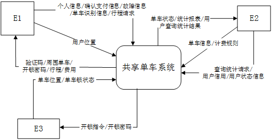
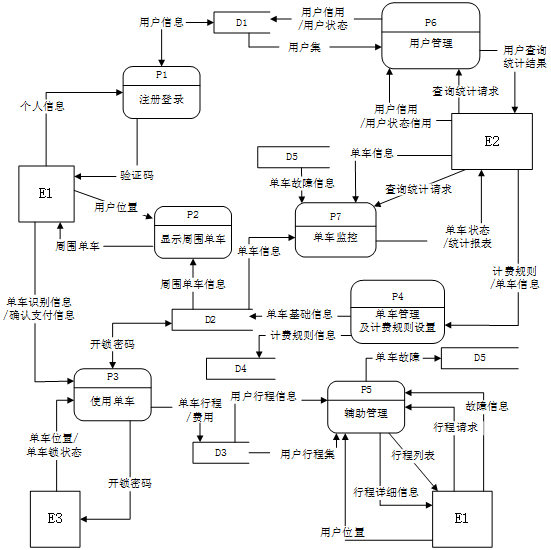
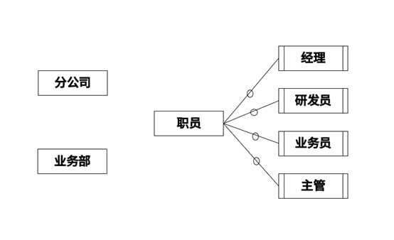
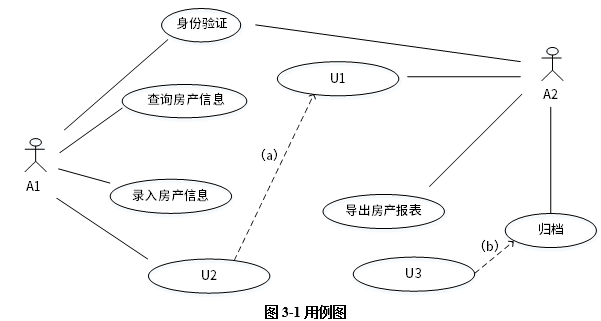
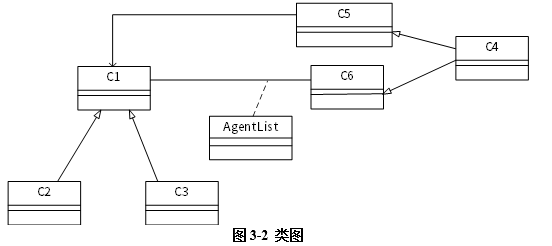
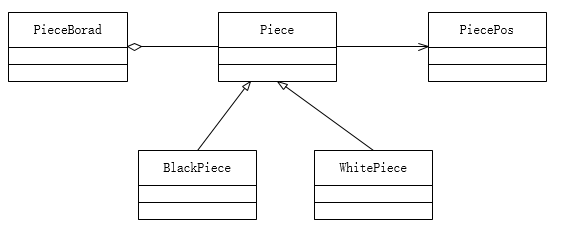

# 案例题模拟考试训练第5轮

## 考试说明

- 本卷为软件设计师下午案例题模拟考试训练第5轮。
- 本卷共 5 题，每题 15 分，总分 75 分。
- 建议限时 150 分钟。
- 试题五固定为 Java 方向设计模式题，不包含 C++ 选做题。
- 文字答案直接写在本 Markdown 文件对应题目的作答区。
- 涉及图形补全或绘图作答的题，请打开同目录对应 `.drawio` 文件作答并保存。
- 本文件和同目录 `.drawio` 文件仅提供题干与空白作答位置，不包含答案、解析或结论级提示。

## 题型分布

| 试题 | 题型 | 分值 | 题源 | 作答方式 |
|---|---|---:|---|---|
| 试题一 | DFD / 结构化分析 | 15 | 2017 下半年案例题 第 1 题 | `试题一.drawio` + 本文件作答区 |
| 试题二 | 数据库设计 / ER 图 / 关系模式 | 15 | 2020 下半年案例题 第 2 题 | `试题二.drawio` + 本文件作答区 |
| 试题三 | UML / 面向对象分析设计 | 15 | 2020 下半年案例题 第 3 题 | `试题三.drawio` + 本文件作答区 |
| 试题四 | 算法与程序设计 / C 语言代码填空 | 15 | 2017 下半年案例题 第 4 题 | 本文件作答区 |
| 试题五 | 设计模式 / Java 代码填空 | 15 | 2021 下半年案例题 第 6 题 | 本文件作答区 |

---

## 试题一：DFD / 结构化分析（15 分）

题源：2017 下半年案例题 第 1 题。

图形作答文件：`试题一.drawio`。

阅读下列说明和图，回答问题1至问题4，将解答填入答题纸的对应栏内。

【说明】

某公司拟开发一个共享单车系统，采用北斗定位系统进行单车定位，提供针对用户的APP以及微信小程序、基于Web的管理与监控系统。该共享单车系统的主要功能如下。

1. 用户注册登录。用户在APP端输入手机号并获取验证码后进行注册，将用户信息进行存储。用户登录后显示用户所在位置周围的单车。
2. 使用单车。
   1. 扫码/手动开锁。通过扫描二维码或手动输入编码获取开锁密码，系统发送开锁指令进行开锁，系统修改单车状态，新建单车行程。
   2. 骑行单车。单车定时上传位置，更新行程。
   3. 锁车结账。用户停止使用或手动锁车并结束行程后，系统根据已设置好的计费规则及使用时间自动结算，更新本次骑行的费用并显示给用户，用户确认支付后，记录行程的支付状态。系统还将重置单车的开锁密码和单车状态。
3. 辅助管理。
   1. 查询。用户可以查看行程列表和行程详细信息。
   2. 报修。用户上报所在位置或单车位置以及单车故障信息并进行记录。
4. 管理与监控。
   1. 单车管理及计费规则设置。商家对单车基础信息、状态等进行管理，对计费规则进行设置并存储。
   2. 单车监控。对单车、故障、行程等进行查询统计。
   3. 用户管理。管理用户信用与状态信息，对用户进行查询统计。

现采用结构化方法对共享单车系统进行分析与设计，获得如图1-1所示的上下文数据流图和图1-2所示的0层数据流图。





【问题1】（4分）

使用说明中的词语，给出图1-1中的实体E1~E3的名称。

【问题2】（4分）

使用说明中的词语，给出图1-2中的数据存储D1~D5的名称。

【问题3】（4分）

根据说明和图中术语及符号，补充图1-2中缺失的数据流及其起点和终点。

【问题4】（3分）

根据说明中术语，说明“使用单车”可以分解为哪些子加工？

### 作答区
【问题1】  
E1：用户  
E2：商家  
E3：单车  

【问题2】
D1：用户信息存储  
D2：单车信息存储  
D3：行程信息存储  
D4：计费规则存储  
D5：故障信息存储  

【问题3】  
起点：D4计费规则存储，终点：P3使用单车，数据流：计费规则信息  
起点：P3使用单车，终点：E1用户，数据流：开锁密码  
起点：P3使用单车，终点：E1用户，数据流：费用  
起点：P3使用单车，终点：E3单车，数据流：开锁指令  

【问题4】  
使用单车：
1、用户输入编码或者扫码  
2、系统返回开锁密码  
3、系统向单车发送开锁密码和开锁指令  
4、系统修改单车状态  
5、系统新建单车行程  
6、单车实时上传位置、更新行程  
7、用户停止使用或手动锁车  
8、系统根据已设置好的计费规则及使用时间自动结算  
9、系统更新本次骑行的费用并显示给用户  
10、用户确认支付  
11、系统记录行程的支付状态  
12、系统重置单车的开锁密码和单车状态

---

## 试题二：数据库设计 / ER 图 / 关系模式（15 分）

题源：2020 下半年案例题 第 2 题。

图形作答文件：`试题二.drawio`。

阅读下列说明，回答问题1至问题4，将解答填入答题纸的对应栏内。

【说明】

M集团拥有多个分公司，为了方便集团公司对各个分公司职员进行有效管理，集团公司决定构建一个信息平台以满足公司各项业务管理需求。

【需求分析】

1. 分公司关系模式需要记录的信息包括分公司编号、名称、经理号、联系地址和电话。分公司编号唯一标识分公司关系模式中的每一个元组。每个分公司只有一名经理，负责该分公司的管理工作。每个分公司设立仅为本分公司服务的多个业务部。业务部包括：研发部、财务部、采购部、销售部等。
2. 业务部关系模式需要记录的信息包括业务部编号、名称、主管号、电话和分公司编号。业务部编号唯一标识业务部关系模式中的每一个元组。每个业务部只有一名主管，负责该业务部的管理工作。每个业务部有多名职员，每名职员只能隶属于一个业务部。
3. 职员关系模式需要记录的信息包括职员号、姓名、所属业务部编号、岗位、电话、家庭成员姓名和成员关系。其中，职员号唯一标识职员关系模式中的每一个元组。岗位包括：经理、主管、研发员、业务员等。

【概念模式设计】



图2-1 实体-联系图

【关系模式设计】

分公司（分公司编号、名称、(a)、 联系地址 ）

业务部（业务部编号、名称、(b)、 电话）

职员（职员号、姓名、岗位、(c)、 电话、家庭成员姓名、成员关系）

【问题1】（4分）

根据问题描述，补充4个联系，完善图2-1的实体联系图，联系名可用联系1、联系2、联系3和联系4代替，联系的类型为1:1、1:n和m:n（或1:1、1:*和*:*）。

【问题2】（3分）

根据题意，将以上关系模式中的空(a)~(c)的属性补充完整，并填入答题纸的对应位置上。

【问题3】（4分）

（1）分析分公司关系模式的主键和外键。

（2）分析业务部关系模式的主键和外键。

【问题4】（4分）

在职员关系模式中，假设每个职员有多名家庭成员，那么职员关系模式存在什么问题？应如何解决？

### 作答区
【问题1】  
联系1：分公司1：n业务部  
联系2：业务部1：n职员  
联系3：业务部1：1主管  
联系4：分公司1：1经理  

【问题2】  
a：电话、经理号  
b：主管号、分公司编号  
c：所属业务部门编号  

【问题3】（4分）

（1）分公司主键：分公司编号；分公司外键：经理号  

（2）业务部门主键：业务部门编号；业务部门外键：主管号、分公司编号

【问题4】（4分） 
存在插入异常、删除异常和修改异常的问题，即：为了增加某个职员的家庭成员，需要增加相同的职员记录，当想要删除所有职员的家庭成员信息会把职员基本信息的记录也一起删掉导致职员不存在，修改职员基本信息时要修改多条职员记录。  
可以把职员关系模式拆解为职员基本信息和职员家庭成员信息两个关系模式，职员基本信息1：n职员家庭成员信息；职员基本信息删除家庭成员姓名和成员关系属性，移动到职员家庭成员信息中。  
职员基本信息（职员号、姓名、所属业务部编号、岗位、电话）  
职员家庭成员信息（职员号、家庭成员姓名、成员关系）


---

## 试题三：UML / 面向对象分析设计（15 分）

题源：2020 下半年案例题 第 3 题。

图形作答文件：`试题三.drawio`。

阅读下列系统设计说明，回答问题1至问题3，将解答填入答题纸的对应栏内。

【说明】

某房产公司，欲开发一个房产信息管理系统，其主要功能描述如下：

1. 公司销售的房产(Property)分为住宅(House)和公寓(Cando)两类。针对每套房产，系统存储房产证明、地址、建造年份、建筑面积、销售报价、房产照片以及销售状态(在售、售出、停售)等信息。对于住宅，还需存储楼层、公摊面积、是否有地下室等信息；对于公寓，还需存储是否有阳台等信息。
2. 公司雇佣了多名房产经纪(Agent)负责销售房产。系统中需存储房产经纪的基本信息，包括：姓名、家庭住址、联系电话、受雇的起止时间等。一套房产同一时段仅由一名房产经纪负责销售，系统中会记录房产经纪负责每套房产的起始时间和终止时间。
3. 系统用户(User)包括房产经纪和系统管理员(Manager)。用户需经过系统身份验证之后才能登录系统。房产经纪登录系统之后，可以录入负责销售的房产信息，也可以查询所负责的房产信息。房产经纪可以修改其负责的房产信息，但需要经过系统管理员的审批授权。
4. 系统管理员可以从系统中导出所有房产的信息报表。系统管理员定期将售出和停售的房产信息进行归档。若公司确定不再销售某套房产，系统管理员将该房产信息从系统中删除。

现采用面向对象方法开发该系统，得到如图3-1所示的用例图和图3-2所示的初始类图。





【问题1】（7分）

（1）根据说明中的描述，分别给出图3-1中A1到A2所对应的名称以及U1~U3所对应的用例名称。

（2）根据说明中的描述，分别给出图3-1中(a)和(b)用例之间的关系。

【问题2】（6分）

根据说明中的描述，分别给图3-2中C1~C6所对应的类名称。

【问题3】（2分）

图3-2中AgentList是一个英文名称，用来进一步阐述C1和C6之间的关系，根据说明中的描述，绘出AgentList的主要属性。

### 作答区
【问题1】
（1）  
A1：房产经纪(Agent)  
A2：系统管理员(Manager)  
A1：房产经纪(Agent)  
U1：审批授权  
U2：修改房产信息  
U3：删除房产信息  
（2）根据说明中的描述，分别给出图3-1中(a)和(b)用例之间的关系。
(a)：include  
(b)：extend  
【问题2】  
此题图3-2中C4和C5、C6的连线箭头反了吧？  
C1：房产(Property)  
C2：住宅(House)  
C3：公寓(Cando)  
C4：系统用户(User)  
C5：系统管理员(Manager)  
C6：房产经纪(Agent)  

【问题3】  
这道题需要绘图回答吗，如果要画图要怎么画，我不太清楚  
房产经纪（Agent）、房产（Property）、起始时间（StartTime）、终止时间（EndTime）。

---

## 试题四：算法与程序设计 / C 语言代码填空（15 分）

题源：2017 下半年案例题 第 4 题。

阅读下列说明和C代码，回答问题1至问题2，将解答写在答题纸的对应栏内。

【说明】

一个无向连通图G点上的哈密尔顿（Hamilton）回路是指从图G上的某个顶点出发，经过图上所有其他顶点一次且仅一次，最后回到该顶点的路径。一种求解无向图上哈密尔顿回路算法的基本思想如下：

假设图G存在一个从顶点V0出发的哈密尔顿回路 V0 - V1 - V2 - V3 - ... - Vn-1 - V0。算法从顶点V0出发，访问该顶点的一个未被访问的邻接顶点V1，接着从顶点V1出发，访问V1一个未被访问的邻接顶点V2，...；对顶点Vi，重复进行以下操作：访问Vi的一个未被访问的邻接顶点Vi+1；若Vi的所有邻接顶点均已被访问，则返回到顶点Vi-1，考虑Vi-1的下一个未被访问的邻接顶点，仍记为Vi；直到找到一条哈密尔顿回路或者找不到哈密尔顿回路，算法结束。

【C代码】

下面是算法的C语言实现。

（1）常量和变量说明

n：图G中的顶点数

c[][]：图G的邻接矩阵

k：统计变量，当前已经访问的顶点数为k+1

x[k]：第k个访问的顶点编号，从0开始

visited[x[k]]：第k个顶点的访问标志，0表示未访问，1表示已访问

（2）C程序

```c
#include <stdio.h>
#include <stdlib.h>
#define N 100

#define MAX 100

void Hamilton(int n, int x[MAX], int c[MAX][MAX]) {
    int i;
    int visited[MAX];
    int k;

    /* 初始化x数组和visited数组 */
    for (i = 0; i < n; i++) {
        x[i] = 0;
        visited[i] = 0;
    }

    /* 访问起始顶点 */
    k = 0;
    （1）;
    x[0] = 0;
    k = k + 1;

    /* 访问其他顶点 */
    while (k >= 0) {
        x[k] = x[k] + 1;
        while (x[k] < n) {
            if (（2） && c[x[k - 1]][x[k]] == 1) { /* 邻接顶点x[k]未被访问过 */
                break;
            } else {
                x[k] = x[k] + 1;
            }
        }
        if (x[k] < n && k == n - 1 && （3）) { /* 找到一条哈密尔顿回路 */
            for (k = 0; k < n; k++) {
                printf("%d--", x[k]); /* 输出哈密尔顿回路 */
            }
            printf("%d\n", x[0]);
            return;
        } else if (x[k] < n && k < n - 1) { /* 设置当前顶点的访问标志，继续下一个顶点 */
            （4）
            k = k + 1;
        } else { /* 没有未被访问过的邻接顶点，回退到上一个顶点 */
            x[k] = 0;
            visited[x[k]] = 0;
            （5）;
        }
    }
}
```

【问题1】（10分）

根据题干说明，填充C代码中的空（1）~（5）。

【问题2】（5分）

根据题干说明和C代码，算法采用的设计策略为（6），该方法在遍历图的顶点时，采用的是（7）方法（深度优先或广度优先）。

### 作答区
【问题1】（10分）

根据题干说明，填充C代码中的空（1）~（5）。
（1）visited[0] == 1  
（2）visited[x[k]] == 0   
（3）c[x[k]][0] == 1  
（4）visited[x[k]] = 1  
（5）k = k - 1  

【问题2】（5分）

（6）回溯法  
（7）深度优先  

---

## 试题五：设计模式 / Java 代码填空（15 分）

题源：2021 下半年案例题 第 6 题。

阅读下列说明和Java代码，将应填入（n）处的字句写在答题纸的对应栏内。

【说明】

享元（Flyweight）模式主要用于减少创建对象的数量，以低内存占用，提高性能。现要开发一个网络围棋程序允许多个玩家联机下棋。由于只有一台服务器，为节约内存空间，采用享元模式实现该程序，得到如图6-1所示的类图。



图6-1 类图

【Java代码】

```java
import java.util.*;

enum PieceColor { BLACK, WHITE } // 棋子颜色

class PiecePos { // 棋子位置
    private int x;
    private int y;

    public PiecePos(int a, int b) {
        x = a;
        y = b;
    }

    public int getX() {
        return x;
    }

    public int getY() {
        return y;
    }
}

abstract class Piece { // 棋子定义
    protected PieceColor m_color; // 颜色
    protected PiecePos m_pos; // 位置

    public Piece(PieceColor color, PiecePos pos) {
        m_color = color;
        m_pos = pos;
    }

    (1);
}

class BlackPiece extends Piece {
    public BlackPiece(PieceColor color, PiecePos pos) {
        super(color, pos);
    }

    public void draw() {
        System.out.println("draw a black piece");
    }
}

class WhitePiece extends Piece {
    public WhitePiece(PieceColor color, PiecePos pos) {
        super(color, pos);
    }

    public void draw() {
        System.out.println("draw a white piece");
    }
}

class PieceBoard {
    // 棋盘上已有的棋子
    private static final ArrayList<(2)> m_arrayPiece = new ArrayList();
    private String m_blackName; // 黑方名称
    private String m_whiteName; // 白方名称

    public PieceBoard(String black, String white) {
        m_blackName = black;
        m_whiteName = white;
    }

    // 一步棋，在棋盘上放一颗棋子
    public void SetePiece(PieceColor color, PiecePos pos) {
        (3) piece = null;
        if (color == PieceColor.BLACK) { // 放黑子
            piece = new BlackPiece(color, pos); // 获取一颗黑子
            System.out.println(m_blackName + "在位置(" + pos.getX() + "," + pos.getY() + ")");
            (4);
        } else { // 放白子
            piece = new WhitePiece(color, pos); // 获取一颗白子
            System.out.println(m_whiteName + "在位置(" + pos.getX() + "," + pos.getY() + ")");
            (5);
        }
        m_arrayPiece.add(piece);
    }
}
```

### 作答区
(1)abstract void draw()
(2)Piece
(3)Piece
(4)piece.draw()
(5)piece.draw()