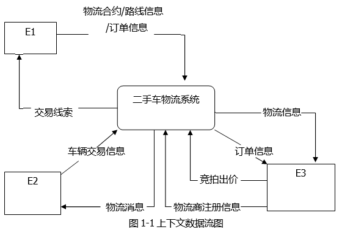
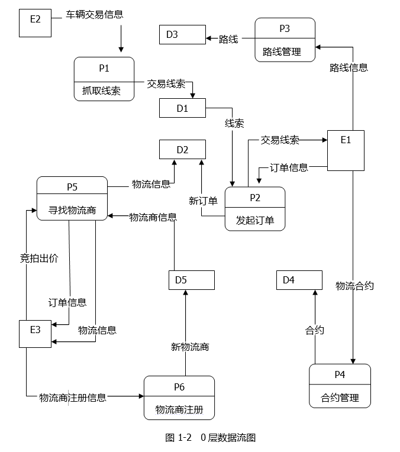
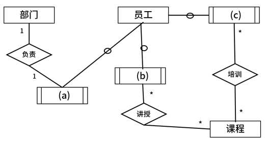
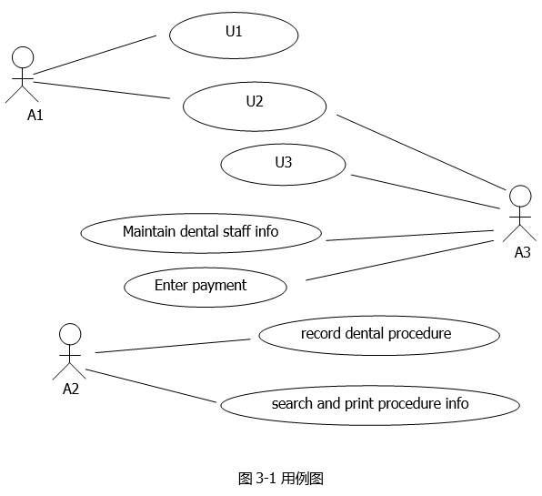
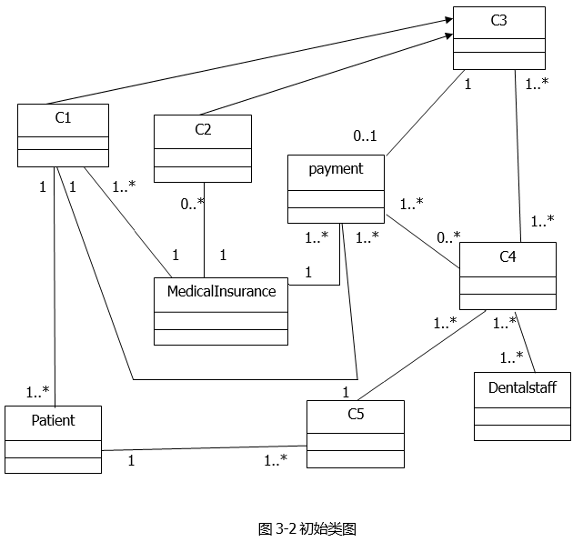
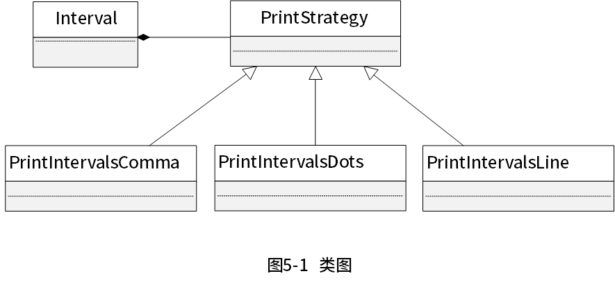

# 案例题模拟考试训练第6轮

## 考试说明

- 本卷为软件设计师下午案例题模拟考试训练第6轮。
- 共 5 道题，每题 15 分，总分 75 分。
- 试题五固定为 Java 方向设计模式题，不包含 C++ 选做题。
- 答案和解析未写入本文件；请按真实考试方式作答。
- 文字答案直接写在本 Markdown 的对应作答区；图形答案请在同目录 `.drawio` 文件中作答。

## 题目清单

| 题号 | 类型 | 分值 | 题源 | 作答方式 |
| --- | --- | ---: | --- | --- |
| 试题一 | DFD / 结构化分析 | 15 | 2019 下半年案例题 第 1 题 | 本文件作答区 |
| 试题二 | 数据库设计 / ER 图 / 关系模式 | 15 | 2019 下半年案例题 第 2 题 | `试题二.drawio` + 本文件作答区 |
| 试题三 | UML / 面向对象分析设计 | 15 | 2019 下半年案例题 第 3 题 | 本文件作答区 |
| 试题四 | 算法与程序设计 / C 语言代码填空 | 15 | 2020 下半年案例题 第 4 题 | 本文件作答区 |
| 试题五 | 设计模式 / Java 代码填空 | 15 | 2023 上半年案例题 第 5 题 | 本文件作答区 |

---

## 试题一：DFD / 结构化分析（15 分）

阅读下列说明和图，回答问题1至问题4，将解答填入答题纸的对应栏内。

【说明】

某公司欲开发一款二手车物流系统，以有效提升物流成交效率。该系统的主要功能是：

（1）订单管理：系统抓取线索，将车辆交易系统的交易信息抓取为线索。帮买顾问看到有买车线索后，会打电话询问买家是否需要物流，若需要，帮买顾问就将这个线索发起为订单并在系统中存储，然后系统帮助买家寻找物流商进行承运。

（2）路线管理：帮买顾问对物流商的路线进行管理，存储的路线信息包括路线类型、物流商、起止地点。路线分为三种，即固定路线、包车路线、竞拍体系，其中固定路线和包车路线是合约制。包车路线的发车时间由公司自行管理，是订单的首选途径。

（3）合约管理：帮买顾问根据公司与物流商确定的合约，对合约内容进行设置，合约信息包括物流商信息、路线起止城市、价格、有效期等。

（4）寻找物流商：系统根据订单的类型（保卖车、全国购和普通二手车）、起止城市，需要的服务模式（买家接、送到买家等）进行自动派发或以竞拍体系方式选择合适的物流商。即：有新订单时，若为保卖车或全国购，则直接分配到竞拍体系中。否则，若符合固定路线或包车路线，系统自动分配给合约物流商，若不符合固定路线或包车路线，系统将订单信息分配到竞拍体系中。竞拍体系接收到订单后，将订单信息推送给有相关路线的物流商，物流商对订单进行竞拍出价，最优报价的物流商中标。最后，给承运的物流商发送物流消息，更新订单的物流信息，给车辆交易系统发送物流信息。

（5）物流商注册：物流商账号的注册开通。

现采用结构化方法对二手车物流系统进行分析与设计，获得如图1-1所示的上下文数据流图和图1-2所示的0层数据流图。





【问题1】（3分）

使用说明中的词语，给出图1-1中的实体E1~E3的名称。

【问题2】（5分）

使用说明中的词语，给出图1-2中的数据存储D1~D5的名称。

【问题3】（4分）

根据说明和图中术语，补充图1-2中缺失的数据流及其起点和终点。

【问题4】（3分）

根据说明，采用结构化语言对“P5：寻找物流商”的加工逻辑进行描述。

### 作答区

【问题1】（3分）

E1：帮买顾问  
E2：车辆交易系统  
E3：物流商  

【问题2】（5分）

D1：线索存储  
D2：订单存储  
D3：路线存储  
D4：合约存储  
D5：物流商存储  

【问题3】（4分）

起点：D2订单存储，终点：P5寻找物流商，数据流：订单信息  
起点：P5寻找物流商，终点：E2车辆交易系统，数据流：物流信息  
起点：D3路线存储，终点：P5寻找物流商，数据流：路线信息  
起点：D4合约存储，终点：P5寻找物流商，数据流：物流合约信息  

【问题4】（3分）

系统查询到新订单  
查询路线存储获取路线信息  
IF 订单类型为保卖车或全国购    
    订单分配到竞拍体系  
ELSE
    查询合约存储和合约信息  
    IF 符合固定路线或包车路线  
        订单分配给合约物流商  
    ELSE     
        订单信息分配到竞拍体系
    ENDIF
ENDIF
竞拍体系接收订单  
将订单信息推送给有相关路线的物流商  
物流商对订单进行竞拍出价  
最优报价的物流商中标  
给承运的物流商发送物流消息  
更新订单的物流信息  
给车辆交易系统发送物流信息  


---

## 试题二：数据库设计 / ER 图 / 关系模式（15 分）

图形作答文件：`试题二.drawio`。

阅读下列说明，回答问题1至问题4，将解答填入答题纸的对应栏内。

【说明】

公司拟开发新入职员工的技能培训管理系统，以便使新员工快速胜任新岗位。该系统的部分功能及初步需求分析的结果如下所述：

1. 部门信息包括部门号、名称、部门负责人、电话等，其中部门号唯一标识部门关系中的每一个元组，一个部门有多个员工，但一名员工只属于一个部门，每个部门只有一名负责人，负责部门工作。

2. 员工信息包括员工号、姓名、部门号、岗位、基本工资、电话、家庭住址等，其中员工号唯一标识员工关系中的每一个元组。岗位有新入职员工，培训师、部门负责人等不同岗位设置不同的基本工资，新入职员工要选择多门课程进行培训，并通过考试取得课程成绩，一名培训师可以讲授多门课程、一门课程可由多名培训师讲授。

3. 课程信息包括课程号，课程名称、学时等；其中课程号唯一标识课程关系的每一个元组。

根据需求阶段收集的信息，设计的实体联系图如图2-1所示。



【关系模式设计】

部门（部门号，部门名，部门负责人，电话）

员工（员工号，姓名，部门号，d，电话，家庭住址）

课程（e，课程名称，学时）

讲授（课程号，培训师，培训地点）

培训（课程号，（f））

【问题1】（5分）

（1）补充图2-1中的空（a）~（c）。

（2）图2-1中是否存在缺失的联系？若存在，则说明所缺失的联系和联系类型。

【问题2】（3分）

根据题意，将关系模式中的空（d）~（f）补充完整。

【问题3】（5分）

员工关系模式的主键为（g），外键为（h）；

讲授关系模式的主键为（i），外键为（j）。

【问题4】（2分）

员工关系是否存在传递依赖？用100字以内的文字说明理由。

### 作答区

【问题1】（5分）

（1）
（a）部门负责人  
（b）培训师  
（c）新入职员工  

（2）存在，缺失员工到部门的关系，一个部门拥有多名员工，一名员工只属于一个部门

【问题2】（3分）

（d）岗位、基本工资  
（e）课程号  
（f）新入职员工号  

【问题3】（5分）

（g）员工号  
（h）部门号  
（i）(课程号、教师号)  
（j）课程号和教师号  

【问题4】（2分）

存在员工到工资的传递依赖，因为工资属性和岗位挂钩，所有有员工号->岗位->工资的传递依赖。


---

## 试题三：UML / 面向对象分析设计（15 分）

阅读下列说明和图，回答问题1至问题3。

【说明】

某牙科诊所拟开发一套信息系统，用于管理病人的基本信息和就诊信息。诊所工作人员包括：医护人员（Dental Staff）、接待员（Receptionist）和办公人员（Office Staff）等。系统主要功能需求描述如下：

1. 记录病人基本信息（Maintain patient info）。初次就诊的病人，由接待员将病人基本信息录入系统。病人基本信息包括病人姓名、身份证号、出生日期、性别、首次就诊时间和最后一次就诊时间等。每位病人与其医保信息（Medical Insurance）关联。

2. 记录就诊信息（Record office visit info）。病人在诊所的每一次就诊，由接待员将就诊信息（Office Visit）录入系统。就诊信息包括就诊时间、就诊费用、支付代码、病人支付费用和医保支付费用等。

3. 记录治疗信息（Record dental procedure）。病人在就诊时，可能需要接受多项治疗，每项治疗（Procedure）可能由多位医护人员为其服务。治疗信息包括：治疗项目名称、治疗项目描述、治疗的牙齿和费用等。治疗信息由每位参与治疗的医护人员分别向系统中录入。

4. 打印发票（Print invoices）。发票（Invoice）由办公人员打印。发票分为两种：给医保机构的发票（Insurance Invoice）和给病人的发票（Patient Invoice）。两种发票内容相同，只是支付的费用不同。当收到治疗费用后，办公人员在系统中更新支付状态（Enter payment）。

5. 记录医护人员信息（Maintain dental staff info）。办公人员将医护人员信息录入系统。医护人员信息包括姓名、职位、身份证号、家庭住址和联系电话等。

6. 医护人员可以查询并打印其参与的治疗项目相关信息（Search and print procedure info）。

现采用面向对象方法开发该系统，得到如图3-1所示的用例图和3-2所示的初始类图。





【问题1】（6分）

根据说明中的描述，给出图3-1中A1~A3所对应的参与者名称和U1~U3所对应的用例名称。

【问题2】（5分）

根据说明中的描述，给出图3-2中C1~C5所对应的类名。

【问题3】（4分）

根据说明中的描述，给出图3-2中类C4、C5、Patient和Dental Staff的必要属性。

### 作答区

【问题1】（6分）

A1：接待员（Receptionist）  
A2：医护人员（Dental Staff）  
A3：办公人员（Office Staff）  
U1：记录病人基本信息（Maintain patient info）  
U2：记录就诊信息（Record office visit info）  
U3：打印发票（Print invoices）  

【问题2】（5分）

C1：PatientInvoice  
C2：InsuranceInvoice  
C3：Invoice  
C4：Procedure  
C5：OfficeVisit  

【问题3】（4分）

C4：治疗项目名称、治疗项目描述、治疗的牙齿、费用、治疗的医护人员  
C5：就诊时间、就诊费用、支付代码、病人支付费用、医保支付费用、就诊人  
Patient：病人姓名、身份证号、出生日期、性别、首次就诊时间、最后一次就诊时间、医保信息  
Dental Staff：姓名、职位、身份证号、家庭住址、联系电话

---

## 试题四：算法与程序设计 / C 语言代码填空（15 分）

阅读下列说明和C代码，回答问题1至问题3，将解答写在答题纸的对应栏内。

【说明】

希尔排序算法又称最小增量排序算法，其基本思想是：

步骤1：构造一个步长序列delta1、delta2…、deltak，其中delta1=n/2，后面的每个delta是前一个的1/2，deltak=1；

步骤2：根据步长序列、进行k趟排序；

步骤3：对第i趟排序，根据对应的步长delta，将等步长位置元素分组，对同一组内元素在原位置上进行直接插入排序。

【C代码】

下面是算法的C语言实现。

（1）常量和变量说明

data：待排序数组data，长度为n，待排序数据记录在data[0]、data[1]、…、data[n-1]中。

n：数组a中的元素个数。

delta：步长数组。

（2）C程序

```c
#include <stdio.h>

void shellsort(int data[ ], int n) {
    int *delta, k, i, t, dk, j;
    k = n;
    delta = (int *)malloc(sizeof(int) * (n / 2));
    i = 0;
    do {
        (1);
        delta[i++] = k;
    } while (2);
    i = 0;
    while ((dk = delta[i]) > 0) {
        for (k = delta[i]; k < n; ++k)
            if ((3)) {
                t = data[k];
                for (j = k - dk; j >= 0 && t < data[j]; j -= dk) {
                    data[j + dk] = data[j];
                }
                (4);
            }
        ++i;
    }
}
```

【问题1】

根据说明和C代码，填充C代码中的空（1）~（4）。
delta = {3, 1}
【问题2】

根据说明和C代码，该算法的时间复杂度（5）O(n2)（小于、等于或大于）。该算法是否稳定（6）（是或否）。

【问题3】

对数组（15、9、7、8、20、-1、4）用希尔排序方法进行排序，经过第一趟排序后得到的数组为（7）。

### 作答区
【问题1】  
（1）k = k / 2  
（2）k >= 1  
（3）  
（4）data[j] = t  

【问题2】  
（5）小于  
（6）不稳定  

【问题3】

（7）（4、9、-1、8、20、7、15）


---

## 试题五：设计模式 / Java 代码填空（15 分）

阅读下列说明和Java代码，将应填入（n）处的字句写在答题纸的对应栏内。

【说明】

在某系统中，类Interval代表由下界（lower bound）和上界（upper bound）定义的区间，要求采用不同的格式显示区间范围，如[lower bound，upper bound]、[lower bound…upper bound]、[lower bound - upper bound]等。现采用策略（strategy）模式实现该要求，得到如图5-1所示的类图。



【Java代码】

```java
import java.util.*;

enum TYPE { COMMA, DOTS, LINE };

interface PrintStrategy {
    public        (1)      ;
}

class Interval {
    private double lowerBound;
    private double upperBound;

    public Interval(double p_lower, double p_upper) {
        lowerBound = p_lower;
        upperBound = p_upper;
    }

    public void printInterval(PrintStrategy ptr) {
        (2);
    }

    public double getLower() { return lowerBound; }

    public double getUpper() { return upperBound; }
}

class PrintIntervalsComma implements PrintStrategy {
    public void doPrint(Interval val) {
        System.out.println("[" + val.getLower() + "," + val.getUpper() + "]");
    }
}

class PrintIntervalsDots implements PrintStrategy {
    public void doPrint(Interval val) {
        System.out.println("[" + val.getLower() + "..." + val.getUpper() + "]");
    }
}

class PrintIntervalsLine implements PrintStrategy {
    public void doPrint(Interval val) {
        System.out.println("[" + val.getLower() + "-" + val.getUpper() + "]");
    }
}

class Strategy {
    public static PrintStrategy getStrategy(TYPE type) {
        PrintStrategy st = null;
        switch (type) {
            case COMMA:
                (3);
                break;
            case DOTS:
                (4);
                break;
            case LINE:
                (5);
                break;
        }
        return st;
    }

    public static void main(String[] args) {
        Interval a = new Interval(1.7, 2.1);
        a.printInterval(getStrategy(TYPE.COMMA));
        a.printInterval(getStrategy(TYPE.DOTS));
        a.printInterval(getStrategy(TYPE.LINE));
    }
}
```

### 作答区
（1）void doPrint(Interval val)  
（2）ptr.doPrint(this)  
（3）st = new PrintIntervalsComma()  
（4）st = new PrintIntervalsDots()  
（5）st = new PrintIntervalsLine()  

