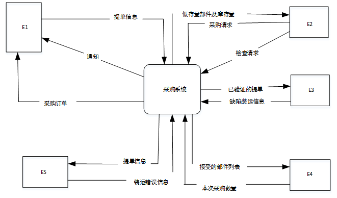
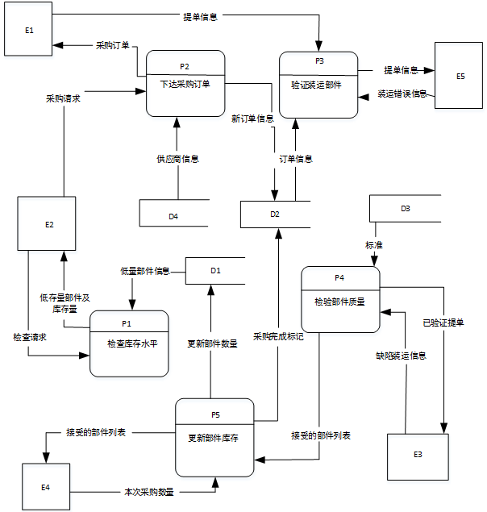
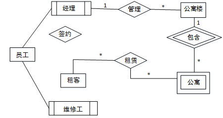
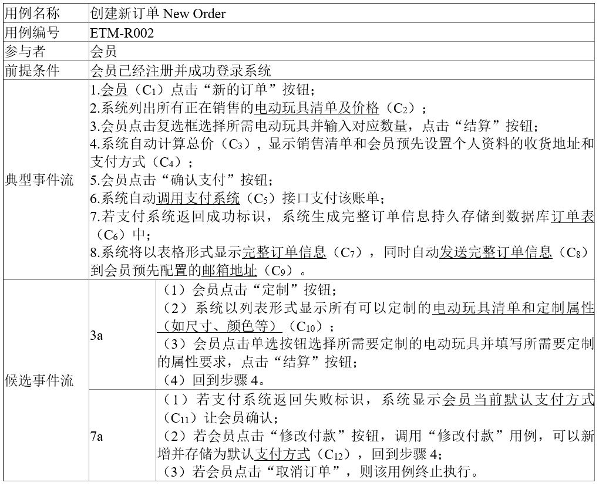
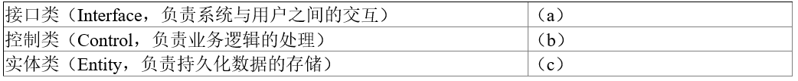
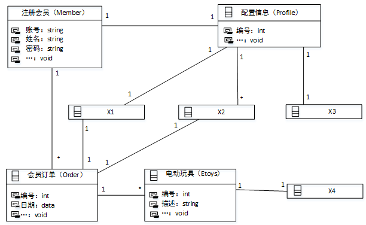
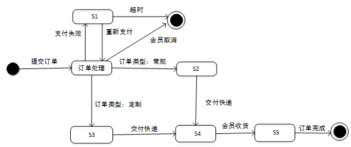
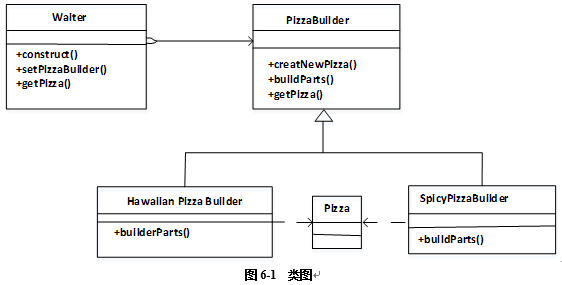

# 案例题模拟考试训练第7轮

> 本文件为作答入口。答案与解析不写入本训练文件；涉及图上补充或图中填入的题目，配套 drawio 文件在同目录下。

## 考试信息

- 题量：5 道案例题
- 总分：75 分
- 建议用时：150 分钟
- 试题五固定为 Java 方向设计模式题，不包含 C++ 选做题。

| 题号 | 类型 | 分值 | 题源 | 作答方式 |
| --- | --- | ---: | --- | --- |
| 试题一 | DFD / 结构化分析 | 15 | 2017 上半年案例题 第 1 题 | `试题一.drawio` + 本文件作答区 |
| 试题二 | 数据库设计 / E-R 图 / 关系模式 | 15 | 2017 上半年案例题 第 2 题 | `试题二.drawio` + 本文件作答区 |
| 试题三 | UML / 面向对象分析设计 | 15 | 2017 上半年案例题 第 3 题 | `试题三.drawio` + 本文件作答区 |
| 试题四 | 算法与程序设计 / C 语言代码填空 | 15 | 2017 上半年案例题 第 4 题 | 本文件作答区 |
| 试题五 | 设计模式 / Java 代码填空 | 15 | 2017 上半年案例题 第 6 题 | 本文件作答区 |

---

## 试题一：DFD / 结构化分析（15 分）

题源：2017 上半年案例题 第 1 题。

阅读下列说明和图，回答问题 1 至问题 4，将解答填入答题纸的对应栏内。

【说明】

某医疗器械公司作为复杂医疗产品的集成商，必须保持高质量部件的及时供应。为了实现这一目标，该公司欲开发一采购系统。系统的主要功能如下：

1. 检查库存水平。采购部门每天检查部件库存量，当特定部件的库存量降至其订货点时，返回低存量部件及库存量。
2. 下达采购订单。采购部门针对低存量部件及库存量提交采购请求，向其供应商（通过供应商文件访问供应商数据）下达采购订单，并存储于采购订单文件中。
3. 交运部件。当供应商提交提单并交运部件时，运输和接收（S/R）部门通过执行以下三步过程接收货物：

（1）验证装运部件。通过访问采购订单并将其与提单进行比较来验证装运的部件，并将提单信息发给 S/R 职员。如果收货部件项目出现在采购订单和提单上，则已验证的提单和收货部件项目将被送去检验。否则，将 S/R 职员提交的装运错误信息生成装运错误通知发送给供应商。

（2）检验部件质量。通过访问质量标准来检查装运部件的质量，并将已验证的提单发给检验员。如果部件满足所有质量标准，则将其添加到接受的部件列表用于更新部件库存。如果部件未通过检查，则将检验员创建的缺陷装运信息生成缺陷装运通知发送给供应商。

（3）更新部件库存。库管员根据收到的接受的部件列表添加本次采购数量，与原有库存量累加来更新库存部件中的库存量。标记订单采购完成。

现采用结构化方法对该采购系统进行分析与设计，获得如图 1-1 所示的上下文数据流图和图 1-2 所示的 0 层数据流图。



图 1-1 上下文数据流图



图 1-2 0 层数据流图

【问题 1】（5 分）

使用说明中的词语，给出图 1-1 中的实体 E1 ~ E5。

【问题 2】（4 分）

使用说明中的词语，给出图 1-2 中的数据存储 D1 ~ D4 的名称。

【问题 3】（4 分）

根据说明和图中术语，补充图 1-2 中缺失的数据流及其起点和终点。

【问题 4】（2 分）

用 200 字以内文字，说明建模图 1-1 和图 1-2 是如何保持数据流图平衡。

作答区：


---

## 试题二：数据库设计 / E-R 图 / 关系模式（15 分）

题源：2017 上半年案例题 第 2 题。

阅读下列说明，回答问题 1 至问题 3，将解答填入答题纸的对应栏内。

【说明】

某房屋租赁公司拟开发一个管理系统用于管理其持有的房屋、租客及员工信息。请根据下述需求描述完成系统的数据库设计。

【需求描述】

1. 公司拥有多幢公寓楼，每幢公寓楼有唯一的楼编号和地址。每幢公寓楼中有多套公寓，每套公寓在楼内有唯一的编号（不同公寓楼内的公寓号可相同）。系统需记录每套公寓的卧室数和卫生间数。
2. 员工和租客在系统中有唯一的编号（员工编号和租客编号）。
3. 对于每个租客，系统需记录姓名、多个联系电话、一个银行账号（方便自动扣房租）、一个紧急联系人的姓名及联系电话。
4. 系统需记录每个员工的姓名、一个联系电话和月工资。员工类别可以是经理或维修工，也可兼任。每个经理可以管理多幢公寓楼。每幢公寓楼必须由一个经理管理。系统需记录每个维修工的业务技能，如：水暖维修、电工、木工等。
5. 租客租赁公寓必须和公司签订租赁合同。一份租赁合同通常由一个或多个租客（合租）与该公寓楼的经理签订，一个租客也可租赁多套公寓。合同内容应包含签订日期、开始时间、租期、押金和月租金。

【概念模型设计】

根据需求阶段收集的信息，设计的实体联系图（不完整）如图 2-1 所示。



图 2-1 实体联系图

【逻辑结构设计】

根据概念模型设计阶段完成的实体联系图，得出如下关系模式（不完整）：

联系电话（电话号码，租客编号）

租客（租客编号，姓名，银行账号，联系人姓名，联系人电话）

员工（员工编号，姓名，联系电话，类别，月工资，（a））

公寓楼（（b），地址，经理编号）

公寓（楼编号，公寓号，卧室数，卫生间数）

合同（合同编号，租客编号，楼编号，公寓号，经理编号，签订日期，起始日期，租期，（c），押金）

【问题 1】（4.5 分）

补充图 2-1 中的“签约”联系所关联的实体及联系类型。

【问题 2】（4.5 分）

补充逻辑结构设计中的（a）、（b）、（c）三处空缺。

【问题 3】（6 分）

在租期内，公寓内设施如出现问题，租客可在系统中进行故障登记，填写故障描述，每项故障由系统自动生成唯一的故障编号，由公司派维修工进行故障维修，系统需记录每次维修的维修日期和维修内容。请根据此需求，对图 2-1 进行补充，并将所补充的 E-R 图内容转换为一个关系模式，请给出该关系模式。

作答区：


---

## 试题三：UML / 面向对象分析设计（15 分）

题源：2017 上半年案例题 第 3 题。

阅读下列系统设计说明，回答问题 1 至问题 3，将解答填入答题纸的对应栏内。

【说明】

某玩具公司正在开发一套电动玩具在线销售系统，用于向注册会员提供端对端的玩具定制和销售服务。在系统设计阶段，“创建新订单（New Order）”的设计用例详细描述如表 3-1 所示，候选设计类分类如表 3-2 所示，并根据该用例设计出部分类图如图 3-1 所示。

表 3-1 创建新订单（New Order）设计用例



表 3-2 候选设计类分类





图 3-1 部分类图

在订单处理的过程中，会员可以点击“取消订单”取消该订单。如果支付失败，该订单将被标记为挂起状态，可后续重新支付，如果挂起超时 30 分钟未支付，系统将自动取消该订单。订单支付成功后，系统判断订单类型：

（1）对于常规订单，标记为备货状态，订单信息发送到货运部，完成打包后交付快递发货；

（2）对于定制订单，会自动进入定制状态，定制完成后交付快递发货。会员在系统中点击“收货”按钮变为收货状态，结束整个订单的处理流程。根据订单处理过程所设计的状态图如图 3-2 所示。



图 3-2 订单状态图

【问题 1】（6 分）

根据表 3-1 中所标记的候选设计类，请按照其类别将编号 C1 ~ C12 分别填入表 3-2 中的（a）、（b）和（c）处。

【问题 2】（4 分）

根据创建新订单的用例描述，请给出图 3-1 中 X1 ~ X4 处对应类的名称。

【问题 3】（5 分）

根据订单处理过程的描述，在图 3-2 中 S1 ~ S5 处分别填入对应的状态名称。

作答区：


---

## 试题四：算法与程序设计 / C 语言代码填空（15 分）

题源：2017 上半年案例题 第 4 题。

阅读下列说明和 C 代码，回答问题 1 至问题 3，将解答写在答题纸的对应栏内。

【说明】

假币问题：有 n 枚硬币，其中有一枚是假币，已知假币的重量较轻。现只有一个天平，要求用尽量少的比较次数找出这枚假币。

【分析问题】

将 n 枚硬币分成相等的两部分：

（1）当 n 为偶数时，将前后两部分，即 1...n/2 和 n/2+1...n，放在天平的两端，较轻的一端里有假币，继续在较轻的这部分硬币中用同样的方法找出假币；

（2）当 n 为奇数时，将前后两部分，即 1..(n-1)/2 和 (n+1)/2+1...n，放在天平的两端，较轻的一端里有假币，继续在较轻的这部分硬币中用同样的方法找出假币；若两端重量相等，则中间的硬币，即第 (n+1)/2 枚硬币是假币。

【C 代码】

下面是算法的 C 语言实现，其中：

coins[]：硬币数组

first、last：当前考虑的硬币数组中的第一个和最后一个下标

```c
#include <stdio.h>

int getCounterfeitCoin(int coins[], int first, int last)
{
    int firstSum = 0, lastSum = 0;
    int i;
    if (first == last - 1) {        /* 只剩两枚硬币 */
        if (coins[first] < coins[last])
            return first;
        return last;
    }
    if ((last - first + 1) % 2 == 0) {     /* 偶数枚硬币 */
        for (i = first; i < (   1   ); i++) {
            firstSum += coins[i];
        }
        for (i = first + (last - first) / 2 + 1; i < last + 1; i++) {
            lastSum += coins[i];
        }
        if (   2   ) {
            return getCounterfeitCoin(coins, first, first + (last - first) / 2);
        } else {
            return getCounterfeitCoin(coins, first + (last - first) / 2 + 1, last);
        }
    } else {       /* 奇数枚硬币 */
        for (i = first; i < first + (last - first) / 2; i++) {
            firstSum += coins[i];
        }
        for (i = first + (last - first) / 2 + 1; i < last + 1; i++) {
            lastSum += coins[i];
        }
        if (firstSum < lastSum) {
            return getCounterfeitCoin(coins, first, first + (last - first) / 2 - 1);
        } else if (firstSum > lastSum) {
            return getCounterfeitCoin(coins, first + (last - first) / 2 + 1, last);
        } else {
            return (   3   );
        }
    }
}
```

【问题 1】（6 分）

根据题干说明，填充 C 代码中的空（1）~（3）。

【问题 2】（6 分）

根据题干说明和 C 代码，算法采用了（ ）设计策略。

函数 `getCounterfeitCoin` 的时间复杂度为（ ）（用 O 表示）。

【问题 3】（3 分）

若输入的硬币数为 30，则最少的比较次数为（ ），最多的比较次数为（ ）。

作答区：


---

## 试题五：设计模式 / Java 代码填空（15 分）

题源：2017 上半年案例题 第 6 题。

阅读下列说明和 Java 代码，将应填入（n）处的字句写在答题纸的对应栏内。

【说明】

某快餐厅主要制作并出售儿童套餐，一般包括主餐（各类比萨）、饮料和玩具，其餐品种类可能不同，但其制作过程相同。前台服务员（Waiter）调度厨师制作套餐。现采用生成器（Builder）模式实现制作过程，得到如图 6-1 所示的类图。



图 6-1 类图

【Java 代码】

```java
class Pizza {
    private String parts;

    public void setParts(String parts) {
        this.parts = parts;
    }

    public String toString() {
        return this.parts;
    }
}

abstract class PizzaBuilder {
    protected Pizza pizza;

    public Pizza getPizza() {
        return pizza;
    }

    public void createNewPizza() {
        pizza = new Pizza();
    }

    public (1);
}

class HawaiianPizzaBuilder extends PizzaBuilder {
    public void buildParts() {
        pizza.setParts("cross + mild + ham&pineapple");
    }
}

class SpicyPizzaBuilder extends PizzaBuilder {
    public void buildParts() {
        pizza.setParts("pan baked + hot + pepperoni&salami");
    }
}

class Waiter {
    private PizzaBuilder pizzaBuilder;

    public void setPizzaBuilder(PizzaBuilder pizzaBuilder) {   /* 设置构建器 */
        (2);
    }

    public Pizza getPizza() {
        return pizzaBuilder.getPizza();
    }

    public void construct() {       /* 构建 */
        pizzaBuilder.createNewPizza();
        (3);
    }
}

class FastFoodOrdering {
    public static void main(String[] args) {
        Waiter waiter = new Waiter();
        PizzaBuilder hawaiian_pizzabuilder = new HawaiianPizzaBuilder();
        (4);
        (5);
        System.out.println("pizza: " + waiter.getPizza());
    }
}
```

程序的输出结果为：

```text
pizza: cross + mild + ham&pineapple
```

作答区：


