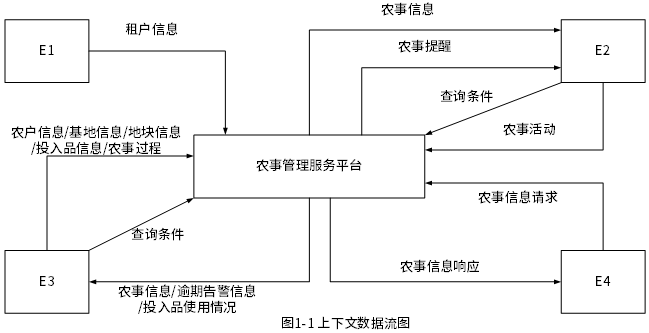
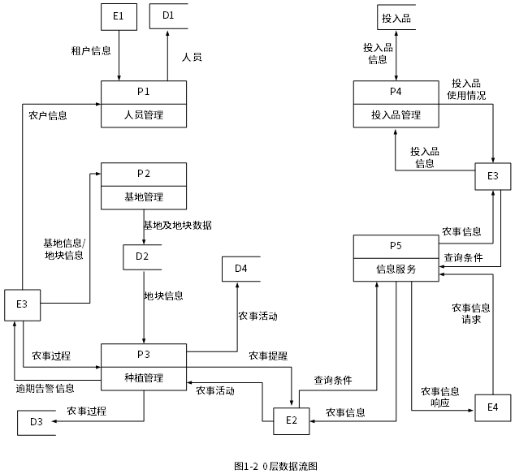
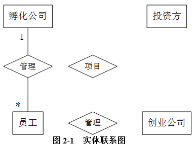
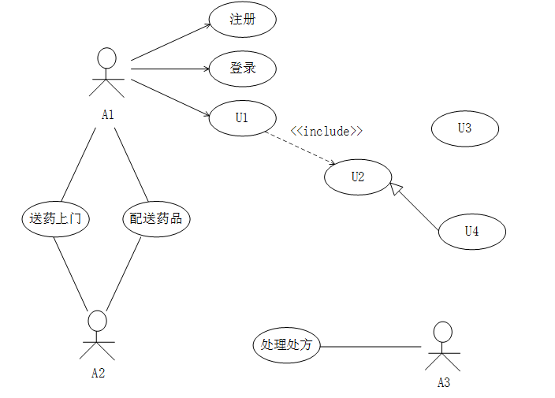
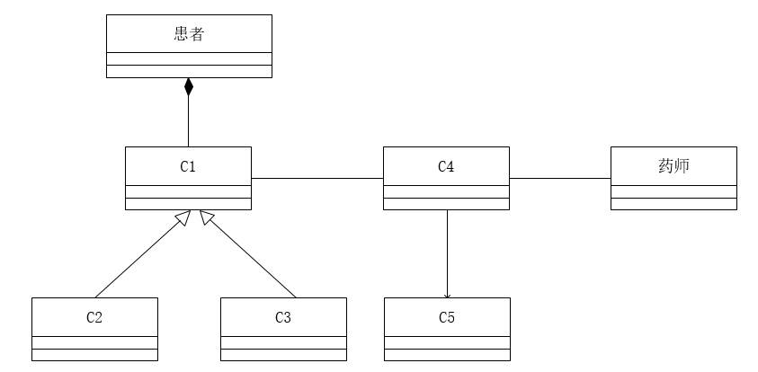
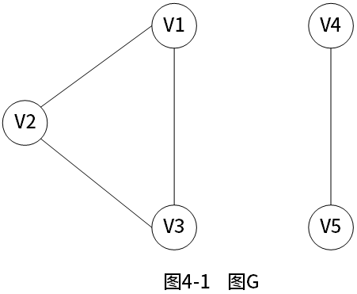
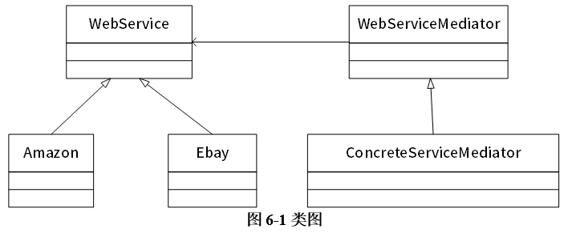

# 案例题模拟考试训练第8轮

## 训练说明

- 本卷为软件设计师下午案例题回炉模拟考试训练第8轮。
- 选题依据：从已作答的案例题模拟考试第1轮至第6轮中，按每种题型模拟扣分最多的完整真题回炉。
- 本卷共5题，每题15分，总分75分。
- 设计模式题固定选择 Java 方向，不包含 C++ 选做题。
- 题干来自本地真题原题文件，仅去除参考答案和解析。
- 文字答案直接写在本 Markdown 文件对应题目的作答区。
- 涉及补图、补全图形或图中填入的题，请在同目录对应 .drawio 文件中作答。

## 题目清单

| 试题 | 题型 | 分值 | 题源 | 作答方式 |
|---|---|---:|---|---|
| 试题一 | DFD / 结构化分析 | 15 | 2023 上半年案例题 第1题 | 试题一.drawio + 本文件作答区 |
| 试题二 | 数据库设计 / ER 图 / 关系模式 | 15 | 2019 上半年案例题 第2题 | 试题二.drawio + 本文件作答区 |
| 试题三 | UML / 面向对象分析设计 | 15 | 2021 上半年案例题 第3题 | 试题三.drawio + 本文件作答区 |
| 试题四 | 算法与程序设计 / C 语言代码填空 | 15 | 2023 上半年案例题 第4题 | 本文件作答区 |
| 试题五 | 设计模式 / Java 代码填空 | 15 | 2020 下半年案例题 第5题 | 本文件作答区 |

---

## 试题一：DFD / 结构化分析（15 分）

题源：2023 上半年案例题 第1题。

图形作答文件：试题一.drawio。

阅读下列说明和图，回答问题1至问题4，将解答填入答题纸的对应栏内。

### 说明

随着农业领域科学种植的发展，需要对农业基地及农事进行信息化管理，为租户和农户等人员提供种植相关服务。现欲开发农事管理服务平台，其主要功能是：

1. 人员管理。平台管理员管理租户；租户管理农户并为其分配负责的地块。租户和农户以人员类型区分。
2. 基地管理。租户填写基地名称、地域等描述信息，在显示的地图上绘制地块。
3. 种植管理。租户设定作物及其从种植到采收的整个农事过程，包括农事活动及其实施计划；农户根据相应农事过程提醒进行农事活动并记录。系统会在设定时间向农户进行农事提醒；对逾期未实施活动向租户发出逾期告警。
4. 投入品管理。租户统一维护化肥、杀虫剂等投入品信息，农户在农事活动中设定投入品的实际消耗。
5. 信息服务。用户按查询条件发起农事信息请求，对相关地块农事活动实施情况（如与农事过程比对）等农事信息进行筛选、对比和统计等处理，并将响应信息进行展示。系统也给其他第三方软件提供API接口，通过接口访问的方式，提供账号、密码和查询条件发起农事信息请求，返回特定格式的农事信息。无查询条件时默认返回账号下的所有信息，多查询条件时返回满足全部条件的信息。

现采用结构化方法对农事管理服务平台进行分析与设计，获得如图1-1所示的上下文数据流图和图1-2所示的0层数据流图。





### 问题

【问题1】（4分）

使用说明中的词语，给出图1-1中的实体E1~E4的名称。

【问题2】（4分）

使用说明中的词语，给出图1-2中的数据存储D1~D4的名称。

【问题3】（4分）

根据说明和图中术语，补充图1-2中缺失的数据流及其起点和终点。

【问题4】（3分）

根据说明，给出“农事信息请求”数据流的组成。

### 作答区
【问题1】

E1：平台管理员  
E2：农户  
E3：租户  
E4：第三方软件  

【问题2】

D1：人员信息文件  
D2：基地及地块文件  
D3：农事过程文件  
D4：农事活动文件  

【问题3】

数据流：投入品实际消耗，起点：D4农事活动文件，终点：P4投入品管理  
数据流：农事活动实施情况，起点：D4农事活动文件，终点：P5信息服务  
数据流：地块信息，起点：D2基地及地块文件，终点：P1人员管理  
数据流：地块信息，起点：D2基地及地块文件，终点：P5信息服务  
数据流：用户信息，起点：D1人员信息文件，终点：P5信息服务  
数据流：农事过程信息，起点：D3人农事过程文件，终点：P5信息服务  

【问题4】

用户账号、用户密码、地块查询条件、农事活动查询条件、农事过程查询条件

---

## 试题二：数据库设计 / ER 图 / 关系模式（15 分）

题源：2019 上半年案例题 第2题。

图形作答文件：试题二.drawio。

阅读下列说明，回答问题1至问题3，将解答填入答题纸的对应栏内。

### 说明

某创业孵化基地管理若干孵化公司和创业公司，为规范管理创业项目投资业务，需要开发一个信息系统。请根据下述需求描述完成该系统的数据库设计。

### 需求描述

1. 记录孵化公司和创业公司的信息。孵化公司信息包括公司代码、公司名称、法人代表名称、注册地址和一个电话；创业公司信息包括公司代码、公司名称和一个电话。孵化公司和创业公司的公司代码编码不同。
2. 统一管理孵化公司和创业公司的员工。员工信息包括工号、身份证号、姓名、性别、所属公司代码和一个手机号，工号唯一标识每位员工。
3. 记录投资方信息。投资方信息包括投资方编号、投资方名称和一个电话。
4. 投资方和创业公司之间依靠孵化公司牵线建立创业项目合作关系，具体实施由孵化公司的一位员工负责协调投资方和创业公司的一个创业项目。一个创业项目只属于一个创业公司，但可以接受若干投资方的投资。创业项目信息包括项目编号、创业公司代码、投资方编号和孵化公司员工工号。

### 概念模型设计

根据需求阶段收集的信息，设计的实体联系图（不完整）如图2-1所示。



### 逻辑结构设计

根据概念模型设计阶段完成的实体联系图，得出如下关系模式（不完整）：

```text
孵化公司（公司代码，公司名称，法人代表名称，注册地址，电话）
创业公司（公司代码，公司名称，电话）
员工（工号，身份证号，姓名，性别， （a），手机号）
投资方（投资方编号、投资方名称，电话）
项目（项目编号，创业公司代码#，（b），孵化公司员工工号#）
```

### 问题

【问题1】（5分）

根据问题描述，补充图2-1的实体联系图。

【问题2】（4分）

补充逻辑结构设计结果中的（a）、（b）两处空缺及完整性约束关系。

【问题3】（6分）

若创业项目的信息还需要包括投资额和投资时间，那么：

（1）是否需要增加新的实体来存储投资额和投资时间？

（2）如果增加新的实体，请给出新实体的关系模式，并对图2-1进行补充。如果不需要增加新的实体，请将“投资额”和“投资时间”两个属性补充连线到图2-1合适的对象上，并对变化的关系模式进行修改 。

### 作答区
【问题1】

投资方*-投资-*项目  
创业公司1-管理-*员工
孵化公司1-孵化-*项目
员工1-协调-*项目
项目*-属于-1创业公司


【问题2】

（a）所属公司代码#  
（b）投资方编号#  
主键：项目编号  
外键：所属公司代码、投资方编号、孵化公司员工工号

【问题3】

（1）  
不需要  

（2）
投资额、投资时间增加到项目关系模式  
项目（项目编号，创业公司代码#，投资方编号#，投资额，投资时间，孵化公司员工工号#）  
项目主键：（项目编号，投资方编号，投资时间）  
项目外键：所属公司代码、投资方编号、孵化公司员工工号

---

## 试题三：UML / 面向对象分析设计（15 分）

题源：2021 上半年案例题 第3题。

图形作答文件：试题三.drawio。

阅读下列说明和图，回答问题1至问题3，将解答填入答题纸的对应栏内。

### 说明

某中医医院拟开发一套线上抓药APP，允许患者凭借该医院医生开具的处方线上抓药，并提供免费送药上门服务。该系统的主要功能描述如下：

1. 注册。患者扫描医院提供的二维码进行注册，注册过程中，患者需提供其病历号，系统根据病历号自动获取患者基本信息。
2. 登录。已注册的患者可以登录系统进行线上抓药，未注册的患者系统拒绝其登录。
3. 确认处方。患者登录后，可以查看医生开具的所有处方。患者选择需要抓药的处方和数量（需要抓几副药）， 同时说明是否需要煎制。选择取药方式：自行到店取药或者送药上门，若选择送药上门，患者需要提供收货人姓名、联系方式和收货地址。系统自动计算本次抓药的费用，患者可以使用微信或支付宝等支付方式支付费用。支付成功之后，处方被发送给药师进行药品配制。
4. 处理处方。药师根据处方配置好药品，若患者要求煎制，药师对配置好的药品进行煎制。煎制完成，药师将对该处方设置已完成。若患者选择的是自行取药，取药后确认已取药。
5. 药品派送。处方完成后，对于选择送药上门的患者，系统将给快递人员发送药品的配置信息，等待快递人员来取药；并给患者发送收获验证码。
6. 送药上门。快递人员将配置好的药品送到患者指定的收货地址。患者收获时，向快递人员出示收获验证码，快递人员使用该验证码确认药品已送到。





### 问题

【问题1】 (7分)

根据说明中的描述，给出图3-1中A1~ A3所对应的参与者名称和U1 ~U4处所对应的用例名称。

【问题2】    (5分)

根据说明中的描述，给出图3-2中C1~C5所对应的类名。

【问题3】    (3分)

简要解释用例之间的include、extend 和generalize关系的内涵。

### 作答区

【问题1】 

A1：患者  
A2：快递人员  
A3：药师  
U1：确认处方  
U2：支付费用  
U3：查看处方  
U4：微信或支付宝支付  

【问题2】

C1：支付方式  
C2：微信支付  
C3：支付宝支付  
C4：处方  
C5：快递员 

【问题3】

include：表示一个主用例必然包含一个子用例。  
extend：表示一个主用例的发生可能会发生一个子用例。  
generalize：表示泛化，一个主用例可能有多种执行方式。

---

## 试题四：算法与程序设计 / C 语言代码填空（15 分）

题源：2023 上半年案例题 第4题。

阅读下列说明和C代码，回答问题1至问题2，将解答写在答题纸的对应栏内。

### 说明

下面的C程序采用深度优先遍历（DFS）来计算图G中的连通分量数。其中图G采用邻接表表示。

### 主要变量说明

- G：图，用邻接表存储
- visited[]：数组，长度为Max Vnum，visited[i] = 0 表示顶点i未被访问；visited[i] = 1 表示顶点i已经被访问
- count：图G的连通分量数

### C代码

```c
#include <stdio.h>
#define Max Vnum 100
int visited[Max Vnum]={0};

/* 顶点节点 */
typedef struct ArcNode{
    int adjvex;                /*顶点编号，从0开始*/
    struct ArcNode *nextarc;   /*指向下一个邻接点*/
}ArcNode;

/* 顶点单链表头节点 */
typedef struct {
    char *data;                /*顶点标签，如“v1" */
    ArcNode *firstarc;         /*指向第一个邻接点*/
}AdjList[Max Vnum];

/* 图 */
typedef struct {
    int vexnum, arcnum;        /*图的顶点数和边数*/
    AdjList vertices;          /*图的邻接表*/
}AGraph;

/* 从顶点v开始深度优先遍历DFS图G */
void DFS(AGraph G, int v){
    ArcNode *p;
    visited[v]= 1;
    p = G.vertices[v].firstarc;
    while(p != NULL){
        if(visited[__(1)___]==0){
            DFS(G,p- > adjvex);
        }
        _____(2)_____;
    }
}

/* 计算图G的连通分量数 */
int getNum(AGraph G){
    int i, count = 1;
    ____(3)____;
    for(i = 0; i < G.vexnum;i++){
        if(visited[i] ==0){
            ____(4)____;
            DFS(G,i);
        }
    }
    ____(5)____;
}
```
### 问题

【问题1】（10分）

根据以上说明和C代码，填充C代码中的空(1) ~ (5)。

【问题2】（5分）

给出图4-1中图G的邻接表表示。



### 作答区

【问题1】（10分）

（1）p -> adjvex  
（2）p = G.vertices[v].firstarc.nextarc;  
（3）  
（4）count++  
（5）return count  

【问题2】

V1:V2、V3  
V2:V1、V3  
V3:V1、V2  
V4:V5  
V5:V4  

---

## 试题五：设计模式 / Java 代码填空（15 分）

题源：2020 下半年案例题 第5题。

阅读下列说明和Java代码，将应填入（n） 处的字句写在答题纸的对应栏内。

### 说明

在线支付是电子商务的一个重要环节，不同的电子商务平台提供了不同的支付接口。现在需要整合不同电子商务平台的支付接口，使得客户在不同平台上购物时，不需要关心具体的支付接口。拟采用中介者(Mediator) 设计模式来实现该需求，所设计的类图如图6-1所示。



### Java代码

```java
import java.util.*;
interface WebServiceMediator {
    public (1);
    public void SetAmazon(WebService amazon);
    public void SetEbay(WebService ebay);
}
abstract class WebService{
    protected (2) mediator;
    public abstract void SetMediator(WebServiceMediator mediator);
    public (3);
    public abstract void search(double money);
}
class ConcreteServiceMediator implements WebServiceMediator{
    private WebService amazon;
    private WebService ebay:
    public ConcreteServiceMediator() {
            amazon = null;
            ebay = null;
    }
    public void SetAmazon(WebService amazon) {
           this.amazon-amazon:
    }
    public void SetEbay(WebService ebay){
          this.ebay=ebay;
    }
    public void buy(double money,WebService service){
         if(service==amazon)
               amazon.search(money);
        else
               ebay.search(money);
    }
}
class Amazon extends WebService {
    public void SetMediator(WebServiceMediator mediator) {
         this.mediator = mediator:
    }
    public void buyService(double money) {
        (4);
    }
    public void search(double money){
        system.out.println("Amazon receive:"+money);
    }
}
class Ebay extends WebService{
    public void SetMediator(WebServiceMediator mediator) {
        this . mediator = mediator;
    }
    public void buyService(double money){
       (5) ;
}
public void search(double money){
         System.out.println("Ebay receive: "+money);
}
}
```

### 作答区
（1）void buy(double money,WebService service)  
（2）WebServiceMediator  
（3）abstract void buyService(double money)  
（4）mediator.buy(money, this)  
（5）mediator.buy(money, this)
