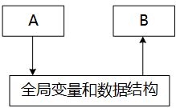
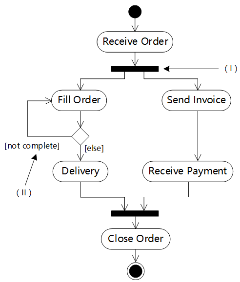

# 第12章第二轮真题训练

## 作答说明

- 本训练只包含第12章“软件系统分析与设计”相关上午题。
- 本文件不包含答案和解析；请先独立作答。
- 本轮题目已避开第12章课案例题与第12章第一轮训练题。
- 每个选择空按 1 分计，本轮共 15 题、18 个计分空，满分 18 分。
- 请按 `1.B/A 2.D ...` 的格式回复；多空题写成 `10.D/A/B` 这类格式即可。

## 覆盖说明

本轮覆盖基线来自本次重新检索并人工复核的第12章本地上午题候选池。为满足“课案例题不重复 + 第一轮不重复 + 仍保持章节相关性”，本轮优先抽取前一轮未覆盖的细粒度方向。

| 主知识点 | 本轮题号 |
| --- | --- |
| 结构化分析与 DFD | 1、2、3 |
| 模块结构、内聚、耦合与可维护性 | 4、5、6 |
| 数据库分析与设计 | 7、8 |
| UML 与面向对象建模 | 9、10、11 |
| 面向对象设计原则、实现与测试 | 12、13、14 |
| 算法分析与设计策略 | 15 |

## 训练题

### 第1题

在结构化分析中，用数据流图描述（ ）。当采用数据流图对一个图书馆管理系统进行分析时，（ ）是一个外部实体。

问题1选项：

- A. 数据对象之间的关系，用于对数据建模
- B. 数据在系统中如何被传送或变换，以及如何对数据流进行变换的功能或子功能，用于对功能建模
- C. 系统对外部事件如何响应，如何动作，用于对行为建模
- D. 数据流图中的各个组成部分

问题2选项：

- A. 读者
- B. 图书
- C. 借书证
- D. 借阅

### 第2题

软件开发过程中，需求分析阶段的输出不包括（ ）。

- A. 数据流图
- B. 实体联系图
- C. 数据字典
- D. 软件体系结构图

### 第3题

数据流图中某个加工的一组动作依赖于多个逻辑条件的取值，则用（ ）能够清楚地表示复杂的条件组合与应做的动作之间的对应关系。

- A. 流程图
- B. NS 盒图
- C. 形式语言
- D. 决策树

### 第4题

如下图所示，模块 A 和模块 B 都访问相同的全局变量和数据结构，则这两个模块之间的耦合类型为（ ）耦合。

- A. 公共
- B. 控制
- C. 标记
- D. 数据

### 第5题

某模块中有两个处理 A 和 B，分别对数据结构 X 写数据和读数据，则该模块的内聚类型为（ ）内聚。

- A. 逻辑
- B. 过程
- C. 通信
- D. 内容

### 第6题

以下关于管道-过滤器软件体系结构风格优点的叙述中，不正确的是（ ）。

- A. 构件具有良好的高内聚、低耦合的特点
- B. 支持软件复用
- C. 支持并行执行
- D. 适合交互处理应用

### 第7题

在数据库逻辑设计阶段，若实体中存在多值属性，那么将 E-R 图转换为关系模式时，（ ），得到的关系模式属于 4NF。

- A. 将所有多值属性组成一个关系模式
- B. 使多值属性不在关系模式中出现
- C. 将实体的码分别和每个多值属性独立构成一个关系模式
- D. 将多值属性和其它属性一起构成该实体对应的关系模式

### 第8题

概要设计文档的内容不包括（ ）。

- A. 体系结构设计
- B. 数据库设计
- C. 模块内算法设计
- D. 逻辑数据结构设计

### 第9题

UML 中关联是一个结构关系，描述了一组链。两个类之间（ ）关联。

- A. 不能有多个
- B. 可以有多个由不同角色标识的
- C. 可以有任意多个
- D. 多个关联必须聚合成一个

### 第10题

如下所示的 UML 图是（ ），图中（Ⅰ）表示（ ），（Ⅱ）表示（ ）。

问题1选项：

- A. 序列图
- B. 状态图
- C. 通信图
- D. 活动图

问题2选项：

- A. 合并分叉
- B. 分支
- C. 合并汇合
- D. 流

问题3选项：

- A. 分支条件
- B. 监护表达式
- C. 动作名
- D. 流名称

### 第11题

如下所示的 UML 状态图中，（ ）时，不一定会离开状态 B。

- A. 状态 B 中的两个结束状态均达到
- B. 在当前状态为 B2 时，事件 e2 发生
- C. 事件 e2 发生
- D. 事件 e1 发生

### 第12题

【考生回忆版】面向对象软件从不同层次进行测试。（ ）层测试类中定义的每个方法，相当于传统软件测试中的单元测试。

- A. 模板
- B. 系统
- C. 类
- D. 算法

### 第13题

【考生回忆版】以下（ ）不是面向对象设计的基本原则。

- A. 过程优先
- B. 单一职责
- C. 依赖倒置
- D. 开放-封闭

### 第14题

面向对象分析的目的是为了获得对应用问题的理解，其主要活动不包括（ ）。

- A. 认定并组织对象
- B. 描述对象间的相互作用
- C. 面向对象程序设计
- D. 确定基于对象的操作

### 第15题

希望用最快的速度挑选出 1000 个无序元素中前 10 个最大的元素，则最好选择（ ）排序算法。

- A. 冒泡
- B. 基数
- C. 堆
- D. 快速
