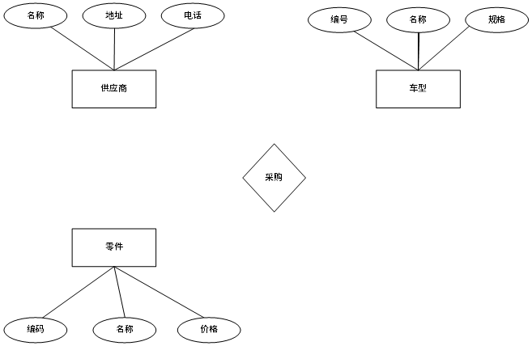

# 第14课第一轮真题训练

## 训练说明

- 课次：第14课 数据库设计
- 题源：本地希赛案例题 Markdown，`doc/Software-Designer-master/真题/xisai_md/题目/2023上半年案例题.md` 第2题（案例题）
- 总分：15分
- 建议作答时间：20分钟
- 覆盖点：E-R 图补全、三元联系、多重度、联系属性、关系模式补全、主键与外键完整性约束、新需求下的实体/联系扩展与关系模式设计
- 作答要求：请只写你的解答，不要翻看本地参考材料。讲评时将严格对照本训练文件和本地参考答案评分。

## 训练一：2023 上半年案例题 第2题

### 题面

阅读下列说明，回答问题1至问题3，将解答填入答题纸的对应栏内。

【说明】

某新能源汽车公司为了提升效率，需要开发一个汽车零件采购系统。请根据下述需求描述完成该系统的数据库设计。

【需求描述】

（1）记录供应商的信息，包括供应商的名称、地址和一个电话。

（2）记录零件的信息，包括零件的编码、名称和价格。

（3）记录车型信息，包括车型的编号、名称和规格。

（4）记录零件采购信息。某个车型的某种零件可以从多家供应商采购，某种零件也可以被多个车型采用，某家供应商也可以供应多种零件；还包括采购数量和采购日期。

【概念结构设计】

根据需求阶段收集的信息，设计的实体联系图（不完整）如图2-1所示。

图2-1 实体联系图

【逻辑结构设计】

根据概念结构设计阶段完成的实体联系图，得出如下关系模式（不完整）：

供应商（名称，地址，电话）

零件（编码，名称，价格）

车型（编号，名称，规格）

采购（车型编号，供应商名称，（a），（b），采购日期）

### 作答要求

【问题1】（5分）

根据问题描述，补充图2-1的实体联系图（不增加新的实体）。

【问题2】（3分）

补充逻辑结构设计结果中的（a）、（b）两处空缺，并标注主键和外键完整性约束。

【问题3】（7分）

该汽车公司现新增如下需求：记录车型在全国门店的销售情况。门店信息包括门店的编号、地址和电话；销售包括销售数量和销售日期等。

对原有设计进行以下修改以实现该需求：

（1）在图2-1中体现门店信息及其车型销售情况，并标明新增的实体和联系，及其必要属性。

（2）给出新增加的关系模式，并标注主键和外键完整性约束。

### 建议答题格式

#### 问题1

- 联系名称：
- 参与实体：
- 联系类型/多重度：
- 联系属性：

#### 问题2

- （a）：
- （b）：
- 采购关系主键：
- 采购关系外键：

#### 问题3

- 新增实体：
- 新增联系：
- 联系类型/多重度：
- 实体属性：
- 联系属性：
- 新增关系模式：
- 新增关系主键：
- 新增关系外键：
