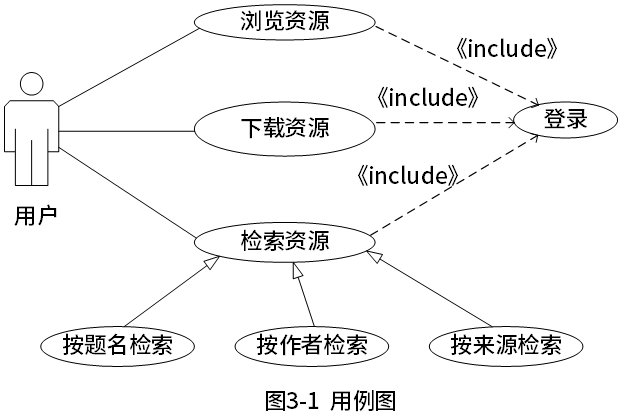
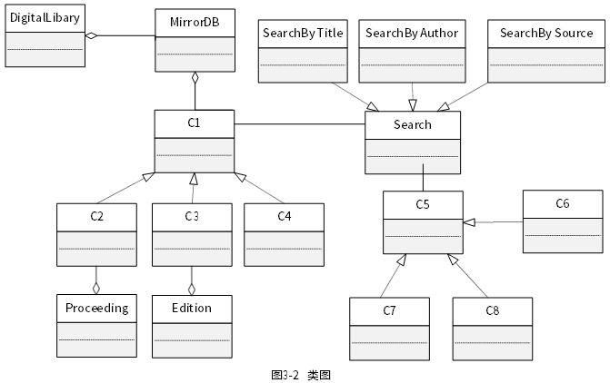

# 第15课第一轮真题训练

> 本文件为 UML / 面向对象分析设计专项训练入口。答案与解析默认隐藏，不写入本训练文件。

## 训练一：数字图书馆系统 UML 分析与设计

题源：2023年上半年软件设计师考试应用技术真题，试题三。

总分：15分

建议作答时间：25分钟

覆盖点：用例图阅读、类图类名映射、类属性识别、面向对象扩展设计判断。

### 题面

阅读下列说明和图，回答问题1至问题3，将解答填入答题纸的对应栏内。

【说明】

某高校图书馆购买了若干学术资源的镜像数据库（MirrorDB）资源，现要求开发一套数字图书馆（Digital Library）系统，面向校内用户（User）提供学术资源（Resource）的浏览、检索和下载服务，系统的主要要求描述如下：

（1）系统中存储了每个镜像数据库的基本信息，包括：数据库名称、访问地址、数据库属性以及数据库简介等信息，用户进入某个镜像数据库后，可以浏览、检索以及下载其中的学术资源。

（2）学术资源包括会议论文（Conference Paper）、期刊论文（Journal Article）以及学位论文（Thesis）等。系统中存储了每个学术资源的题名、作者、发表时间、来源（哪个镜像数据库）、被引次数、下载次数等信息。对于会议论文，还需记录会议名称、召开时间以及召开地点；同一次会议的论文被收录在会议集（Proceeding）中。对于期刊论文，还需记录期刊名称、出版月份、期号以及主办单位；同一期号的论文被收录在一本期刊（Edition）中。对于学位论文，记录了学位类别（博士/硕士）、毕业学校、专业以及指导教师。

会议集包含发表在该会议（在某个特定时间段、特定地点召开）上的所有文章。期刊的每一期在特定时间发行，其中包含若干篇文章。

（3）系统用户（User）包括在校学生（Student）、教师（Teacher）以及其他在职人员（Staff）。用户使用学校的统一身份认证登录系统后，使用系统提供的各项服务。

（4）系统提供多种资源检索的方式，主要包括：按照资源的题名检索（Search By Title）、按照作者名称检索（Search By Author）、按照来源检索（Search By Source）等。

（5）用户可以下载资源，系统记录每个资源被下载的次数。

现采用面向对象分析与设计方法开发该系统，得到如图3-1所示的用例图以及图3-2所示的初始类图。

### 作答要求

【问题1】（8分）

根据说明中的描述，给出图3-2中的C1~C8所对应的类名。

【问题2】（4分）

根据说明中的描述，给出图3-2中的类C1~C4的关键属性。

【问题3】（3分）

在该系统的开发过程中遇到了新的要求：用户能够在系统中对其所关注的数字资源注册他引通知，若该资源的他引次数发生变化，系统可以及时通知该用户。为了实现这个新的要求，可以在图3-2所示的类图中增加哪种设计模式？用150字以内文字解释选择该模式的原因。

### 建议答题格式

问题1：

- C1：
- C2：
- C3：
- C4：
- C5：
- C6：
- C7：
- C8：

问题2：

- C1关键属性：
- C2关键属性：
- C3关键属性：
- C4关键属性：

问题3：

- 设计模式：
- 选择原因（150字以内）：
