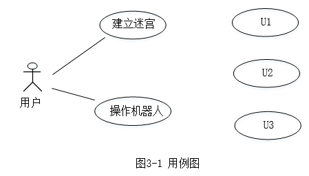
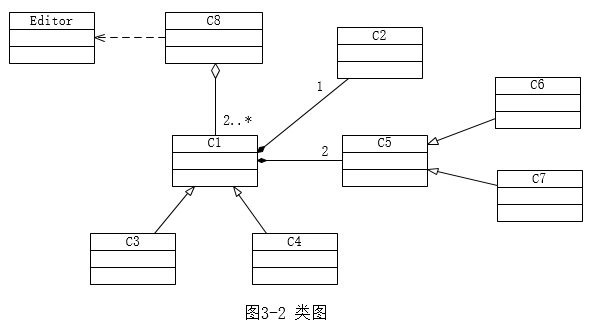

# 第15课第三轮真题训练

> 本文件为 UML / 面向对象分析设计专项训练入口。答案与解析默认隐藏，不写入本训练文件。

## 训练一：吃金币游戏 UML 分析与设计

题源：2021年下半年软件设计师考试应用技术真题，试题三。

总分：15分

建议作答时间：25分钟

覆盖点：用例图用例识别、用例关系判断、类图泛化 / 组合关系下的类名映射。

### 题面

阅读下列说明和图，回答问题1至问题3，将解答填入答题纸的对应栏内。

【说明】

某游戏公司欲开发一款吃金币游戏。游戏的背景为一种回廊式迷宫（Maze），在迷宫的不同位置上设置有墙。迷宫中有两种类型的机器人（Robots）：小精灵（PacMan）和幽灵（Ghost）。游戏的目的就是控制小精灵在迷宫内游走，吞吃迷宫路径上的金币，且不能被幽灵抓到。幽灵在迷宫中游走，并会吃掉遇到的小精灵。机器人游走时，以单位距离的倍数计算游走路径的长度。当迷宫中至少存在一个小精灵和一个幽灵时，游戏开始。

机器人上有两种传感器，使机器人具有一定的感知能力。这两种传感器分别是：

（1）前向传感器（FrontSensor），探测在机器人当前位置的左边、右边和前方是否有墙（机器人遇到墙时，必须改变游走方向）。机器人根据前向传感器的探测结果，决定朝哪个方向运动。

（2）近距离传感器（ProxiSesor），探测在机器人的视线范围内（正前方）是否存在隐藏的金币或幽灵。近距离传感器并不报告探测到的对象是否正在移动以及朝哪个方向移动。但是如果近距离传感器的连续两次探测结果表明被探测对象处于不同的位置，则可以推导出该对象在移动。

另外，每个机器人都设置有一个计时器（Timer），用于支持执行预先定义好的定时事件。

机器人的动作包括：原地向左或向右旋转90°；向前或向后移动。

建立迷宫：用户可以使用编辑器（Editor）编写迷宫文件，建立用户自定义的迷宫。将迷宫文件导入游戏系统建立用户自定义的迷宫。

现采用面对对象分析与设计方法开发该游戏，得到如图3-1所示的用例图以及图3-2所示的初始类图。

### 作答要求

【问题1】（3分）

根据说明中的描述，给出图3-1中U1~U3所对应的用例名。

【问题2】（4分）

图3-1中用例U1~U3分别与哪个（哪些）用例之间有关系，是何种关系？

【问题3】（8分）

根据说明中的描述，给出图3-2中C1~C8所对应的类名。

### 建议答题格式

问题1：

- U1：
- U2：
- U3：

问题2：

- U1 与哪些用例有关系、关系类型：
- U2 与哪些用例有关系、关系类型：
- U3 与哪些用例有关系、关系类型：

问题3：

- C1：
- C2：
- C3：
- C4：
- C5：
- C6：
- C7：
- C8：
