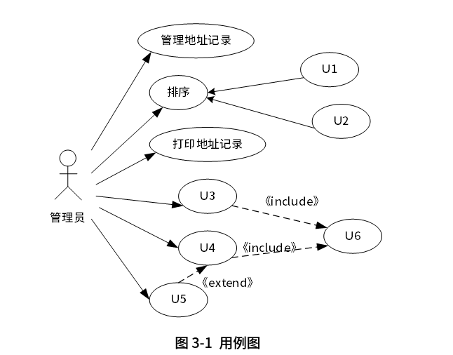
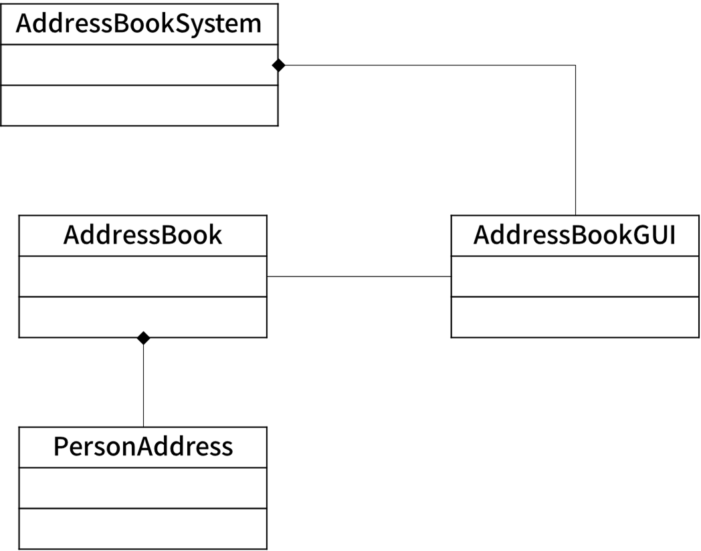

# 第15课第二轮真题训练

> 本文件为 UML / 面向对象分析设计专项训练入口。答案与解析默认隐藏，不写入本训练文件。

## 训练一：地址簿管理系统 UML 分析与设计

题源：2022年上半年软件设计师考试应用技术真题，试题三。

总分：15分

建议作答时间：25分钟

覆盖点：用例图用例识别、类图属性与方法抽取、extend / include 关系含义辨析。

### 题面

阅读下列说明和图，回答问题1至问题3，将解答填入答题纸的对应栏内。

【说明】

某公司的人事部门拥有一个地址簿（AddressBook）管理系统（AddressBookSystem），用于管理公司所有员工的地址记录（PersonAddress）。员工的地址记录包括：姓名、住址、城市、省份、邮政编码以及联系电话等信息。

管理员可以完成对地址簿中地址记录的管理操作，包括：

（1）管理地址记录。根据公司的人员变动情况，对地址记录进行添加、修改、删除等操作。

（2）排序。按照员工姓氏的字典顺序或邮政编码对系统中的所有记录进行排序。

（3）打印地址记录。以邮件标签的格式打印一个地址单独的地址簿。

系统会对地址记录进行管理，为便于管理，管理员在系统中为公司的不同部门建立员工的地址簿的操作，包括：

（1）创建地址簿。新建一个地址簿并保存。

（2）打开地址簿。打开一个已有的地址簿。

（3）修改地址簿。对打开的地址簿进行修改并保存。

系统将提供一个GUI（图形用户界面）实现对地址簿的各种操作。

现采用面向对象方法分析并设计该地址簿管理系统，得到如图3-1所示的用例图和图3-2所示的类图。

### 作答要求

【问题1】（6分）

根据说明中的描述，给出图3-1中U1～U6所对应的用例名。

【问题2】（5分）

根据说明中的描述，给出图3-2中类AddressBook的主要属性和方法以及类PersonAddress的主要属性（可以使用说明中的文字）。

【问题3】（4分）

根据说明中的描述以及图3-1所示的用例图，请简要说明extend和include关系的含义是什么？

### 建议答题格式

问题1：

- U1：
- U2：
- U3：
- U4：
- U5：
- U6：

问题2：

- AddressBook 的主要属性：
- AddressBook 的主要方法：
- PersonAddress 的主要属性：

问题3：

- extend 关系含义：
- include 关系含义：
