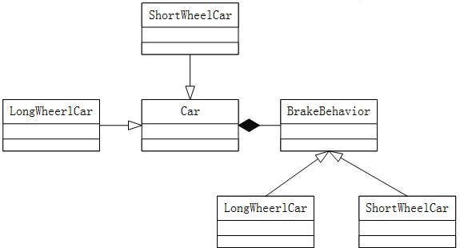

# 第16课第一轮真题训练：设计模式专项

## 作答说明

- 本轮先完成训练一。
- 本题为 Java 代码题。
- 请按空号作答，只写应填入各空的代码或字句。
- 本文件不包含参考答案、解析或提示性结论。

## 训练一：汽车竞速游戏刹车痕迹

题源：2019年上半年软件设计师考试应用技术真题，第5题。

总分：15分。

建议作答时间：20分钟。

覆盖点：设计模式代码填空、抽象接口识别、组合引用、方法调用、运行时行为替换。

### 题面

阅读下列说明和 Java 代码，将应填入（n）处的字句写在答题纸的对应栏内。

【说明】

某软件公司欲开发一款汽车竞速类游戏，需要模拟长轮胎和短轮胎急刹车时在路面上留下的不同痕迹，并考虑后续能模拟更多种轮胎急刹车时的痕迹。现采用某设计模式来实现该需求，所设计的类图如图5-1所示。



### Java 代码

```java
import java.util.*;

interface BrakeBehavior {
    public （1）;
    /* 其余代码省略 */
}

class LongWheelBrake implements BrakeBehavior {
    public void stop() {
        System.out.println("模拟长轮胎刹车痕迹！");
    }
    /* 其余代码省略 */
}

class ShortWheelBrake implements BrakeBehavior {
    public void stop() {
        System.out.println("模拟短轮胎刹车痕迹！");
    }
    /* 其余代码省略 */
}

abstract class Car {
    protected （2） wheel;

    public void brake() {
        （3）;
    }

    /* 其余代码省略 */
}

class ShortWheelCar extends Car {
    public ShortWheelCar(BrakeBehavior behavior) {
        （4）;
    }

    /* 其余代码省略 */
}

class StrategyTest {
    public static void main(String[] args) {
        BrakeBehavior brake = new ShortWheelBrake();
        ShortWheelCar car1 = new ShortWheelCar(brake);
        car1.（5）;
    }
}
```

### 作答要求

请填写（1）~（5）处的代码或字句。

### 建议答题格式

（1）

（2）

（3）

（4）

（5）

