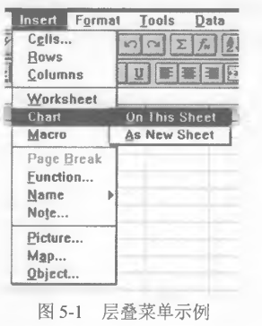
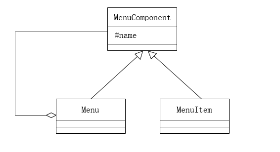

# 第16课第三轮真题训练：设计模式专项

## 作答说明

- 本轮完成训练一。
- 本题为 Java 代码题。
- 请按空号作答，只写应填入各空的代码或字句。
- 本文件不包含参考答案、解析或提示性结论。

## 训练一：层叠菜单组织

题源：2021年上半年软件设计师考试应用技术真题，第6题。

总分：15分。

建议作答时间：20分钟。

覆盖点：设计模式代码填空、整体-部分结构、抽象构件、叶子节点、容器节点、递归打印。

### 题面

阅读下列说明和 Java 代码，将应填入（n）处的字句写在答题纸的对应栏内。

【说明】

层叠菜单是窗口风格的软件系统中经常采用的一种系统功能组织方式。层叠菜单（如图5-1示例）中包含的可能是一个菜单项（直接对应某个功能），也可能是一个子菜单，现在采用组合（Composite）设计模式实现层叠菜单，得到如图5-2所示的类图。





### Java 代码

```java
import java.util.*;

abstract class MenuComponent {
    // 构成层叠菜单的元素
    （1） String name; // 菜单项或子菜单名称

    public void printName() {
        System.out.println(name);
    }

    public （2）;

    public abstract boolean removeMenuElement(MenuComponent element);

    public （3）;
}

class MenuItem extends MenuComponent {
    public MenuItem(String name) {
        this.name = name;
    }

    public boolean addMenuElement(MenuComponent element) {
        return false;
    }

    public boolean removeMenuElement(MenuComponent element) {
        return false;
    }

    public List<MenuComponent> getElement() {
        return null;
    }
}

class Menu extends MenuComponent {
    private （4）;

    public Menu(String name) {
        this.name = name;
        this.elementList = new ArrayList<MenuComponent>();
    }

    public boolean addMenuElement(MenuComponent element) {
        return elementList.add(element);
    }

    public boolean removeMenuElement(MenuComponent element) {
        return elementList.remove(element);
    }

    public List<MenuComponent> getElement() {
        return elementList;
    }
}

class CompositeTest {
    public static void main(String[] args) {
        MenuComponent mainMenu = new Menu("Insert");
        MenuComponent subMenu = new Menu("Chart");
        MenuComponent element = new MenuItem("On This Sheet");

        （5）;

        subMenu.addMenuElement(element);
        printMenus(mainMenu);
    }

    private static void printMenus(MenuComponent ifile) {
        ifile.printName();
        List<MenuComponent> children = ifile.getElement();
        if (children == null) {
            return;
        }
        for (MenuComponent element : children) {
            printMenus(element);
        }
    }
}
```

### 作答要求

请填写（1）~（5）处的代码或字句。

### 建议答题格式

（1）

（2）

（3）

（4）

（5）

