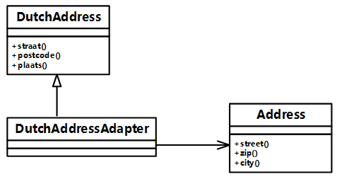

# 第16课第五轮真题训练：设计模式专项

## 作答说明

- 本轮完成训练一。
- 本题为 Java 代码题。
- 请按空号作答，只写应填入各空的代码或字句。
- 本文件不包含参考答案、解析或提示性结论。

## 训练一：地址信息接口适配

题源：2016年上半年软件设计师考试应用技术真题，第6题。

总分：15分。

建议作答时间：20分钟。

覆盖点：设计模式代码填空、接口转换、适配器持有被适配对象、方法映射、客户端统一调用。

### 题面

阅读下列说明和 Java 代码，将应填入（n）处的字句写在答题纸的对应栏内。

【说明】

某软件系统中，已设计并实现了用于显示地址信息的类 Address（如图6-1所示），现要求提供基于 Dutch 语言的地址信息显示接口。为了实现该要求并考虑到以后可能还会出现新的语言的接口，决定采用适配器（Adapter）模式实现该要求，得到如图6-1所示的类图。



### Java 代码

```java
import java.util.*;

class Address {
    public void street() {
        // 实现代码省略
    }

    public void zip() {
        // 实现代码省略
    }

    public void city() {
        // 实现代码省略
    }

    // 其他成员省略
}

class DutchAddress {
    public void straat() {
        // 实现代码省略
    }

    public void postcode() {
        // 实现代码省略
    }

    public void plaats() {
        // 实现代码省略
    }

    // 其他成员省略
}

class DutchAddressAdapter extends DutchAddress {
    private （1）;

    public DutchAddressAdapter(Address addr) {
        address = addr;
    }

    public void straat() {
        （2）;
    }

    public void postcode() {
        （3）;
    }

    public void plaats() {
        （4）;
    }

    // 其他成员省略
}

class Test {
    public static void main(String[] args) {
        Address addr = new Address();
        （5）;

        System.out.println("\n The DutchAddress\n");
        testDutch(addrAdapter);
    }

    static void testDutch(DutchAddress addr) {
        addr.straat();
        addr.postcode();
        addr.plaats();
    }
}
```

### 作答要求

请填写（1）~（5）处的代码或字句。

### 建议答题格式

（1）

（2）

（3）

（4）

（5）

