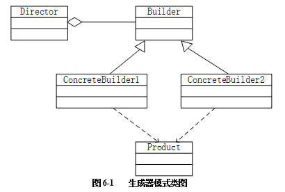

# 第16课第四轮真题训练：设计模式专项

## 作答说明

- 本轮完成训练一。
- 本题为 Java 代码题。
- 请按空号作答，只写应填入各空的代码或字句。
- 本文件不包含参考答案、解析或提示性结论。

## 训练一：复杂对象构建

题源：2018年上半年软件设计师考试应用技术真题，第6题。

总分：15分。

建议作答时间：20分钟。

覆盖点：设计模式代码填空、复杂对象构建过程、Builder 接口、具体建造者、Director 调度。

### 题面

阅读下列说明和 Java 代码，将应填入（n）处的字句写在答题纸的对应栏内。

【说明】

生成器（Builder）模式的意图是将一个复杂对象的构建与它的表示分离，使得同样的构建过程可以创建不同的表示。图6-1所示为其类图。



### Java 代码

```java
import java.util.*;

class Product {
    private String partA;
    private String partB;

    public Product() {
    }

    public void setPartA(String s) {
        partA = s;
    }

    public void setPartB(String s) {
        partB = s;
    }
}

interface Builder {
    public （1）;

    public void buildPartB();

    public （2）;
}

class ConcreteBuilder1 implements Builder {
    private Product product;

    public ConcreteBuilder1() {
        product = new Product();
    }

    public void buildPartA() {
        （3）("Component A");
    }

    public void buildPartB() {
        （4）("Component B");
    }

    public Product getResult() {
        return product;
    }
}

class ConcreteBuilder2 implements Builder {
    // 代码省略
}

class Director {
    private Builder builder;

    public Director(Builder builder) {
        this.builder = builder;
    }

    public void construct() {
        （5）;
        // 代码省略
    }
}

class Test {
    public static void main(String[] args) {
        Director director1 = new Director(new ConcreteBuilder1());
        director1.construct();
    }
}
```

### 作答要求

请填写（1）~（5）处的代码或字句。

### 建议答题格式

（1）

（2）

（3）

（4）

（5）

