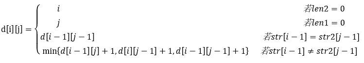

# 第17课第二轮真题训练：算法与代码专项

## 作答说明

- 本轮共 1 道算法与代码案例题，满分 15 分。
- 本轮只训练算法与代码案例题，不训练排序题。
- 请先独立作答，不要查看原题文件中的参考答案和解析。
- 建议限时 30 分钟。
- 作答时请按 `问题1 / 问题2 / 问题3` 分别写答案。
- 问题1 请写出空 `(1)` 至 `(4)` 的填空内容。
- 问题2 请写出空 `(5)`、`(6)`，并用一句话说明判断依据。
- 问题3 请写出必要的手算过程，不能只写最终数值。
- 本轮合格线按算法题专项规则调整为 50%，即 `7.5 / 15`。

## 训练一：2021下半年案例题 第4题

阅读下列说明和 C 代码，回答问题1至问题3，将解答写在答题纸的对应栏内。

【说明】

生物学上通常采用编辑距离来定义两个物种 DNA 序列的相似性，从而刻画物种之间的进化关系。具体来说，编辑距离是指将一个字符串变换为另一个字符串所需要的最小操作次数。操作有三种，分别为：插入一个字符、删除一个字符以及将一个字符修改为另一个字符。

用字符数组 `str1` 和 `str2` 分别表示长度分别为 `len1` 和 `len2` 的字符串，定义二维数组 `d` 记录求解编辑距离的子问题最优解，则该二维数组可以递归定义为：



【C 代码】

下面是算法的 C 语言实现。

（1）常量和变量说明

- `A`、`B`：两个字符数组。
- `d`：二维数组。
- `i`、`j`：循环变量。
- `temp`：临时变量。

（2）C 程序

```c
#include <stdio.h>
#define N 100

char A[N] = "CTGA";
char B[N] = "ACGCTA";
int d[N][N];

int min(int a, int b) {
    return a < b ? a : b;
}

int editdistance(char *str1, int len1, char *str2, int len2) {
    int i, j;
    int diff;
    int temp;

    for (i = 0; i <= len1; i++) {
        d[i][0] = i;
    }

    for (j = 0; j <= len2; j++) {
        _____(1)_____;
    }

    for (i = 1; i <= len1; i++) {
        for (j = 1; j <= len2; j++) {
            if (_____(2)_____) {
                d[i][j] = d[i - 1][j - 1];
            } else {
                temp = min(d[i - 1][j] + 1, d[i][j - 1] + 1);
                d[i][j] = min(temp, _____(3)_____);
            }
        }
    }

    return _____(4)_____;
}
```

## 问题1（8分）

根据说明和 C 代码，填充 C 代码中的空 `(1)` 至 `(4)`。

## 问题2（4分）

根据说明和 C 代码，算法采用了 `(5)` 设计策略，时间复杂度为 `(6)`（用 O 符号表示，两个字符串的长度分别用 `m` 和 `n` 表示）。

## 问题3（3分）

已知两个字符串 `A = "CTGA"` 和 `B = "ACGCTA"`，根据说明和 C 代码，可得出这两个字符串的编辑距离为 `(7)`。

## 答题区

### 问题1

- `(1)`：
- `(2)`：
- `(3)`：
- `(4)`：

### 问题2

- `(5)`：
- `(6)`：
- 判断依据：

### 问题3

- `(7)`：
- 手算过程：
