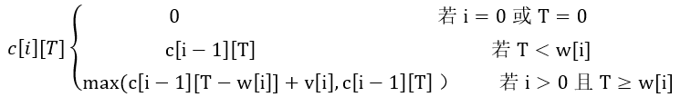

# 第17课第五轮真题训练：算法与代码专项

## 作答说明

- 本轮共 1 道算法与代码案例题，满分 15 分。
- 请先独立作答，不要查看原题文件中的参考答案和解析。
- 建议限时 30 分钟。
- 作答时请按原题 `问题1 / 问题2 / 问题3` 分别写答案。
- 问题1 请写出空 `(1)` 至 `(4)`。
- 问题2 请写出空 `(5)`、`(6)`。
- 问题3 请写出空 `(7)`。
- 本轮合格线按算法题专项规则调整为 50%，即 `7.5 / 15`。

## 训练一：2019下半年案例题 第4题

阅读下列说明和 C 代码，回答问题1至问题3。

【说明】

0-1背包问题定义为：给定 `i` 个物品的价值 `v[1...i]`、重量 `w[1...i]` 和背包容量 `T`，每个物品装到背包里或者不装到背包里。求最优的装包方案，使得所得到的价值最大。

0-1背包问题具有最优子结构性质。定义 `c[i][T]` 为最优装包方案所获得的最大价值，则可得到如下所示的递归式。



【C 代码】

下面是算法的 C 语言实现。

（1）常量和变量说明

- `T`：背包容量。
- `v[]`：价值数组。
- `w[]`：重量数组。
- `c[][]`：`c[i][j]` 表示前 `i` 个物品在背包容量为 `j` 的情况下，最优装包方案所能获得的最大价值。

（2）C 程序

```c
#include <stdio.h>
#include <math.h>

#define N 6
#define maxT 1000

int c[N][maxT] = {0};

int Memoized_Knapsack(int v[N], int w[N], int T) {
    int i;
    int j;

    for (i = 0; i < N; i++) {
        for (j = 0; j <= T; j++) {
            c[i][j] = -1;
        }
    }

    return Calculate_Max_Value(v, w, N - 1, T);
}

int Calculate_Max_Value(int v[N], int w[N], int i, int j) {
    int temp = 0;

    if (c[i][j] != -1) {
        return _____(1)_____;
    }

    if (i == 0 || j == 0) {
        c[i][j] = 0;
    } else {
        c[i][j] = Calculate_Max_Value(v, w, i - 1, j);
        if (_____(2)_____) {
            temp = _____(3)_____;
            if (c[i][j] < temp) {
                _____(4)_____;
            }
        }
    }

    return c[i][j];
}
```

## 问题1（8分）

根据说明和 C 代码，填充 C 代码中的空 `(1)` 至 `(4)`。

## 问题2（4分）

根据说明和 C 代码，算法采用了 `(5)` 设计策略。在求解过程中，采用了 `(6)`（自底向上或者自顶向下）的方式。

## 问题3（3分）

若 5 项物品的价值数组和重量数组分别为 `v[] = {0, 1, 6, 18, 22, 28}` 和 `w[] = {0, 1, 2, 5, 6, 7}`，背包容量为 `T = 11`，则获得的最大价值为 `(7)`。

## 答题区

### 问题1

- `(1)`：
- `(2)`：
- `(3)`：
- `(4)`：

### 问题2

- `(5)`：
- `(6)`：

### 问题3

- `(7)`：
