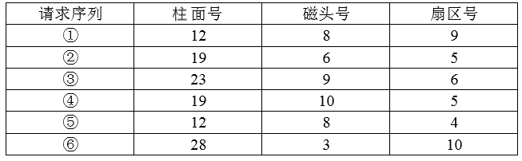

# 第4章第三轮真题训练

## 使用说明

1. 本轮共 `7` 题，合计 `10` 个空。
2. 这是第 `4` 章补弱训练，重点只打这 `4` 类薄弱点：
   - 进程资源图 / 死锁
   - 路径树图
   - 磁盘旋转 / 磁盘调度
   - 索引节点边界
3. 本文件不附答案。
4. 组合题请按 `题号-问题号` 作答，例如：`3-1:A 3-2:B`。

---

## 1

假设系统中有三个进程P1、P2和P3，两种资源R1、R2。如果进程资源图如图①和图②所示，那么（ ）。

A. 图①和图②都可化简  
B. 图①和图②都不可化简  
C. 图①可化简，图②不可化简  
D. 图①不可化简，图②可化简  

## 2

某系统中有3个并发进程竞争资源R，每个进程都需要5个R，那么至少有（ ）个R，才能保证系统不会发生死锁。

A. 12  
B. 13  
C. 14  
D. 15  

## 3

若某文件系统的目录结构如下图所示，假设用户要访问文件rw.dll，且当前工作目录为swtools，则该文件的全文件名为（ ），相对路径和绝对路径分别为（ ）。

### 问题1

A. rw.dll  
B. flash/rw.dll  
C. /swtools/flash/rw.dll  
D. /Programe file/Skey/rw.dll  

### 问题2

A. /swtools/flash/和/flash/  
B. flash/和/swtools/flash/  
C. /swtools/flash/和flash/  
D. /flash/和swtools/flash/  

## 4

Windows文件系统的目录结构（C盘下）如下图所示，假设用户要访问文件f2.java，则该文件的全文件名为（ ）。若系统当前工作目录为ProgramFile，那么该文件的相对路径为（ ）。

### 问题1

A. C:\f2.java  
B. C\Document\java-prog\f2.java  
C. \ProgramFile\java-prog\f2.java  
D. C:\ProgramFile\java-prog\f2.java  

### 问题2

A. \java-prog\  
B. java-prog\  
C. Program\java-prog  
D. \Program\java-prog  

## 5

假设磁盘臂位于15号柱面上，进程的请求序列如下表所示，如果采用最短移臂调度算法，那么系统的响应序列应为（ ）。

A. ①②③④⑤⑥  
B. ⑤①②④③⑥  
C. ②③④⑤①⑥  
D. ④②③⑤①⑥  

## 6

某磁盘有100个磁道，磁头从一个磁道移至另一个磁道需要6ms。文件在磁盘上非连续存放，逻辑上相邻数据块的平均距离为10个磁道，每块的旋转延迟时间及传输时间分别为100ms和20ms，则读取一个100块的文件需要（ ）ms。

A. 12060  
B. 12600  
C. 18000  
D. 186000  

## 7

某文件系统采用索引节点管理，其磁盘索引块和磁盘数据块大小均为1KB字节且每个文件索引节点有8个地址项iaddr[0]~iaddr[7]，每个地址项大小为4字节，其中iaddr[0]~iaddr[4]采用直接地址索引，iaddr[5]和iaddr[6]采用一级间接地址索引，iaddr[7]采用二级间接地址索引。若用户要访问文件userA中逻辑块号为4和5的信息，则系统应分别采用（ ），该文件系统可表示的单个文件最大长度是（ ）KB。

### 问题1

A. 直接地址访问和直接地址访问  
B. 直接地址访问和一级间接地址访问  
C. 一级间接地址访问和一级间接地址访问  
D. 一级间接地址访问和二级间接地址访问  

### 问题2

A. 517  
B. 1029  
C. 65797  
D. 66053  
