# 第4课第二轮真题训练

## 使用说明

1. 本轮共 `20` 题，优先选择了第 `4` 章相关的带图题与组合题，并补了少量针对薄弱点的非图题。
2. 本文件不附答案。
3. 组合题请按 `题号-问题号` 作答，例如：`2-1:A 2-2:B 2-3:D`。
4. 带图题已直接嵌入到本文件中；如果你的 Markdown 阅读器未自动显示图片，再手动点击相对路径。

---

## 1

I/O设备管理软件一般分为4个层次，如下图所示。图中①②③分别对应（ ）。

A. 设备驱动程序、虚设备管理、与设备无关的系统软件  
B. 设备驱动程序、与设备无关的系统软件、虚设备管理  
C. 与设备无关的系统软件、中断处理程序、设备驱动程序  
D. 与设备无关的系统软件、设备驱动程序、中断处理程序  

## 2

进程P1、P2、P3、P4和P5的前趋图如下所示。若用PV操作控制进程P1、P2、P3、P4、P5并发执行的过程，则需要设置5个信号量S1、S2、S3、S4和S5，且信号量S1～S5的初值都等于零。下图中a、b和c处应分别填写（ ）；d和e处应分别填写（ ）；f和g处应分别填写（ ）。

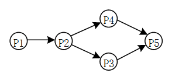
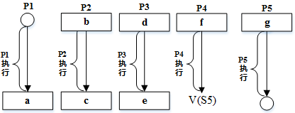

### 问题1

A. V（S1）、P（S1）和V（S2）V（S3）  
B. P（S1）、V（S1）和V（S2）V（S3）  
C. V（S1）、V（S2）和P（S1）V（S3）  
D. P（S1）、V（S2）和V（S1）V（S3）  

### 问题2

A. V（S2）和P（S4）  
B. P（S2）和V（S4）  
C. P（S2）和P（S4）  
D. V（S2）和V（S4）  

### 问题3

A. P（S3）和V（S4）V（S5）  
B. V（S3）和P（S4）P（S5）  
C. P（S3）和P（S4）P（S5）  
D. V（S3）和V（S4）V（S5）  

## 3

在如下所示的进程资源图中，（ ）。

A. P1、P2、P3都是非阻塞节点，该图可以化简，所以是非死锁的  
B. P1、P2、P3都是阻塞节点，该图不可以化简，所以是死锁的  
C. P1、P2是非阻塞节点，P3是阻塞节点，该图不可以化简，所以是死锁的  
D. P2是阻塞节点，P1、P3是非阻塞节点，该图可以化简，所以是非死锁的  

## 4

进程P1、P2、P3、P4和P5的前趋图如下图所示。若用PV操作控制进程P1、P2、P3、P4和P5并发执行的过程，则需要设置5个信号S1、S2、S3、S4和S5，且信号量S1～S5的初值都等于零。下图中a和b处应分别填（ ）；c和d处应分别填写（ ）；e和f处应分别填写（ ）。

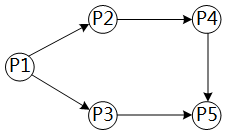
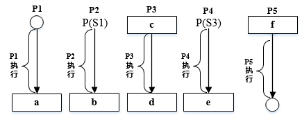

### 问题1

A. V（S1）P（S2）和V（S3）  
B. P（S1）V（S2）和V（S3）  
C. V（S1）V（S2）和V（S3）  
D. P（S1）P（S2）和V（S3）  

### 问题2

A. P（S2）和P（S4）  
B. P（S2）和V（S4）  
C. V（S2）和P（S4）  
D. V（S2）和V（S4）  

### 问题3

A. P（S4）和V（S4）V（S5）  
B. V（S5）和P（S4）P（S5）  
C. V（S3）和V（S4）V（S5）  
D. P（S3）和P（S4）V（P5）  

## 5

进程P1、P2、P3、P4和P5的前趋图如下所示。若用PV操作控制进程P1、P2、P3、P4和P5并发执行的过程，需要设置5个信号量S1、S2、S3、S4和S5，且信号量S1~S5的初值都等于零。如下的进程执行图中a和b处应分别填写（ ）；c和d处应分别填写（ ）；e和f处应分别填写（ ）。

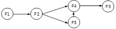
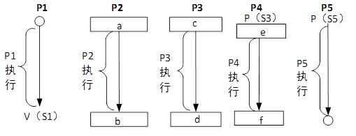

### 问题1

A. V(S1)和P(S2)V(S3)  
B. P(S1)和V(S2)V(S3)  
C. V(S1)和V(S2)V(S3)  
D. P(S1)和P(S2)V(S3)  

### 问题2

A. P(S2)和P(S4)  
B. V(S2)和P(S4)  
C. P(S2)和V(S4)  
D. V(S2)和V(S4)  

### 问题3

A. P(S4)和V(S5)  
B. V(S5)和P(S4)  
C. V(S4)和P(S5)  
D. V(S4)和V(S5)  

## 6

某计算机系统页面大小为4K，进程的页面变换表如下所示。若进程的逻辑地址为2D16H。该地址经过变换后，其物理地址应为（ ）。

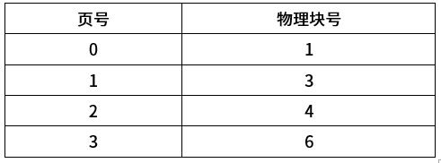

A. 2048H  
B. 4096H  
C. 4D16H  
D. 6D16H  

## 7

进程P1、P2、P3、P4和P5的前趋图如下所示。若用PV操作控制这5个进程的同步与互斥的程序如下，那么程序中的空①和空②处应分别为（ ）；空③和空④处应分别为（ ）；空⑤和空⑥处应分别为（ ）。

### 问题1

A. V（S1）和P（S2）  
B. P（S1）和V（S2）  
C. V（S1）和V（S2）  
D. V（S2）和P（S1）  

### 问题2

A. V（S3）和V（S5）  
B. P（S3）和V（S5）  
C. V（S3）和P（S5）  
D. P（S3）和P（S5）  

### 问题3

A. P（S6）和P（S5）V（S6）  
B. V（S5）和V（S5）V（S6）  
C. V（S6）和P（S5）P（S6）  
D. P（S6）和P（S5）P（S6）  

## 8

若某文件系统的目录结构如下图所示，假设用户要访问文件Book2.doc，且当前工作目录为MyDrivers，则该文件的绝对路径和相对路径分别为（ ）。

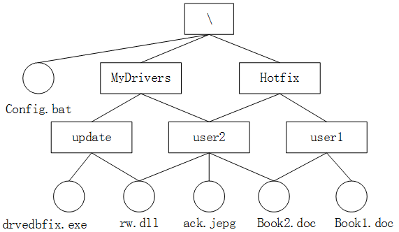

A. MyDrivers\user2\和\user2\  
B. \MyDrivers\user2\和\user2\  
C. \MyDrivers\user2\和user2\  
D. MyDrivers\user2\和user2\  

## 9

进程p1、p2、p3、p4和p5的前趋图如下所示。若用PV操作控制这5个进程的同步与互斥的程序如下，那么程序中的空①和空②处应分别为（ ）；空③和空④处应分别为（ ）；空⑤和空⑥处应分别为（ ）。

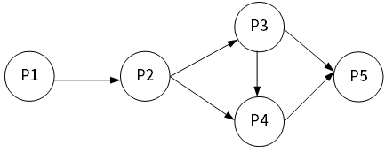
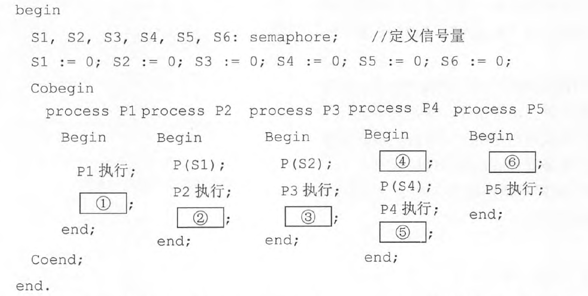

### 问题1

A. V（S1）和P（S2）P（S3）  
B. P（S1）和V（S1）V（S2）  
C. V（S1）和V（S2）V（S3）  
D. P（S1）和V（S1）P（S2）  

### 问题2

A. V（S4）V（S5）和P（S3）  
B. V（S3）V（S4）和V（S5）  
C. P（S4）P（S5）和V（S5）  
D. P（S4）P（S5）和V（S4）  

### 问题3

A. P（S6）和P（S5）V（S6）  
B. V（S5）和V（S5）V（S6）  
C. P（S6）和P（S5）P（S6）  
D. V（S6）和P（S5）P（S6）  

## 10

假设系统中有三个进程P1、P2和P3，两种资源R1、R2。如果进程资源图如图①和图②所示，那么（ ）。

A. 图①和图②都可化简  
B. 图①和图②都不可化简  
C. 图①可化简，图②不可化简  
D. 图①不可化简，图②可化简  

## 11

进程P1、P2、P3、P4、P5和P6的前趋图如下所示。用PV操作控制这6个进程之间同步与互斥的程序如下，程序中的空①和空②处应分别为（ ），空③和空④处应分别为（ ），空⑤和空⑥处应分别为（ ）。

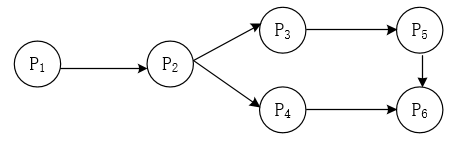
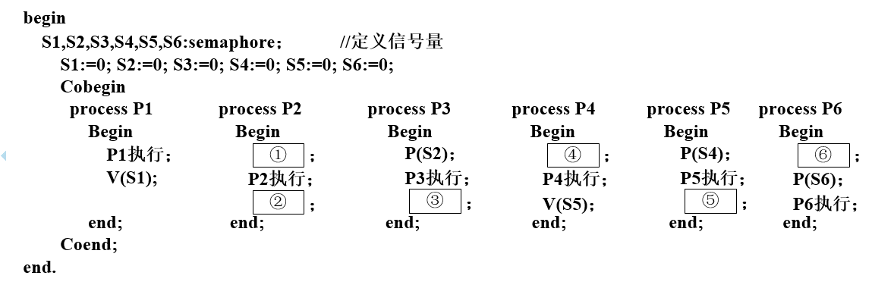

### 问题1

A. V(S1)和P(S2)P(S3)  
B. V(S1)和V(S2)V(S3)  
C. P(S1)和P(S2)V(S3)  
D. P(S1)和V(S2)V(S3)  

### 问题2

A. V(S3)和P(S3)  
B. V(S4)和P(S3)  
C. P(S3)和P(S4)  
D. V(S4)和P(S4)  

### 问题3

A. V(S6)和P(S5)  
B. V(S5)和P(S6)  
C. P(S5)和V(S6)  
D. P(S5)和V(S5)  

## 12

在磁盘上存储数据的排列方式会影响I/O服务的总时间。假设每个磁道被划分成10个物理块，每个物理块存放1个逻辑记录。逻辑记录R1，R2，…，R10存放在同一个磁道上，记录的排列顺序如下表所示。假定磁盘的旋转速度为10ms/周，磁头当前处在R1的开始处。若系统顺序处理这些记录，使用单缓冲区，每个记录处理时间为2ms，则处理这10个记录的最长时间为（ ）。若对存储数据的排列顺序进行优化，处理10个记录的最少时间为（ ）。

### 问题1

A. 30ms  
B. 60ms  
C. 94ms  
D. 102ms  

### 问题2

A. 30ms  
B. 60ms  
C. 102ms  
D. 94ms  

## 13

进程P1、P2、P3、P4、P5和P6的前趋图如下所示。假设用PV操作来控制这6个进程的同步与互斥的程序如下，程序中的空①和空②处应分别为（ ），空③和空④处应分别为（ ），空⑤和空⑥处应分别为（ ）。

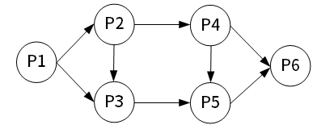
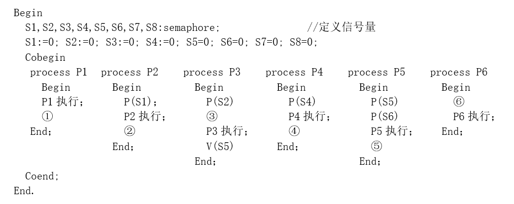

### 问题1

A. V（S1）V（S2）和P（S2）P（S3）  
B. V（S1）P（S2）和V（S3）P（S4）  
C. V（S1）V（S2）和V（S3）V（S4）  
D. P（S1）P（S2）和V（S2）V（S3）  

### 问题2

A. V（S3）和V（S6）V（S7）  
B. V（S3）和V（S6）P（S7）  
C. P（S3）和V（S6）V（S7）  
D. P（S3）和P（S6）V（S7）  

### 问题3

A. V（S6）和P（S7）P（S8）  
B. P（S8）和P（S7）P（S8）  
C. P（S8）和P（S7）V（S8）  
D. V（S8）和P（S7）P（S8）  

## 14

计算机系统的层次结构如下图所示，基于硬件之上的软件可分为a、b和c三个层次。图中a、b和c分别表示（ ）。

A. 操作系统、系统软件和应用软件  
B. 操作系统、应用软件和系统软件  
C. 应用软件、系统软件和操作系统  
D. 应用软件、操作系统和系统软件  

## 15

若某文件系统的目录结构如下图所示，假设用户要访问文件fault.swf，且当前工作目录为Swtools，则该文件的相对路径和绝对路径分别为（ ）。

A. \Swtools\flash\和flash\  
B. flash\和\Swtools\flash\  
C. Swtools\flash和\flash\  
D. \flash和\Swtools\flash\  

## 16

在单处理机系统中，采用先来先服务调度算法。系统中有4个进程P1、P2、P3、P4（假设进程按此顺序到达），其中P1为运行状态，P2为就绪状态，P3和P4为等待状态，且P3等待打印机，P4等待扫描仪。若P1（ ），则P1、P2、P3和P4的状态应分别为（ ）。

### 问题1

A. 时间片到  
B. 释放了扫描仪  
C. 释放了打印机  
D. 已完成  

### 问题2

A. 等待、就绪、等待和等待  
B. 运行、就绪、运行和等待  
C. 就绪、运行、等待和等待  
D. 就绪、就绪、等待和运行  

## 17

中断向量提供（ ）。

A. 函数调用结束后的返回地址  
B. I/O设备的接口地址  
C. 主程序的入口地址  
D. 中断服务程序入口地址  

## 18

某字长为32位的计算机的文件管理系统采用位示图（bitmap）记录磁盘的使用情况。若磁盘的容量为300GB，物理块的大小为1MB，那么位示图的大小为（ ）个字。

A. 1200  
B. 3200  
C. 6400  
D. 9600  

## 19

某文件系统采用索引节点管理，其磁盘索引块和磁盘数据块大小均为1KB字节且每个文件索引节点有8个地址项iaddr[0]~iaddr[7]，每个地址项大小为4字节，其中iaddr[0]~iaddr[4]采用直接地址索引，iaddr[5]和iaddr[6]采用一级间接地址索引，iaddr[7]采用二级间接地址索引。若用户要访问文件userA中逻辑块号为4和5的信息，则系统应分别采用（ ），该文件系统可表示的单个文件最大长度是（ ）KB。

### 问题1

A. 直接地址访问和直接地址访问  
B. 直接地址访问和一级间接地址访问  
C. 一级间接地址访问和一级间接地址访问  
D. 一级间接地址访问和二级间接地址访问  

### 问题2

A. 517  
B. 1029  
C. 65797  
D. 66053  

## 20

计算机运行过程中，遇到突发事件，要求CPU暂时停止正在运行的程序，转去为突发事件服务，服务完毕，再自动返回原程序继续执行，这个过程称为（ ），其处理过程中保存现场的目的是（ ）。

### 问题1

A. 阻塞  
B. 中断  
C. 动态绑定  
D. 静态绑定  

### 问题2

A. 防止丢失数据  
B. 防止对其他部件造成影响  
C. 返回去继续执行原程序  
D. 为中断处理程序提供数据  
