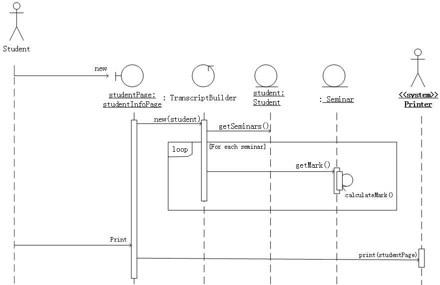

# 第7章第二轮真题训练

## 使用说明

1. 本轮共 `12` 题，均为第 `7` 章《面向对象技术》相关的上午真题。
2. 本轮目标不是重复第一轮主干考点，而是优先补齐上一轮未覆盖或覆盖不足的知识点与题型。
3. 重点补强：对象/类/封装，UML 状态图，交互图中的通信图/序列图/对象图，类间关系中的关联/依赖/实现/聚合/组合，以及单例/抽象工厂/享元。
4. 本文件不附答案。
5. 请直接按 `1:A 2:B 3:C` 的格式作答；多空题按 `9:B C` 这种顺序作答。
6. 后续我会严格按本训练文件原题批改，并继续按仓库规则把错题与详细讲解题并入 `第7章_面向对象技术.md`。

---

## 1

来源：`2017下半年选择题.md` 第 `31` 题

在面向对象方法中，将逻辑上相关的数据以及行为绑定在一起，使信息对使用者隐蔽称为（  ）。当类中的属性或方法被设计为 `private` 时，（  ）可以对其进行访问。

### 问题1

- A. 抽象
- B. 继承
- C. 封装
- D. 多态

### 问题2

- A. 应用程序中所有方法
- B. 只有此类中定义的方法
- C. 只有此类中定义的 `public` 方法
- D. 同一个包中的类中定义的方法

## 2

来源：`2016下半年选择题.md` 第 `35` 题

如下所示的 UML 状态图中，（  ）时，不一定会离开状态 `B`。

- A. 状态 `B` 中的两个结束状态均达到
- B. 在当前状态为 `B2` 时，事件 `e2` 发生
- C. 事件 `e2` 发生
- D. 事件 `e1` 发生

## 3

来源：`2017上半年选择题.md` 第 `34` 题

以下 UML 图是（  ），图中  和  表示（  ）， 和  表示（  ）。

### 问题1

- A. 序列图
- B. 状态图
- C. 通信图
- D. 活动图

### 问题2

- A. 类
- B. 对象
- C. 流名称
- D. 消息

### 问题3

- A. 类
- B. 对象
- C. 流名称
- D. 消息

## 4

来源：`2019上半年选择题.md` 第 `39` 题

下图所示 UML 图为（  ），用于展示系统中（  ）。

### 问题1

- A. 用例图
- B. 活动图
- C. 序列图
- D. 交互图

### 问题2

- A. 一个用例和一个对象的行为
- B. 一个用例和多个对象的行为
- C. 多个用例和一个对象的行为
- D. 多个用例和多个对象的行为

## 5

来源：`2019下半年选择题.md` 第 `34` 题

下图所示 UML 图为（  ），有关该图的叙述中，不正确的是（  ）。

### 问题1

- A. 对象图
- B. 类图
- C. 组件图
- D. 部署图

### 问题2

- A. 如果 `A` 的一个实例被删除，所有包含 `B` 的实例都被删除
- B. `A` 的一个实例可以与 `B` 的一个实例关联
- C. `B` 的一个实例被唯一的一个 `A` 的实例所包含
- D. `B` 的一个实例可与 `B` 的另外两个实例关联

## 6

来源：`2016上半年选择题.md` 第 `33` 题

UML 中关联是一个结构关系，描述了一组链。两个类之间（  ）关联。

- A. 不能有多个
- B. 可以有多个由不同角色标识的
- C. 可以有任意多个
- D. 多个关联必须聚合成一个

## 7

来源：`2019上半年选择题.md` 第 `35` 题

采用面向对象方法进行软件开发时，将汽车作为一个系统。以下（  ）之间不属于组成（`Composition`）关系。

- A. 汽车和座位
- B. 汽车和车窗
- C. 汽车和发动机
- D. 汽车和音乐系统

## 8

来源：`2019上半年选择题.md` 第 `37` 题

聚合对象是指一个对象（  ）。

- A. 只有静态方法
- B. 只有基本类型的属性
- C. 包含其他对象
- D. 只包含基本类型的属性和实例方法

## 9

来源：`2015上半年选择题.md` 第 `35` 题

UML 中有 4 种关系：依赖、关联、泛化和实现。（  ）是一种结构关系，描述了一组链，链是对象之间的连接；（  ）是一种特殊/一般关系，使子元素共享其父元素的结构和行为。

### 问题1

- A. 依赖
- B. 关联
- C. 泛化
- D. 实现

### 问题2

- A. 依赖
- B. 关联
- C. 泛化
- D. 实现

## 10

来源：`2015下半年选择题.md` 第 `35` 题

以下关于 `Singleton`（单例）设计模式的叙述中，不正确的是（  ）。

- A. 单例模式是创建型模式
- B. 单例模式保证一个类仅有一个实例
- C. 单例类提供一个访问唯一实例的全局访问点
- D. 单例类提供一个创建一系列相关或相互依赖对象的接口

## 11

来源：`2016上半年选择题.md` 第 `35` 题

为图形用户界面（GUI）组件定义不同平台的并行类层次结构，适合采用（  ）模式。

- A. 享元（Flyweight）
- B. 抽象工厂（Abstract Factory）
- C. 外观（Facade）
- D. 装饰器（Decorator）

## 12

来源：`2016上半年选择题.md` 第 `38` 题

因使用大量的对象而造成很大的存储开销时，适合采用（  ）模式进行对象共享，以减少对象数量从而达到较少的内存占用并提升性能。

- A. 组合（Composite）
- B. 享元（Flyweight）
- C. 迭代器（Iterator）
- D. 备忘录（Memento）
