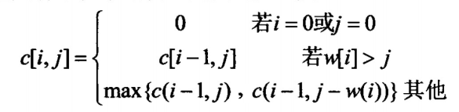
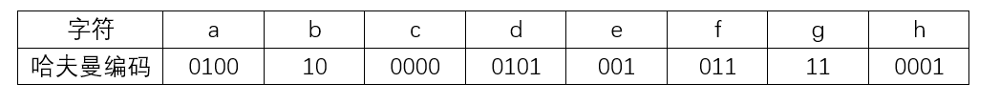
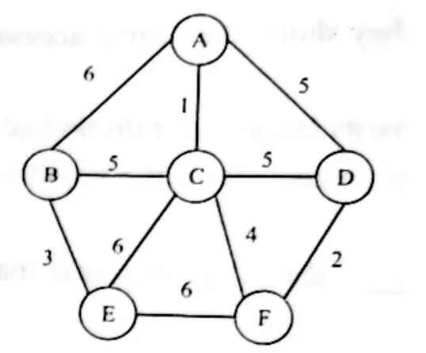

# 第8章第一轮真题训练

## 使用说明

1. 本轮共 `12` 题，均为第 `8` 章《算法设计与分析》相关的上午真题。
2. 本轮共 `18` 个计分单元，优先覆盖本地候选池中已经检出的分治、动态规划、贪心、回溯/分支限界、复杂度分析、折半查找、排序、堆、哈夫曼编码与图算法贪心应用。
3. 本文件不附答案。
4. 请直接按 `1:C D 2:C A D B 3:A ...` 的格式作答。单空题写一个选项，多空题按题内空位顺序连续写出。
5. 后续我会严格按本训练文件原题批改，并继续按仓库规则把错题与详细讲解题并入 `第8章_算法设计与分析.md` 的合适位置；若已有等价例题则增强，不重复堆叠。

---

## 1

来源：`2021上半年选择题.md` 第 `51` 题

在求解某问题时，经过分析发现该问题具有最优子结构和重叠子问题性质。则适宜采用（  ）算法设计策略得到最优解；若定义问题的解空间，并以广度优先的方式搜索解空间，则采用的是（  ）算法设计策略。

### 问题1

- A. 分治
- B. 贪心
- C. 动态规划
- D. 回溯

### 问题2

- A. 动态规划
- B. 贪心
- C. 回溯
- D. 分支限界

## 2

来源：`2016上半年选择题.md` 第 `51` 题

考虑一个背包问题，共有 `n=5` 个物品，背包容量为 `W=10`，物品的重量和价值分别为：`w={2，2，6，5，4}`，`v={6, 3，5，4，6}`，求背包问题的最大装包价值。若此为 `0-1` 背包问题，分析该问题具有最优子结构，定义递归式为：

其中 `c（i，j）` 表示 `i` 个物品、容量为 `j` 的 `0-1` 背包问题的最大装包价值，最终要求解 `c（n，W）`。

采用自底向上的动态规划方法求解，得到最大装包价值为（  ），算法的时间复杂度为（  ）。
若此为部分背包问题，首先采用归并排序算法，根据物品的单位重量价值从大到小排序，然后依次将物品放入背包直至所有物品放入背包中或者背包再无容量，则得到的最大装包价值为（  ），算法的时间复杂度为（  ）。

### 问题1

- A. 11
- B. 14
- C. 15
- D. 16.67

### 问题2

- A. Θ(nW)
- B. Θ(nlgn)
- C. Θ(n2)
- D. Θ(nlgnW)

### 问题3

- A. 11
- B. 14
- C. 15
- D. 16.67

### 问题4

- A. Θ(nW)
- B. Θ(nlgn)
- C. Θ(n2)
- D. Θ(nlgnW)

## 3

来源：`2025上半年选择题.md` 第 `2` 题

【考生回忆版】在二维平面最近点对问题中，分治法的步骤不包括以下（  ）。

- A. 计算所有点对的欧氏距离
- B. 递归求解左右两半中点集的最近点对问题
- C. 按 `x` 坐标排序并将点集划分为左右两半
- D. 合并时仅需检查距离中线 `8` 范围内的点

## 4

来源：`2021上半年选择题.md` 第 `50` 题

最大子段和问题描述为，在 `n` 个整数（包含负数）的数组 `A` 中，求元素之和最大的非空连续子数组，如数组 `A=(-2,11,-4,13,-5,-2)`，其中子数组 `B=(11,-4,13)` 具有最大子段和 `20（11-4+13=20）`。求解该问题时，可以将数组分为两个 `n/2` 个整数的子数组，则最大子段或者在前半段，或者在后半段，或者跨越中间元素，通过该方法继续划分子问题，直至最后求出最大子段和，该算法的时间复杂度为（  ）。

- A. O(nlgn)
- B. O(n2)
- C. O(n2lgn)
- D. O(n3)

## 5

来源：`2025上半年选择题.md` 第 `24` 题

某递归算法的时间复杂度计算公式为 `T（n）=4T（n/2）+nlgn`，其中 `n` 为问题规模，则该算法的时间复杂度是（  ）。

- A. ⊙（nlgn）
- B. ⊙（n3）
- C. ⊙（n2）
- D. ⊙（n2lgn）

## 6

来源：`2023下半年选择题.md` 第 `2` 题

【考生回忆版】以下关于折半查找的叙述中，不正确的是（  ）。采用折半查找等概率查找某个包含 `8` 个元素的有序表，查找成功的平均查找长度为（  ）。

### 问题1

- A. 是一个分治算法
- B. 只能应用于有序表
- C. 查找成功和不成功的平均查找长度是一样的
- D. 若表长为 `n`，时间复杂度为 `O（logn）`

### 问题2

- A. 9/8
- B. 1/8
- C. 20/8
- D. 21/8

## 7

来源：`2021上半年选择题.md` 第 `48` 题

对于一个初始无序的关键字序列，在下面的排序方法中，（  ）第一趟排序结束后，一定能将序列中的某个元素在最终有序序列中的位置确定下来。
①直接插入排序 ②冒泡排序 ③简单选择排序 ④堆排序 ⑤快速排序 ⑥归并排序

- A. ①②③⑥
- B. ①②③⑤⑥
- C. ②③④⑤
- D. ③④⑤⑥

## 8

来源：`2023下半年选择题.md` 第 `30` 题

【考生回忆版】采用冒泡排序算法对序列 `（49，38，65，97，76，13，27，49）` 进行非降序排序，两趟后的序列为（  ）。

- A. （49，38，65，13，27，49，76，97）
- B. （38，49，65，76，13，27，49，97）
- C. （38，49，65，13，27，49，76，97）
- D. （49，38，65，97，76，13，27，49）

## 9

来源：`2024下半年选择题.md` 第 `31` 题

要在 `O(nlgn)` 时间内，对数据进行稳定排序，则应选择（  ）排序算法。

- A. 快速
- B. 归并
- C. 堆
- D. 直接插入

## 10

来源：`2021上半年选择题.md` 第 `49` 题

对数组 `A=(2,8,7,1,3,5,6,4)` 构建大顶堆为（  ）（用数组表示）。

- A. (1,2,3,4,5,6,7,8)
- B. (1,2,5,4,3,7,6,8)
- C. (8,4,7,2,3,5,6,1)
- D. (8,7,6,5,4,3,2,1)

## 11

来源：`2025上半年选择题.md` 第 `3` 题

【考生回忆版】已知字符集为 `{a,b,c,d,e,f,g,h}`，若各字符的哈夫曼编码如下表所示，则对编码序列 `010101100011001001001111` 的译码结果为（  ）。

- A. daceabdg
- B. dabccabg
- C. dfhbabfg
- D. dfaecbfg

## 12

来源：`2022上半年选择题.md` 第 `53` 题

实现 Prim 算法利用的算法是（  ），采用 Prim 算法求解下图的最小生成树，该最小生成树的权值是（  ）。

### 问题1

- A. 分治法
- B. 动态规划法
- C. 贪心算法
- D. 递归算法

### 问题2

- A. 15
- B. 18
- C. 24
- D. 27
