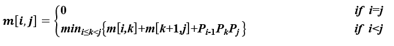
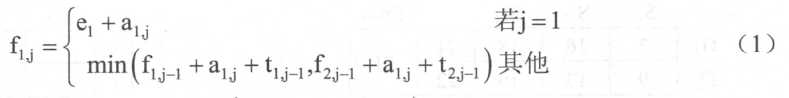
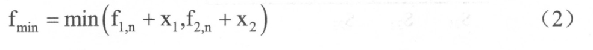
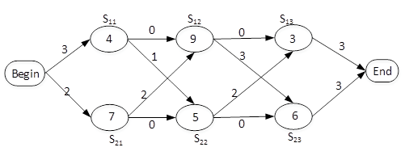

# 第8章第三轮真题训练

## 使用说明

1. 本轮共 `12` 题，均为第 `8` 章《算法设计与分析》相关的上午真题。
2. 本轮共 `30` 个计分单元，已在出题前核读 `第8章第一轮真题训练.md` 与 `第8章第二轮真题训练.md`，本轮题源与前两轮不重复，优先补强矩阵连乘、最长公共子序列、装配线调度、区间覆盖类贪心、快速排序划分、主定理复杂度、哈夫曼树、优先队列与排序适用场景。
3. 本文件不附答案。
4. 请直接按 `1:B,C,A,D 2:D,A 3:B,B,A,B ...` 的格式作答。单空题写一个选项，多空题按题内空位顺序用英文逗号分隔。
5. 后续我会严格按本训练文件原题批改，并继续按仓库规则把错题与要求详细讲解的题并入 `第8章_算法设计与分析.md` 的合适位置；若已有等价例题则增强，不重复堆叠。

---

## 1

来源：`2019上半年选择题.md` 第 `55` 题

已知矩阵Am*n和Bn*p相乘的时间复杂度为O(mnp)。矩阵相乘满足结合律，如三个矩阵A、B、C相乘的顺序可以是(A*B)*C也可以是A*(B*C)。不同的相乘顺序所需进行的乘法次数可能有很大的差别。因此确定n个矩阵A1A2......An相乘的最优计算顺序是一个非常重要的问题。已知确定n个矩阵A1A2......An相乘的计算顺序具有最优子结构，即A1A2......An的最优计算顺序包含其子问题A1A2......Ak和Ak+1Ak+2……An（1≤k）的最优计算顺序。
可以列出其递归式为：

其中，Ai的维度为pi-1*pi，m[i,j]表示AiAi+1……Aj最优计算顺序的相乘次数。
先采用自底向上的方法求n个矩阵相乘的最优计算顺序。则求解该问题的算法设计策略为（ ），算法的时间复杂度为（ ），空间复杂度为（ ）。
给定一个实例，（p0p1……p5）=（20,15,4,10,20,25），最优计算顺序为（ ）。

### 问题1

- A. 分治法
- B. 动态规划法
- C. 贪心法
- D. 回溯法

### 问题2

- A. `O(n²)`
- B. `O(n²lgn)`
- C. `O(n³)`
- D. `O(2^n)`

### 问题3

- A. `O(n²)`
- B. `O(n²lgn)`
- C. `O(n³)`
- D. `O(2^n)`

### 问题4

- A. `(((A1×A2)×A3)×A4)×A5`
- B. `A1×(A2×(A3×(A4×A5)))`
- C. `((A1×A2)×A3)×(A4×A5)`
- D. `(A1×A2)×((A3×A4)×A5)`

## 2

来源：`2017下半年选择题.md` 第 `48` 题

求解两个长度为n的序列X和Y的一个最长公共子序列（如序列ABCBDAB和BDCABA的一个最长公共子序列为BCBA）可以采用多种计算方法。如可以采用蛮力法，对X的每一个子序列，判断其是否也是Y的子序列，最后求出最长的即可，该方法的时间复杂度为（ ）。经分析发现该问题具有最优子结构，可以定义序列长度分别为i和j的两个序列X和Y的最长公共子序列的长度为C[i,j]，如下式所示。

采用自底向上的方法实现该算法，则时间复杂度为（ ）。

### 问题1

- A. `O(n²)`
- B. `O(n²lgn)`
- C. `O(n³)`
- D. `O(n2n)`

### 问题2

- A. `O(n²)`
- B. `O(n²lgn)`
- C. `O(n³)`
- D. `O(n2n)`

## 3

来源：`2017上半年选择题.md` 第 `48` 题

某汽车加工工厂有两条装配线L1和L2，每条装配线的工位数均为n（Sij，i=1或2，j=1，2，…，n），两条装配线对应的工位完成同样的加工工作，但是所需要的时间可能不同（aij，i=1或2，j=1，2，…，n）。汽车底盘开始到进入两条装配线的时间 (e1，e2) 以及装配后到结束的时间(X1X2)也可能不相同。从一个工位加工后流到下一个工位需要迁移时间(tij，i=1或2，j=2，…n）。现在要以最快的时间完成一辆汽车的装配，求最优的装配路线。
分析该问题，发现问题具有最优子结构。以 L1为例，除了第一个工位之外，经过第j个工位的最短时间包含了经过L1的第j-1个工位的最短时间或者经过L2的第j-1个工位的最短时间，如式(1)。装配后到结束的最短时间包含离开L1的最短时间或者离开L2的最短时间如式（2）。

由于在求解经过L1和L2的第j个工位的最短时间均包含了经过L1的第j-1个工位的最短时间或者经过L2的第j-1个工位的最短时间，该问题具有重复子问题的性质，故采用迭代方法求解。
该问题采用的算法设计策略是（ ），算法的时间复杂度为（ ）。
以下是一个装配调度实例，其最短的装配时间为（ ），装配路线为（ ）。

### 问题1

- A. 分治
- B. 动态规划
- C. 贪心
- D. 回溯

### 问题2

- A. `Θ(lgn)`
- B. `Θ(n)`
- C. `Θ(n2)`
- D. `Θ(nlgn)`

### 问题3

- A. `21`
- B. `23`
- C. `20`
- D. `26`

### 问题4

- A. `S11→S12→S13`
- B. `S11→S22→S13`
- C. `S21→S12→S23`
- D. `S21→S22→S23`

## 4

来源：`2018上半年选择题.md` 第 `47` 题

现需要申请一些场地举办一批活动，每个活动有开始时间和结束时间。在同一个场地，如果一个活动结束之前，另一个活动开始，即两个活动冲突。若活动A从1时间开始，5时间结束，活动B从5时间开始，8时间结束，则活动A和B不冲突。现要计算n个活动需要的最少场地数。
求解该问题的基本思路如下（假设需要场地数为m，活动数为n，场地集合为P1，P2，…，Pm），初始条件Pi均无活动安排：
（1）采用快速排序算法对n个活动的开始时间从小到大排序，得到活动a1，a2，…，an。对每个活动ai，i从1到n，重复步骤（2）、（3）和（4）；
（2）从p1开始，判断ai与P1的最后一个活动是否冲突，若冲突，考虑下一个场地p2，…；
（3）一旦发现ai与某个pj的最后一个活动不冲突，则将ai安排到Pj，考虑下一个活动；
（4）若ai与所有已安排活动的pj的最后一个活动均冲突，则将ai安排到一个新的场地，考虑下一个活动；
（5）将n减去没有安排活动的场地数即可得到所用的最少场地数。
算法首先采用了快速排序算法进行排序，其算法设计策略是（  ）；后面步骤采用的算法设计策略是（  ）。整个算法的时间复杂度是（  ）。下表给出了n=11的活动集合，根据上述算法，得到最少的场地数为（  ）。

### 问题1

- A. 分治
- B. 动态规划
- C. 贪心
- D. 回溯

### 问题2

- A. 分治
- B. 动态规划
- C. 贪心
- D. 回溯

### 问题3

- A. `Θ(lgn)`
- B. `Θ(n)`
- C. `Θ(nlgn)`
- D. `Θ(n2)`

### 问题4

- A. `4`
- B. `5`
- C. `6`
- D. `7`

## 5

来源：`2018下半年选择题.md` 第 `48` 题

在一条笔直公路的一边有许多房子，现要安装消防栓，每个消防栓的覆盖范围远大于房子的面积，如下图所示。现求解能覆盖所有房子的最少消防栓数和安装方案（问题求解过程中，可将房子和消防栓均视为直线上的点）。

该问题求解算法的基本思路为：从左端的第一栋房子开始，在其右侧m米处安装一个消防栓，去掉被该消防栓覆盖的所有房子。在剩余的房子中重复上述操作，直到所有房子被覆盖。算法采用的设计策略为（  ）；对应的时间复杂度为（  ）。
假设公路起点A的坐标为0，消防栓的覆盖范围（半径）为20米，10栋房子的坐标为（10，20，30，35，60，80，160，210，260，300），单位为米。根据上述算法，共需要安装（  ）个消防栓。以下关于该求解算法的叙述中，正确的是（  ）。

### 问题1

- A. 分治
- B. 动态规划
- C. 贪心
- D. 回溯

### 问题2

- A. `Θ(lgn)`
- B. `Θ(n)`
- C. `Θ(nlgn)`
- D. `Θ(n2)`

### 问题3

- A. `4`
- B. `5`
- C. `6`
- D. `7`

### 问题4

- A. 肯定可以求得问题的一个最优解
- B. 可以求得问题的所有最优解
- C. 对有些实例，可能得不到最优解
- D. 只能得到近似最优解

## 6

来源：`2020下半年选择题.md` 第 `50` 题

对数组A=(2,8,7,1,3,5,6,4)用快速排序算法的划分方法进行一趟划分后得到的数组A为（  ）（非递减排序，以最后一个元素为基准元素）。进行一趟划分的计算时间为（  ）。

### 问题1

- A. `(1,2,8,7,3,5,6,4)`
- B. `(1,2,3,4,8,7,5,6)`
- C. `(2,3,1,4,7,5,6,8)`
- D. `(2,1,3,4,8,7,5,6)`

### 问题2

- A. `O(1)`
- B. `O(lgn)`
- C. `O(n)`
- D. `O(nlgn)`

## 7

来源：`2015上半年选择题.md` 第 `52` 题

在n个数的数组中确定其第i(1≤i≤n)小的数时，可以采用快速排序算法中的划分思想，对n个元素划分，先确定第k小的数，根据i和k的大小关系，进一步处理，最终得到第i小的数。划分过程中，最佳的基准元素选择的方法是选择待划分数组的（  ）元素。此时，算法在最坏情况下的时间复杂度为（不考虑所有元素均相等的情况）（  ）。

### 问题1

- A. 第一个
- B. 最后一个
- C. 中位数
- D. 随机一个

### 问题2

- A. `O(n)`
- B. `O(lgn)`
- C. `O(nlgn)`
- D. `O(n2)`

## 8

来源：`2015下半年选择题.md` 第 `49` 题

已知算法A的运行时间函数为T(n)=8T(n/2)+n2，其中n表示问题的规模，则该算法的时间复杂度为（  ）。另已知算法B的运行时间函数为T(n)=XT(n/4)+n2，其中n表示问题的规模。对充分大的n，若要算法B比算法A快，则X的最大值为（  ）。

### 问题1

- A. `O(n)`
- B. `O(nlgn)`
- C. `O(n2)`
- D. `O(n3)`

### 问题2

- A. `15`
- B. `17`
- C. `63`
- D. `65`

## 9

来源：`2017下半年选择题.md` 第 `44` 题

假设某消息中只包含7个字符{a，b，c，d，e，f，g}，这7个字符在消息中出现的次数为{5，24，8，17，34，4，13}，利用哈夫曼树（最优二叉树）为该消息中的字符构造符合前缀编码要求的不等长编码。各字符的编码长度分别为（  ）。

### 问题1

- A. `a:4，b:2，c:3，d:3，e:2，f:4，g:3`
- B. `a:6，b:2，c:5，d:3，e:1，f:6，g:4`
- C. `a:3，b:3，c:3，d:3，e:3，f:2，g:3`
- D. `a:2，b:6，c:3，d:5，e:6，f:1，g:4`

## 10

来源：`2020下半年选择题.md` 第 `46` 题

以下关于Huffman（哈夫曼）树的叙述中，错误的是（  ）。

### 问题1

- A. 权值越大的叶子离根节点越近
- B. Huffman（哈夫曼）树中不存在只有一个子树的节点
- C. Huffman（哈夫曼）树中的节点总数一定为奇数
- D. 权值相同的节点到树根的路径长度一定相同

## 11

来源：`2015上半年选择题.md` 第 `51` 题

优先队列通常采用（  ）数据结构实现，向优先队列中插入一个元素的时间复杂度为（  ）。

### 问题1

- A. 堆
- B. 栈
- C. 队列
- D. 线性表

### 问题2

- A. `O(n)`
- B. `O(1)`
- C. `O(lgn)`
- D. `O(n2)`

## 12

来源：`2015下半年选择题.md` 第 `50` 题

在某应用中，需要先排序一组大规模的记录，其关键字为整数。若这组记录的关键字基本上有序，则适宜采用（  ）排序算法。若这组记录的关键字的取值均在0到9之间（含），则适宜采用（  ）排序算法。

### 问题1

- A. 插入
- B. 归并
- C. 快速
- D. 计数

### 问题2

- A. 插入
- B. 归并
- C. 快速
- D. 计数
