# 2015上半年案例题

- 来源标题: 2015年上半年软件设计师考试应用技术真题（专业解析+参考答案）
- 试卷介绍页: https://wangxiao.xisaiwang.com/tiku2/136/tp169025.html?cid=136
- 练习页: https://wangxiao.xisaiwang.com/tiku2/exam534904611.html
- 题量: 6

## 第1题（案例题）

阅读下列说明和图，回答问题1至问题4，将解答填入答题纸的对应栏内。 
 【说明】
某大学为进一步推进无纸化考试，欲开发一考试系统。系统管理员能够创建包括专业方向、课程编号、任课教师等相关考试基础信息，教师和学生进行考试相关的工作。系统与考试有关的主要功能如下。
（1）考试设置。教师制定试题（题目和答案），制定考试说明、考试时间和提醒时间等考试信息，录入参加考试的学生信息，并分别进行存储。
（2）显示并接收解答。根据教师设定的考试信息，在考试有效时间内向学生显示考试说明和题目，根据设定的考试提醒时间进行提醒，并接收学生的解答。
（3）处理解答。根据答案对接收到的解答数据进行处理，然后将解答结果进行存储。
（4）生成成绩报告。根据解答结果生成学生个人成绩报告，供学生查看。
（5）生成成绩单。对解答结果进行核算后生成课程成绩单供教师查看。
（6）发送通知。根据成绩报告数据，创建通知数据并将通知发送给学生；根据成绩单数据，创建通知数据并将通知发送给教师。
现采用结构化方法对考试系统进行分析与设计，获得如图1-1所示的上下文数据流图和图1-2所示的0层数据流图。 
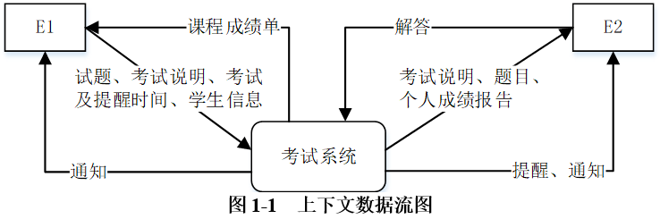
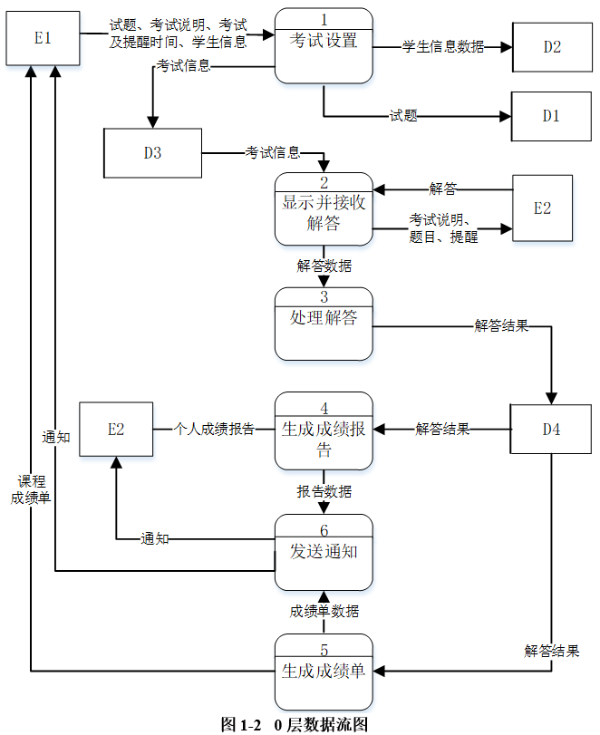

### 补充题面

【问题1】（2分）
使用说明中的词语，绘出图1-1中的实体E1～E2的名称。
 【问题2】（4分）
使用说明中的词语，给出图1-2中的数据存储D1～D4的名称。
 【问题3】（4分）
根据说明和图中词语，补充图1-2中缺失的数据流及其起点和终点。
 【问题4】（5分）
图1-2所示的数据流图中，功能（6）发送通知包含创建通知并发送给学生或老师。请分解图1-2中加工（6），将分解出的加工和数据流填入答题纸的对应栏内。（注：数据流的起点和终点须使用加工的名称描述）

### 参考答案

【问题1】
 E1：教师 E2：学生
 【问题2】
 D1：试题 D2：学生信息 D3：考试信息 D4：解答结果
 【问题3】
 数据流名称：题目，起点：D1，终点：2 或显示并接收解答。
 数据流名称：答案，起点：D1，终点：3 或处理解答。
 【问题4】
 分解为：创建通知；发送通知
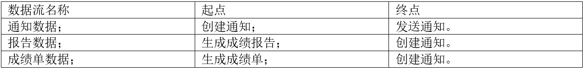

### 解析

【问题1】
根据题干，考试系统中涉及到的实体有“教师“和”“学生”，及题干中其他相关信息，如“根据教师设定的考试信息，在考试有效时间内向学生显示考试说明和题目”，根据1-1可知，E1为教师，E2为学生。
【问题2】
本题要求的是数据存储，然后流入这四个的分别是存储的信息，则可以确定其名称。
“教师制定试题（题目和答案），制定考试说明、考试时间和提醒时间等考试信息，录入参加考试的学生信息，并分别进行存储”即D1为试题，D3为考试信息，D2为学生信息。
“根据答案对接收到的解答数据进行处理，然后将解答结果进行存储”即D4为解答结果。
【问题3】
首先根据父图和子图之间的平衡、子图内部的输入输出平衡，对照图1-1和图1-2的数据流是否相同，然后再根据题干说明，仔细对照说明与图的对应关系，来确定缺失的是什么。
本题首先根据子图内部的输入输出平衡，在“2显示并接收解答”加工，输出数据流有考试说明、题目和题型，而其输入缺少题目的来源，因此这里缺少数据流：题目，起点为D1试题，终点为22显示并接收解答。
根据题干说明和子图，在“3处理解答”加工，输入数据有解答数据，输出数据为解答结果，题干描述“根据答案对接收到的解答数据进行处理”，因此这里缺少数据流答案，起点是D1试题，终点是3处理解答。
【问题4】
本题考查对加工的分解。
根据题干描述“发送通知。根据成绩报告数据，创建通知数据并将通知发送给学生；根据成绩单数据，创建通知数据并将通知发送给教师”，可知发送通知可以分为创建通知和发送通知2个加工，并且，创建通知有2条输入数据流，成绩报告数据，成绩单数据，它们的起点分别为生成成绩单和生成成绩报告；而发送通知的对象有学生和老师，在图中已经存在不用处理，为了将2个加工连接起来，还缺少从创建通知到发送通知的数据流，名称为通知数据。

## 第2题（案例题）

阅读下列说明，回答问题1至问题3，将解答填入答题纸的对应栏内。
【说明】
 某省针对每年举行的足球联赛，拟开发一套信息管理系统，以方便管理球队、球员、主教练、主裁判、比赛等信息。
【需求分析】
 （1）系统需要维护球队、球员、主教练、主裁判、比赛等信息。
 球队信息主要包括：球队编号、名称、成立时间、人数、主场地址、球队主教练。
 球员信息主要包括：姓名、身份证号、出生日期、身高、家庭住址。
 主教练信息主要包括：姓名、身份证号、出生日期、资格证书号、级别。
 主裁判信息主要包括：姓名、身份证号、出生日期、资格证书号、获取证书时间、级别。
 （2）每支球队有一名主教练和若干名球员。一名主教练只能受聘于一支球队，一名球员只能效力于一支球队。每支球队都有自己的唯一主场场地，且场地不能共用。
 （3）足球联赛采用主客场循环制，一周进行一轮比赛，一轮的所有比赛同时进行。
 （4）一场比赛有两支球队参加，一支球队作为主队身份、另一支作为客队身份参与 比赛。一场比赛只能有一名主裁判，每场比赛有唯一的比赛编码，每场比赛都记录比分和日期。
【概念结构设计】
根据需求分析阶段的信息，设计的实体联系图（不完整）如图2-1所示。  
    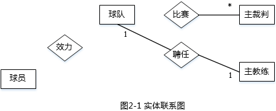
【逻辑结构设计】
根据概念结构设计阶段完成的实体联系图，得出如下关系模式（不完整）：
球队（球队编号，名称，成立时间，人数，主场地址）
球员（姓名，身份证号，出生日期，身高，家庭住址，   （1）   ）
主教练（姓名，身份证号，出生日期，资格证书号，级别，   （2）   ）
主裁判（姓名，身份证号，出生日期，资格证书号，获取证书时间，级别）
比赛（比赛编码，主队编号#，客队编号#，主裁判身份证号#，比分，日期）

### 补充题面

【问题1】（6分）
补充图2-1中的联系和联系的类型。
图2-1中的联系“比赛”应具有的属性是哪些？
【问题2】（4分）
根据图2-1，将逻辑结构设计阶段生成的关系模式中的空（1）～（2）补充完整。
【问题3】（5分）
现在系统要增加赞助商信息，赞助商信息主要包括赞助商名称和赞助商编号。
赞助商可以赞助某支球队，一支球队只能有一个赞助商，但赞助商可以赞助多支球队。赞助商也可以单独赞助某些球员，一名球员可以为多个赞助商代言。请根据该要求，对图2-1进行修改，画出修改后的实体间联系和联系的类型。

### 参考答案

【问题1】
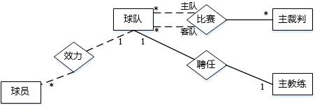
比赛联系应具有的属性包括：比赛编码，比分，日期。
【问题2】
（1）球队编号# （2）球队编号#
【问题3】
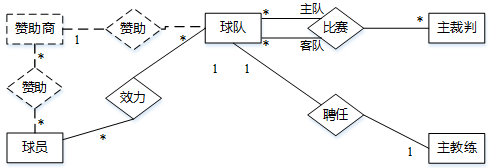

### 解析

【问题1】
根据题干需求分析中的（2）（3）（4）可以确定联系及联系类型。
从题干中的关系模式中可以看出“比赛”的属性是去掉球队和主裁判的主键，即剩下的是：比赛编码，比分和日期。
【问题2】
根据题干描述和图示可知，需要在关系模式中应该把球队的主键添上去，即添上球队编号。
【问题3】
此题相当于把文字转化为ER图，根据关键字：赞助商，球队和球员，及其联系就可以确定了。
“一支球队只能有一个赞助商，但赞助商可以赞助多支球队”，因此球队和赞助商为*:1的联系；
“一名球员可以为多个赞助商代言”，并且球员是球队的一部分，因此球队和赞助商为*:*的联系。

## 第3题（案例题）

阅读下列说明和图，回答问题1至问题3，将解答填入答题纸的对应栏内。 
【说明】
 某物品拍卖网站为参与者提供物品拍卖平台，组织拍卖过程，提供在线或线下交易服务。网站主要功能描述如下：
 （1）拍卖参与者分为个人参与者和团体参与者两种。不同的团体也可以组成新的团体参与拍卖活动。网站记录每个参与者的名称。
 （2）一次拍卖中，参与者或者是买方，或者是卖方。
 （3）一次拍卖只拍出来自一个卖方的一件拍卖品；多个买方可以出价：卖方接受其中一个出价作为成交价，拍卖过程结束。
 （4）在拍卖结算阶段，买卖双方可以选择两种成交方式：线下成交，买卖双方在事先约定好的成交地点，当面完成物价款的支付和拍卖品的交付；在线成交，买方通过网上支付平台支付物价款，拍卖品由卖方通过快递邮寄给买方。
一次拍卖过程的基本事件流描述如下：
（1）卖方在网站上发起一次拍卖，并设置本次拍卖的起拍价。
（2）确定拍卖标的以及拍卖标的保留价（若在拍卖时间结束时，所有出价均低于拍卖标的保留价，则本次拍卖失败）。
（3）在网站上发布本次拍卖品的介绍。
（4）买方参与拍卖，给出竟拍价。
（5）卖方选择接受一个竟拍价作为成交价，结束拍卖。
（6）系统记录拍卖成交价，进入拍卖结算阶段。
（7）卖方和买方协商拍卖品成交方式，并完成成交。
现采用面向对象方法对系统进行分析与设计，得到如表3-1所示的类列表以及如图3-1所示的类图，类中关键属性与方法如表3-2所示。      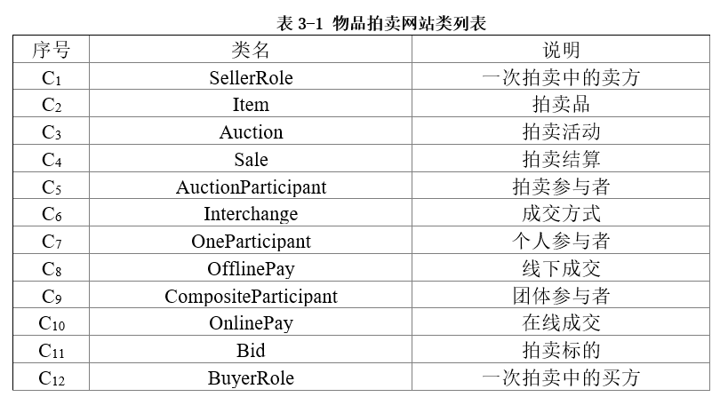 
 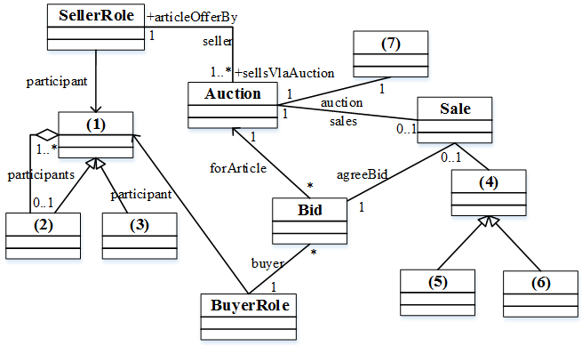    
 **图3-1  类图**
 **表****3-2 ****关键属性与方法列表**
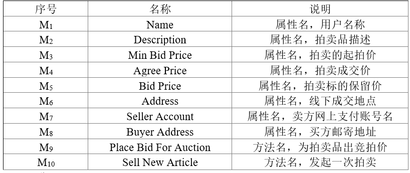

### 补充题面

【问题1】（7分）
根据说明中的描述，给出图3-1中（1）～（7）所对应的类名（类名使用表3-1中给出的序号）。
 【问题2】(5分)
根据说明中的描述，确定表3-2中的属性/方法分别属于哪个类（类名、方法/属性名使用表3-1、3-2中给出的序号）。
 【问题3】（3分）
在图3-1采用了何种设计模式？以100字以内文字说明采用这种设计模式的原因。

### 参考答案

【问题1】
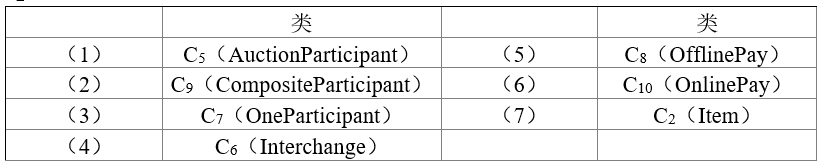 
注意：C8和C10可互换，互换后在问题2中也必须交换对应位置。
 【问题2】
 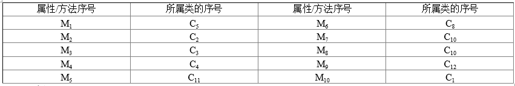
 【问题3】
 组合模式，在本题中由于拍卖者分为个人参与者和团体参与者两种，而团体也可以组成新的团体参与拍卖活动。这样的整体部分关系，适合于使用组合模式表达。

### 解析

【问题1】
图 3-1 共需要确定 7 个类，可以先从图中几个特殊关系处入手，即（1）~（3）和（4）~（6）。
先来分析（1）~（3），这是一个继承+聚集的结构，而且联系的名称“participants” 是一个比较明显的提示，说明这个层次结构是与【说明】中的功能描述（1）相对应的。 参考表 3-1，与之相关的类是 C5 （Auction Participant） 、C7（OneParticipant）和C9（ CompositeParticipant）。C7、C9是特殊的参与者，所以（1）处应该为C5；（2）处应该为 C9，这个聚集关系针对着【说明】中的“不同的团体也可以组成新的团体参与拍卖活动”需求；（3）处为C7。
结合【说明】和表 3-1，另外一组具有“一般-特殊”关系的类只有C6 （Interchange）、C8（OfflinePay）和C10（OnlinePay）。显而易见，C8 和 C10 是 C6 的两种具体方式， 所以（4）处应该为C6，（5）、（6）处分别为C8和C10。
这样（7）处对应的类只能是Item了。结合【说明】和表 3-1 可知，（7）处对应的类表达的应该是拍卖中的拍卖品，所以（7）处应该是C2。
【问题2】
在确定了所有的类之后，确定每个类的属性和方法就比较容易了。完成本问题需要结合【说明】部分中所给出的拍卖过程的基本事件流描述。表 3-2中的属性/方法与类之间的对应关系下表所示。
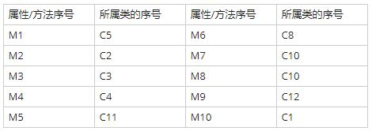 
【问题3】
在【说明】部分有一个很明显的提示：“拍卖参与者分为个人参与者和团体参与者两种。不同的团体也可以组成新的团体参与拍卖活动”。这里很清晰地表达了一种“部分-整体”的层次关系，这种关系非常适合于采用 Composite（组合）设计模式来表达。
Composite设计模式将对象组合成树形结构以表示“部分-整体”的层次结构。Composite使得用户对单个对象和组合对象的使用具有一致性。

## 第4题（案例题）

阅读下列说明和C代码，回答问题1至问题3，将解答写在答题纸的对应栏内。
【说明】
n-皇后问题是在n行n列的棋盘上放置n个皇后，使得皇后彼此之间不受攻击，其规则是任意两个皇后不在同一行、同一列和相同的对角线上。
拟采用以下思路解决n-皇后问题：第i个皇后放在第i行。从第一个皇后开始，对每个皇后，从其对应行（第i个皇后对应第i行）的第一列开始尝试放置，若可以放置，确定该位置，考虑下一个皇后；若与之前的皇后冲突，则考虑下一列；若超出最后一列，则重新确定上一个皇后的位置。重复该过程，直到找到所有的放置方案。
【C代码】
下面是算法的C语言实现。
（1）常量和变量说明
pos：一维数组，pos[i]表示第i个皇后放置在第i行的具体位置
count：统计放置方案数
i，j，k：变量
N：皇后数
（2）C程序
#include <stdio.h>
#include <math.h>
#define N4
/*判断第k个皇后目前放置位置是否与前面的皇后冲突*/
int isplace(int pos[], int k) {
    int i;
        for(i=1; i<k; i++) {
         if(  （1）  || fabs(i-k)  ══ fabs(pos[i] - pos[k])) {
            return 0;
          }
        }
        return 1;
}
int main() {
    int i,j,count=1;
    int pos[N+1];
    //初始化位置
    for(i=1; i<=N; i++) {
       pos[i]=0;
        }
           （2）    ；
        while(j>=1) {
            pos[j]= pos[j]+1；
             /*尝试摆放第i个皇后*/
            while(pos[j]<=N&&    （3）_) {
                pos[j]= pos[j]+1;
            }
            /*得到一个摆放方案*/
            if(pos[j]<=N&&j══ N) {
                printf("方案%d: ",count++);
                for(i=1; i<=N; i++){
                    printf("%d  ",pos[i]);
                }
                printf("\n");
         }
         /*考虑下一个皇后*/
          if(pos[j]<=N&&  （4）  ) {
              j=j+1;
          } else{ //返回考虑上一个皇后
              pos[j]=0;
                 （5）    ;
          }
    }
  return 1;
}

### 补充题面

【问题1】（10分）
根据以上说明和C代码，填充C代码中的空（1）～（5）。
【问题2】（2分）
根据以上说明和C代码，算法采用了    （6）   设计策略。
【问题3】（3分）
上述C代码的输出为：
   （7）   。

### 参考答案

【问题1】
（1）pos[i] ==pos[k]
（2）j=1
（3）isplace(pos,j)==0
（4）j<N
（5）j=j-1
【问题2】
（6）回溯法
【问题3】
（7）
方案1：2 4 1 3
方案2：3 1 4 2

### 解析

本题考查算法设计和 C 程序设计语言的相关知识。
此类题目要求考生认真阅读题目，理解算法思想，并思考将算法思想转化为具体的程序设计语言的代码。
【问题1】
根据题干描述。空（1）所在的代码行判断皇后合法放置的约束条件，即不在同一行，这通过把第 i 个皇后放在第 i 行实现，条件 "fabs(i-k) = fabs(pos[i]-pos[k])" 判断的是当前摆放的皇后是否与之前摆放的皇后在同一对角线上。因此，空（1）判断的是当前摆放的皇后是否和之前摆放的皇后在同一列上，即应填入"pos[i]==pos[k]" 。
根据算法思想和主函数上下文，空（2）处应该考虑第 1 个皇后，即初始化 j为1，空（2）填写"j=1"。空（3）所在的行是判断放置第j 个皇后的位置是否合适，"pos[j]<= N" 表示在该行的合法列上，但还需要进一步判断是否与前面的皇后有冲突，根据满足条件后的语句，尝试放入下一列，因此空（3）处填入"!isplace(pos，j) 。根据前面的注释，空（4）所在的行是考虑下一个皇后，其条件是，当前皇后找到了合适的位置，而且还存在下一个皇后，因此空（4）处应填入"j<N" 。根据下面的注释，若当前皇后没有找到合适的位置，则应回溯，即再次考虑上一个皇后的位置，因此空（5）处填入 "j=j-1"。
【问题2】
从上述题干的叙述和 C 代码很容易看出，从第一个皇后开始，对每个皇后总是从第一个位置开始尝试，找到可以放置的合法位置；若某个皇后在对应的行上没有合法位置，则回溯到上一个皇后，尝试将上一个皇后放置另外的位置。这是典型的深度优先的系统搜索方式，即回溯法的思想。
【问题3】
四皇后问题的答案为：
方案 1： 2 4 1 3
方案 2： 3 1 4 2
如表 4-1 所示：
**表****4-1**
方案1                                            方案2
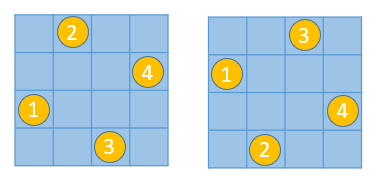

## 第5题（案例题）

阅读下列说明和C++代码，将应填入    (n)    处的字句写在答题纸的对应栏内。
【说明】
    某图书管理系统中管理着两种类型的文献：图书和论文。现在要求统计所有馆藏文献的总页码（假设图书馆中有一本540页的图书和两篇各25页的论文，那么馆藏文献的总页码就是590页）。采用Visitor（访问者）模式实现该要求，得到如图5-1所示的类图。
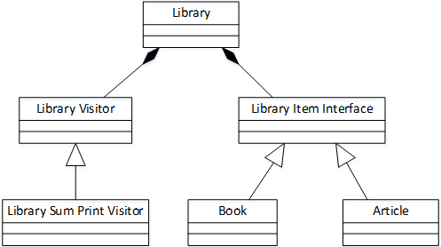
**图5-1 Visitor模式类图          **

### 补充题面

【C++代码】
class LibraryVisitor;
class LibraryItemInterface{
public:
           (1)      ;
};
class Article : public LibraryItemInterface {
private:
    string  m_title;        //论文名
    string  m_author;    //论文作者
    int m_start_page;
    int m_end_page;
public:
    Article(string p_author, string p_title, int p_start_page,int p_end_page );
    int getNumberOfPages();
    void accept(Library Visitor* visitor);
};
class Book : public LibraryItemInterface {
private:
    string  m_title;       //书名
    string  m_author;   //作者
    int m_pages;         //页数
public:
    Book(string p_author, string p_title, int p_pages);
    int getNumberOfPages();
     void accept(LibraryVisitor* visitor);
};
class LibraryVisitor {
public:
          (2)     ;
          (3)     ;
    virtual void printSum() = 0;
};
class LibrarySumPrintVisitor : public LibraryVisitor  {          //打印总页数
private:
    int sum;
public:
    LibrarySumPrintVisitor();
    void visit(Book* p_book);
    void visit(Article* p_article);
    void printSum();
};
// visitor.cpp
int Article: :getNumberOfPages(){
    retum m_end_page - m_start_page;
}
void Article::accept(LibraryVisitor* visitor) {       (4)      ;}
Book: :Book(string p_author, string p_title, int p_pages ) {
    m_title = p_title;
    m_author = p_author;
    m_pages = p_pages;
}
int Book::getNumberOfPages(){    return m_pages;  }
void Book::accept(LibraryVisitor* visitor){       (5)     ;  }
//其余代码省略

### 参考答案

（1）virtual void accept(LibraryVisitor* visitor)=0
（2）virtual void visit(Book* p_book)=0
（3）virtual void visit(Article* p_article)=0
（4）visitor->visit(this)
（5）visitor->visit(this)

### 解析

本题考查Visitor（访问者）模式的基本概念和应用。
访问者模式是行为设计模式中的一种。行为模式不仅描述对象或类的模式，还描述它们之间的通信模式。这些模式刻画了在运行时难以跟踪的复杂的控制流。访问者模式表示一个作用于某对象结构中的各元素的操作。它使在不改变各元素的类的前提下可以定义作用于这些元素的新操作。此模式的结构图如下图所示。
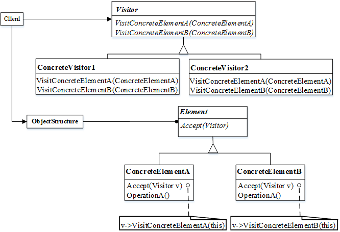
• Visitor（访问者）为该对象结构中 ConcreteElement 的每一个类声明一个Visit 操作。该操作的名字和特征标识了发送 Visit 请求给该访问者的哪个类。这使得访问者可以确定正被访问元素的具体的类。这样访问者就可以通过该元素的特定接口直接访问它。
• ConcreteVisitor （具体访问者）实现每个有 Visitor 声明的操作，每个操作实现本算法的一部分，而该算法片段乃是对应于结构中对象的类。ConcreteVisitor 为该算法提供了上下文并存储它的局部状态。这一状态常常在遍历该结构的过程中累积结果。
• Element （元素）定义以一个访问者为参数的 Accept 操作。
• ConcreteElement （具体元素）实现以一个访问者为参数的 Accept 操作。
• ObjectStructure （对象结构〉能枚举它的元素；可以提供一个高层的接口以允许该访问者访问它的元素；可以是一个组合或者一个集合，如一个列表或一个无序集合。
本题中类Library 对应着上图中的 Client ，LibraryVisitor 对应着 Visitor ，LibrarySumPrintVisitor 对应着 ConcreteVisitor。 LibraryItemInterface 对应着上图中的元素部分。下面可以结合程序代码来完成程序填空了。
（1）空中，LibraryItemInterface 在本题中充当着 Element 的作用，其中应定义以一个访问者为参数的 Accept操作。对照实现该接口的两个子类Article 和 Book 的代码，可以得知该操作的原型是void accept(LibraryVisitor visitor) 。由此可以得知，此处应该定义的是accept操作，此处填写virtual void accept(LibraryVisitor* visitor)=0。
（2）和（3）空与类 LibraryVisitor 有关。由前文分析已知， LibraryVisitor 对应着访问者模式中的 Visitor，其作用是为类LibrarySumPrintVisitor声明Visit操作。类 LibrarySumPrintVisitor 需要访问两种不同的元素，每种元素应该对应不同的 visit 操作。 再结合类 LibrarySumPrintVisitor 的定义部分，可以得知（2）和（3）处应给出分别以 Book和Article 为参数的 visit 方法。因此（2）和（3）处分别为 virtual void visit(Book* p_book)=0、virtual void visit(Article* p_article)=0。
（4）和（5）处考查的是 accept 接口的实现。由访问者模式的结构图可以看出，在Book 和Article 中 accept 方法的实现均为visitor->visit(this)。

## 第6题（案例题）

阅读下列说明和Java代码，将应填入 (n) 处的字句写在答题纸的对应栏内。
【说明】
某图书管理系统中管理着两种类型的文献：图书和论文。现在要求统计所有馆藏文献的总页码（假设图书馆中有一本540页的图书和两篇各25页的论文，那么馆藏文献的总页码就是590页）。采用Visitor（访问者）模式实现该要求，得到如图6-1所示的类图。

**图6-1 Visitor模式类图**

### 补充题面

【Java 代码】
import java.util.*;
interface LibraryVisitor {
          （1）　  ;
          （2）　  ;
    void printSum();
}
class LibrarySumPrintVisitor implements LibraryVisitor {          //打印总页数
    private int sum = 0;
    public void visit(Book p_book) {
        sum = sum + p_book.getNumberOfPages();
    }
    public void visit(Article p_article) {
        sum = sum + p_article.getNumberOfPages();
    }
    public void printSum(){
        System.out.println("SUM = " + sum);
    }
}
interface LibraryItemInterface {
           （3）       ;
}
class  Article implements LibraryItemInterface{
    private String m_title;      //论文名    
    private String m_author;    //论文作者
    private int    m_start_page;
    private int    m_end_page;
    public Article(String p_author, String p_title,int p_start_page,int p_end_page){
        m_title=p_title; 
        m_author= p_author;
        m_end_page=p_end_page;
    }
    public int getNumberOfPages(){
        return m_end_page - m_start_page;
    }
    public void accept(LibraryVisitor visitor){
               （4）       ;
    }
}
class Book implements LibraryItemInterface{
    private String m_title;         //书名
    private String m_author;     //书作者
    private int    m_pages;        //页教
    public Book(String p_author, String p_title,int p_ pages){
        m_title= p_title;
        m_author= p_author;
        m_pages= p_pages;
    }
    public int getNumberOfPages(){
        return m_pages;  
    }
    public void accept(LibraryVisitor visitor){
             （5）       ;
    }
}

### 参考答案

（1）void visit(Book p_book)
（2）void visit(Article p_article)
（3）void accept(LibraryVisitor visitor)
（4）visitor.visit(this)
（5）visitor.visit(this)

### 解析

本题考查Visitor（访问者）模式的基本概念和应用。
访问者模式是行为设计模式中的一种。行为模式不仅描述对象或类的模式，还描述它们之间的通信模式。这些模式刻画了在运行时难以跟踪的复杂的控制流。访问者模式表示一个作用于某对象结构中的各元素的操作。它使在不改变各元素的类的前提下可以定义作用于这些元素的新操作。此模式的结构图如下图所示。

• Visitor(访问者)为该对象结构中 ConcreteElement的每一个类声明一个Visit操作。该操作的名字和特征标识了发送 Visit 请求给该访问者的哪个类。这使得访问者可以确定正被访问元素的具体的类。这样访问者就可以通过该元素的特定接口直接访问它。
• ConcreteVisitor （具体访问者）实现每个有 Visitor 声明的操作，每个操作实现本算法的一部分，而该算法片段乃是对应于结构中对象的类。ConcreteVisitor 为该算法提供了上下文并存储它的局部状态。这一状态常常在遍历该结构的过程中累积结果。
• Element（元素）定义以一个访问者为参数的 Accept 操作。
• ConcreteElement（具体元素）实现以一个访问者为参数的 Accept 操作。
• ObjectStructure（对象结构）能枚举它的元素；可以提供一个高层的接口以允许该访问者访问它的元素；可以是一个组合或者一个集合，如一个列表或一个无序集合。
本题中类Library 对应着上图中的 Client ，LibraryVisitor 对应着 Visitor ， LibrarySumPrintVisitor 对应着 ConcreteVisitor。 LibraryItemInterface 对应着上图中的元素部分。下面可以结合程序代码来完成程序填空了。
（1）和（2）空与类 LibraryVisitor有关。由前文分析已知， LibraryVisitor对应着访问者模式中的 Visitor，其作用是为类LibrarySumPrintVisitor声明Visit操作。类 LibrarySumPrintVisitor 需要访问两种不同的元素，每种元素应该对应不同的 visit 操作。 再结合类 LibrarySumPrintVisitor 的定义部分，可以得知（2）和（3）处应给出分别以 Book和Article 为参数的 visit 方法。因此（1）和（2）处分别为 "void visit(Book p_book) "、"void visit(Article p_article) "。
LibraryItemInterface 在本题中充当着 Element 的作用，其中应定义以一个访问者为参数的 Accept操作。对照实现该接口的两个子类Article 和 Book 的代码，可以得知该操作的原型是void accept(LibraryVisitor visitor) 。由此可以得知，（3）处应填写“void accept(Library Visitor visitor)”。
（4）和（5）处考查的是 accept 接口的实现。由访问者模式的结构图可以看出，在Book 和Article 中 accept 方法的实现均为 Visitor.visit（this）。
