# 2015上半年选择题

- 来源标题: 2015年上半年软件设计师考试基础知识真题（专业解析+参考答案）
- 试卷介绍页: https://wangxiao.xisaiwang.com/tiku2/136/tp169024.html?cid=136
- 练习页: https://wangxiao.xisaiwang.com/tiku2/exam534903510.html
- 题量: 57

## 第1题（单选题）

计算机中CPU对其访问速度最快的是（  ）。

- A. 内存
- B. Cache
- C. 通用寄存器
- D. 硬盘

## 第2题（单选题）

机器字长为n位的二进制数可以用补码来表示（  ）个不同的有符号定点小数。

- A. 2n
- B. 2n-1
- C. 2n-1
- D. 2n-1+1

## 第3题（单选题）

Cache的地址映像方式中，发生块冲突次数最小的是（  ）。

- A. 全相联映像
- B. 组相联映像
- C. 直接映像
- D. 无法确定的

## 第4题（单选题）

计算机中CPU的中断响应时间指的是（  ）的时间。

- A. 从发出中断请求到中断处理结束
- B. 从中断处理开始到中断处理结束
- C. CPU分析判断中断请求
- D. 从发出中断请求到开始进入中断处理程序

## 第5题（单选题）

总线宽度为32bit，时钟频率为200MHz，若总线上每5个时钟周期传送一个32bit的字，则该总线的带宽为（  ）MB/S。

- A. 40
- B. 80
- C. 160
- D. 200

## 第6题（单选题）

以下关于指令流水线性能度量的叙述中，错误的是（  ）。

- A. 最大吞吐率取决于流水线中最慢一段所需的时间
- B. 如果流水线出现断流，加速比会明显下降
- C. 要使加速比和效率最大化应该对流水线各级采用相同的运行时间
- D. 流水线采用异步控制会明显提高其性能

## 第7题（单选题）

（  ）协议在终端设备与远程站点之间建立安全连接。

- A. ARP
- B. Telnet
- C. SSH
- D. WEP

## 第8题（单选题）

安全需求可划分为物理线路安全、网络安全、系统安全和应用安全。下面的安全需求中属于系统安全的是（  ），属于应用安全的是（  ）。

### 问题1
- A. 机房安全
- B. 入侵检测
- C. 漏洞补丁管理
- D. 数据库安全
### 问题2
- A. 机房安全
- B. 入侵检测
- C. 漏洞补丁管理
- D. 数据库安全

## 第9题（单选题）

王某是某公司的软件设计师，每当软件开发完成后均按公司规定编写软件文档，并提交公司存档。那么该软件文档的著作权（  ）享有。

- A. 应由公司
- B. 应由公司和王某共同
- C. 应由王某
- D. 除署名权以外，著作权的其他权利由王某

## 第10题（单选题）

甲、乙两公司的软件设计师分别完成了相同的计算机程序发明，甲公司先于乙公司完成，乙公司先于甲公司使用。甲、乙公司于同一天向专利局申请发明专利。此情形下，（  ）可获得专利权。

- A. 甲公司
- B. 甲、乙公司均
- C. 乙公司
- D. 由甲、乙公司协商确定谁

## 第11题（单选题）

以下媒体中，（  ）是感觉媒体。

- A. 音箱
- B. 声音编码
- C. 电缆
- D. 声音

## 第12题（单选题）

微型计算机系统中，显示器属于（  ）。

- A. 表现媒体
- B. 传输媒体
- C. 表示媒体
- D. 存储媒体

## 第13题（单选题）

（  ）是表示显示器在纵向（列）上具有的像素点数目指标。

- A. 显示分辨率
- B. 水平分辨率
- C. 垂直分辨率
- D. 显示深度

## 第14题（单选题）

软件工程的基本要素包括方法、工具和（  ）。

- A. 软件系统
- B. 硬件系统
- C. 过程
- D. 人员

## 第15题（单选题）

在（  ）设计阶段选择适当的解决方案，将系统分解为若干个子系统，建立整个系统的体系结构。

- A. 概要
- B. 详细
- C. 结构化
- D. 面向对象

## 第16题（单选题）

某项目包含的活动如下表所示，完成整个项目的最短时间为（  ）周。不能通过缩短活动（  ）的工期，来缩短整个项目的完成时间。
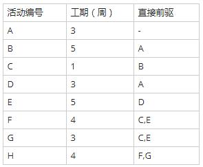

### 问题1
- A. 16
- B. 17
- C. 18
- D. 19
### 问题2
- A. A
- B. B
- C. D
- D. F

## 第17题（单选题）

风险的优先级通常是根据（  ）设定。

- A. 风险影响（Risk Impact）
- B. 风险概率（Risk Probability）
- C. 风险暴露（Risk Exposure）
- D. 风险控制（Risk Control）

## 第18题（单选题）

以下关于程序设计语言的叙述中，错误的是（  ）。

- A. 程序设计语言的基本成分包括数据、运算、控制和传输等
- B. 高级程序设计语言不依赖于具体的机器硬件
- C. 程序中局部变量的值在运行时不能改变
- D. 程序中常量的值在运行时不能改变

## 第19题（单选题）

与算术表达式“（a+（b-c））*d”对应的树是（  ）。

- A. 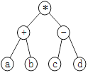
- B. 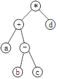
- C. 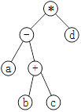
- D. 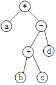

## 第20题（单选题）

C程序中全局变量的存储空间在（  ）分配。

- A. 代码区
- B. 静态数据区
- C. 栈区
- D. 堆区

## 第21题（单选题）

进程P1、P2、P3、P4和P5的前趋图如下所示：
 
 若用PV操作控制进程P1、P2、P3、P4 、P5并发执行的过程，则需要设置5个信号量S1、S2、S3、S4和S5，且信号量S1～S5的初值都等于零。下图中a、b 和c处应分别填写（  ）；d和e处应分别填写（  ），f和g处应分别填写（  ）。
 

### 问题1
- A. V（S1）、P（S1）和V（S2）V（S3）
- B. P（S1）、V （S1）和V（S2）V（S3）
- C. V（S1）、V（S2）和P（S1）V（S3）
- D. P（S1）、V（S2）和V （S1）V（S3）
### 问题2
- A. V（S2）和P（S4）
- B. P（S2）和V（S4）
- C. P（S2）和P（S4）
- D. V（S2）和V（S4）
### 问题3
- A. P（S3）和V（S4）V（S5）
- B. V（S3）和P（S4）P（S5）
- C. P （S3）和P（S4）P（S5）
- D. V（S3）和V（S4）V（S5）

## 第22题（单选题）

某进程有4个页面，页号为0~3，页面变换表及状态位、访问位和修改位的含义如下图所示。若系统给该进程分配了3个存储块，当访问前页面1不在内存时，淘汰表中页号为（  ）的页面代价最小。
 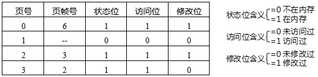

- A. 0
- B. 1
- C. 2
- D. 3

## 第23题（单选题）

嵌入式系统初始化过程主要有3个环节，按照自底向上、从硬件到软件的次序依次为（【#题号#】）。系统级初始化主要任务是（【#题号#】）。
 问题1
 问题2

### 补充题面

["{\"A\":\"片级初始化→系统级初始化→板级初始化\",\"B\":\"片级初始化→板级初始化→系统级初始化\",\"C\":\"系统级初始化→板级初始化→片级初始化\",\"D\":\"系统级初始化→片级初始化→板级初始化\"}","{\"A\":\"完成嵌入式微处理器的初始化\",\"B\":\"完成嵌入式微处理器以外的其他硬件设备的初始化\",\"C\":\"以软件初始化为主，主要进行操作系统的初始化\",\"D\":\"设置嵌入式微处理器的核心寄存器和控制寄存器工作状态\"}"]

## 第24题（单选题）

某公司计划开发一种产品，技术含量很高，与客户相关的风险也很多，则最适于采用（  ）开发过程模型。

- A. 瀑布
- B. 原型
- C. 增量
- D. 螺旋

## 第25题（单选题）

在敏捷过程的方法中（  ）认为每一个不同的项目都需要一套不同的策略、约定和方法论。

- A. 极限编程（XP）
- B. 水晶法（Crystal）
- C. 并列争球法（Scrum）
- D. 自适应软件开发（ASD）

## 第26题（单选题）

软件配置管理的内容不包括（  ）。

- A. 版本控制
- B. 变更控制
- C. 过程支持
- D. 质量控制

## 第27题（单选题）

某模块实现两个功能：向某个数据结构区域写数据和从该区域读数据。该模块的内聚类型为（  ）内聚。

- A. 过程
- B. 时间
- C. 逻辑
- D. 通信

## 第28题（单选题）

正式技术评审的目标是（  ）。

- A. 允许高级技术人员修改错误
- B. 评价程序员的工作效率
- C. 发现软件中的错误
- D. 记录程序员的错误情况并与绩效挂钩

## 第29题（单选题）

自底向上的集成测试策略的优点包括（  ）。

- A. 主要的设计问题可以在测试早期处理
- B. 不需要写驱动程序
- C. 不需要写桩程序
- D. 不需要进行回归测试

## 第30题（单选题）

采用McCabe度量法计算下列程序图的环路复杂性为（  ）。
 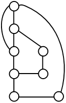

- A. 2
- B. 3
- C. 4
- D. 5

## 第31题（单选题）

以下关于软件可维护性的叙述中，不正确的是“可维护性（  ）”。

- A. 是衡量软件质量的一个重要特性
- B. 不受软件开发文档的影响
- C. 是软件开发阶段各个时期的关键目标
- D. 可以从可理解性、可靠性、可测试性、可行性、可移植性等方面进行度量

## 第32题（单选题）

对象、类、继承和消息传递是面向对象的4个核心概念。其中对象是封装（  ）的整体。

- A. 命名空间
- B. 要完成任务
- C. 一组数据
- D. 数据和行为

## 第33题（单选题）

面向对象（  ）选择合适的面向对象程序设计语言，将程序组织为相互协作的对象集合，每个对象表示某个类的实例，类通过继承等关系进行组织。

- A. 分析
- B. 设计
- C. 程序设计
- D. 测试

## 第34题（单选题）

一个类可以具有多个同名而参数类型列表不同的方法，被称为方法（  ）。

- A. 重载
- B. 调用
- C. 重置
- D. 标记

## 第35题（单选题）

UML中有4种关系：依赖、关联、泛化和实现。（  ）是一种结构关系，描述了一组链，链是对象之间的连接；（  ）是一种特殊/一般关系，使子元素共享其父元素的结构和行为。

### 问题1
- A. 依赖
- B. 关联
- C. 泛化
- D. 实现
### 问题2
- A. 依赖
- B. 关联
- C. 泛化
- D. 实现

## 第36题（单选题）

UML图中，对新开发系统的需求进行建模，规划开发什么功能或测试用例，采用（  ）最适合。而展示交付系统的软件组件和硬件之间的关系的图是（  ）。

### 问题1
- A. 类图
- B. 对象图
- C. 用例图
- D. 交互图
### 问题2
- A. 类图
- B. 部署图
- C. 组件图
- D. 网络图

## 第37题（单选题）

下图所示为（  ）设计模式，属于（  ）设计模式，适用于（  ）。
 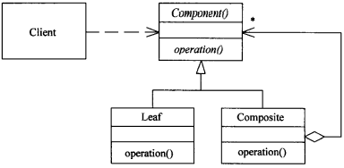

### 问题1
- A. 代理（Proxy）
- B. 生成器（Builder）
- C. 组合（Composite）
- D. 观察者（Observer）
### 问题2
- A. 创建型
- B. 结构型
- C. 行为
- D. 结构型和行为
### 问题3
- A. 表示对象的部分一整体层次结构时
- B. 当一个对象必须通知其他对象，而它又不能假定其他对象是谁时
- C. 当创建复杂对象的算法应该独立于该对象的组成部分及其装配方式时
- D. 在需要比较通用和复杂的对象指针代替简单的指针时

## 第38题（单选题）

某些设计模式会引入总是被用作参数的对象（  ）对象是一个多态 accept方法的参数。

- A. Visitor
- B. Command
- C. Memento
- D. Observer

## 第39题（单选题）

对高级语言源程序进行编译或解释的过程可以分为多个阶段，解释方式不包含（  ）阶段。

- A. 词法分析
- B. 语法分析
- C. 语义分析
- D. 目标代码生成

## 第40题（单选题）

某非确定的有限自动机（NFA）的状态转换图如下图所示（q0既是初态也是终态），与该NFA等价的确定的有限自动机（DFA）是（  ）。
 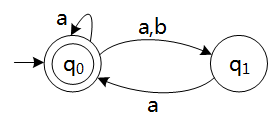

- A. 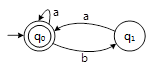
- B. 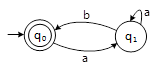
- C. 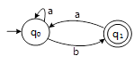
- D. 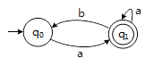

## 第41题（单选题）

递归下降分析方法是一种（  ）方法。

- A. 自底向上的语法分析
- B. 自上而下的语法分析
- C. 自底向上的词法分析
- D. 自上而下的词法分析

## 第42题（单选题）

若关系R(H，L，M，P)的主键为全码(All-key)，则关系R的主键应（  ）。

- A. 为HLMP
- B. 在集合{H，L，M，P）中任选一个
- C. 在集合{ HL，HM，HP，LM，LP，MP}中任选一个
- D. 在集合{HLM，HLP，HMP，LMP}中任选一个

## 第43题（单选题）

给定关系模式R（A1，A2，A3，A4）上的函数依赖集F={A1A3→A2，A2→A3}。若将R分解为p ={（ A1，A2），（ A1，A3）}，则该分解是（  ）的。

- A. 无损联接且不保持函数依赖
- B. 无损联接且保持函数依赖
- C. 有损联接且保持函数依赖
- D. 有损联接且不保持函数依赖

## 第44题（单选题）

（  ）算法采用模拟生物进化的三个基本过程“繁殖（选择）→交叉（重组）→变异（突变）”。

- A. 粒子群
- B. 人工神经网络
- C. 遗传
- D. 蚁群

## 第45题（单选题）

部门、员工和项目的关系模式及它们之间的E-R图如下所示，其中，关系模式中带实下划线的属性表示主键属性。图中：
     部门（部门代码，部门名称，电话）
     员工（员工代码，姓名，部门代码，联系方式，薪资）
     项目（项目编号，项目名称，承担任务）
     
 若部门和员工关系进行自然连接运算，其结果集为（  ）元关系。由于员工和项目之间关系之间的联系类型为（  ），所以员工和项目之间的联系需要转换成一个独立的关系模式，该关系模式的主键是（  ）。

### 问题1
- A. 5
- B. 6
- C. 7
- D. 8
### 问题2
- A. 1对1
- B. 1对多
- C. 多对1
- D. 多对多
### 问题3
- A. （项目名称，员工代码）
- B. （项目编号，员工代码）
- C. （项目名称，部门代码）
- D. （项目名称，承担任务）

## 第46题（单选题）

设某循环队列Q的定义中有front和rear两个域变量，其中，front指示队头元素的位置，rear指示队尾元素之后的位置，如下图所示。若该队列的容量为M，则其长度为（  ）。
 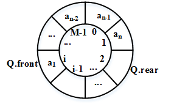

- A. (Q.rear-Q.front +1)
- B. (Q.rear-Q.front+M)
- C. (Q.rear-Q.front+1)%M
- D. (Q.rear-Q.front+M)%M

## 第47题（单选题）

设栈S和队列Q的初始状态为空，元素a b c d e f g依次进入栈S。要求每个元素出栈后立即进入队列Q，若7个元素出队列的顺序为b d f e c a g，则栈S的容量最小应该是（  ）。

- A. 5
- B. 4
- C. 3
- D. 2

## 第48题（单选题）

某二叉树的先序遍历序列为c a b f e d g ，中序遍历序列为a b c d e f g ，则该二叉树是（  ）。

- A. 完全二叉树
- B. 最优二叉树
- C. 平衡二叉树
- D. 满二叉树

## 第49题（单选题）

对某有序顺序表进行折半查找时，（  ）不可能构成查找过程中关键字的比较序列。

- A. 45,10,30,18,25
- B. 45,30,18,25,10
- C. 10,45,18,30,25
- D. 10,18,25,30,45

## 第50题（单选题）

用某排序方法对一元素序列进行非递减排序时，若该方法可保证在排序前后排序码相同者的相对位置不变，则称该排序方法是稳定的。简单选择排序法排序方法是不稳定的，（  ）可以说明这个性质。

- A. 21 48 21* 63 17
- B. 17 21 21* 48 63
- C. 63 21 48 21* 17
- D. 21* 17 48 63 21

## 第51题（单选题）

优先队列通常采用（  ）数据结构实现，向优先队列中插入一个元素的时间复杂度为（  ）。

### 问题1
- A. 堆
- B. 栈
- C. 队列
- D. 线性表
### 问题2
- A. O(n)
- B. O(1)
- C. O(lgn)
- D. O(n2)

## 第52题（单选题）

在n个数的数组中确定其第i(1≤i≤n)小的数时，可以采用快速排序算法中的划分思想，对n个元素划分，先确定第k小的数，根据i和k的大小关系，进一步处理，最终得到第i小的数。划分过程中，最佳的基准元素选择的方法是选择待划分数组的（  ）元素。此时，算法在最坏情况下的时间复杂度为（不考虑所有元素均相等的情况）（  ）。

### 问题1
- A. 第一个
- B. 最后一个
- C. 中位数
- D. 随机一个
### 问题2
- A. O(n)
- B. O(lgn)
- C. O(nlgn)
- D. O(n2)

## 第53题（单选题）

在下图所示的网络配置中，发现工作站B无法与服务器A通信。（  ）故障影响了两者互通。
 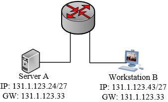

- A. 服务器A的IP地址是广播地址
- B. 工作站B的IP地址是网络地址
- C. 工作站B与网关不属于同一子网
- D. 服务器A与网关不属于同一子网

## 第54题（单选题）

以下关于VLAN的叙述中，属于其优点的是（  ）。

- A. 允许逻辑地划分网段
- B. 减少了冲突域的数量
- C. 增加了冲突域的大小
- D. 减少了广播域的数量

## 第55题（单选题）

以下关于URL的叙述中，不正确的是（  ）。

- A. 使用www.abc.com和abc.com打开的是同一页面
- B. 在地址栏中输入www.abc.com默认使用http协议
- C. www.abc.com中的“www”是主机名
- D. www.abc.com中的“abc.com”是域名

## 第56题（单选题）

DHCP协议的功能是（  ）；FTP使用的传输层协议为（  ）。

### 问题1
- A. WINS名字解析
- B. 静态地址分配
- C. DNS名字登录
- D. 自动分配IP地址
### 问题2
- A. TCP
- B. IP
- C. UDP
- D. HDLC

## 第57题（单选题）

Why Have Formal Documents?
First, writing the decisions down is essential. Only when one writes do the gaps appear and the（1）protrude(突出).The act of writing turns out to require hundreds of mini-decisions,and it is the existence of these that distinguishes clear,exact policies from fuzzy ones.
Second.the documents will communicate the decisions to others. The manager will be continually amazed that policies he took for common knowledge are totally unknown by some member of his team . Since his fundamental job is to keep everybody going in the（2）directon, his chief daily task will be communication, not decision-making,and his documents will immensely（3）this load.
Finally,a manager,s documents give him a data base and checklist. By reviewing them（4）he sees where he is, and he sees what changes of emphasis or shifts in direction are needed.
The task of the manager is to develop a plan and then to realize it. But only the written plan is precise and communicable. Such a plan consists of documents on what,when, how much,where,and who.This small set of critical documents（5）much of the manager's work. If their comprehensive and critical nature is recognized in the beginning, the manager can approach them as friendly tools rather than annoying busywork. He will set his direction much more crisply and quickly by doing so.

### 问题1
- A. inconsistencies
- B. consistencies
- C. steadiness
- D. adaptability
### 问题2
- A. other
- B. different
- C. another
- D. same
### 问题3
- A. extend
- B. broaden
- C. lighten
- D. release
### 问题4
- A. periodically
- B. occasionally
- C. infrequently
- D. rarely
### 问题5
- A. decides
- B. encapsulates
- C. realizes
- D. recognizes
