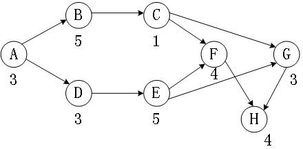
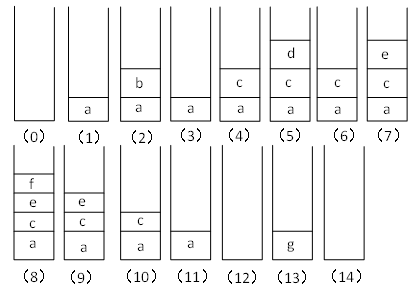
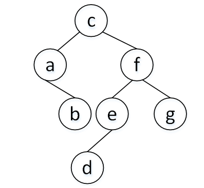
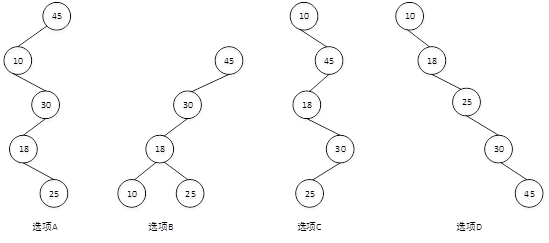

# 2015上半年选择题

- 来源标题: 2015年上半年软件设计师考试基础知识真题（专业解析+参考答案）
- 试卷介绍页: https://wangxiao.xisaiwang.com/tiku2/136/tp169024.html?cid=136
- 练习页: https://wangxiao.xisaiwang.com/tiku2/exam534904597.html
- 题量: 57

## 第1题（单选题）

计算机中CPU对其访问速度最快的是（C）。

- A. 内存
- B. Cache
- C. 通用寄存器
- D. 硬盘

### 正确答案

C

### 解析

题目中的存储设备按访问速度排序为：通用寄存器 >  Cache > 内存 > 硬盘。

## 第2题（单选题）

机器字长为n位的二进制数可以用补码来表示（A）个不同的有符号定点小数。

- A. 2n
- B. 2n-1
- C. 2n-1
- D. 2n-1+1

### 正确答案

A

### 解析

补码表示定点小数，范围是： [-1,(1-2-(n-1))]，这个范围一共有2n个数。

## 第3题（单选题）

Cache的地址映像方式中，发生块冲突次数最小的是（A）。

- A. 全相联映像
- B. 组相联映像
- C. 直接映像
- D. 无法确定的

### 正确答案

A

### 解析

全相联映像块冲突最小，其次为组相联映像，直接映像块冲突最大。

## 第4题（单选题）

计算机中CPU的中断响应时间指的是（D）的时间。

- A. 从发出中断请求到中断处理结束
- B. 从中断处理开始到中断处理结束
- C. CPU分析判断中断请求
- D. 从发出中断请求到开始进入中断处理程序

### 正确答案

D

### 解析

本题考查计算机系统的基础知识。
中断系统是计算机实现中断功能的软硬件总称。一般在CPU中设置中断机构，在外设接口中设置中断控制器，在软件上设置相应的中断服务程序。中断源在需要得到CPU服务时，请求CPU暂停现行工作转向为中断源服务，服务完成后，再让CPU回到原工作状态继续完成被打断的工作。中断的发生起始于中断源发出中断请求，中断处理过程中，中断系统需要解决一系列问题，包括中断响应的条件和时机，断点信息的保护与恢复，中断服务程序入口、中断处理等。中断响应时间，是指从发出中断请求到开始进入中断服务程序所需的时间。

## 第5题（单选题）

总线宽度为32bit，时钟频率为200MHz，若总线上每5个时钟周期传送一个32bit的字，则该总线的带宽为（C）MB/S。

- A. 40
- B. 80
- C. 160
- D. 200

### 正确答案

C

### 解析

总线的带宽指单位时间内传输的数据总量。
在计算机当中，时钟频率是其时钟周期的倒数，表示时间的度量，本题时钟周期为1/200MHz。
总线宽度是指总线的线数，即数据信号并行传输的能力，本题传送大小与总线宽度一致，不需要处理。
传送32bit的字，即数据总量为32bit；5个时钟周期，即（1/200MHz）×5，为总时间。
带宽=数据总量/总时间（注意单位的转换）。
即总带宽=32bit/（5/200MHz）=1280Mbit/s=160MB/s。【此处为了方便计算，让220与106近似相等。】

## 第6题（单选题）

以下关于指令流水线性能度量的叙述中，错误的是（D）。

- A. 最大吞吐率取决于流水线中最慢一段所需的时间
- B. 如果流水线出现断流，加速比会明显下降
- C. 要使加速比和效率最大化应该对流水线各级采用相同的运行时间
- D. 流水线采用异步控制会明显提高其性能

### 正确答案

D

### 解析

流水线的执行时间中，我们会发现流水线周期也就是最长的段会影响最终输出的时间，所以也称之为瓶颈时间。最大吞吐率是流水线周期的倒数，也就是说最大吞吐率取决于流水线中最慢一段所需的时间，A选项描述正确。
当指令各段时间不一样时，因为瓶颈时间的影响，中间会有一些等待时间，导致流水线的吞吐率不会达到最大，但指令各段时间一样时，流水线周期与其他段一致，流水线的普通吞吐率与流水线最大吞吐率相等了，此时流水线的效率才是最大化，也是加速比最大的情况。C选项描述正确。
加速比的计算在中级科目没有涉及到，这里理解为加速效果即可。加速比=顺序执行时间：流水线执行时间，当流水线执行时间越小，加速比越大，加速效果越好。
当流水线出现断流时，流水线效率会下降，此时加速比也会明显下降。B选项描述正确。
采用异步控制方式在给流水线提速的同时，会明显增加流水线阻塞的概率，所以不会明显提高整体性能。D选项描述错误。本题选择错误的说法，因此选择D选项。

## 第7题（单选题）

（C）协议在终端设备与远程站点之间建立安全连接。

- A. ARP
- B. Telnet
- C. SSH
- D. WEP

### 正确答案

C

### 解析

SSH 为 Secure Shell 的缩写，由 IETF 的网络工作小组（Network Working Group）所制定；SSH 为建立在应用层和传输层基础上的安全协议。SSH 是目前较可靠，专为远程登录会话和其他网络服务提供安全性的协议。利用 SSH 协议可以有效防止远程管理过程中的信息泄露问题。

## 第8题（单选题）

安全需求可划分为物理线路安全、网络安全、系统安全和应用安全。下面的安全需求中属于系统安全的是（C/D），属于应用安全的是（  ）。

### 问题1
- A. 机房安全
- B. 入侵检测
- C. 漏洞补丁管理
- D. 数据库安全
### 问题2
- A. 机房安全
- B. 入侵检测
- C. 漏洞补丁管理
- D. 数据库安全

### 正确答案

C、D

### 解析

机房安全属于物理安全，入侵检测属于网络安全，漏洞补丁管理属于系统安全，而数据库安全则是应用安全。
 安全防范体系的层次划分： 
 （1）物理环境的安全性。包括通信线路、物理设备和机房的安全等。物理层的安全主要体现在通信线路的可靠性（线路备份、网管软件和传输介质）、软硬件设备的安全性（替换设备、拆卸设备、增加设备）、设备的备份、防灾害能力、防干扰能力、设备的运行环境（温度、湿度、烟尘）和不间断电源保障等。
 （2）操作系统的安全性。主要表现在三个方面，一是操作系统本身的缺陷带来的不安全因素，主要包括身份认证、访问控制和系统漏洞等；二是对操作系统的安全配置问题；三是病毒对操作系统的威胁。 
 （3）网络的安全性。网络层的安全问题主要体现在计算机网络方面的安全性，包括网络层身份认证、网络资源的访问控制、数据传输的保密与完整性、远程接入的安全、域名系统的安全、路由系统的安全、入侵检测的手段和网络设施防病毒等。 
 （4）应用的安全性。由提供服务所采用的应用软件和数据的安全性产生，包括Web服务、电子邮件系统和DNS等。此外，还包括病毒对系统的威胁。 
 （5）管理的安全性。包括安全技术和设备的管理、安全管理制度、部门与人员的组织规则等。管理的制度化极大程度地影响着整个计算机网络的安全，严格的安全管理制度、明确的部门安全职责划分与合理的人员角色配置，都可以在很大程度上降低其他层次的安全漏洞。

## 第9题（单选题）

王某是某公司的软件设计师，每当软件开发完成后均按公司规定编写软件文档，并提交公司存档。那么该软件文档的著作权（A）享有。

- A. 应由公司
- B. 应由公司和王某共同
- C. 应由王某
- D. 除署名权以外，著作权的其他权利由王某

### 正确答案

A

### 解析

题目所述的情况，属于典型的职务作品，由单位享有著作权。

## 第10题（单选题）

甲、乙两公司的软件设计师分别完成了相同的计算机程序发明，甲公司先于乙公司完成，乙公司先于甲公司使用。甲、乙公司于同一天向专利局申请发明专利。此情形下，（D）可获得专利权。

- A. 甲公司
- B. 甲、乙公司均
- C. 乙公司
- D. 由甲、乙公司协商确定谁

### 正确答案

D

### 解析

依据《中华人民共和国专利法实施细则（2010修订）》，第四十一条 　两个以上的申请人同日（指申请日；有优先权的，指优先权日）分别就同样的发明创造申请专利的，应当在收到国务院专利行政部门的通知后自行协商确定申请人。
   本题注意与商标权的确定规则区分开来，商标法是同日申请，先使用者获得，无法举证时，抽签决定，专利法，则不看是否先使用，直接协商。

## 第11题（单选题）

以下媒体中，（D）是感觉媒体。

- A. 音箱
- B. 声音编码
- C. 电缆
- D. 声音

### 正确答案

D

### 解析

感觉媒体：指人们接触信息的感觉形式。如：视觉、听觉、触觉、嗅觉和味觉等。
 表示媒体：指信息的表示形式。如：文字、图形、图像、动画、音频和视频等。
 显示媒体（表现媒体）：表现和获取信息的物理设备。如：输入显示媒体键盘、鼠标和麦克风等；输出显示媒体显示器、打印机和音箱等。
 存储媒体：存储数据的物理设备，如磁盘、光盘和内存等。
 传输媒体：传输数据的物理载体，如电缆、光缆和交换设备等。

## 第12题（单选题）

微型计算机系统中，显示器属于（A）。

- A. 表现媒体
- B. 传输媒体
- C. 表示媒体
- D. 存储媒体

### 正确答案

A

### 解析

感觉媒体：指人们接触信息的感觉形式。如：视觉、听觉、触觉、嗅觉和味觉等。
 表示媒体：指信息的表示形式。如：文字、图形、图像、动画、音频和视频等。
 显示媒体（表现媒体）：表现和获取信息的物理设备。如：输入显示媒体键盘、鼠标和麦克风等；输出显示媒体显示器、打印机和音箱等。
 存储媒体：存储数据的物理设备，如磁盘、光盘和内存等。
 传输媒体：传输数据的物理载体，如电缆、光缆和交换设备等。

## 第13题（单选题）

（C）是表示显示器在纵向（列）上具有的像素点数目指标。

- A. 显示分辨率
- B. 水平分辨率
- C. 垂直分辨率
- D. 显示深度

### 正确答案

C

### 解析

本题考查多媒体的基本知识。
显示分辨率是指显示器上能够显示出的像素点数目，即显示器在横向和纵向上能够显示出的像素点数目。水平分辨率表明显示器水平方向（横向）上显示出的像素点数目，垂直分辨率表明显示器垂直方向（纵向）上显示出的像素点数目。例如，显示分辨率为 1024×768 则表明显示器水平方向上显示 1024个像素点，垂直方向上显示 768个像素点， 整个显示屏就含有796432个像素点。屏幕能够显示的像素越多，说明显示设备的分辨率越高，显示的图像质量越高。显示深度是指显示器上显示每个像素点颜色的二进制位数。

## 第14题（单选题）

软件工程的基本要素包括方法、工具和（C）。

- A. 软件系统
- B. 硬件系统
- C. 过程
- D. 人员

### 正确答案

C

### 解析

本题考查软件工程的基本概念。
 软件工程是一种层次化的技术，从底向上分别为质量、过程、方法和工具。任何工程方法必须以有组织的质量承诺为基础。软件工程的基础是过程，过程是将技术结合在一起的凝聚力，使得计算机软件能够被合理地和及时地开发，过程定义了一组关键过程区域，构成了软件项目管理控制的基础；方法提供了建造软件在技术上需要“如何做”， 它覆盖了一系列的任务。方法也依赖于一些基本原则，这些原则控制了每一个技术区域，而且包含建模活动和其他描述技术；工具对过程和方法提供了自动或半自动的支持，如：计算机辅助软件工程（CASE）。软件工程的基本要素包括方法、工具和过程。

## 第15题（单选题）

在（A）设计阶段选择适当的解决方案，将系统分解为若干个子系统，建立整个系统的体系结构。

- A. 概要
- B. 详细
- C. 结构化
- D. 面向对象

### 正确答案

A

### 解析

本题考查软件工程的基本概念。
软件设计的任务是基于需求分析的结果建立各种设计模型，给出问题的解决方案。从工程管理的角度，可以将软件设计分为两个阶段：概要设计阶段和详细设计阶段。结构化设计方法中，概要设计阶段进行软件体系结构的设计、数据设计和接口设计；详细设计阶段进行数据结构和算法的设计。面对对象设计方法中，概要设计阶段进行体系结构设计、初步的类设计/数据设计、结构设计；详细设计阶段进行构件设计。
结构化设计和面向对象设计是两种不通过的设计方法，结构化设计根据系统的数据流图进行设计，模块体现为函数、过程及子程序；面向对象设计基于面向对象的基本概念进行，模块体现为类、对象和构件等。

## 第16题（单选题）

某项目包含的活动如下表所示，完成整个项目的最短时间为（D/B）周。不能通过缩短活动（  ）的工期，来缩短整个项目的完成时间。

### 问题1
- A. 16
- B. 17
- C. 18
- D. 19
### 问题2
- A. A
- B. B
- C. D
- D. F

### 正确答案

D、B

### 解析

[['
 PERT图是一个有向图，箭头表示任务，可以标上完成该任务所需的时间；箭头指向节点表示流入节点的任务的结束，并开始流出节点的任务，节点表示事件。用时最长的路径为关键路径。
 本题关键路径为：A、D、E、F、H，长度19，所以最短工期19周。
由于B不是关键路径上的活动，所以压缩它，无法缩短整个项目的完成时间。

'''],['
']]

## 第17题（单选题）

风险的优先级通常是根据（C）设定。

- A. 风险影响（Risk Impact）
- B. 风险概率（Risk Probability）
- C. 风险暴露（Risk Exposure）
- D. 风险控制（Risk Control）

### 正确答案

C

### 解析

风险暴露又称风险曝光度，测量的是资产的整个安全性风险，它将表示实际损失的可能性与表示大量可能损失的资讯结合到单一数字评估中。在形式最简单的定量性风险分析中，风险曝光度可透过将风险可能性及影响相乘算出。
 风险曝光度（Risk Exposure）=错误出现率（风险出现率）×错误造成损失（风险损失）。

## 第18题（单选题）

以下关于程序设计语言的叙述中，错误的是（C）。

- A. 程序设计语言的基本成分包括数据、运算、控制和传输等
- B. 高级程序设计语言不依赖于具体的机器硬件
- C. 程序中局部变量的值在运行时不能改变
- D. 程序中常量的值在运行时不能改变

### 正确答案

C

### 解析

本题考查程序语言基础知识。
选项 A 涉及程序语言的一般概念，程序设计语言的基本成分包括数据、运算、控制和传输等。
选项 B 考查高级语言和低级语言的概念。对于程序设计语言，高级语言和低级语言是指其相对于运行程序的机器的抽象程度。低级语言在形式上更接近机器指令，汇编语言就是与机器指令一一对应的。高级语言对底层操作进行了抽象和封装，其一条语句对应多条机器指令，使编写程序的过程更符合人类的思维习惯，并且极大简化了人力劳动。高级语言不依赖于具体的机器硬件。
选项 C 考查局部变量的概念，凡是在函数内部定义的变量都是局部变量（也称作内部变量），包括在函数内部复合语句中定义的变量和函数形参表中说明的形式参数 。局部 变量只能在函数内部使用，其作用域是从定义位置起至函数体或复合语句体结束为止。 局部变量的值通常在其生存期内是变化的。
选项D考查常量的概念，程序中常量的值在运行时是不能改变的。

## 第19题（单选题）

与算术表达式“（a+（b-c））*d”对应的树是（B）。

- A. 
- B. 
- C. 
- D. 

### 正确答案

B

### 解析

本题考查的是表达式的树形表示，我们常见的表达式形式是树的中序遍历序列。
对算术表达式“(a+(b-c))*d”求值的运算处理顺序是：先进行b-c， 然后与 a 相加，最后再与 d 相乘。只有选项 B 所示的二叉树与其相符。

## 第20题（单选题）

C程序中全局变量的存储空间在（B）分配。

- A. 代码区
- B. 静态数据区
- C. 栈区
- D. 堆区

### 正确答案

B

### 解析

全局变量、静态局部变量、静态全局变量都存放在静态数据存储区。

## 第21题（单选题）

进程P1、P2、P3、P4和P5的前趋图如下所示：
 
 若用PV操作控制进程P1、P2、P3、P4 、P5并发执行的过程，则需要设置5个信号量S1、S2、S3、S4和S5，且信号量S1～S5的初值都等于零。下图中a、b 和c处应分别填写（A/B/C）；d和e处应分别填写（  ），f和g处应分别填写（  ）。
 

### 问题1
- A. V（S1）、P（S1）和V（S2）V（S3）
- B. P（S1）、V （S1）和V（S2）V（S3）
- C. V（S1）、V（S2）和P（S1）V（S3）
- D. P（S1）、V（S2）和V （S1）V（S3）
### 问题2
- A. V（S2）和P（S4）
- B. P（S2）和V（S4）
- C. P（S2）和P（S4）
- D. V（S2）和V（S4）
### 问题3
- A. P（S3）和V（S4）V（S5）
- B. V（S3）和P（S4）P（S5）
- C. P （S3）和P（S4）P（S5）
- D. V（S3）和V（S4）V（S5）

### 正确答案

A、B、C

### 解析

1.根据前驱图，P3进程执行完需要通知P2进程，故需要利用V（S1）操作通知P2进程，所以空a应填V（S1）；P2进程需要等待P1进程的结果，故需要利用P（S1）操作测试P1进程是否运行完，所以空b应填P（S1）；又由于P2进程运行结束需要利用V（S2）、V（S3）操作分别通知P3、P4进程，所以空c应填V（S2）、V（S3）。
2.根据前驱图，P3进程运行前需要等待P2进程的结果，故需执行程序前要先利用1个P操作，根据排除法可选项只有选项B和选项C。又因为P3进程运行结束后需要利用1个V操作通知P5进程，根据排除法可选项只有选项B满足要求。
3.根据前驱图，P4进程执行前需要等待P2进程的结果，故空f处需要1个P操作；P5进程执行前需要等待P3和P4进程的结果，故空g处需要2个P操作。根据排除法可选项只有选项C能满足要求。

## 第22题（单选题）

某进程有4个页面，页号为0~3，页面变换表及状态位、访问位和修改位的含义如下图所示。若系统给该进程分配了3个存储块，当访问前页面1不在内存时，淘汰表中页号为（D）的页面代价最小。
 

- A. 0
- B. 1
- C. 2
- D. 3

### 正确答案

D

### 解析

在本题中，内存中的3个页面，都是刚刚被访问过的。所以在此，不能以访问位作为判断标准。只能看修改位，修改位中，只有3号页未被修改，如果淘汰3号页，直接淘汰即可，没有附属的工作要做，而淘汰0号或2号，则需要把修改的内容进行更新，这样会有额外的开销。因此本题选择D选项。

## 第23题（单选题）

嵌入式系统初始化过程主要有3个环节，按照自底向上、从硬件到软件的次序依次为（【#题号#】）。系统级初始化主要任务是（【#题号#】）。
 问题1
 问题2

### 补充题面

["{\"A\":\"片级初始化→系统级初始化→板级初始化\",\"B\":\"片级初始化→板级初始化→系统级初始化\",\"C\":\"系统级初始化→板级初始化→片级初始化\",\"D\":\"系统级初始化→片级初始化→板级初始化\"}","{\"A\":\"完成嵌入式微处理器的初始化\",\"B\":\"完成嵌入式微处理器以外的其他硬件设备的初始化\",\"C\":\"以软件初始化为主，主要进行操作系统的初始化\",\"D\":\"设置嵌入式微处理器的核心寄存器和控制寄存器工作状态\"}"]

### 正确答案

B、C

### 解析

系统初始化过程可以分为3个主要环节，按照自底向上、从硬件到软件的次序依次为：片级初始化、板级初始化和系统级初始化。
**片级初始化**
完成嵌入式微处理器的初始化，包括设置嵌入式微处理器的核心寄存器和控制寄存器、嵌入式微处理器核心工作模式和嵌入式微处理器的局部总线模式等。片级初始化把嵌入式微处理器从上电时的默认状态逐步设置成系统所要求的工作状态。这是一个纯硬件的初始化过程。
**板级初始化**
完成嵌入式微处理器以外的其他硬件设备的初始化。另外，还需设置某些软件的数据结构和参数，为随后的系统级初始化和应用程序的运行建立硬件和软件环境。这是一个同时包含软硬件两部分在内的初始化过程。
**系统初始化**
该初始化过程以软件初始化为主，主要进行操作系统的初始化。BSP将对嵌入式微处理器的控制权转交给嵌入式操作系统，由操作系统完成余下的初始化操作，包含加载和初始化与硬件无关的设备驱动程序，建立系统内存区，加载并初始化其他系统软件模块，如网络系统、文件系统等。最后，操作系统创建应用程序环境，并将控制权交给应用程序的入口。
系统初始化过程可以分为3个主要环节，按照自底向上、从硬件到软件的次序依次为：片级初始化、板级初始化和系统级初始化。
**片级初始化**
完成嵌入式微处理器的初始化，包括设置嵌入式微处理器的核心寄存器和控制寄存器、嵌入式微处理器核心工作模式和嵌入式微处理器的局部总线模式等。片级初始化把嵌入式微处理器从上电时的默认状态逐步设置成系统所要求的工作状态。这是一个纯硬件的初始化过程。
**板级初始化**
完成嵌入式微处理器以外的其他硬件设备的初始化。另外，还需设置某些软件的数据结构和参数，为随后的系统级初始化和应用程序的运行建立硬件和软件环境。这是一个同时包含软硬件两部分在内的初始化过程。
**系统初始化**
该初始化过程以软件初始化为主，主要进行操作系统的初始化。BSP将对嵌入式微处理器的控制权转交给嵌入式操作系统，由操作系统完成余下的初始化操作，包含加载和初始化与硬件无关的设备驱动程序，建立系统内存区，加载并初始化其他系统软件模块，如网络系统、文件系统等。最后，操作系统创建应用程序环境，并将控制权交给应用程序的入口。

## 第24题（单选题）

某公司计划开发一种产品，技术含量很高，与客户相关的风险也很多，则最适于采用（D）开发过程模型。

- A. 瀑布
- B. 原型
- C. 增量
- D. 螺旋

### 正确答案

D

### 解析

这些模型中仅有螺旋模型考虑风险因素。

## 第25题（单选题）

在敏捷过程的方法中（B）认为每一个不同的项目都需要一套不同的策略、约定和方法论。

- A. 极限编程（XP）
- B. 水晶法（Crystal）
- C. 并列争球法（Scrum）
- D. 自适应软件开发（ASD）

### 正确答案

B

### 解析

敏捷开发是一种以人为核心、迭代、循序渐进的开发方法，常见的敏捷开发方法有极限编程法、水晶法、并列争球法和自适应软件开发方法。
极限编程是一种轻量级的开发方法，它提出了四大价值观：沟通、简单、反馈、勇气。五大原则：快速反馈、简单性假设、逐步修改、提倡更改、优质工作
水晶法强调经常交付，认为每一种不同的项目都需要一套不同的策略、约定和方法论。
并列争球法的核心是迭代、增量交付，按照30天进行迭代开发交付可实际运行的软件。
自适应软件开发的核心是三个非线性的，重迭的开发阶段：猜测、合作、学习。

## 第26题（单选题）

软件配置管理的内容不包括（D）。

- A. 版本控制
- B. 变更控制
- C. 过程支持
- D. 质量控制

### 正确答案

D

### 解析

本题考查软件配置管理的基础知识。
软件配置管理SCM用于整个软件工程过程，其主要目标是标识变更、控制变更、确保变更正确的实现，报告变更。其主要内容包括版本管理、配置支持、变更支持、过程支持、团队支持、变化报告和审计支持等。

## 第27题（单选题）

某模块实现两个功能：向某个数据结构区域写数据和从该区域读数据。该模块的内聚类型为（D）内聚。

- A. 过程
- B. 时间
- C. 逻辑
- D. 通信

### 正确答案

D

### 解析

站点未提供标准答案/解析

## 第28题（单选题）

正式技术评审的目标是（C）。

- A. 允许高级技术人员修改错误
- B. 评价程序员的工作效率
- C. 发现软件中的错误
- D. 记录程序员的错误情况并与绩效挂钩

### 正确答案

C

### 解析

正式技术评审是一种由软件工程师和其他人进行的软件质量保障活动。
 其目标包括：
 （1）发现功能、逻辑或实现的错误；
 （2）证实经过评审的软件的确满足需求；
 （3）保证软件的表示符合预定义的标准；
 （4）得到一种一致的方式开发的软件；
（5）使项目更易管理。

## 第29题（单选题）

自底向上的集成测试策略的优点包括（C）。

- A. 主要的设计问题可以在测试早期处理
- B. 不需要写驱动程序
- C. 不需要写桩程序
- D. 不需要进行回归测试

### 正确答案

C

### 解析

1、自顶向下集成
 优点：较早地验证了主要控制和判断点；按深度优先可以首先实现和验证一个完整的软件功能；功能较早证实，带来信心；只需一个驱动，减少驱动器开发的费用；支持故障隔离。
 缺点：柱的开发量大；底层验证被推迟；底层组件测试不充分。
 适应于产品控制结构比较清晰和稳定；高层接口变化较小；底层接口未定义或经常可能被修改；产品的主要控制组件具有较大的技术风险，需要尽早被验证；希望尽早能看到产品的系统功能行为。
 2、自底向上集成
 优点：对底层组件行为较早验证；工作最初可以并行集成，比自顶向下效率高；减少了桩的工作量；支持故障隔离。
 缺点：驱动的开发工作量大；对高层的验证被推迟，设计上的错误不能被及时发现。
 适应于底层接口比较稳定；高层接口变化比较频繁；底层组件较早被完成。
本题选择C选项。

## 第30题（单选题）

采用McCabe度量法计算下列程序图的环路复杂性为（C）。
 

- A. 2
- B. 3
- C. 4
- D. 5

### 正确答案

C

### 解析

McCabe度量法先画出程序图，然后采用公式V（G）=m-n+2计算环路复杂度，其中m是有向弧的数量，n是结点的数量。
 本题结点数：8，边数：10。
 10-8+2=4。

## 第31题（单选题）

以下关于软件可维护性的叙述中，不正确的是“可维护性（B）”。

- A. 是衡量软件质量的一个重要特性
- B. 不受软件开发文档的影响
- C. 是软件开发阶段各个时期的关键目标
- D. 可以从可理解性、可靠性、可测试性、可行性、可移植性等方面进行度量

### 正确答案

B

### 解析

本题考查维护方面的基础知识。
软件交付给用户使用后到软件报废之前都属于软件维护阶段。软件系统的可维护性可以定义为：维护人员理解、改正、改动和改进该软件的难易程度。提供软件可维护性是开发软件系统所有步骤的关键目的，是衡量软件质量的一种重要特性，可以从可理解性、可靠性、可测试性、可行性、可移植性等方面进行度量。良好的软件开发文档可以有效地提高软件的可维护性。

## 第32题（单选题）

对象、类、继承和消息传递是面向对象的4个核心概念。其中对象是封装（D）的整体。

- A. 命名空间
- B. 要完成任务
- C. 一组数据
- D. 数据和行为

### 正确答案

D

### 解析

本题考查面向对象的基本知识。
面向对象的4个核心概念是对象、类、继承和消息传递。其中，对象是基本的运行时的实体，它既包括数据（属性），也包括作用于数据的操作（行为）。所以，一个对象把属性和行为封装为一个整体。类定义了一组大体上相似的对象。一个类所包含的方法和数据描述一组对象的共同行为和属性。在进行类设计时，有些类之间存在一般和特殊关系，即一些类是某个类的特殊情况，某个类是一些类的一般情况，这就是继承关系。消息是对象之间进行通信的一种构造，包含要求接收对象去执行某些活动的信息。

## 第33题（单选题）

面向对象（C）选择合适的面向对象程序设计语言，将程序组织为相互协作的对象集合，每个对象表示某个类的实例，类通过继承等关系进行组织。

- A. 分析
- B. 设计
- C. 程序设计
- D. 测试

### 正确答案

C

### 解析

本题考查面向对象的基本知识。
在采用面向对象技术开发系统时，主要步骤有面向对象分析、面向对象设计、面向对象程序设计和面向对象测试。面向对象分析主要包括：认定对象、组织对象、描述对象间的相互作用、定义对象的操作、定义对象的内部信息。面向对象设计是设计分析模型和实现相应源代码。面向对象程序设计选择合适的面向对象程序设计语言，将程序组织为相互协作的对象集合，每个对象表示某个类的实例，类通过继承等关系进行组织。面向对象测试是尽可能早的开始进行系统测试，以发现系统中可能存在的错误并进行修复，进而保证系统质量。

## 第34题（单选题）

一个类可以具有多个同名而参数类型列表不同的方法，被称为方法（A）。

- A. 重载
- B. 调用
- C. 重置
- D. 标记

### 正确答案

A

### 解析

重载，简单说，就是函数或者方法有同样的名称，但是参数列表不相同的情形，这样的同名不同参数的函数或者方法之间，互相称之为重载函数或者方法。

## 第35题（单选题）

UML中有4种关系：依赖、关联、泛化和实现。（B/C）是一种结构关系，描述了一组链，链是对象之间的连接；（  ）是一种特殊/一般关系，使子元素共享其父元素的结构和行为。

### 问题1
- A. 依赖
- B. 关联
- C. 泛化
- D. 实现
### 问题2
- A. 依赖
- B. 关联
- C. 泛化
- D. 实现

### 正确答案

B、C

### 解析

UML 用关系把事物结合在一起，主要有下列四种关系：
 （1）依赖（dependency）。依赖是两个事物之间的语义关系，其中一个事物发生变化会影响另一个事物的语义。
 （2）关联（association）。关联描述一组对象之间连接的结构关系。
 （3）泛化（generalization）。泛化是一般化和特殊化的关系，描述特殊元素的对象可替换一般元素的对象。
 （4）实现（realization）。实现是类之间的语义关系，其中的一个类指定了由另一个类保证执行的契约。

## 第36题（单选题）

UML图中，对新开发系统的需求进行建模，规划开发什么功能或测试用例，采用（C/B）最适合。而展示交付系统的软件组件和硬件之间的关系的图是（  ）。

### 问题1
- A. 类图
- B. 对象图
- C. 用例图
- D. 交互图
### 问题2
- A. 类图
- B. 部署图
- C. 组件图
- D. 网络图

### 正确答案

C、B

### 解析

本题考查统一建模语言（UML）的基本知识。
UML中提供了多种建模系统需求的图，体现系统的静态方面和动态方面。
类图（Class Diadram）展现了一组对象、接口、协作和它们之间的关系。在面向对象系统的建模中，最常见的就是类图，它给出系统的静态设计视图。对象图（Object Diagram）展现了某一时刻一组对象以及他们之间的关系。对象图描述了在类图中所建立的事物的实例的静态快照，给出系统的静态设计视图或静态进程视图。用例图（Use Case Diagram）展现了一组用例、参与者（Actor）以及它们之间的关系。这个视图主要支持系统的行为，即该系统在它的周边环境的语境中所提供的外部可见服务。用例图用于对一个系统的需求进行建模，包括说明这个系统应该做什么（从系统外部的一个视点出发），而不考虑系统应该怎样做。交互图用于对系统的动态方面进行建模。一张交互图表现的是一个交互，由一组对象和它们之间的关系组成，包含它们之间可能传递的消息。交互图表现为序列图、通信图、交互概览图和时序图，每种针对不同的目的，能适用于不同的情况。序列图是强调消息时间顺序的交互图；通信图是强调接收和发送消息的对象的结构组织的交互图；交互概览图强调控制流的交互图。时序图（Timing Diagram）关注沿着线性时间轴、生命线内部和生命线之间的条件改变。
部署图（Deploy Diagram）是用来对面向对象系统的物理方面建模的方法，展现了运行时处理结点以及其中构件（制品）的配置。组件图（Component Diagram）展现了一组组件之间的组织和依赖。

## 第37题（单选题）

下图所示为（C/B/A）设计模式，属于（  ）设计模式，适用于（  ）。
 

### 问题1
- A. 代理（Proxy）
- B. 生成器（Builder）
- C. 组合（Composite）
- D. 观察者（Observer）
### 问题2
- A. 创建型
- B. 结构型
- C. 行为
- D. 结构型和行为
### 问题3
- A. 表示对象的部分一整体层次结构时
- B. 当一个对象必须通知其他对象，而它又不能假定其他对象是谁时
- C. 当创建复杂对象的算法应该独立于该对象的组成部分及其装配方式时
- D. 在需要比较通用和复杂的对象指针代替简单的指针时

### 正确答案

C、B、A

### 解析

代理模式（Proxy）：为其他对象提供一种代理以控制这个对象的访问。
生成器模式（Builder）：将一个复杂类的表示与其构造相分离，使得相同的构建过程能够得出不同的表示。
组合模式（Composite）：将对象组合成树型结构以表示“整体-部分”的层次结构，使得用户对单个对象和组合对象的使用具有一致性。
观察者模式（Observer）：定义对象间的一种一对多的依赖关系，当一个对象的状态发生改变时，所有依赖于它的对象都得到通知并自动更新。
按照设计模式的目的可以分为创建型、结构型和行为型三大类。创建型模式与对象的创建有关；结构型模式处理类或对象的组合；行为型模式对类或对象怎样交互和怎样分配职责进行描述。每种设计模式都有其适应性，描述适用于解决的问题场合。
 常见的创建型模式主要有工厂方法（Factory Method）、抽象工厂（Abstract Factory）、单例（Singleton）、构建器（Builder）、原型（Prototype）模式；
 结构型模式有适配器（Adapter）、组合（Composite）、装饰（Decorator）、代理（Proxy）、享元（Flyweight）、外观（Facade）、桥接（Bridge）模式；
 行为型模式有策略（Strategy）、模板方法（Template Method）、迭代器（Iterator）、责任链（Chain of Responsibility）、命令（Command）、备忘录（Memento）、状态（State）、访问者（Visitor）、解释器（（Interpreter）、中介者（Mediator）、观察者（Observer）模式。

## 第38题（单选题）

某些设计模式会引入总是被用作参数的对象（A）对象是一个多态 accept方法的参数。

- A. Visitor
- B. Command
- C. Memento
- D. Observer

### 正确答案

A

### 解析

本题考查设计模式的概念，对行为模式进行比较。
 行为型模式对类或对象怎样交互和怎样分配职责进行描述。很多行为模式注重封装变化。当一个程序的某个方面的特征经常发生改变时，这些模式就定义一个封装这个方面的对象。这样，当该程序的其他部分依赖于这个方面时，它们都可以与此对象协作。一些模式引入总是被用作参数的对象。有些模式定义一些可作为令牌进行传递的对象，这些对象将在稍后被调用。
 在Visitor模式中，一个Visitor对象是一个多态的accept操作的参数，这个操作作用于该Visitor对象访问的对象。因此本题选择A选项。
 在Command模式中，令牌代表一个请求。
 在Memento模式中，它代表在一个对象在某个特定时刻的内部状态。
 在Command模式和Memento模式这两种情况下，令牌都可以有一个复杂的内部表示，但客户并不会意识到这一点。
 在Observer模式中，通过引入Observer和Subject对象来分布通信。

## 第39题（单选题）

对高级语言源程序进行编译或解释的过程可以分为多个阶段，解释方式不包含（D）阶段。

- A. 词法分析
- B. 语法分析
- C. 语义分析
- D. 目标代码生成

### 正确答案

D

### 解析

本题考查程序语言基础知识。
用某种高级语言或汇编语言编写的程序称为源程序，源程序不能直接在计算机上执行。汇编语言源程序需要用一个汇编程序将其翻译成目标程序后才能执行。高级语言源程序则需要对应的解释程序或编译程序对其进行翻译，然后在机器上运行。
解释程序也称为解释器，它或者直接解释执行源程序，或者将源程序翻译成某种中间代码后再加以执行：而编译程序（编译器）则是将源程序翻译成目标语言程序，然后在计算机上运行目标程序。这两种语言处理程序的根本区别是：在编译方式下，机器上 运行的是与源程序等价的目标程序，源程序和编译程序都不再参与目标程序的执行过程：而在解释方式下，解释程序和源程序（或其某种等价表示）要参与到程序的运行过程中， 运行程序的控制权在解释程序。简单来说，在解释方式下，翻译源程序时不生成独立的目标程序，而编译器则将源程序翻译成独立保存的目标程序。

## 第40题（单选题）

某非确定的有限自动机（NFA）的状态转换图如下图所示（q0既是初态也是终态），与该NFA等价的确定的有限自动机（DFA）是（A）。
 

- A. 
- B. 
- C. 
- D. 

### 正确答案

A

### 解析

本题使用代入法进行验证比较容易。
（1）代入aaa，选项B与C无法解析，故排除。
（2）代入ba，选项D无法解析，也要排除，此时可以确定正确答案为A。

## 第41题（单选题）

递归下降分析方法是一种（B）方法。

- A. 自底向上的语法分析
- B. 自上而下的语法分析
- C. 自底向上的词法分析
- D. 自上而下的词法分析

### 正确答案

B

### 解析

所谓递归下降法（recursive descent method），是指对文法的每一非终结符号，都根据相应产生式各候选式的结构，为其编写一个子程序 （或函数），用来识别该非终结符号所表示的语法范畴。

## 第42题（单选题）

若关系R(H，L，M，P)的主键为全码(All-key)，则关系R的主键应（A）。

- A. 为HLMP
- B. 在集合{H，L，M，P）中任选一个
- C. 在集合{ HL，HM，HP，LM，LP，MP}中任选一个
- D. 在集合{HLM，HLP，HMP，LMP}中任选一个

### 正确答案

A

### 解析

All-key关系模型的所有属性组成该关系模式的候选码，称为全码。

## 第43题（单选题）

给定关系模式R（A1，A2，A3，A4）上的函数依赖集F={A1A3→A2，A2→A3}。若将R分解为p ={（ A1，A2），（ A1，A3）}，则该分解是（D）的。

- A. 无损联接且不保持函数依赖
- B. 无损联接且保持函数依赖
- C. 有损联接且保持函数依赖
- D. 有损联接且不保持函数依赖

### 正确答案

D

### 解析

本题考查关系数据库规范化理论方面的基础知识。
正确答案为D。设U1={A1，A2}，U2={A1，A3}，那么可得出：
（U1∩U2）→（U1-U2）= A1→A2，（U1∩U2）→（U2-U1）= A1→A3
 而A1→A2，A1→A3∉F+，多以分解ρ是有损连接的。
 又因为F1=F2=∅，F+≠（F1∪F2）+，所以分解不保持函数依赖。

## 第44题（单选题）

（C）算法采用模拟生物进化的三个基本过程“繁殖（选择）→交叉（重组）→变异（突变）”。

- A. 粒子群
- B. 人工神经网络
- C. 遗传
- D. 蚁群

### 正确答案

C

### 解析

遗传算法（Genetic Algorithm）是模拟达尔文生物进化论的自然选择和遗传学机理的生物进化过程的计算模型，是一种通过模拟自然进化过程搜索最优解的方法。遗传算法是从代表问题可能潜在的解集的一个种群（population）开始的，而一个种群则由经过基因（gene）编码的一定数目的个体（individual）组成。每个个体实际上是染色体（chromosome）带有特征的实体。染色体作为遗传物质的主要载体，即多个基因的集合，其内部表现（即基因型）是某种基因组合，它决定了个体的形状的外部表现，如黑头发的特征是由染色体中控制这一特征的某种基因组合决定的。
 遗传算法的基本运算过程如下：
 （1）初始化
 （2）个体评价
 （3）选择运算
 （4）交叉运算
 （5）变异运算

## 第45题（单选题）

部门、员工和项目的关系模式及它们之间的E-R图如下所示，其中，关系模式中带实下划线的属性表示主键属性。图中：
     部门（部门代码，部门名称，电话）
     员工（员工代码，姓名，部门代码，联系方式，薪资）
     项目（项目编号，项目名称，承担任务）
     
 若部门和员工关系进行自然连接运算，其结果集为（C/D/B）元关系。由于员工和项目之间关系之间的联系类型为（  ），所以员工和项目之间的联系需要转换成一个独立的关系模式，该关系模式的主键是（  ）。

### 问题1
- A. 5
- B. 6
- C. 7
- D. 8
### 问题2
- A. 1对1
- B. 1对多
- C. 多对1
- D. 多对多
### 问题3
- A. （项目名称，员工代码）
- B. （项目编号，员工代码）
- C. （项目名称，部门代码）
- D. （项目名称，承担任务）

### 正确答案

C、D、B

### 解析

本题考查关系数据库E-R模型的相关知识。
1.自然连接的结果是二者属性列数之和减去一次重复列的数量。
2.在E-R模型中，用1    1表示1对1联系，用1   *表示1对多联系，用*   *表示多对多联系。员工与项目之间，根据图示可以看到是*  *，也就是多对多的联系。
3.因为员工和项目之间是一个多对多的联系，根据E-R图向关系模式转换的规则：多对多联系只能转换成一个独立的关系模式，关系模式的名称取联系的名称，关系模式的属性取该联系所关联的两个多方实体的主键及联系的属性，关系的码是多方实体的主键构成的属性组。由于员工关系的主键是员工代码，项目关系的主键是项目编号，因此，根据该转换规则，员工和项目之间的联系的关系模式的主键是（员工代码，项目编号）。

## 第46题（单选题）

设某循环队列Q的定义中有front和rear两个域变量，其中，front指示队头元素的位置，rear指示队尾元素之后的位置，如下图所示。若该队列的容量为M，则其长度为（D）。
 

- A. (Q.rear-Q.front +1)
- B. (Q.rear-Q.front+M)
- C. (Q.rear-Q.front+1)%M
- D. (Q.rear-Q.front+M)%M

### 正确答案

D

### 解析

本题考查循环队列长度的求取。
根据图示，可以得到长度（Q.rear-Q.front+M），但在此不容忽视的一个问题是，循环队列在进行了多次入队出队操作之后，可能出现超出队列长度溢出的情况，因此需要让其与M进行求模操作，修正位置，故（Q.rear-Q.front+M）%M为队列中的元素个数（即队列长度）。

## 第47题（单选题）

设栈S和队列Q的初始状态为空，元素a b c d e f g依次进入栈S。要求每个元素出栈后立即进入队列Q，若7个元素出队列的顺序为b d f e c a g，则栈S的容量最小应该是（B）。

- A. 5
- B. 4
- C. 3
- D. 2

### 正确答案

B

### 解析

本题考查数据结构基础知识。
根据队列的特点，元素出队的顺序与入队的顺序相同，因此，可知这7个元素的出栈顺序为b d f e c a g。对于入栈序列a b c d e f g，得出出栈序列b d f e c a g的操作过程为：push（a入）、push（b入）、pop（b出）、push（c入）、push（d入）、pop（d出）、push（e入）、push（f入）、pop（f出）、pop（e出）、pop（c出）、pop（a出）、push（g入）、pop（g出），如下图所示，从中可知栈S中元素最多时为4。因此，S的容量最小为4。
 

## 第48题（单选题）

某二叉树的先序遍历序列为c a b f e d g ，中序遍历序列为a b c d e f g ，则该二叉树是（C）。

- A. 完全二叉树
- B. 最优二叉树
- C. 平衡二叉树
- D. 满二叉树

### 正确答案

C

### 解析

本题考查数据结构基础知识。
根据题中所给的遍历序列，可知其对应的二叉树如下图所示。

 由图可知，该树不满足完全二叉树和满二叉树，并且，本题没有涉及权值概念，不属于最优二叉树。
 在图中可以看到，这棵树满足平衡二叉树，因此选择C选项。

## 第49题（单选题）

对某有序顺序表进行折半查找时，（B）不可能构成查找过程中关键字的比较序列。

- A. 45,10,30,18,25
- B. 45,30,18,25,10
- C. 10,45,18,30,25
- D. 10,18,25,30,45

### 正确答案

B

### 解析

本题考查数据结构基础知识。
 进行折半查找时，首先与表中间位置上的元素进行比较，若待查找的元素大于中间元素，则接下来在后半区（是比中间元素更大者组成的有序子表）进行折半查找，否则在前半区（是比中间元素更小者组成的有序子表）进行折半查找。二分查找过程可用二分查找判定树来描述，即大于中间元素时走右分支，小于中间元素时走左分支，等于时查找成功结束。
 四个选项的比较序列在二分查找判定树上的查找路径表示为：
 
 显然，选项 B 是不可能的查找路径。

## 第50题（单选题）

用某排序方法对一元素序列进行非递减排序时，若该方法可保证在排序前后排序码相同者的相对位置不变，则称该排序方法是稳定的。简单选择排序法排序方法是不稳定的，（A）可以说明这个性质。

- A. 21 48 21* 63 17
- B. 17 21 21* 48 63
- C. 63 21 48 21* 17
- D. 21* 17 48 63 21

### 正确答案

A

### 解析

本题考查数据结构基础知识。
对选项 A 进行简单选择排序时，第一趟需交换 17 和 21，导致 21 与 21*的相对位置发生变化，最后的非递减序列为17 21* 21 48   63，说明简单选择排序是不稳定的排序方法。

## 第51题（单选题）

优先队列通常采用（A/C）数据结构实现，向优先队列中插入一个元素的时间复杂度为（  ）。

### 问题1
- A. 堆
- B. 栈
- C. 队列
- D. 线性表
### 问题2
- A. O(n)
- B. O(1)
- C. O(lgn)
- D. O(n2)

### 正确答案

A、C

### 解析

普通的队列是一种先进先出的数据结构，元素在队列尾追加，而从队列头删除。在优先队列中，元素被赋予优先级。当访问元素时，具有最高优先级的元素最先删除。优先队列具有最高级先出 （largest-in，first-out）的行为特征。优先队列一般采用二叉堆数据结构实现，由于是二叉堆，所以插入和删除一个元素的时间复杂度均为O(lgn)。

## 第52题（单选题）

在n个数的数组中确定其第i(1≤i≤n)小的数时，可以采用快速排序算法中的划分思想，对n个元素划分，先确定第k小的数，根据i和k的大小关系，进一步处理，最终得到第i小的数。划分过程中，最佳的基准元素选择的方法是选择待划分数组的（C/C）元素。此时，算法在最坏情况下的时间复杂度为（不考虑所有元素均相等的情况）（  ）。

### 问题1
- A. 第一个
- B. 最后一个
- C. 中位数
- D. 随机一个
### 问题2
- A. O(n)
- B. O(lgn)
- C. O(nlgn)
- D. O(n2)

### 正确答案

C、C

### 解析

[['
 本题考查算法设计与分析的相关知识。 
 中位数的含义：将一组数据按照由小到大（或由大到小）的顺序排列，如果数据的个数是奇数，则处于中间位置的数就是这组数据的中位数；如果数据的个数是偶数，则中间两个数据的平均数就是这组数据的中位数。根据题干的描述，选择的基准元素将数组分得越均匀越好，因此中位数是最佳选择。
基准元素选择中位数时，每次划分序列都是“最平均”的，此时总的时间复杂度为O(nlgn)，最坏情况也是如此。
'''],['
']]

## 第53题（单选题）

在下图所示的网络配置中，发现工作站B无法与服务器A通信。（D）故障影响了两者互通。
 

- A. 服务器A的IP地址是广播地址
- B. 工作站B的IP地址是网络地址
- C. 工作站B与网关不属于同一子网
- D. 服务器A与网关不属于同一子网

### 正确答案

D

### 解析

将图中的网关和A、B的IP后八位分别展开为二进制，结果如下：
 Server A-24: 0001 1000，其中IP的前27位为网络号，因此Server A属于网络：131.1.123.000 00000
 Workstation B-43:0010 1011，其中IP的前27位为网络号，因此Workstation B属于网络：131.1.123.001 00000
 二者的网关后八位-33：0010 0001，根据A、B的网络可知其IP地址前27位为网络号，因此网关属于网络：131.1.123.001
 对比可知，A与其网关不在一个子网，因此选择D选项。

## 第54题（单选题）

以下关于VLAN的叙述中，属于其优点的是（A）。

- A. 允许逻辑地划分网段
- B. 减少了冲突域的数量
- C. 增加了冲突域的大小
- D. 减少了广播域的数量

### 正确答案

A

### 解析

VLAN即虚拟局域网，其优点是：限制网络上的广播，将网络划分为多个VLAN可减少参与广播风暴的设备数量。LAN分段可以防止广播风暴波及整个网络。VLAN可以提供建立防火墙的机制，防止交换网络的过量广播。使用VLAN，可以将某个交换端口或用户赋予某一个特定的VLAN组，该VLAN组可以在一个交换网中或跨接多个交换机，在一个VLAN中的广播不会送到VLAN之外。同样，相邻的端口不会收到其他VLAN产生的广播。这样可以减少广播流量，释放带宽给用户应用，减少广播的产生。

## 第55题（单选题）

以下关于URL的叙述中，不正确的是（A）。

- A. 使用www.abc.com和abc.com打开的是同一页面
- B. 在地址栏中输入www.abc.com默认使用http协议
- C. www.abc.com中的“www”是主机名
- D. www.abc.com中的“abc.com”是域名

### 正确答案

A

### 解析

本题考查URL的使用和格式的基本知识。
URL由三部分组成：资源类型、存放资源的主机域名、资源文件名。
URL的一般语法格式为（带方括号[]的为可选项）：
Protocol :// hostname[:port] /path /filename
其中，protocol制定使用的传输协议，最常见的是HTTP或者HTTPS协议，也可以有其他协议，如file、ftp、gopher、mms、ed2k等；hostname是指主机名，即存放资源的服务域名或者IP地址；port是指各种传输协议所使用的默认端口号，该选项是可选选项，例如http的默认端口号为80，一般可以省略，如果为了安全考虑，可以更改默认的端口号，这时，该选项是必选的；path是指路径，有一个或者多个“/”分隔，一般用来表示主机上的一个目录或者文件地址；filename是指文件名，该选项用于指定需要打开的文件名称。
一般情况下，一个URL可以采用“主机名．域名”的形式打开指定页面，也可以单独使用“域名”来打开指定页面，但是这样实现的前提是需进行相应的设置和对应。

## 第56题（单选题）

DHCP协议的功能是（D/A）；FTP使用的传输层协议为（  ）。

### 问题1
- A. WINS名字解析
- B. 静态地址分配
- C. DNS名字登录
- D. 自动分配IP地址
### 问题2
- A. TCP
- B. IP
- C. UDP
- D. HDLC

### 正确答案

D、A

### 解析

本题考查DHCP和FTP两个应用协议。
DHCP协议的功能是自动分配IP地址。
FTP协议的作用是文件传输，并且是基于TCP的。
传输层的协议包括TCP和UDP。

## 第57题（单选题）

Why Have Formal Documents?
First, writing the decisions down is essential. Only when one writes do the gaps appear and the（1）protrude(突出).The act of writing turns out to require hundreds of mini-decisions,and it is the existence of these that distinguishes clear,exact policies from fuzzy ones.
Second.the documents will communicate the decisions to others. The manager will be continually amazed that policies he took for common knowledge are totally unknown by some member of his team . Since his fundamental job is to keep everybody going in the（2）directon, his chief daily task will be communication, not decision-making,and his documents will immensely（3）this load.
Finally,a manager,s documents give him a data base and checklist. By reviewing them（4）he sees where he is, and he sees what changes of emphasis or shifts in direction are needed.
The task of the manager is to develop a plan and then to realize it. But only the written plan is precise and communicable. Such a plan consists of documents on what,when, how much,where,and who.This small set of critical documents（5）much of the manager's work. If their comprehensive and critical nature is recognized in the beginning, the manager can approach them as friendly tools rather than annoying busywork. He will set his direction much more crisply and quickly by doing so.

### 问题1
- A. inconsistencies
- B. consistencies
- C. steadiness
- D. adaptability
### 问题2
- A. other
- B. different
- C. another
- D. same
### 问题3
- A. extend
- B. broaden
- C. lighten
- D. release
### 问题4
- A. periodically
- B. occasionally
- C. infrequently
- D. rarely
### 问题5
- A. decides
- B. encapsulates
- C. realizes
- D. recognizes

### 正确答案

A、D、C、A、B

### 解析

[['
 为什么要有正式的文档？
 首先，将决策写下来是关键的。只有写出后差距才能出现，矛盾才能突出。写的过程是需求成百上千的小决策的过程，这些的存在将清楚的、准确的政策从模糊的政策中区分出来。
 其次，文档能够作为同其他人的沟通渠道。项目经理将会不断感到惊奇的是，许多理应被普遍认同的测量，全然不为团队的一些成员所知。既然他的基本工作是使每个人在一个方向上前进，他的主要工作就是交流，而不是决策制定，他的文档能很好的减轻这个负担。
 最后，项目经理的文档给他提供了一个数据库和检验表。通过定期回顾他能知道自己所处的位置，并看到为需要对重点改变什么或方向作什么变动。
 项目经理的任务是制定计划，并根据计划实现。但是只有书面计划是精确和可以沟通的。计划中包括了时间、地点、人物、做什么、资金。这些少量的关键文档封装了一些项目经理的工作。如果一开始就认识到它们的普遍性和重要性，那么就可以将文档作为工具友好地利用起来，而不会让它成为令人厌烦的繁重任务。通过遵循文档开展工作，项目经理能更清晰和快速地设定自己的方向。
''],['
'],['
'],['
'],['
']]
