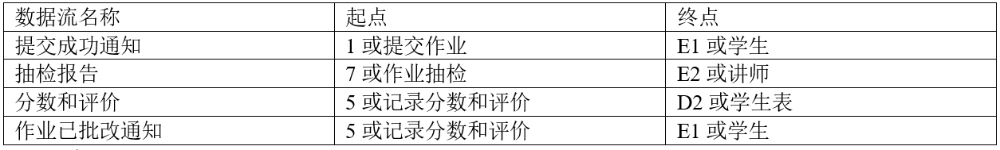
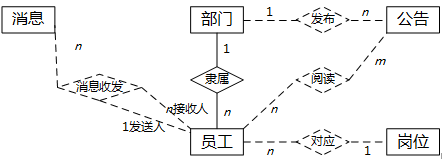
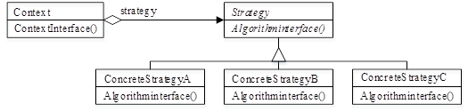
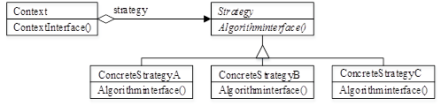

# 2015下半年案例题

- 来源标题: 2015年下半年软件设计师考试应用技术真题（专业解析+参考答案）
- 试卷介绍页: https://wangxiao.xisaiwang.com/tiku2/136/tp169293.html?cid=136
- 练习页: https://wangxiao.xisaiwang.com/tiku2/exam534904613.html
- 题量: 6

## 第1题（案例题）

阅读下列说明和图，回答问题1至问题4，将解答填入答题纸的对应栏内。
【说明】
某慕课教育平台欲添加在线作业批改系统，以实现高效的作业提交与批改，并进行统计。学生和讲师的基本信息已经初始化为数据库中的学生表和讲师表。系统的主要功能如下：
（1）提交作业。验证学生标识后，学生将电子作业通过在线的方式提交，并进行存储。系统给学生发送通知表明提交成功，通知中包含唯一编号；并通知讲师有作业提交。
（2）下载未批改作业。验证讲师标识后，讲师从系统中下载学生提交的作业。下载的作业将显示在屏幕上。
（3）批改作业。讲师按格式为每个题目进行批改打分，并进行整体评价。
（4）上传批改后的作业。将批改后的作业（包括分数和评价）返回给系统，进行存储。
（5）记录分数和评价。将批改后的作业的分数和评价记录在学生信息中，并通知学生作业已批改。
（6）获取已批改作业。根据学生标识，给学生查看批改后的作业，包括提交的作业、分数和评价。
（7）作业抽检。根据教务人员标识抽取批改后的作业样本，给出抽检意见，然后形成抽检报告给讲师。
现采用结构化方法对在线作业批改系统进行分析与设计，获得如图1-1所示的上下文数据流图和图1-2所示的0层数据流图。
    
                                                               ** 图1-1 上下文数据流图**
     
 **                                  图1-2 0层数据流图**

### 补充题面

【问题1】（3分）
使用说明中的词语，给出图1-1中的实体E1～E3的名称。
【问题2】（4分）
使用说明中的词语，给出图1-2中的数据存储D1～D4的名称。
【问题3】（6分）
根据说明和图中术语，补充图1-2中缺失的数据流及其起点和终点。
【问题4】（2分）
若发送给学生和讲师的通知是通过第三方Email系统进行的，则需要对图1-1和图1-2进行哪些修改？用100字以内文字加以说明。

### 参考答案

【问题1】
E1：学生                  E2：讲师                   E3：教务人员
【问题2】
D1：提交的作业表                  D2：学生表             D3：讲师表             D4：批改后的作业表
【问题3】

 【问题4】
增加外部实体“第三方Email系统”，将原来的两条“通知”数据流合并为一条“通知”数据流，终点为“第三方Email系统”。

### 解析

【问题1】
要求识别E1-E3具体为哪个外部实体，通读试题说明，可以了解到适合充当外部实体的包括：学生、讲师、教务人员。具体的对应关系，可以通过将顶层图与题目说明进行匹配得知。如：从图中可看出E1会向系统发出数据流“作业、学生标识”，会从系统接收到“批改后的作业、通知”；而从试题说明“验证学生标识后，学生将电子作业通过在线的方式提交，并进行存储。系统给学生发送通知表明提交成功，通知中包含唯一编号”可以看出，E1对应的，便是学生。E2、E3同理可得。
【问题2】
要求识别存储，解决这类问题，以图的分析为主，配合说明给存储命名，因为存储相关的数据流一般展现了这个存储中到底存了些什么信息，如从图中可以看到D3中有讲师信息，而D2中有学生信息，题目说明中又有“学生和讲师的基本信息已经初始化为数据库中的学生表和讲师表。”自然D2应为学生表，D3应为讲师表。同理，D1应存储了学生的作业、D4存储了批改后的作业，由于这两个内容在说明中没有“**表”“**文件”的表达，所以该存储的命名直接从说明中取合适的词来总结，D1应为作业，D4应为批改后的作业。
【问题3】
缺失数据流1
名称：通知 起点：提交作业 终点：E1
理由：顶层图有从在线作业批改系统到E1的数据流“通知”，而0层图没有，依据平衡原则可知缺失了，进一步分析试题说明，了解到“提交作业”这个功能有操作“系统给学生发送通知表明提交成功”，所以缺失数据流的起点为“提交作业”。
缺失数据流2
名称：抽检报告 起点：作业抽检 终点：E2
理由：题目说明中，对于“作业抽检”的描述为“根据教务人员标识抽取批改后的作业样本，给出抽检意见，然后形成抽检报告给讲师。”据此可以了解到从该功能应有数据流“抽检报告”至E2。
缺失数据流3
名称：分数和评价 起点：记录分数和评价 终点：D2
理由：首先值得注意的是“记录分数和评价”只有输入，没有输出，这是破坏了数据平衡原则的。这种情况，必然是有缺失数据流的。从题目描述“将批改后的作业的分数和评价记录在学生信息中”可以了解到，应有数据流从“记录分数和评价”到D2。
缺失数据流4
名称：通知起点：记录分数和评价 终点：E1
理由：从题目描述“并通知学生作业已批改”可以了解到，应有数据流从“记录分数和评价”到E1。
【问题4】
强调发送邮件采用了“第三方Email系统”，这个“第三方Email系统”属于典型的外部实体，所以需要增加外部实体“第三方Email系统”，并将原来的两条“通知”数据流合并为一条“通知”数据流，终点为“第三方Email系统”。

## 第2题（案例题）

阅读下列说明，回答问题1至问题3，将解答填入答题纸的对应栏内。
【说明】
 某企业拟构建一个高效、低成本、符合企业实际发展需要的办公自动化系统。工程师小李主要承担该系统的公告管理和消息管理模块的研发工作。公告管理模块的主要功能包括添加、修改、删除和查看公告。消息管理模块的主要功能是消息群发。
 小李根据前期调研和需求分析进行了概念模型设计，具体情况分述如下：
【需求分析结果】
 （1）该企业设有研发部、财务部、销售部等多个部门，每个部门只有一名部门经理，有多名员工，每名员工只属于一个部门，部门信息包括：部门号、名称、部门经理和电话，其中部门号唯一确定部门关系的每一个元组。
 （2）员工信息包括：员工号、姓名、岗位、电话和密码。员工号唯一确定员工关系的每一个元组；岗位主要有经理、部门经理、管理员等，不同岗位具有不同的权限。一名员工只对应一个岗位，但一个岗位可对应多名员工。
 （3）消息信息包括：编号、内容、消息类型、接收人、接收时间、发送时间和发送人。其中（编号，接收人）唯一标识消息关系中的每一个元组。一条消息可以发送给多个接收人，一个接收人可以接收多条消息。
 （4）公告信息包括：编号、标题、名称、内容、发布部门、发布时间。其中编号唯一确定公告关系的每一个元组。一份公告对应一个发布部门，但一个部门可以发布多份公告；一份公告可以被多名员工阅读，一名员工可以阅读多份公告。
【概念模型设计】
 根据需求分析阶段收集的信息，设计的实体联系图（不完整）如图2-1所示：

图2-1 实体联系图
【逻辑结构设计】
根据概念模型设计阶段完成的实体联系图，得出如下关系模式（不完整）：
部门（ （a） ，部门经理，电话）
员工（员工号，姓名，岗位号，部门号，电话，密码）
岗位（岗位号，名称，权限）
消息（ （b） ，消息类型，接收时间，发送时间，发送人）
公告（ （c） ，名称，内容，发布部门，发布时间）
阅读公告（ （d） ，阅读时间）

### 补充题面

【问题1】（5分）
根据问题描述，补充四个联系，完善图2-1所示的实体联系图。联系名可用联系1、联系2、联系3和联系4代替，联系的类型分为 1:1、1:n和m:n（或1:1、1:*和*:*）。
【问题2】（8分）
（1）根据实体联系图，将关系模式中的空（a）～（d）补充完整。
（2）给出“消息”和“阅读公告”关系模式的主键与外键。
【问题3】（2分）
消息和公告关系中都有“编号”属性，请问它是属于命名冲突吗？用100字以内文字说明原因。

### 参考答案

【问题1】

【问题2】
（a）部门号，名称
（b）编号，内容，接收人
（c）编号，标题
（d）员工号，公告编号
消息               主键：（编号，接收人）                     外键：接收人，发送人
阅读公告        主键：（员工号，公告编号）              外键：员工号，公告编号
【问题3】
不属于命名冲突。
命名冲突是在合并ER模型时提出的概念，合并ER模型时之所以产生冲突，是因为对于同样的对象，不同的局部ER模型有着不同的定义，在本题中，本就是不同对象的属性，所以不存在冲突的说法。

### 解析

【问题1】
根据题干中的需求分析可以得到完整的ER图和联系类型。
“一名员工只对应一个岗位，但一个岗位可对应多名员工”，可以得出员工与岗位间是有一个“对应”的联系的，而且联系类型是n:1。
“一条消息可以发送给多个接收人，一个接收人可以接收多条消息”，可以得出消息与发送人和接收人有多对多的联系，而在题干描述中可以看到发送人和接收人都是员工，因此，可以得到如图所示的消息收发关系。
“一份公告对应一个发布部门，但一个部门可以发布多份公告”，可以看到公告与部门有多对1的发布联系。
“一份公告可以被多名员工阅读，一名员工可以阅读多份公告”，可以看到公告与员工之间有多对多的阅读联系。
（联系名可用联系1、联系2、联系3和联系4代替，联系的类型分为 1:1、1:n和m:n（或1:1、1:*和*:*））
【问题2】
（1）根据题干中列出的内容，可以把关系模式填完整。
“部门信息包括：部门号、名称、部门经理和电话”，因此（a）缺少部门号，名称。
“消息信息包括：编号、内容、消息类型、接收人、接收时间、发送时间和发送人”，因此（b）缺少编号，内容。
“公告信息包括：编号、标题、名称、内容、发布部门、发布时间”，因此（c）缺少编号，标题。
对于阅读公告，是员工与公告二者的联系，并且是多对多的联系，因此除了自身属性外，还需要补充员工和公告的主键，因此（d）缺少员工号，公告编号。
（2）消息（编号，内容，消息类型，接收人，接收时间，发送时间，发送人），“其中（编号，接收入）唯一标识消息关系中的每一个元组”可知，其主键为编号和接收人；而接收人和发送人都需要员工号，所以为外键。
阅读公告（公告编号，员工号，阅读时间）也是同样的道理。
【问题3】
命名冲突是在合并ER模型时提出的概念，合并ER模型时之所以产生冲突，是因为对于同样的对象，不同的局部ER模型有着不同的定义，在本题中，本就是不同对象的属性，所以不存在冲突的说法。

## 第3题（案例题）

阅读下列说明和图，回答问题1至问题3，将解答填入答题纸的对应栏内。
【说明】
某出版社拟开发一个在线销售各种学术出版物的网上商店（ACShop），其主要的功能需求描述如下：
（1）ACShop在线销售的学术出版物包括论文、学术报告或讲座资料等。
（2）ACShop的客户分为两种：未注册客户和注册客户。
（3）未注册客户可以浏览或检索出版物，将出版物添加到购物车中。未注册客户进行注册操作之后，成为ACShop注册客户。
（4）注册客户登录之后，可将待购买的出版物添加到购物车中，并进行结账操作。结账操作的具体流程描述如下：
 ①从预先填写的地址列表中选择一个作为本次交易的收货地址。如果没有地址信息，则可以添加新地址。
 ②选择付款方式。ACShop支持信用卡付款和银行转账两种方式。注册客户可以从预先填写的信用卡或银行账号中选择一个付款。若没有付款方式信息，则可以添加新付款方式。
 ③确认提交购物车中待购买的出版物后，ACShop会自动生成与之相对应的订单。
（5）管理员负责维护在线销售的出版物目录，包括添加新出版物或者更新在售出版物信息等操作。
现采用面向对象方法分析并设计该网上商店ACShop，得到如图3-1所示的用例图和图3-2所示的类图。    
 **图3-1  用例图**
                                            
 **图3-2  类图**

### 补充题面

【问题1】（4分）
根据说明中的描述，给出图3-1中（1）～（4）所对应的用例名。
【问题2】（4分）
根据说明中的描述，分别说明用例“添加新地址”和“添加新付款方式”会在何种情况下由图3-1中的用例（3）和（4）扩展而来？
【问题3】（7分）
根据说明中的描述，给出图3-2中（1）～（7）所对应的类名。

### 参考答案

【问题1】
（1）添加出版物到购物车
（2）结账
（3）选择收货地址
（4）选择付款方式
【问题2】
当选择收货地址时，没有地址信息，则使用扩展用例“添加新地址”来完成新地址的添加。
当选择付款方式时，没有付款方式信息，则使用扩展用例“添加新付款方式”来完成新付款方式的添加。
【问题3】
（1）出版物目录
（2）待购买的出版物
（3）学术出版物
（4）- （6） 论文、学术报告、讲座资料
（7）订单

### 解析

本题属于软件设计师关于UML的传统考题，主要考查的是用例图和类图。
【问题1】
问题1是对用例图的补充。对于用例是对系统业务功能的描述，一般为动词+名词或名词+动词的形式，解题一般从题干说明中分析其中的用例，并且参考用例图中用例之间的关系来确定对应的用例名。
其中（3）和（4）分别于添加新付款方式和添加新地址有扩展关系，因此对应的（3）应该是选择收货地址（从描述“①从预先填写的地址列表中选择一个作为本次交易的收货地址”提炼），（4）应该是选择付款方式（“②选择付款方式”）。
其中（2）包含用例（1）和用例（3）选择收货地址、用例（4）选择付款方式，根据“结账操作的具体流程描述如下：①②…”，因此用例（2）是结账。
其中用例（1）于参与者客户、注册客户都相关，即未注册客户也可以做的操作，应该包括浏览或检索出版物、将出版物添加到购物车中，前者已经列出，因此用例（1）为将出版物添加到购物车。
【问题2】
问题2涉及到的是扩展关系运作机制，在扩展关系中，一个用例称为基础用例，另一个用例称为扩展用例，其中扩展用例是对基础用例的补充，扩展用例不是每次都执行，要特定条件满足才执行。
以本题中用例“添加新地址”为例，他就是一个扩展用例，什么时候他会执行呢？就是当选择收货地址时，系统检测发现没有地址信息，此时会“添加新地址”来完成新地址的添加，然后再先择收货地址。添加新付款方式用例情况与此类似。
【问题3】
问题3是对类图的补充，类名一般为名词形式，根据题干描述，我们可以找到很多类名，包括：ACShop、学术出版物、论文、学术报告、讲座资料、客户、未注册客户、注册客户、待购买的出版物、购物车、地址列表、收货地址、付款方式、信用卡付款、银行转账、订单、管理员、出版物目录等，再根据类图当中的关系来确定对应的类名。
根据“（1）ACShop在线销售的学术出版物包括论文、学术报告或讲座资料等”，可以看到这里的学术出版物是论文、学术报告、讲座资料的泛化，也就是父类，根据类图可以看到，类（3）和类（4）、（5）、（6）满足此关系，因此类（3）是学术出版物，而（4）（5）（6）分别为论文、学术报告、讲座资料，三者位置可以互换。
类（7）与付款方式和收货地址相关的应该是订单，而（2）与订单和购物车都有着部分-整体关系的，应该是待购买的出版物。
根据ACShop是网上商店，它应该包括管理员、客户、购物车，还有出售的物品，而本商店出售的物品是以出版物目录的形式进行管理，因此（1）应该是出版物目录。

## 第4题（案例题）

阅读下列说明和C代码，回答问题1至问题3，将解答写在答题纸的对应栏内。
【说明】
计算两个字符串x和y的最长公共子串（Longest Common Substring）。
假设字符串x和字符串y的长度分别为m和n，用数组c的元素c[i][j]记录x中前i个字符和y中前j个字符的最长公共子串的长度。
c[i][j]满足最优子结构，其递归定义为：
 
    计算所有c[i][j](0 ≤i ≤ m，0 ≤j ≤ n)的值，值最大的c[i][j]即为字符串x和y的最长公共子串的长度。根据该长度即i和j，确定一个最长公共子串。
【C代码】
（1）常量和变量说明
 x，y：长度分别为m和n的字符串
c[i][j]：记录x中前i个字符和y中前j个字符的最长公共子串的长度
max：x和y的最长公共子串的长度
maxi, maXj：分别表示x和y的某个最长公共子串的最后一个字符在x和y中的位置（序号）
（2）C程序
#include <stdio.h>
#include <string.h>
int c[50][50];
int maxi;
int maxj;
int lcs(char *x, int m, char *y, int n)     {
     int i, j;
     int max= 0;
     maxi= 0;
     maxj = 0;
     for ( i=0; i<=m ; i++)            c[i][0] = 0;
     for (i =1; i<= n; i++)              c[0][i]=0;
     for (i =1; i<= m; i++)    {
         for (j=1; j<= n; j++)    {
            if (    (1)    )    {
             c[i][j] = c[i -1][j -1] + 1;
             if(max<c[i][j]) {
                 (2)   ;
               maxi = i;
               maxj =j;
             }
        }
        else     (3)    ;
       }
    }
     return max;
}   
void printLCS(int max, char *x) {
          int i= 0;
       if (max == 0)        return;
      for (  (4)    ; i < maxi; i++)
             printf("%c",x[i]);
}
void main(){
char* x= "ABCADAB";
char*y= "BDCABA";
 int max= 0;
 int m = strlen(x);
 int n = strlen(y);
 max=lcs(x,m,y,n);
 printLCS(max , x);
}

### 补充题面

【问题1】（8分）   
根据以上说明和C代码，填充C代码中的空（1）～（4）。
【问题2】（4分）   
根据题干说明和以上C代码，算法采用了 （5） 设计策略。
分析时间复杂度为 （6） （用O符号表示）。
【问题3】（3分）
根据题干说明和以上C代码，输入字符串x= "ABCADAB
"  ，y="BDCABA"，则输出为 （7） 。

### 参考答案

【问题1】
（1）x[i-1] == y[j-1]
（2）max=c[i][j]
（3）c[i][j]=0
（4）i=maxi-max
【问题2】
（5）动态规划法                        
（6）O(m*n)
【问题3】
（7）AB

### 解析

首先对于C语言算法题，一般的解题思路是先解决除程序填空以外的问题，这些问题弄清楚，有利于程序填空部分的分析。
第一步，分析程序所采用的算法，常见的算法包括：分治法、动态规划法、回溯法、贪心法。本题中要求的是两个串的最长公共子串，在程序中采用了数组来记录子问题的中间结果，这一特征与动态规划法的做法非常吻合，所以应选动态规划法。
第二步，解决“输入字符串x= "ABCADAB"，y="BDCABA"，则输出为 （7） ”的问题，该问题相对容易解决，因为题目已告知程序的作用是求最长公共子串，而且从程序的输出函数可以看出，要输出的，只有子串，没有其他信息，所以我们只需要手动求两个串的公共子串，并写出答案即可。两个串第一个公共子串明显是“AB”，所以输出的结果为“AB”。
第三步，求时间复杂度，由于程序中最多双重循环，其中外层循环的规模为m，而内层循环的规模为n，所以时间复杂度为O(m*n)。
第四步，也是最难的一步，是解决程序填空的问题。动态规划的问题，一般都会给出递归定义式，这个式子，往往是多个空的关键点。以本题为例：
第1空是判断的条件，输出的结果是c[i][j] = c[i -1][j -1] + 1，此时根据递归式可以看到，所需的条件是x[i-1] = y[j-1]，因此第1空填写判断条件x[i-1] == y[j-1]。
第2空是在 if(max<c[i][j])跟随的大括号中，根据前后代码和此处的判断条件，当max小于当前时，应该改变max的值，并记录此时的maxi和maxj，此处缺少改变max的值，因此，第2空应该将当前最大值赋值给max，即max=c[i][j]。
第3空是第一个if语句的else选择，根据递归式，if（x[i-1] == y[j-1]）不满足时，属于其他情况，应该赋值为0，因此第3空填写c[i][j]=0。
而第4空是用于打印结果，由于maxi记录了子串末尾+1的位置信息，子串长度为max，所以用maxi-max定位至子串开始位置，以便打印子串，因此第4空填写i=maxi-max。

## 第5题（案例题）

阅读下列说明和C++代码，回答问题。
【说明】   
某大型购物中心欲开发一套收银软件，要求其能够支持购物中心在不同时期推出的各种促销活动，如打折、返利（例如，满300返100）等等。现采用策略（Strategy）模式实现该要求，得到如图5-1所示的类图。
    
                                                                   图5-1 策略模式类图

### 补充题面

【C++代码】
#include <iostream>
using namespace std;
enum TYPE{NORMAL, CASH_DISCOUNT, CASH_RETURN};
class CashSuper{
public:
   （1）;
};
class CashNormal : public CashSuper {     //正常收费子类
public:
    double acceptCash(double money) {     retum money;    }
}; 
class CashDiscount : public CashSuper {
private:
    double moneyDiscount;     //  折扣率
public:
   CashDiscount(double discount) {    moneyDiscount= discount;    }
   double acceptCash(double money) {    retum money * moneyDiscount;    }
};
class CashRetum : public CashSuper {      // 满额返利
private:        
    double moneyCondition;      // 满额数额
    double moneyReturn;       // 返利数额
public:
    CashRetnm(double motieyCondition, double moneyReturn) {     
       this->moneyCondition=moneyCondition;
       this->moneyReturn=moneyReturn;
    }                                                                 
    double acceptCash(double money) {
       double result = money;
       if(money>=moneyCondition)
           result=money-(int)(money/moneyCondition ) * moneyReturn;
       return  result ;
    }
};
class CashContext {
private:
   CashSuper *cs;
public:
   CashContext(int type) {
     switch(type) {
      case NORMAL:           //正常收费
                 （2）       ;
          break;
      case CASH_RETURN:       //满300返100
                 （3）       ;
           break;
      case CASH_DISCOUNT:     //打八折
                 （4）       ;
          break;
   }
}
double GetResult(double money) {
            （5）     ;
    }
};
//此处略去main()函数

### 参考答案

（1）virtual double acceptCash(double money) = 0
（2）cs = new CashNormal()
（3）cs = new CashReturn(300,100)
（4）cs = new CashDiscount(0.8)
（5）return cs->acceptCash(money)

### 解析

本题考查策略（Strategy）模式的基本概念和应用。
Strategy模式的设计意图是，定义一系列的算法，把它们一个个封装起来，并且使它们可以相互替换。此模式使得算法可以独 立于使用它们的客户而变化，其结构图如下图所示。
                             
• Strategy （策略）定义所有支持的算法的公共接口。 Context 使用这个接口来调用某ConcreteStrategy 定义的算法。
• ConcreteStrategy(具体策略)以 Strategy 接口实现某具体算法。
• Context（上下文）用一个ConcreteStrategy对象来配置；维护一个对 Strategy对象的引用；可定义一个接口来让Strategy 访问它的数据。
Strategy模式适用于：
•许多相关的类仅仅是行为有异。“策略”提供了一种用多个行为中的一个行为来配置一个类的方法。
•需要使用一个算法的不同变体。例如，定义一些反应不同空间的空间/时间权衡的算法。当这些变体实现为一个算法的类层次时，可以使用策略模式。
•算法使用客户不应该知道的数据。可使用策略模式以避免暴露复杂的 、与算法相关的数据结构。
一个类定义了多种行为，并且这些行为在这个类的操作中以多个条件语旬的形式出现，将相关的条件分支移入它们各自的 Strategy 类中，以代替这些条件语句 。
本题中类 CashSuper 对应于上图中的类 Strategy，类CashNormal 、CashDiscout 和CashReturn 分别代表 3 种不同的具体促销策略 。CashSuper 类提供其 3 个子类的公共操作接口，由子类给出 3 种不同促销策略的具体实现。在 C++语言中，可以采用继承+（纯）虚拟函数来实现。从 3 个子类 CashNormal、CashDiscout 和 CashReturn的代码可以看出，公共操作接口为 double acceptCash(double money) 。由于不需要父类 CashSuper 提供任何的促销实现方式，所以这里采用纯虚拟函数。应填入空（1）处的语句是 "virtual double acceptCash(double money) = 0"。
空（2）-（4）都出现在类 CashContext 中，该类对应于上图中的类 Context ，其作用是依据策略对象来调用不同的策略算法 。因此空（2）-（4）的是根据不同的 case 分支来创建不同的策略对象。由此可知空（2）-（4）分别应填入"cs=newCashNormal()"、"cs = new CashReturn(300，100)"和"cs =new CashDiscount(0.8) "。
方法 GetResult 是对接口的调用，从而计算出来用不同促销策略之后应付的费用， 这里需要通过 CashSuper 的对象 cs 来调用公共操作接口，因此第（5）空应填入 "return cs->acceptCash(money)"。

## 第6题（案例题）

阅读下列说明和Java代码，回答问题。
【说明】
    某大型购物中心欲开发一套收银软件，要求其能够支持购物中心在不同时期推出的各种促销活动，如打折、返利（例如，满300返100）等等。现采用策略（Strategy）模式实现该要求，得到如图6-1所示的类图。
    
                                                                  图6-1 策略模式类图

### 补充题面

【Java代码】
import java.util.*;
enum TYPE { NORMAL, CASH_DISCOUNT, CASH_RETURN};
interface CashSuper {
   public   （1）  ;
}
class CashNormal implements CashSuper{    // 正常收费子类
   public double acceptCash(double money){
      return money;
   }
}
class CashDiscount implements CashSuper {
   private double moneyDiscount;                   // 折扣率
   public CashDiscount(double moneyDiscount) {
      this moneyDiscount = moneyDiscount;   
   }
   public double acceptCash(double money) {
      return money* moneyDiscount; 
   }
}
class CashReturn implements CashSuper {               // 满额返利
   private double moneyCondition;
   private double moneyReturn;
   public CashReturn(double moneyCondition, double moneyReturn) {   
      this.moneyCondition =moneyCondition;     // 满额数额
      this.moneyReturn =moneyReturn;           // 返利数额
   }
   public double acceptCash(double money) {
      double result = money;
      if(money >= moneyCondition )
         result=money-Math.floor(money/moneyCondition ) * moneyReturn;
      return result; 
   }
}
class CashContext_{
   private CashSuper cs;
   private TYPE  t；
   public CashContext(TYPE t)  {
      switch(t){
         case NORMAL：    // 正常收费
              （2） ;
            break;
         case CASH_DISCOUNT:       // 打8折
              （3） ;
            break;
         case CASH_RETURN:     // 满300返100
              （4） ;
            break;
      }
   }
   public double GetResult(double money) {
           （5）   ;
   }
   //此处略去main()函数
}

### 参考答案

（1）double acceptCash(double money)             
（2）cs = new CashNormal()
（3）cs = new CashDiscount(0.8)
（4）cs = new CashReturn(300,100)
（5）return cs.acceptCash(money)

### 解析

本题考查策略（Strategy）模式的基本概念和应用。
Strategy模式的设计意图是，定义一系列的算法，把它们一个个封装起来，并且使它们可以相互替换。此模式使得算法可以独立于使用它们的客户而变化，其结构图如下图所示。

• Strategy (策略)定义所有支持的算法的公共接口。 Context 使用这个接口来调用某ConcreteStrategy 定义的算法。
•ConcreteStrategy(具体策略)以 Strategy 接口实现某具体算法。
• Context（上下文）用一个ConcreteStrategy对象来配置；维护一个对 Strategy对象的引用；可定义一个接口来让Strategy 访问它的数据。
Strategy模式适用于：
•许多相关的类仅仅是行为有异。“策略”提供了一种用多个行为中的一个行为来配置一个类的方法。
•需要使用一个算法的不同变体。例如，定义一些反应不同空间的空间/时间权衡的算法。当这些变体实现为一个算法的类层次时，可以使用策略模式。
•算法使用客户不应该知道的数据。可使用策略模式以避免暴露复杂的 、与算法相 关的数据结构。
一个类定义了多种行为，并且这些行为在这个类的操作中以多个条件语旬的形式出现，将相关的条件分支移入它们各自的 Strategy 类中，以代替这些条件语句 。
本题中类 CashSuper 对应于上图中的类 Strategy，类CashNormal 、CashDiscout 和CashReturn 分别代表 3 种不同的具体促销策略 。CashSuper 是父类接口，提供其 3 个子类的公共操作接口，由子类给出 3 种不同促销策略的具体实现。从 3 个子类 CashNormal、CashDiscout 和 CashReturn的代码可以看出，公共操作方法为 double acceptCash(double money) 。由于不需要父类 CashSuper 提供任何的促销实现方式，在接口CashSuper中double acceptCash(double money) 方式是没有具体实现内容的。应填入空（1）处的语句是 "double acceptCash(double money)"。
空（2）-（4）都出现在类 CashContext 中，该类对应于上图中的类 Context ，其作用是依据策略对象来调用不同的策略算法 。因此空（2）-（4）的是根据不同的 case 分支来创建不同的策略对象。由此可知空（2）-（4）分别应填入"cs=newCashNormal()"、"cs =new CashDiscount(0.8) "和"cs = new CashReturn(300，100)"。
方法 GetResult 是对接口的调用，从而计算出来用不同促销策略之后应付的费用， 这里需要通过 CashSuper 的对象 cs 来调用公共操作接口，因此第（5）空应填入 "return cs.acceptCash(money)"。
