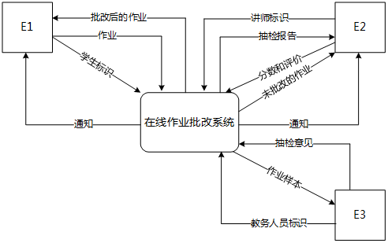
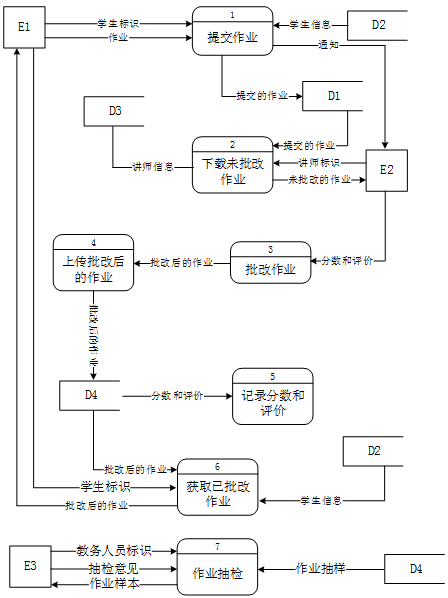
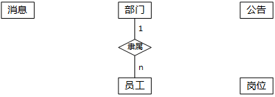
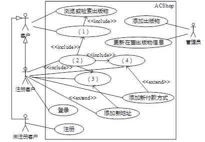
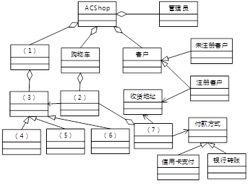
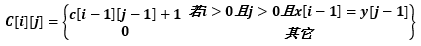
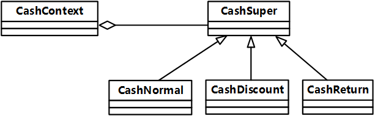

# 2015下半年案例题

- 来源标题: 2015年下半年软件设计师考试应用技术真题（专业解析+参考答案）
- 试卷介绍页: https://wangxiao.xisaiwang.com/tiku2/136/tp169293.html?cid=136
- 练习页: https://wangxiao.xisaiwang.com/tiku2/exam534903521.html
- 题量: 6

## 第1题（案例题）

阅读下列说明和图，回答问题1至问题4，将解答填入答题纸的对应栏内。
【说明】
某慕课教育平台欲添加在线作业批改系统，以实现高效的作业提交与批改，并进行统计。学生和讲师的基本信息已经初始化为数据库中的学生表和讲师表。系统的主要功能如下：
（1）提交作业。验证学生标识后，学生将电子作业通过在线的方式提交，并进行存储。系统给学生发送通知表明提交成功，通知中包含唯一编号；并通知讲师有作业提交。
（2）下载未批改作业。验证讲师标识后，讲师从系统中下载学生提交的作业。下载的作业将显示在屏幕上。
（3）批改作业。讲师按格式为每个题目进行批改打分，并进行整体评价。
（4）上传批改后的作业。将批改后的作业（包括分数和评价）返回给系统，进行存储。
（5）记录分数和评价。将批改后的作业的分数和评价记录在学生信息中，并通知学生作业已批改。
（6）获取已批改作业。根据学生标识，给学生查看批改后的作业，包括提交的作业、分数和评价。
（7）作业抽检。根据教务人员标识抽取批改后的作业样本，给出抽检意见，然后形成抽检报告给讲师。
现采用结构化方法对在线作业批改系统进行分析与设计，获得如图1-1所示的上下文数据流图和图1-2所示的0层数据流图。
    
                                                               ** 图1-1 上下文数据流图**
     
 **                                  图1-2 0层数据流图**

### 补充题面

【问题1】（3分）
使用说明中的词语，给出图1-1中的实体E1～E3的名称。
【问题2】（4分）
使用说明中的词语，给出图1-2中的数据存储D1～D4的名称。
【问题3】（6分）
根据说明和图中术语，补充图1-2中缺失的数据流及其起点和终点。
【问题4】（2分）
若发送给学生和讲师的通知是通过第三方Email系统进行的，则需要对图1-1和图1-2进行哪些修改？用100字以内文字加以说明。

## 第2题（案例题）

阅读下列说明，回答问题1至问题3，将解答填入答题纸的对应栏内。
【说明】
 某企业拟构建一个高效、低成本、符合企业实际发展需要的办公自动化系统。工程师小李主要承担该系统的公告管理和消息管理模块的研发工作。公告管理模块的主要功能包括添加、修改、删除和查看公告。消息管理模块的主要功能是消息群发。
 小李根据前期调研和需求分析进行了概念模型设计，具体情况分述如下：
【需求分析结果】
 （1）该企业设有研发部、财务部、销售部等多个部门，每个部门只有一名部门经理，有多名员工，每名员工只属于一个部门，部门信息包括：部门号、名称、部门经理和电话，其中部门号唯一确定部门关系的每一个元组。
 （2）员工信息包括：员工号、姓名、岗位、电话和密码。员工号唯一确定员工关系的每一个元组；岗位主要有经理、部门经理、管理员等，不同岗位具有不同的权限。一名员工只对应一个岗位，但一个岗位可对应多名员工。
 （3）消息信息包括：编号、内容、消息类型、接收人、接收时间、发送时间和发送人。其中（编号，接收人）唯一标识消息关系中的每一个元组。一条消息可以发送给多个接收人，一个接收人可以接收多条消息。
 （4）公告信息包括：编号、标题、名称、内容、发布部门、发布时间。其中编号唯一确定公告关系的每一个元组。一份公告对应一个发布部门，但一个部门可以发布多份公告；一份公告可以被多名员工阅读，一名员工可以阅读多份公告。
【概念模型设计】
 根据需求分析阶段收集的信息，设计的实体联系图（不完整）如图2-1所示：

图2-1 实体联系图
【逻辑结构设计】
根据概念模型设计阶段完成的实体联系图，得出如下关系模式（不完整）：
部门（ （a） ，部门经理，电话）
员工（员工号，姓名，岗位号，部门号，电话，密码）
岗位（岗位号，名称，权限）
消息（ （b） ，消息类型，接收时间，发送时间，发送人）
公告（ （c） ，名称，内容，发布部门，发布时间）
阅读公告（ （d） ，阅读时间）

### 补充题面

【问题1】（5分）
根据问题描述，补充四个联系，完善图2-1所示的实体联系图。联系名可用联系1、联系2、联系3和联系4代替，联系的类型分为 1:1、1:n和m:n（或1:1、1:*和*:*）。
【问题2】（8分）
（1）根据实体联系图，将关系模式中的空（a）～（d）补充完整。
（2）给出“消息”和“阅读公告”关系模式的主键与外键。
【问题3】（2分）
消息和公告关系中都有“编号”属性，请问它是属于命名冲突吗？用100字以内文字说明原因。

## 第3题（案例题）

阅读下列说明和图，回答问题1至问题3，将解答填入答题纸的对应栏内。
【说明】
某出版社拟开发一个在线销售各种学术出版物的网上商店（ACShop），其主要的功能需求描述如下：
（1）ACShop在线销售的学术出版物包括论文、学术报告或讲座资料等。
（2）ACShop的客户分为两种：未注册客户和注册客户。
（3）未注册客户可以浏览或检索出版物，将出版物添加到购物车中。未注册客户进行注册操作之后，成为ACShop注册客户。
（4）注册客户登录之后，可将待购买的出版物添加到购物车中，并进行结账操作。结账操作的具体流程描述如下：
 ①从预先填写的地址列表中选择一个作为本次交易的收货地址。如果没有地址信息，则可以添加新地址。
 ②选择付款方式。ACShop支持信用卡付款和银行转账两种方式。注册客户可以从预先填写的信用卡或银行账号中选择一个付款。若没有付款方式信息，则可以添加新付款方式。
 ③确认提交购物车中待购买的出版物后，ACShop会自动生成与之相对应的订单。
（5）管理员负责维护在线销售的出版物目录，包括添加新出版物或者更新在售出版物信息等操作。
现采用面向对象方法分析并设计该网上商店ACShop，得到如图3-1所示的用例图和图3-2所示的类图。    
 **图3-1  用例图**
                                            
 **图3-2  类图**

### 补充题面

【问题1】（4分）
根据说明中的描述，给出图3-1中（1）～（4）所对应的用例名。
【问题2】（4分）
根据说明中的描述，分别说明用例“添加新地址”和“添加新付款方式”会在何种情况下由图3-1中的用例（3）和（4）扩展而来？
【问题3】（7分）
根据说明中的描述，给出图3-2中（1）～（7）所对应的类名。

## 第4题（案例题）

阅读下列说明和C代码，回答问题1至问题3，将解答写在答题纸的对应栏内。
【说明】
计算两个字符串x和y的最长公共子串（Longest Common Substring）。
假设字符串x和字符串y的长度分别为m和n，用数组c的元素c[i][j]记录x中前i个字符和y中前j个字符的最长公共子串的长度。
c[i][j]满足最优子结构，其递归定义为：
 
    计算所有c[i][j](0 ≤i ≤ m，0 ≤j ≤ n)的值，值最大的c[i][j]即为字符串x和y的最长公共子串的长度。根据该长度即i和j，确定一个最长公共子串。
【C代码】
（1）常量和变量说明
 x，y：长度分别为m和n的字符串
c[i][j]：记录x中前i个字符和y中前j个字符的最长公共子串的长度
max：x和y的最长公共子串的长度
maxi, maXj：分别表示x和y的某个最长公共子串的最后一个字符在x和y中的位置（序号）
（2）C程序
#include <stdio.h>
#include <string.h>
int c[50][50];
int maxi;
int maxj;
int lcs(char *x, int m, char *y, int n)     {
     int i, j;
     int max= 0;
     maxi= 0;
     maxj = 0;
     for ( i=0; i<=m ; i++)            c[i][0] = 0;
     for (i =1; i<= n; i++)              c[0][i]=0;
     for (i =1; i<= m; i++)    {
         for (j=1; j<= n; j++)    {
            if (    (1)    )    {
             c[i][j] = c[i -1][j -1] + 1;
             if(max<c[i][j]) {
                 (2)   ;
               maxi = i;
               maxj =j;
             }
        }
        else     (3)    ;
       }
    }
     return max;
}   
void printLCS(int max, char *x) {
          int i= 0;
       if (max == 0)        return;
      for (  (4)    ; i < maxi; i++)
             printf("%c",x[i]);
}
void main(){
char* x= "ABCADAB";
char*y= "BDCABA";
 int max= 0;
 int m = strlen(x);
 int n = strlen(y);
 max=lcs(x,m,y,n);
 printLCS(max , x);
}

### 补充题面

【问题1】（8分）   
根据以上说明和C代码，填充C代码中的空（1）～（4）。
【问题2】（4分）   
根据题干说明和以上C代码，算法采用了 （5） 设计策略。
分析时间复杂度为 （6） （用O符号表示）。
【问题3】（3分）
根据题干说明和以上C代码，输入字符串x= "ABCADAB
"  ，y="BDCABA"，则输出为 （7） 。

## 第5题（案例题）

阅读下列说明和C++代码，回答问题。
【说明】   
某大型购物中心欲开发一套收银软件，要求其能够支持购物中心在不同时期推出的各种促销活动，如打折、返利（例如，满300返100）等等。现采用策略（Strategy）模式实现该要求，得到如图5-1所示的类图。
    
                                                                   图5-1 策略模式类图

### 补充题面

【C++代码】
#include <iostream>
using namespace std;
enum TYPE{NORMAL, CASH_DISCOUNT, CASH_RETURN};
class CashSuper{
public:
   （1）;
};
class CashNormal : public CashSuper {     //正常收费子类
public:
    double acceptCash(double money) {     retum money;    }
}; 
class CashDiscount : public CashSuper {
private:
    double moneyDiscount;     //  折扣率
public:
   CashDiscount(double discount) {    moneyDiscount= discount;    }
   double acceptCash(double money) {    retum money * moneyDiscount;    }
};
class CashRetum : public CashSuper {      // 满额返利
private:        
    double moneyCondition;      // 满额数额
    double moneyReturn;       // 返利数额
public:
    CashRetnm(double motieyCondition, double moneyReturn) {     
       this->moneyCondition=moneyCondition;
       this->moneyReturn=moneyReturn;
    }                                                                 
    double acceptCash(double money) {
       double result = money;
       if(money>=moneyCondition)
           result=money-(int)(money/moneyCondition ) * moneyReturn;
       return  result ;
    }
};
class CashContext {
private:
   CashSuper *cs;
public:
   CashContext(int type) {
     switch(type) {
      case NORMAL:           //正常收费
                 （2）       ;
          break;
      case CASH_RETURN:       //满300返100
                 （3）       ;
           break;
      case CASH_DISCOUNT:     //打八折
                 （4）       ;
          break;
   }
}
double GetResult(double money) {
            （5）     ;
    }
};
//此处略去main()函数

## 第6题（案例题）

阅读下列说明和Java代码，回答问题。
【说明】
    某大型购物中心欲开发一套收银软件，要求其能够支持购物中心在不同时期推出的各种促销活动，如打折、返利（例如，满300返100）等等。现采用策略（Strategy）模式实现该要求，得到如图6-1所示的类图。
    
                                                                  图6-1 策略模式类图

### 补充题面

【Java代码】
import java.util.*;
enum TYPE { NORMAL, CASH_DISCOUNT, CASH_RETURN};
interface CashSuper {
   public   （1）  ;
}
class CashNormal implements CashSuper{    // 正常收费子类
   public double acceptCash(double money){
      return money;
   }
}
class CashDiscount implements CashSuper {
   private double moneyDiscount;                   // 折扣率
   public CashDiscount(double moneyDiscount) {
      this moneyDiscount = moneyDiscount;   
   }
   public double acceptCash(double money) {
      return money* moneyDiscount; 
   }
}
class CashReturn implements CashSuper {               // 满额返利
   private double moneyCondition;
   private double moneyReturn;
   public CashReturn(double moneyCondition, double moneyReturn) {   
      this.moneyCondition =moneyCondition;     // 满额数额
      this.moneyReturn =moneyReturn;           // 返利数额
   }
   public double acceptCash(double money) {
      double result = money;
      if(money >= moneyCondition )
         result=money-Math.floor(money/moneyCondition ) * moneyReturn;
      return result; 
   }
}
class CashContext_{
   private CashSuper cs;
   private TYPE  t；
   public CashContext(TYPE t)  {
      switch(t){
         case NORMAL：    // 正常收费
              （2） ;
            break;
         case CASH_DISCOUNT:       // 打8折
              （3） ;
            break;
         case CASH_RETURN:     // 满300返100
              （4） ;
            break;
      }
   }
   public double GetResult(double money) {
           （5）   ;
   }
   //此处略去main()函数
}
