# 2015下半年选择题

- 来源标题: 2015年下半年软件设计师考试基础知识真题（专业解析+参考答案）
- 试卷介绍页: https://wangxiao.xisaiwang.com/tiku2/136/tp169292.html?cid=136
- 练习页: https://wangxiao.xisaiwang.com/tiku2/exam534904615.html
- 题量: 56

## 第1题（单选题）

CPU是在（D）结束时响应DMA请求的。

- A. 一条指令执行
- B. 一段程序
- C. 一个时钟周期
- D. 一个总线周期

### 正确答案

D

### 解析

指令周期（Instruction Cycle）：取出并执行一条指令的时间。
总线周期（BUS Cycle）：也就是一个访存储器或I/O端口操作所用的时间。
时钟周期（Clock Cycle）：又称震荡周期，是处理操作的最基本单位。
指令周期、总线周期和时钟周期之间的关系：一个指令周期由若干个总线周期组成，而一个总线周期时间又包含有若干个时钟周期。
一个总线周期包含一个（只有取址周期）或多个机器周期。
 机器周期：在计算机中，为了便于管理，常把一条指令的执行过程划分为若干个阶段，每一阶段完成一项工作。例如，取指令、存储器读、存储器写等，这每一项工作称为一个基本操作。完成一个基本操作所需要的时间称为机器周期。
 DMA响应过程为：DMA控制器对DMA请求判别优先级及屏蔽，向总线裁决逻辑提出总线请求。当CPU执行完当前总线周期即可释放总线控制权。此时总线裁决逻辑输出总线应答，表示DMA已经响应，通过DMA控制器通知I/O接口开始DMA传输。

## 第2题（单选题）

虚拟存储体系由（A）两级存储器构成。

- A. 主存-辅存
- B. 寄存器-Cache
- C. 寄存器-主存
- D. Cache-主存

### 正确答案

A

### 解析

虚拟存储器是一个容量非常大的存储器的逻辑模型，不是任何实际的物理存储器。它借助于磁盘等辅助存储器来扩大主存容量，使之为更大或更多的程序所使用。
虚拟存储器指的是主存-外存层次。它以透明的方式给用户提供了一个比实际主存空间大得多的程序地址空间。此时的程序的逻辑地址称为虚拟地址（虚地址），程序的逻辑地址空间称为虚拟地址空间。物理地址（实地址）由CPU地址引脚送出，它是用于访问主存的地址。设CPU地址总线的宽度为m位，那么物理地址空间的大小用2m来表示。

## 第3题（单选题）

浮点数能够表示的数的范围是由其（B）的位数决定的。

- A. 尾数
- B. 阶码
- C. 数符
- D. 阶符

### 正确答案

B

### 解析

浮点数能表示的数的范围由阶码的位数决定，精度由尾数的位数决定。

## 第4题（单选题）

在机器指令的地址字段中，直接指出操作数本身的寻址方式称为（C）。

- A. 隐含寻址
- B. 寄存器寻址
- C. 立即寻址
- D. 直接寻址

### 正确答案

C

### 解析

立即寻址是一种特殊的寻址方式，指令中在操作码字段后面的部分不是通常意义上的操作数地址，而是操作数本身，也就是说数据就包含在指令中，只要取出指令，也就取出了可以立即使用的操作数。
在直接寻址中，指令中地址码字段给出的地址A就是操作数的有效地址，即形式地址等于有效地址。
间接寻址意味着指令中给出的地址A不是操作数的地址，而是存放操作数地址的主存单元的地址，简称操作数地址的地址。
寄存器寻址指令的地址码部分给出了某一个通用寄存器的编号Ri，这个指定的寄存器中存放着操作数。

## 第5题（单选题）

内存按字节编址从B3000H到DABFFH的区域其存储容量为（B）。

- A. 123KB
- B. 159KB
- C. 163KB
- D. 194KB

### 正确答案

B

### 解析

本题考查计算机组成基础知识。
本题是按字节编址，因此一个存储单元容量为1B，直接计算16进制地址包含的存储单元个数即可。
DABFFH-B3000H+1=27C00H=12×162+7×163+2×164=159K，按字节编址，故此区域的存储容量为159KB。

## 第6题（单选题）

CISC是（A）的简称。

- A. 复杂指令系统计算机
- B. 超大规模集成电路
- C. 精简指令系统计算机
- D. 超长指令字

### 正确答案

A

### 解析

CISC是复杂指令系统计算机，RISC是精简指令系统计算机。

## 第7题（单选题）

（A）不属于主动攻击。

- A. 流量分析
- B. 重放
- C. IP地址欺骗
- D. 拒绝服务

### 正确答案

A

### 解析

主动攻击包括拒绝服务攻击、分布式拒绝服务（DDos）、信息篡改、资源使用、欺骗、伪装、重放等攻击方法。

## 第8题（单选题）

防火墙不具备（B）功能。

- A. 记录访问过程
- B. 查毒
- C. 包过滤
- D. 代理

### 正确答案

B

### 解析

网络防火墙就是一个位于计算机和它所连接的网络之间的软件。该计算机流入流出的所有网络通信均要经过此防火墙。防火墙对流经它的网络通信进行扫描，这样能够过滤掉一些攻击，以免其在目标计算机上被执行。防火墙还可以关闭不使用的端口。而且它还能禁止特定端口的流出通信，封锁特洛伊木马。最后，它可以禁止来自特殊站点的访问，从而防止来自不明入侵者的所有通信。
防火墙的功能包括：访问控制；提供基于状态检测技术的ip地址、端口、用户和时间的管理控制；双向nat，提供ip地址转换和ip及tcp/udp端口映射，实现ip复用和隐藏网络结构：代理等。

## 第9题（单选题）

根据下图所示的输出信息，可以确定的是（C）。
 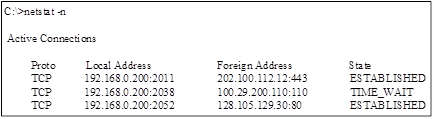

- A. 本地主机正在使用的端口号是公共端口号
- B. 192.168.0.200正在与128.105.129. 30建立连接
- C. 本地主机与202.100.112.12建立了安全连接
- D. 本地主机正在与100.29.200.110建立连接

### 正确答案

C

### 解析

Netstat命令的连接状态包括：
LISTEN：侦听来自远方的TCP端口的连接请求。
SYN-SENT：在发送连接请求后等待匹配的连接请求。
SYN-RECEIVED：在收到和发送一个连接请求后等待对方对连接请求的确认。
ESTABLISHED：代表一个打开的连接。
FIN-WAIT-1：等待远程TCP连接中断请求，或先前的连接中断请求的确认。
FIN-WAIT-2：从远程TCP等待连接中断请求。
CLOSE-WAIT：等待从本地用户发来的连接中断请求。
CLOSING：等待远程TCP对连接中断的确认。
LAST-ACK：等待原来的发向远程TCP的连接中断请求的确认。
TIME-WAIT：等待足够的时间以确保远程TCP接收到连接中断请求的确认。
CLOSED：没有任何连接状态。

## 第10题（单选题）

以下著作权权利中，（C）的保护期受时间限制。

- A. 署名权
- B. 修改权
- C. 发表权
- D. 保护作品完整权

### 正确答案

C

### 解析

保护期限不受限制的有：署名权，修改权，保护作品完整权。保护期限为作者终身及死后50年的，包括：发表权、使用权和获得报酬权。

## 第11题（单选题）

王某在其公司独立承担了某综合信息管理系统软件的程序设计工作。该系统交付用户、投入试运行后，王某辞职，并带走了该综合信息管理系统的源程序，拒不交还公司。王某认为，综合信息管理系统源程序是他独立完成的，他是综合信息管理系统源程序的软件著作权人。王某的行为（A）。

- A. 侵犯了公司的软件著作权
- B. 未侵犯公司的软件著作权
- C. 侵犯了公司的商业秘密权
- D. 不涉及侵犯公司的软件著作权

### 正确答案

A

### 解析

王某完成的软件由于是公司安排的任务，在公司完成的，所以会被界定为职务作品，这个作品的软件著作权归公司拥有。

## 第12题（单选题）

声音（音频）信号的一个基本参数是频率，它是指声波每秒钟变化的次数，用Hz表示。人耳能听到的音频信号的频率范围是（C） 。

- A. 0Hz~20 KHz
- B. 0Hz~200 KHz
- C. 20Hz~20KHz
- D. 20Hz～200KHz

### 正确答案

C

### 解析

人耳能听到的声音视率范围是：20Hz-20KHz。低于这个区间的，叫次声波，高于这个区间的叫超声波。

## 第13题（单选题）

颜色深度是表达图像中单个像素的颜色或灰度所占的位数（bit）。若每个像素具有8位的颜色深度，则可表示（C）种不同的颜色。

- A. 8
- B. 64
- C. 256
- D. 512

### 正确答案

C

### 解析

28=256，所以颜色深度为8，可以表示256种不同的颜色。

## 第14题（单选题）

视觉上的颜色可用亮度、色调和饱和度三个特征来描述。其中饱和度是指颜色的（B）。

- A. 种数
- B. 纯度
- C. 感觉
- D. 存储量

### 正确答案

B

### 解析

亮度是指发光体（反光体）表面发光（反光）强弱的物理量。
色调指的是一幅画中画面色彩的总体倾向，是大的色彩效果。在大自然中，我们经常见到这样一种现象：不同颜色的物体或被笼罩在一片金色的阳光之中，或被笼罩在一片轻纱薄雾似的、淡蓝色的月色之中；或被秋天迷人的金黄色所笼罩；或被统一在冬季银白色的世界之中。这种在不同颜色的物体上，笼罩着某一种色彩，使不同颜色的物体都带有同一色彩倾向，这样的色彩现象就是色调。
饱和度是指色彩的鲜艳程度，也称色彩的纯度。

## 第15题（单选题）

若用户需求不清晰且经常发生变化，但系统规模不太大且不太复杂，则最适宜采用（C/A）开发方法，对于数据处理领域的问题，若系统规模不太大且不太复杂，需求变化也不大，则最适宜采用（  ）开发方法。

### 问题1
- A. 结构化
- B. Jackson
- C. 原型化
- D. 面向对象
### 问题2
- A. 结构化
- B. Jackson
- C. 原型化
- D. 面向对象

### 正确答案

C、A

### 解析

在本题的两个空中，第1个空比较容易，由于题目明确说明“用户需求不清晰且经常发生变化”所以只有原型化方法适用。而第2空需求变化不大的情况下，其实多种模型都可用，所以另一条线索成为解题关键，即“数据处理领域问题”。结构化方法的基本特征是：自顶向下，逐层分解，也适合于大型的数据处理系统，所以用他最合适。

## 第16题（单选题）

某软件项目的活动图如下图所示，其中顶点表示项目里程碑，连接顶点的边表示活动，边上的数字表示该活动所需的天数，则完成该项目的最少时间为（D/A）天。活动BD最多可以晚（  ）天开始而不会影响整个项目的进度。
 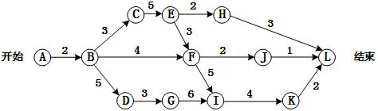

### 问题1
- A. 9
- B. 15
- C. 22
- D. 24
### 问题2
- A. 2
- B. 3
- C. 5
- D. 9

### 正确答案

D、A

### 解析

关键路径为：ABCEFIKL，长度24。
BD不在该路径上，因此BD不是关键活动，而BD所在的所有路径，最长路径为ABDGIKL，长度为22，因此松弛时间为2。

## 第17题（单选题）

以下关于软件项目管理中人员管理的叙述，正确的是（A）。

- A. 项目组成员的工作风格也应该作为组织团队时要考虑的一个要素
- B. 鼓励团队的每个成员充分地参与开发过程的所有阶段
- C. 仅根据开发人员的能力来组织开发团队
- D. 若项目进度滞后于计划，则增加开发人员一定可以加快开发进度

### 正确答案

A

### 解析

本题考查的是项目管理的人力资源方面的问题，在团队组建时，需要考虑企业的事业环境因素对项目的影响。
在项目中由于分工不同，每个团队人员不需要充分参与开发过程的所有阶段，并且在软件项目中，开发只是其中一个阶段，所以不能仅根据开发人员的能力来组织团队，当进度滞后时，增加开发人员不一定能加快开发速度，并且，由于加入新的团队成员，已经成熟的团队会回到磨合期，可能会造成进度更加滞后。
综上，本题只有A选项是正确的。

## 第18题（单选题）

编译器和解释器是两种基本的高级语言处理程序。编译器对高级语言源程序的处理过程可以划分为词法分析、语法分析、语义分析、中间代码生成、代码优化、目标代码生成等阶段，其中，（C/B）并不是每个编译器都必需的，与编译器相比，解释器（  ）。
 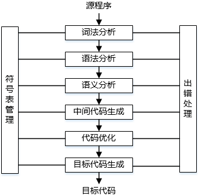

### 问题1
- A. 词法分析和语法分析
- B. 语义分析和中间代码生成
- C. 中间代码生成和代码优化
- D. 代码优化和目标代码生成
### 问题2
- A. 不参与运行控制，程序执行的速度慢
- B. 参与运行控制，程序执行的速度慢
- C. 参与运行控制，程序执行的速度快
- D. 不参与运行控制，程序执行的速度快

### 正确答案

C、B

### 解析

在编译过程中：词法分析；语法分析；语义分析；目标代码生成是必须的，而代码优化和中间代码生成是可以不需要的。
编译与解释的区别在于：
编译直接生成目标代码，在机器上执行而编译器不需要参与执行，因此程序执行速度快；
解释则生成中间代码或其等价形式，程序执行时需要解释器的参与，并且由解释器控制程序的执行，因此执行速度慢。

## 第19题（单选题）

表达式采用逆波兰式表示时，利用（A）进行求值。

- A. 栈
- B. 队列
- C. 符号表
- D. 散列表

### 正确答案

A

### 解析

逆波兰使用栈的基本操作流程为：从左至右将数字入栈，当遇运算符时，出栈运算符所需数据进行操作，再将操作结果入栈，依此类推。

## 第20题（单选题）

某企业的生产流水线上有2名工人P1和P2，1名检验员P3。P1将初步加工的半成品放入半成品箱B1； P2从半成品箱B1取出继续加工，加工好的产品放入成品箱B2；P3从成品箱B2取出产品校验。假设B1可存放n件半成品，B2可存放m件产品，并设置6个信号量S1、S2、S3、S4、S5和S6，且S3和S6的初值都为0。采用PV操作实现P1、P2和P3的同步模型如下图所示，则信号量S1和S5（C/D）；S2、S4的初值分别为（  ）。
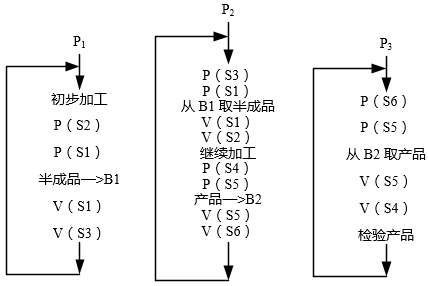

### 问题1
- A. 分别为同步信号量和互斥信号量，初值分别为0和1
- B. 都是同步信号量，其初值分别为0和0
- C. 都是互斥信号量，其初值分别为1和1
- D. 都是互斥信号量，其初值分别为0和1
### 问题2
- A. n、0
- B. m、0
- C. m、n
- D. n、m

### 正确答案

C、D

### 解析

在本题中涉及到的信号量较多，所以先要分析应用场景中哪些地方可能涉及到互斥和同步，这样才能把问题分析清楚。从题目的描述可以了解到整个流程由3名不同的工人协作完成，先进行P1的处理，然后是P2，最后P3，这样要达到协作关系，要使用同步信号量。同时由于P1处理结果会存到B1中，P2再从B1取内容，在此B1不能同时既进行存操作，也进行取操作，这就涉及到互斥。结合配图可以看出：S1信号量是互斥信号量，它确保B1的使用是互斥使用；S5信号量针对B2起到同样的作用。
S2与S4是同步信号量，S2在P1开始放入半成品时执行P操作，代表资源占用，而在P2取出产品时执行V操作，代表资源释放，这说明S2对应的资源是B1的容量n。同理S4对应m。

## 第21题（单选题）

假设磁盘块与缓冲区大小相同，每个盘块读入缓冲区的时间为15μs，由缓冲区送至用户区的时间是5μs，在用户区内系统对每块数据的处理时间为1μs，若用户需要将大小为10个磁盘块的Doc1文件逐块从磁盘读入缓冲区，并送至用户区进行处理，那么采用单缓冲区需要花费的时间为（D/C）μs；采用双缓冲区需要花费的时间为（  ）μs。

### 问题1
- A. 150
- B. 151
- C. 156
- D. 201
### 问题2
- A. 150
- B. 151
- C. 156
- D. 201

### 正确答案

D、C

### 解析

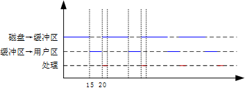
单缓冲区：(15+5)×10+1=201
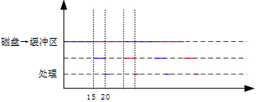
双缓冲区：15×10+5+1=156

## 第22题（单选题）

在如下所示的进程资源图中，（D）。
 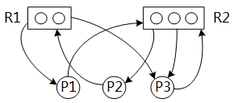

- A. P1、P2、P3都是非阻塞节点，该图可以化简，所以是非死锁的
- B. P1、P2、P3都是阻塞节点，该图不可以化简，所以是死锁的
- C. P1、P2是非阻塞节点，P3是阻塞节点，该图不可以化简，所以是死锁的
- D. P2是阻塞节点，P1、P3是非阻塞节点，该图可以化简，所以是非死锁的

### 正确答案

D

### 解析

解答本题首先需要了解图所代表的含义。在图中R1与R2代表的是资源，P1-P3代表进程。从资源指向进程的箭头代表有资源分配给了进程，而从进程指向资源的箭头代表进程要申请这个资源（注：每个箭头只代表一个资源或资源请求）。例如：R1一共有2个资源，并将这2个资源中的1个分给了P1，另1个分给了P3，P2此时向R1申请1个资源。
下面开始分析阻塞点，所谓阻塞点就是从这个进程开始执行，会让程序陷入死锁，执行不了。
1、尝试先执行P1:P1向R2申请1个资源， R2一共3个资源，已分配了2个，还剩余1个，所以他能满足P1的申请，给P1分配资源。P1分配到资源之后可以执行完毕，并释放自己占用的所有资源。接下来的P2与P3都能执行完毕，所以P1是非阻塞点。
2、尝试先执行P2:P2向R1申请1个资源，R1一共2个资源，并全部分配出去了，所以目前P2的资源申请无法被满足，既然无法被满足，自然不能执行，也就是阻塞点了。
3、尝试先执行P3:P3向R2申请1个资源， R2一共3个资源，已分配了2个，还剩余1个，所以他能满足P3的申请，给P3分配资源。P3分配到资源之后可以执行完毕，并释放自己占用的所有资源。接下来的P1与P2都能执行完毕，所以P3是非阻塞点。

## 第23题（单选题）

在支持多线程的操作系统中，假设进程P创建了若干个线程，那么（C）是不能被这些线程共享的。

- A. 该进程中打开的文件
- B. 该进程的代码段
- C. 该进程中某线程的栈指针
- D. 该进程的全局变量

### 正确答案

C

### 解析

在多线程运行环境中，每个线程自己独有资源很少，只有：程序计数器，寄存器和栈，其他的资源均是共享进程的，所以也只有这些独有资源是不共享的。

## 第24题（单选题）

某开发小组欲开发一个超大规模软件：使用通信卫星，在订阅者中提供、监视和控制移动电话通信，则最不适宜采用（B）过程模型。

- A. 瀑布
- B. 原型
- C. 螺旋
- D. 喷泉

### 正确答案

B

### 解析

需要开发的是大型软件系统，所以原型模型最不适合。

## 第25题（单选题）

（D）开发过程模型以用户需求为动力，以对象为驱动，适合于面向对象的开发方法。

- A. 瀑布
- B. 原型
- C. 螺旋
- D. 喷泉

### 正确答案

D

### 解析

瀑布模型：严格遵循软件生命周期各阶段的固定顺序，一个阶段完成再进入另一个阶段。其优点是可以使过程比较规范化，有利于评审；缺点在于过于理想，缺乏灵活性，容易产生需求偏差。属于结构化模型。
原型模型：主要用于获取用户需求。属于原型开发模型。
螺旋模型：结合了瀑布模型和演化模型的优点，最主要的特点在于加入了风险分析。它是由制定计划、风险分析、实施工程、客户评估这一循环组成的，它最初从概念项目开始第一个螺旋。属于面向对象开发模型，强调风险引入。
喷泉模型：主要用于描述面向对象的开发过程，以用户需求为动力，以对象为驱动，最核心的特点是迭代。所有的开发活动没有明显的边界，允许各种开发活动交叉进行。本题选择D选项。

## 第26题（单选题）

在ISO/IEC软件质量模型中，易使用性的子特性不包括（D）。

- A. 易理解性
- B. 易学性
- C. 易操作性
- D. 易分析性

### 正确答案

D

### 解析

站点未提供标准答案/解析

## 第27题（单选题）

在进行子系统结构设计时，需要确定划分后的子系统模块结构，并画出模块结构图。该过程不需要考虑（B）。

- A. 每个子系统如何划分成多个模块
- B. 每个子系统采用何种数据结构和核心算法
- C. 如何确定子系统之间、模块之间传送的数据及其调用关系
- D. 如何评价并改进模块结构的质量

### 正确答案

B

### 解析

系统模块结构设计的任务是确定划分后的子系统的模块结构，并画出模块结构图，这个过程中必须考虑这样几个问题：每个子系统如何划分成若干个模块；如何确定子系统之间、模块之间传送的数据及其调用关系；如何评价并改进模块结构的质量；如何从数据流图导出模块结构图。

## 第28题（单选题）

数据流图中某个加工的一组动作依赖于多个逻辑条件的取值，则用（D）能够清楚地表示复杂的条件组合与应做的动作之间的对应关系。

- A. 流程图
- B. NS盒图
- C. 形式语言
- D. 决策树

### 正确答案

D

### 解析

1、结构化语言：形式语言精确，但不易被理解，自然语言易理解，但它不精确，可能产生二义性。结构化语言取长补短，它是在自然语言基础上加了一些限定，使用有限的词汇和有限的语句来描述加工逻辑，结构化语言是介于自然语言（英语或汉语）和形式化语言之间的一种半形式化语言。
 2、程序流程图：描述模块或程序执行过程的历史最久、流行最广的一种图形表示方法。
 3、NS图：是支持结构化程序设计方法而产生的一种描述工具。
 4、决策树：一种适合于描述加工中具有多个策略且每个策略和若干条件有关的逻辑功能的图形工具。
本题选择D选项。

## 第29题（单选题）

根据软件过程活动对软件工具进行分类，则逆向工程工具属于（B）工具。

- A. 软件开发
- B. 软件维护
- C. 软件管理
- D. 软件支持

### 正确答案

B

### 解析

逆向工程是在软件维护时，由于缺少文档资料，而对软件的一种分析。

## 第30题（单选题）

若用白盒测试方法测试以下代码，并满足条件覆盖，则至少需要（B/D）个测试用例。采用McCabe度量法算出该程序的环路复杂性为（  ）。
Int find _max（int i,int j,int k）{  
    int max;
    if(i > j)then
                 if（i > k）then max =i；
                 else max=k；
         else if（j > k）then max =j；
                  else max=k；
    }

### 问题1
- A. 3
- B. 4
- C. 5
- D. 6
### 问题2
- A. 1
- B. 2
- C. 3
- D. 4

### 正确答案

B、D

### 解析

1.第一空要求条件覆盖，根据代码，我们可以发现，虽然有3个判断语句，但实际从第一层判断开始，只能分2条支路判断进行，不会经过第3次判断了，因此如果要满足条件覆盖，只需要分别满足2层条件判断，需要的用例个数是4。
如下用例（i，j，k）：（1，0，-1）（1，0，2）（0，1，-1）（0，1，2）可以满足条件覆盖。
2.要计算McCabe复杂度需要先绘制出图，代码转换图如下：
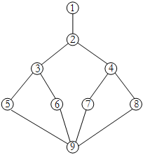
然后采用公式V（G）=m-n+2计算环路复杂度，其中m是边的数量，n是结点的数量。
图中结点数n是9，边的数量是11，环路复杂度为11-9+2=4，第二空选择D选项。

## 第31题（单选题）

在面向对象的系统中，对象是运行时实体，其组成部分不包括（A/D）；一个类定义了一组大体相似的对象，这些对象共享（  ）。

### 问题1
- A. 消息
- B. 行为（操作）
- C. 对象名
- D. 状态
### 问题2
- A. 属性和状态
- B. 对象名和状态
- C. 行为和多重度
- D. 属性和行为

### 正确答案

A、D

### 解析

对象的组成部分包括：对象名，状态（属性），行为（操作）。类是对对象共有属性和行为的抽象，因此一个类定义的对象共享行为和属性。

## 第32题（单选题）

如下所示的UML类图中，Car和Boat类中的move()方法（B）了Transport类中的move()方法。
 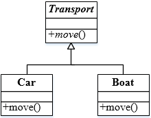

- A. 继承
- B. 覆盖（重置）
- C. 重载
- D. 聚合

### 正确答案

B

### 解析

覆盖：子类重写父类的方法。
重载：一个类可以有多个同名而参数类型不同的方法。

## 第33题（单选题）

如下所示的**UML**图中，（I）是（A/C/B），（Ⅱ）是（  ），（Ⅲ）是（  ）。
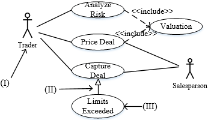

### 问题1
- A. 参与者
- B. 用例
- C. 泛化关系
- D. 包含关系
### 问题2
- A. 参与者
- B. 用例
- C. 泛化关系
- D. 包含关系
### 问题3
- A. 参与者
- B. 用例
- C. 泛化关系
- D. 包含关系

### 正确答案

A、C、B

### 解析

本题考查统一建模语言（UML）的基本知识，主要是用例图的图示考查。
 用例图（use case diagram）展现了一组用例、参与者（Actor）以及它们之间的关系。用例图通常包括用例、参与者，以及用例之间的扩展关系（ < < extend > > ）和包含关系（ < < include > > ），参与者和用例之间的关联关系，用例与用例以及参与者与参与者之间的泛化关系。如下图所示。
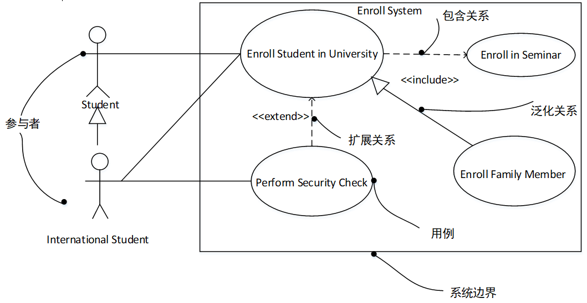
 用例图用于对系统的静态用例视图进行建模，主要支持系统的行为，即该系统在它的周边环境的语境中所提供的外部可见服务。

## 第34题（单选题）

下图所示为UML（C）。
 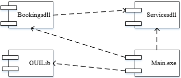

- A. 类图
- B. 部署图
- C. 组件图
- D. 网络图

### 正确答案

C

### 解析

本题考查统一建模语言（UML）的基本知识。
UML中提供了多种建模系统的图，体现系统的静态方面和动态方面。
类图（class diagram）展现了一组对象、接口、协作和它们之间的关系。在面向对象系统的建模中所建立的最常见的图就是类图。类图给出系统的静态设计视图。
部署图（deployment diagram）是用来对面向对象系统的物理方面建模的方法，展现了运行时处理结点以及其中构件（制品）的配置。部署图对系统的静态部署视图进行建模，它与组件图（构件图）相关。
组件图或构件图（component diagram）展现了一组构件之间的组织和依赖，如图所示为组件图。组件图或构件图专注于系统的静态实现视图。它与类图相关，通常把构件映射为一个或多个类、接口或协作。UML部署图经常被认为是一个网络图。

## 第35题（单选题）

以下关于Singleton（单例）设计模式的叙述中，不正确的是（D）。

- A. 单例模式是创建型模式
- B. 单例模式保证一个类仅有一个实例
- C. 单例类提供一个访问唯一实例的全局访问点
- D. 单例类提供一个创建一系列相关或相互依赖对象的接口

### 正确答案

D

### 解析

抽象工厂模式提供一个创建一系列相关或相互依赖对象的接口，而无需指定他们具体的类，而非单例模式。

## 第36题（单选题）

（D/A/D）设计模式能够动态地给一个对象添加一些额外的职责而无需修改此对象的结构；（  ）设计模式定义一个用于创建对象的接口，让子类决定实例化哪一个类；欲使一个后端数据模型能够被多个前端用户界面连接，采用（  ）模式最适合。

### 问题1
- A. 组合（Composite）
- B. 外观（Facade）
- C. 享元（Flyweight）
- D. 装饰器（Decorator）
### 问题2
- A. 工厂方法（Factory Method）
- B. 享元（Flyweight)
- C. 观察者（ Observer）
- D. 中介者（Mediator）
### 问题3
- A. 装饰器（Decorator）
- B. 享元（Flyweight）
- C. 观察者（Observer）
- D. 中介者（Mediator）

### 正确答案

D、A、D

### 解析

[['抽象工厂模式（Abstract Factory）：提供一个接口，可以创建一系列相关或相互依赖的对象，而无需指定它们具体的类。
构建器模式（Builder）：将一个复杂类的表示与其构造相分离，使得相同的构建过程能够得出不同的表示。
工厂方法模式（Factory Method）：定义一个创建对象的接口，但由子类决定需要实例化哪一个类。工厂方法使得子类实例化的过程推迟。
原型模式（Prototype）：用原型实例指定创建对象的类型，并且通过拷贝这个原型来创建新的对象。
单例模式（Singleton）：保证一个类只有一个实例，并提供一个访问它的全局访问点。
适配器模式（Adapter）：将一个类的接口转换成用户希望得到的另一种接口。它使原本不相容的接口得以协同工作。
桥接模式（Bridge）：将类的抽象部分和它的实现部分分离开来，使它们可以独 立地变化。
组合模式（Composite）：将对象组合成树型结构以表示“整体-部分”的层次结构，使得用户对单个对象和组合对象的使用具有一致性。
装饰模式（Decorator）：动态地给一个对象添加一些额外的职责。它提供了用子类扩展功能的一个灵活的替代，比派生一个子类更加灵活。
外观模式（Facade）：定义一个高层接口，为子系统中的一组接口提供一个一致的外观，从而简化了该子系统的使用。
享元模式（Flyweight）：提供支持大量细粒度对象共享的有效方法。
代理模式（Proxy）：为其他对象提供一种代理以控制这个对象的访问。
职责链模式（Chain of Responsibility）：通过给多个对象处理请求的机会，减少请求的发送者与接收者之间的耦合。将接收对象链接起来，在链中传递请求，直到有一个对象处理这个请求。
命令模式（Command）：将一个请求封装为一个对象，从而可用不同的请求对客户进行参数化，将请求排队或记录请求日志，支持可撤销的操作。
解释器模式（Interpreter）：给定一种语言，定义它的文法表示，并定义一个解释器，该解释器用来根据文法表示来解释语言中的句子。
迭代器模式（Iterator）：提供一种方法顺序访问一个聚合对象中的各个元素，而不需要暴露该对象的内部表示。
中介者模式（Mediator）：用一个中介对象来封装一系列的对象交互。它使各对象不需要显式地相互调用，从而达到低耦合，还可以独 立地改变对象间的交互。
备忘录模式（Memento）：在不破坏封装性的前提下，捕获一个对象的内部状态，并在该对象之外保存这个状态，从而可以在以后将该对象恢复到原先保存的状态。
观察者模式（Observer）：定义对象间的一种一对多的依赖关系，当一个对象的状态发生改变时，所有依赖于它的对象都得到通知并自动更新。
状态模式（State）：允许一个对象在其内部状态改变时改变它的行为。
策略模式（Strategy）：定义一系列算法，把它们一个个封装起来，并且使它们之间可互相替换，从而让算法可以独 立于使用它的用户而变化。
模板方法模式（Template Method）：定义一个操作中的算法骨架，而将一些步骤延迟到子类中，使得子类可以不改变一个算法的结构即可重新定义算法的某些特定步骤。
访问者模式（Visitor）：表示一个作用于某对象结构中的各元素的操作，使得在不改变各元素的类的前提下定义作用于这些元素的新操作。''''''''''],['
'],['
']]

## 第37题（单选题）

某程序运行时陷入死循环，则可能的原因是程序中存在（C）。

- A. 词法错误
- B. 语法错误
- C. 动态的语义错误
- D. 静态的语义错误

### 正确答案

C

### 解析

死循环错误属于典型的语义错误，但静态的语义错误可被编译器发现，到程序真正陷入死循环说明编译器并未发现，所以属于动态语义错误。

## 第38题（单选题）

某非确定的有限自动机（NFA）的状态转换图如下图所示（q0既是初态也是终态）。以下关于该NFA的叙述中，正确的是（D）。
 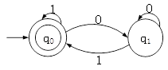

- A. 其可识别的0、1序列的长度为偶数
- B. 其可识别的0、1序列中0与1的个数相同
- C. 其可识别的非空0、1序列中开头和结尾字符都是0
- D. 其可识别的非空0、1序列中结尾字符是1

### 正确答案

D

### 解析

要证明一种说法有误只需要举一反例即可，所以做这类题时，举反例排除错误选择是一个不错的选择。
由于题目所述的NFA可以解析串“1”，所以可排除：A，B，C三个选项。

## 第39题（单选题）

函数t()、f()的定义如下所示，若调用函数t时传递给x的值为5，并且调用函数f()时，第一个参数采用传值（call by value）方式，第二个参数采用传引用（call by reference）方式，则函数t()的返回值为（A）。
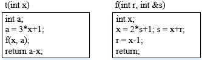

- A. 33
- B. 22
- C. 11
- D. 负数

### 正确答案

A

### 解析

传值调用形参改变不会改变原实参的值，传址调用形参改变会改变原实参的值。
当程序执行到函数t中，调用f(x,a)时，x=5,a=16。
当程序在f(x,a)中执行完成之后，对r的值的改变，并不会影响原实参值，但对s的修改会改变调用的原实参值，在f(x,a)中执行完成之后s的值变为38，所以对应原实参值a也变为38，而原实参x的值没有改变，仍然是5。最后返回值是：a-x，即38-5=33。

## 第40题（单选题）

数据库系统通常采用三级模式结构：外模式、模式和内模式。这三级模式分别对应数据库的（B）。

- A. 基本表、存储文件和视图
- B. 视图、基本表和存储文件
- C. 基本表、视图和存储文件
- D. 视图、存储文件和基本表

### 正确答案

B

### 解析

数据库三级模式的图为：
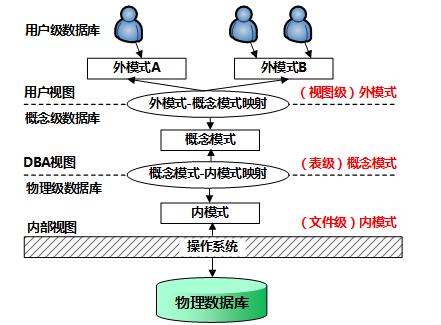
其中外模式对应视图，概念模式对应基本表，内模式对应存储文件。

## 第41题（单选题）

在数据库逻辑设计阶段，若实体中存在多值属性，那么将E-R图转换为关系模式时，（C），得到的关系模式属于4NF。

- A. 将所有多值属性组成一个关系模式
- B. 使多值属性不在关系模式中出现
- C. 将实体的码分别和每个多值属性独立构成一个关系模式
- D. 将多值属性和其它属性一起构成该实体对应的关系模式

### 正确答案

C

### 解析

本题由于4NF的定义并不了解，所以有一定难度。
 首先根据选项我们可以看到这里的描述都是与多值属性有关，多值属性指的是一个属性有多个值，比如一个学生有多名家庭成员，那么如果有（学号，家庭成员），此时家庭成员为多值属性。
 对于多值属性出现在关系模式当中，不能明确对应关系，因此需要进行分解。
 对于“A.将所有多值属性组成一个关系模式”，这样的分解没有保存当前主键与多值属性的关系，并不合理。
 对于“B.使多值属性不在关系模式中出现”，也就是删除多值属性列，那么丢失了原有的属性，也不合理。
 对于“D.将多值属性和其它属性一起构成该实体对应的关系模式”，这样的处理并没有解决当前的问题，因此不可选。
 对于“C.将实体的码分别和每个多值属性独立构成一个关系模式”，是我们比较常用的一种处理方式。因此本题选择C选项。
 4NF：若关系模式R
1NF，R的每个非平凡多值依赖X→Y且Y
X时，X必含有码，则关系模式R（U，F）
4NF；对于本题中存在多值属性的情况，应该将该实体的码和相关的多值属性独立构成一个关系模式。

## 第42题（单选题）

在分布式数据库中有分片透明、复制透明、位置透明和逻辑透明等基本概念，其中：（D/A）是指局部数据模型透明，即用户或应用程序无需知道局部使用的是哪种数据模型；（  ）是指用户或应用程序不需要知道逻辑上访问的表具体是如何分块存储的。

### 问题1
- A. 分片透明
- B. 复制透明
- C. 位置透明
- D. 逻辑透明
### 问题2
- A. 分片透明
- B. 复制透明
- C. 位置透明
- D. 逻辑透明

### 正确答案

D、A

### 解析

分片透明性：是指用户不必关系数据是如何分片的，它们对数据的操作在全局关系上进行，即关系如何分片对用户是透明的，因此，当分片改变时应用程序可以不变。分片透明性是最高层次的透明性，如果用户能在全局关系一级操作，则数据如何分布，如何存储等细节自不必关系，其应用程序的编写与集中式数据库相同。本题第二空属于分片透明。
复制透明：用户不用关心数据库在网络中各个节点的复制情况，被复制的数据的更新都由系统自动完成。在分布式数据库系统中，可以把一个场地的数据复制到其他场地存放，应用程序可以使用复制到本地的数据在本地完成分布式操作，避免通过网络传输数据，提高了系统的运行和查询效率。但是对于复制数据的更新操作，就要涉及到对所有复制数据的更新。位置透明性是指用户不必知道所操作的数据放在何处，即数据分配到哪个或哪些站点存储对用户是透明的。因此，数据分片模式的改变，如把数据从一个站点转移到另一个站点将不会影响应用程序，因而应用程序不必改写。
局部映像透明性（逻辑透明）：是最低层次的透明性，该透明性提供数据到局部数据库的映像，即用户不必关系局部DBMS支持哪种数据模型、使用哪种数据操纵语言，数据模型和操纵语言的转换是由系统完成的。因此，局部映像透明性对异构型和同构异质的分布式数据库系统是非常重要的。本题第一空属于逻辑透明。

## 第43题（单选题）

设有关系模式R（A1，A2，A3，A4，A5，A6），其中：函数依赖集F={A1→A2，A1A3→A4，A5A6→A1，A2A5→A6，A3A5→A6}，则（C/B）是关系模式R的一个主键，R规范化程度最高达到（  ）。

### 问题1
- A. A1A4
- B. A2A4
- C. A3A5
- D. A4A5
### 问题2
- A. 1NF
- B. 2NF
- C. 3NF
- D. BCNF

### 正确答案

C、B

### 解析

[['求候选码：关系模式码的确定，设关系模式R < U，F > ：1、首先应该找出F中所有的决定因素，即找出出现在函数依赖规则中“→”左边的所有属性，组成集合U1；2、再从U1中找出一个属性或属性组K，运用Armstrong公理系统及推论，使得K→U，而K真子集K′→U不成立；这样就得到了关系模式R的一个候选码，找遍U1属性的所有组合，重复过程（2），最终得到关系模式R的所有候选码。
在本题中 U1={A1、A2、A3、A5、A6}
A3A5→A6，A5A6→A1 利用伪传递率：A3A5→A1，A1→A2利用传递率：A3A5→A2
A3A5→A1，A1A3→A4利用伪传递率：A3A5→A4
因此A3A5→{ A1，A2，A3，A4，A5，A6}
注：Armstrong公理系统及推论如下：
自反律：若Y⊆X⊆U，则X→Y为F所逻辑蕴含；
增广律：若X→Y为F所逻辑蕴含，且Z⊆U，则XZ→YZ为F所逻辑蕴含；
传递律：若X→Y和Y→Z为F所逻辑蕴含，则X→Z为F所逻辑蕴含；
合并规则：若X→Y，X→Z，则X→YZ为F所蕴涵；
伪传递率：若X→Y，WY→Z，则XW→Z为F所蕴涵；
分解规则：若X→Y，Z⊆Y，则X→Z为F所蕴涵；
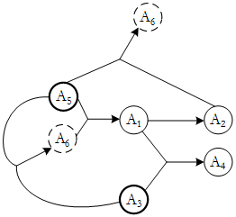
'''],['所有属性完全依赖于候选键A3A5 ，该关系模式满足2NF。
A3A5→A1 ， A1 →A6 ，存在非主属性A6通过非主属性A1传递依赖于候选键A3A5 ，因此该关系模式不满足3NF，R规范化程度最高达到2NF。
']]

## 第44题（单选题）

对于一个长度为n（n > 1）且元素互异的序列，令其所有元素依次通过一个初始为空的栈后，再通过一个初始为空的队列。假设队列和栈的容量都足够大，且只要栈非空就可以进行出栈操作，只要队列非空就可以进行出队操作，那么以下叙述中，正确的是（B）。

- A. 出队序列和出栈序一定互为逆序
- B. 出队序列和出栈序列一定相同
- C. 入栈序列与入队序列一定相同
- D. 入栈序列与入队序列一定互为逆序

### 正确答案

B

### 解析

从题目的描述来看，出栈之后，直接入队，然后出队。所以：入队序列=出栈序列，又因为出队序列=入队序列。所以出队序列和出栈序列一定相同。

## 第45题（单选题）

设某n阶三对角矩阵Anxn的示意图如下图所示。若将该三对角矩阵的非零元素按行存储在一维数组B[k]（1≤k≤3*n-2）中，则k与i、j的对应关系是（A）。
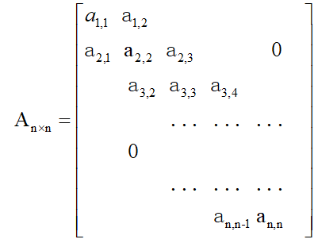

- A. k=2i+j-2
- B. k=2i-j+2
- C. k=3i+j-1
- D. K=3i-j+2

### 正确答案

A

### 解析

该题最简单的解题思路是代入法。当i=1，j=1时，k=1。
选项A：k=2i+j-2=2+1-2=1；
选项B：k=2i-j+2=2-1+2=3；
选项C：k=3i+j-1=3+1-1=3；
选项D：k=3i-j+2=3-1+2=4。
此时可以除排B，C，D，直接选A。若用一个例子，不能排除所有错误选项，则而举一个例子来进行代入，排除更多错误选项。

## 第46题（单选题）

对于非空的二叉树，设D代表根结点，L代表根结点的左子树R代表根结点的右子树。若对下图所示的二叉树进行遍历后的结点序列为7 6 5 4 3 2 1，则遍历方式是（D）。   
 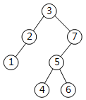

- A. LRD
- B. DRL
- C. RLD
- D. RDL

### 正确答案

D

### 解析

该题突破了常规的遍历树的方式，采用了新的遍历方式。但是做题进行判断时还是比较容易的，因为先根（包括根左右与根右左）的遍历，则根结点3会是第1个访问的结点；后根（左右根与根右左）的遍历，则根结点3会是最后1个访问的结点。给出的序列中3既不在第1个位置，也不在最后1个位置，所以先根后根都可排除，而A、B、C三个选项中，A与C是后根，B选项是先根，都可排除，只能选D。D是右根左的访问方式，与结点序列完全吻合。

## 第47题（单选题）

在55个互异元素构成的有序表A[1..55]中进行折半查找（或二分查找，向下取整）。若需要找的元素等于A[19]，则在查找过程中参与比较的元素依次为（B）、A[19]。

- A. A[28]、A[30]、A[15]、A[20]
- B. A[28]、A[14]、A[21]、A[17]
- C. A[28]、A[15]、A[22]、A[18]
- D. A[28]、A[18]、A[22]、A[20]

### 正确答案

B

### 解析

折半查找时，下标计算过程为（注：key的值与A[19]相同）：
1、mid=[(1+55)/2]=28，把A[28]与key的值比较后，缩小查找范围为：A[1]至A[27]；
2、mid=[(1+27)/2]=14，把A[14]与key的值比较后，缩小查找范围为：A[15]至A[27]；
3、mid=[(15+27)/2]=21，把A[21]与key的值比较后，缩小查找范围为：A[15]至A[20]；
4、mid=[(15+20)/2]=17，把A[17]与key的值比较后，缩小查找范围为：A[18]至A[20]；
5、mid=[(18+20)/2]=19，把A[19]与key的值比较后，发现值相等，找到目标。

## 第48题（单选题）

设一个包含n个顶点、e条弧的简单有向图采用邻接矩阵存储结构（即矩阵元素A[i][j]等于1或0，分别表示顶点i与顶点j之间有弧或无弧），则该矩阵结构非零元素数目为（A）。

- A. e
- B. 2e
- C. n-e
- D. n+e

### 正确答案

A

### 解析

用邻接矩阵存储有向图，图中每一条弧对应矩阵一个非零元素，题目中提到一共有e条弧，所以一共e个非零元素。

## 第49题（单选题）

已知算法A的运行时间函数为T(n)=8T(n/2)+n2，其中n表示问题的规模，则该算法的时间复杂度为（D/C）。另已知算法B的运行时间函数为T(n)=XT(n/4)+n2，其中n表示问题的规模。对充分大的n，若要算法B比算法A快，则X的最大值为（  ）。

### 问题1
- A. O(n)
- B. O(nlgn)
- C. O(n2)
- D. O(n3)
### 问题2
- A. 15
- B. 17
- C. 63
- D. 65

### 正确答案

D、C

### 解析

本题需要用到特定形式的主定理分析：
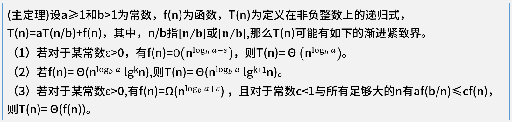
在本题中，a=8,b=2，故符合（1）的情况。
时间复杂度为：O(n3)。第一空选择D选项。
对于算法B的运行时间函数为T(n)=XT(n/4)+n2，同样带入分析，a=X，b=4，f(n)=n2。若要算法B与算法A一样快，即时间复杂度一致，则满足条件（1），且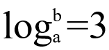，此时带入算法B的变量，即log4X=3，即X=64，现在要求算法B更快，即时间复杂度更小，所以X应该小于64，可取的最大值为63。第二空选择C选项。

## 第50题（单选题）

在某应用中，需要先排序一组大规模的记录，其关键字为整数。若这组记录的关键字基本上有序，则适宜采用（A/D）排序算法。若这组记录的关键字的取值均在0到9之间（含），则适宜采用（  ）排序算法。

### 问题1
- A. 插入
- B. 归并
- C. 快速
- D. 计数
### 问题2
- A. 插入
- B. 归并
- C. 快速
- D. 计数

### 正确答案

A、D

### 解析

插入排序中的希尔排序的基本思想是：先将整个待排序的记录序列分割成为若干子序列分别进行直接插入排序，待整个序列中的记录“基本有序”时，再对全体记录进行依次直接插入排序。所以当数列基本有序时，采用插入排序算法是比较合适的。
计数排序是一个非基于比较的排序算法，该算法于1954年由 Harold H. Seward 提出。它的优势在于在对一定范围内的整数排序时，它的复杂度为Ο(n+k)（其中k是整数的范围），快于任何比较排序算法。

## 第51题（单选题）

集线器与网桥的区别是（B）。

- A. 集线器不能检测发送冲突，而网桥可以检测冲突
- B. 集线器是物理层设备，而网桥是数据链路层设备
- C. 网桥只有两个端口，而集线器是一种多端口网桥
- D. 网桥是物理层设备，而集线器是数据链路层设备

### 正确答案

B

### 解析

站点未提供标准答案/解析

## 第52题（单选题）

POP3协议采用（B）模式，客户端代理与POP3服务器通过建立TCP连接来传送数据。

- A. Browser/Server
- B. Client/Server
- C. Peer to Peer
- D. Peer to Server

### 正确答案

B

### 解析

POP3，全名为“Post Office Protocol - Version 3”，即“邮局协议版本3”。是TCP/IP协议族中的一员，由RFC1939 定义。本协议主要用于支持使用客户端远程管理在服务器上的电子邮件。提供了SSL加密的POP3协议被称为POP3S。
 POP3协议特性：
 POP3协议默认端口：110；。
 POP3协议默认传输协议：TCP；
 POP3协议适用的构架结构：C/S；
 POP3协议的访问模式：离线访问。

## 第53题（单选题）

TCP使用的流量控制协议是（C）。

- A. 固定大小的滑动窗口协议
- B. 后退N帧的ARQ协议
- C. 可变大小的滑动窗口协议
- D. 停等协议

### 正确答案

C

### 解析

在TCP的实现机制中，为了保障传输的可靠性，所以发送方每发送一个报文，接收方接到之后会回发确认信息。如果发送端的数据过多或者数据发送速率过快，致使接收端来不及处理，则会造成数据在接收端的丢弃。为了避免这种现象的发生，通常的处理办法是采用流量控制，即控制发送端发送的数据量及数据发送速率。
流量控制的目的是在接收端有限承受能力的情况下，通过流量约束，减少接收端处的数据丢失，提高数据发送效率，充分利用接收端资源。
可变滑动窗口流量控制的基本过程如下：
1、在建立TCP连接阶段，双方协商窗口尺寸，同时接收端预留数据缓冲区；
2、发送端根据协商的结果，发送符合窗口尺寸的数据字节流，并等待对方的确认；
3、发送端根据确认信息，改变窗口的尺寸。
注：窗口也就是缓冲区，发送方窗口大小决定了一次可以连续发送多少个数据。

## 第54题（单选题）

以下4种路由中，（D）路由的子网掩码是255.255.255.255。

- A. 远程网络
- B. 静态
- C. 默认
- D. 主机

### 正确答案

D

### 解析

主机路由和网络路由是由目的地址的完整度区分的，主机路由的目的地址是一个完整的主机地址（子网掩码固定为255.255.255.255）。网络路由目的地址是一个网络地址（主机号部分为0）。当为某个目的I P地址搜索路由表时，主机地址项必须与目的地址完全匹配，而网络地址项只需要匹配目的地址的网络号和子网号就可以了。

## 第55题（单选题）

以下关于层次化局域网模型中核心层的叙述，正确的是（B）。

- A. 为了保障安全性，对分组要进行有效性检查
- B. 将分组从一个区域高速地转发到另一个区域
- C. 由多台二、三层交换机组成
- D. 提供多条路径来缓解通信瓶颈

### 正确答案

B

### 解析

层次化网络设计中各个层次的主要功能包括：
接入层：用户接入、计费管理、MAC地址认证、收集用户信息。
汇聚层：网络访问策略控制、数据包处理、过滤、寻址。
核心层：高速数据交换，常用冗余机制。

## 第56题（单选题）

In a world where it seems we already have too much to do, and too many things to think about, it seems the last thing we need is something new that we have to learn.
 But use cases do solve a problem with requirements:with（1）declarative requirements it's hard to describe steps and sequences of events.
 Use cases, stated simply, allow description of sequences of events that, taken together, lead to a system doing something useful.As simple as this sounds,this is important. When confronted only with a pile of requirements, it's often（2）to make sense of what the authors of the requirements really wanted the system to do.In the preceding example, use cases reduce the ambiguity of the requirements by specifying exactly when and under what conditions certain behavior occurs;as such, the sequence of the behaviors can be regarded as a requirement. Use cases are particularly well suited to capture approaches. Although this may sound simple, the fact is that（3）requirement capture approaches, with their emphasis on declarative requirements and "shall" statements,completely fail to capture  the（4）of the system's behavior. Use cases are a simple yet powerful way to express the behavior of the system in way that all stakeholders can easily understand.
 But,like anything, use cases come with their own problems, and as useful as they are,they can be（5）.The result is something that is  as bad, if not worse, that the original problem.Therein it's important to utilize use cases effectively without creating a greater problem than the one you started with.

### 问题1
- A. plenty
- B. loose
- C. extra
- D. strict
### 问题2
- A. impossible
- B. possible
- C. sensible
- D. practical
### 问题3
- A. modern
- B. conventional
- C. different
- D. formal
### 问题4
- A. statics
- B. nature
- C. dynamics
- D. originals
### 问题5
- A. misapplied
- B. applied
- C. used
- D. powerful

### 正确答案

D、A、B、C、A

### 解析

在这个世界上，似乎我们有太多的事情要去做，有太多的事情要去思考，那么需要做的最后一件事就是必须学习新事物。
而用例恰恰可以解决带有需求的问题：如果具有严格声明的需求，则很难描述事件的步骤和序列。
简单地说，用例可以将事件序列的说明放在一起，引导系统完成有用的任务。正如听起来一样简单，这很重要。在面对很多需求的时候，通常不太可能理解需求的作者真正想要系统做什么。在前面的例子中，通过指定特定行为发生的时间和条件，用例减少了需求的不确定性。这样的话，行为的顺序就可以当作是一种需求。用例特别适用于捕捉这类需求。尽管听起来可能很简单，但事实情况是由于常规的需求捕捉方法所侧重的是声明需求和“应该怎么样”的陈述，因此完全无法捕捉系统行为的动态方面。用例是一种简单而有效的表达系统行为的方式，使用这种方式所有参与者都很容易理解。
但是与任何事物一样，用例也存在自己的问题，在用例非常有用的同时，人们也可能误用它，结果就产生了比原来更为糟糕的问题。因此重点在于：如何有效地使用用例，而又不会产生比原来更严重的问题。
