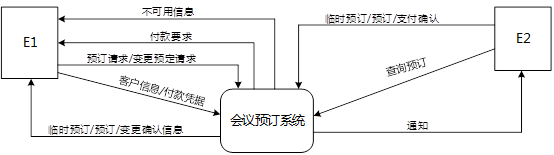
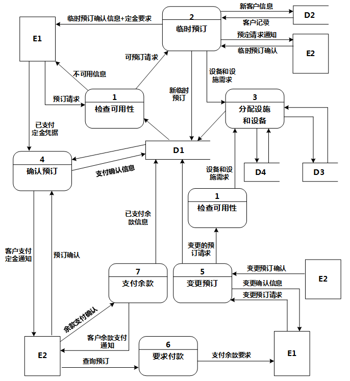
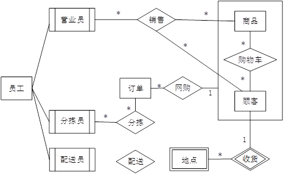
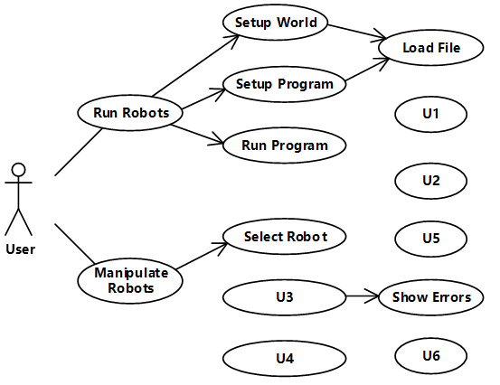
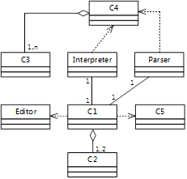
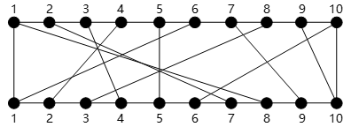
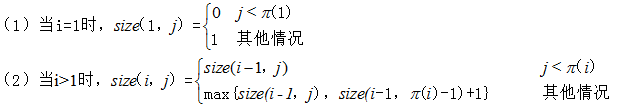
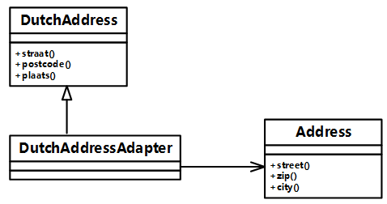

# 2016上半年案例题

- 来源标题: 2016年上半年软件设计师考试应用技术真题（专业解析+参考答案）
- 试卷介绍页: https://wangxiao.xisaiwang.com/tiku2/136/tp169494.html?cid=136
- 练习页: https://wangxiao.xisaiwang.com/tiku2/exam534903498.html
- 题量: 6

## 第1题（案例题）

阅读下列说明和图，回答问题1至问题4，将解答填入答题纸的对应栏内。
【说明】
某会议中心提供举办会议的场地设施和各种设备，供公司与各类组织机构租用。场地包括一个大型报告厅、一个小型报告厅以及诸多会议室。这些报告厅和会议室可提供的设备有投影仪、白板、视频播放/回放设备、计算机等。为了加强管理，该中心欲开发一会议预订系统，系统的主要功能如下。
（1）检查可用性。客户提交预订请求后，检查预订表，判定所申请的场地是否在申请日期内可用；如果不可用，返回不可用信息。
（2）临时预订。会议中心管理员收到客户预定请求的通知之后，提交确认。系统生成新临时预订存入预订表，并对新客户创建一条客户信息记录加以保存。根据客户记录给客户发送临时预订确认信息和支付定金要求。
（3）分配设施与设备。根据临时预订或变更预定的设备和设施需求，分配所需设备（均能满足用户要求）和设施，更新相应的表和预订表。
（4）确认预订。管理员收到客户支付定金的通知后，检查确认，更新预订表，根据客户记录给客户发送预订确认信息。
（5）变更预订。客户还可以在支付余款前提交变更预订请求，对变更的预订请求检查可用性，如果可用，分配设施和设备；如果不可用，返回不可用信息。管理员确认变更后，根据客户记录给客户发送确认信息。
（6）要求付款。管理员从预订表中查询距预订的会议时间两周内的预定，根据客户记录给满足条件的客户发送支付余款要求。
（7）支付余款。管理员收到客户余款支付的通知后，检查确认，更新预订表中的已支付余款信息。
现采用结构化方法对会议预定系统进行分析与设计，获得如图1-1所示的上下文数据流图和图1-2所示的0层数据流图（不完整）。

**图1-1 上下文数据流图**

**图1-2 0层数据流图**

### 补充题面

【问题1】（2分）
使用说明中的词语，给出图1-1中的实体E1～E2的名称。
【问题2】（4分）
使用说明中的词语，给出图1-2中的数据存储D1～D4的名称。
【问题3】（6分）
根据说明和图中术语，补充图1-2中缺失的数据流及其起点和终点。
【问题4】（3分）   
如果发送给客户的确认信息是通过Email系统向客户信息中的电子邮件地址进行发送的，那么需要对图1-1和1-2进行哪些修改？用150字以内文字加以说明。

## 第2题（案例题）

阅读下列说明，回答问题1至问题3，将解答填入答题纸的对应栏内。（共15分）
【说明】
某销售公司当前的销售业务为商城实体店销售。现该公司拟开展网络销售业务，需要开发一个信息化管理系统。请根据公司现有业务及需求完成该系统的数据库设计。
【需求描述】
（1）记录公司所有员工的信息。员工信息包括工号、身份证号、姓名、性别、出生日期和电话，并只登记一部电话。
（2）记录所有商品的信息。商品信息包括商品名称、生产厂家、销售价格和商品介绍。系统内部用商品条码唯一区别每种商品。
（3）记录所有顾客的信息。顾客信息包括顾客姓名、身份证号、登录名、登录密码、和电话号码。一位顾客只能提供一个电话号码。系统自动生成唯一的顾客编号。
（4）顾客登录系统之后，在网上商城购买商品。顾客可将选购的商品置入虚拟的购物车内，购物车可长期存放顾客选购的所有商品。顾客可在购物车内选择商品、修改商品数量后生成网购订单。订单生成后，由顾客选择系统提供的备选第三方支付平台进行电子支付，支付成功后系统需要记录唯一的支付凭证编号，然后由商城根据订单进行线下配送。
（5）所有的配送商品均由仓库统一出库。为方便顾客，允许每位顾客在系统中提供多组收货地址、收货人及联系电话。一份订单所含的多个商品可能由多名分拣员根据商品所在仓库信息从仓库中进行分拣操作，分拣后的商品交由配送员根据配送单上的收货地址进行配送。
（6）新设计的系统要求记录实体店的每笔销售信息，包括营业员、顾客、所售商品及其数量。
【概念模型设计】
根据需求阶段收集的信息，设计的实体联系图（不完整）如图所示。

【逻辑结构设计】
根据概念模型设计阶段完成的实体联系图，得出如下关系模式（不完整）：
员工（工号，身份证号，姓名，性别，出生日期，电话）
商品（商品条码，商品名称，生产厂家，销售价格，商品介绍， （a） ）
顾客（顾客编号，姓名，身份证号，登录名，登录密码，电话）
收货地点（收货ID，顾客编号，收货地址，收货人，联系电话）
购物车（顾客编号，商品条码，商品数量）
订单（订单ID，顾客编号，商品条码，商品数量， （b） ）
分拣（分拣ID，分拣员工号， （c） ，分拣时间）
配送（配送ID，分拣ID，配送员工号，收货ID，配送时间，签收时间，签收快照）
销售（销售ID，营业员工号，顾客编号，商品条码，商品数量）

### 补充题面

【问题1】（4分）
补充图中的“配送”联系所关联的对象及联系类型。  
【问题2】（6分）
补充逻辑结构设计中的（a）、（b）和（c）三处空缺。
【问题3】（5分）
对于实体店销售，若要增加送货上门服务，由营业员在系统中下订单，与网购的订单进行后续的统一管理。请根据该需求，对图进行补充，并修改订单关系模式。

## 第3题（案例题）

阅读下列说明和图，回答问题1至问题3，将解答填入答题纸的对应栏内。
【说明】
某软件公司欲设计实现一个虚拟世界仿真系统。系统中的虚拟世界用于模拟现实世界中的不同环境（由用户设置并创建），用户通过操作仿真系统中的1~2个机器人来探索虚拟世界。机器人维护着两个变量b1和b2，用来保存从虚拟世界中读取的字符。
该系统的主要功能描述如下：
（1）机器人探索虚拟世界（RunRobots）。用户使用编辑器（Editor）编写文件以设置想要模拟的环境，将文件导入系统（LoadFile）从而在仿真系统中建立虚拟世界（SetupWorld）。机器人在虚拟世界中的行为也在文件中进行定义，建立机器人的探索行为程序（SetupProgram）。机器人在虚拟世界中探索时（RunProgram），有2种运行模式：
①自动控制（Run）：事先编排好机器人的动作序列（指令（Instruction）），执行指令，使机器人可以连续动作。若干条指令构成机器人的指令集（InstructionSet）。
②单步控制（Step）：自动控制方式的一种特殊形式，只执行指定指令中的一个动作。
（2）手动控制机器人（ManipulateRobots）。选定1个机器人后（SelectRobot），可以采用手动方式控制它。手动控制有4种方式：
①Move：机器人朝着正前方移动一个交叉点。
②Left：机器人原地沿逆时针方向旋转90度。
③Read：机器人读取其所在位置的字符，并将这个字符的值赋给b1；如果这个位置上没有字符，则不改变b1的当前值。
④Write：将b1中的字符写入机器人当前所在的位置，如果这个位置上已经有字符，该字符的值将会被b1的值替代。如果这时b1没有值，即在执行Write动作之前没有执行过任何Read动作，那么需要提示用户相应的错误信息（ShowErrors）。
手动控制与单步控制的区别在于，单步控制时执行的是指令中的动作，只有一种控制方式，即执行下个动作；而手动控制时有4种动作。
现采用面向对象方法设计并实现该仿真系统，得到如图3-1所示的用例图和图3-2所示的初始类图。图3-2中的类“Interpreter”和“Parser”用于解析描述虚拟世界的文件以及机器人行为文件中的指令集。
    
**图3-1  用例图**

**图3-2 初始类图**

### 补充题面

【问题1】（6分）
根据说明中的描述，给出图3-1中U1～U6所对应的用例名。
【问题2】（4分）
图3-1中用例U1～U6分别与哪个（哪些）用例之间有关系，是何种关系？
【问题3】（5分）    
根据说明中的描述，给出图3-2中C1～C5所对应的类名。

## 第4题（案例题）

阅读下列说明和C代码，回答问题1至问题3，将解答写在答题纸的对应栏内。
【说明】
在一块电路板的上下两端分别有n个接线柱。根据电路设计，用(i,π(i))表示将上端接线柱i与下端接线柱π(i)相连，称其为该电路板上的第i条连线。如图4-1所示的π(i)排列为{8,7,4,2,5,1,9,3,10,6}。对于任何1≤i<j≤n，第i条连线和第j条连线相交的充要条件是π(i)>π(j)。
    
**图4-1 电路布线示意**
    在制作电路板时，要求将这n条连线分布到若干绝缘层上，在同一层上的连线不相交。现在要确定将哪些连线安排在一层上，使得该层上有尽可能多的连线，即确定连线集Nets={(i,π(i))，1≤i≤n}的最大不相交子集。
【分析问题】
    记N(i,j)={t|(t,π(t))∈Nets,t≤i,π(t)≤j}。N(i,j)的最大不相交子集为MNS(i,j)，size(i,j)=|MNS(i,j)|。
    经分析，该问题具有最优子结构性质。对规模为n的电路布线问题，可以构造如下递归式：
   
【C代码】
下面是算法的C语言实现。
（1）变量说明
size[i][j]：上下端分别有i个和j个接线柱的电路板的第一层最大不相交连接数
pi[i]： π(i)，下标从1开始
（2）C程序
#include "stdlib.h"
#include <stdio.h>
#define  N  10    /*问题规模*/
int m=0；    /*记录最大连接集合中的接线柱*/
void maxNum(int pi[],int size[N+1][N+1],int n)  {/*求最大不相交连接数*/
    int i, j;
    for(j=0; j < pi[1]; j++)   size[1][j] = 0;   /*当j<π(1)时  */
    for(j=pi[1];j<=n;j++)    （1）   ; /*当j>=π(1)时  */
    for(i=2; i < n; i++)   {
        for(j=0; j < pi[i]; j++)    （2）   ; /*当j<
π  [i]时  */
        for(j=pi[i];j<=n；j++)  {/*当j>=
π  [i]时,考虑两种情况*/
           size[i][j]=size[i-1][j]>=size[i-1][pi[i]-1]+1 ?size[i-1][j]:size[i-1][pi[i]-1]+1;
        }
    }
    /*最大连接数  */
    size[n][n]=size[n-1][n]>=size[n-1][pi[n]-1]+1 ? size[n-1][n]:size[n-1][pi[n]-1]+1;
}
/*构造最大不相交连接集合，net[i]表示最大不相交子集中第i条连线的上端接线柱的序号  */
void constructSet（int pi[],int size[N+1][N+1],int n,int net[n]）{
    int i,j=n;
    m=0；
    for(i=n ; i>1 ; i--)    {    /*从后往前*/
        if(size[i][j]!=size[i-1][j]){  /*(i,pi[i])是最大不相交子集的一条连线*/  
              （3）  ;    /*将i记录到数组net中，连接线数自增1*/
            j= pi[i]-1;    /*更新扩展连线柱区间*/
        }
    }
    if(j>=pi[1])  net[m++]=1;  /*当i=1时*/
}

### 补充题面

【问题1】（6分）
根据以上说明和C代码，填充C代码中的空（1）～（3）。
【问题2】（6分）    
根据题干说明和以上C代码，算法采用了  （4）  算法设计策略。      
函数maxNum和constructSet的时间复杂度分别为  （5）   和   （6）  （用O表示）。
【问题3】（3分）    
若连接排列为{8,7,4,2,5,1,9,3,10,6}，即如图4-1所示，则最大不相交连接数为   （7）   ，包含的连线为  （8）   （用(i,π(i))的形式给出）。

## 第5题（案例题）

阅读下列说明和C++代码，将应填入  （n）  处的字句写在答题纸的对应栏内。
【说明】    
某软件系统中，已设计并实现了用于显示地址信息的类Address（如图5-1所示），现要求提供基于Dutch语言的地址信息显示接口。为了实现该要求并考虑到以后可能还会出现新的语言的接口，决定采用适配器（Adapter）模式实现该要求，得到如图5-1所示的类图。

图5-1 适配器模式类图

### 补充题面

【C++代码】
#include <iostream>
using namespace std;
class Address{
public:
    void stree()    { /*  实现代码省略  */  }
    void zip()      { /*  实现代码省略  */  }
    void city()     { /*  实现代码省略  */  }
∥其他成员省略
};
class DutchAddress {
public:
    virtual void straat()=0;
    virtual void postcode()=0;
    virtual void plaats()=0;    
//其他成员省略
};
class DutchAddressAdapter : public DutchAddress {
private:         
       （1）   ;
public:
    DutchAddressAdapter(Address *addr) {
        address = addr;
    }
    void straat() {  
          （2） ;
    }
    void postcode(){
          （3） ;
    }
    void plaat(){   
         （4） ;
    }
//其他成员省略
};
void testDutch(DutchAddress *addr){
       addr->straat();
       addr->postcode();
       addr->plaats();
}
int main(){
    Address*addr = new Address();  
      （5）  ;                       
    cout<< "\n The DutchAddress\n"<< endl;
    testDutch(addrAdapter);
    return 0;
}

## 第6题（案例题）

阅读下列说明和Java代码，将应填入 （n） 处的字句写在答题纸的对应栏内。
【说明】
某软件系统中，已设计并实现了用于显示地址信息的类Address（如图6-1所示），现要求提供基于Dutch语言的地址信息显示接口。为了实现该要求并考虑到以后可能还会出现新的语言的接口，决定采用适配器（Adapter）模式实现该要求，得到如图6-1所示的类图。
 
图6-1 适配器模式类图

### 补充题面

【Java代码】
import java.util.*;
Class Address{
    public void street()   {    //实现代码省略   }
    public void zip()      {    //实现代码省略   }
    public void city()     {    //实现代码省略   }
//其他成员省略
};
class DutchAddress{
    public void straat()    {    //实现代码省略   }
    public void postcode()  {    //实现代码省略   }
    public void plaats()    {    //实现代码省略   }
//其他成员省略
};
class DutchAddressAdapter extends DutchAddress {
    private   （1）   ;
    public DutchAddressAdapter (Address addr){
        address= addr;
    }
    public void straat() {
          （2）   ; 
    }
    public void postcode() {
          （3）   ; 
    }
    public void plaats(){
         （4）   ; 
    }
//其他成员省略
};
class Test {
    public static void main(String[] args) {
        Address  addr= new Address();
          （5）   ; 
        System.out.println("\n The DutchAddress\n");
        testDutch(addrAdapter);
    }
    Static void  testDutch(DutchAddress addr){  
          addr.straat();
          addr.postcode();
          addr.plaats();
    }
}
