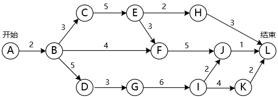
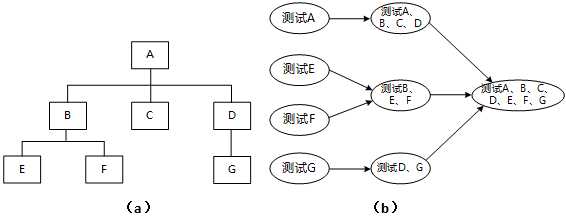
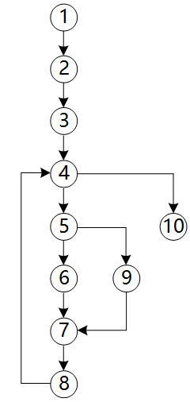
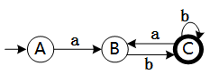
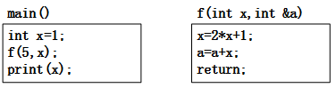
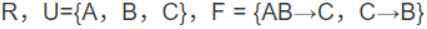
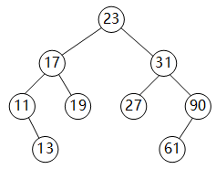
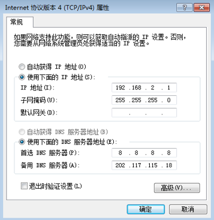
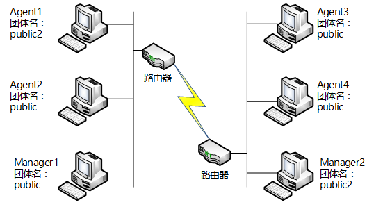

# 2016上半年选择题

- 来源标题: 2016年上半年软件设计师考试基础知识真题（专业解析+参考答案）
- 试卷介绍页: https://wangxiao.xisaiwang.com/tiku2/136/tp169493.html?cid=136
- 练习页: https://wangxiao.xisaiwang.com/tiku2/exam534903501.html
- 题量: 56

## 第1题（单选题）

VLIW是（  ）的简称。

- A. 复杂指令系统计算机
- B. 超大规模集成电路
- C. 单指令流多数据流
- D. 超长指令字

## 第2题（单选题）

主存与Cache的地址映射方式中，（  ）方式可以实现主存任意一块装入Cache中任意位置，只有装满才需要替换。

- A. 全相联
- B. 直接映射
- C. 组相联
- D. 串并联

## 第3题（单选题）

如果“2X”的补码是“90H”，那么X的真值是（  ）。

- A. 72
- B. -56
- C. 56
- D. 111

## 第4题（单选题）

移位指令中的（  ）指令的操作结果相当于对操作数进行乘2操作。

- A. 算术左移
- B. 逻辑右移
- C. 算术右移
- D. 带进位循环左移

## 第5题（单选题）

内存按字节编址，从A1000H到B13FFH的区域的存储容量为（  ）KB。

- A. 32
- B. 34
- C. 65
- D. 67

## 第6题（单选题）

以下关于总线的叙述中，不正确的是（  ）。

- A. 并行总线适合近距离高速数据传输
- B. 串行总线适合长距离数据传输
- C. 单总线结构在一个总线上适应不同种类的设备，设计简单且性能很高
- D. 专用总线在设计上可以与连接设备实现最佳匹配

## 第7题（单选题）

以下关于网络层次与主要设备对应关系的叙述中，配对正确的是（  ）。

- A. 网络层——集线器
- B. 数据链路层——网桥
- C. 传输层——路由器
- D. 会话层——防火墙

## 第8题（单选题）

传输经过SSL加密的网页所采用的协议是（  ）。

- A. HTTP
- B. HTTPS
- C. S-HTTP
- D. HTTP-S

## 第9题（单选题）

为了攻击远程主机，通常利用（  ）技术检测远程主机状态。

- A. 病毒查杀
- B. 端口扫描
- C. QQ聊天
- D. 身份认证

## 第10题（单选题）

某软件公司参与开发管理系统软件的程序员张某，辞职到另一公司任职，于是该项目负责人将该管理系统软件上开发者的署名更改为李某（接张某工作）。该项目负责人的行为（  ）。

- A. 侵犯了张某开发者身份权（署名权）
- B. 不构成侵权，因为程序员张某不是软件著作权人
- C. 只是行使管理者的权利，不构成侵权
- D. 不构成侵权，因为程序员张某现已不是项目组成员

## 第11题（单选题）

美国某公司与中国某企业谈技术合作，合同约定使用1项美国专利（获得批准并在有效期内），该项技术未在中国和其他国家申请专利。依照该专利生产的产品（  ）需要向美国公司支付这件美国专利的许可使用费。

- A. 在中国销售，中国企业
- B. 如果返销美国，中国企业不
- C. 在其他国家销售，中国企业
- D. 在中国销售，中国企业不

## 第12题（单选题）

以下媒体文件格式中，（  ）是视频文件格式。

- A. WAV
- B. BMP
- C. MP3
- D. MOV

## 第13题（单选题）

以下软件产品中，属于图像编辑处理工具的软件是（  ）。

- A. Powerpoint
- B. Photoshop
- C. Premiere
- D. Acrobat

## 第14题（单选题）

使用150DPI的扫描分辨率扫描一幅3×4英寸的彩色照片，得到原始的24位真彩色图像的数据量是（  ）Byte。

- A. 1800
- B. 90000
- C. 270000
- D. 810000

## 第15题（单选题）

某软件项目的活动图如下图所示，其中顶点表示项目里程碑，连接顶点的边表示包含的活动，边上的数字表示活动的持续时间（天），则完成该项目的最少时间为（  ）天。活动BD最多可以晚开始（  ）天而不会影响整个项目的进度。
 

### 问题1
- A. 15
- B. 21
- C. 22
- D. 24
### 问题2
- A. 0
- B. 2
- C. 3
- D. 5

## 第16题（单选题）

在结构化分析中，用数据流图描述（  ）。当采用数据流图对一个图书馆管理系统进行分析时，（  ）是一个外部实体。

### 问题1
- A. 数据对象之间的关系，用于对数据建模
- B. 数据在系统中如何被传送或变换，以及如何对数据流进行变换的功能或子功能，用于对功能建模
- C. 系统对外部事件如何响应，如何动作，用于对行为建模
- D. 数据流图中的各个组成部分
### 问题2
- A. 读者
- B. 图书
- C. 借书证
- D. 借阅

## 第17题（单选题）

软件开发过程中，需求分析阶段的输出不包括（  ）。

- A. 数据流图
- B. 实体联系图
- C. 数据字典
- D. 软件体系结构图

## 第18题（单选题）

以下关于高级程序设计语言实现的编译和解释方式的叙述中，正确的是（  ）。

- A. 编译程序不参与用户程序的运行控制，而解释程序则参与
- B. 编译程序可以用高级语言编写，而解释程序只能用汇编语言编写
- C. 编译方式处理源程序时不进行优化，而解释方式则进行优化
- D. 编译方式不生成源程序的目标程序，而解释方式则生成

## 第19题（单选题）

以下关于脚本语言的叙述中，正确的是（  ）。

- A. 脚本语言是通用的程序设计语言
- B. 脚本语言更适合应用在系统级程序开发中
- C. 脚本语言主要采用解释方式实现
- D. 脚本语言中不能定义函数和调用函数

## 第20题（单选题）

将高级语言源程序先转化为一种中间代码是现代编译器的常见处理方式。常用的中间代码有后缀式、（  ）、树等。

- A. 前缀码
- B. 三地址码
- C. 符号表
- D. 补码和移码

## 第21题（单选题）

当用户通过键盘或鼠标进入某应用系统时，通常最先获得键盘或鼠标输入信息的是（  ）程序。

- A. 命令解释
- B. 中断处理
- C. 用户登录
- D. 系统调用

## 第22题（单选题）

在Windows操作系统中，当用户双击“IMG_20160122_103.jpg”文件名时，系统会自动通过建立的（  ）来决定使用什么程序打开该图像文件。

- A. 文件
- B. 文件关联
- C. 文件目录
- D. 临时文件

## 第23题（单选题）

某磁盘有100个磁道，磁头从一个磁道移至另一个磁道需要6ms。文件在磁盘上非连续存放，逻辑上相邻数据块的平均距离为10个磁道，每块的旋转延迟时间及传输时间分别为100ms和20ms，则读取一个100块的文件需要（  ）ms。

- A. 12060
- B. 12600
- C. 18000
- D. 186000

## 第24题（单选题）

进程P1、P2、P3、P4和P5的前趋图如下图所示：
 
 若用PV操作控制进程P1、P2、P3、P4和P5并发执行的过程，则需要设置5个信号S1、S2、S3、S4和S5，且信号量S1～S5的初值都等于零。下图中a和b处应分别填（  ）；c和d处应分别填写（  ）；e和f处应分别填写（  ）。
 

### 问题1
- A. V（S1）P（S2）和V（S3）
- B. P（S1）V（S2）和V（S3）
- C. V（S1）V（S2）和V（S3）
- D. P（S1）P（S2）和V（S3）
### 问题2
- A. P（S2）和P（S4）
- B. P（S2）和V（S4）
- C. V（S2）和P（S4）
- D. V（S2）和V（S4）
### 问题3
- A. P（S4）和V（S4）V（S5）
- B. V（S5）和P（S4）P（S5）
- C. V（S3）和V（S4）V（S5）
- D. P（S3）和P（S4）V（P5）

## 第25题（单选题）

如下图所示，模块A和模块B都访问相同的全局变量和数据结构，则这两个模块之间的耦合类型为（  ）耦合。
 

- A. 公共
- B. 控制
- C. 标记
- D. 数据

## 第26题（单选题）

以下关于增量开发模型的叙述中，不正确的是（  ）。

- A. 不必等到整个系统开发完成就可以使用
- B. 可以使用较早的增量构件作为原型，从而获得稍后的增量构件需求
- C. 优先级最高的服务先交付，这样最重要的服务接受最多的测试
- D. 有利于进行好的模块划分

## 第27题（单选题）

在设计软件的模块结构时，（  ）不能改进设计质量。

- A. 模块的作用范围应在其控制范围之内
- B. 模块的大小适中
- C. 避免或减少使用病态连接（从中部进入或访问一个模块）
- D. 模块的功能越单纯越好

## 第28题（单选题）

软件体系结构的各种风格中，仓库风格包含一个数据仓库和若干个其他构件。数据仓库位于该体系结构的中心，其他构件访问该数据仓库并对其中的数据进行增、删、改等操作。以下关于该风格的叙述中，不正确的是（  ）。（  ）不属于仓库风格。

### 问题1
- A. 支持可更改性和可维护性
- B. 具有可复用的知识源
- C. 支持容错性和健壮性
- D. 测试简单
### 问题2
- A. 数据库系统
- B. 超文本系统
- C. 黑板系统
- D. 编译器

## 第29题（单选题）

下图（a）所示为一个模块层次结构的例子，图（b）所示为对其进行集成测试的顺序，则此测试采用了（  ）测试策略。该测试策略的优点不包括（  ）。

### 问题1
- A. 自底向上
- B. 自顶向下
- C. 三明治
- D. 一次性
### 问题2
- A. 较早地验证了主要的控制和判断点
- B. 较早地验证了底层模块
- C. 测试的并行程度较高
- D. 较少的驱动模块和桩模块的编写工作量

## 第30题（单选题）

采用McCabe度量法计算下图所示程序的环路复杂性为（  ）。

- A. 1
- B. 2
- C. 3
- D. 4

## 第31题（单选题）

在面向对象方法中，（  ）是父类和子类之间共享数据和方法的机制。子类在原有父类接口的基础上，用适合于自己要求的实现去置换父类中的相应实现称为（  ）。

### 问题1
- A. 封装
- B. 继承
- C. 覆盖
- D. 多态
### 问题2
- A. 封装
- B. 继承
- C. 覆盖
- D. 多态

## 第32题（单选题）

在UML用例图中，参与者表示（  ）。

- A. 人、硬件或其他系统可以扮演的角色
- B. 可以完成多种动作的相同用户
- C. 不管角色的实际物理用户
- D. 带接口的物理系统或者硬件设计

## 第33题（单选题）

UML中关联是一个结构关系，描述了一组链。两个类之间（  ）关联。

- A. 不能有多个
- B. 可以有多个由不同角色标识的
- C. 可以有任意多个
- D. 多个关联必须聚合成一个

## 第34题（单选题）

如下所示的UML图是（  ），图中（Ⅰ）表示（  ），（Ⅱ）表示（  ）。

### 问题1
- A. 序列图
- B. 状态图
- C. 通信图
- D. 活动图
### 问题2
- A. 合并分叉
- B. 分支
- C. 合并汇合
- D. 流
### 问题3
- A. 分支条件
- B. 监护表达式
- C. 动作名
- D. 流名称

## 第35题（单选题）

为图形用户界面（GUI）组件定义不同平台的并行类层次结构，适合采用（  ）模式。

- A. 享元（Flyweight）
- B. 抽象工厂（Abstract Factory）
- C. 外观（Facade））
- D. 装饰器（Decorator）

## 第36题（单选题）

（  ）设计模式将一个请求封装为一个对象，从而使得可以用不同的请求对客户进行参数化，对请求排队或记录请求日志，以及支持可撤销的操作。

- A. 命令（Command）
- B. 责任链（Chain of Responsibility）
- C. 观察者（Observer）
- D. 策略（Strategy）

## 第37题（单选题）

（  ）设计模式最适合用于发布/订阅消息模型，即当订阅者注册一个主题后，此主题有新消息到来时订阅者就会收到通知。

- A. 适配器（Adapter）
- B. 通知（Notifier）
- C. 观察者（Observer）
- D. 状态（State）

## 第38题（单选题）

因使用大量的对象而造成很大的存储开销时，适合采用（  ）模式进行对象共享，以减少对象数量从而达到较少的内存占用并提升性能。

- A. 组合（Composite）
- B. 享元（Flyweight）
- C. 迭代器（Iterator）
- D. 备忘录（Memento）

## 第39题（单选题）

移进-归约分析法是编译程序（或解释程序）对高级语言源程序进行语法分析的一种方法，属于（  ）的语法分析方法。

- A. 自顶向下（或自上而下）
- B. 自底向上（或自下而上）
- C. 自左向右
- D. 自右向左

## 第40题（单选题）

某确定的有限自动机（DFA）的状态转换图如下图所示（A是初态，C是终态），则该DFA能识别（  ）。
 

- A. aabb
- B. abab
- C. baba
- D. abba

## 第41题（单选题）

函数main()、f()的定义如下所示，调用函数f()时，第一个参数采用传值（call by value）方式，第二个参数采用传引用（call by reference）方式，main函数中“print(x)”执行后输出的值为（  ）。
 

- A. 1
- B. 6
- C. 11
- D. 12

## 第42题（单选题）

数据的物理独立性和逻辑独立性分别是通过修改（  ）来完成的。

- A. 外模式与内模式之间的映像、模式与内模式之间的映像
- B. 外模式与内模式之间的映像、外模式与模式之间的映像
- C. 外模式与模式之间的映像、模式与内模式之间的映像
- D. 模式与内模式之间的映像、外模式与模式之间的映像

## 第43题（单选题）

关系规范化在数据库设计的（  ）阶段进行。

- A. 需求分析
- B. 概念设计
- C. 逻辑设计
- D. 物理设计

## 第44题（单选题）

若给定的关系模式为，则关系R（ ）。

- A. 有2个候选关键字AC和BC，并且有3个主属性
- B. 有2个候选关键字AC和AB，并且有3个主属性
- C. 只有一个候选关键字AC，并且有1个非主属性和2个主属性
- D. 只有一个候选关键字AB，并且有1个非主属性和2个主属性

## 第45题（单选题）

某公司数据库中的元件关系模式为P（元件号，元件名称，供应商，供应商所在地，库存量），函数依赖集F如下所示：
F={元件号→元件名称，（元件号，供应商）→库存量，供应商→供应商所在地}
元件关系的主键为（  ），该关系存在冗余以及插入异常和删除异常等问题。为了解决这一问题需要将元件关系分解为（  ），分解后的关系模式可以达到（  ）。

### 问题1
- A. 元件号，元件名称
- B. 元件号，供应商
- C. 元件号，供应商所在地
- D. 供应商，供应商所在地
### 问题2
- A. 元件1（元件号，元件名称，库存量）、元件2（供应商，供应商所在地）
- B. 元件1（元件号，元件名称）、元件2（供应商，供应商所在地，库存量）
- C. 元件1（元件号，元件名称）、元件2（元件号，供应商，库存量）、元件3（供应商，供应商所在地）
- D. 元件1（元件号，元件名称）、元件2（元件号，库存量）、元件3（供应商，供应商所在地）、元件4（供应商所在地，库存量）
### 问题3
- A. 1NF
- B. 2NF
- C. 3NF
- D. 4NF

## 第46题（单选题）

若元素以a，b，c，d，e的顺序进入一个初始为空的栈中，每个元素进栈、出栈各1次，要求出栈的第一个元素为d，则合法的出栈序列共有（  ）种。

- A. 4
- B. 5
- C. 6
- D. 24

## 第47题（单选题）

设有二叉排序树（或二叉查找树）如下图所示，建立该二叉树的关键码序列不可能是（  ）。
 

- A. 23 31 17 19 11 27 13 90 61
- B. 23 17 19 31 27 90 61 11 13
- C. 23 17 27 19 31 13 11 90 61
- D. 23 31 90 61 27 17 19 11 13

## 第48题（单选题）

若一棵二叉树的高度（即层数）为h，则该二叉树（  ）。

- A. 有2h个节点
- B. 有2h-1个节点
- C. 最少有2h-1个节点
- D. 最多有2h-1个节点

## 第49题（单选题）

在13个元素构成的有序表A[1..13]中进行折半查找（或称为二分查找，向下取整）。那么以下叙述中，错误的是（  ）。

- A. 无论要查找哪个元素，都是先与A[7]进行比较
- B. 若要查找的元素等于A[9]，则分别需与A[7]、A[11]、A[9]进行比较
- C. 无论要查找的元素是否在A[]中，最多与表中的4个元素比较即可
- D. 若待查找的元素不在A[]中，最少需要与表中的3个元素进行比较

## 第50题（单选题）

以下关于图的遍历的叙述中，正确的是（  ）。

- A. 图的遍历是从给定的源点出发对每一个顶点仅访问一次的过程
- B. 图的深度优先遍历方法不适用于无向图
- C. 使用队列对图进行广度优先遍历
- D. 图中有回路时则无法进行遍历

## 第51题（单选题）

考虑一个背包问题，共有n=5个物品，背包容量为W=10，物品的重量和价值分别为：w={2，2，6，5，4}，v={6, 3，5，4，6}，求背包问题的最大装包价值。若此为0-1背包问题，分析该问题具有最优子结构，定义递归式为

其中c（i，j）表示i个物品、容量为j的0-1背包问题的最大装包价值，最终要求解c（n,W）。
采用自底向上的动态规划方法求解，得到最大装包价值为（ ），算法的时间复杂度为（ ）。
若此为部分背包问题，首先采用归并排序算法，根据物品的单位重量价值从大到小排序，然后依次将物品放入背包直至所有物品放入背包中或者背包再无容量，则得到的最大装包价值为（ ），算法的时间复杂度为（ ）。

### 问题1
- A. 11
- B. 14
- C. 15
- D. 16.67
### 问题2
- A. Θ(nW)
- B. Θ(nlgn)
- C. Θ(n2)
- D. Θ(nlgnW)
### 问题3
- A. 11
- B. 14
- C. 15
- D. 16.67
### 问题4
- A. Θ(nW)
- B. Θ(nlgn)
- C. Θ(n2)
- D. Θ(nlgnW)

## 第52题（单选题）

默认情况下，FTP服务器的控制端口为（  ），上传文件时的端口为（  ）。

### 问题1
- A. 大于1024的端口
- B. 20
- C. 80
- D. 21
### 问题2
- A. 大于1024的端口
- B. 20
- C. 80
- D. 21

## 第53题（单选题）

使用ping命令可以进行网络检测，在进行一系列检测时，按照由近及远原则，首先执行的是（  ）。

- A. ping默认网关
- B. ping本地IP
- C. ping127.0.0.1
- D. ping远程主机

## 第54题（单选题）

某PC的Internet协议属性参数如下图所示，默认网关的IP地址是（  ）。 

- A. 8.8.8.8
- B. 202.117.115.3
- C. 192.168.2.254
- D. 202.117.115.18

## 第55题（单选题）

在下图的SNMP配置中，能够响应Manager2的getRequest请求的是（  ）。

- A. Agent1
- B. Agent2
- C. Agent3
- D. Agent4

## 第56题（单选题）

In the fields of physical security and information security, access control is the selective restriction of access to a place or other resource. The act of accessing may mean consuming, entering, or using. Permission to access a resource is called authorization（授权）．
An access control mechanism（1）between a user (or a process executing on behalf of a user) and system resources, such as applications, operating systems, firewalls, routers, files, and databases. The system must first authenticate（验证）a user seeking access. Typically the authentication function determines whether the user is（2）to access the system at all. Then the access control function determines if the specific requested access by this user is permitted. A security administrator maintains an authorization database that specifies what type of access to which resources is allowed for this user. The access control function consults this database to determine whether to（3）access. An auditing function monitors and keeps a record of user accesses to system resources.
In practice, a number of（4）may cooperatively share the access control function. All operating systems have at least a rudimentary（基本的）, and in many cases a quite robust, access control component. Add-on security packages can add to the（5）access control capabilities of the OS. Particular applications or utilities, such as a database management system, also incorporate access control functions. External devices, such as firewalls, can also provide access control services.

### 问题1
- A. cooperates
- B. coordinates
- C. connects
- D. mediates
### 问题2
- A. denied
- B. permitted
- C. prohibited
- D. rejected
### 问题3
- A. open
- B. monitor
- C. grant
- D. seek
### 问题4
- A. components
- B. users
- C. mechanisms
- D. algorithms
### 问题5
- A. remote
- B. native
- C. controlled
- D. automated
