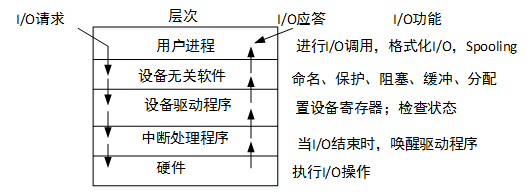
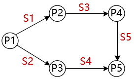
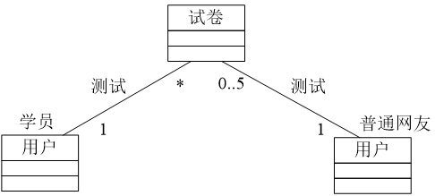
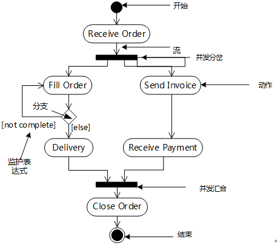
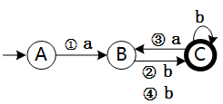
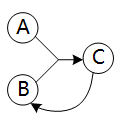
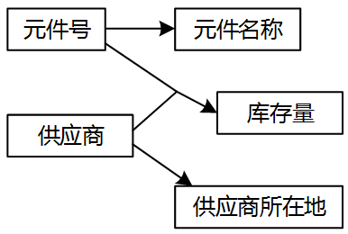

# 2016上半年选择题

- 来源标题: 2016年上半年软件设计师考试基础知识真题（专业解析+参考答案）
- 试卷介绍页: https://wangxiao.xisaiwang.com/tiku2/136/tp169493.html?cid=136
- 练习页: https://wangxiao.xisaiwang.com/tiku2/exam534904570.html
- 题量: 56

## 第1题（单选题）

VLIW是（D）的简称。

- A. 复杂指令系统计算机
- B. 超大规模集成电路
- C. 单指令流多数据流
- D. 超长指令字

### 正确答案

D

### 解析

VLIW：（Very Long Instruction Word，超长指令字）一种非常长的指令组合，它把许多条指令连在一起，增加了运算的速度。

## 第2题（单选题）

主存与Cache的地址映射方式中，（A）方式可以实现主存任意一块装入Cache中任意位置，只有装满才需要替换。

- A. 全相联
- B. 直接映射
- C. 组相联
- D. 串并联

### 正确答案

A

### 解析

（1）直接相联映射方式。
 这是一种最简单而又直接的映射方法，指主存中每个块只能映射到Cache的一个特定的块。在该方法中，Cache块地址j和主存块地址i的关系为：
   j= i mod Cb
 其中Cb是Cache的块数。这样，整个Cache地址与主存地址的低位部分完全相同。
 直接映射法的优点是所需硬件简单，只需要容量较小的按地址访问的区号标志表存储器和少量比较电路；缺点是Cache块冲突概率较高，只要有两个或两个以上经常使用的块恰好被映射到Cache中的同一个块位置时，就会使Cache命中率急剧下降。
 （2）全相联映射方式。
 全相联映射是指主存中任意一块都可以映射到Cache中任意一块的方式，也就是说，当主存中的一块需调入Cache时，可根据当时Cache的块占用或分配情况，选择一个块给主存块存储，所选的Cache块可以是Cache中的任意一块。这种映射方式允许主存的每一块信息可以存到Cache的任何一个块空间，也允许从已被占满的Cache中替换掉任何一块信息。全相联映射的优点是块冲突概率低；其缺点是访问速度慢，并且成本太高。
 （3）组相联映射方式。
 这种方式是前两种方式的折中方案。这种映射方式在组间是直接映射，而组内是全相联映射，其性能和复杂性介于直接映射和全相联映射之间。
 本题选择A选项。

## 第3题（单选题）

如果“2X”的补码是“90H”，那么X的真值是（B）。

- A. 72
- B. -56
- C. 56
- D. 111

### 正确答案

B

### 解析

90H 即为二进制的：10010000。补码最高位为符号位，1表示负号，所以说明此数为负数，其反码为补码减1：1000 1111，其原码为反码除符号位皆取反：1111 0000，即－112，2X=－112，所以X=-56。

## 第4题（单选题）

移位指令中的（A）指令的操作结果相当于对操作数进行乘2操作。

- A. 算术左移
- B. 逻辑右移
- C. 算术右移
- D. 带进位循环左移

### 正确答案

A

### 解析

移位运算符就是在二进制的基础上对数字进行平移。按照平移的方向和填充数字的规则分为三种：左移、带符号右移、无符号右移。而算术左移、算术右移和逻辑右移的规则与上述移位运算符一一对应。在数字没有溢出的前提下，对于正数和负数，算术左移，即左移一位都相当于乘以2的1次方，左移n位就相当于乘以2的n次方。

## 第5题（单选题）

内存按字节编址，从A1000H到B13FFH的区域的存储容量为（C）KB。

- A. 32
- B. 34
- C. 65
- D. 67

### 正确答案

C

### 解析

题干指出本题为按字节编址，因此每个存储单元对应1B容量。
而地址范围内的存储单元个数为：（B13FF-A1000H+1）/1024=65K。（注意单位转换为K）
对应存储容量为65KB。

## 第6题（单选题）

以下关于总线的叙述中，不正确的是（C）。

- A. 并行总线适合近距离高速数据传输
- B. 串行总线适合长距离数据传输
- C. 单总线结构在一个总线上适应不同种类的设备，设计简单且性能很高
- D. 专用总线在设计上可以与连接设备实现最佳匹配

### 正确答案

C

### 解析

在单总线结构中，CPU与主存之间、CPU与I/O设备之间、I/O设备与主存之间、各种设备之间都通过系统总线交换信息。单总线结构的优点是控制简单方便，扩充方便。但由于所有设备部件均挂在单一总线上，使这种结构只能分时工作，即同一时刻只能在两个设备之间传送数据，这就使系统总体数据传输的效率和速度受到限制，这是单总线结构的主要缺点。

## 第7题（单选题）

以下关于网络层次与主要设备对应关系的叙述中，配对正确的是（B）。

- A. 网络层——集线器
- B. 数据链路层——网桥
- C. 传输层——路由器
- D. 会话层——防火墙

### 正确答案

B

### 解析

站点未提供标准答案/解析

## 第8题（单选题）

传输经过SSL加密的网页所采用的协议是（B）。

- A. HTTP
- B. HTTPS
- C. S-HTTP
- D. HTTP-S

### 正确答案

B

### 解析

本题考查的是网络安全协议。
A、
HTTP（Hypertext Transfer Protocol）是一种应用层协议，用于在网络中传输超文本（例如网页）。它被设计为无状态的，意味着服务器不会为每个请求保持状态。A错误。
B、
HTTPS（Hypertext Transfer Protocol Secure）是一种安全超文本传输协议，是HTTP的安全版，即HTTP下加入SSL层，HTTPS的安全基础是SSL，因此加密的网页传输所采用的协议是HTTPS。B正确。
C、
S-HTTP（Secure Hypertext Transfer
Protocol）是安全超文本传输协议，它是一个在HTTP基础上增加安全传输层协议（TLS）或安全套接字层协议（SSL）作为HTTP应用层子层的扩展协议。S-HTTP的主要目的是在互联网上进行文件的安全交换，它允许在客户端和服务器之间进行安全的通信。C错误。
D、
HTTP-S（HTTP Secure）和HTTPS（Hypertext Transfer Protocol
Secure）是同一种协议，都是指HTTP协议结合SSL/TLS协议来实现安全通信。它们是HTTP协议的安全版，在HTTP的基础上通过使用SSL/TLS协议进行数据的安全传输。D错误。
综上所述，本题选B。

## 第9题（单选题）

为了攻击远程主机，通常利用（B）技术检测远程主机状态。

- A. 病毒查杀
- B. 端口扫描
- C. QQ聊天
- D. 身份认证

### 正确答案

B

### 解析

端口扫描器通过选用远程 TCP/IP不同的端口的服务，并记录目标给予的回答，通过这种方法，可以搜集到很多关于目标主机的各种有用的信息。

## 第10题（单选题）

某软件公司参与开发管理系统软件的程序员张某，辞职到另一公司任职，于是该项目负责人将该管理系统软件上开发者的署名更改为李某（接张某工作）。该项目负责人的行为（A）。

- A. 侵犯了张某开发者身份权（署名权）
- B. 不构成侵权，因为程序员张某不是软件著作权人
- C. 只是行使管理者的权利，不构成侵权
- D. 不构成侵权，因为程序员张某现已不是项目组成员

### 正确答案

A

### 解析

根据《中华人民共和国著作权法》第9条和《计算机软件保护条例》第8条的规定，软件著作权人享有发表权和开发者身份权，这两项权利与著作权人的人身是不可分离的主体。其中，开发者的身份权，不随软件开发者的消亡而丧失，且无时间限制。张某参加某软件公司开发管理系统软件的工作，属于职务行为，该管理系统软件的著作权归属公司所有，但张某拥有该管理系统软件的署名权。而该项目负责人将作为软件系统开发者之一的张某的署名更改为他人，根据《计算机软件保护条例》第23条第4款的规定，项目负责人的行为侵犯了张某的开发者身份权及署名权。

## 第11题（单选题）

美国某公司与中国某企业谈技术合作，合同约定使用1项美国专利（获得批准并在有效期内），该项技术未在中国和其他国家申请专利。依照该专利生产的产品（D）需要向美国公司支付这件美国专利的许可使用费。

- A. 在中国销售，中国企业
- B. 如果返销美国，中国企业不
- C. 在其他国家销售，中国企业
- D. 在中国销售，中国企业不

### 正确答案

D

### 解析

在中国不享有专利权，因此，不能禁止他人在中国 制造、使用、销售、进口、许诺销售。

## 第12题（单选题）

以下媒体文件格式中，（D）是视频文件格式。

- A. WAV
- B. BMP
- C. MP3
- D. MOV

### 正确答案

D

### 解析

WAV为微软公司（Microsoft）开发的一种声音文件格式，它符合RIFF（Resource Interchange File Format）文件规范，用于保存Windows平台的音频信息资源，被Windows平台及其应用程序所广泛支持，该格式也支持MSADPCM，CCITT A LAW等多种压缩运算法，支持多种音频数字，取样频率和声道，标准格式化的WAV文件和CD格式一样，也是44.1K的取样频率，16位量化数字，因此在声音文件质量和CD相差无几。
 BMP（全称Bitmap）是Windows操作系统中的标准图像文件格式，可以分成两类：设备相关位图（DDB）和设备无关位图（DIB），使用非常广。它采用位映射存储格式，除了图像深度可选以外，不采用其他任何压缩，因此，BMP文件所占用的空间很大。
 MP3是一种音频压缩技术,其全称是动态影像专家压缩标准音频层面3（Moving Picture Experts Group Audio Layer III），简称为MP3。
 MOV即QuickTime影片格式，它是Apple公司开发的一种音频、视频文件格式，用于存储常用数字媒体类型。

## 第13题（单选题）

以下软件产品中，属于图像编辑处理工具的软件是（B）。

- A. Powerpoint
- B. Photoshop
- C. Premiere
- D. Acrobat

### 正确答案

B

### 解析

Microsoft Office PowerPoint，是微软公司的演示文稿软件。用户可以在投影仪或者计算机上进行演示，也可以将演示文稿打印出来，制作成胶片，以便应用到更广泛的领域中。利用Microsoft Office PowerPoint不仅可以创建演示文稿，还可以在互联网上召开面对面会议、远程会议或在网上给观众展示演示文稿。  
 Adobe Photoshop，简称“PS”，是由Adobe Systems开发和发行的图像处理软件。Photoshop主要处理以像素所构成的数字图像。使用其众多的编修与绘图工具，可以有效地进行图片编辑工作。    
Adobe Premiere是一款常用的视频编辑软件，由Adobe公司推出。现在常用的有CS4、CS5、CS6、CC、CC 2014及CC 2015版本。是一款编辑画面质量比较好的软件，有较好的兼容性，且可以与Adobe公司推出的其他软件相互协作。目前这款软件广泛应用于广告制作和电视节目制作中。 
 Adobe Acrobat 是由Adobe公司开发的一款PDF（Portable Document Format，便携式文档格式）编辑软件，借助它，您可以以PDF格式制作和保存你的文档 ，以便于浏览和打印，或使用更高级的功能。

## 第14题（单选题）

使用150DPI的扫描分辨率扫描一幅3×4英寸的彩色照片，得到原始的24位真彩色图像的数据量是（D）Byte。

- A. 1800
- B. 90000
- C. 270000
- D. 810000

### 正确答案

D

### 解析

150DPI的扫描分辨率表示每英寸的像素为150个，所以有：
3×4×150×150×24/8=810000。

## 第15题（单选题）

某软件项目的活动图如下图所示，其中顶点表示项目里程碑，连接顶点的边表示包含的活动，边上的数字表示活动的持续时间（天），则完成该项目的最少时间为（C/A）天。活动BD最多可以晚开始（  ）天而不会影响整个项目的进度。
 

### 问题1
- A. 15
- B. 21
- C. 22
- D. 24
### 问题2
- A. 0
- B. 2
- C. 3
- D. 5

### 正确答案

C、A

### 解析

本题中，关键路径为：ABDGIKL，其长度为22，所以最短工期22天。
BD是关键路径上的活动，其总时差为0，不能被耽误，有任何延误，都会影响总工期，所以BD最多延误0天不会影响总工期。

## 第16题（单选题）

在结构化分析中，用数据流图描述（B/A）。当采用数据流图对一个图书馆管理系统进行分析时，（  ）是一个外部实体。

### 问题1
- A. 数据对象之间的关系，用于对数据建模
- B. 数据在系统中如何被传送或变换，以及如何对数据流进行变换的功能或子功能，用于对功能建模
- C. 系统对外部事件如何响应，如何动作，用于对行为建模
- D. 数据流图中的各个组成部分
### 问题2
- A. 读者
- B. 图书
- C. 借书证
- D. 借阅

### 正确答案

B、A

### 解析

数据流图用来记录系统中的数据和数据在特定的过程中的流动，即数据如何被采集、处理、保存和使用的（围绕信息系统的功能）。外部实体指系统之外又与系统有联系的人或事物。它表达了该系统数据的外部来源和去处。

## 第17题（单选题）

软件开发过程中，需求分析阶段的输出不包括（D）。

- A. 数据流图
- B. 实体联系图
- C. 数据字典
- D. 软件体系结构图

### 正确答案

D

### 解析

其他三项均为需求分析阶段确定。软件体系结构图是设计阶段的产物。

## 第18题（单选题）

以下关于高级程序设计语言实现的编译和解释方式的叙述中，正确的是（A）。

- A. 编译程序不参与用户程序的运行控制，而解释程序则参与
- B. 编译程序可以用高级语言编写，而解释程序只能用汇编语言编写
- C. 编译方式处理源程序时不进行优化，而解释方式则进行优化
- D. 编译方式不生成源程序的目标程序，而解释方式则生成

### 正确答案

A

### 解析

编译程序的功能是把用高级语言书写的源程序翻译成与之等价的目标程序。编译过程划分成词法分析、语法分析、语义分析、中间代码生成、代码优化和目标代码生成6个阶段。目标程序可以独立于源程序运行。
 解释程序是一种语言处理程序，在词法、语法和语义分析方面与编译程序的工作原理基本相同，但在运行用户程序时，它是直接执行源程序或源程序的内部形式（中间代码）。因此，解释程序并不产生目标程序，这是它和编译程序的主要区别。

## 第19题（单选题）

以下关于脚本语言的叙述中，正确的是（C）。

- A. 脚本语言是通用的程序设计语言
- B. 脚本语言更适合应用在系统级程序开发中
- C. 脚本语言主要采用解释方式实现
- D. 脚本语言中不能定义函数和调用函数

### 正确答案

C

### 解析

脚本语言（Script languages,scripting programming languages,scripting languages）是为了缩短传统的编写-编译-链接-运行（edit-compile-link-run）过程而创建的计算机编程语言。此命名起源于一个脚本“screenplay”，每次运行都会使对话框逐字重复。早期的脚本语言经常被称为批处理语言或工作控制语言。一个脚本通常是解释运行而非编译。

## 第20题（单选题）

将高级语言源程序先转化为一种中间代码是现代编译器的常见处理方式。常用的中间代码有后缀式、（B）、树等。

- A. 前缀码
- B. 三地址码
- C. 符号表
- D. 补码和移码

### 正确答案

B

### 解析

中间代码的表达形式有语法树，后缀式，三地址代码。

## 第21题（单选题）

当用户通过键盘或鼠标进入某应用系统时，通常最先获得键盘或鼠标输入信息的是（B）程序。

- A. 命令解释
- B. 中断处理
- C. 用户登录
- D. 系统调用

### 正确答案

B

### 解析

当硬件执行I/O操作后，上层才获得I/O信息。

## 第22题（单选题）

在Windows操作系统中，当用户双击“IMG_20160122_103.jpg”文件名时，系统会自动通过建立的（B）来决定使用什么程序打开该图像文件。

- A. 文件
- B. 文件关联
- C. 文件目录
- D. 临时文件

### 正确答案

B

### 解析

本题考查Windows操作系统文件管理方面的基础知识。
当用户双击一个文件名时，Windows系统通过建立的文件关联来决定使用什么程序打开该文件。例如系统建立了“记事本”或“写字板”程序打开扩展名为.TXT的文件关联，那么当用户双击Wang.TXT文件时，Windows先执行“记事本”或“写字板”程序，然后打开Wang．TXT文件。

## 第23题（单选题）

某磁盘有100个磁道，磁头从一个磁道移至另一个磁道需要6ms。文件在磁盘上非连续存放，逻辑上相邻数据块的平均距离为10个磁道，每块的旋转延迟时间及传输时间分别为100ms和20ms，则读取一个100块的文件需要（C）ms。

- A. 12060
- B. 12600
- C. 18000
- D. 186000

### 正确答案

C

### 解析

存取时间=寻道时间+等待时间，寻道时间是指磁头移动到磁道所需的时间；等待时间为等待读写的扇区转到磁头下方所用的旋转延迟时间。
 本题存取时间如下：寻道时间为6×10，等待时间为100；数据传输时间为20。则读取100个数据块，需要时间为：
(6×10+100+20)×100=18000

## 第24题（单选题）

进程P1、P2、P3、P4和P5的前趋图如下图所示：
 
 若用PV操作控制进程P1、P2、P3、P4和P5并发执行的过程，则需要设置5个信号S1、S2、S3、S4和S5，且信号量S1～S5的初值都等于零。下图中a和b处应分别填（C/B/B）；c和d处应分别填写（  ）；e和f处应分别填写（  ）。
 

### 问题1
- A. V（S1）P（S2）和V（S3）
- B. P（S1）V（S2）和V（S3）
- C. V（S1）V（S2）和V（S3）
- D. P（S1）P（S2）和V（S3）
### 问题2
- A. P（S2）和P（S4）
- B. P（S2）和V（S4）
- C. V（S2）和P（S4）
- D. V（S2）和V（S4）
### 问题3
- A. P（S4）和V（S4）V（S5）
- B. V（S5）和P（S4）P（S5）
- C. V（S3）和V（S4）V（S5）
- D. P（S3）和P（S4）V（P5）

### 正确答案

C、B、B

### 解析

解决这类问题，可以先将信号量标于箭线之上，如：

再以此原则进行PV操作填充：
（1）若从P进程结点引出某些信号量，则在P进程末尾对这些信号量执行V操作。如：P1引出了信号量S1与S2，则P1末尾有：V（S1）V（S2）。
（2）若有信号量指向某进程P，则在P进程开始位置有这些信号量的P操作。如：S1进程指向P2，所以P2开始位置有P（S1）。
注意：
在这类题中，S1-S5具体标在哪个箭线上值得注意，标注的基本原则是：从结点标号小的开始标。如：P1引出两条线，则这两条必然是S1与S2，而由于指向的分别是P2P3，所以S1对应指向P2的箭头，S2对应指向P3的箭头。

## 第25题（单选题）

如下图所示，模块A和模块B都访问相同的全局变量和数据结构，则这两个模块之间的耦合类型为（A）耦合。
 

- A. 公共
- B. 控制
- C. 标记
- D. 数据

### 正确答案

A

### 解析

公共耦合指通过一个公共数据环境相互作用的那些模块间的耦合。
控制耦合：两个模块彼此间传递的信息中有控制信息。
数据耦合：两个模块彼此间通过数据参数交换信息。
标记耦合：一组模块通过参数表传递记录信息，这个记录是某一个数据结构的子结构，而不是简单变量。
本题应该选择A选项公共耦合。

## 第26题（单选题）

以下关于增量开发模型的叙述中，不正确的是（D）。

- A. 不必等到整个系统开发完成就可以使用
- B. 可以使用较早的增量构件作为原型，从而获得稍后的增量构件需求
- C. 优先级最高的服务先交付，这样最重要的服务接受最多的测试
- D. 有利于进行好的模块划分

### 正确答案

D

### 解析

增量模型：它采用的是一种“递增式”模型，它将软件产品划分成为一系列的增量构件，分别进行设计、编码、集成和测试。
在利用增量模型进行开发时，如何进行模块的划分往往是难点所在，而不是这种模型的优点。

## 第27题（单选题）

在设计软件的模块结构时，（D）不能改进设计质量。

- A. 模块的作用范围应在其控制范围之内
- B. 模块的大小适中
- C. 避免或减少使用病态连接（从中部进入或访问一个模块）
- D. 模块的功能越单纯越好

### 正确答案

D

### 解析

高内聚是指模块的功能要相对独立和单一，这与功能单纯意思有出入。
对于单一，是指尽量只做一件事，而功能单纯，并不能说明模块能且仅能完成一个功能。
相对其他选项而言，D选项的说法并不合适。

## 第28题（单选题）

软件体系结构的各种风格中，仓库风格包含一个数据仓库和若干个其他构件。数据仓库位于该体系结构的中心，其他构件访问该数据仓库并对其中的数据进行增、删、改等操作。以下关于该风格的叙述中，不正确的是（D/D）。（  ）不属于仓库风格。

### 问题1
- A. 支持可更改性和可维护性
- B. 具有可复用的知识源
- C. 支持容错性和健壮性
- D. 测试简单
### 问题2
- A. 数据库系统
- B. 超文本系统
- C. 黑板系统
- D. 编译器

### 正确答案

D、D

### 解析

仓库风格优点包括：
 1、解决问题的多方法性；
 2、具有可更改性和可维护性；
 3、有可重用的知识源；
 4、支持容错性和健壮性。
 缺点：
 1、测试困难：由于黑板模式的系统有中央数据构件来描述系统的体现系统的状态，所以系统的执行没有确定的顺序，其结果的可再现性比较差，难以测试；
 2、不能保证有好的求解方案；
 3、效率低；
 4、开发成本高；
 5、缺少对并行机的支持。
仓库风格包括：数据库系统、黑板系统、超文本系统。
编译器可用多种架构风格实现。

## 第29题（单选题）

下图（a）所示为一个模块层次结构的例子，图（b）所示为对其进行集成测试的顺序，则此测试采用了（C/D）测试策略。该测试策略的优点不包括（  ）。

### 问题1
- A. 自底向上
- B. 自顶向下
- C. 三明治
- D. 一次性
### 问题2
- A. 较早地验证了主要的控制和判断点
- B. 较早地验证了底层模块
- C. 测试的并行程度较高
- D. 较少的驱动模块和桩模块的编写工作量

### 正确答案

C、D

### 解析

从先测试A，再测试A、B、C、D可以看出集成测试时用到了自顶向下的方式。
而从先测试E、F，再测试B、E、F可以看出集成测试时用到了自底向上的方式，两者结合即为三明治方式。
这种策略的优点是自顶向下与自底向上两种方式优点的综合。所以可以较早地验证了主要的控制和判断点且较早地验证底层模块。同时由于可以两端向中间发展，所以效率也是比较高的，且运用一定的技巧，能够减少了桩模块和驱动模块的开发。所以本题的问题本身存在不严谨的现象。在选择答案时，由于“较少的驱动模块和桩模块的编写工作量”条款需要运用一定技巧，并非一定会减少，所以选其相对更合适。

## 第30题（单选题）

采用McCabe度量法计算下图所示程序的环路复杂性为（C）。

- A. 1
- B. 2
- C. 3
- D. 4

### 正确答案

C

### 解析

环形复杂度V（G）=E-N+2，其中，E是流图中边的条数，N是节点数。
V（G）=E-N+2=11-10+2=3。

## 第31题（单选题）

在面向对象方法中，（B/C）是父类和子类之间共享数据和方法的机制。子类在原有父类接口的基础上，用适合于自己要求的实现去置换父类中的相应实现称为（  ）。

### 问题1
- A. 封装
- B. 继承
- C. 覆盖
- D. 多态
### 问题2
- A. 封装
- B. 继承
- C. 覆盖
- D. 多态

### 正确答案

B、C

### 解析

继承是父类和子类之间共享数据和方法的机制。
 覆盖是子类的方法覆盖了基类的方法，以实现不同的功能，或者对父类的功能进行扩充。

## 第32题（单选题）

在UML用例图中，参与者表示（A）。

- A. 人、硬件或其他系统可以扮演的角色
- B. 可以完成多种动作的相同用户
- C. 不管角色的实际物理用户
- D. 带接口的物理系统或者硬件设计

### 正确答案

A

### 解析

参与者是指存在于系统外部并直接与系统进行交互的人、系统、子系统或类的外部实体的抽象。

## 第33题（单选题）

UML中关联是一个结构关系，描述了一组链。两个类之间（B）关联。

- A. 不能有多个
- B. 可以有多个由不同角色标识的
- C. 可以有任意多个
- D. 多个关联必须聚合成一个

### 正确答案

B

### 解析

两个类之间可以由不同角色标识存在多个关联，如：

## 第34题（单选题）

如下所示的UML图是（D/A/B），图中（Ⅰ）表示（  ），（Ⅱ）表示（  ）。

### 问题1
- A. 序列图
- B. 状态图
- C. 通信图
- D. 活动图
### 问题2
- A. 合并分叉
- B. 分支
- C. 合并汇合
- D. 流
### 问题3
- A. 分支条件
- B. 监护表达式
- C. 动作名
- D. 流名称

### 正确答案

D、A、B

### 解析

本题所涉及的图为活动图，该图容易与状态图混淆，对于初学者，可以把握一个原则来判断，即：状态图中每个结点对应的是状态，而状态与状态之间的变迁涉及事件触发，所以在状态图中，每条箭线上都会有事件，而活动图则不一定有。
在活动图中，各个组成部分的标准名称为：

## 第35题（单选题）

为图形用户界面（GUI）组件定义不同平台的并行类层次结构，适合采用（B）模式。

- A. 享元（Flyweight）
- B. 抽象工厂（Abstract Factory）
- C. 外观（Facade））
- D. 装饰器（Decorator）

### 正确答案

B

### 解析

抽象工厂模式（Abstract Factory）：提供一个接口，可以创建一系列相关或相互依赖的对象，而无需指定它们具体的类。
享元模式（Flyweight）：提供支持大量细粒度对象共享的有效方法。
装饰模式（Decorator）：动态地给一个对象添加一些额外的职责。它提供了用子类扩展功能的一个灵活的替代，比派生一个子类更加灵活。
外观模式（Facade）：定义一个高层接口，为子系统中的一组接口提供一个一致的外观，从而简化了该子系统的使用。
本题是针对不同的平台定义一系列的组件，因此，选择抽象工厂模式。

## 第36题（单选题）

（A）设计模式将一个请求封装为一个对象，从而使得可以用不同的请求对客户进行参数化，对请求排队或记录请求日志，以及支持可撤销的操作。

- A. 命令（Command）
- B. 责任链（Chain of Responsibility）
- C. 观察者（Observer）
- D. 策略（Strategy）

### 正确答案

A

### 解析

命令模式的特点为：将一个请求封装为一个对象，从而可用不同的请求对客户进行参数化，将请求排队或记录请求日志，支持可撤销的操作。本题描述为命令模式。
职责链模式（Chain of Responsibility）：通过给多个对象处理请求的机会，减少请求的发送者与接收者之间的耦合。将接收对象链接起来，在链中传递请求，直到有一个对象处理这个请求。
观察者模式（Observer）：定义对象间的一种一对多的依赖关系，当一个对象的状态发生改变时，所有依赖于它的对象都得到通知并自动更新。
 策略模式（Strategy）：定义一系列算法，把它们一个个封装起来，并且使它们之间可互相替换，从而让算法可以独立于使用它的用户而变化。

## 第37题（单选题）

（C）设计模式最适合用于发布/订阅消息模型，即当订阅者注册一个主题后，此主题有新消息到来时订阅者就会收到通知。

- A. 适配器（Adapter）
- B. 通知（Notifier）
- C. 观察者（Observer）
- D. 状态（State）

### 正确答案

C

### 解析

观察者模式（有时又被称为发布-订阅Subscribe > 模式、模型-视图View > 模式、源-收听者Listener > 模式或从属者模式）：定义对象间的一种一对多的依赖关系，当一个对象的状态发生改变时，所有依赖于它的对象都得到通知并自动更新。本题应该选择观察者模式。
适配器模式（Adapter）：将一个类的接口转换成用户希望得到的另一种接口。它使原本不相容的接口得以协同工作。
状态模式（State）：允许一个对象在其内部状态改变时改变它的行为。

## 第38题（单选题）

因使用大量的对象而造成很大的存储开销时，适合采用（B）模式进行对象共享，以减少对象数量从而达到较少的内存占用并提升性能。

- A. 组合（Composite）
- B. 享元（Flyweight）
- C. 迭代器（Iterator）
- D. 备忘录（Memento）

### 正确答案

B

### 解析

享元模式提供支持大量细粒度对象共享的有效方法。
组合模式（Composite）：将对象组合成树型结构以表示“整体-部分”的层次结构，使得用户对单个对象和组合对象的使用具有一致性。
迭代器模式（Iterator）：提供一种方法顺序访问一个聚合对象中的各个元素，而不需要暴露该对象的内部表示。
备忘录模式（Memento）在不破坏封装性的前提下，捕获一个对象的内部状态，并在该对象之外保存这个状态，从而可以在以后将该对象恢复到原先保存的状态。

## 第39题（单选题）

移进-归约分析法是编译程序（或解释程序）对高级语言源程序进行语法分析的一种方法，属于（B）的语法分析方法。

- A. 自顶向下（或自上而下）
- B. 自底向上（或自下而上）
- C. 自左向右
- D. 自右向左

### 正确答案

B

### 解析

归约分析是自底向上方法中的典型。先分析词，即词法分析。而分析词的组合，即语法分析。

## 第40题（单选题）

某确定的有限自动机（DFA）的状态转换图如下图所示（A是初态，C是终态），则该DFA能识别（B）。
 

- A. aabb
- B. abab
- C. baba
- D. abba

### 正确答案

B

### 解析

对于该有限自动机，A为初态，C为终态，因此能识别的串一定是a开始b结束的串，可以排除C、D选项。
并且，对于该自动机能识别的串，经过初始a到达B状态后，只能识别b字符，因此A选项也错误。
本题只能选择B选项abab，识别顺序如下图所示：

## 第41题（单选题）

函数main()、f()的定义如下所示，调用函数f()时，第一个参数采用传值（call by value）方式，第二个参数采用传引用（call by reference）方式，main函数中“print(x)”执行后输出的值为（D）。
 

- A. 1
- B. 6
- C. 11
- D. 12

### 正确答案

D

### 解析

本题考查传址与传值的相关知识，传值调用中，形参取的是实参的值，形参的改变不会导致调用点所传的实参的值发生改变；而引用（传址）调用中，形参取的是实参的地址，即相当于实参存储单元的地址引用，因此其值的改变同时就改变了实参的值。
可以使用手动执行程序的方式来进行。在主函数中，调用f(5,x)之后：
f()函数中的x=5，a=1。
x=2*x+1，则x=11。
a=a+x，则a=12。由于a是以传址的方式传入的参数，所以主函数中的x与其值相同，也为12。打印结果应为12。

## 第42题（单选题）

数据的物理独立性和逻辑独立性分别是通过修改（D）来完成的。

- A. 外模式与内模式之间的映像、模式与内模式之间的映像
- B. 外模式与内模式之间的映像、外模式与模式之间的映像
- C. 外模式与模式之间的映像、模式与内模式之间的映像
- D. 模式与内模式之间的映像、外模式与模式之间的映像

### 正确答案

D

### 解析

物理独立性是指的内模式发生变化，只需要调整模式与内模式之间的映像，而不用修改应用程序，通过模式与内模式之间的映像来完成。
逻辑独立性是指的模式发生变化，只需要调整外模式与模式之间的映像，而不用修改应用程序，通过外模式与模式之间的映像来完成。

## 第43题（单选题）

关系规范化在数据库设计的（C）阶段进行。

- A. 需求分析
- B. 概念设计
- C. 逻辑设计
- D. 物理设计

### 正确答案

C

### 解析

需求分析：分析用户的需求，包括数据、功能和性能需求；得到数据流图、数据字典和需求说明书。 
 概念设计：用数据模型明确地表示用户的数据需求。其反映了用户的现实工作环境，与数据库的具体实现技术无关。（E-R模型）
 逻辑设计：根据概念数据模型及软件的数据模型特性，按照一定的转换规则和规范化理论，把概念模型转换为逻辑数据模型，如层次模型、网状模型、关系模型等。关系规范化是在逻辑设计阶段进行的。
 物理设计：为一个确定的逻辑数据模型选择一个最适合应用要求的物理结构的过程。

## 第44题（单选题）

若给定的关系模式为，则关系R（B）。

- A. 有2个候选关键字AC和BC，并且有3个主属性
- B. 有2个候选关键字AC和AB，并且有3个主属性
- C. 只有一个候选关键字AC，并且有1个非主属性和2个主属性
- D. 只有一个候选关键字AB，并且有1个非主属性和2个主属性

### 正确答案

B

### 解析

将本题关系模式R的函数依赖关系表达为图示为：

从图中可以看出，A的入度为零，所以它必然为候选关键字的一部分。
通过A与B组合，或A与C组合，均能遍历全图，所以候选关系字有：AB和AC，因此A、B、C均是主属性。

## 第45题（单选题）

某公司数据库中的元件关系模式为P（元件号，元件名称，供应商，供应商所在地，库存量），函数依赖集F如下所示：
F={元件号→元件名称，（元件号，供应商）→库存量，供应商→供应商所在地}
元件关系的主键为（B/C/C），该关系存在冗余以及插入异常和删除异常等问题。为了解决这一问题需要将元件关系分解为（  ），分解后的关系模式可以达到（  ）。

### 问题1
- A. 元件号，元件名称
- B. 元件号，供应商
- C. 元件号，供应商所在地
- D. 供应商，供应商所在地
### 问题2
- A. 元件1（元件号，元件名称，库存量）、元件2（供应商，供应商所在地）
- B. 元件1（元件号，元件名称）、元件2（供应商，供应商所在地，库存量）
- C. 元件1（元件号，元件名称）、元件2（元件号，供应商，库存量）、元件3（供应商，供应商所在地）
- D. 元件1（元件号，元件名称）、元件2（元件号，库存量）、元件3（供应商，供应商所在地）、元件4（供应商所在地，库存量）
### 问题3
- A. 1NF
- B. 2NF
- C. 3NF
- D. 4NF

### 正确答案

B、C、C

### 解析

[['
 本题第1空的正确选项为B。根据题意，零件关系的主键为（零件号，供应商）。
 
 本题第2空的正确选项为C。因为关系P存在冗余以及插入异常和删除异常等问题。
 为了解决这一问题需要将零件关系分解。选项A，选项B和选项D是有损连接的，且不保持函数依赖性，故分解是错误的。分解为选项A、选项B和选项D后，用户无法查询某零件由哪些供应商供应，原因是分解是有损连接的，且不保持函数依赖。
 本题第3空的正确选项为C。因为，原零件关系存在非主属性对码的部分函数依赖：（零件号，供应商）供应商所在地，但是供应商→供应商所在地，故原关系模式零件是非2NF的。分解后的关系模式零件1、零件2和零件3消除了非主属性对码的部分函数依赖，同时不存在传递依赖，故达到3NF。
''],['
'],['
']]

## 第46题（单选题）

若元素以a，b，c，d，e的顺序进入一个初始为空的栈中，每个元素进栈、出栈各1次，要求出栈的第一个元素为d，则合法的出栈序列共有（A）种。

- A. 4
- B. 5
- C. 6
- D. 24

### 正确答案

A

### 解析

一共5个元素a，b，c，d，e，而d被要求作为第一个元素出栈。当d出栈后的情况应为：
 有一个元素e还未入栈，而栈中已有a，b，c。栈中的a，b，c出栈顺序是已无可变性，必须是：c，b，a，此时，只是分析e在什么位置出栈即可。
 c，b，a，三个元素，有四个空位，所以可以产生的序列可能为：
 （1）d，e，c，b，a
 （2）d，c，e，b，a
 （3）d，c，b，e，a
 （4）d，c，b，a，e

## 第47题（单选题）

设有二叉排序树（或二叉查找树）如下图所示，建立该二叉树的关键码序列不可能是（C）。
 

- A. 23 31 17 19 11 27 13 90 61
- B. 23 17 19 31 27 90 61 11 13
- C. 23 17 27 19 31 13 11 90 61
- D. 23 31 90 61 27 17 19 11 13

### 正确答案

C

### 解析

本题考查的是二叉排序树的构造过程。构造时，是按给出的关键字序列依次进行构造的。
本题由于C序列，在构造过程中，关键字23出现时直接作为根结点，接着输入17，比较后作为左子树根结点，然后输入的是27，此时，27比较后作为右子树的根结点，与题干图示的位置不符，因此C选项错误。

## 第48题（单选题）

若一棵二叉树的高度（即层数）为h，则该二叉树（D）。

- A. 有2h个节点
- B. 有2h-1个节点
- C. 最少有2h-1个节点
- D. 最多有2h-1个节点

### 正确答案

D

### 解析

一棵高度为h的二叉树，节点数最多时，即为满二叉树。
而高度为h的满二叉树有2h-1个节点，所以一棵二叉树的高度（即层数）为h，则它最多有2h-1个节点。

## 第49题（单选题）

在13个元素构成的有序表A[1..13]中进行折半查找（或称为二分查找，向下取整）。那么以下叙述中，错误的是（B）。

- A. 无论要查找哪个元素，都是先与A[7]进行比较
- B. 若要查找的元素等于A[9]，则分别需与A[7]、A[11]、A[9]进行比较
- C. 无论要查找的元素是否在A[]中，最多与表中的4个元素比较即可
- D. 若待查找的元素不在A[]中，最少需要与表中的3个元素进行比较

### 正确答案

B

### 解析

B选项错误之处在于，要查找a[9]元素，第一次比较的是A[7]（下标计算方法为：[1+13]/2=7），第2次比较的是A[10]（下标计算方法为：[8+13]/2=10）。
注意：题目要求计算下标时，向下取整。

## 第50题（单选题）

以下关于图的遍历的叙述中，正确的是（C）。

- A. 图的遍历是从给定的源点出发对每一个顶点仅访问一次的过程
- B. 图的深度优先遍历方法不适用于无向图
- C. 使用队列对图进行广度优先遍历
- D. 图中有回路时则无法进行遍历

### 正确答案

C

### 解析

图的遍历是指，从某一个顶点出发，沿着某条搜索路径对图中的所有顶点进行访问且仅访问一次的过程，所以回路不影响遍历，D选项错误。
这里的访问是沿着某条搜索路径，并不是任意的。A选项错误。
图的深度优先可以用于有向图，也可以用于无向图，B选项错误。
广度优先遍历的特点是尽可能横向搜索，即最先访问的顶点的邻接顶点也先被访问。为此，引入队列来保存，能够先进先出，即当一个顶点被访问后，就将其放入队中，当队头顶点出队时，就访问其未被访问的邻接顶点并让这些顶点入队。队列的特点是先进先出，广度优先刚好合适，C选项正确。

## 第51题（单选题）

考虑一个背包问题，共有n=5个物品，背包容量为W=10，物品的重量和价值分别为：w={2，2，6，5，4}，v={6, 3，5，4，6}，求背包问题的最大装包价值。若此为0-1背包问题，分析该问题具有最优子结构，定义递归式为

其中c（i，j）表示i个物品、容量为j的0-1背包问题的最大装包价值，最终要求解c（n,W）。
采用自底向上的动态规划方法求解，得到最大装包价值为（C/A/D/B），算法的时间复杂度为（ ）。
若此为部分背包问题，首先采用归并排序算法，根据物品的单位重量价值从大到小排序，然后依次将物品放入背包直至所有物品放入背包中或者背包再无容量，则得到的最大装包价值为（ ），算法的时间复杂度为（ ）。

### 问题1
- A. 11
- B. 14
- C. 15
- D. 16.67
### 问题2
- A. Θ(nW)
- B. Θ(nlgn)
- C. Θ(n2)
- D. Θ(nlgnW)
### 问题3
- A. 11
- B. 14
- C. 15
- D. 16.67
### 问题4
- A. Θ(nW)
- B. Θ(nlgn)
- C. Θ(n2)
- D. Θ(nlgnW)

### 正确答案

C、A、D、B

### 解析

这是典型的01背包问题，动态规划算法中，自底向上（递推）：从小范围递推计算到大范围，可以看到装第一个和第五个物品价值是最高的，这时候V=12了，此时已占了6的重量了，只能装物品2了，价值15。
 而此时的算法过程是对物品n和背包容量W分别进行比较以找到最优结果，因此时间复杂度为Θ(nW)。
空（3）（4）是部分背包，部分背包的时候计算每个物品单位重量价值多少，单位重量v={3 1.5 5/6 0.8 1.5},可以看到1 2 5的单位价值最高，选择125后背包重量还只有8，还有2个重量可以选择3得5/3的价值，就是1.67，所以第三空为16.67。
再来看时间复杂度，本题先进行归并排序，然后再根据有序序列来选择放入背包的物品，因此算法分两部分，首先是归并排序时间复杂度为Θ(nlgn)，然后是放背包，因为已经排过序，所以只需要线性处理即可，此时时间复杂度为Θ(n)，综合起来，由于Θ(nlgn) > Θ(n)，因此整体时间复杂度为Θ(nlgn)。

## 第52题（单选题）

默认情况下，FTP服务器的控制端口为（D/B），上传文件时的端口为（  ）。

### 问题1
- A. 大于1024的端口
- B. 20
- C. 80
- D. 21
### 问题2
- A. 大于1024的端口
- B. 20
- C. 80
- D. 21

### 正确答案

D、B

### 解析

FTP协议占用两个标准的端口号：20和21，其中20为数据口，21为控制口。

## 第53题（单选题）

使用ping命令可以进行网络检测，在进行一系列检测时，按照由近及远原则，首先执行的是（C）。

- A. ping默认网关
- B. ping本地IP
- C. ping127.0.0.1
- D. ping远程主机

### 正确答案

C

### 解析

检查错误时，使用由近及远的原则意味着先要确认本机协议栈有没有问题，所以可以用ping127.0.0.1来检查本机TCP/IP协议栈，能PING通，说明本机协议栈无问题。

## 第54题（单选题）

某PC的Internet协议属性参数如下图所示，默认网关的IP地址是（C）。 

- A. 8.8.8.8
- B. 202.117.115.3
- C. 192.168.2.254
- D. 202.117.115.18

### 正确答案

C

### 解析

本题IP为192.168.2.1，子网掩码为255.255.255.0，可以看到子网号为192.168.2.0。
给出的备选答案中，仅有选项C与当前主机在同一个网段，所以仅有该地址能充当网关角色。

## 第55题（单选题）

在下图的SNMP配置中，能够响应Manager2的getRequest请求的是（A）。

- A. Agent1
- B. Agent2
- C. Agent3
- D. Agent4

### 正确答案

A

### 解析

本题考查的是协议应用提升。
 SNMP最重要的指导思想就是要尽可能的简单。其基本功能就包括监视网络性能、检测分析网络差错和配置网络设备等。在网络正常工作时，SNMP可实现统计、配置和测试等功能。当网络出现故障时，可实现各种差错检测和恢复功能。经过二十多年的使用，SNMP不断的修订完善，现在最新的版本是SNMPv3。其最大的改进就在于安全性。也就是说，只有被授权的人员才有资格执行网络管理的功能和读取有关网络管理的信息。
 在SNMPv1版本，只验证团体名，在SNMP协议中，团体名相当于一个组，在进行管理时，是以团体名为单位进行管理的，其作用域也在相同团体名之内。属于同一团体的管理站和被管理站才能互相作用。
 SNMP v1、SNMP v2C采用团体名（Community Name）认证，非设备认可团体名的SNMP报文将被丢弃。SNMP团体名用来定义SNMP NMS和SNMP Agent的关系。团体名起到了类似于密码的作用，可以限制SNMP NMS访问设备上的SNMP Agent。用户可以选择指定以下一个或者多个与团体名相关的特性：
 1．定义团体名可以访问的MIB视图。
 2．设置团体名对MIB对象的访问权限为读写权限（write）或者只读权限（read）。具有只读权限的团体名只能对设备信息进行查询，而具有读写权限的团体名还可以对设备进行配置。
 3．设置团体名指定的基本访问控制列表。
 本题中和Manager2在同一团体名中的只有Agent1。
综上所述，本题选A。

## 第56题（单选题）

In the fields of physical security and information security, access control is the selective restriction of access to a place or other resource. The act of accessing may mean consuming, entering, or using. Permission to access a resource is called authorization（授权）．
An access control mechanism（1）between a user (or a process executing on behalf of a user) and system resources, such as applications, operating systems, firewalls, routers, files, and databases. The system must first authenticate（验证）a user seeking access. Typically the authentication function determines whether the user is（2）to access the system at all. Then the access control function determines if the specific requested access by this user is permitted. A security administrator maintains an authorization database that specifies what type of access to which resources is allowed for this user. The access control function consults this database to determine whether to（3）access. An auditing function monitors and keeps a record of user accesses to system resources.
In practice, a number of（4）may cooperatively share the access control function. All operating systems have at least a rudimentary（基本的）, and in many cases a quite robust, access control component. Add-on security packages can add to the（5）access control capabilities of the OS. Particular applications or utilities, such as a database management system, also incorporate access control functions. External devices, such as firewalls, can also provide access control services.

### 问题1
- A. cooperates
- B. coordinates
- C. connects
- D. mediates
### 问题2
- A. denied
- B. permitted
- C. prohibited
- D. rejected
### 问题3
- A. open
- B. monitor
- C. grant
- D. seek
### 问题4
- A. components
- B. users
- C. mechanisms
- D. algorithms
### 问题5
- A. remote
- B. native
- C. controlled
- D. automated

### 正确答案

D、B、C、A、B

### 解析

在物理安全和信息安全领域，访问控制是选择性地限制访问某个地方或其他资源。访问行为可能意味着消耗，进入或使用。授权访问资源称为授权。
访问控制机制介于用户（或代表用户执行的进程）和系统资源之间。资源如应用程序、操作系统、防火墙、路由器、文件和数据库。系统必须先验证（验证）寻求访问权限的用户。通常，认证功能确定用户是否能被允许访问该系统。然后，访问控制功能确定该用户的特定请求的访问是否被允许。一个安全管理员维护一个授权数据库，该数据库指定该用户允许哪些资源的访问类型。访问控制功能查询此数据库以确定是否授权访问。审计功能监控和保存用户对系统资源的访问记录。
实际上，很多组件可以协同共享访问控制功能。所有的操作系统至少有一个基本的，在许多情况下是一个非常强大的访问控制组件。附加安全软件包可以添加到操作系统的本地安全控制功能。特定的应用程序或实用程序，如数据库管理系统，还包括访问控制功能。外部设备（如防火墙）也可以提供访问控制服务。
