# 2016下半年案例题

- 来源标题: 2016年下半年软件设计师考试应用技术真题（专业解析+参考答案）
- 试卷介绍页: https://wangxiao.xisaiwang.com/tiku2/136/tp169672.html?cid=136
- 练习页: https://wangxiao.xisaiwang.com/tiku2/exam534904564.html
- 题量: 6

## 第1题（案例题）

阅读下列说明，回答问题1至问题4，将解答填入答题纸的对应栏内。
【说明】
某证券交易所为了方便提供证券交易服务，欲开发一证券交易平台，该平台的主要功能如下：
（1）开户。根据客户服务助理提交的开户信息，进行开户，并将客户信息存入客户记录中，账户信息（余额等）存入账户记录中；
（2）存款。客户可以向其账户中存款，根据存款金额修改账户余额；
（3）取款。客户可以从其账户中取款，根据取款金额修改账户余额；
（4）证券交易。客户和经纪人均可以进行证券交易（客户通过在线方式，经纪人通过电话），将交易信息存入交易记录中；
（5）检查交易。平台从交易记录中读取交易信息，将交易明细返回给客户。
现采用结构化方法对该证券交易平台进行分析与设计，获得如图1-1所示的上下文数据流图和图1-2所示的0层数据流图。
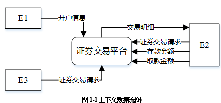
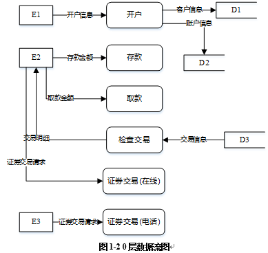

### 补充题面

【问题1】（3分）
  使用说明中的词语，给出图1-1中的实体E1-E3的名称。
【问题2】（3分）
  使用说明中的词语，给出图1-2中的数据存储D1-D3的名称。
【问题3】（4分）
  根据说明和图中的术语，补充图1-2中缺失的数据流及其起点和终点。
【问题4】（5分）
实际的证券交易通常是在证券交易中心完成的，因此，该平台的“证券交易”功能需将交易信息传递给证券交易中心。针对这个功能需求，需要对图1-1和图1-2进行哪些修改，请用200字以内的文字加以说明。

### 参考答案

【问题1】
 E1：客户服务助理，E2：客户，E3：经纪人。
【问题2】
 D1：客户记录，D2：账户记录，D3：交易记录。
【问题3】
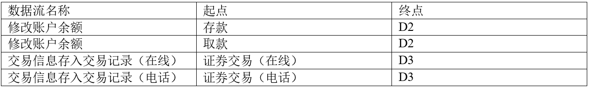
【问题4】
图1增加外部实体“证券交易中心”，增加“证券交易平台”到“证券交易中心”，数据流：交易信息。
图2增加外部实体“证券交易中心”，增加“证券交易（在线）”到“证券交易中心”，数据流：交易信息。
图2增加“证券交易（电话）”到“证券交易中心”，数据流：交易信息 。

### 解析

【问题1】
要求识别E1-E3具体为哪个外部实体，通读试题说明，可以了解到适合充当外部实体的包括：客户、客户服务助理、经记人。具体的对应关系，可以通过将顶层图与题目说明进行匹配得知。如：从图中可看出E1会向交易平台发出数据流“开户信息”；而从试题说明“根据客户服务助理提交的开户信息，进行开户，并将客户信息存入客户记录中，账户信息存入账户记录中”可以看出，E1对应是客户服务助理。E2、E3同理可得。
【问题2】
要求识别存储，解决这类问题，以图的分析为主，配合说明给存储命名，因为存储相关的数据流一般展现了这个存储中到底存了些什么信息，如从图中可以看到D1中有客户信息，而D2中有账户信息，题目说明中又有“根据客户服务助理提交的开户信息，进行开户，并将客户信息存入客户记录中，账户信息存入账户记录中。”自然D1应为客户记录，D2应为账户记录。同理，D3为交易记录。
【问题3】
缺失数据流1
名称：修改账户余额，起点：存款，终点：D2。
理由：从试题说明“客户可以向其账户中存款，根据存款金额修改账户余额”可以看出，这个功能有操作“根据存款金额修改账户余额”。据此可以了解到从该功能应有数据流“存款”至D2，而0层图没有。
缺失数据流2
名称：修改账户余额，起点：取款，终点：D2。
理由：从试题说明“客户可以从其账户中取款，根据取款金额修改账户余额”可以看出，这个功能有操作“根据取款金额修改账户余额”。据此可以了解到从该功能应有数据流“取款”至D2，而0层图没有。
缺失数据流3-4
名称：交易信息存入交易记录，起点：证券交易（分为在线与电话），终点：D3。
理由：从试题说明“客户和经纪人均可以进行证券交易，将交易信息存入交易记录中”可以看出，这个功能有操作“将交易信息存入交易记录中”。据此可以了解到从该功能应有数据流“证券交易”至D3，而0层图没有。

## 第2题（案例题）

阅读下列说明，回答问题1至问题3，将解答填入答题纸的对应栏内。
【说明】
某宾馆为了有效地管理客房资源，满足不同客户需求，拟构建一套宾馆信息管理系统，以方便宾馆管理及客房预订等业务活动。
【需求分析结果】   
 该系统的部分功能及初步需求分析的结果如下：
 （1）宾馆有多个部门，部门信息包括部门号、部门名称、电话、经理。每个部门可以有多名员工，每名员工只属于一个部门；每个部门只有一名经理，负责管理本部门。
 （2）员工信息包括员工号、姓名、岗位、电话、工资，其中，员工号唯一标识员工关系中的一个元组，岗位有经理、业务员。
 （3）客房信息包括客房号（如1301、1302等）、客房类型、收费标准、入住状态（已入住／未入住），其中客房号唯一标识客房关系中的一个元组，不同客房类型具有不同的收费标准。
 （4）客户信息包括客户号、单位名称、联系人、联系电话、联系地址，其中客户号唯一标识客户关系中的一个元组。
（5）客户预订客房时，需要填写预订申请。预订申请信息包括申请号、客户号、入住时间、入住天数、客房类型、客房数量，其中，一个申请号唯一标识预订申请中的一个元组；一位客户可以有多个预订申请，但一个预订申请对应唯一的一位客户。
（6）当客户入住时，业务员根据客户的预订申请负责安排入住客房事宜。安排信息包括客房号、姓名、性别、身份证号、入住时间、天数、电话，其中客房号、身份证号和入住时间唯一标识一次安排。一名业务员可以安排多个预订申请，一个预订申请只由一名业务员安排，而且可安排多间同类型的客房。
【概念模型设计】
根据需求阶段收集的信息，设计的实体联系图如图2-1所示。
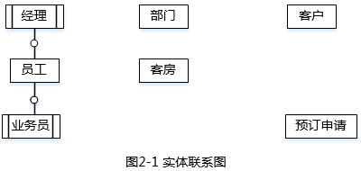
【关系模式设计】
  部门（部门号，部门名称，经理，电话）
  员工（员工号，（a），姓名，岗位，电话，工资）
  客户（（b）  ，联系人，联系电话，联系地址）
  客房（客房号，客房类型，收费标准，入住状态）
  预订申请（（c） ，入住时间，天数，客房类型，客房数量）
  安排（申请号，客房号，姓名，性别， （d） ，天数，电话，业务员）

### 补充题面

【问题1】（4分）
 根据问题描述，补充四个联系，完善图2-1，的实体联系图。联系名可用联系1、联系2、联系3和联系4代替，联系的类型为1:1、1:n和m:n （或1:1，和1:*和*:*）。
 【问题2】（8分）
 （1）根据题意，将关系模式中的空（a）～（d）补充完整，并填入答题纸对应的位置上。
 （2）给出“预订申请”和“安排”关系模式的主键和外键。
【问题3】（3分）
 【关系模式设计】中的“客房”关系模式是否存在规范性问题，请用100字以内文字解释你的观点（若存在问题，应说明如何修改“客房”关系模式）。

### 参考答案

【问题1】
1、经理与部门 之间 存在1:1的联系。
2、部门与员工 之间 存在1:n的联系。
3、客户与预订申请 之间 存在 1:n的联系。
4、业务员、客房、预订申请 之间存在1:m:n的联系。
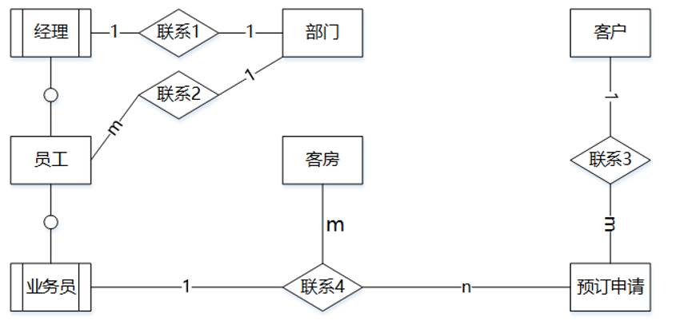
【问题2】
（a）部门号。
（b）客户号、单位名称。
（c）申请号、客户号。
（d）身份证号、入住时间。
”预订申请“关系模式中的主键是申请号，外键是客户号。
”安排“关系模式中的主键是：（客房号、身份证号、入住时间），外键是：申请号、客房号、业务员。
【问题3】
根据试题中的描述，客房信息中客房号是唯一标识客房关系的一个元组，即可以作为唯一的主键。在客房关系模式中，不存在其他部分依赖关系，但客房号→类型→收费标准，存在传递函数依赖，所以冗余，添加异常，修改异常，删除异常均存在。
可以对客房关系进行分解，具体如下：
客房1（客房号，客房类型，入住状态）；
客房2（客房类型，收费标准）。

### 解析

【问题1】
本题主要考查对实体联系图的补充。
关于联系可以根据题干描述查找。
由“每个部门可以有多名员工，每名员工只属于一个部门；每个部门只有一名经理，负责管理本部门”，可知部门与员工之间为1:n的联系，部门与经理之间，有1:1的联系。
由“一位客户可以有多个预订申请，但一个预订申请对应唯一的一位客户”，可知客户与预订申请有1:n的联系。
由“一名业务员可以安排多个预订申请，一个预订申请只由一名业务员安排，而且可安排多间同类型的客房”，可知业务员、预订申请、客房之间存在联系，且预订申请为多端，客房为多端，业务员为1端，故三者关系为1:n:m。
可以得到如下所示的完整实体联系图。
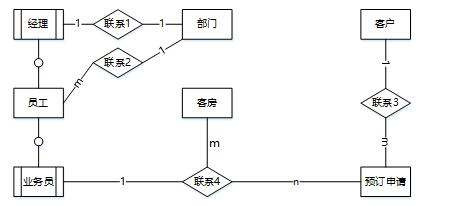
【问题2】
问题2要求补充关系模式，主要从题干描述查找遗漏的属性，部分属性需要参照实体间的联系类型，看是否需要补充。
由“员工信息包括员工号、姓名、岗位、电话、工资”，可知员工属性已给出，那么缺少的属性应该是根据联系得出的，员工与部门为n:1的联系，因此可以将二者的联系归并到员工实体，此时需要补充部门的主键，即a填写部门号。
由“客户信息包括客户号、单位名称、联系人、联系电话、联系地址”，可知客户信息缺少属性客户号，单位名称，客户为联系的1端，不能将联系归并进去，此时b空应该填写的内容是客户号，单位名称。
由“预订申请信息包括申请号、客户号、入住时间、入住天数、客房类型、客房数量”，可知预订申请信息缺少申请号，客户号，对于预订申请与客户之间1:n的联系，已通过客户号表示，不需要再补充，因此c空填写申请号，客户号。由描述“一个申请号唯一标识预订申请中的一个元组”可知，预订申请的主键为申请号。而其中客户号是客户信息的主键，在预订申请中是它的外键。
由“安排信息包括客房号、姓名、性别、身份证号、入住时间、天数、电话”，可知安排信息缺少身份证号，入住时间。因此，d空填写身份证号，时间。由描述“其中客房号、身份证号和入住时间唯一标识一次安排”可知，安排信息的主键是客房号、身份证号、入住时间的组合键。在该关系模式中，客房号是客房关系的主键，申请号是预订申请关系的主键，业务员为该员工的员工号，为员工关系的主键，因此客房号、申请号、员工号是该关系模式的外键。
【问题3】
根据试题中的描述，客房信息中客房号是唯一标识客房关系的一个元组，即可以作为唯一的主键。在客房关系模式中，不存在其他部分依赖关系，但客房号→类型→收费标准，存在传递函数依赖，所以冗余，添加异常，修改异常，删除异常均存在。
可以对客房关系进行分解，具体如下：
客房1（客房号，客房类型，入住状态）；
客房2（客房类型，收费标准）。

## 第3题（案例题）

阅读下列说明，回答问题1至问题3，将解答填入答题纸的对应栏内。
【说明】
某种出售罐装饮料的自动售货机（ Vending Machine）的工作过程描述如下：
（1）顾客选择所需购买的饮料及数量。
（2）顾客从投币口向自动售货机中投入硬币（该自动售货机只接收硬币）。硬币器收集投入的硬币并计算其对应的价值。如果所投入的硬币足够购买所需数量的这种饮料且饮料数量足够，则推出饮料，计算找零，顾客取走饮料和找回的硬币；如果投入的硬币不够或者所选购的饮料数量不足，则提示用户继续投入硬币或重新选择饮料及数量。
（3）一次购买结束之后，将硬币器中的硬币移走（清空硬币器），等待下一次交易。自动售货机还设有一个退币按钮，用于退还顾客所投入的硬币。已经成功购买饮料的钱是不会被退回的。
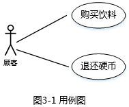
现采用面向对象方法分析和设计该自动售货机的软件系统，得到如图3-1所示的用例图，其中，用例“购买饮料”的用例描述如下。
参与者：顾客。
主要事件流：
1．顾客选择需要购买的饮料和数量，投入硬币；
2．自动售货机检查顾客是否投入足够的硬币；
3．自动售货机检查饮料储存仓中所选购的饮料是否足够；  
4．自动售货机推出饮料；
5．自动售货机返回找零。
备选事件流：  
2a．若投入的硬币不足，则给出提示并退回到1；
3a．若所选购的饮料数量不足，则给出提示并退回到1 。
根据用例“购买饮料”得到自动售货机的4个状态：“空闲”状态、“准备服务”状态、“可购买”状态以及“饮料出售”状态，对应的状态图如图3-2所示。
所设计的类图如图3-3所示。
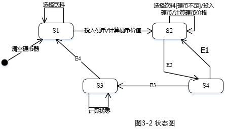

### 补充题面

【问题1】（6分）
根据说明中的描述，使用说明中的术语，给出图3-2中的S1～S4所对应的状态名。
【问题2】（4分）
根据说明中的描述，使用说明中的术语，给出图3-2中的E1～E4所对应的事件名称。
【问题3】（5分）
根据说明中的描述，使用说明中的术语，给出图3-3中C1～C5所对应的类名。
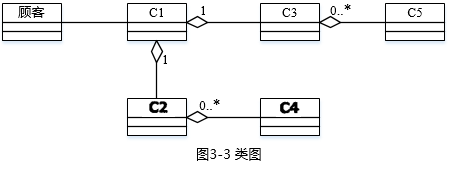

### 参考答案

【问题1】
S1：空闲，S2：准备服务，S3：饮料出售，S4：可购买。
【问题2】
E1：饮料数量不足，E2：选择饮料【硬币数量足够】。
E3：饮料数量足够/推出饮料，E4：取走饮料/返回找零并清空硬币器。
【问题3】
C1：自动售货机，C2：硬币器，C3：饮料储存仓，C4：硬币，C5：饮料。

### 解析

【问题1】
本题问题1系统中的状态图，是对状态转换的图形化表达。从题目的说明部分可知，在状态转换过程中，涉及的状态一共有四种：空闲、准备服务、可购买、饮料出售。从状态图涉及的转换可知S1~S4分别为：空闲、准备服务、饮料出售、可购买。关于状态转换的分析如下：
（1）清空硬币器后，自动售货机等待下一次交易，进入空闲状态。此时可任意的进行饮料选择数量，一旦顾客投入硬币，自动售货机便进入准备服务状态。
（2）当自动售货机进行准备服务状态时，开始计算硬币价值，如果硬币不够则提示顾客继续投入硬币。如果硬币足够，则进入可购买状态。
（3）进行可购买状态后，自动售货机判断饮料数量。如果数量不够，则返回准备服务状态提示用户重新选择饮料。如果数量足够，则推出饮料进入饮料出售状态。
（4）进行饮料出售状态后，自动售货机计算找零，并返回进入空闲状态等待下一次交易。
【问题2】
本题问题2主要是分析四种状态中的跳转事件。根据状态图和试题主要事件流的描述可以推出：
E1：饮料数量不足
E2：选择饮料【硬币数量足够】
E3：饮料数量足够/推出饮料
E4：取走饮料/返回找零并清空硬币器
【问题3】
本题问题3根据主要事件流的描述，可以推断出C1~C5的类名分别对应自动售货机、硬币器、饮料储存仓、硬币、饮料。

## 第4题（案例题）

阅读下列说明和C代码，回答问题1至问题3，将解答写在答题纸的对应栏内。
【说明】
模式匹配是指给定主串t和子串s，在主串t中寻找子串s的过程，其中s称为模式。如果匹配成功，返回s在t中的位置，否则返回-1 。
KMP算法用next数组对匹配过程进行了优化。KMP算法的伪代码描述如下：
   1．在串t和串s中，分别设比较的起始下标i=j=0。
   2．如果串t和串s都还有字符，则循环执行下列操作：
（1）如果j=-1或者t[i]=s[j]，则将i和j分别加1，继续比较t和s的下一个字符；
（2）否则，将j向右滑动到next[j]的位置，即j =next[j]。
3．如果s中所有字符均已比较完毕，则返回匹配的起始位置（从1开始）；否则返回-1。
其中，next数组根据子串s求解。求解next数组的代码已由get_next函数给出。
【C代码】
（1）常量和变量说明
 t，s：长度为lt和ls的字符串
next:next数组，长度为ls
（2）C程序
#include <stdio.h>
#include <stdlib.h>
#include <string.h>
/*求next[]的值*/
void get_next( int *next, char *s, int ls)  {
    int i=0，j=-1;
    next[0]=-1;/*初始化next[0]*/
    while(i < ls){/*还有字符*/
    if(j==-1l ls[i]==s[j]){/*匹配*/
        j++;
        i++;
    if( s[i]==s[j])
       next[i] = next[j];
    else
       Next[i] = j;
   }
else
  j = next[j];
 }
}
 int kmp( int *next, char *t ,char *s, int lt, int Is )
 {
       Int i= 0,j =0 ;
       while (i < lt &&  （1）   ){
          if( j==-1 ||     （2）  ){
                 i ++ ;
                 j ++ ;
           } else
                      （3）    ;
}
if (j >= ls)
return     （4）   ;
else
    return -1;
}

### 补充题面

【问题1】（8分）
 根据题干说明，填充C代码中的空（1）～（4）.
【问题2】（2分）
根据题干说明和C代码，分析出kmp算法的时间复杂度为（5）（主串和子串的长度分别为lt和ls，用O符号表示）。
【问题3】（5分）
根据C代码，字符串“BBABBCAC”的next数组元素值为（6）（直接写元素值，之间用逗号隔开）。若主串为“AABBCBBABBCACCD”，子串为“BBABBCAC”，则函数Kmp的返回值是（7）。

### 参考答案

【问题1】
（1）：j<ls;
（2）：t[i]==s[j];
（3）：j=next[j];
（4）：i-ls+1 或其等价形式;
【问题2】
（5）O(It+Is)
【问题3】
（6）：[-1,-1,1,-1,-1,2,0,0]，（7）6。

### 解析

【问题1】
本题问题1根据KMP算法的伪代码描述进行推导。
根据伪代码中第2步可以推导（1）是判断字符串s是否还有字符，即j<ls。i表示字符串t的下标，j表示字符串s的下标。
根据伪代码第2.1步可以推导（2）是判断字符串t和字符串s当前位置的字符是否相同，即t[i]==s[j]。
根据伪代码第2.2步可以推导（3）是当第2.1步判断条件不满足时，改变j所指向的字符位置。即j=next[j]。
根据伪代码第3步可以推导（4）是返回匹配的起始位置。由于当前i所指向字符串中匹配子串的最后一个字符的位置，且已知子串的长度为ls。（4）的代码为i-ls+1或其等价形式。
【问题2】
本题问题2是计算KMP算法的复杂度。算法的复杂度一般考虑最坏情况，那么在子串读到ls及主串读到It的时候是最坏情况。所以复杂度是O(lt+ls)
【问题3】
本题问题3中已知字符串“BBABBCAC”，则根据get_next()函数可以求得next数组的元素值为[-1,-1,1,-1,-1,2,0,0]。并计算得到起始位置为6。
代入字符串“BBABBCAC”到get_next函数。
void get_next( int *next, char *s, int ls)  {
    int i=0，j=-1;
    next[0]=-1;/*初始化next[0]*/
    while(i < ls){/*还有字符*/
    if(j==-1l ls[i]==s[j]){/*匹配*/
        j++;
        i++;
    if( s[i]==s[j])
       next[i] = next[j];
    else
       Next[i] = j;
   }
else
  j = next[j];
 }
}
这里涉及的只是代码的代入分析过程，注意循环的处理即可。
下面将循环过程依次代入数值并且写作顺序处理过程如下：
传参：s[]={B,B,A,B,B,C,A,C}，ls=8，next[]数组只声明未取值。
初始化：i=0,j=-1,next[0]=-1。
while(i<ls)执行后面的循环体，即当i<8时执行循环。
（1）当i=0,j=-1时：
判断if(j==-1||s[0]==s[-1])，满足条件1执行下一步：i++=1,j++=0。
判断if(s[1]==s[0])，满足条件执行下一步next[1]=next[0]=-1。
【此时i=1,j=0】
（2）当i=1,j=0时：
判断if(j==-1||s[1]==s[0])，满足条件2执行下一步：i++=2,j++=1。
判断if(s[2]==s[1])，不满足条件执行else下一步next[2]=j=1。
【此时i=2,j=1】
（3）当i=2,j=1时：
判断if(j==-1||s[2]==s[1])，不满足条件1和2执行else下一步：j=next[1]=-1。
【此时i=2,j=-1】
（4）当i=2,j=-1时：
判断if(j==-1||s[2]==s[-1])，满足条件1执行下一步：i++=3,j++=0。
判断if(s[3]==s[0])，满足条件执行下一步next[3]=next[0]=-1。
【此时i=3,j=0】
（5）当i=3,j=0时：
判断if(j==-1||s[3]==s[0])，满足条件2执行下一步：i++=4,j++=1。
判断if(s[4]==s[1])，满足条件执行下一步next[4]=next[1]=-1。
【此时i=4,j=1】
（6）当i=4,j=1时：
判断if(j==-1||s[4]==s[1])，满足条件2执行下一步：i++=5,j++=2。
判断if(s[5]==s[2])，不满足条件执行else下一步next[5]=j=2。
【此时i=5,j=2】
（7）当i=5,j=2时：
判断if(j==-1||s[5]==s[2])，不满足条件1和2执行else下一步：j=next[2]=1。
【此时i=5,j=1】
（8）当i=5,j=1时：
判断if(j==-1||s[5]==s[1])，不满足条件1和2执行else下一步：j=next[1]=-1。
【此时i=5,j=-1】
（9）当i=5,j=-1时：
判断if(j==-1||s[5]==s[-1])，满足条件1执行下一步：i++=6,j++=0。
判断if(s[6]==s[0])，不满足条件执行else下一步next[6]=j=0。
【此时i=6,j=0】
（10）当i=6,j=0时：
判断if(j==-1||s[6]==s[0])，不满足条件1和2执行else下一步：j=next[0]=-1。
【此时i=6,j=-1】
（11）当i=6,j=-1时：
判断if(j==-1||s[6]==s[-1])，满足条件1执行下一步：i++=7,j++=0。
判断if(s[7]==s[0])，不满足条件执行else下一步next[7]=j=0。
【此时i=7,j=0】
（12）当i=7,j=0时：
判断if(j==-1||s[7]==s[0])，不满足条件1和2执行else下一步：j=next[0]=-1。
【此时i=7,j=-1】
（13）当i=7,j=-1时：
判断if(j==-1||s[7]==s[0])，满足条件1执行下一步：i++=8，i=ls，退出while循环。
next[]数组下标从0到7，结果分别为：[-1，-1，1，-1，-1，2，0，0]

## 第5题（案例题）

阅读下列说明和C++代码，将应填入  （n）  处的字句写在答题纸的对应栏内。
【说明】
  某发票（Invoice）由抬头（Head）部分、正文部分和脚注（Foot）部分构成。现采用装饰（ Decorator）模式实现打印发票的功能，得到如图5-1所示的类图。
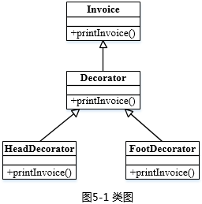

### 补充题面

【C++代码】
#include
using namespace std;
class Invoice{
public:
    （1）    {        
   cout<<"This is the content of the invoice!"<

### 参考答案

（1） virtual void printInvoice()
（2） ticket->printInvoice()
（3） Decorator::printInvoice()
（4） Decorator::printInvoice()
（5） &a

### 解析

1.Invoice类下，定义虚函数，按类图，函数名是printInvoice。
2.前面定义对象名是ticket，那么在ticket不为空的时候调用函数printInvoice。
3.这部分填写发票的抬头，看类图应该实现函数printInvoice，Decorator装饰模式使用该方法。
4.这部分是发票的脚注，看类图应该实现函数printInvoice，Decorator装饰模式使用该方法。
5.FootDecorator a(NULL) ；脚步的装饰参数是a，调用a参数。

## 第6题（案例题）

阅读下列说明和java代码，将应填入  （n）  处的字句写在答题纸的对应栏内。
【说明】
   某发票（Invoice）由抬头（Head）部分、正文部分和脚注（Foot）部分构成。现采用装饰（Decorator）模式实现打印发票的功能，得到如图6-1所示的类图。
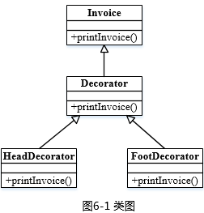

### 补充题面

【java代码】
class invoice{
public void printInvoice(){  
           System.out.println ( "This is the content of the invoice!");
    }
}
class Decorator extends Invoice {
   protected Invoice ticket;
   public Decorator(Invoice t){
         ticket = t;
}
   public void printInvoice(){
         if(ticket != null)
                          （1）       ;
  }   
}
class HeadDecorator extends Decorator{
       public HeadDecorator(Invoice t){
           super(t);
}
     public void printInvoice (){
            Systent.out.println( "This is the header of the invoice! ");
                           （2）         ;
    }
}
 class FootDecorator extends Decorator {
    public FootDecorator(Invoice t){
    super(t);
}
     public void printInvoice(){
                       （ 3）        ;
             Systent.out.println( "This is the footnote of the invoice! ");
    }
}
Class test {
    public static void main()(String[] args){
     Invoice t =new Invioce();
     Invoice ticket;
     ticket=     （4）       ;
     ticket.printInvoice();
     Systent.out.println(“------------------“);
     ticket=       （5）       ;
     ticket.printInvoice();
   }
}
程序的输出结果为：
    This is the header of the invoice!
    This is the content of the invoice!
    This is the footnote of the invoice!
     ----------------------------
    This is the header of the invoice!
    This is the footnote of the invoice!

### 参考答案

（1） ticket.printInvoice()
（2） super.printInvoice()
（3） super.printInvoice()
（4） new HeadDecorator(new FootDecorator(t))
（5） new HeadDecorator(new FootDecorator(null))

### 解析

本题考查的是面向对象程序设计和设计模式。本题涉及的设计模式是装饰模式。
装饰模式（Decorator）：动态地给一个对象添加一些额外的职责。它提供了用子类扩展功能的一个灵活的替代，比派生一个子类更加灵活。
对于程序填空可以参照代码上下文、题干说明和设计模式综合考虑。
对于第（1）空，是对printInvoice方法的具体调用，在Decorator是装饰类，继承了Invoice发票类。此处需要填写的是printInvoice方法的方法体，根据Decorator类的上下文，已定义ticket对象，所以此处调用printInvoice方法的是ticket，第（1）空填写ticket.printInvoice()。
对于第（2）（3）空，根据类图可知，分别是HeadDecorator抬头类、FootDecorator脚注类调用printInvoice方法的方法体，由于在这两个类中并没有定义属性，只有借助其超类的构造函数，所以这两个地方调用printInvoice方法的是它们的超类，即（2）（3）填写的是super.printInvoice()。
对于第（4）（5）空，考查的是对装饰模式的调用，都是main函数中实例化的过程，根据输出结果可以看到，第（4）空实例化ticket对象，可以输出抬头、内容、脚注3个部分，因此需要调用三者的printInvoice()方法，前面已经实例化了一个Invoice对象t，可以利用t给子类实例化，因此第（4）空填写new HeadDecorator(new FootDecorator(t))；而第（5）空没有输出具体内容，只有抬头和脚注部分，可以看到这里的Invoice对象应该是空，所以第（5）空填写new HeadDecorator(new FootDecorator(null))。
