# 2016下半年选择题

- 来源标题: 2016年下半年软件设计师考试基础知识真题（专业解析+参考答案）
- 试卷介绍页: https://wangxiao.xisaiwang.com/tiku2/136/tp169675.html?cid=136
- 练习页: https://wangxiao.xisaiwang.com/tiku2/exam534904546.html
- 题量: 57

## 第1题（单选题）

在程序运行过程中，CPU需要将指令从内存中取出并加以分析和执行。CPU依据（A）来区分在内存中以二进制编码形式存放的指令和数据。

- A. 指令周期的不同阶段
- B. 指令和数据的寻址方式
- C. 指令操作码的译码结果
- D. 指令和数据所在的存储单元

### 正确答案

A

### 解析

CPU执行指令的过程，会根据时序部件发出的时钟信号进行操作。在取指令阶段读取的是指令；在分析和执行指令时，如果需要操作数，则读取操作数。

## 第2题（单选题）

计算机在一个指令周期的过程中，为从内存读取指令操作码，首先要将（C）的内容送到地址总线上。

- A. 指令寄存器（IR）
- B. 通用寄存器（GR）
- C. 程序计数器（PC）
- D. 状态寄存器（PSW）

### 正确答案

C

### 解析

PC（程序计数器）是用于存放下一条指令所在单元的地址。当执行一条指令时，处理器首先需要从PC中取出指令在内存中的地址，通过地址总线寻址获取。

## 第3题（单选题）

设16位浮点数，其中阶符1位、阶码值6位、数符1位、尾数8位。若阶码用移码表示，尾数用补码表示，则该浮点数所能表示的数值范围是（B）。

- A. -264 ～（1-2-8）264
- B. -263～（1-2-8）263
- C. -（1-2-8）264 ～（1-2-8）264
- D. -（1-2-8）263 ～（1-2-8）263

### 正确答案

B

### 解析

如果浮点数的阶码（包括1位阶符）用R位的移码表示，尾数（包括1位数符）用M位的补码表示，则浮点数表示的数值范围如下。
最大正数：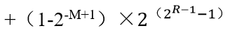，最小负数：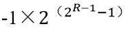。

## 第4题（单选题）

已知数据信息为16位，最少应附加（C）位校验位，以实现海明码纠错。

- A. 3
- B. 4
- C. 5
- D. 6

### 正确答案

C

### 解析

海明码的构造方法是：在数据位之间插入k个校验位，通过扩大码距来实现检错和纠错。设数据位是n位，校验位是k位，则n和k必须满足以下的关系。2K -1≥n+k
         数据为16位时，至少需要5位校验位。25 -1≥16+5

## 第5题（单选题）

将一条指令的执行过程分解为取指、分析和执行三步，按照流水线方式执行，若取指时间t取指=4△t、分析时间t分析=2△t、执行时间t执行=3△t，则执行完100条指令，需要的时间为（D）△t。

- A. 200
- B. 300
- C. 400
- D. 405

### 正确答案

D

### 解析

流水线方式，即当一条指令完成取指，进行分析的时候，下一条指令同一时间开始取指，流水线建立的时间即第一条指令执行时间，此后各指令段执行过程中最大的执行时间即各指令的执行时间，所以流水线执行指令的时间为第一条指令执行时间+（指令数-1）×各指令段执行时间中最大的执行时间。
 4△t + 3△t + 2△t +（100-1）× 4△t = 405△t

## 第6题（单选题）

以下关于Cache与主存间地址映射的叙述中，正确的是（D）。

- A. 操作系统负责管理Cache与主存之间的地址映射
- B. 程序员需要通过编程来处理Cache与主存之间的地址映射
- C. 应用软件对Cache与主存之间的地址映射进行调度
- D. 由硬件自动完成Cache与主存之间的地址映射

### 正确答案

D

### 解析

在程序的执行过程中，Cache与主存的地址映射是由硬件自动完成的。

## 第7题（单选题）

可用于数字签名的算法是（A）。

- A. RSA
- B. IDEA
- C. RC4
- D. MD5

### 正确答案

A

### 解析

IDEA算法和RC4算法都是对称加密算法，只能用来进行数据加密。MD5算法是消息摘要算法，只能用来生成消息摘要，无法进行数字签名。
RSA算法是典型的非对称加密算法，主要具有数字签名和验签的功能。

## 第8题（单选题）

（D）不是数字签名的作用。

- A. 接收者可验证消息来源的真实性
- B. 发送者无法否认发送过该消息
- C. 接收者无法伪造或篡改消息
- D. 可验证接收者合法性

### 正确答案

D

### 解析

数字签名是信息的发送者才能产生的别人无法伪造的一段数字串，这段数字串同时也是对信息的发送者发送信息真实性的一个有效证明。不能验证接收者的合法性。

## 第9题（单选题）

在网络设计和实施过程中要采取多种安全措施，其中（C）是针对系统安全需求的措施。

- A. 设备防雷击
- B. 入侵检测
- C. 漏洞发现与补丁管理
- D. 流量控制

### 正确答案

C

### 解析

安全防范体系的层次划分： 
 （1）物理环境的安全性。包括通信线路、物理设备和机房的安全等。物理层的安全主要体现在通信线路的可靠性（线路备份、网管软件和传输介质）、软硬件设备的安全性（替换设备、拆卸设备、增加设备）、设备的备份、防灾害能力、防干扰能力、设备的运行环境（温度、湿度、烟尘）和不间断电源保障等。
 （2）操作系统的安全性。主要表现在三个方面，一是操作系统本身的缺陷带来的不安全因素，主要包括身份认证、访问控制和系统漏洞等；二是对操作系统的安全配置问题；三是病毒对操作系统的威胁。 
 （3）网络的安全性。网络层的安全问题主要体现在计算机网络方面的安全性，包括网络层身份认证、网络资源的访问控制、数据传输的保密与完整性、远程接入的安全、域名系统的安全、路由系统的安全、入侵检测的手段和网络设施防病毒等。 
 （4）应用的安全性。由提供服务所采用的应用软件和数据的安全性产生，包括Web服务、电子邮件系统和DNS等。此外，还包括病毒对系统的威胁。 
 （5）管理的安全性。包括安全技术和设备的管理、安全管理制度、部门与人员的组织规则等。管理的制度化极大程度地影响着整个计算机网络的安全，严格的安全管理制度、明确的部门安全职责划分与合理的人员角色配置，都可以在很大程度上降低其他层次的安全漏洞。
本题选择C选项。A选项属于物理环境的安全性。B、D选项属于网络的安全性。

## 第10题（单选题）

（B）的保护期限是可以延长的。

- A. 专利权
- B. 商标权
- C. 著作权
- D. 商业秘密权

### 正确答案

B

### 解析

根据《中华人民共和国商标法》第三十八条：注册商标有效期满，需要继续使用的，应当在期满前六个月内申请续展注册。专利权和著作权到期后都无法延长，而商业秘密权无期限限制。

## 第11题（单选题）

甲公司软件设计师完成了一项涉及计算机程序的发明。之后，乙公司软件设计师也完成了与甲公司软件设计师相同的涉及计算机程序的发明。甲、乙公司于同一天向专利局申请发明专利。此情形下，（D）是专利权申请人。

- A. 甲公司
- B. 甲、乙两公司
- C. 乙公司
- D. 由甲、乙公司协商确定的公司

### 正确答案

D

### 解析

专利审查指南的规定：
在审查过程中，对于不同的申请人同日 （指申请日，有优先权的指优先权日） 就同样的发明创造分别提出专利申请，并且这两件申请符合授予专利权的其他条件的，应当根据专利法实施细则第四十一条第一款的规定，通知申请人自行协商确定申请人。

## 第12题（单选题）

甲、乙两厂生产的产品类似，且产品都使用“B”商标。两厂于同一天向商标局申请商标注册，且申请注册前两厂均未使用“B”商标。此情形下，（B）能核准注册。

- A. 甲厂
- B. 由甲、乙厂抽签确定的厂
- C. 乙厂
- D. 甲、乙两厂

### 正确答案

B

### 解析

按照商标法的规定，第31条，以及实施条例19条规定，同一天申请的，初步审定并公告使用在先的，驳回其他人的申请。均未使用或无法证明的，各自协商，不愿协商或者协商不成的，抽签决定，不抽签的，视为放弃。

## 第13题（单选题）

在FM方式的数字音乐合成器中，改变数字载波频率可以改变乐音的（A/C），改变它的信号幅度可以改变乐音的（  ）。

### 问题1
- A. 音调
- B. 音色
- C. 音高
- D. 音质
### 问题2
- A. 音调
- B. 音域
- C. 音高
- D. 带宽

### 正确答案

A、C

### 解析

改变数字载波频率可以改变乐音的音调。
改变它的幅度就可以改变乐音的音高。

## 第14题（单选题）

结构化开发方法中，（D）主要包含对数据结构和算法的设计。

- A. 体系结构设计
- B. 数据设计
- C. 接口设计
- D. 过程设计

### 正确答案

D

### 解析

数据结构跟算法是系统的基础，是过程设计确定的任务。
体系结构设计：定义软件系统各主要部件之间的关系。
 数据设计：基于E-R图确定软件涉及的文件系统的结构及数据库的表结构。
 接口设计（人机界面设计）：软件内部，软件和操作系统间以及软件和人之间如何通信。
 过程设计：系统结构部件转换成软件的过程描述。确定软件各个组成部分内的算法及内部数据结构，并选定某种过程的表达形式来描述各种算法。

## 第15题（单选题）

在敏捷过程的开发方法中，（C）使用了迭代的方法，其中，把每段时间（30天）一次的迭代称为一个“冲刺”，并按需求的优先级别来实现产品，多个自组织和自治的小组并行地递增实现产品。

- A. 极限编程XP
- B. 水晶法
- C. 并列争球法
- D. 自适应软件开发

### 正确答案

C

### 解析

并列争球法使用了迭代的方法，其中，把每段时间（30天）一次的迭代称为一个“冲刺”，并按需求的优先级别来实现产品，多个自组织和自治的小组并行地递增实现产品。

## 第16题（单选题）

某软件项目的活动图如下图所示，其中顶点表示项目里程碑，连接顶点的边表示包含的活动，边上的数字表示相应活动的持续时间（天），则完成该项目的最少时间为（D/A）天。活动BC和BF最多可以晚开始（  ）天而不会影响整个项目的进度。
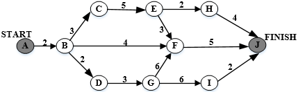

### 问题1
- A. 11
- B. 15
- C. 16
- D. 18
### 问题2
- A. 0和7
- B. 0和11
- C. 2和7
- D. 2和11

### 正确答案

D、A

### 解析

项目中关键路径是ABCEFJ，总共需要18天。
BC在关键路径上，因此BC推迟会影响项目工期，不可以晚开始。
BF不在关键路径上，而BF所在的最长路径为：ABFJ，为11天，故BF最多可以晚开始18-11=7天。
BC和BF可以最晚开始的时间分别为0天和7天。

## 第17题（单选题）

成本估算时，（D）方法以规模作为成本的主要因素，考虑多个成本驱动因子。该方法包括三个阶段性模型，即应用组装模型、早期设计阶段模型和体系结构阶段模型。

- A. 专家估算
- B. Wolverton
- C. COCOMO
- D. COCOMO Ⅱ

### 正确答案

D

### 解析

软件成本估算比较常用的模型有Putnam模型，功能点模型，COCOMO模型和后续的COCOMO II模型。其中以COCOMO II模型的使用最为广泛，它是COCOMO模型的改进，以成本为主要因素，考虑多成本驱动因素。因此本题选择D选项COCOMO II模型。

## 第18题（单选题）

逻辑表达式求值时常采用短路计算方式。“&&”、“||”、“！”分别表示逻辑与、或、非运算，“&&”、“||”为左结合，“！”为右结合，优先级从高到低为 “！”、“&&”、“||”。对逻辑表达式“x&&（y||!z）”进行短路计算方式求值时，（B）。

- A. x为真，则整个表达式的值即为真，不需要计算y和z的值
- B. x为假，则整个表达式的值即为假，不需要计算y和z的值
- C. x为真，再根据z的值决定是否需要计算y的值
- D. x为假，再根据y的值决定是否需要计算z的值

### 正确答案

B

### 解析

根据逻辑运算符的优先级，最后计算的为“&&”运算，当左侧为假时，则右侧不需要计算，整个表达式为假；当左侧为真时，需要继续计算右侧表达式，即当x为真时，需要计算后面的表达式，此时与z值无关。
本题B选项正确。

## 第19题（单选题）

常用的函数参数传递方式有传值与传引用两种，（C）。

- A. 在传值方式下，形参与实参之间互相传值
- B. 在传值方式下，实参不能是变量
- C. 在传引用方式下，修改形参实质上改变了实参的值
- D. 在传引用方式下，实参可以是任意的变量和表达式

### 正确答案

C

### 解析

本题考查程序语言基础知识。    函数调用时基本的参数传递方式有传值与传地址两种，在传值方式下是将实参的值传递给形参，因此实参可以是表达式（或常量），也可以是变量（或数组元素），这种信息传递是单方向的，形参不能再将值传回给实参。在传址方式下，需要将实参的地址传递给形参，因此，实参必须是变量（数组名或数组元素），不能是表达式（或常量）。这种方式下，被调用函数中对形式参数的修改实际上就是对实际参数的修改，因此客观上可以实现数据的双向传递。
传值调用最显著的特征就是被调用的函数内部对形参的修改不影响实参的值。引用调用是将实参的地址传递给形参，使得形参的地址就是实参的地址。

## 第20题（单选题）

二维数组a[1..N，1..N]可以按行存储或按列存储。对于数组元素a[i，j]（1 < =i，j < =N），当（B）时，在按行和按列两种存储方式下，其偏移量相同。

- A. i≠j
- B. i=j
- C. i > j
- D. i < j

### 正确答案

B

### 解析

i和j相等，那么这时候的行列是一样多的，则按行按列变得没有区别。

## 第21题（单选题）

实时操作系统主要用于有实时要求的过程控制等领域。实时系统对于来自外部的事件必须在（D）。

- A. 一个时间片内进行处理
- B. 一个周转时间内进行处理
- C. 一个机器周期内进行处理
- D. 被控对象规定的时间内作出及时响应并对其进行处理

### 正确答案

D

### 解析

实时操作系统是保证在一定时间限制内完成特定功能的操作系统。实时操作系统有硬实时和软实时之分，硬实时要求在规定的时间内必须完成操作，这是在操作系统设计时保证的；软实时则只要按照任务的优先级，尽可能快地完成操作即可。

## 第22题（单选题）

假设某计算机系统中只有一个CPU、一台输入设备和一台输出设备，若系统中有四个作业T1、T2、T3和T4，系统采用优先级调度，且T1的优先级 > T2的优先级 > T3的优先级 > T4的优先级。每个作业Ti具有三个程序段：输入Ii、计算Ci和输出Pi（i=1，2，3，4），其执行顺序为Ii→Ci→Pi。这四个作业各程序段并发执行的前驱图如下所示。图中①、②分别为（C/D），③、④、⑤分别为（ ）。
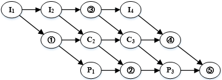

### 问题1
- A. I2、P2
- B. I 2、C2
- C. C1、P2
- D. C1、P3
### 问题2
- A. C2、C4、P4
- B. I 2、I 3、C4
- C. I3、P3、P4
- D. I 3、C4、P4

### 正确答案

C、D

### 解析

[['题目告诉我们一共有3个设备，分别是一个CPU、一台输入设备和一台输出设备，其实输入设备对应程序段输入Ii，而CPU对应程序段计算Ci，输出设备对应程序段输出Pi。而每个作业都分为这三段，各段间有个顺序关系。再结合图中已经给出的结点，我们不难发现，第一行是输入，第二行是计算，而第三行的结点是输出结点。因此可以知道①、②分别为C1、P2，③、④、⑤分别为I3、C4、P4。
''],['
']]

## 第23题（单选题）

假设段页式存储管理系统中的地址结构如下图所示，则系统（B）。
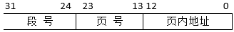

- A. 最多可有256个段，每个段的大小均为2048个页，页的大小为8K
- B. 最多可有256个段，每个段最大允许有2048个页，页的大小为8K
- C. 最多可有512个段，每个段的大小均为1024个页，页的大小为4K
- D. 最多可有512个段，每个段最大允许有1024个页，页的大小为4K

### 正确答案

B

### 解析

根据公式 ，可以分别计算段号，页号以及页内地址最大的寻址空间。存储管理系统中的地址长度均表示为最大的寻址空间。
页内地址为13位，即页大小为213=8K；页号地址为11位，即页数最多为211=2048；段号地址为8位，即段数最多为28=256。

## 第24题（单选题）

假设系统中有n个进程共享3台扫描仪，并采用PV操作实现进程同步与互斥。若系统信号量S的当前值为-1，进程P1、P2又分别执行了1次P（S）操作，那么信号量S的值应为（B）。

- A. 3
- B. -3
- C. 1
- D. -1

### 正确答案

B

### 解析

当有进程运行时，其他进程访问信号量（执行P（信号量）操作），信号量就会减1。这里P1、P2分别执行1次，所以S=-1-1-1=-3。

## 第25题（单选题）

某字长为32位的计算机的文件管理系统采用位示图（bitmap）记录磁盘的使用情况。若磁盘的容量为300GB，物理块的大小为1MB，那么位示图的大小为（D）个字。

- A. 1200
- B. 3200
- C. 6400
- D. 9600

### 正确答案

D

### 解析

磁盘的容量为300GB，物理块的大小为1MB，则磁盘共300×1024/1个物理块，字长为32位，则位示图的大小为300×1024/(32)=9600个字。

## 第26题（单选题）

某开发小组欲为一公司开发一个产品控制软件，监控产品的生产和销售过程，从购买各种材料开始，到产品的加工和销售进行全程跟踪。购买材料的流程、产品的加工过程以及销售过程可能会发生变化。该软件的开发最不适宜采用（A/C）模型，主要是因为这种模型（  ）。

### 问题1
- A. 瀑布
- B. 原型
- C. 增量
- D. 喷泉
### 问题2
- A. 不能解决风险
- B. 不能快速提交软件
- C. 难以适应变化的需求
- D. 不能理解用户的需求

### 正确答案

A、C

### 解析

对于较大型软件系统的需求往往难以在前期确定，所以瀑布模型最不适合。

## 第27题（单选题）

（D）不属于软件质量特性中的可移植性。

- A. 适应性
- B. 易安装性
- C. 易替换性
- D. 易理解性

### 正确答案

D

### 解析

可移植性包含：适应性、易安装性、共存性和易替换性四个特性。

## 第28题（单选题）

对下图所示流程图采用白盒测试方法进行测试，若要满足路径覆盖，则至少需要（C/D）个测试用例。采用McCabe度量法计算该程序的环路复杂性为（  ）。
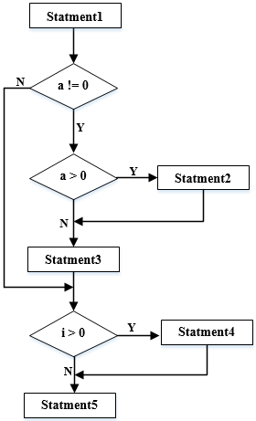

### 问题1
- A. 3
- B. 4
- C. 6
- D. 8
### 问题2
- A. 1
- B. 2
- C. 3
- D. 4

### 正确答案

C、D

### 解析

[['问题1考查白盒测试路径覆盖：覆盖所有可能的路径。  
根据流程图，若要覆盖所有可能路径，对于a的取值需要a=0，a < 0，a > 0三种用例，而对于i的取值需要i > 0和i < =0两种用例，排列组合，共需要6组用例测试才能覆盖所有可能的路径。
问题2对于环形复杂度计算，根据公式V（G）=E-N+2，其中，E是流图中边的条数，N是结点数。
V（G）=E-N+2=10-8+2=4。
''],['
']]

## 第29题（单选题）

计算机系统的（B）可以用MTBF/(1+MTBF)来度量，其中MTBF为平均失效间隔时间。

- A. 可靠性
- B. 可用性
- C. 可维护性
- D. 健壮性

### 正确答案

B

### 解析

本题表示的是可用性指标。
MTBF为平均失效间隔时间，则可用性用MTBF/(1+MTBF)表示。（可用性是指在给定的时间点上，一个系统能够正确运作的概率）
MTTF为平均无故障时间，则可靠性可用MTTF/(1+MTTF)表示。（可靠性是指系统在给定的时间间隔内、给定条件下无失效运作的概率）

## 第30题（单选题）

以下关于软件测试的叙述中，不正确的是（B）。

- A. 在设计测试用例时应考虑输入数据和预期输出结果
- B. 软件测试的目的是证明软件的正确性
- C. 在设计测试用例时，应该包括合理的输入条件
- D. 在设计测试用例时，应该包括不合理的输入条件

### 正确答案

B

### 解析

软件测试的目的是为了发现尽可能多的缺陷。

## 第31题（单选题）

某模块中有两个处理A和B，分别对数据结构X写数据和读数据，则该模块的内聚类型为（C）内聚。

- A. 逻辑
- B. 过程
- C. 通信
- D. 内容

### 正确答案

C

### 解析

如果一个模块的所有成分都操作同一数据集或生成同一数据集，则称为通信内聚。本题为通信内聚。
逻辑聚合：模块内部的各个组成在逻辑上具有相似的处理动作，但功能用途上彼此无关。
过程聚合：模块内部各个组成部分所要完成的动作虽然没有关系，但必须按特定的次序执行。
内容耦合：一个模块需要涉及另一个模块的内部信息。

## 第32题（单选题）

在面向对象方法中，不同对象收到同一消息可以产生完全不同的结果，这一现象称为（D）。在使用时，用户可以发送一个通用的消息，而实现的细节则由接收对象自行决定。

- A. 接口
- B. 继承
- C. 覆盖
- D. 多态

### 正确答案

D

### 解析

本题考查面向对象多态的概念
在收到消息时，对象要予以响应。不同的对象收到同一消息可以产生完全不同的结果，这种现象就叫多态。

## 第33题（单选题）

在面向对象方法中，支持多态的是（D）。

- A. 静态分配
- B. 动态分配
- C. 静态类型
- D. 动态绑定

### 正确答案

D

### 解析

动态绑定是实现多态的基础。

## 第34题（单选题）

面向对象分析的目的是为了获得对应用问题的理解，其主要活动不包括（C）。

- A. 认定并组织对象
- B. 描述对象间的相互作用
- C. 面向对象程序设计
- D. 确定基于对象的操作

### 正确答案

C

### 解析

面向对象分析的任务是了解问题域所涉及的对象、对象间的关系和操作，然后构造问题的对象模型。

## 第35题（单选题）

如下所示的UML状态图中，（C）时，不一定会离开状态B
 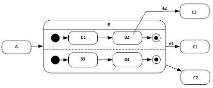

- A. 状态B中的两个结束状态均达到
- B. 在当前状态为B2时，事件e2发生
- C. 事件e2发生
- D. 事件e1发生

### 正确答案

C

### 解析

本题考查的是UML状态图。
对于图示状态图，事件e2发生，而当前并没有处于B2状态时，不会发生变迁，因此本题选择C选项。

## 第36题（单选题）

以下关于UML状态图中转换（transition）的叙述中，不正确的是（C）。

- A. 活动可以在转换时执行也可以在状态内执行
- B. 监护条件只有在相应的事件发生时才进行检查
- C. 一个转换可以有事件触发器、监护条件和一个状态
- D. 事件触发转换

### 正确答案

C

### 解析

转换是从一个状态变迁到另一个状态，所以一个转换至少有两个状态，C选项不正确。
其他选项的说法都是正确的。

## 第37题（单选题）

下图①②③④所示是UML（C/A）。现有场景：一名医生（Doctor）可以治疗多位病人（Patient），一位病人可以由多名医生治疗，一名医生可能多次治疗同一位病人。要记录哪名医生治疗哪位病人时，需要存储治疗（Treatment）的日期和时间。以下①②③④图中（  ）。是描述此场景的模型。
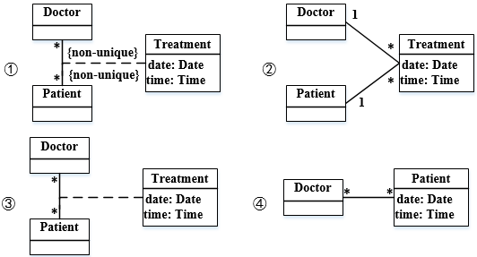

### 问题1
- A. 用例图
- B. 对象图
- C. 类图
- D. 协作图
### 问题2
- A. ①
- B. ②
- C. ③
- D. ④

### 正确答案

C、A

### 解析

1.图示是标准的类图。
2.根据题中关系描述，应该是图1，这时候医生跟病人关系是多对多，并且，医生跟病人的组合并不唯一（non-unique），并且治疗这个处理过程正确，因此问题2选择A选项。

## 第38题（单选题）

（D/C）模式定义一系列的算法，把它们一个个封装起来，并且使它们可以相互替换，使得算法可以独立于使用它们的客户而变化。以下（  ）情况适合选用该模式。
①一个客户需要使用一组相关对象
②一个对象的改变需要改变其他对象    
③需要使用一个算法的不同变体
④许多相关的类仅仅是行为有异

### 问题1
- A. 命令（Command）
- B. 责任链（Chain of Responsibility）
- C. 观察者（Observer）
- D. 策略（Strategy）
### 问题2
- A. ①②
- B. ②③
- C. ③④
- D. ①④

### 正确答案

D、C

### 解析

策略模式定义了一系列的算法，并将每一个算法封装起来，而且使它们还可以相互替换。策略模式让算法独立于使用它的客户而独立变化。
应用场景：
1、多个类只区别在表现行为不同，可以使用Strategy模式，在运行时动态选择具体要执行的行为。
2、需要在不同情况下使用不同的策略（算法），或者策略还可能在未来用其他方式来实现。
3、对客户隐藏具体策略（算法）的实现细节，彼此完全独立。

## 第39题（单选题）

（A/A）模式将一个复杂对象的构建与其表示分离，使得同样的构建过程可以创建不同的表示。以下（  ）情况适合选用该模式。
①抽象复杂对象的构建步骤
②基于构建过程的具体实现构建复杂对象的不同表示
③一个类仅有一个实例
④一个类的实例只能有几个不同状态组合中的一种

### 问题1
- A. 生成器（Builder）
- B. 工厂方法（Factory Method）
- C. 原型（Prototype）
- D. 单例（ Singleton）
### 问题2
- A. ①②
- B. ②③
- C. ③④
- D. ①④

### 正确答案

A、A

### 解析

生成器模式将一个复杂对象的构建与它的表示分离，使得同样的构建过程可以创建不同的表示。
实用范围：
1、当创建复杂对象的算法应该独立于该对象的组成部分以及它们的装配方式时。
2、当构造过程必须允许被构造的对象有不同表示时。

## 第40题（单选题）

由字符a、b构成的字符串中，若每个a后至少跟一个b，则该字符串集合可用正规式表示为（A）。

- A. （b|ab）*
- B. （ab*）*
- C. （a*b*）*
- D. （a|b）*

### 正确答案

A

### 解析

A的方式可以保证a后面必定是b。
对于B、C选项，当b的*取值为0时，a的后面不能保证会有b。
对于D选项，表示的是任意a和b组成的串，因此包括aaa，不满足a的后面必须有b。
本题只有A选项符合题意。

## 第41题（单选题）

乔姆斯基（Chomsky）将文法分为4种类型，程序设计语言的大多数语法现象可用其中的（B）描述。

- A. 上下文有关文法
- B. 上下文无关文法
- C. 正规文法
- D. 短语结构文法

### 正确答案

B

### 解析

上下文无关文法：形式语言理论中一种重要的变换文法，用来描述上下文无关语言，在乔姆斯基分层中称为2型文法。由于程序设计语言的语法基本上都是上下文无关文法，因此应用十分广泛。

## 第42题（单选题）

运行下面的C程序代码段，会出现（D）错误。
    int k=0;
    for(;k < 100;);
    {k++;}

- A. 变量未定义
- B. 静态语义
- C. 语法
- D. 动态语义

### 正确答案

D

### 解析

在本题中，需仔细阅读代码，for语句后有“;”号，说明该循环语句的语句体为空，因此k在循环过程中没有进行自增操作，此时，整个代码会不停的进行空操作，进入死循环，而此时的死循环属于动态语义错误。

## 第43题（单选题）

在数据库系统中，一般由DBA使用DBMS提供的授权功能为不同用户授权，其主要目的是为了保证数据库的（B）。

- A. 正确性
- B. 安全性
- C. 一致性
- D. 完整性

### 正确答案

B

### 解析

DBMS是数据库管理系统，主要用来保证数据库的安全性和完整性。而DBA通过授权功能为不同用户授权，主要的目的是为了保证数据的安全性。

## 第44题（单选题）

给定关系模式R（U，F），其中：U为关系模式R中的属性集，F是U上的一组函数依赖。假设U={A1，A2，A3，A4}，F={A1→A2，A1A2→A3，A1→A4，A2→A4}，那么关系R的主键应为（A/C）。函数依赖集F中的（  ）是冗余的。

### 问题1
- A. A1
- B. A1A2
- C. A1A3
- D. A1A2A3
### 问题2
- A. A1→A2
- B. A1A2→A3
- C. A1→A4
- D. A2→A4

### 正确答案

A、C

### 解析

本题中U1={A1、A2、A3、A4}，构造出依赖关系图之后，A1是入度为0的结点，从A1可以推导出A2、A4，通过A2与A1组合推导出A3，因此A1为候选键。
A1→A2，A2→A4利用传递率：A1→A4，因此A1→A4是冗余。

## 第45题（单选题）

给定关系R（A，B，C，D）和关系S（A，C，E，F），对其进行自然连接运算R⋈S后的属性列为（C/B）个；与σR.B > S.E（R⋈S）等价的关系代数表达式为（  ）。

### 问题1
- A. 4
- B. 5
- C. 6
- D. 8
### 问题2
- A. σ2 > 7（R×S）
- B. π1,2,3,4,7,8（σ1=5^2 > 7^3=6（R×S））
- C. σ2 > '7'（R×S）
- D. π1,2,3,4,7,8（σ1=5^2 > ’7’^3=6（R×S））

### 正确答案

C、B

### 解析

[['关系R（A，B，C，D）和S（A，C，E，F）做自然连接时，会以两个关系公共字段做等值连接，然后将操作结果集中重复列去除，所以运算后属性列有（4+4）-2=6个。（A、C为重复列）因此，本题问题1选择C选项。
对于问题2，求自然连接的笛卡尔积等价表达式，首先笛卡尔积需要选取同属性名且值相等的元组，本题A、C为同属性名，因此需要满足R.A=S.A^R.C=S.C，转换为数字序号则为：1=5^3=6。而对于选择条件R.B > S.E，转换为数字序号，则为2 > 7，注意D选项的'7'为字符而不是数字。
综上，本题问题2选择B选项。''],['
']]

## 第46题（单选题）

下列查询B=“大数据”且F=“开发平台”，结果集属性列为A、B、C、F的关系代数表达式中，查询效率最高的是（D）。

- A. π1,2,3,8 （σ2=‘大数据’ ^ 1=5 ^ 3=6 ^ 8=‘开发平台’（R×S））
- B. π1,2,3,8 （σ1=5 ^ 3=6 ^ 8=‘开发平台’（σ2=‘大数据’（R）×S））
- C. π1,2,3,8（σ2=‘大数据’ ^ 1=5 ^ 3=6（R×σ4=‘开发平台’（S））
- D. π1,2,3,8（σ1=5 ^ 3=6（σ2=‘大数据’（R）×σ4=‘开发平台’（S）））

### 正确答案

D

### 解析

优化SQL语句，减少比较次数是提高查询效率的有效方法。
 在这个题目中，如果连接的两个表越小，那么连接的时候多余的数据就更少，D答案将可以对子表做的操作先做了，最后做连接，是效率最高的一种方法。

## 第47题（单选题）

拓扑序列是有向无环图中所有顶点的一个线性序列，若有向图中存在弧（v，w）或存在从顶点v到w的路径，则在该有向图的任一拓扑序列中，v一定在w之前。下面有向图的拓扑序列是（A）。
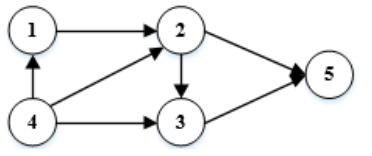

- A. 41235
- B. 43125
- C. 42135
- D. 41325

### 正确答案

A

### 解析

拓扑排序通俗一点来讲，其实就是依次遍历没有前驱结点的结点。而某一时刻没有前驱结点的结点有可能存在多个，所以一个图的拓扑排序可能有多个。
4号结点没有前趋，所以拓扑排序的第一个元素是4。当4访问完了就可以访问1，1号访问完了就可以访问2，2号访问完了就可以访问3或5。所以拓扑排序结果为：41235。

## 第48题（单选题）

设有一个包含n个元素的有序线性表。在等概率情况下删除其中的一个元素，若采用顺序存储结构，则平均需要移动（B/A）个元素；若采用单链表存储，则平均需要移动（  ）个元素。

### 问题1
- A. 1
- B. （n-1）/2
- C. logn
- D. n
### 问题2
- A. 0
- B. 1
- C. （n-1）/2
- D. n/2

### 正确答案

B、A

### 解析

若用顺序表存储，则最好情况是删除最后一个元素，此时不用移动任何元素，直接删除，最差的情况是删除第一个元素，此时需要移动n-1个元素，所以平均状态是移动（n-1）/2。
若用链表存储，直接将需要删除元素的前趋next指针指向后继元素即可，不需要移动元素，所以移动元素个数为0。
若用顺序表存储，则最好情况是删除最后一个元素，此时不用移动任何元素，直接删除，最差的情况是删除第一个元素，此时需要移动n-1个元素，所以平均状态是移动（n-1）/2。
若用链表存储，直接将需要删除元素的前趋next指针指向后继元素即可，不需要移动元素，所以移动元素个数为0。

## 第49题（单选题）

具有3个节点的二叉树有（C）种形态。

- A. 2
- B. 3
- C. 5
- D. 7

### 正确答案

C

### 解析

N个节点（N > =2）的二叉树有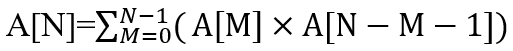这是1个求和公式。
N=0，是空树，只有1种形态，即A[0]=1。
N=1，是单节点树，只有1种形态。即A[1]=1。
当N > =2时，A[N]是对A[N]A[N-M-1]，M从0~N-1的求和。
如：
当N=2时，M=0~N-1=0~1，
A[2]=A[0] ×A[2-0-1]+A[1] ×A[2-1-1]=A[0] ×A[1]+A[1] ×A[0]=2；
当N=3时，M=0~N-1=0~2，
A[3]=A[0] ×A[3-0-1]+A[1] ×A[3-1-1]+A[2] ×A[3-2-1]
=A[0] ×A[2]+A[1] ×A[1]+A[2]A[0]=1×2+1×1+2×1=5。

## 第50题（单选题）

以下关于二叉排序树（或二叉查找树、二叉搜索树）的叙述中，正确的是（D）。

- A. 对二叉排序树进行先序、中序和后序遍历，都得到结点关键字的有序序列
- B. 含有n个结点的二叉排序树高度为[log2n]+1
- C. 从根到任意一个叶子结点的路径上，结点的关键字呈现有序排列的特点
- D. 从左到右排列同层次的结点，其关键字呈现有序排列的特点

### 正确答案

D

### 解析

对于二叉排序树的遍历，只有中序遍历可以得到递增的有序序列，而后序遍历和先序遍历都不可以，因此A选项错误。
对于二叉排序树的构造，最差可能会形成单支树，因此节点数与树的高度，没有绝对的关系，B选项错误。
对于二叉树的路径，只能保证当前节点与其子节点的大小关系，而对于下层节点，并不能保证与其他节点的大小。比如，对于根节点为30，其左孩子为19，右孩子为40；对于19的左孩子为10，右孩子为25；则从30→25，路径为30，19，25，并不是有序序列。因此C选项错误。
对于D选项，对于二叉排序树或者是一棵空树，或者是具有下列性质的二叉树：
（1）若左子树不空，则左子树上所有结点的值均小于或等于它的根结点的值；
（2）若右子树不空，则右子树上所有结点的值均大于或等于它的根结点的值；
（3）左、右子树也分别为二叉排序树
那么同层次的节点，右子树大于根节点，根节点大于左子树，则右子树大于左子树，则同层次有序排列。

## 第51题（单选题）

下表为某文件中字符的出现频率，采用霍夫曼编码对下列字符编码，则字符序列”bee“的编码为（A/C）；编码“110001001101
” 的对应的字符序列为（  ）。
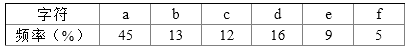

### 问题1
- A. 10111011101
- B. 10111001100
- C. 001100100
- D. 110011011
### 问题2
- A. bad
- B. bee
- C. face
- D. bace

### 正确答案

A、C

### 解析

构造的哈夫曼树和节点编码如下所示：
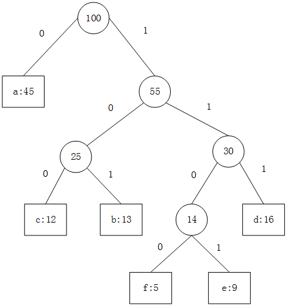
bee的编码为：10111011101
110001001101 中：f(1100) a(0) c(100) e(1101)。

## 第52题（单选题）

两个矩阵Am*n和Bn*p相乘，用基本的方法进行，则需要的乘法次数为m*n*p。多个矩阵相乘满足结合律，不同的乘法顺序所需要的乘法次数不同。考虑采用动态规划方法确定Mi，M(i+1)，…，Mj多个矩阵连乘的最优顺序，即所需要的乘法次数最少。最少乘法次数用m[i,j]表示，其递归式定义为：
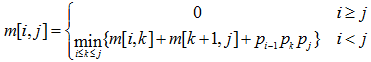
其中i、j和k为矩阵下标，矩阵序列中Mi的维度为(pi-1)*pi采用自底向上的方法实现该算法来确定n个矩阵相乘的顺序，其时间复杂度为（C/B）。若四个矩阵M1、 M2、M3、M4相乘的维度序列为2、6、3、10、3，采用上述算法求解，则乘法次数为（  ）。

### 问题1
- A. O(n2)
- B. O(n2lgn)
- C. O(n3)
- D. O(n3lgn)
### 问题2
- A. 156
- B. 144
- C. 180
- D. 360

### 正确答案

C、B

### 解析

四个矩阵分别为：
2*6  6*3  3*10  10*3
先计算：M1*M2  及M3*M4，计算次数分别为：
2*6*3=36，3*10*3=90
然后结果相乘，计算次数为：
2*3*3=18
36+90+18=144

## 第53题（单选题）

以下协议中属于应用层协议的是（A/C），该协议的报文封装在（  ）。

### 问题1
- A. SNMP
- B. ARP
- C. ICMP
- D. X.25
### 问题2
- A. TCP
- B. IP
- C. UDP
- D. ICMP

### 正确答案

A、C

### 解析

ARP和ICMP是网络层协议，X.25是标准的接口协议，只有SNMP是应用层协议。
SNMP协议的报文是封装在UDP协议中传送。

## 第54题（单选题）

某公司内部使用wb.xyz.com.cn作为访问某服务器的地址，其中wb是（A）。

- A. 主机名
- B. 协议名
- C. 目录名
- D. 文件名

### 正确答案

A

### 解析

wb是主机名。
一个标准的URL格式如下：
协议：//主机名.域名.域名后缀或IP地址（：端口号）/目录/文件名。
文件名可以有多级。

## 第55题（单选题）

如果路由器收到了多个路由协议转发的关于某个目标的多条路由，那么决定采用哪条路由的策略是（C）。

- A. 选择与自己路由协议相同的
- B. 选择路由费用最小的
- C. 比较各个路由的管理距离
- D. 比较各个路由协议的版本

### 正确答案

C

### 解析

对于多种不同的路由协议到一个目的地的路由信息，路由器首先根据管理距离决定相信哪一个协议。

## 第56题（单选题）

与地址220.112.179.92匹配的路由表的表项是（D）。

- A. 220.112.145.32/22
- B. 220.112.145.64/22
- C. 220.112.147.64/22
- D. 220.112.177.64/22

### 正确答案

D

### 解析

地址220.112.179.92中179的二进制码为1011 0011，假如网络号采用22位，与该地址匹配的路由表项则为220.112.177.64/22。
这道题考查的仍然是同一子网这样的问题，因此，根据选项可知，我们选择的都是22位网络地址的地址，那么将4个选项和题干给出的IP地址当中第三段IP都转换为二进制，可知题干IP地址第三段179转换为二进制为1011 00 11。
A选项145转换为二进制为1001 00 01；
B选项145转换为二进制为1001 00 01；
C选项147转换为二进制为1001 00 11；
D选项转换为二进制为1011 00 01。
这里的8位二进制，其中前6位为网络号，因此只有D选项与题干IP在同一子网中，也就是与之匹配的路由表项。

## 第57题（单选题）

Software entities are more complex for their size than perhaps any other human construct, because no two parts are alike (at least above the statement level). If they are, we make the two similar parts into one, a（1）, open or closed.  In this respect software systems differ profoundly from computers,buildings, or automobiles, where repeated elements abound.
Digital computers are themselves more complex than most things people build; they have very large numbers of states. This makes conceiving, describing, and testing them hard. Software systems have orders of magnitude more （2）than computers do.
  Likewise, a scaling-up of a software entity is not merely a repetition of the same elements in  larger size; it is necessarily an increase in the number of different elements. In most cases, the elements interact with each other in some（3）fashion,and the complexity of the whole increases much more than linearly.
The complexity of software is a(an)（4）property, not an accidental one. Hence descriptions of a software entity that abstract away its complexity often abstract away its essence.Mathematics and the physical sciences made great strides for three centuries by constructing simplified models of complex phenomena, deriving properties from the models, and verifying those properties experimentally. This worked because the complexities（5）in the models were not the essential properties of the phenomena. It does not work when the complexities are the essence.
Many of the classical problems of developing software products derive from this essential  complexity and its nonlinear increases with size. Not only technical problems but management  problems as well come from the complexity.

### 问题1
- A. task
- B. job
- C. subroutine
- D. program
### 问题2
- A. states
- B. parts
- C. conditions
- D. expressions
### 问题3
- A. linear
- B. nonlinear
- C. parallel
- D. additive
### 问题4
- A. surface
- B. outside
- C. exterior
- D. essential
### 问题5
- A. fixed
- B. included
- C. ignored
- D. stabilized

### 正确答案

C、A、B、D、C

### 解析

软件实体的尺寸比任何其他人类构造更复杂，因为没有两个部分相同（至少在语句级上）。如果是，我们将两个相似的部分分成一个，一个（1），开放或关闭。在这方面，软件系统与计算机，建筑物或汽车有着深刻的区别，其中重复的元素很多。
数字电脑本身比大多数人理解的很多情况都要更复杂。这使得构思，描述和测试它们非常复杂。软件系统比计算机更多（2）数量级。
同样地，软件实体的放大不仅仅是较大尺寸的相同元素的重复；必然增加不同要素的数量。在大多数情况下，这些元素以（3）的方式彼此相互作用，并且整体的复杂性比线性增加更多。
软件的复杂性是（4）的属性，而不是偶然的。因此，消除其复杂性的软件实体的描述往往会抽象出其本质。数学和物理科学通过构建复杂现象的简化模型，从模型中导出属性，并通过实验验证这些属性，在三个世纪以来取得了长足的进步。这是因为模型中被忽略的复杂性（5）不是现象的基本属性。当复杂性是本质时，它不起作用。
开发软件产品的许多经典问题源于这一重要的复杂性，其非线性随着尺寸而增加。不仅技术问题，管理问题也来自于复杂性。
