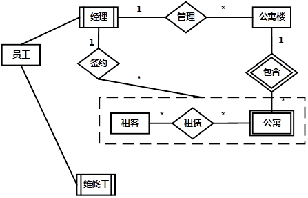
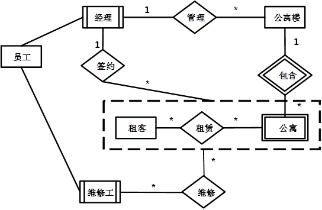
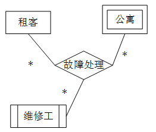

# 2017上半年案例题

- 来源标题: 2017年上半年软件设计师考试应用技术真题（专业解析+参考答案）
- 试卷介绍页: https://wangxiao.xisaiwang.com/tiku2/136/tp170978.html?cid=136
- 练习页: https://wangxiao.xisaiwang.com/tiku2/exam534904533.html
- 题量: 6

## 第1题（案例题）

阅读下列说明和图，回答问题1至问题4，将解答填入答题纸的对应栏内。
【说明】
某医疗器械公司作为复杂医疗产品的集成商，必须保持高质量部件的及时供应。为了实现这一目标，该公司欲开发一采购系统。系统的主要功能如下：
1.检查库存水平。采购部门每天检查部件库存量，当特定部件的库存量降至其订货点时，返回低存量部件及库存量。
2.下达采购订单。采购部门针对低存量部件及库存量提交采购请求，向其供应商（通过供应商文件访问供应商数据）下达采购订单，并存储于采购订单文件中。
3. 交运部件。当供应商提交提单并交运部件时，运输和接收（S/R）部门通过执行以下三步过程接收货物：
（1）验证装运部件。通过访问采购订单并将其与提单进行比较来验证装运的部件，并将提单信息发给 S/R 职员。 如果收货部件项目出现在采购订单和提单上，则已验证的提单和收货部件项目将被送去检验。否则，将S/R职员提交的装运错误信息生成装运错误通知发送给供应商。
（2）检验部件质量。通过访问质量标准来检查装运部件的质量，并将已验证的提单发给检验员。如果部件满足所有质量标准，则将其添加到接受的部件列表用于更新部件库存。如果部件未通过检查，则将检验员创建的缺陷装运信息生成缺陷装运通知发送给供应商。
（3）更新部件库存。库管员根据收到的接受的部件列表添加本次采购数量，与原有库存量累加来更新库存部件中的库存量。标记订单采购完成。
现采用结构化方法对该采购系统进行分析与设计，获得如图1-1 所示的上下文数据流图和图 1-2 所示的 0 层数据流图。

**图****1-1****上下文数据流图**

**      图1-2    0层数据流图**

### 补充题面

【问题1】（5分）
使用说明中的词语，给出图1-1中的实体E1 ~E5
【问题2】（4分）
使用说明中的词语，给出图1-2中的数据存储D1~D4的名称。
【问题3】（4分）
根据说明和图中术语，补充图1-2中缺失的数据流及其起点和终点。
【问题 4】（2分）
用 200 字以内文字，说明建模图 1-1 和图 1-2 是如何保持数据流图平衡。

### 参考答案

【问题1】
E1 供应商
E2 采购部门
E3检验员
E4 库管员
E5 S/R职员
【问题2】
D1 库存表
D2 采购订单表
D3 质量标准表
D4 供应商表
【问题3】
装运错误通知：P3（验证装运部件）-----E1（供应商）
缺陷装运通知：P4（校验部件质量）-----E1（供应商）
已验证的提单和收货部件项目：P3（验证装运部件）------ P4（校验部件质量）
原有库存量：D1（库存表）-----P5（更新部件库存）
【问题4】
父图中某个加工的输入输出数据流必须与其子图的输入输出数据流在数量上和名字上相同。父图的一个输入（或输出）数据流对应于子图中几个输入（或输出）数据流，而子图中组成的这些数据流的数据项全体正好是父图中的这一个数据流。

### 解析

【问题1】
E1提供提单信息给采购系统，所以是供应商，E2发送采购请求给采购系统，所以是采购部门，E3发送缺陷装运信息给采购系统，应该是检验员，E4提供当次采购数量给采购系统，应该是库管员，E5提供装运错误信息，应该是S/R职员，这个题需要注意跟采购部门的关系。
【问题2】
这比问题1要难一点，先看简单的，D4发送供应商信息出去，那么应该在供应商表中，D2发送订单信息出去，接收新订单信息，所以是采购订单表，更新的部件数量存储在D1中，那么D1有部件数量表，是库存表，D3对质量标准进行了定义，应该是质量标准表。
【问题3】
根据父图和子图之间的平衡，在图1-1中流向E1的通知数据流，而图1-2中没有。根据题干分析，由“将S/R职员提交的装运错误信息生成装运错误通知发送给供应商”，“则将检验员创建的缺陷装运信息生成缺陷装运通知发送给供应商”，这里的通知应该分为2条数据流，分别为装运错误通知（P3---E1）和缺陷装运通知（P4---E1）。
装运错误信息生成装运错误通知发送给供应商。所以缺少装运错误通知：P3（验证装运部件）-----E1（供应商）。
将检验员创建的缺陷装运信息生成缺陷装运通知发送给供应商。缺陷装运通知：P4（校验部件质量）-----E1（供应商）。
由题干描述“如果收货部件项目出现在采购订单和提单上，则已验证的提单和收货部件项目将被送去检验”，
因此对于P4检验部件质量加工，缺少数据来自P3验证装运部件的数据流，检验的内容是已验证的提单和收货部件项目：P3（验证装运部件）------ P4（校验部件质量）
由描述“库管员根据收到的接受的部件列表添加本次采购数量，与原有库存量累加来更新库存部件中的库存量”，可知更新部件库存量需要对原有库存量进行累加，这里缺少原有库存量的读取，起点为D1部件信息表，终点为P5更新部件库存。
【问题4】
考查如何保持父图与子图平衡的知识点，父图中某个加工的输入输出数据流必须与其子图的输入输出数据流在数量上和名字上相同。父图的一个输入（或输出）数据流对应于子图中几个输入（或输出）数据流，而子图中组成的这些数据流的数据项全体正好是父图中的这一个数据流。

## 第2题（案例题）

阅读下列说明，回答问题1至问题3，将解答填入答题纸的对应栏内。
【说明】
某房屋租赁公司拟开发一个管理系统用于管理其持有的房屋、租客及员工信息。请根据下述需求描述完成系统的数据库设计。
【需求描述】
1.公司拥有多幢公寓楼，每幢公寓楼有唯一的楼编号和地址。每幢公寓楼中有多套公寓，每套公寓在楼内有唯一的编号（不同公寓楼内的公寓号可相同）。系统需记录每套公寓的卧室数和卫生间数。
2.员工和租客在系统中有唯一的编号（员工编号和租客编号）。
3.对于每个租客，系统需记录姓名、多个联系电话、一个银行账号（方便自动扣房租）、一个紧急联系人的姓名及联系电话。
4.系统需记录每个员工的姓名、一个联系电话和月工资。员工类别可以是经理或维修工，也可兼任。每个经理可以管理多幢公寓楼。每幢公寓楼必须由一个经理管理。系统需记录每个维修工的业务技能，如：水暖维修、电工、木工等。
5.租客租赁公寓必须和公司签订租赁合同。一份租赁合同通常由一个或多个租客（合租）与该公寓楼的经理签订，一个租客也可租赁多套公寓。合同内容应包含签订日期、开始时间、租期、押金和月租金。
【概念模型设计】
根据需求阶段收集的信息，设计的实体联系图（不完整）如图2-1所示。

 ** 图2-1 实体联系图**
【逻辑结构设计】
根据概念摸型设计阶段完成的实体联系图，得出如下关系模式（不完整）：
联系电话（电话号码，租客编号）
租客（租客编号，姓名，银行账号，联系人姓名，联系人电话）
员工（员工编号，姓名，联系电话，类别，月工资， （a））
公寓楼（（b），地址，经理编号）
公寓（楼编号，公寓号，卧室数，卫生间数）
合同（合同编号，租客编号，楼编号，公寓号，经理编号，签订日期，起始日期，租期，（c） ，押金）

### 补充题面

【问题1】（4.5分）
补充图2-1中的“签约”联系所关联的实体及联系类型。
【问题2】（4.5分）
补充逻辑结构设计中的（a）、（b）、（c）三处空缺。
【问题3】（6分）
在租期内，公寓内设施如出现问题，租客可在系统中进行故障登记，填写故障描述，每项故障由系统自动生成唯一的故障编号，由公司派维修工进行故障维修，系统需记录每次维修的维修日期和维修内容。请根据此需求，对图2-1进行补充，并将所补充的ER图内容转换为一个关系模式，请给出该关系模式。

### 参考答案

问题1
  
问题2
（a）业务技能
（b）楼编号
（c）月租金
问题3
  
新增维修关系，维修工维修公寓，关系模式为维修情况。
维修情况（故障编号，租客编号，楼编号，公寓号，员工编号，维修日期，维修内容）
或者：

### 解析

【问题1】
依据题干中“租客租赁公寓必须和公司签订租赁合同。一份租赁合同通常由一个或多个租客（合租）与该公寓楼的经理签订，一个租客也可租赁多套公寓。合同内容应包含签订日期、开始时间租期、押金和月租金。”，说明签约应该是经理与租赁之间的，而一份租赁包括一位或多位租客，以及一个或多个公寓，所以可以考虑为：经理实体集与租赁（由租客和公寓组合成一个大的实体集）之间的联系。（这是数据库中的聚集关系：即将某个联系看作一个整体，用矩形框圈出，作为另一个联系的一端。）
再结合题干中“每个经理管多个公寓楼，每个公寓楼由一个经理管理，和一个楼有多个公寓”的描述，可以判定联系的类型为1:*。
【问题2】
从题干中“系统需记录每个员工的姓名、类别、一个联系电话和月工资。员工类别可以经理或维修工，也可兼任。每个经理可以管理多幢公寓楼。每幢公寓楼必须由一个经理管理。系统需记录每个维修工的业务技能，如：水暖维修、电工、木工等”说明需要记录的属性有：姓名、类别、一个联系电话、月工资和业务技能。因此（a）处应为：业务技能。
题干中“每幢公寓楼有唯一的楼编号和地址以及每幢公寓楼必须由一个经理管理”同时管理联系没有转换成一个独立的关系，也就意味着管理联系被合并到了公寓楼的实体对应的关系中，因此，公寓楼实体对应的关系的属性应该有：楼编号、地址、经理编号；因此（b）处应该为：楼编号。
依据题干中“合同内容应包含签订日期、开始时间租期、押金和月租金。”结合关系合同（合同编号，租客编号，楼编号， 公寓号，经理编号，签订日期，起始日期，租期，（c），押金），可以得出（c）处应该为：月租金。
【问题3】
题干中“租期内，公寓内设施如出现问题，租客可在系统中进行故障登记，填写故障描述，每项故障由系统自动生成唯一的故障编号，由公司派维修工进行故障维修，系统需记录每次维修的维修日期和维修内容”说明，维修应该与租赁（由租客和公寓组合成一个大的实体集）之间存在多对多的联系，同时需要有自己的属性：故障编号、维修日期、维修内容。
维修（故障编号，维修工，维修日期，维修内容，楼编号，公寓号，租客编号）。

## 第3题（案例题）

阅读下列系统设计说明，回答问题1至问题3，将解答填入答题纸的对应栏内。
【说明】
某玩具公司正在开发一套电动玩具在线销售系统，用于向注册会员提供端对端的玩具定制和销售服务。在系统设计阶段，“创建新订单 （New Order）”的设计用例详细描述如表 3-1 所示，候选设计类分类如表 3-2 所示，并根据该用例设计出部分类图如图3-1所示。
表 3-1 创建新订单 (New Order)  设计用例

表3-2 候选设计类分类

图3-1 部分类图
 在订单处理的过程中，会员可以点击“取消订单”取消该订单。如果支付失败，该订单将被标记为挂起状态，可后续重新支付，如果挂起超时30分钟未支付，系统将自动取消该订单。订单支付成功后，系统判断订单类型：（1）对于常规订单，标记为备货状态，订单信息发送到货运部，完成打包后交付快递发货；
（2）对于定制订单，会自动进入定制状态，定制完成后交付快递发货。会员在系统中点击“收货”按钮变为收货状态，结束整个订单的处理流程。根据订单处理过程所设计的状态图如图3-2所示。

**           **图3-2 订单状态图

### 补充题面

【问题1】（6分）
根据表3-1中所标记的候选设计类，请按照其类别将编号 C1~C12 分别填入表 3-2 中的（a）、（b）和（c）处。
【问题2】 （4 分）
根据创建新订单的用例描述，请给出图3-1中X1~X4处对应类的名称。
【问题3】 （5分）
根据订单处理过程的描述，在图 3-2 中S1~S5处分别填入对应的状态名称。

### 参考答案

【问题1】
（a）：C2、C4、C7、C10、C11
（b）：C3、C5、C8
（c）：C1、C6、C9、C12
【问题2】
X1：收货地址
X2：支付方式
X3：邮箱地址
X4：电动玩具定制属性
【问题3】
S1：订单挂起
S2：订单备货
S3：订单定制
S4：订单发货
S5：订单收货

### 解析

【问题1】
表格中给出的类有：
C1会员
C2电动玩具清单及价格
C3计算总价
C4销售清单和会员预先设置个人资料的收货地址和支付方式
C5调用支付系统
C6订单表
C7完整订单信息
C8发送完整订单信息
C9邮箱地址
C10电动玩具清单和定制属性（如尺寸、颜色等）
C11会员当前默认支付方式
C12支付方式
一、实体类
实体类是用于对必须存储的信息和相关行为建模的类。实体对象（实体类的实例）用于保存和更新一些现象的有关信息，例如：事件、人员或者一些现实生活中的对象。实体类通常都是永久性的，它们所具有的属性和关系是长期需要的，有时甚至在系统的整个生存期都需要。实体类的对象表示现实世界中真实的实体。以上实体类有：C1、C6、C9、C12。
二、边界类
边界类是系统内部与系统外部的业务主角之间进行交互建模的类。边界类依赖于系统外部的环境，比如业务主角的操作习惯、外部的条件的限制等。它或者是系统为业务主角操作提供的一个GUI，或者系统与其他的系统之间进行一个交互的接口，所以当外部的GUI变化时，或者是通信协议有变化时，只需要修改边界类就可以了，不用再去修改控制类和实体类。业务主角通过它来与控制对象交互，实现用例的任务。
边界类调用用例内的控制类对象，进行相关的操作。
一个系统可能会有多种边界类：
用户界面类——帮助与系统用户进行通信的类；
系统接口类——帮助与其他系统进行通信的类；
设备接口类——为用来监测外部事件的设备（如传感器）提供接口的类。
接口类分为人和系统两大类，其中人的接口可以是显示屏、窗口、Web窗体、对话框、菜单、列表框、其他显示控制、条形码、二维码或者用户与系统交互的其他方法。
系统接口涉及把数据发送到其他系统，或从其他系统接收数据。
C2、C4、C7、C10、C11都是以清单、列表等形式显示的信息，为接口类。
三、控制类
控制类用于对一个或几个用例所特有的控制行为进行建模，它描述的用例的业务逻辑的实现，控制类的设计与用例实现有着很大的关系。在有些情况下，一个用例可能对应多个控制类对象，或在一个控制类对象中对应着多个用例。它们之间没有固定的对应关系，而是根据具体情况进行分析判断，控制类有效将业务逻辑独立于实体数据和边界控制，专注于处理业务逻辑，控制类会将特有的操作和实体类分离，者有利于实体类的统一化和提高复用性。
当业务主角通过边界类来执行用例的时候，产生一个控制类对象，在用例被执行完后，控制类对象会被销毁。
控制类的特点：独立于环境和用例的实现关联、使用关联实体类或操作实体类对象、专注于业务逻辑的实现。
当然如果用例的逻辑较为简单，可以直接利用边界类来操作实体类，而不必再使用控制类。或者用例的逻辑较为固定，业务逻辑固定不会改变。也可以直接在边界类实现该逻辑。
C3、C5、C8，涉及控制系统的活动流，属于协调类。
【问题2】
本题考查的是对类图的填空，缺失的是4个类名，可以根据题干描述和对应关系找到。首先X1和X2同时与会员订单、配置信息相关，因此应该是支付方式和收货地址，题干中提到了修改支付方式，所以支付方式可以有多种，因此X2为支付方式，X1为收货地址。根据题干描述，会员预先配置的邮箱地址，因此与配置信息相关的另一个类X3应该是邮箱地址。X4与电动玩具相关，根据题干描述，X4应该是定制属性。
【问题3】
本题考查的是对状态图的补充。根据题干描述，递交订单后有两种状态变迁，如果支付失败，则被挂起，如果支付成功，会进入备货或定制状态，因此S1为挂起，S2为备货，S3为定制；交付快递后进入发货状态，S4为发货；会员点击收货按钮进入收货状态，S5为收货。

## 第4题（案例题）

阅读下列说明和C代码，回答问题 1 至问题 3，将解答写在答题纸的对应栏内。
【说明】
假币问题：有n枚硬币，其中有一枚是假币，已知假币的重量较轻。现只有一个天平，要求用尽量少的比较次数找出这枚假币。
【分析问题】
将n枚硬币分成相等的两部分：
（1）当n为偶数时，将前后两部分，即 1…n/2和n/2+1…n，放在天平的两端，较轻的一端里有假币，继续在较轻的这部分硬币中用同样的方法找出假币；
（2）当n为奇数时，将前后两部分，即1..(n -1)/2和(n+1)/2+1…n，放在天平的两端，较轻的一端里有假币，继续在较轻的这部分硬币中用同样的方法找出假币；若两端重量相等，则中间的硬币，即第 (n+1)/2枚硬币是假币。
【C代码】
下面是算法的C语言实现，其中：
coins[]： 硬币数组
first，last：当前考虑的硬币数组中的第一个和最后一个下标
#include <stdio.h>
int getCounterfeitCoin(int coins[]， int first，int last)
{
      int firstSum = 0，lastSum = 0;
      int i;
      if(first==last-1){        /*只剩两枚硬币*/
            if(coins[first] < coins[last])
                  return first;
           return last;
       }
if((last - first + 1) % 2 ==0){        /*偶数枚硬币*/
       for(i = first;i <(   1   );i++){
             firstSum+= coins[i];
        }
        for(i=first + (last-first) / 2 + 1;i < last +1;i++){
            lastSum += coins[i];
        }
        if(    2    ){
            return getCounterfeitCoin(coins,first,first+(last-first)/2;)
        }else{
            return getCounterfeitCoin(coins,first+(last-first)/2+1,last;)
        }
}
else{       /*奇数枚硬币*/
        for(i=first;i<first+(last-first)/2;i++){
               firstSum+=coins[i];
        }
        for(i=first+(last-first)/2+1;i<last+1;i++){
               lastSum+=coins[i];
        }
        if(firstSum<lastSum){
               return getCounterfeitCoin(coins,first,first+(last-first)/2-1);
        }else if(firstSum>lastSum){
               return getCounterfeitCoin(coins,first+(last-first)/2+1,last);
        }else{
            return(   3    )
        }
     }
}

### 补充题面

【问题1】（6分）
根据题干说明，填充C代码中的空（1）-（3）。
【问题2】（6分）
根据题干说明和C代码，算法采用了（   ）设计策略。
函数getCounterfeitCoin的时间复杂度为（   ）（用O表示）。
【问题3】（3分）
若输入的硬币数为30，则最少的比较次数为（  ），最多的比较次数为（   ）。

### 参考答案

【问题1】
（1）first+(last-first)/2+1 或(first+last)/2+1                 
（2）firstSum<lastSum
（3）first+(last-first)/2 或(first+last)/2
【问题2】
（4）分治法
（5）O(lgn)
【问题3】
（6）2     （7）4

### 解析

【问题1】
对于本题代码填空，可以根据算法过程推导。
第一空，缺少循环的停止条件，根据题干描述，在左侧比较应该是到(last+first) / 2为止，由于这里是小于符号，所以第一空填写(last+first) / 2+1，或first + (last-first) / 2 + 1，或其他等价形式。
第二空，缺少判断条件，进入较小部分继续比较，因此本空应该填写firstSum<lastSum。
第三空，缺少返回值，此时既不在左侧，也不在右侧，则当前位置即为目标位置，返回当前位置first+(last-first)/2。
【问题2】
本题采用的是分治法策略。整个算法过程类似于树形结构，所以时间复杂度为O(lgn)。
【问题3】
若输入30个硬币，找假硬币的比较过程为：
第1次：15 比 15，此时能发现假币在15个的范围内。
第2次：7比7，此时，如果天平两端重量相同，则中间的硬币为假币，此时可找到假币，这是最理想的状态。
第3次：3比3，此时若平衡，则能找出假币，不平衡，则能确定假币为3个中的1个。
第4次：1比1，到这一步无论是否平衡都能找出假币，此时为最多比较次数。
因此最少比较2次，最多比较4次。

## 第5题（案例题）

阅读下列说明和 C++代码，将应填入（n）处的字句写在答题纸的对应栏内。
【说明】
某快餐厅主要制作并出售儿童套餐，一般包括主餐（各类比萨）、饮料和玩具，其餐品种类可能不同，但其制作过程相同。前台服务员（Waiter）调度厨师制作套餐。现采用生成器（Builder）模式实现制作过程，得到如图 5-1 所示的类图。

图5-1     类图
【C++代码】
#include<iostream>
#include <string>
using namespace std;
class Pizza {
private:  string parts;
public:
    void setParts(string parts) {       this->parts=parts;   }
    string getParts() {    return parts;     }
};
class PizzaBuilder {
protected:Pizza*  pizza;
public:
    Pizza* getPizza() {    return pizza;   }
    void createNewPizza() { pizza = new Pizza();      }
      （1）;
}
class HawaiianPizzaBuilder :public PizzaBuilder {
public:
       void buildParts() {  pizza->setParts("cross +mild + ham&pineapple");     }
};
class SpicyPizzaBuider: public PizzaBuilder {
public:
       void buildParts() {  pizza->setParts("pan baked +hot + ham&pineapple");      }
}
Class Waiter{
Private:
      PizzaBuilder*  pizzaBuilder;
public:
      void setPizzaBuilder(PizzaBuilder* pizzaBuilder)  {    /*设置构建器*/
         （2）
      }
     Pizza* getPizza() {   return pizzaBuilder->getPizza(); }
     void construct() {      /*构建*/
             pizzaBuilder->createNewPizza();
             （3）
      } 
};
int main(){
        Waiter*waiter=new Waiter();
        PizzaBuilder*hawaiian pizzabuilder=new HawaiianPizzaBuilder()
（4）;
（5）;
cout<< "pizza: "<< waiter->getPizza()->getParts()<< endl;
}
程序的输出结果为:
pizza: cross + mild + ham&pineapple

### 参考答案

（1）virtual void buildParts()=0
（2）this->pizzaBuilder=pizzaBuilder
（3）pizzaBuilder->buildParts()
（4）waiter->setPizzaBuilder(hawaiian_pizzabuilder)
（5）waiter->construct()

### 解析

1.从类图中可以看到这个buildparts函数缺失，又子类中也有buildParts，所以它是虚函数，在扩展类中定义使用。
2.这部分填写设置构建器内容，在waiter类里面，定义pizzaBuilder。
3.从类图知道，构建方法应该是buildParts，当前对象是pizzaBuilder。
4.前面定义了对象waiter，新建hawaiian_pizzabuilder类，调用waiter的set方法。
5.调用waiter类中的construct方法，这样可以得到Pizza对象。

## 第6题（案例题）

阅读下列说明和 Java代码，将应填入 （n）处的字句写在答题纸的对应栏内。
【说明】
某快餐厅主要制作并出售儿童套餐，一般包括主餐（各类比萨）、饮料和玩具，其餐品种类可能不同，但其制作过程相同。前台服务员（Waiter）调度厨师制作套餐。现采用生成器（Builder）模式实现制作过程，得到如图 6-1 所示的类图。

【Java代码】
class Pizza  {
       private String parts；
       public void setParts(String parts) {      this.parts = parts;  }
       public String toString() {       return this.parts;    }
}
abstract class PizzaBuilder {
        protected Pizza pizza;
        public Pizza getPizza() { return pizza;   }
        public void  createNewPizza() {        pizza = new Pizza();      }
        public   (1)    ;
}
class HawaiianPizzaBuilder extends PizzaBuilder {
   public void buildParts() {      pizza.setParts("cross + mild + ham&pineapp1e”};
}
class SpicyPizzaBuilder extends PizzaBuilder {
    public void buildParts() {  pizza.setParts("pan baked + hot + pepperoni&salami");           }
}
class Waiter {
        private PizzaBuilder pizzaBuilder;
        public void setPizzaBuilder(PizzaBuilder pizzaBuilder) {   /*设置构建器*/
                   (  2  )      ;
       }
       public Pizza getPizza(){ return pizzaBuilder.getPizza(); }
      public void construct() {       /*构建*/
             pizzaBuilder.createNewPizza();
                (   3   )     ;
       }
}
Class FastFoodOrdering {
        public static viod mainSting[]args) {
              Waiter waiter = new Waiter();
              PizzaBuilder hawaiian_pizzabuilder = new HawaiianPizzaBuilder();
             (  4  )     ;
             (  5  )     ;
            System.out.println("pizza: " + waiter.getPizza());
       }
}
程序的输出结果为：
Pizza:cross + mild + ham&pineapple

### 参考答案

（1）abstract void buildParts();
（2）this.pizzaBuilder=pizzaBuilder
（3）pizzaBuilder.buildParts()
（4）waiter.setPizzaBuilder(hawaiian_pizzabuilder)
（5）waiter.construct()

### 解析

1.看类图，还差一个buildparts方法，再看下面的类也有buildparts方法，知道应该是abstract void buildParts()。
2.这部分填写设置构建器内容，在waiter类里面，定义pizzaBuilder。
3.从类图知道，构建方法应该是buildParts，当前对象是pizzaBuilder。
4.前面定义了对象waiter，新建hawaiian_pizzabuilder类，调用waiter的set方法。
5.调用waiter类中的construct方法，这样可以得到Pizza。
