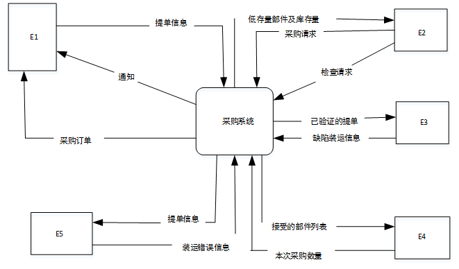
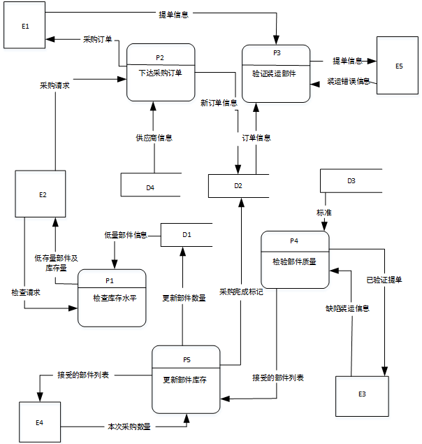
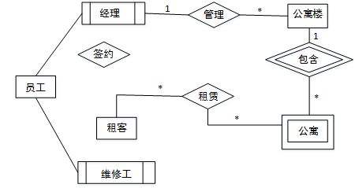
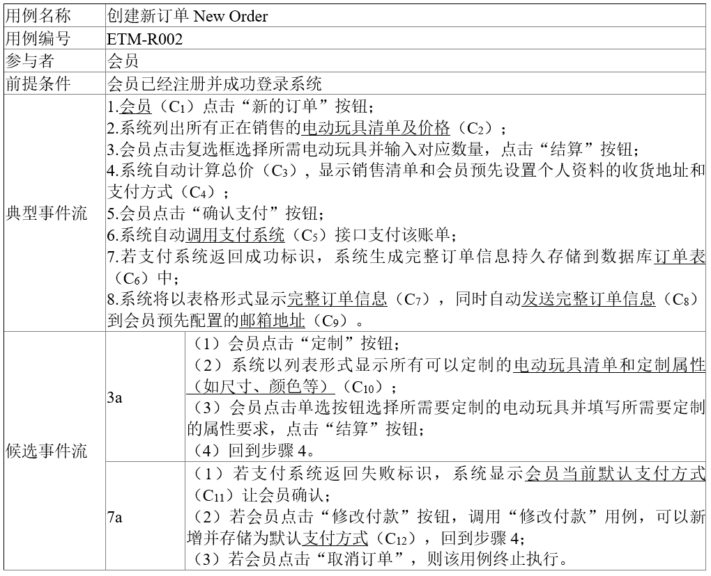
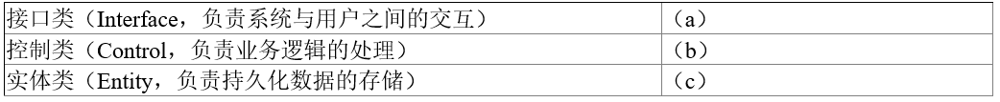
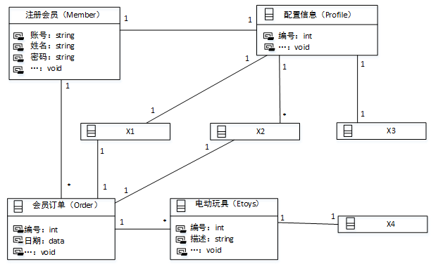
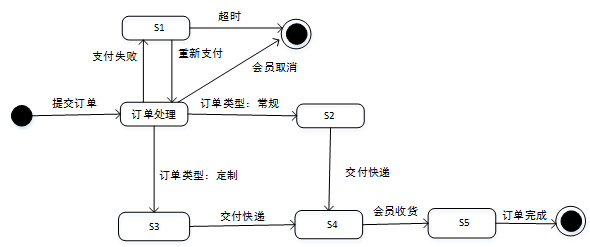
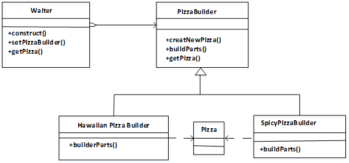
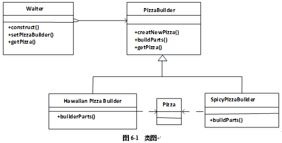

# 2017上半年案例题

- 来源标题: 2017年上半年软件设计师考试应用技术真题（专业解析+参考答案）
- 试卷介绍页: https://wangxiao.xisaiwang.com/tiku2/136/tp170978.html?cid=136
- 练习页: https://wangxiao.xisaiwang.com/tiku2/exam534903467.html
- 题量: 6

## 第1题（案例题）

阅读下列说明和图，回答问题1至问题4，将解答填入答题纸的对应栏内。
【说明】
某医疗器械公司作为复杂医疗产品的集成商，必须保持高质量部件的及时供应。为了实现这一目标，该公司欲开发一采购系统。系统的主要功能如下：
1.检查库存水平。采购部门每天检查部件库存量，当特定部件的库存量降至其订货点时，返回低存量部件及库存量。
2.下达采购订单。采购部门针对低存量部件及库存量提交采购请求，向其供应商（通过供应商文件访问供应商数据）下达采购订单，并存储于采购订单文件中。
3. 交运部件。当供应商提交提单并交运部件时，运输和接收（S/R）部门通过执行以下三步过程接收货物：
（1）验证装运部件。通过访问采购订单并将其与提单进行比较来验证装运的部件，并将提单信息发给 S/R 职员。 如果收货部件项目出现在采购订单和提单上，则已验证的提单和收货部件项目将被送去检验。否则，将S/R职员提交的装运错误信息生成装运错误通知发送给供应商。
（2）检验部件质量。通过访问质量标准来检查装运部件的质量，并将已验证的提单发给检验员。如果部件满足所有质量标准，则将其添加到接受的部件列表用于更新部件库存。如果部件未通过检查，则将检验员创建的缺陷装运信息生成缺陷装运通知发送给供应商。
（3）更新部件库存。库管员根据收到的接受的部件列表添加本次采购数量，与原有库存量累加来更新库存部件中的库存量。标记订单采购完成。
现采用结构化方法对该采购系统进行分析与设计，获得如图1-1 所示的上下文数据流图和图 1-2 所示的 0 层数据流图。

**图****1-1****上下文数据流图**

**      图1-2    0层数据流图**

### 补充题面

【问题1】（5分）
使用说明中的词语，给出图1-1中的实体E1 ~E5
【问题2】（4分）
使用说明中的词语，给出图1-2中的数据存储D1~D4的名称。
【问题3】（4分）
根据说明和图中术语，补充图1-2中缺失的数据流及其起点和终点。
【问题 4】（2分）
用 200 字以内文字，说明建模图 1-1 和图 1-2 是如何保持数据流图平衡。

## 第2题（案例题）

阅读下列说明，回答问题1至问题3，将解答填入答题纸的对应栏内。
【说明】
某房屋租赁公司拟开发一个管理系统用于管理其持有的房屋、租客及员工信息。请根据下述需求描述完成系统的数据库设计。
【需求描述】
1.公司拥有多幢公寓楼，每幢公寓楼有唯一的楼编号和地址。每幢公寓楼中有多套公寓，每套公寓在楼内有唯一的编号（不同公寓楼内的公寓号可相同）。系统需记录每套公寓的卧室数和卫生间数。
2.员工和租客在系统中有唯一的编号（员工编号和租客编号）。
3.对于每个租客，系统需记录姓名、多个联系电话、一个银行账号（方便自动扣房租）、一个紧急联系人的姓名及联系电话。
4.系统需记录每个员工的姓名、一个联系电话和月工资。员工类别可以是经理或维修工，也可兼任。每个经理可以管理多幢公寓楼。每幢公寓楼必须由一个经理管理。系统需记录每个维修工的业务技能，如：水暖维修、电工、木工等。
5.租客租赁公寓必须和公司签订租赁合同。一份租赁合同通常由一个或多个租客（合租）与该公寓楼的经理签订，一个租客也可租赁多套公寓。合同内容应包含签订日期、开始时间、租期、押金和月租金。
【概念模型设计】
根据需求阶段收集的信息，设计的实体联系图（不完整）如图2-1所示。

 ** 图2-1 实体联系图**
【逻辑结构设计】
根据概念摸型设计阶段完成的实体联系图，得出如下关系模式（不完整）：
联系电话（电话号码，租客编号）
租客（租客编号，姓名，银行账号，联系人姓名，联系人电话）
员工（员工编号，姓名，联系电话，类别，月工资， （a））
公寓楼（（b），地址，经理编号）
公寓（楼编号，公寓号，卧室数，卫生间数）
合同（合同编号，租客编号，楼编号，公寓号，经理编号，签订日期，起始日期，租期，（c） ，押金）

### 补充题面

【问题1】（4.5分）
补充图2-1中的“签约”联系所关联的实体及联系类型。
【问题2】（4.5分）
补充逻辑结构设计中的（a）、（b）、（c）三处空缺。
【问题3】（6分）
在租期内，公寓内设施如出现问题，租客可在系统中进行故障登记，填写故障描述，每项故障由系统自动生成唯一的故障编号，由公司派维修工进行故障维修，系统需记录每次维修的维修日期和维修内容。请根据此需求，对图2-1进行补充，并将所补充的ER图内容转换为一个关系模式，请给出该关系模式。

## 第3题（案例题）

阅读下列系统设计说明，回答问题1至问题3，将解答填入答题纸的对应栏内。
【说明】
某玩具公司正在开发一套电动玩具在线销售系统，用于向注册会员提供端对端的玩具定制和销售服务。在系统设计阶段，“创建新订单 （New Order）”的设计用例详细描述如表 3-1 所示，候选设计类分类如表 3-2 所示，并根据该用例设计出部分类图如图3-1所示。
表 3-1 创建新订单 (New Order)  设计用例

表3-2 候选设计类分类

图3-1 部分类图
 在订单处理的过程中，会员可以点击“取消订单”取消该订单。如果支付失败，该订单将被标记为挂起状态，可后续重新支付，如果挂起超时30分钟未支付，系统将自动取消该订单。订单支付成功后，系统判断订单类型：（1）对于常规订单，标记为备货状态，订单信息发送到货运部，完成打包后交付快递发货；
（2）对于定制订单，会自动进入定制状态，定制完成后交付快递发货。会员在系统中点击“收货”按钮变为收货状态，结束整个订单的处理流程。根据订单处理过程所设计的状态图如图3-2所示。

**           **图3-2 订单状态图

### 补充题面

【问题1】（6分）
根据表3-1中所标记的候选设计类，请按照其类别将编号 C1~C12 分别填入表 3-2 中的（a）、（b）和（c）处。
【问题2】 （4 分）
根据创建新订单的用例描述，请给出图3-1中X1~X4处对应类的名称。
【问题3】 （5分）
根据订单处理过程的描述，在图 3-2 中S1~S5处分别填入对应的状态名称。

## 第4题（案例题）

阅读下列说明和C代码，回答问题 1 至问题 3，将解答写在答题纸的对应栏内。
【说明】
假币问题：有n枚硬币，其中有一枚是假币，已知假币的重量较轻。现只有一个天平，要求用尽量少的比较次数找出这枚假币。
【分析问题】
将n枚硬币分成相等的两部分：
（1）当n为偶数时，将前后两部分，即 1…n/2和n/2+1…n，放在天平的两端，较轻的一端里有假币，继续在较轻的这部分硬币中用同样的方法找出假币；
（2）当n为奇数时，将前后两部分，即1..(n -1)/2和(n+1)/2+1…n，放在天平的两端，较轻的一端里有假币，继续在较轻的这部分硬币中用同样的方法找出假币；若两端重量相等，则中间的硬币，即第 (n+1)/2枚硬币是假币。
【C代码】
下面是算法的C语言实现，其中：
coins[]： 硬币数组
first，last：当前考虑的硬币数组中的第一个和最后一个下标
#include <stdio.h>
int getCounterfeitCoin(int coins[]， int first，int last)
{
      int firstSum = 0，lastSum = 0;
      int i;
      if(first==last-1){        /*只剩两枚硬币*/
            if(coins[first] < coins[last])
                  return first;
           return last;
       }
if((last - first + 1) % 2 ==0){        /*偶数枚硬币*/
       for(i = first;i <(   1   );i++){
             firstSum+= coins[i];
        }
        for(i=first + (last-first) / 2 + 1;i < last +1;i++){
            lastSum += coins[i];
        }
        if(    2    ){
            return getCounterfeitCoin(coins,first,first+(last-first)/2;)
        }else{
            return getCounterfeitCoin(coins,first+(last-first)/2+1,last;)
        }
}
else{       /*奇数枚硬币*/
        for(i=first;i<first+(last-first)/2;i++){
               firstSum+=coins[i];
        }
        for(i=first+(last-first)/2+1;i<last+1;i++){
               lastSum+=coins[i];
        }
        if(firstSum<lastSum){
               return getCounterfeitCoin(coins,first,first+(last-first)/2-1);
        }else if(firstSum>lastSum){
               return getCounterfeitCoin(coins,first+(last-first)/2+1,last);
        }else{
            return(   3    )
        }
     }
}

### 补充题面

【问题1】（6分）
根据题干说明，填充C代码中的空（1）-（3）。
【问题2】（6分）
根据题干说明和C代码，算法采用了（   ）设计策略。
函数getCounterfeitCoin的时间复杂度为（   ）（用O表示）。
【问题3】（3分）
若输入的硬币数为30，则最少的比较次数为（  ），最多的比较次数为（   ）。

## 第5题（案例题）

阅读下列说明和 C++代码，将应填入（n）处的字句写在答题纸的对应栏内。
【说明】
某快餐厅主要制作并出售儿童套餐，一般包括主餐（各类比萨）、饮料和玩具，其餐品种类可能不同，但其制作过程相同。前台服务员（Waiter）调度厨师制作套餐。现采用生成器（Builder）模式实现制作过程，得到如图 5-1 所示的类图。

图5-1     类图
【C++代码】
#include<iostream>
#include <string>
using namespace std;
class Pizza {
private:  string parts;
public:
    void setParts(string parts) {       this->parts=parts;   }
    string getParts() {    return parts;     }
};
class PizzaBuilder {
protected:Pizza*  pizza;
public:
    Pizza* getPizza() {    return pizza;   }
    void createNewPizza() { pizza = new Pizza();      }
      （1）;
}
class HawaiianPizzaBuilder :public PizzaBuilder {
public:
       void buildParts() {  pizza->setParts("cross +mild + ham&pineapple");     }
};
class SpicyPizzaBuider: public PizzaBuilder {
public:
       void buildParts() {  pizza->setParts("pan baked +hot + ham&pineapple");      }
}
Class Waiter{
Private:
      PizzaBuilder*  pizzaBuilder;
public:
      void setPizzaBuilder(PizzaBuilder* pizzaBuilder)  {    /*设置构建器*/
         （2）
      }
     Pizza* getPizza() {   return pizzaBuilder->getPizza(); }
     void construct() {      /*构建*/
             pizzaBuilder->createNewPizza();
             （3）
      } 
};
int main(){
        Waiter*waiter=new Waiter();
        PizzaBuilder*hawaiian pizzabuilder=new HawaiianPizzaBuilder()
（4）;
（5）;
cout<< "pizza: "<< waiter->getPizza()->getParts()<< endl;
}
程序的输出结果为:
pizza: cross + mild + ham&pineapple

## 第6题（案例题）

阅读下列说明和 Java代码，将应填入 （n）处的字句写在答题纸的对应栏内。
【说明】
某快餐厅主要制作并出售儿童套餐，一般包括主餐（各类比萨）、饮料和玩具，其餐品种类可能不同，但其制作过程相同。前台服务员（Waiter）调度厨师制作套餐。现采用生成器（Builder）模式实现制作过程，得到如图 6-1 所示的类图。

【Java代码】
class Pizza  {
       private String parts；
       public void setParts(String parts) {      this.parts = parts;  }
       public String toString() {       return this.parts;    }
}
abstract class PizzaBuilder {
        protected Pizza pizza;
        public Pizza getPizza() { return pizza;   }
        public void  createNewPizza() {        pizza = new Pizza();      }
        public   (1)    ;
}
class HawaiianPizzaBuilder extends PizzaBuilder {
   public void buildParts() {      pizza.setParts("cross + mild + ham&pineapp1e”};
}
class SpicyPizzaBuilder extends PizzaBuilder {
    public void buildParts() {  pizza.setParts("pan baked + hot + pepperoni&salami");           }
}
class Waiter {
        private PizzaBuilder pizzaBuilder;
        public void setPizzaBuilder(PizzaBuilder pizzaBuilder) {   /*设置构建器*/
                   (  2  )      ;
       }
       public Pizza getPizza(){ return pizzaBuilder.getPizza(); }
      public void construct() {       /*构建*/
             pizzaBuilder.createNewPizza();
                (   3   )     ;
       }
}
Class FastFoodOrdering {
        public static viod mainSting[]args) {
              Waiter waiter = new Waiter();
              PizzaBuilder hawaiian_pizzabuilder = new HawaiianPizzaBuilder();
             (  4  )     ;
             (  5  )     ;
            System.out.println("pizza: " + waiter.getPizza());
       }
}
程序的输出结果为：
Pizza:cross + mild + ham&pineapple
