# 2017上半年选择题

- 来源标题: 2017年上半年软件设计师考试基础知识真题（专业解析+参考答案）
- 试卷介绍页: https://wangxiao.xisaiwang.com/tiku2/136/tp170958.html?cid=136
- 练习页: https://wangxiao.xisaiwang.com/tiku2/exam534904535.html
- 题量: 54

## 第1题（单选题）

CPU执行算术运算或者逻辑运算时，常将源操作数和结果暂存在（B）中。

- A. 程序计数器（PC）
- B. 累加器（AC）
- C. 指令寄存器（IR）
- D. 地址寄存器（AR）

### 正确答案

B

### 解析

本题考查计算机组成原理中的CPU构成。
答案应该是累加寄存器，用来暂时存放算术逻辑运算部件ALU运算的结果信息。程序计数器（PC）是用于存放下一条指令地址的地方，计算之前就要用到。指令寄存器（IR）保存当前正在执行的一条指令。地址寄存器（AR）用来保存当前CPU所要访问的内存单元的地址。

## 第2题（单选题）

要判断字长为 16 位的整数 a 的低四位是否全为 0，则（A）。

- A. 将a与0x000F进行“逻辑与”运算，然后判断运算结果是否等于0
- B. 将a与0x000F进行“逻辑或”运算，然后判断运算结果是否等于F
- C. 将a与0x000F进行“逻辑异或”运算，然后判断运算结果是否等于0
- D. 将a与0x000F 进行“逻辑与”运算，然后判断运算结果是否等于F

### 正确答案

A

### 解析

本题考查计算机组成原理中数据运算基础知识。
在逻辑运算中，设A和B为两个逻辑变量，当且仅当A和B的取值都为“真”时，A与B的值为“真”；否则A与B的值为“假”。当且仅当A和B的取值都为“假”时，A或B的值为“假”；否则A或B的值为“真”。当且仅当A、B的值不同时，A异或B为“真”，否则A异或B为“假”。 对于16位二进制整数a，其与0000000000001111（即十六进制数000F）进行逻辑与运算后，结果的高12位都为0，低4位则保留a的低4位，因此，当a的低4位全为0时，上述逻辑与运算的结果等于0。

## 第3题（单选题）

计算机系统中常用的输入/输出控制方式有无条件传送、中断、程序查询和 DMA方式等。当采用（D）方式时，不需要 CPU 执行程序指令来传送数据。

- A. 中断
- B. 程序查询
- C. 无条件传送
- D. DMA

### 正确答案

D

### 解析

本题考查DMA方式的特点。在计算机中，实现计算机与外部设备之间数据交换经常使用的方式有无条件传送、程序查询、中断和直接存储器存取（DMA）。其中前三种都是通过CPU执行某一段程序，实现计算机内存与外设间的数据交换。只有DMA方式下，CPU交出计算机系统总线的控制权，不参与内存与外设间的数据交换。而DMA方式工作时，是在DMA控制硬件的控制下，实现内存与外设间数据的直接传送，并不需要CPU参与工作。由于DMA方式是在DMA控制器硬件的控制下实现数据的传送，不需要CPU执行程序，故这种方式传送的速度最快。

## 第4题（单选题）

某系统由下图所示的冗余部件构成。若每个部件的千小时可靠度都为 R ，则该系统的千小时可靠度为（B）。
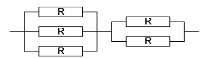

- A. (1-R3)(1-R2)
- B. (1-(1-R)3)(1-(1-R)2)
- C. (1-R3)+(1-R2)
- D. (1-(1-R)3)+(1-(1-R)2)

### 正确答案

B

### 解析

本题考查系统可靠度的概念。
串联部件的可靠度=各部件的可靠度的乘积。
并联部件的可靠度=1-部件失效率的乘积。
题目中给出的系统是“先并后串”。
此时先求出三个R并联可靠度为：1-(1-R)3
然后求出两个R并联可靠度为：1-(1-R)2
最终整个系统的可靠度是两者之积：(1-(1-R)3)×(1-(1-R)2)。

## 第5题（单选题）

已知数据信息为 16 位，最少应附加（C）位校验位，才能实现海明码纠错。

- A. 3
- B. 4
- C. 5
- D. 6

### 正确答案

C

### 解析

本题考查组成原理中的海明校验码。
只要是海明码按合法的方式编码，就能纠错。所以，本题实际上就是求海明码中校验位的长度。海明码中所需要的校验码位数，有这样的规定：假设用N表示添加了校验码位后整个信息的二进制位数，用K代表其中有效信息位数，r表示添加的校验码位，它们之间的关系应满足：2*r *> =K+*r*+1=N。
本题中K=16，则要求2r **> =**16+r+1，根据计算可以得知r的最小值为5。

## 第6题（单选题）

以下关于Cache（高速缓冲存储器）的叙述中，不正确的是（A）。

- A. Cache 的设置扩大了主存的容量
- B. Cache 的内容是主存部分内容的拷贝
- C. Cache 的命中率并不随其容量增大线性地提高
- D. Cache 位于主存与 CPU 之间

### 正确答案

A

### 解析

本题考查计算机组成原理中的高速缓存的基础知识。高速缓存Cache有如下特点：它位于CPU和主存之间，由硬件实现；容量小，一般在几KB到几MB之间；速度一般比主存快5到10倍，由快速半导体存储器制成；其内容是主存内容的副本（所以Cache无法扩大主存的容量），对程序员来说是透明的；Cache既可存放程序又可存放数据。
Cache存储器用来存放主存的部分拷贝（副本）。控制部分的功能是：判断CPU要访问的信息是否在Cache存储器中，若在即为命中，若不在则没有命中。命中时直接对 Cache存储器寻址。未命中时，若是读取操作，则从主存中读取数据，并按照确定的替换原则把该数据写入Cache存储器中。若是写入操作，则将数据写入主存即可。
Cache并不能扩大主存的容量，它与主存是两个部分。

## 第7题（单选题）

HTTPS 使用（B）协议对报文进行封装。

- A. SSH
- B. SSL
- C. SHA-1
- D. SET

### 正确答案

B

### 解析

HTTPS以保密为目标研发，简单讲是HTTP的安全版。其安全基础是SSL协议，全称Hypertext Transfer Protocol over Secure Socket Layer。 它是一个URI scheme，句法类同http:体系。它使用了HTTP，但HTTPS存在不同于HTTP的默认端口及一个加密/身份验证层（在HTTP与TCP之间）。这个协议的最初研发由网景公司进行，提供了身份验证与加密通讯方法，现在它被广泛用于互联网上安全敏感的通讯，例如交易支付方面。 SSL极难窃听，对中间人攻击提供一定的合理保护。严格学术表述HTTPS是两个协议的结合，即传输层SSL＋应用层HTTP。

## 第8题（单选题）

以下加密算法中适合对大量的明文消息进行加密传输的是（D）。

- A. RSA
- B. SHA-1
- C. MD5
- D. RC5

### 正确答案

D

### 解析

本题考查的是信息安全中的加密算法。其中：
        对大量明文进行加密，考虑效率问题，一般采用对称加密。
       RSA是非对称加密算法；SHA-1与MD5属于信息摘要算法；RC-5属于对称加密算法。这些算法中SHA-1与MD5是不能用来加密数据的，而RSA由于效率问题，一般不直接用于大量的明文加密，适合明文加密的，也就只有RC-5了。

## 第9题（单选题）

假定用户A、B 分别在I1和I2两个 CA 处取得了各自的证书，下面（D）是 A、B 互信的必要条件。

- A. A、B互换私钥
- B. A、B互换公钥
- C. I1、I2互换私钥
- D. I1、I2互换公钥

### 正确答案

D

### 解析

本题考查的是信息安全中的CA认证。题目难度较高，但用排除法来分析不难得出结论。首先，在公钥体系中，交换私钥是无论什么情况下都绝对不允许发生的情况，所以A与C选项必然错误。余下的B与D，B选项的做法没意义，要AB互信，其信任基础是建立在CA之上的，如果仅交换AB的公钥并不能解决信任的问题。而I1与I2的公钥交换倒是可以做到互信，因为I1与I2的公钥正是验证CA签名的依据。所以本题应选D。

## 第10题（单选题）

甲软件公司受乙企业委托安排公司软件设计师开发了信息系统管理软件，由于在委托开发合同中未对软件著作权归属作出明确的约定，所以该信息系统管理软件的著作权由（A）享有。

- A. 甲
- B. 乙
- C. 甲与乙共同
- D. 软件设计师

### 正确答案

A

### 解析

其实这个案例涉及委托开发的著作权归属问题：乙企业委托甲公司开发软件。根据《著作权法》第17条的规定，著作权归属由委托人和受托人通过合同约定。合同中未作明确约定的，著作权属于受托人。那么该案例中，软件著作权归属没有明确约定，所以著作权归受托人甲。

## 第11题（单选题）

根据《中华人民共和国商标法》，下列商品中必须使用注册商标的是（D）。

- A. 医疗仪器
- B. 墙壁涂料
- C. 无糖食品
- D. 烟草制品

### 正确答案

D

### 解析

目前根据我国法律法规的规定必须使用注册商标的是烟草类商品。《中华人民共和国烟草专卖法》（1991年6月29日通过，1992年1月1日施行）第二十条规定：“卷烟、雪茄烟和有包装的烟丝必须申请商标注册，未经核准注册的，不得生产、销售。禁止生产、销售假冒他人注册商标的烟草制品。”《中华人民共和国烟草专卖法实施条例》（1997年7月3日施行）第二十四条规定：“卷烟、雪茄烟和有包装的烟丝，应当使用注册商标；申请注册商标，应当持国务院烟草专卖行政主管部门的批准生产文件，依法申请注册。”

## 第12题（单选题）

甲、乙两人在同一天就同样的发明创造提交了专利申请，专利局将分别向各申请人通报有关情况，并提出多种可能采用的解决办法。下列说法中，不可能采用（D）。

- A. 甲、乙作为共同申请人
- B. 甲或乙一方放弃权利并从另一方得到适当的补偿
- C. 甲、乙都不授予专利权
- D. 甲、乙都授予专利权

### 正确答案

D

### 解析

根据“同样的发明创造只能被授予一项专利”的规定，在同一天，两个不同的人就同样的发明创造申请专利的，专利局将分别向各申请人通报有关情况，请他们自己去协商解决这一问题，解决的办法一般有两种，一种是两申请人作为一件申请的共同申请人；另一种是其中一方放弃权利并从另一方得到适当的补偿。都授予专利权是不存在的，所以答案是D。

## 第13题（单选题）

数字语音的采样频率定义为 8kHz，这是因为（A）。

- A. 语音信号定义的频率最高值为4kHz
- B. 语音信号定义的频率最高值为8kHz
- C. 数字语音转输线路的带宽只有8kHz
- D. 一般声卡的采样频率最高为每秒8k次

### 正确答案

A

### 解析

取样：每隔一定时间间隔，取模拟信号的当前值作为样本，该样本代表了模拟信号在某一时刻的瞬间值。经过一系列的取样，取得连续的样本可以用来代替模拟信号在某一区间随时间变化的值。那么究竟以什么样频率取样，就可以从取样脉冲信号中无失真地恢复出原来的信号？尼奎斯特取样定理：如果取样速率大于模拟信号最高频率的2倍，则可以用得到的样本中恢复原来的模拟信号。

## 第14题（单选题）

使用图像扫描仪以300DPI的分辨率扫描一幅3×4英寸的图片，可以得到（D）像素的数字图像。

- A. 300×300
- B. 300×400
- C. 900×4
- D. 900×1200

### 正确答案

D

### 解析

300DPI表示每英寸有300个像素点，3×4英寸的图像，像素点数为：
300×3×300×4=900*1200 。

## 第15题（单选题）

在采用结构化开发方法进行软件开发时，设计阶段接口设计主要依据需求分析阶段的（A/C）。接口设计的任务主要是（  ）。

### 问题1
- A. 数据流图
- B. E-R图
- C. 状态-迁移图
- D. 加工规格说明
### 问题2
- A. 定义软件的主要结构元素及其之间的关系
- B. 确定软件涉及的文件系统的结构及数据库的表结构
- C. 描述软件与外部环境之间的交互关系，软件内模块之间的调用关系
- D. 确定软件各个模块内部的算法和数据结构

### 正确答案

A、C

### 解析

软件设计必须依据对软件的需求来进行，结构化分析的结果为结构化设计提供了最基本的输入信息。从分析到设计往往经历以下流程：
（1）研究、分析和审查数据流图。根据穿越系统边界的信息流初步确定系统与外部接口。
（2）根据数据流图决定问题的类型。数据处理问题通常有两种类型：变换型和事务型。针对两种不同的类型分别进行分析处理。
（3）由数据流图推导出系统的初始结构图。
（4）利用一些启发式原则来改进系统的初始结构图，直到得到符合要求的结构图为止。
（5）根据分析模型中的实体关系图和数据字典进行数据设计，包括数据库设计或数据文件的设计。
（6）在设计的基础上，依据分析模型中的加工规格说明、状态转换图进行过程设计。
所以接口设计的主要依据是数据流图，接口设计的任务主要是描述软件与外部环境之间的交互关系，软件内模块之间的调用关系。

## 第16题（单选题）

某软件项目的活动图如下图所示，其中顶点表示项目里程碑，连接顶点的边表示包含的活动，边上的数字表示活动的持续时间（天），则完成该项目的最少时间为（D/B）天。活动BD和HK最早可以从第（  ）天开始。（活动AB、AE和AC最早从第1天开始）
 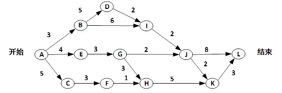

### 问题1
- A. 17
- B. 18
- C. 19
- D. 20
### 问题2
- A. 3和10
- B. 4和11
- C. 3和9
- D. 4和10

### 正确答案

D、B

### 解析

由于在一个项目中时间最长的活动序列，决定着项目最短工期。而时间最长的是ABDIJL  ，需要时间20，所以答案是D。
BD活动在AB活动结束之后便可以开始，同时AB是第1天开始，而非第0天开始，所以最早开始时间为4。HK活动需要在AEGH与ACFH两条路径上的活动均完成之后，才能开始，所以最早开始时间为11。

## 第17题（单选题）

在进行软件开发时，采用无主程序员的开发小组，成员之间相互平等；而主程序员负责制的开发小组，由一个主程序员和若干成员组成，成员之间没有沟通。在一个由8名开发人员构成的小组中，无主程序员组和主程序员组的沟通路径分别是（D）。

- A. 32和8
- B. 32和7
- C. 28和8
- D. 28和7

### 正确答案

D

### 解析

无主程序员组进行沟通时，需要两两沟通，所以沟通路径数为：n×(n-1)/2=8×7÷2=28。
有主程序员组，有问题可以与主程序员沟通，由主程序员负责协调，所以除主程序员自己，其他7人，每人与主程序员建立一条沟通路径，一共7条沟通路径。

## 第18题（单选题）

在高级语言源程序中，常需要用户定义的标识符为程序中的对象命名，常见的命名对象有（B）。
①关键字（或保留字）②变量③函数④数据类型⑤注释

- A. ①②③
- B. ②③④
- C. ①③⑤
- D. ②④⑤

### 正确答案

B

### 解析

关键字和注释不能作为标识符给对象命名。
在高级程序语言中，程序员可以定义变量名、函数名，也可以自定义数据类型，比如以类似于[typedef   原数据类型   新数据类型]格式，定义新的数据类型名。

## 第19题（单选题）

在仅由字符a、b构成的所有字符串中，其中以b结尾的字符串集合可用正规式表示为（D）。

- A. (b|ab)*b
- B. (ab*)*b
- C. a*b*b
- D. (a|b)*b

### 正确答案

D

### 解析

正规式(a|b)*对应的正规集为{ε，a，b，aa，ab，…，所有由a和b组成的字符串}，结尾为b。

## 第20题（单选题）

在以阶段划分的编译过程中，判断程序语句的形式是否正确属于（B）阶段的工作。

- A. 词法分析
- B. 语法分析
- C. 语义分析
- D. 代码生成

### 正确答案

B

### 解析

检查单个词是否正确，属于词法阶段的工作。而识别判断程序语句形式是否正确属于语法分析的工作。

## 第21题（单选题）

某文件管理系统在磁盘上建立了位示图（bitmap），记录磁盘的使用情况。若计算机系统的字长为 32 位，磁盘的容量为 300GB ，物理块的大小为4MB ，那么位示图的大小需要（B）个字。

- A. 1200
- B. 2400
- C. 6400
- D. 9600

### 正确答案

B

### 解析

由于磁盘容量为300GB，物理块大小4MB，所以共有300×1024/4=75×1024块物理块，位示图用每1位表示1个磁盘块的使用情况，1个字是32位，所以1个字可以表示32块物理块使用情况，那么需要75×1024/32＝2400个字表示使用情况。

## 第22题（单选题）

某系统中有3个并发进程竞争资源R，每个进程都需要5个R，那么至少有（B）个R，才能保证系统不会发生死锁。

- A. 12
- B. 13
- C. 14
- D. 15

### 正确答案

B

### 解析

在有限的资源下，要保证系统不发生死锁，则可以按这种逻辑来分析。首先给每个进程分配所需资源数减1个资源，然后系统还有1个资源，则不可能发生死锁。即：3×4+1=13个。

## 第23题（单选题）

某计算机系统页面大小为4K ，进程的页面变换表如下所示。若进程的逻辑地址为2D16H。该地址经过变换后，其物理地址应为（C）。

- A. 2048H
- B. 4096H
- C. 4D16H
- D. 6D16H

### 正确答案

C

### 解析

页面大小为4K，说明页内地址有12位，所以16进制数中的D16H是页内地址，逻辑页号则为2。查表可知物理块号为4，所以物理地址为4D16H。

## 第24题（单选题）

进程P1、P2 、P3、P4 和P5的前趋图如下所示：

若用PV操作控制进程P1、P2、P3、P4和P5并发执行的过程，需要设置5个信号量S1、S2、S3、S4和S5，且信号量S1~S5的初值都等于零。如下的进程执行图中a和b处应分别填写（B/C/A）；c和d处应分别填写（  ）；e和f处应分别填写（  ）。

### 问题1
- A. V (S1)和P(S2)V(S3)
- B. P(S1)和V(S2)V(S3)
- C. V(S1)和V(S2)V(S3)
- D. P(S1)和P(S2)V(S3)
### 问题2
- A. P(S2)和P(S4)
- B. V(S2)和P(S4)
- C. P(S2)和V(S4)
- D. V(S2)和V(S4)
### 问题3
- A. P(S4)和V(S5)
- B. V(S5)和P(S4)
- C. V(S4)和P(S5)
- D. V(S4)和V(S5)

### 正确答案

B、C、A

### 解析

[['本题考查PV操作方面的基本知识。
第一空的正确答案是B，因为P2是P1的后继，所以在P2执行前应测试P1是否执行完，a处填写P （S1），P2执行完V（s2）V（s3）通知后面的进程。
第二空的正确答案是C，c空填写P（s2）测试P2是否执行完成，d空表示P3执行完释放V（s4）通知后面的进程。
第三空的正确答案是A，e空填写P（s4）测试P3是否执行完成，f空表示P4执行完释放V（s5）通知后面的进程。''],['
'],['
']]

## 第25题（单选题）

以下关于螺旋模型的叙述中，不正确的是（D）。

- A. 它是风险驱动的，要求开发人员必须具有丰富的风险评估知识和经验
- B. 它可以降低过多测试或测试不足带来的风险
- C. 它包含维护周期，因此维护和开发之间没有本质区别
- D. 它不适用于大型软件开发

### 正确答案

D

### 解析

螺旋模型是一种演化软件开发过程模型，它兼顾了快速原型的迭代的特征以及瀑布模型的系统化与严格监控。螺旋模型最大的特点在于引入了其他模型不具备的风险分析，使软件在无法排除重大风险时有机会停止，以减小损失。同时，在每个迭代阶段构建原型是螺旋模型用以减小风险的途径。螺旋模型更适合大型的昂贵的系统级的软件应用。

## 第26题（单选题）

以下关于极限编程（XP） 中结对编程的叙述中，不正确的是（D）。

- A. 支持共同代码拥有和共同对系统负责
- B. 承担了非正式的代码审查过程
- C. 代码质量更高
- D. 编码速度更快

### 正确答案

D

### 解析

极限编程是一个轻量级的、灵巧的软件开发方法；同时它也是一个非常严谨和周密的方法。它的基础和价值观是交流、朴素、反馈和勇气；即，任何一个软件项目都可以从四个方面入手进行改善：加强交流；从简单做起；寻求反馈；勇于实事求是。XP是一种近螺旋式的开发方法，它将复杂的开发过程分解为一个个相对比较简单的小周期；通过积极的交流、反馈以及其他一系列的方法，开发人员和客户可以非常清楚开发进度、变化、待解决的问题和潜在的困难等，并根据实际情况及时地调整开发过程。XP提倡结对编程（Pair Programming），而且代码所有权是归于整个开发队伍。其中的结对编程就是一种对代码的审查过程，XP主要解决代码质量低的问题，编码速度不能改变。

## 第27题（单选题）

以下关于C/S（客户机/服务器）体系结构的优点的叙述中，不正确的是（D）。

- A. 允许合理地划分三层的功能，使之在逻辑上保持相对独立性
- B. 允许各层灵活地选用平台和软件
- C. 各层可以选择不同的开发语言进行并行开发
- D. 系统安装、修改和维护均只在服务器端进行

### 正确答案

D

### 解析

C/S体系结构的应用很多，比如我们的QQ，这是需要在本地安装客户端应用程序的，因此D选项不正确。

## 第28题（单选题）

在设计软件的模块结构时，（C）不能改进设计质量。

- A. 尽量减少高扇出结构
- B. 模块的大小适中
- C. 将具有相似功能的模块合并
- D. 完善模块的功能

### 正确答案

C

### 解析

在结构化设计中，系统由多个逻辑上相对独 立的模块组成，在模块划分时需要遵循如下原则：
（1）模块的大小要适中。系统分解时需要考虑模块的规模，过大的模块可能导致系统分解不充分，其内部可能包括不同类型的功能，需要进一步划分，尽量使得各个模块的功能单一；过小的模块将导致系统的复杂度增加，模块之间的调用过于频繁，反而降低了模块的独 立性。一般来说，一个模块的大小使其实现代码在1～2页纸之内，或者其实现代码行数在50～200行之间，这种规模的模块易于实现和维护。
（2）模块的扇入和扇出要合理。一个模块的扇出是指该模块直接调用的下级模块的个数；扇出大表示模块的复杂度高，需要控制和协调过多的下级模块。扇出过大一般是因为缺乏中间层次，应该适当增加中间层次的控制模块；扇出太小时可以把下级模块进一步分解成若干个子功能模块，或者合并到它的上级模块中去。一个模块的扇入是指直接调用该模块的上级模块的个数；扇入大表示模块的复用程度高。设计良好的软件结构通常顶层扇出比较大，中间扇出较少，底层模块则有大扇入。一般来说，系统的平均扇入和扇出系数为3或4，不应该超过7，否则会增大出错的概率。
（3）深度和宽度适当。深度表示软件结构中模块的层数，如果层数过多，则应考虑是否有些模块设计过于简单，看能否适当合并。宽度是软件结构中同一个层次上的模块总数的最大值，一般说来，宽度越大系统越复杂，对宽度影响最大的因素是模块的扇出。在系统设计时，需要权衡系统的深度和宽度，尽量降低系统的复杂性，减少实施过程的难度，提高开发和维护的效率。

## 第29题（单选题）

模块A、B和 C有相同的程序块，块内的语句之间没有任何联系，现把该程序块取出来，形成新的模块D，则模块D的内聚类型为（A/D）内聚。以下关于该内聚类型的叙述中，不正确的是（  ）。

### 问题1
- A. 巧合
- B. 逻辑
- C. 时间
- D. 过程
### 问题2
- A. 具有最低的内聚性
- B. 不易修改和维护
- C. 不易理解
- D. 不影响模块间的耦合关系

### 正确答案

A、D

### 解析

功能内聚：完成一个单一功能，各个部分协同工作，缺一不可。
顺序内聚：处理元素相关，而且必须顺序执行。
通信内聚：所有处理元素集中在一个数据结构的区域上。
过程内聚：处理元素相关，而且必须按特定的次序执行。
瞬时内聚：所包含的任务必须在同一时间间隔内执行（如初始化模块）。
逻辑内聚：完成逻辑上相关的一组任务。
偶然内聚：完成一组没有关系或松散关系的任务。
巧合内聚就是偶然内聚。偶然内聚由于内容都是不相关的，所以必然导致它与外界多个模块有关联，这也使得模块间的耦合度增加。

## 第30题（单选题）

对下图所示的程序流程图进行语句覆盖测试和路径覆盖测试，至少需要（B/D）个测试用例。采用McCabe 度量法计算其环路复杂度为（  ）。
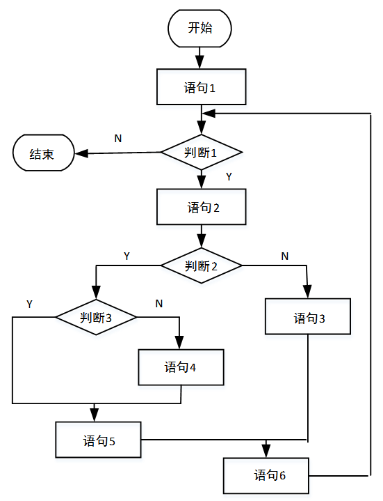

### 问题1
- A. 2和3
- B. 2和4
- C. 2和5
- D. 2和6
### 问题2
- A. 1
- B. 2
- C. 3
- D. 4

### 正确答案

B、D

### 解析

语句覆盖。被测程序的每个语句至少执行一次。是一种很弱的覆盖标准。
路径覆盖。覆盖所有可能的路径。图中不同的路径共有4条：
 （1）语句1→判断1→语句2→判断2→判断3→语句5→语句6→判断1→结束；
 （2）语句1→判断1→语句2→判断2→判断3→语句4→语句5→语句6→判断1→结束；
 （3）语句1→判断1→语句2→判断2→语句3→语句6→判断1→结束；
 （4）语句1→判断1→结束；
要满足语句覆盖的要求，只需要覆盖两条路径就能达到，所以语句覆盖2个用例即可。
路径覆盖需要把程序中的4条路径均覆盖一遍，需要4个用例。
McCabe度量法先画出程序图，然后采用公式V（G）=m-n+2计算环路复杂度，其中m是有向弧的数量，n是结点的数量。
整个程序流程图转化为结点图之后，一共11个结点，13条边，根据环路复杂度公式有：13－11+2＝4。

## 第31题（单选题）

在面向对象方法中，两个及以上的类作为一个类的超类时，称为（A/D），使用它可能造成子类中存在（  ）的成员。

### 问题1
- A. 多重继承
- B. 多态
- C. 封装
- D. 层次继承
### 问题2
- A. 动态
- B. 私有
- C. 公共
- D. 二义性

### 正确答案

A、D

### 解析

多重继承是指一个类有多个父类，正是题目所述的情况。多重继承可能造成混淆的情况，出现二义性的成员。

## 第32题（单选题）

采用面向对象方法进行软件开发，在分析阶段，架构师主要关注系统的（D）。

- A. 技术
- B. 部署
- C. 实现
- D. 行为

### 正确答案

D

### 解析

采用面向对象方法进行软件开发时，在分析阶段，架构师主要关注系统的行为，即系统应该做什么。

## 第33题（单选题）

在面向对象方法中，多态指的是（A）。

- A. 客户类无需知道所调用方法的特定子类的实现
- B. 对象动态地修改类
- C. 一个对象对应多张数据库表
- D. 子类只能够覆盖父类中非抽象的方法

### 正确答案

A

### 解析

多态：同一操作作用于不同的对象，可以有不同的解释，产生不同的执行结果。在运行时，可以通过指向基类的指针，来调用实现派生类中的方法。也就是说客户类其实在调用方法时，并不需要知道特定子类的实现，都会用统一的方式来调用。

## 第34题（单选题）

以下UML图是（C/B/D），图中和表示（  ），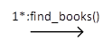和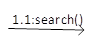表示（  ）。
 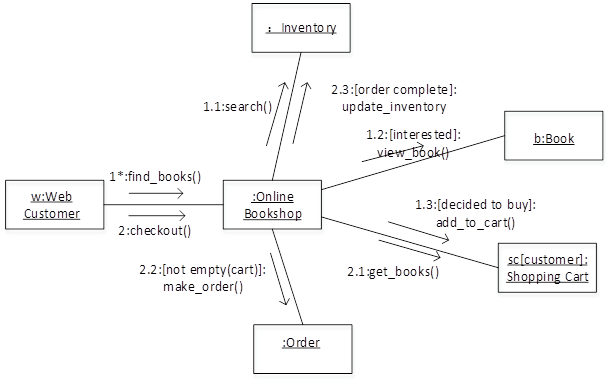

### 问题1
- A. 序列图
- B. 状态图
- C. 通信图
- D. 活动图
### 问题2
- A. 类
- B. 对象
- C. 流名称
- D. 消息
### 问题3
- A. 类
- B. 对象
- C. 流名称
- D. 消息

### 正确答案

C、B、D

### 解析

从图示可以了解到，题目中的图是通信图。通信图描述的是对象和对象之间的关系，即一个类操作的实现。简而言之就是，对象和对象之间的调用关系，体现的是一种组织关系。该图明显表达的是对象与对象之间的关系。其中如果一个框中的名称中带有“:”号，说明这表示的是一个对象，“:”号前的部分是对象名，“:”号后面的部分是类名。而对象之间连线上面的箭头所标识的是对象之间通信的消息。

## 第35题（单选题）

下图所示为观察者（Observer）模式的抽象示意图，其中（A/B）知道其观察者，可以有任何多个观察者观察同一个目标；提供注册和删除观察者对象的接口。此模式体现的最主要的特征是（  ）。
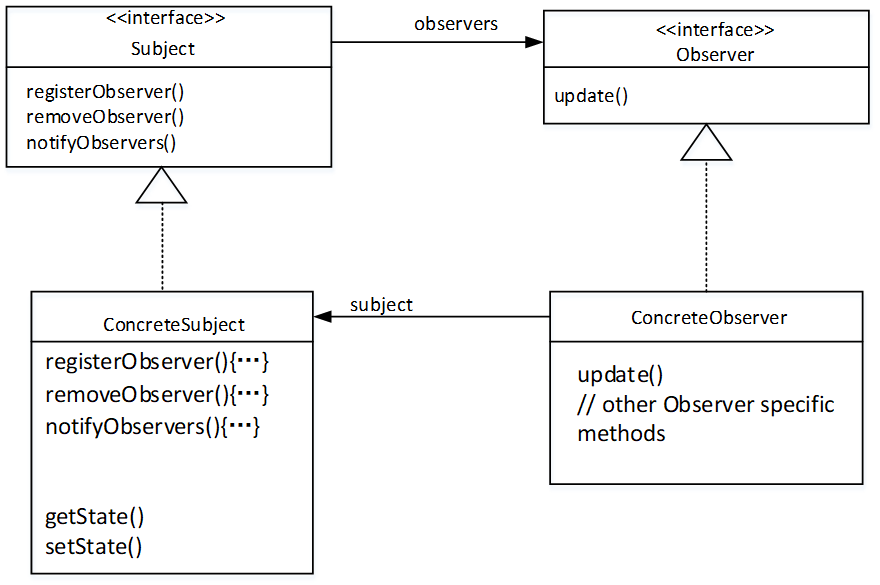

### 问题1
- A. Subject
- B. Observer
- C. Concrete Subject
- D. Concrete Observer
### 问题2
- A. 类应该对扩展开放，对修改关闭
- B. 使所要交互的对象尽量松耦合
- C. 组合优先于继承使用
- D. 仅与直接关联类交互

### 正确答案

A、B

### 解析

Subject（目标）知道它的观察者，可以有任何多个观察者观察同一个目标；提供注册和删除观察者对象的接口。
Observer（观察者）定义一个更新接口，在一个被观察对象改变时应被通知。
Concrete Subject（具体被观察对象）存储具体观察者，Concrete Observer有兴趣的状态。当其状态改变时，发送一个通知给其所有的观察者对象。
Concrete Observer（具体观察者）维护一个对Concrete Subject对象的引用。
观察者模式的最主要特征是使所要交互的对象尽量松耦合。

## 第36题（单选题）

装饰器（Decorator）模式用于（B/D）；外观 （Facade）模式用于（  ）。
①将一个对象加以包装以给客户提供其希望的另外一个接口
②将一个对象加以包装以提供一些额外的行为
③将一个对象加以包装以控制对这个对象的访问
④将一系列对象加以包装以简化其接口

### 问题1
- A. ①
- B. ②
- C. ③
- D. ④
### 问题2
- A. ①
- B. ②
- C. ③
- D. ④

### 正确答案

B、D

### 解析

装饰模式是一种对象结构型模式，可动态地给一个对象增加一些额外的职责，就增加对象功能来说，装饰模式比生成子类实现更为灵活。通过装饰模式，可以在不影响其他对象的情况下，以动态、透明的方式给单个对象添加职责；当需要动态地给一个对象增加功能，这些功能可以再动态地被撤销时可使用装饰模式；当不能采用生成子类的方法进行扩充时也可使用装饰模式。
外观模式是对象的结构模式，要求外部与一个子系统的通信必须通过一个统一的外观对象进行，为子系统中的一组接口提供一个一致的界面，外观模式定义了一个高层接口，这个接口使得这一子系统更加容易使用。

## 第37题（单选题）

某确定的有限自动机（DFA）的状态转换图如下图所示（A 是初态，D、E 是终态），则该 DFA 能识别（C）。
 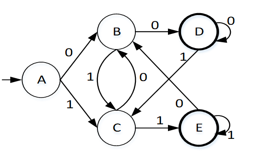

- A. 00110
- B. 10101
- C. 11100
- D. 11001

### 正确答案

C

### 解析

选项中，只有C选项的字符串能被DFA解析。解析路径为：ACEEBDD。

## 第38题（单选题）

函数main()、f()的定义如下所示，调用函数f()时，第一个参数采用传值（call by value）方式，第二个参数采用传引用（call by reference）方式， main() 函数中 “print（x）”执行后输出的值为（B）。
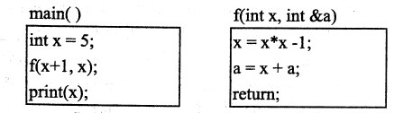

- A. 11
- B. 40
- C. 45
- D. 70

### 正确答案

B

### 解析

当值传递的时候，将原来的参数复制了一份，但是引用传递的时候是将变量本身传了出去，因此，a代表的其实就是x本身，f函数里面的x是另一个变量，只有a的变化才能导致main函数里面的x值的变化。

## 第39题（单选题）

下图为一个表达式的语法树，该表达式的后缀形式为（A）。
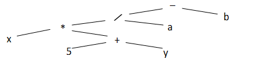

- A. x 5 y +* a / b -
- B. x 5 y a b*+ /-
- C. -/ *+ x 5 y a b
- D. x 5+* y+ a/b-

### 正确答案

A

### 解析

要得到题目中的表达式语法树后缀形式，只需要对树进行后序遍历即可，后序遍历的结果为：x5y+*a/b-。

## 第40题（单选题）

若事务T1对数据 D1 加了共享锁，事务 T2 、T3分别对数据D2 、D3 加了排它锁，则事务T1对数据（D/C）；事务T2对数据（  ）。

### 问题1
- A. D2 、D3 加排它锁都成功
- B. D2 、D3 加共享锁都成功
- C. D2 加共享锁成功 ，D3 加排它锁失败
- D. D2 、D3 加排它锁和共享锁都失败
### 问题2
- A. D1 、D3 加共享锁都失败
- B. D1、D3 加共享锁都成功
- C. D1 加共享锁成功 ，D3 加排它锁失败
- D. D1 加排它锁成功 ，D3 加共享锁失败

### 正确答案

D、C

### 解析

本题考查封锁协议
共享锁（S锁）：又称读锁，若事务T对数据对象A加上S锁，其他事务只能再对A加S锁，而不能加X锁，直到T释放A上的S锁。
排它锁（X锁）：又称写锁。若事务T对数据对象A加上X锁，其他事务不能再对A加任何锁，直到T释放A上的锁。 本题选择D选项。

## 第41题（单选题）

假设关系R < U，F > ，U= {A1，A2， A3}，F = {A1A3→A2，A1A2→A3}，则关系R的各候选关键字中必定含有属性（A）。

- A. A1
- B. A2
- C. A3
- D. A2 A3

### 正确答案

A

### 解析

既能唯一标识元组，包含的字段又是最精炼的，而且如果去掉其中任何一个字段后不再能唯一标识元组，那么就是候选关键字。此题中候选关键字有A1A3，A1A2。所以候选关键字中必有的属性是A1。

## 第42题（单选题）

在某企业的工程项目管理系统的数据库中供应商关系Supp、项目关系Proj和零件关系Part的E-R模型和关系模式如下：
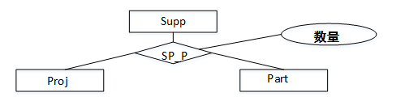
Supp（供应商号，供应商名，地址，电话）
Proj（项目号，项目名，负责人，电话）
Part（零件号，零件名）
其中，每个供应商可以为多个项目供应多种零件，每个项目可由多个供应商供应多种零件。SP_P需要生成一个独 立的关系模式，其联系类型为（A/D/C）
给定关系模式SP_P（供应商号，项目号，零件号，数量）查询至少供应了3个项目（包含3项）的供应商，输出其供应商号和供应零件数量的总和，并按供应商号降序排列。
            SELECT   供应商号，SUM（数量） FROM（  ）
               GROUP BY 供应商号
                         （  ）
                ORDER BY 供应商号DESC;

### 问题1
- A. *:*:*
- B. 1:*:*
- C. 1:1:*
- D. 1:1:1
### 问题2
- A. Supp
- B. Proj
- C. Part
- D. SP_P
### 问题3
- A. HAVING COUNT(项目号) > 2
- B. WHERE COUNT(项目号) > 2
- C. HAVING COUNT(DISTINCT(项目号)) > 2
- D. WHERE COUNT(DISTINCT(项目号)) > 3

### 正确答案

A、D、C

### 解析

[['由于1个供应商对应多个项目供应的多种零件，同时1个项目由多个供应商供应多种零件，所以三个实体都涉及多。这个三元联系为：*:*:*。
后面2个空考查的是SQL语言，目前需要查询的是零件数量总和，很明显在题目的多个关系中只有SP_P有数量这个属性。所以查询只能FROM SP_P。接下来分析如何能把至少供应了3个项目的供应商找出来，此时需要写查询条件。查询条件Where与Having的区别要弄清楚，Where是针对单条记录的判断条件，而Having是针对分组之后的判断条件，此处应选Having，同时，由于考虑到项目号可能重复，所以需要加Distinct关键字以便去掉重复。
''],['
'],['
']]

## 第43题（单选题）

以下关于字符串的叙述中，正确的是（C）。

- A. 包含任意个空格字符的字符串称为空串
- B. 字符串不是线性数据结构
- C. 字符串的长度是指串中所含字符的个数
- D. 字符串的长度是指串中所含非空格字符的个数

### 正确答案

C

### 解析

空格也是一个字符，所以包含空格的字符串不能称为空串，所以字符串的长度是指字符串所有字符个数的总和（包括空格）；字符串是线性结构。

## 第44题（单选题）

已知栈S初始为空，用I表示入栈、O表示出栈，若入栈序列为a1a2a3a4a5，则通过栈S得到出栈序列a2a4a5a3a1的合法操作序列（A）。

- A. IIOIIOIOOO
- B. IOIOIOIOIO
- C. IOOIIOIOIO
- D. IIOOIOIOOO

### 正确答案

A

### 解析

IIOIIOIOOO出栈序列为：a2 a4 a5 a3 a1
IOIOIOIOIO出栈序列为：a1 a2 a3 a4 a5
IOOIIOIOIO无合法出栈序列，因为入栈1个元素，出栈2个元素，会产生错误。
IIOOIOIOOO无合法出栈序列，操作序列中4次入栈6次出栈也是会产生错误的。

## 第45题（单选题）

某二叉树的先序遍历序列为 ABCDEF ，中序遍历序列为BADCFE ，则该二叉树的高度（即层数）为（B）。

- A. 3
- B. 4
- C. 5
- D. 6

### 正确答案

B

### 解析

先序遍历即先根后左子树再右子树，中序遍历为先左子树后根再右子树。先序遍历的最开始结点A即为整棵树的根，结合中序遍历，A结点左侧B即为根节点A的左子树，右侧DCFE则为A的右子树，同理可以得出C为A的右子树的根节点，D为C的左子树，EF为C的右子树，F为E的左子树。可以得到如下图，所以该二叉树的高度为4。
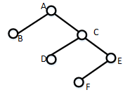

## 第46题（单选题）

对于n个元素的关键字序列{k1,k2,…kn}，当且仅当满足关系ki≤k2i且ki≤k2i+1{i=1、2…[n/2]} 时称其为小根堆（小顶堆）。以下序列中，（D）不是小根堆。

- A. 16,25,40,55,30,50,45
- B. 16,40,25,50,45,30,55
- C. 16,25,39,41,45,43,50
- D. 16,40,25,53,39,55,45

### 正确答案

D

### 解析

选项中的序列是对堆作类似于层次遍历的操作所得的结果。将4个选项还原为堆时，其中D答案中第二个关键字小于第五个关键字，不满足小根堆的条件。

## 第47题（单选题）

在12个互异元素构成的有序数组a[1..12]中进行二分查找（即折半查找，向下取整），若待查找的元素正好等于a[9]，则在此过程中，依次与数组中的（B）比较后，查找成功结束。

- A. a[6]、a[7]、a[8]、a[9]
- B. a[6]、a[9]
- C. a[6]、a[7]、a[9]
- D. a[6]、a[8]、a[9]

### 正确答案

B

### 解析

二分查找的基本思想是将n个元素分成大致相等的两部分，取a[n/2]与x做比较，如果x=a[n/2]，则找到x，算法中止；如果x < a[n/2]，则只要在数组a的左半部分继续搜索x，如果x > a[n/2]，则只要在数组a的右半部搜索x。故查找顺序如下图所示：
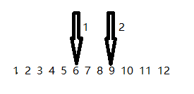

## 第48题（单选题）

某汽车加工工厂有两条装配线L1和L2，每条装配线的工位数均为n（Sij，i=1或2，j= 1，2，…，n），两条装配线对应的工位完成同样的加工工作，但是所需要的时间可能不同（aij，i=1或2，j = 1，2，…，n）。汽车底盘开始到进入两条装配线的时间 (e1，e2) 以及装配后到结束的时间(X1X2)也可能不相同。从一个工位加工后流到下一个工位需要迁移时间(tij，i=1或2，j =2，…n）。现在要以最快的时间完成一辆汽车的装配，求最优的装配路线。
分析该问题，发现问题具有最优子结构。以 L1为例，除了第一个工位之外，经过第j个工位的最短时间包含了经过L1的第j-1个工位的最短时间或者经过L2的第j-1个工位的最短时间，如式(1)。装配后到结束的最短时间包含离开L1的最短时间或者离开L2的最短时间如式（2）。
   
   
由于在求解经过L1和L2的第j个工位的最短时间均包含了经过L1的第j-1个工位的最短时间或者经过L2的第j-1个工位的最短时间，该问题具有重复子问题的性质，故采用迭代方法求解。
该问题采用的算法设计策略是（B/B/A/B），算法的时间复杂度为（  ）。
以下是一个装配调度实例，其最短的装配时间为（  ），装配路线为（  ）。

### 问题1
- A. 分治
- B. 动态规划
- C. 贪心
- D. 回溯
### 问题2
- A. Θ(lgn)
- B. Θ(n)
- C. Θ(n2)
- D. Θ(nlgn)
### 问题3
- A. 21
- B. 23
- C. 20
- D. 26
### 问题4
- A. S11→S12→S13
- B. S11→S22→S13
- C. S21→S12→S23
- D. S21→S22→S23

### 正确答案

B、B、A、B

### 解析

[['本题考查算法基础。
题目看似是非常复杂的，涉及复杂的公式，以及算法逻辑，但如果我们先从后面两个空来分析，问题就简单得多。
求最短装配时间与装配路线，其实是一个求最短路径的过程。此时我们可以把从起点到各个结点的最短路径逐步求出。经过分析得出最短装配路线为：S11→S22→S13，长度为21。
解决了一个实际问题后，再来看所谓的迭代公式，其做法与之前手动求最短路径一致，算法是用一个数组将起点到各个结点的最短路径逐个求出，用已求出的最短路径来分析后面的最短路径，所以这符合动态规划法的特征，算法策略应是动态规划法。而算法的复杂度为Θ(n)，因为用一个单重循环就可以解决这个问题。
''],['
'],['
'],['
']]

## 第49题（单选题）

在浏览器地址栏输入一个正确的网址后，本地主机将首先在（B）查询该网址对应的IP地址。

- A. 本地DNS缓存
- B. 本机hosts文件
- C. 本地DNS服务器
- D. 根域名服务器

### 正确答案

B

### 解析

域名查询记录：先HOSTS表，再本地DNS缓存，然后再查找本地DNS服务器，再根域名服务器、顶级域名服务器、权限域名服务器。

## 第50题（单选题）

下面关于Linux目录的描述中，正确的是（C）。

- A. Linux只有一个根目录，用 “/root ”表示
- B. Linux中有多个根目录，用“/”加相应目录名称表示
- C. Linux中只有一个根目录，用“/”表示
- D. Linux 中有多个根目录，用相应目录名称表示

### 正确答案

C

### 解析

Linux中只有一个根目录，用“/”表示。

## 第51题（单选题）

以下关于TCP/IP 协议栈中协议和层次的对应关系正确的是（C）。

- A. 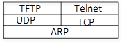
- B. 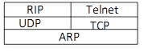
- C. 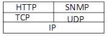
- D. 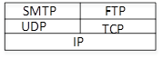

### 正确答案

C

### 解析

1、注意TCP和UDP都是基于IP协议的传输层协议，因此本题A、B选项不正确。
2、由下图可知，HTTP是基于TCP的应用层协议，SNMP是基于UDP的应用层协议，本题选择C选项。
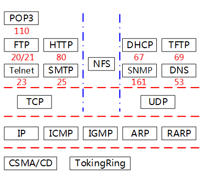

## 第52题（单选题）

在异步通信中，每个字符包含1位起始位、7位数据位和2位终止位，若每秒钟传送500个字符，则有效数据速率为（C）。

- A. 500b/s
- B. 700b/s
- C. 3500b/s
- D. 5000b/s

### 正确答案

C

### 解析

每个字符的位数为1+7+2=10，每秒传输500个字符，故每秒传输的位数为10×500=5000，即码元速率为5000波特，每个字符中的有效数据占7位，因此每秒的有效数据为3500bit，则有效数据速率为3500b/s。

## 第53题（单选题）

以下路由策略中，依据网络信息经常更新路由的是（D）。

- A. 静态路由
- B. 洪泛式
- C. 随机路由
- D. 自适应路由

### 正确答案

D

### 解析

动态路由选择算法就是自适应路由选择算法，依靠当前网络的状态信息进行决策，从而使路由选择结果在一定程度上适应网络拓扑结构和通信量的变化，需要依据网络信息经常更新路由。

## 第54题（单选题）

The beauty of software is in its function,in its internal structure,and in the way in which it is created by a team. To a user,a program with just the right features presented through an intuitive and（1 ）interface is beautiful.To a software designer,an internal structure that is partitioned in a simple and intuitive manner,and that minimizes internal coupling is beautiful.To developers and managers ,a motivated team of developers making significant progress every week,and producing defect-free code,is beautiful.There is beauty on all these levels.
Our world needs software——lots of software. Fifty years ago software was something that ran in a few big and expensive machines. Thirty years ago it was something that ran in most companies and industrial settings. Now there is software running in our cell phones,watches,appliances,automobiles,toys,and tools. And need for new and better software never（2）.As our civilization grows and expands,as developing nations build their infrastructures,as developed nations strive to achieve ever greater efficiencies,the need for more and more Software（3 ）to increase. It would be a great shame if,in all that software,there was no beauty.
We know that software can be ugly. We know that it can be hard to use,unreliable ,and carelessly structured. We know that there are software systems whose tangled and careless internal structures make them expensive and difficult to change. We know that there are software systems that present their features through an awkward and cumbersome interface. We know that there are software systems that crash and misbehave. These are（4）systems. Unfortunately,as a profession,software developers tend to create more ugly systems than beautiful ones.
There is a secret that the best software developers know. Beauty is cheaper than ugliness. Beauty is faster than ugliness. A beautiful software system can be built and maintained in less time,and for less money ,than an ugly one. Novice software developers don't understand this. They think that they have to do everything fast and quick. They think that beauty is（5） .No! By doing things fast and quick,they make messes that make the software stiff,and hard to understand,beautiful systems are flexible and easy to understand. Building them and maintaining them is a joy. It is ugliness that is impractical.Ugliness will slow you down and make your software expensive and brittle. Beautiful systems cost the least build and maintain,and are delivered soonest.

### 问题1
- A. Simple
- B. Hard
- C. Complex
- D. duplicated
### 问题2
- A. happens
- B. exists
- C. stops
- D. starts
### 问题3
- A. starts
- B. continues
- C. appears
- D. stops
### 问题4
- A. practical
- B. useful
- C. beautiful
- D. ugly
### 问题5
- A. impractical
- B. perfect
- C. time-wasting
- D. practical

### 正确答案

A、C、B、D、A

### 解析

[['软件的优点在于其功能，内部结构以及由团队创建的方式。对于用户来说，通过直观和（1）界面呈现的正确功能的程序是美丽的。对于软件设计师来说，分割的内部结构是一种简单而直观的方式，最小化内部耦合是美观的。对于开发人员和经理来说，一个积极的开发团队每周都取得重大进展，并且生产无缺陷的代码是美丽的。所有这些级别都有美丽。
我们的世界需要大量软件。五十年前，软件是在大多数公司和工业环境中运行的。现在软件存在在我们的手机，手表，电器，汽车，玩具和工具中。并且对新的和更好的软件的需求永远不会（2）。随着我们文明的发展和壮大，随着发展中国家建设基础设施，发达国家努力实现更高的效率，越来越多的软件需求（3）增长。如果在所有的软件中没有美丽的话，这将是一个很大的耻辱。
我们知道软件可能是丑的。我们知道它可能很难使用，不可靠，粗心大意的结构。我们知道有一些软件系统的纠结和粗心的内部结构使得它们变得昂贵和难以改变。我们知道有一些软件系统通过尴尬和繁琐的界面来呈现其功能。我们知道有些软件系统崩溃和行为不端。这些都是（4）系统。不幸的是，作为一个专业，软件开发人员倾向于创建丑陋的系统比美丽的系统更多。
这是最好的软件开发者知道的秘密。美丽的比丑陋的更便宜。美丽的比丑陋的更快。一个美丽的软件系统相当于一个丑陋的系统来说，建立和维护要花的时间与金钱会少得多。很多新手软件开发人员不明白这一点。他们认为做每一个事情必须快速，更快速。他们认为美是（5）。没有！通过快速，快速地做事情，他们使软件变得僵硬，难以理解。美观的系统灵活易懂。建立和维护它们是一种快乐。丑陋是不切实际的。丑陋会减慢你的速度，会使你的软件昂贵而脆弱。美观的系统成本最低，建立和维护成本最低，交货时间最短。
选项翻译：
1.A、simple（简单） B、hard（困难） C、complex（复杂） D、duplicated（被复制）
2.A、happens（发生） B、exists（存在） C、stops（停止） D、starts（开始）
3.A、starts （开始） B、continues（持续） C、appears（出现） D、stops（停止）
4.A、practical （实用的） B、useful（有用的） C、beautiful（美丽的） D、ugly（丑陋的）
5.A、impractical（不实用的） B、perfect（完美的） C、time-wasting（浪费时间） D、practical（实用的）
1.A
解析：The beauty of software is in it's function, in it's internal structure, and in the way in which it is created by a team. To a user, a program with just the right features presented through an intuitive and simple interface, is beautiful.
2.C
解析：And need for new and better software never stops.
3.B
解析：As our civilization grows and expands, as developing nations build their infrastructures, as developed nations strive to achieve ever greater efficiencies, the need for more and more software continues to increase.
4.D
解析：These are ugly systems
5.A
解析：They think that beauty is impractical
'],['
'],['
'],['
'],['
']]
