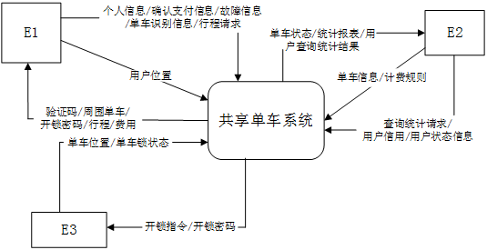
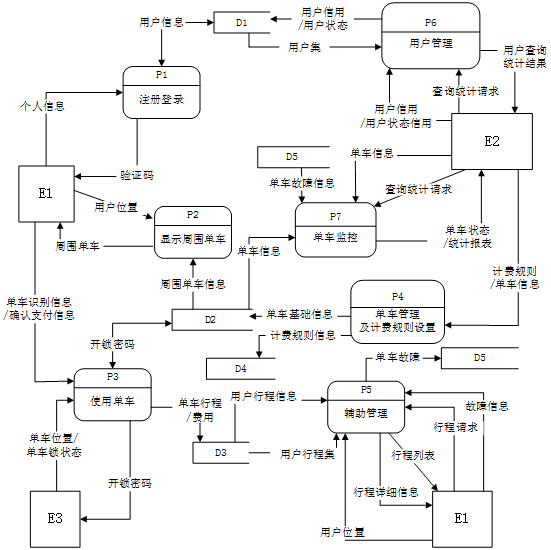
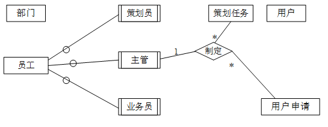
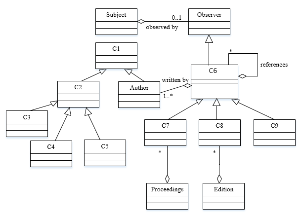
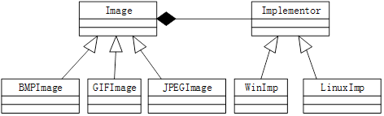

# 2017下半年案例题

- 来源标题: 2017年下半年软件设计师考试应用技术真题（专业解析+参考答案）
- 试卷介绍页: https://wangxiao.xisaiwang.com/tiku2/136/tp181382.html?cid=136
- 练习页: https://wangxiao.xisaiwang.com/tiku2/exam534903465.html
- 题量: 6

## 第1题（案例题）

阅读下列说明和图，回答问题1至问题4 ，将解答填入答题纸的对应栏内。
【说明】
某公司拟开发一个共享单车系统，采用北斗定位系统进行单车定位，提供针对用户的APP以及微信小程序、基于Web的管理与监控系统。该共享单车系统的主要功能如下。
1）用户注册登录。用户在APP端输入手机号并获取验证码后进行注册，将用户信息进行存储。用户登录后显示用户所在位置周围的单车。
2） 使用单车。
①扫码/手动开锁。通过扫描二维码或手动输入编码获取开锁密码，系统发送开锁指令进行开锁，系统修改单车状态，新建单车行程。
②骑行单车。单车定时上传位置，更新行程。
③锁车结账。用户停止使用或手动锁车并结束行程后，系统根据已设置好的计费规则及使用时间自动结算，更新本次骑行的费用并显示给用户，用户确认支付后，记录行程的支付状态。系统还将重置单车的开锁密码和单车状态。
3）辅助管理。
①查询。用户可以查看行程列表和行程详细信息。
②报修。用户上报所在位置或单车位置以及单车故障信息并进行记录。
4）管理与监控。
①单车管理及计费规则设置。商家对单车基础信息、状态等进行管理，对计费规则进行设置并存储。
②单车监控。对单车、故障、行程等进行查询统计。
③用户管理。管理用户信用与状态信息，对用户进行查询统计。
现采用结构化方法对共享单车系统进行分析与设计，获得如图1-1 所示的上下文数据流图和图 1-2 所示的 0 层数据流图。

**图1-1  上下文数据流图**

**图1-2  0层数据流图**

### 补充题面

【问题1】（3分）
使用说明中的词语，给出图 1-1 中的实体 E1~E3 的名称。
【问题2】（5分）
使用说明中的词语，给出图 1-2 中的数据存储 D1~D5 的名称。
【问题3】（5分）
根据说明和图中术语及符号，补充图1-2 中缺失的数据流及其起点和终点.
【问题4】（2分）
根据说明中术语，说明“使用单车”可以分解为哪些子加工？

## 第2题（案例题）

阅读下列说明，回答问题1至问题4，将解答填入答题纸的对应栏内。
【说明】
M公司为了便于开展和管理各项业务活动，提高公司的知名度和影响力，拟构建一个基于网络的会议策划系统。
【需求分析结果】
该系统的部分功能及初步需求分析的结果如下 ：
（1）M公司旗下有业务部、策划部和其他部门。部门信息包括部门号、部门名、主管、联系电话和邮箱号；每个部门只有一名主管，只负责管理本部门的工作，且主管参照员工关系的员工号；一个部门有多名员工，每名员工属于且仅属于一个部门。
（2）员工信息包括员工号、姓名、职位、联系方式和薪资。职位包括主管、业务员、 策划员等。业务员负责受理用户申请，设置受理标志。一名业务员可以受理多个用户申请，但一个用户申请只能由一名业务员受理。
（3）用户信息包括用户号、用户名、银行账号、电话、联系地址。用户号唯一标识用户信息中的每一个元组。
（4） 用户申请信息包括申请号、用户号、会议日期、天数、参会人数、地点、预算和受理标志。申请号唯一标识用户申请信息中的每一个元组，且一个用户可以提交多个申请，但一个用户申请只对应一个用户号。
（5）策划部主管为已受理的用户申请制定会议策划任务。策划任务包括申请号、任务明细和要求完成时间。申请号唯一标识策划任务的每一个元组。一个策划任务只对应一个已受理的用户申请，但一个策划任务可由多名策划员参与执行，且一名策划员可以参与执行多项策划任务。
【概念模型设计】
根据需求阶段收集的信息，设计的实体联系图（不完整）如图 2-1 所示。

图2-1
【关系模型设计】
部门（部门号，部门名，部门主管，联系电话，邮箱号）
员工（员工号，姓名，（a），联系方式，薪资）
用户（用户名，（b），电话，联系地址）
用户申请（申请号，用户号，会议日期，天数，参会人数，地点，受理标志，（c））
策划任务（申请号，任务明细，（d）） 
执行（申请号，策划员，实际完成时间，用户评价）

### 补充题面

【问题1】（5分）
根据问题描述，补充五个联系，完善图2-1的实体联系图。联系名可用联系1、联系2、联系3、联系4和联系5，联系的类型为1:1、1:n和m:n（或1:1、1:*和*:*）。
【问题2】（4分）
根据题意，将关系模式中的空（a）~（d）补充完整，并填入答题纸对应的位置上。
【问题3】（4分）
给出“用户申请”和“策划任务”关系模式的主键和外键。
【问题4】（2分）
请问“执行”关系模式的主键为全码的说法正确吗？为什么？

## 第3题（案例题）

阅读下列说明，回答问题1问题3，将解答填入答题纸的对应栏内。
【说明】
某大学拟开发一个用于管理学术出版物（Publication）的数字图书馆系统，用户可以从该系统查询或下载已发表的学术出版物。系统的主要功能如下：
1.登录系统。系统的用户（User）仅限于该大学的学生（Student）、教师（Faculty）和其他工作人员（Staff）。在访问系统之前，用户必须使用其校园账户和密码登录系统。
2. 查询某位作者（Author）的所有出版物。系统中保存了会议文章（Conf Paper）、期刊文章（JournalArticle）和校内技术报告（TechReport）等学术出版物的信息，如题目、作者以及出版年份等。除此之外，系统还存储了不同类型出版物的一些特有信息：
（1）对于会议文章，系统还记录了会议名称、召开时间以及召开地点；
（2）对于期刊文章，系统还记录了期刊名称、出版月份、期号以及主办单位；
（3）对于校内技术报告，系统记录了由学校分配的唯一ID。
3. 查询指定会议集（Proceedings）或某个期刊特定期（Edition）的所有文章。会议集包含了发表在该会议（在某个特定时间段、特定地点召开）上的所有文章。期刊的每一期在特定时间发行，其中包含若干篇文章。
4.下载出版物。系统记录每个出版物被下载的次数。
5.查询引用了某篇出版物的所有出版物。在学术出版物中引用他人或早期的文献作为相关工作或背景资料是很常见的现象。用户也可以在系统中为某篇出版物注册引用通知，若有新的出版物引用了该出版物，系统将发送电子邮件通知该用户。
现在采用面向对象方法对该系统进行开发，得到系统的初始设计类图如图3-1所示。
图3-1 初始设计类图

### 补充题面

【问题1】（9分）
根据说明中的描述，给出图3-1中C1~C9所对应的类名。
【问题2】（4分）
根据说明中的描述，给出图3-1中类C6~C9的属性。
【问题3】（2分）
图3-1中包含了哪种设计模式？实现的是该系统的哪个功能？

## 第4题（案例题）

阅读下列说明和C代码，回答问题1至问题2，将解答写在答题纸的对应栏内。
【说明】
一个无向连通图G点上的哈密尔顿（Hamilton）回路是指从图G上的某个顶点出发，经过图上所有其他顶点一次且仅一次，最后回到该顶点的路径。一种求解无向图上哈密尔顿回路算法的基本思想如下：
假设图G存在一个从顶点V0出发的哈密尔顿回路 V0 —— V1——V2——V3——...——Vn-1——V0。算法从顶点V0出发，访问该顶点的一个未被访问的邻接顶点V1，接着从顶点V1出发，访问V1一个未被访问的邻接顶点V2，…；对顶点Vi，重复进行以下操作：访问Vi的一个未被访问的邻接接点Vi+1；若Vi的所有邻接顶点均已被访问，则返回到顶点Vi-1，考虑Vi-1的下一个未被访问的邻接顶点，仍记为Vi；直到找到一条哈密尔顿回路或者找不到哈密尔顿回路，算法结束。
【C代码】
下面是算法的C语言实现。
（1）常量和变量说明
n：图G中的顶点数
c[ ] [ ]：图G的邻接矩阵
k：统计变量，当期已经访问的顶点数为k+1
x［k］：第k个访问的顶点编号，从0开始
visited［x［k］］：第k个顶点的访问标志，0表示未访问，1表示已访问
（2）C程序
#include <stido.h>
#include <stidb.h>
#define MAX 100
void Hamilton（int n,int x［MAX] , int c[MAX][MAX]）｛
int i;
int visited[MAX];
int k;
  /*初始化x数组和visited数组*/
for （i=0:i<n;i++）｛
      x[i]=0;
      visited [i]=0;
｝
/*访问起始顶点*/
k=0
（1）；
x[0]=0 ;
k=k+1 ;
/*访问其他顶点*/
while（k>=0）｛
    x[k]=x[k]+1;
    while（x[k]<n）｛
         if （（2）&& c [x[k-1]] [x[k]] ==1）｛/*邻接顶点x[k]未被访问过*/
            break；
         ｝else｛
               x[k] = x[k] +1
         ｝
     ｝
       if（x[k] <n&&k==n-1&&（3）)｛ /*找到一条哈密尔顿回路*/
           for （k=0;k<n;k++）｛
                   printf（〝%d--〝,x[k] ) ;  /*输出哈密尔顿回路*/
           ｝
           printf（〝%d\n〝,x[0] ) ;
           return；
｝else if (x[k]<n&&k<n-1）｛/*设置当前顶点的访问标志，继续下一个顶点*/
         （4）
          k=k+1;
｝else｛/*没有未被访问过的邻接顶点，回退到上一个顶点*/
         x[k]=0；
         visited [x[k]]=0；
         （5）；
    ｝
｝
｝

### 补充题面

【问题1】（10分）
根据题干说明。填充C代码中的空（1）~（5）。
【问题2】（5分）
根据题干说明和C代码，算法采用的设计策略为（6），该方法在遍历图的顶点时，采用的是（7）方法（深度优先或广度优先）。

## 第5题（案例题）

阅读下列说明和C++代码，将应填入（n）处的字句写在答题纸的对应栏内。
【说明】
某图像预览程序要求能够查看BMP、JPEG和GIF三种格式的文件，且能够在Windows和Linux两种操作系统上运行。程序需具有较好的扩展性以支持新的文件格式和操作系统。为满足上述需求并减少所需生成的子类数目，现采用桥接（Bridge）模式进行设计，得到如图5-1所示的类图。
 
 **图5-1**

### 补充题面

【C++代码】
#include<iostream>
#include<string>
using namespace std;
class Matrix {  //  各种格式的文件最终都被转化为像素矩阵
         //  此处代码省略
};
class Implementor {
public:
                （1）;   //  显示像素矩阵 m
};
class WinImp:public Implementor {
public:
        void doPaint(Matrix m) { /*调用 Windows 系统的绘制函数绘制像素矩阵*/ }
};
class LinuxImp:public Implementor{
public:
        void doPaint(Matrix m) { /*调用 Linux 系统的绘制函数绘制像素矩阵*/ }
};
class Image {
public:
       void setImp(Implementor*imp)  {this->imp = imp;}
       virtual viod parseFile(string fileName) = 0;
protected:
        Implementor*imp;
};
class BMPImage:public Image{
         //此处省略代码
};
class GIFImage:public Image{
public:
        void  parseFile(string fileName) {
            //此处解析 GIF 文件并获得一个像素矩阵对象m
              （2）;显示像素矩阵m
        }
};
class JPEGImage:public Image{
         //  此处代码省略
};
int main() {
        //  在Linux操作系统上查看 demo.gif 图像文件
        Image*image=（3）;
        Implementor*imageImp=（4）;
        （5）;
        image->parseFile("demo.gif");
        return 0;
}

## 第6题（案例题）

阅读下列说明和Java代码，将应填入（n）处的字句写在答题纸的对应栏内。
【说明】
某图像预览程序要求能够查看BMP、JPEG和GIF三种格式的文件，且能够在Windows和Linux两种操作系统上运行。程序需具有较好的扩展性以支持新的文件格式和操作系统。为满足上述需求并减少所需生成的子类数目，现采用桥接（Bridge）模式进行设计，得到如图6-1所示的类图。

**图6-1**

### 补充题面

【Java代码】
import java.util.*;
class Matrix{  //  各种格式的文件最终都被转化为像素矩阵
         //  此处代码省略
};
abstract class Implementor{
        public        （1）        ;   //  显示像素矩阵 m
};
class WinImp extends Implementor{
         public void doPaint(Matrix m){   //  调用 Windows 系统的绘制函数绘制像素矩阵
         }
};
class LinuxImp extends Implementor{
        public void doPaint(Matrix m){   //  调用 Linux 系统的绘制函数绘制像素矩阵
        }
};
abstract class Image {
        public void setImp(Implementor imp) { this.imp = imp; }
        public abstract void parseFile(String fileName);
        protected Implementor imp;
};
class BMPImage extends Image{
         //  此处代码省略
};
class GIFImage extends Image{
        public void parseFile(String fileName) {
             //  此处解析 BMP 文件并获得一个像素矩阵对象 m
                       （2）   ;   //  显示像素矩阵 m
        }
};
class JPEGImage extends Image{
         //此处代码省略
}；
class Main{
         public static void main(String[]args) {
               //  在 Linux 操作系统上查看 demo.gif 图像文件
               Image image=       （3）     ;
               Implementor imageImp=     （4）     ;
                      （5）     ;
               image.parseFile("demo.gif");
         }
}
