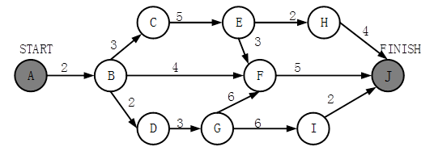
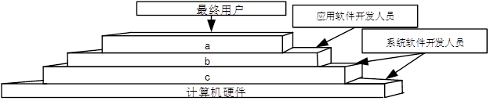
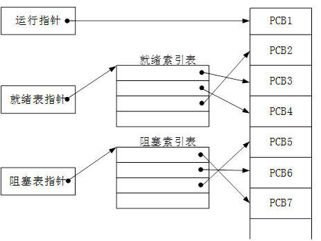
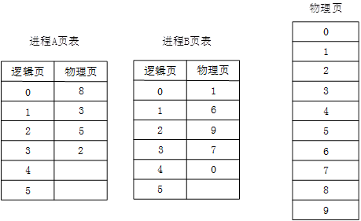
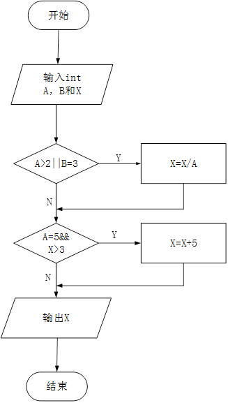
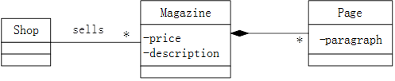
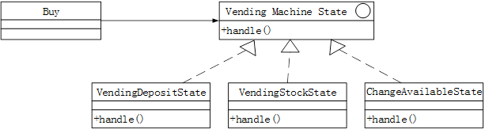
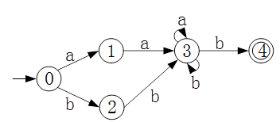
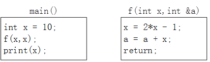
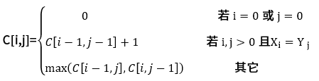

# 2017下半年选择题

- 来源标题: 2017年下半年软件设计师考试基础知识真题（专业解析+参考答案）
- 试卷介绍页: https://wangxiao.xisaiwang.com/tiku2/136/tp181383.html?cid=136
- 练习页: https://wangxiao.xisaiwang.com/tiku2/exam534903452.html
- 题量: 55

## 第1题（单选题）

在程序的执行过程中，Cache与主存的地址映射是由（  ）完成的。

- A. 操作系统
- B. 程序员调度
- C. 硬件自动
- D. 用户软件

## 第2题（单选题）

某四级指令流水线分别完成取指、取数、运算、保存结果四步操作。若完成上述操作的时间依次为8ns、9ns、 4ns、8ns，则该流水线的操作周期应至少为（  ）ns 。

- A. 4
- B. 8
- C. 9
- D. 33

## 第3题（单选题）

内存按字节编址。若用存储容量为32K×8bit的存储器芯片构成地址从A0000H到DFFFFH的内存，则至少需要（  ）片芯片。

- A. 4
- B. 8
- C. 16
- D. 32

## 第4题（单选题）

计算机系统的主存主要是由（  ）构成的。

- A. DRAM
- B. SRAM
- C. Cache
- D. EEPROM

## 第5题（单选题）

以下关于海明码的叙述中，正确的是（  ）。

- A. 海明码利用奇偶性进行检错和纠错
- B. 海明码的码距为 1
- C. 海明码可以检错但不能纠错
- D. 海明码中数据位的长度与校验位的长度必须相同

## 第6题（单选题）

计算机运行过程中，CPU需要与外设进行数据交换。采用（  ）控制技术时，CPU与外设可并行工作。

- A. 程序查询方式和中断方式
- B. 中断方式和DMA方式
- C. 程序查询方式和DMA方式
- D. 程序查询方式、中断方式和DMA方式

## 第7题（单选题）

与HTTP相比，HTTPS协议对传输的内容进行加密，更加安全。HTTPS基于（  ）安全协议，其默认端口是（  ）。

### 问题1
- A. RSA
- B. DES
- C. SSL
- D. SSH
### 问题2
- A. 1023
- B. 443
- C. 80
- D. 8080

## 第8题（单选题）

下列攻击行为中，属于典型被动攻击的是（  ）。

- A. 拒绝服务攻击
- B. 会话拦截
- C. 系统干涉
- D. 修改数据命令

## 第9题（单选题）

（  ）不属于入侵检测技术。

- A. 专家系统
- B. 模型检测
- C. 简单匹配
- D. 漏洞扫描

## 第10题（单选题）

以下关于防火墙功能特性的叙述中，不正确的是（  ）。

- A. 控制进出网络的数据包和数据流向
- B. 提供流量信息的日志和审计
- C. 隐藏内部IP以及网络结构细节
- D. 提供漏洞扫描功能

## 第11题（单选题）

某软件公司项目组的程序员在程序编写完成后均按公司规定撰写文档，并上交公司存档。此情形下，该软件文档著作权应由（  ）享有。

- A. 程序员
- B. 公司与项目组共同
- C. 公司
- D. 项目组全体人员

## 第12题（单选题）

《中华人民共和国商标法》规定了申请注册的商标不得使用的文字和图形，其中包括县级以上行政区的地名（文字）。以下商标注册申请，经审查，能获准注册的商标是（  ）。

- A. 青岛（市）
- B. 黄山（市）
- C. 海口（市）
- D. 长沙（市）

## 第13题（单选题）

李某购买了一张有注册商标的应用软件光盘，则李某享有（  ）。

- A. 注册商标专用权
- B. 该光盘的所有权
- C. 该软件的著作权
- D. 该软件的所有权

## 第14题（单选题）

某医院预约系统的部分需求为：患者可以查看医院发布的专家特长介绍及其就诊时间；系统记录患者信息，患者预约特定时间就诊。用DFD对其进行功能建模时，患者是（  ）；用ERD对其进行数据建模时，患者是（  ）。

### 问题1
- A. 外部实体
- B. 加工
- C. 数据流
- D. 数据存储
### 问题2
- A. 实体
- B. 属性
- C. 联系
- D. 弱实体

## 第15题（单选题）

某软件项目的活动图如下图所示，其中顶点表示项目里程碑，链接顶点的边表示包含的活动，边上的数字表示活动的持续时间（天）。完成该项目的最少时间为（  ）天。由于某种原因，现在需要同一个开发人员完成BC和BD，则完成该项目的最少时间为（  ）天。

### 问题1
- A. 11
- B. 18
- C. 20
- D. 21
### 问题2
- A. 11
- B. 18
- C. 20
- D. 21

## 第16题（单选题）

某企业财务系统的需求中，属于功能需求的是（  ）。

- A. 每个月特定的时间发放员工工资
- B. 系统的响应时间不超过 3 秒
- C. 系统的计算精度符合财务规则的要求
- D. 系统可以允许100个用户同时查询自己的工资

## 第17题（单选题）

更适合用来开发操作系统的编程语言是（  ）。

- A. C/C++
- B. Java
- C. Python
- D. JavaScript

## 第18题（单选题）

以下关于程序设计语言的叙述中，不正确的是（  ）。

- A. 脚本语言中不使用变量和函数
- B. 标记语言常用于描述格式化和链接
- C. 脚本语言采用解释方式实现
- D. 编译型语言的执行效率更高

## 第19题（单选题）

将高级语言源程序通过编译或解释方式进行翻译时，可以先生成与源程序等价的某种中间代码。以下关于中间代码的叙述中，正确的是（  ）。

- A. 中间代码常采用符号表来表示
- B. 后缀式和三地址码是常用的中间代码
- C. 对中间代码进行优化要依据运行程序的机器特性
- D. 中间代码不能跨平台

## 第20题（单选题）

计算机系统的层次结构如下图所示，基于硬件之上的软件可分为a、b和c三个层次。图中 a、b和c分别表示（  ）。

- A. 操作系统、系统软件和应用软件
- B. 操作系统、应用软件和系统软件
- C. 应用软件、系统软件和操作系统
- D. 应用软件、操作系统和系统软件

## 第21题（单选题）

下图所示的PCB（进程控制块）的组织方式是（  ），图中（  ）。

### 问题1
- A. 链接方式
- B. 索引方式
- C. 顺序方式
- D. Hash
### 问题2
- A. 有 1个运行进程、2个就绪进程、4个阻塞进程
- B. 有 2个运行进程、3个就绪进程、2个阻塞进程
- C. 有 1个运行进程、3个就绪进程、3个阻塞进程
- D. 有 1个运行进程、4个就绪进程、2个阻塞进程

## 第22题（单选题）

某文件系统采用多级索引结构。若磁盘块的大小为1K字节，每个块号占3字节，那么采用二级索引时的文件最大长度为（  ）K字节。

- A. 1024
- B. 2048
- C. 116281
- D. 232562

## 第23题（单选题）

某操作系统采用分页存储管理方式，下图给出了进程A和进程B的页表结构。如果物理页的大小为1K字节，那么进程A中逻辑地址为1024（十进制）的变量存放在（  ）号物理内存页中。假设进程A的逻辑页4与进程B的逻辑页5要共享物理页4，那么应该在进程A页表的逻辑页4和进程B页表的逻辑页5对应的物理页处分别填（  ）。

### 问题1
- A. 8
- B. 3
- C. 5
- D. 2
### 问题2
- A. 4、4
- B. 4、5
- C. 5、4
- D. 5、5

## 第24题（单选题）

用白盒测试方法对如下图所示的流程图进行测试。若要满足分支覆盖，则至少需要（  ）个测试用例，正确的测试用例对是（  ）（测试用例的格式为（A，B，X；X））。

### 问题1
- A. 1
- B. 2
- C. 3
- D. 4
### 问题2
- A. （1，3，3；3）和（5，2，15；3）
- B. （1，1，5；5）和（5，2，20；9）
- C. （2，3，10；5）和（5，2，18；3）
- D. （5，2，16；3）和（5，2，21；9）

## 第25题（单选题）

配置管理贯穿软件开发的整个过程。以下内容中，不属于配置管理的是（  ）。

- A. 版本控制
- B. 风险管理
- C. 变更管理
- D. 配置状态报告

## 第26题（单选题）

极限编程（XP）的十二个最佳实践不包括（  ）。

- A. 小型发布
- B. 结对编程
- C. 持续集成
- D. 精心设计

## 第27题（单选题）

以下关于管道过滤器体系结构的叙述中，不正确的是（  ）。

- A. 软件构件具有良好的高内聚、低耦合的特点
- B. 支持重用
- C. 支持并行执行
- D. 提高性能

## 第28题（单选题）

模块A将学生信息，即学生姓名、学号、手机号等放到一个结构体中，传递给模块B。模块A和B之间的耦合类型为（  ）耦合。

- A. 数据
- B. 标记
- C. 控制
- D. 内容

## 第29题（单选题）

某模块内涉及多个功能，这些功能必须以特定的次序执行，则该模块的内聚类型为（  ）内聚。

- A. 时间
- B. 过程
- C. 信息
- D. 功能

## 第30题（单选题）

系统交付用户使用后，为了改进系统的图形输出而对系统进行修改的维护行为属于（  ）维护。

- A. 改正性
- B. 适应性
- C. 改善性
- D. 预防性

## 第31题（单选题）

在面向对象方法中，将逻辑上相关的数据以及行为绑定在一起，使信息对使用者隐蔽称为（  ）。当类中的属性或方法被设计为private时，（  ）可以对其进行访问。

### 问题1
- A. 抽象
- B. 继承
- C. 封装
- D. 多态
### 问题2
- A. 应用程序中所有方法
- B. 只有此类中定义的方法
- C. 只有此类中定义的public方法
- D. 同一个包中的类中定义的方法

## 第32题（单选题）

采用继承机制创建子类时，子类中（  ）。

- A. 只能有父类中的属性
- B. 只能有父类中的行为
- C. 只能新增行为
- D. 可以有新的属性和行为

## 第33题（单选题）

面向对象分析过程中，从给定需求描述中选择（  ）来识别对象。

- A. 动词短语
- B. 名词短语
- C. 形容词
- D. 副词

## 第34题（单选题）

如下所示的UML类图中，Shop和Magazine之间为（  ）关系，Magazine和Page之间为（  ）关系。UML类图通常不用于对（  ）进行建模。

### 问题1
- A. 关联
- B. 依赖
- C. 组合
- D. 继承
### 问题2
- A. 关联
- B. 依赖
- C. 组合
- D. 继承
### 问题3
- A. 系统的词汇
- B. 简单的协作
- C. 逻辑数据库模式
- D. 对象快照

## 第35题（单选题）

自动售货机根据库存、存放货币量、找零能力、所选项目等不同，在货币存入并进行选择时具有如下行为：交付产品不找零 ；交付产品并找零；存入货币不足而不提供任何产品；库存不足而不提供任何产品。这一业务需求适合采用（  ）模式设计实现，其类图如下图所示，其中（  ）是客户程序使用的主要接口，可用状态来对其进行配置。此模式为（  ），体现的最主要的意图是（  ）。
 

### 问题1
- A. 观察者（Observer）
- B. 状态（State）
- C. 策略（Strategy）
- D. 访问者（Visitor）
### 问题2
- A. Vending Machine State
- B. Buy
- C. Vending Deposit State
- D. Vending Stock State
### 问题3
- A. 创建型对象模式
- B. 结构型对象模式
- C. 行为型类模式
- D. 行为型对象模式
### 问题4
- A. 当一个对象状态改变时所有依赖它的对象得到通知并自动更新
- B. 在不破坏封装性的前提下，捕获对象的内部状态并在对象之外保存
- C. 一个对象在其内部状态改变时改变其行为
- D. 将请求封装为对象从而可以使用不同的请求对客户进行参数化

## 第36题（单选题）

编译过程中进行的语法分析主要是分析（  ）。

- A. 源程序中的标识符是否合法
- B. 程序语句的含义是否合法
- C. 程序语句的结构是否合法
- D. 表达式的类型是否合法

## 第37题（单选题）

某确定的有限自动机（DFA）的状态转换图如下图所示（0是初态，4是终态），则该DFA能识别（  ）。

- A. aaab
- B. abab
- C. bbba
- D. abba

## 第38题（单选题）

函数main()、f()的定义如下所示。调用函数f()时，第一个参数采用传值（call by value）方式，第二个参数采用传引用（call by reference）方式，则函数main()执行后输出的值为（  ）。

- A. 10
- B. 19
- C. 20
- D. 29

## 第39题（单选题）

采用三级结构/两级映像的数据库体系结构，如果对数据库的一张表创建聚簇索引，改变的是数据库的（  ）。

- A. 用户模式
- B. 外模式
- C. 模式
- D. 内模式

## 第40题（单选题）

某企业的培训关系模式R（培训科目，培训师，学生，成绩，时间，教室）， R的函数依赖集 F={培训科目→培训师，（学生，培训科目）→成绩，（时间，教室）→培训科目，（时间，培训师）→教室，（时间，学生）→教室}。关系模式R的主键为（  ），其规范化程度最高达到（  ）。

### 问题1
- A. （学生，培训科目）
- B. （时间，教室）
- C. （时间，培训师）
- D. （时间，学生）
### 问题2
- A. 1NF
- B. 2NF
- C. 3NF
- D. BCNF

## 第41题（单选题）

设关系模式R（U，F），其中：U= {A，B，C，D，E } ，F={A→B，DE→B，CB→E，E→A，B→D}。（  ）为关系模式R的候选关键字。分解（  ）是无损连接，并保持函数依赖的。

### 问题1
- A. AB
- B. DE
- C. DB
- D. CE
### 问题2
- A. ρ={ R1（AC），R2（ED），R3（B）}
- B. ρ={ R1（AC），R2（E），R3（DB）}
- C. ρ={ R1（AC），R2（ED），R3（AB）}
- D. ρ={ R1（ABC），R2（ED），R3（ACE）}

## 第42题（单选题）

在基于Web 的电子商务应用中，访问存储于数据库中的业务对象的常用方式之一是（  ）。

- A. JDBC
- B. XML
- C. CGI
- D. COM

## 第43题（单选题）

设S是一个长度为n的非空字符串，其中的字符各不相同，则其互异的非平凡子串（非空且不同于S本身）个数为（  ）。

- A. 2n-1
- B. n²
- C. n(n+1)/2
- D. (n+2) (n-1)/2

## 第44题（单选题）

假设某消息中只包含7个字符{a，b，c，d，e，f，g}，这7个字符在消息中出现的次数为{5，24，8，17，34，4，13}，利用哈夫曼树（最优二叉树）为该消息中的字符构造符合前缀编码要求的不等长编码。各字符的编码长度分别为（  ）。

- A. a:4，b:2，c:3，d:3，e:2，f:4，g:3
- B. a:6，b:2，c:5，d:3，e:1，f:6，g:4
- C. a:3，b:3，c:3，d:3，e:3，f:2，g:3
- D. a:2，b:6，c:3，d:5，e:6，f:1，g:4

## 第45题（单选题）

设某二叉树采用二叉链表表示（即结点的两个指针分别指示左、右孩子）。当该二叉树包含k个结点时，其二叉链表结点中必有（  ）个空的孩子指针。

- A. k-1
- B. k
- C. k+1
- D. 2k

## 第46题（单选题）

以下关于无向连通图G的叙述中，不正确的是（  ）。

- A. G中任意两个顶点之间均有边存在
- B. G中任意两个顶点之间存在路径
- C. 从G中任意顶点出发可遍历图中所有顶点
- D. G的邻接矩阵是对称矩阵

## 第47题（单选题）

两个递增序列A和B的长度分别为m和n（m < n且m与n接近），将二者归并为一个长度为m+n的递增序列。当关系为（  ）时，归并过程中元素的比较次数最少。

- A. a1<a2<…<am-1<am<b1<b2<…<bn-1<bn
- B. b1<b2<…<bn-1<bn<a1<a2<…<am-1<am
- C. a1<b1<a2<b2<…<am-1<bm-1<am<bm<bm+1<…<bn-1<bn
- D. b1<b2<…<bm-1<bm<a1<a2<…<am-1<am<bm+1<…<bn-1<bn

## 第48题（单选题）

求解两个长度为n的序列X和Y的一个最长公共子序列（如序列ABCBDAB和BDCABA的一个最长公共子序列为BCBA）可以采用多种计算方法。如可以采用蛮力法，对X的每一个子序列，判断其是否也是Y的子序列，最后求出最长的即可，该方法的时间复杂度为（  ）。经分析发现该问题具有最优子结构，可以定义序列长度分别为i和j的两个序列X和Y的最长公共子序列的长度为C[i,j]，如下式所示。

采用自底向上的方法实现该算法，则时间复杂度为（  ）。

### 问题1
- A. O(n²)
- B. O(n²lgn)
- C. O(n³)
- D. O(n2n)
### 问题2
- A. O(n²)
- B. O(n²lgn)
- C. O(n³)
- D. O(n2n)

## 第49题（单选题）

现需要对一个基本有序的数组进行排序。此时最适宜采用的算法为（  ）排序算法，时间复杂度为（  ）。

### 问题1
- A. 插入
- B. 快速
- C. 归并
- D. 堆
### 问题2
- A. O(n)
- B. O(nlgn)
- C. O(n²)
- D. O(n²lgn)

## 第50题（单选题）

相比于TCP ，UDP的优势为（  ）。

- A. 可靠传输
- B. 开销较小
- C. 拥塞控制
- D. 流量控制

## 第51题（单选题）

若一台服务器只开放了25和110两个端口，那么这台服务器可以提供（  ）服务。

- A. E-Mail
- B. WEB
- C. DNS
- D. FTP

## 第52题（单选题）

SNMP是一种异步请求/响应协议，采用（  ）协议进行封装。

- A. IP
- B. ICMP
- C. TCP
- D. UDP

## 第53题（单选题）

在一台安装好TCP/IP协议的计算机上，当网络连接不可用时，为了测试编写好的网络程序，通常使用的目的主机IP地址为（  ）。

- A. 0.0.0.0
- B. 127.0.0.1
- C. 10.0.0.1
- D. 210.225.21.255/24

## 第54题（单选题）

测试网络连通性通常采用的命令是（  ）。

- A. Netstat
- B. Ping
- C. Msconfig
- D. Cmd

## 第55题（单选题）

The development of the Semantic Web proceeds in steps, each step building a layer on top of another. The pragmatic justification for this approach is that it is easier to achieve（1）on small steps, whereas it is much harder to get everyone on board if too much is attempted. Usually there are several research groups moving in different directions; this（2）of ideas is a major driving force for scientific progress. However，from an engineering perspective there is a need to standardize. So, if most researchers agree on certain issues and disagree on others, it makes sense to fix the points of agreement. This way, even if the more ambitious research efforts should fail， there will be at least（3）positive outcomes.
Once a（4）has been established ，many more groups and companies will adopt it，instead of waiting to see which of the alternative research lines will be successful in the end. The nature of the Semantic Web is such that companies and single users must build tools， add content， and use that content. We cannot wait until the full Semantic Web vision materializes——it may take another ten years for it to be realized to its full（5）(as envisioned today, of course).

### 问题1
- A. conflicts
- B. consensus
- C. success
- D. disagreement
### 问题2
- A. competition
- B. agreement
- C. cooperation
- D. collaboration
### 问题3
- A. total
- B. complete
- C. partial
- D. entire
### 问题4
- A. technology
- B. standard
- C. pattern
- D. model
### 问题5
- A. area
- B. goal
- C. object
- D. extent
