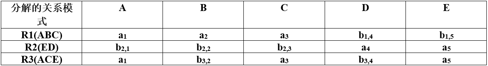
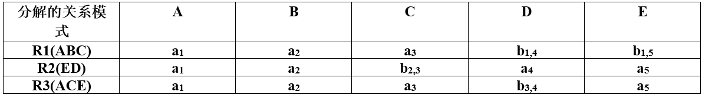
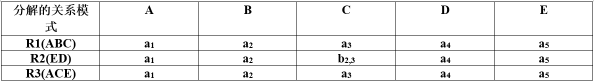
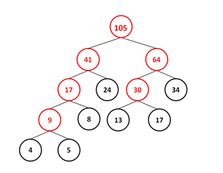

# 2017下半年选择题

- 来源标题: 2017年下半年软件设计师考试基础知识真题（专业解析+参考答案）
- 试卷介绍页: https://wangxiao.xisaiwang.com/tiku2/136/tp181383.html?cid=136
- 练习页: https://wangxiao.xisaiwang.com/tiku2/exam534904513.html
- 题量: 55

## 第1题（单选题）

在程序的执行过程中，Cache与主存的地址映射是由（C）完成的。

- A. 操作系统
- B. 程序员调度
- C. 硬件自动
- D. 用户软件

### 正确答案

C

### 解析

在程序的执行过程中，Cache与主存的地址映射是由硬件自动完成的。

## 第2题（单选题）

某四级指令流水线分别完成取指、取数、运算、保存结果四步操作。若完成上述操作的时间依次为8ns、9ns、 4ns、8ns，则该流水线的操作周期应至少为（C）ns 。

- A. 4
- B. 8
- C. 9
- D. 33

### 正确答案

C

### 解析

流水线类似并行处理，所以操作周期应该选择能够满足所有操作的操作时间，此题即为取数操作的时间，即流水周期为9ns。

## 第3题（单选题）

内存按字节编址。若用存储容量为32K×8bit的存储器芯片构成地址从A0000H到DFFFFH的内存，则至少需要（B）片芯片。

- A. 4
- B. 8
- C. 16
- D. 32

### 正确答案

B

### 解析

地址范围内的存储单元个数：DFFFFH – A0000H + 1 = 40000H=4×164=218；
按字节编址则存储容量为218B；
所选芯片单位容量：32K×8bit=32KB=25×210B=215B；
需要芯片数量=总容量/单位容量=218B/215B=23=8片。

## 第4题（单选题）

计算机系统的主存主要是由（A）构成的。

- A. DRAM
- B. SRAM
- C. Cache
- D. EEPROM

### 正确答案

A

### 解析

DRAM：动态随机存取存储器；SRAM：静态随机存取存储器；Cache：高速缓存；EEPROM：电可擦可编程只读存储器。

## 第5题（单选题）

以下关于海明码的叙述中，正确的是（A）。

- A. 海明码利用奇偶性进行检错和纠错
- B. 海明码的码距为 1
- C. 海明码可以检错但不能纠错
- D. 海明码中数据位的长度与校验位的长度必须相同

### 正确答案

A

### 解析

海明码既可检错又可纠错。

## 第6题（单选题）

计算机运行过程中，CPU需要与外设进行数据交换。采用（B）控制技术时，CPU与外设可并行工作。

- A. 程序查询方式和中断方式
- B. 中断方式和DMA方式
- C. 程序查询方式和DMA方式
- D. 程序查询方式、中断方式和DMA方式

### 正确答案

B

### 解析

程序控制（查询）方式：CPU需要不断查询I/O是否完成，因此一直占用CPU。
 程序中断方式：与程序控制方式相比，中断方式因为CPU无需等待而提高了传输请求的响应速度。
 DMA方式：DMA方式是为了在主存与外设之间实现高速、批量数据交换而设置的。DMA方式比程序控制方式与中断方式都高效。CPU只负责初始化，不参与具体传输过程。
 本题DMA和程序中断方式，是可以让外设与CPU并行的。

## 第7题（单选题）

与HTTP相比，HTTPS协议对传输的内容进行加密，更加安全。HTTPS基于（C/B）安全协议，其默认端口是（  ）。

### 问题1
- A. RSA
- B. DES
- C. SSL
- D. SSH
### 问题2
- A. 1023
- B. 443
- C. 80
- D. 8080

### 正确答案

C、B

### 解析

1、HTTPS是基于SSL(Secure Sockets Layer 安全套接层)的。
2、http的端口号为80，而HTTPS的默认端口是443，注意区分。

## 第8题（单选题）

下列攻击行为中，属于典型被动攻击的是（B）。

- A. 拒绝服务攻击
- B. 会话拦截
- C. 系统干涉
- D. 修改数据命令

### 正确答案

B

### 解析

本题考查网络攻击的基本知识。
A选项拒绝服务（DOS）： 对信息或其它资源的合法访问被无条件地阻止。 
B选项会话拦截：未授权使用一个已经建立的会话。
D选项修改数据命令：截获并修改网络中传输的数据命令。
C选项系统干涉：指的是攻击者获取系统访问权，从而干涉系统的正常运行。
网络攻击分为主动攻击和被动攻击两种。主动攻击包含攻击者访问他所需信息的故
意行为。比如通过远程登录到特定机器的邮件端口以找出企业的邮件服务器的信息;伪
造无效IP地址去连接服务器，使接受到错误IP地址的系统浪费时间去连接那个非法地
址。攻击者是在主动地做一些不利于你或你的公司系统的事情。
主动攻击包括拒绝服务攻击(DoS)、分布式拒绝服务(DDoS)、信息篡改、资源使用、欺骗、
伪装、重放等攻击方法。主要是收集信息而不是进行访问，数据的合法用户对这种活动一点
也不会觉察到。
被动攻击包括嗅探、信息收集等攻击方法 。

## 第9题（单选题）

（D）不属于入侵检测技术。

- A. 专家系统
- B. 模型检测
- C. 简单匹配
- D. 漏洞扫描

### 正确答案

D

### 解析

漏洞扫描为另一种安全防护策略。

## 第10题（单选题）

以下关于防火墙功能特性的叙述中，不正确的是（D）。

- A. 控制进出网络的数据包和数据流向
- B. 提供流量信息的日志和审计
- C. 隐藏内部IP以及网络结构细节
- D. 提供漏洞扫描功能

### 正确答案

D

### 解析

D选项不是防火墙的功能特性。

## 第11题（单选题）

某软件公司项目组的程序员在程序编写完成后均按公司规定撰写文档，并上交公司存档。此情形下，该软件文档著作权应由（C）享有。

- A. 程序员
- B. 公司与项目组共同
- C. 公司
- D. 项目组全体人员

### 正确答案

C

### 解析

属于职务作品。

## 第12题（单选题）

《中华人民共和国商标法》规定了申请注册的商标不得使用的文字和图形，其中包括县级以上行政区的地名（文字）。以下商标注册申请，经审查，能获准注册的商标是（B）。

- A. 青岛（市）
- B. 黄山（市）
- C. 海口（市）
- D. 长沙（市）

### 正确答案

B

### 解析

《中华人民共和国商标法》第8条规定了以下几种禁止用作商标的文字、图形：①同中华人民共和国的国家名称、国旗、国徽、军旗、勋章相同或者近似的文字、图形；②同外国的国家名称、国旗、国徽、军旗相同或者近似的文字、图形；③同政府间国际组织的旗帜、徽记、名称相同或者近似的文字、图形；④同“红十字”、“红新月”的标志、名称相同或者近似的文字、图形；⑤本商品的通用名称和图形；⑥直接表示商品的质量、主要原料、功能、用途、重量、数量及其他特点的文字、图形；⑦带有民族歧视性的文字、图形；⑧夸大宣传并带有欺骗性的文字、图形；⑨有害于社会主义道德风尚或者有其他不良影响的文字、图形；⑩县级以上行政区划的地名或公众知晓的外国地名。但是，地名具有其他含义的除外，已经注册的使用地名的商标继续有效。
本题黄山具有其他含义。

## 第13题（单选题）

李某购买了一张有注册商标的应用软件光盘，则李某享有（B）。

- A. 注册商标专用权
- B. 该光盘的所有权
- C. 该软件的著作权
- D. 该软件的所有权

### 正确答案

B

### 解析

具有使用权、所有权。

## 第14题（单选题）

某医院预约系统的部分需求为：患者可以查看医院发布的专家特长介绍及其就诊时间；系统记录患者信息，患者预约特定时间就诊。用DFD对其进行功能建模时，患者是（A/A）；用ERD对其进行数据建模时，患者是（  ）。

### 问题1
- A. 外部实体
- B. 加工
- C. 数据流
- D. 数据存储
### 问题2
- A. 实体
- B. 属性
- C. 联系
- D. 弱实体

### 正确答案

A、A

### 解析

1、患者不涉及加工，为外部实体。
2、患者有其信息，所以为实体。

## 第15题（单选题）

某软件项目的活动图如下图所示，其中顶点表示项目里程碑，链接顶点的边表示包含的活动，边上的数字表示活动的持续时间（天）。完成该项目的最少时间为（B/C）天。由于某种原因，现在需要同一个开发人员完成BC和BD，则完成该项目的最少时间为（  ）天。

### 问题1
- A. 11
- B. 18
- C. 20
- D. 21
### 问题2
- A. 11
- B. 18
- C. 20
- D. 21

### 正确答案

B、C

### 解析

[['1、关键路径为ABCEFJ和ABDGFJ，18天。
2、BC持续时间3天，BD持续时间2天，由一人完成，则可以先完成BD，再完成BC，则BC持续时间为5天，则关键路径为ABCEFJ，20天。''],['
']]

## 第16题（单选题）

某企业财务系统的需求中，属于功能需求的是（A）。

- A. 每个月特定的时间发放员工工资
- B. 系统的响应时间不超过 3 秒
- C. 系统的计算精度符合财务规则的要求
- D. 系统可以允许100个用户同时查询自己的工资

### 正确答案

A

### 解析

BCD为非功能需求。

## 第17题（单选题）

更适合用来开发操作系统的编程语言是（A）。

- A. C/C++
- B. Java
- C. Python
- D. JavaScript

### 正确答案

A

### 解析

现行操作系统均由C/C++开发。

## 第18题（单选题）

以下关于程序设计语言的叙述中，不正确的是（A）。

- A. 脚本语言中不使用变量和函数
- B. 标记语言常用于描述格式化和链接
- C. 脚本语言采用解释方式实现
- D. 编译型语言的执行效率更高

### 正确答案

A

### 解析

脚本语言中使用变量和函数来完成程序。

## 第19题（单选题）

将高级语言源程序通过编译或解释方式进行翻译时，可以先生成与源程序等价的某种中间代码。以下关于中间代码的叙述中，正确的是（B）。

- A. 中间代码常采用符号表来表示
- B. 后缀式和三地址码是常用的中间代码
- C. 对中间代码进行优化要依据运行程序的机器特性
- D. 中间代码不能跨平台

### 正确答案

B

### 解析

后缀式和三地址码是常用的中间代码， CD与具体的机器无关。

## 第20题（单选题）

计算机系统的层次结构如下图所示，基于硬件之上的软件可分为a、b和c三个层次。图中 a、b和c分别表示（C）。

- A. 操作系统、系统软件和应用软件
- B. 操作系统、应用软件和系统软件
- C. 应用软件、系统软件和操作系统
- D. 应用软件、操作系统和系统软件

### 正确答案

C

### 解析

最终用户使用应用软件，应用软件开发人员使用系统软件，系统软件开发人员使用操作系统和计算机硬件。

## 第21题（单选题）

下图所示的PCB（进程控制块）的组织方式是（B/C），图中（  ）。

### 问题1
- A. 链接方式
- B. 索引方式
- C. 顺序方式
- D. Hash
### 问题2
- A. 有 1个运行进程、2个就绪进程、4个阻塞进程
- B. 有 2个运行进程、3个就绪进程、2个阻塞进程
- C. 有 1个运行进程、3个就绪进程、3个阻塞进程
- D. 有 1个运行进程、4个就绪进程、2个阻塞进程

### 正确答案

B、C

### 解析

1、进程控制块PCB的组织方式有：1）线性表方式，2）索引表方式，3）链接表方式。
1）线性表方式：不论进程的状态如何，将所有的PCB连续地存放在内存的系统区。这种方式适用于系统中进程数目不多的情况。
2）索引表方式：该方式是线性表方式的改进，系统按照进程的状态分别建立就绪索引表、阻塞索引表等。
3）链接表方式：系统按照进程的状态将进程的PCB组成队列，从而形成就绪队列、阻塞队列、运行队列等。
2、图中运行指针、就绪表指针和阻塞表指针指向的，无论是直接指向，还是通过索引表指向的进程，即为对应状态的进程，运行进程PCB1， 就绪进程：PCB2，PCB3，PCB4 阻塞进程：PCB5，PCB6，PCB7。

## 第22题（单选题）

某文件系统采用多级索引结构。若磁盘块的大小为1K字节，每个块号占3字节，那么采用二级索引时的文件最大长度为（C）K字节。

- A. 1024
- B. 2048
- C. 116281
- D. 232562

### 正确答案

C

### 解析

由题中磁盘块的大小为1K字节，每个块号占3字节可知，一个磁盘块有1024/3个块号，即每块能存储1024/3个地址，采用二级间接地址索引，可得2级间接地址索引的地址大小为(1024/3)× (1024/3)×1KB。

## 第23题（单选题）

某操作系统采用分页存储管理方式，下图给出了进程A和进程B的页表结构。如果物理页的大小为1K字节，那么进程A中逻辑地址为1024（十进制）的变量存放在（B/A）号物理内存页中。假设进程A的逻辑页4与进程B的逻辑页5要共享物理页4，那么应该在进程A页表的逻辑页4和进程B页表的逻辑页5对应的物理页处分别填（  ）。

### 问题1
- A. 8
- B. 3
- C. 5
- D. 2
### 问题2
- A. 4、4
- B. 4、5
- C. 5、4
- D. 5、5

### 正确答案

B、A

### 解析

1、逻辑地址是逻辑页号+页内地址（都是用二进制来表示的），页内地址是题目所给出的1K，为210，说明页内地址占用10位。
物理地址是物理页号+页内地址（都是用二进制来表示的），页内地址和逻辑地址的大小相同。
在这里，逻辑地址是1024，即210，转换为2进制为：1 00000 00000。那么，根据页内地址占10位，剩余的1即是它的逻辑页号。查找页表，1对应的物理页号是3，所以选择B。
2、共享页4，在进程A页表的逻辑页4和进程B页表的逻辑页5对应的物理页都是4。

## 第24题（单选题）

用白盒测试方法对如下图所示的流程图进行测试。若要满足分支覆盖，则至少需要（B/B）个测试用例，正确的测试用例对是（  ）（测试用例的格式为（A，B，X；X））。

### 问题1
- A. 1
- B. 2
- C. 3
- D. 4
### 问题2
- A. （1，3，3；3）和（5，2，15；3）
- B. （1，1，5；5）和（5，2，20；9）
- C. （2，3，10；5）和（5，2，18；3）
- D. （5，2，16；3）和（5，2，21；9）

### 正确答案

B、B

### 解析

[['1、两个测试用例，一个走真分支，一个走假分支即可。
2、看分支1：要走两个分支，则一个用例中A > 2，另一个用例A < =2（此时，可排除D），
看分支2：要走两个分支，则其中一个用例必须满足A=5和X > 3，
结合两个分支，则有一个用例为A=5，满足第一分支条件，且执行了X=X/A 后满足X > 3，（X是int型）推出X > =20（此时，可推出选择B）。
可以再验证一下：
用例1：（1，1，5；5）
不满足分支1，也不满足分支2，走N—N；
用例2：（5，2，20；9）
满足分支1，X=X/A，则X=20/5=4；
继续执行，满足分支2，执行X=X+5=9，输出X=9。''],['
']]

## 第25题（单选题）

配置管理贯穿软件开发的整个过程。以下内容中，不属于配置管理的是（B）。

- A. 版本控制
- B. 风险管理
- C. 变更管理
- D. 配置状态报告

### 正确答案

B

### 解析

配置管理包括ACD和配置审计。

## 第26题（单选题）

极限编程（XP）的十二个最佳实践不包括（D）。

- A. 小型发布
- B. 结对编程
- C. 持续集成
- D. 精心设计

### 正确答案

D

### 解析

极限编程十二个最佳实践包括：计划游戏、小型发布、隐喻、简单设计、测试先行、重构、结对编程、集体代码所有制、持续集成、每周工作40个小时、现场客户和编码标准，D应为简单设计。

## 第27题（单选题）

以下关于管道过滤器体系结构的叙述中，不正确的是（D）。

- A. 软件构件具有良好的高内聚、低耦合的特点
- B. 支持重用
- C. 支持并行执行
- D. 提高性能

### 正确答案

D

### 解析

管道过滤器风格具有许多很好的特点：
（1）使得软件构件具有良好的隐蔽性和高内聚、低耦合的特点；
（2）允许设计者将整个系统的输入/输出行为看成是多个过滤器的行为的简单合成；
（3）支持软件重用；
（4）支持并行执行；
（5）允许对一些如吞吐量、死锁等属性的分析。
不能提高性能。

## 第28题（单选题）

模块A将学生信息，即学生姓名、学号、手机号等放到一个结构体中，传递给模块B。模块A和B之间的耦合类型为（B）耦合。

- A. 数据
- B. 标记
- C. 控制
- D. 内容

### 正确答案

B

### 解析

数据耦合：两个模块彼此间通过数据参数交换信息。
标记耦合：一组模块通过参数表传递记录信息，这个记录是某一个数据结构的子结构，而不是简单变量。
控制耦合：两个模块彼此间传递的信息中有控制信息。
内容耦合：一个模块需要涉及另一个模块的内部信息。
本题应该选择B选项。

## 第29题（单选题）

某模块内涉及多个功能，这些功能必须以特定的次序执行，则该模块的内聚类型为（B）内聚。

- A. 时间
- B. 过程
- C. 信息
- D. 功能

### 正确答案

B

### 解析

要求功能是以特定的次序执行，所以是过程内聚。

## 第30题（单选题）

系统交付用户使用后，为了改进系统的图形输出而对系统进行修改的维护行为属于（C）维护。

- A. 改正性
- B. 适应性
- C. 改善性
- D. 预防性

### 正确答案

C

### 解析

改善系统的功能和性能。

## 第31题（单选题）

在面向对象方法中，将逻辑上相关的数据以及行为绑定在一起，使信息对使用者隐蔽称为（C/B）。当类中的属性或方法被设计为private时，（  ）可以对其进行访问。

### 问题1
- A. 抽象
- B. 继承
- C. 封装
- D. 多态
### 问题2
- A. 应用程序中所有方法
- B. 只有此类中定义的方法
- C. 只有此类中定义的public方法
- D. 同一个包中的类中定义的方法

### 正确答案

C、B

### 解析

1、封装是指利用抽象数据类型将数据和基于数据的操作封装在一起，使其构成一个不可分割的独立实体，数据被保护在抽象数据类型的内部，尽可能地隐藏内部的细节，只保留一些对外接口使之与外部发生联系。
2、只有此类中定义的方法可以对私有成员进行访问。

## 第32题（单选题）

采用继承机制创建子类时，子类中（D）。

- A. 只能有父类中的属性
- B. 只能有父类中的行为
- C. 只能新增行为
- D. 可以有新的属性和行为

### 正确答案

D

### 解析

子类相对于父类，要更加特殊。所以会有新的成员来描述其特殊。

## 第33题（单选题）

面向对象分析过程中，从给定需求描述中选择（B）来识别对象。

- A. 动词短语
- B. 名词短语
- C. 形容词
- D. 副词

### 正确答案

B

### 解析

名词短语暗示类及其属性；动词和动词短语暗示类职责或操作。

## 第34题（单选题）

如下所示的UML类图中，Shop和Magazine之间为（A/C/D）关系，Magazine和Page之间为（  ）关系。UML类图通常不用于对（  ）进行建模。

### 问题1
- A. 关联
- B. 依赖
- C. 组合
- D. 继承
### 问题2
- A. 关联
- B. 依赖
- C. 组合
- D. 继承
### 问题3
- A. 系统的词汇
- B. 简单的协作
- C. 逻辑数据库模式
- D. 对象快照

### 正确答案

A、C、D

### 解析

1、关联关系的表示图法。
2、实心棱形表示组合。
3、对象快照是对象图的。

## 第35题（单选题）

自动售货机根据库存、存放货币量、找零能力、所选项目等不同，在货币存入并进行选择时具有如下行为：交付产品不找零 ；交付产品并找零；存入货币不足而不提供任何产品；库存不足而不提供任何产品。这一业务需求适合采用（B/B/D/C）模式设计实现，其类图如下图所示，其中（  ）是客户程序使用的主要接口，可用状态来对其进行配置。此模式为（  ），体现的最主要的意图是（  ）。
 

### 问题1
- A. 观察者（Observer）
- B. 状态（State）
- C. 策略（Strategy）
- D. 访问者（Visitor）
### 问题2
- A. Vending Machine State
- B. Buy
- C. Vending Deposit State
- D. Vending Stock State
### 问题3
- A. 创建型对象模式
- B. 结构型对象模式
- C. 行为型类模式
- D. 行为型对象模式
### 问题4
- A. 当一个对象状态改变时所有依赖它的对象得到通知并自动更新
- B. 在不破坏封装性的前提下，捕获对象的内部状态并在对象之外保存
- C. 一个对象在其内部状态改变时改变其行为
- D. 将请求封装为对象从而可以使用不同的请求对客户进行参数化

### 正确答案

B、B、D、C

### 解析

1、有State关键词，状态模式：允许一个对象在其内部状态改变时改变它的行为。对象看起来似乎修改了它的类。在很多情况下，一个对象的行为取决于一个或多个动态变化的属性，这样的属性叫作状态，这样的对象叫作有状态的（stateful）对象，这样的对象状态是从事先定义好的一系列值中取出的。当一个这样的对象与外部事件产生互动时，其内部状态就会改变，从而使得系统的行为也随之发生变化。
2、Buy是客户程序使用的主要接口。

## 第36题（单选题）

编译过程中进行的语法分析主要是分析（C）。

- A. 源程序中的标识符是否合法
- B. 程序语句的含义是否合法
- C. 程序语句的结构是否合法
- D. 表达式的类型是否合法

### 正确答案

C

### 解析

语法分析是编译过程的一个逻辑阶段。语法分析的任务是在词法分析的基础上将单词序列组合成各类语法短语，如“程序”，“语句”，“表达式”等等。语法分析程序判断源程序在结构上是否正确。源程序的结构由上下文无关文法描述。

## 第37题（单选题）

某确定的有限自动机（DFA）的状态转换图如下图所示（0是初态，4是终态），则该DFA能识别（A）。

- A. aaab
- B. abab
- C. bbba
- D. abba

### 正确答案

A

### 解析

本题考查正规式与有限自动机将各选项放入自动机中运行，最终停留在终态即为能识别的字符串
B项从0到1然后走不了了
C项在3状态结束，不对；
D项也只到1状态。选择A选项。

## 第38题（单选题）

函数main()、f()的定义如下所示。调用函数f()时，第一个参数采用传值（call by value）方式，第二个参数采用传引用（call by reference）方式，则函数main()执行后输出的值为（D）。

- A. 10
- B. 19
- C. 20
- D. 29

### 正确答案

D

### 解析

传值调用中，形参取的是实参的值，形参的改变不会导致调用点所传的实参的值发生改变；而引用（传址）调用中，形参取的是实参的地址，即相当于实参存储单元的地址引用，因此其值的改变同时就改变了实参的值。
x = 2*10-1=19；
a是引用传递，所以a=a+x=10+19=29，结果为29。

## 第39题（单选题）

采用三级结构/两级映像的数据库体系结构，如果对数据库的一张表创建聚簇索引，改变的是数据库的（D）。

- A. 用户模式
- B. 外模式
- C. 模式
- D. 内模式

### 正确答案

D

### 解析

创建聚簇索引意味着重新确定表中的数据的物理顺序，内模式是数据物理结构和存储方式的描述，对应着物理层，所以对于物理顺序的操作改变的一定是内模式。外模式也称用户模式，是用户与数据库系统的接口，对应着视图层，AB是同一个概念。模式也称概念模式，是数据库中全部数据的逻辑结构和特征的描述，对应着逻辑层。

## 第40题（单选题）

某企业的培训关系模式R（培训科目，培训师，学生，成绩，时间，教室）， R的函数依赖集 F={培训科目→培训师，（学生，培训科目）→成绩，（时间，教室）→培训科目，（时间，培训师）→教室，（时间，学生）→教室}。关系模式R的主键为（D/B），其规范化程度最高达到（  ）。

### 问题1
- A. （学生，培训科目）
- B. （时间，教室）
- C. （时间，培训师）
- D. （时间，学生）
### 问题2
- A. 1NF
- B. 2NF
- C. 3NF
- D. BCNF

### 正确答案

D、B

### 解析

1、函数依赖集 F={培训科目→培训师，（学生，培训科目）→成绩，（时间，教室）→培训科目，（时间，培训师）→教室，（时间，学生）→教室}。可以得出，（时间，学生）→教室→培训科目→成绩，（时间，学生）→教室 →培训科目→培训师
 时间和学生共同组合，可以推导出所有的属性，描述出所有的函数依赖关系。
 所以主键是时间和学生的组合键。
2、存在传递函数依赖，时间和教室→培训科目；培训科目→培训师。

## 第41题（单选题）

设关系模式R（U，F），其中：U= {A，B，C，D，E } ，F={A→B，DE→B，CB→E，E→A，B→D}。（D/D）为关系模式R的候选关键字。分解（  ）是无损连接，并保持函数依赖的。

### 问题1
- A. AB
- B. DE
- C. DB
- D. CE
### 问题2
- A. ρ={ R1（AC），R2（ED），R3（B）}
- B. ρ={ R1（AC），R2（E），R3（DB）}
- C. ρ={ R1（AC），R2（ED），R3（AB）}
- D. ρ={ R1（ABC），R2（ED），R3（ACE）}

### 正确答案

D、D

### 解析

1、根据题目函数依赖集F可知，C是没有入度的，即没有属性可以推导出C，所以C一定是R 的候选关键字之一，只有选项D出现了C，无疑选D。然后因为CE可以推导出任一属性，所以CE就是候选关键字。
2、使用表格法还原：
选项D表格法如下所示：

ABCDE为U的属性，分解后的R1、R2、R3中如果有相应的属性在，那么就填上aj ，j为列，如果不存在，那么就填上bi,j，i为行，j为列，如果三行中一行或多行通过函数依赖推导，能够全为ai，那么就说明分解后的关系模式是无损连接
因为A→B，R1和R3的第一列相等，所以b3,2也为a2，同理E→A、A→B，所以b2,1也为a1，b2,2也为a2。

因为B→D，所以b1,4和b3,4都为a4，又因为A→B、CB→E，所以AC→E，则b1,5为a5。

很显然第一行和第三行都全为ai，所以D是无损连接的。

## 第42题（单选题）

在基于Web 的电子商务应用中，访问存储于数据库中的业务对象的常用方式之一是（A）。

- A. JDBC
- B. XML
- C. CGI
- D. COM

### 正确答案

A

### 解析

数据库访问是JDBC（Java Database Connectivity，java数据库连接）。XML是一种数据格式定义，CGI是一种网络应用技术，COM是一种组件技术，它们均不是访问数据库的方式。

## 第43题（单选题）

设S是一个长度为n的非空字符串，其中的字符各不相同，则其互异的非平凡子串（非空且不同于S本身）个数为（D）。

- A. 2n-1
- B. n²
- C. n(n+1)/2
- D. (n+2) (n-1)/2

### 正确答案

D

### 解析

比如S字符串为“abcdefg”，长度为7，则S中的包含的互不相同的字符串有如下一些：
1.长度为6的个数为2：“abcdef”和“bcdefg”
2.长度为5的个数为3：“abcde”,“bcdef”,“cdefg”
3.长度为1的个数为7：“a”,“b”,“c”,“d”,“e”,“f”,“g”
个数总和就是2+3+4+5+6+7 =（2+7）×（7-2+1）/2
同理，字符串长度为n，一个字符的字符串个数为n，除原字符串外最长的字符串为n-1个字符，个数有2个，按照推理，共有：2+3+……+n=（2+n）（n-1）/2个。
其中：
等差数列{an}的通项公式为：an=a1+(n-1)d。
前n项和公式为：Sn=n×a1+n(n-1)d/2或Sn=n(a1+an)/2。

## 第44题（单选题）

假设某消息中只包含7个字符{a，b，c，d，e，f，g}，这7个字符在消息中出现的次数为{5，24，8，17，34，4，13}，利用哈夫曼树（最优二叉树）为该消息中的字符构造符合前缀编码要求的不等长编码。各字符的编码长度分别为（A）。

- A. a:4，b:2，c:3，d:3，e:2，f:4，g:3
- B. a:6，b:2，c:5，d:3，e:1，f:6，g:4
- C. a:3，b:3，c:3，d:3，e:3，f:2，g:3
- D. a:2，b:6，c:3，d:5，e:6，f:1，g:4

### 正确答案

A

### 解析

构造哈夫曼树有两种形式，能够找到符合选项的只有一种，如下所示：

## 第45题（单选题）

设某二叉树采用二叉链表表示（即结点的两个指针分别指示左、右孩子）。当该二叉树包含k个结点时，其二叉链表结点中必有（C）个空的孩子指针。

- A. k-1
- B. k
- C. k+1
- D. 2k

### 正确答案

C

### 解析

二叉树的二叉链表存储结构中每个结点有2个指针。每个结点有0个、1个或者2个空指针对应有2个、1个、0个非空指针。
二叉树中边的个数等于非空指针的个数
假设二叉树中节点的总个数为N
假设二叉树中边的个数为M
假设二叉树中度为0的结点的个数为n0
假设二叉树中度为1的结点的个数为n1
假设二叉树中度为2的结点的个数为n2
所以有  n0+n1+n2=N  -------------（1）
二叉树中除了根结点之外，其他的结点都有一条边进入该结点，所以二叉树中边的总个数为M=N-1；-------（2）
又 M=n1+2×n2;-------------------------（3）
所以由 （1）（2）（3）可得  n0=n2+1;--------------------（4）
设空节点的 个数为 K，则K=2×n0+n1-------------------（5）
结合（1）（4）（5）可以得到K=N+1（空指针的个数比结点总个数多1）
由（2）可以知道边数M=N-1（二叉树的边数为结点个数减1）
由（4）可以知道度为0的结点的个数（叶子结点个数）=度为2的结点个数+1（n0=n2+1）

## 第46题（单选题）

以下关于无向连通图G的叙述中，不正确的是（A）。

- A. G中任意两个顶点之间均有边存在
- B. G中任意两个顶点之间存在路径
- C. 从G中任意顶点出发可遍历图中所有顶点
- D. G的邻接矩阵是对称矩阵

### 正确答案

A

### 解析

无向连通图不一定有边，但两个顶点之间有路径。

## 第47题（单选题）

两个递增序列A和B的长度分别为m和n（m < n且m与n接近），将二者归并为一个长度为m+n的递增序列。当关系为（A）时，归并过程中元素的比较次数最少。

- A. a1<a2<…<am-1<am<b1<b2<…<bn-1<bn
- B. b1<b2<…<bn-1<bn<a1<a2<…<am-1<am
- C. a1<b1<a2<b2<…<am-1<bm-1<am<bm<bm+1<…<bn-1<bn
- D. b1<b2<…<bm-1<bm<a1<a2<…<am-1<am<bm+1<…<bn-1<bn

### 正确答案

A

### 解析

对于本题，求解归并比较次数最少。可分为3种情况：
1）A[m]数值全小于B[n]，取A[1] < B[1],R[1]=A[1]，接下来比较A[2]与B[1]，R[2]=A[2] …直到取完A[m]，A[m] < B[1]，R[m]=A[m]，将B序列复制到R[K]，(m+1)~(m+n)的位置，完成归并排序，此时，共比较m次；
2）A[m]数值全大于B[n]，取B[1] < A[1]，R[1]=B[1]，接下来直到取完B[n]，将A[m]序列复制到(n+1)~(n+m)的位置，完成归并排序，此时，共比较n次，题干指出m < n，因此第一种情况比较次数较少；
3）A[m]数值与B[n]数值大小交叉，则归并排序过程，对于R[1]~R[k]位置上数值的确定会比较 > =1次，最终复制剩余序列时，长度也会小于m（因为交叉排序，有部分序列会经过比较插入结果数列），此时复制序列所缩减的比较次数会体现在前面交叉排序的过程中，总的比较次数会较大。
因此，比较次数最少的情况是第一种A[m]数值全小于B[n]。

## 第48题（单选题）

求解两个长度为n的序列X和Y的一个最长公共子序列（如序列ABCBDAB和BDCABA的一个最长公共子序列为BCBA）可以采用多种计算方法。如可以采用蛮力法，对X的每一个子序列，判断其是否也是Y的子序列，最后求出最长的即可，该方法的时间复杂度为（D/A）。经分析发现该问题具有最优子结构，可以定义序列长度分别为i和j的两个序列X和Y的最长公共子序列的长度为C[i,j]，如下式所示。

采用自底向上的方法实现该算法，则时间复杂度为（  ）。

### 问题1
- A. O(n²)
- B. O(n²lgn)
- C. O(n³)
- D. O(n2n)
### 问题2
- A. O(n²)
- B. O(n²lgn)
- C. O(n³)
- D. O(n2n)

### 正确答案

D、A

### 解析

[['1.X、Y的所有子序列都检查过后即可求出X、Y的最长公共子序列。X的一个子序列相应于下标序列1,2，…，n的一个子序列。因此，X共有2n个子序列。当然，Y也有2m个子序列。判断一个子序列是否也是Y的子序列的时间是n，因此时间复杂度为O(n2n)
2. 动态规划的一个计算最长公共子序列的方法如下，两个序列 X、Y ：
设有二维数组 c[i][j] 表示 X 的 i 位和 Y 的 j 位之前的最长公共子序列的长度，则有题干给定的函数表现形式：
其中，c(i,j)当 X 的第i位与 Y 的第 j 位完全相同时为“1” ，否则为“0” 。
此时，c[i][j]中最大的数便是 X 和 Y 的最长公共子序列的长度，依据该数组回溯，便可找出最长公共子序列。该算法的空间、时间复杂度均为O(n2)。
''],['
']]

## 第49题（单选题）

现需要对一个基本有序的数组进行排序。此时最适宜采用的算法为（A/A）排序算法，时间复杂度为（  ）。

### 问题1
- A. 插入
- B. 快速
- C. 归并
- D. 堆
### 问题2
- A. O(n)
- B. O(nlgn)
- C. O(n²)
- D. O(n²lgn)

### 正确答案

A、A

### 解析

不同的算法适用于不同的场合。不同的数据输入特点相同的算法也有不同的计算时间。若数据基本有序，对插入排序算法而言，直接插入排序过程中元素比较的次数较少，则可以在近似线性时间内完成排序。即O(n)。

## 第50题（单选题）

相比于TCP ，UDP的优势为（B）。

- A. 可靠传输
- B. 开销较小
- C. 拥塞控制
- D. 流量控制

### 正确答案

B

### 解析

TCP与UDP区别：1、TCP面向连接（如打电话要先拨号建立连接）；UDP是无连接的，即发送数据之前不需要建立连接；2、TCP提供可靠的服务。也就是说，通过TCP连接传送的数据，无差错，不丢失，不重复，且按序到达；UDP尽最大努力交付，即不保证可靠交付；3、TCP面向字节流，实际上是TCP把数据看成一连串无结构的字节流；UDP是面向报文的；UDP没有拥塞控制，因此网络出现拥塞不会使源主机的发送速率降低（对实时应用很有用，如IP电话，实时视频会议等）；4、每一条TCP连接只能是点到点的；UDP支持一对一，一对多，多对一和多对多的交互通信；5、TCP首部开销20字节；UDP的首部开销小，只有8个字节；6、TCP的逻辑通信信道是全双工的可靠信道，UDP则是不可靠信道，整体来看UDP开销较小。

## 第51题（单选题）

若一台服务器只开放了25和110两个端口，那么这台服务器可以提供（A）服务。

- A. E-Mail
- B. WEB
- C. DNS
- D. FTP

### 正确答案

A

### 解析

25端口为SMTP（Simple Mail Transfer Protocol，简单邮件传输协议）服务器所开放，主要用于发送邮件。
110端口为POP3（Post Office Protocol - Version 3，邮件协议版本3）负责邮件收取。
WEB服务主要是HTTP协议，端口为80。
DNS服务主要是DNS协议，端口为53。
FTP服务主要是FTP协议，端口为20/21。

## 第52题（单选题）

SNMP是一种异步请求/响应协议，采用（D）协议进行封装。

- A. IP
- B. ICMP
- C. TCP
- D. UDP

### 正确答案

D

### 解析

SNMP：简单网络管理协议，使用UDP协议进行封装。

## 第53题（单选题）

在一台安装好TCP/IP协议的计算机上，当网络连接不可用时，为了测试编写好的网络程序，通常使用的目的主机IP地址为（B）。

- A. 0.0.0.0
- B. 127.0.0.1
- C. 10.0.0.1
- D. 210.225.21.255/24

### 正确答案

B

### 解析

127.0.0.1是回送地址，指本地机，一般用来测试使用。回送地址（127.x.x.x）是本机回送地址（Loopback Address），
 即主机IP堆栈内部的IP地址，主要用于网络软件测试以及本地机进程间通信，无论什么程序，一旦使用回送地址发送数据，
 协议软件立即返回，不进行任何网络传输。

## 第54题（单选题）

测试网络连通性通常采用的命令是（B）。

- A. Netstat
- B. Ping
- C. Msconfig
- D. Cmd

### 正确答案

B

### 解析

Ping是Windows、Unix和Linux系统下的一个命令。ping也属于一个通信协议，是TCP/IP协议的一部分。利用“ping”命令可以检查网络是否连通，可以很好地帮助我们分析和判定网络故障。
Netstat用于显示网络相关信息。
Msconfig用于Windows配置。
Cmd称为命令提示符，是在操作系统中进行命令输入的工作提示符。

## 第55题（单选题）

The development of the Semantic Web proceeds in steps, each step building a layer on top of another. The pragmatic justification for this approach is that it is easier to achieve（1）on small steps, whereas it is much harder to get everyone on board if too much is attempted. Usually there are several research groups moving in different directions; this（2）of ideas is a major driving force for scientific progress. However，from an engineering perspective there is a need to standardize. So, if most researchers agree on certain issues and disagree on others, it makes sense to fix the points of agreement. This way, even if the more ambitious research efforts should fail， there will be at least（3）positive outcomes.
Once a（4）has been established ，many more groups and companies will adopt it，instead of waiting to see which of the alternative research lines will be successful in the end. The nature of the Semantic Web is such that companies and single users must build tools， add content， and use that content. We cannot wait until the full Semantic Web vision materializes——it may take another ten years for it to be realized to its full（5）(as envisioned today, of course).

### 问题1
- A. conflicts
- B. consensus
- C. success
- D. disagreement
### 问题2
- A. competition
- B. agreement
- C. cooperation
- D. collaboration
### 问题3
- A. total
- B. complete
- C. partial
- D. entire
### 问题4
- A. technology
- B. standard
- C. pattern
- D. model
### 问题5
- A. area
- B. goal
- C. object
- D. extent

### 正确答案

B、A、C、B、D

### 解析

语义网络的发展是一步一步的，每一步都建立在之前的基础之上。选择这种方法的现实理由就是因为很容易对一小步达成一致，而如果想要一步到位就难得多。通常，很多研究组织都是从不同方向考虑的，这种思想的竞争的方式是科学进步的驱动力。然而，从工程的角度来说是需要进行标准化的。因此，如果大多数研究者同意某个观点不同意另一个的时候，改正观点是有意义的。这样，即使再宏大的研究努力也会失败，可能会有局部的积极效果。
一旦一个标准被建立，许多组织和企业都会采纳，而不是等待并查看其他研究线是否会获得成果。语义网络的性质就是让企业和单个用户必须构建工具，添加内容并使用。我们不会等着整个语义网络被物化——因为实现它的全部内容需要再过十年时间（当然是按照今天所设想）。
