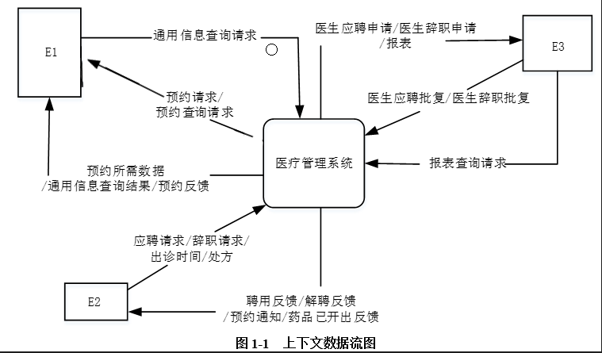
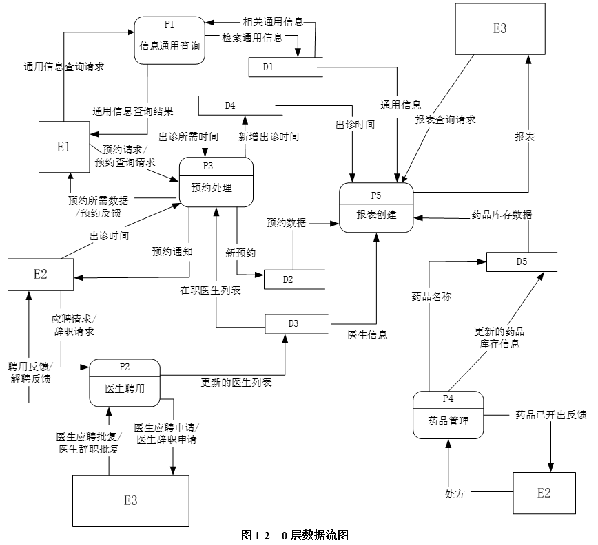
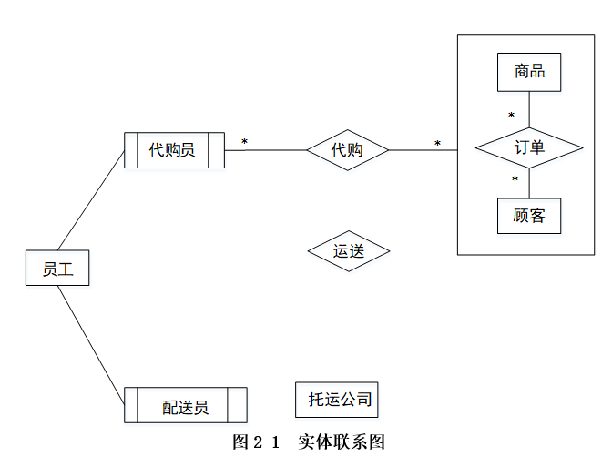
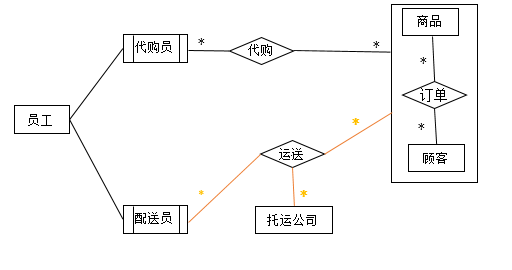
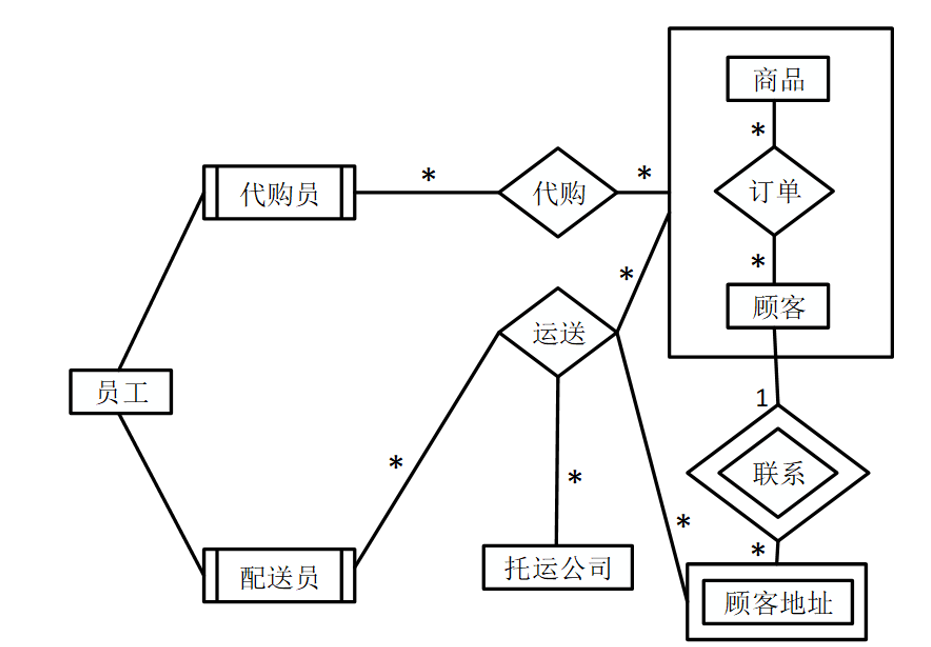
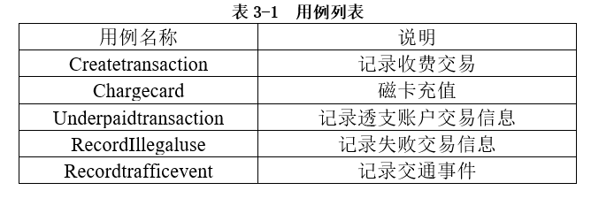
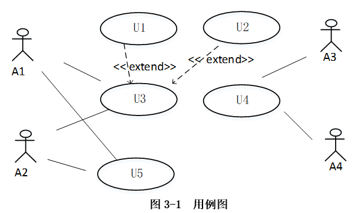
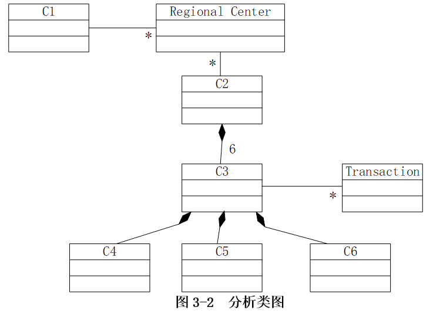
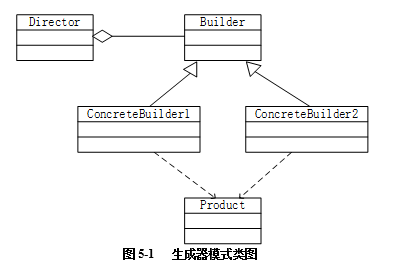

# 2018上半年案例题

- 来源标题: 2018年上半年软件设计师考试应用技术真题（专业解析+参考答案）
- 试卷介绍页: https://wangxiao.xisaiwang.com/tiku2/136/tp191601.html?cid=136
- 练习页: https://wangxiao.xisaiwang.com/tiku2/exam534904444.html
- 题量: 6

## 第1题（案例题）

阅读下列说明和图，回答问题1至问题4，将解答填入答题纸的对应栏内。
【说明】
某医疗护理机构为老年人或有护理需求者提供专业护理，现欲开发一基于Web的医疗管理系统，以改善医疗护理效率。该系统的主要功能如下：
（1）通用信息查询。客户提交通用信息查询请求，查询通用信息表，返回查询结果。
（2）医生聘用。医生提出应聘/辞职申请，交由主管进行聘用/解聘审批，更新医生表，并给医生反馈聘用/解聘结果；删除解聘医生的出诊安排。
（3）预约处理。医生安排出诊时间，存入医生出诊时间表；根据客户提交的预约查询请求，查询在职医生及其出诊时间等预约所需数据并返回；创建预约，提交预约请求，在预约表中新增预约记录，更新所约医生出诊时间并给医生发送预约通知；给客户反馈预约结果。
（4）药品管理。医生提交处方，根据药品名称从药品数据中查询相关药品库存信息，开出药品，更新对应药品的库存以及预约表中的治疗信息；给医生发送“药品已开出”反馈。
（5）报表创建。根据主管提交的报表查询请求（报表类型和时间段），从预约数据、通用信息、药品库存数据、医生以及医生出诊时间中进行查询，生成报表返回给主管。
现采用结构化方法对医疗管理系统进行分析与设计，获得如图1-1所示的上下文数据流图和图1-2所示的0层数据流图。

### 补充题面

【问题1】（3分）
使用说明中的词语，给出图1-1中的实体E1～E3的名称。
【问题2】（5分）
使用说明中的词语，给出图1-2中的数据存储D1～D5的名称。
【问题3）（4分）
使用说明和图中术语，补充图1-2中缺失的数据流及其起点和终点。
【问题4】（3分）
 使用说明中的词语，说明“预约处理”可以分解为哪些子加工，并说明建模图1-1和图1-2是如何保持数据流图平衡。

### 参考答案

【问题1】
E1：客户                   E2:   医生         E3：主管
【问题2】
D1：通用信息表
D2：预约表
D3：医生表
D4：出诊时间表
D5：药品库存表
【问题3】    数据流：更新的出诊时间              起点：P3   终点：D4
    数据流：删除的医生出诊安排        起点：P2        终点：D4
    数据流：药品库存信息                    起点：D5        终点：P4
    数据流：治疗信息                            起点：P4           终点：D2
【问题4】
预约处理分解为：
安排出诊、预约查询、创建预约、预约反馈  。
即保持父图与子图之间的平衡：父图中某个加工的输入输出数据流必须与其子图的输入输出数据流在数量上和名字上相同。父图的一个输入（或输出）数据流对应于子图中几个输入（或输出）数据流，而子图中组成的这些数据流的数据项全体正好是父图中的这一个数据流。

### 解析

本题是对数据流图的考查，题型是传统的考题，主要参考题干说明找到答案。
【问题1】
本题要求找到对应的实体名称。
根据题干叙述，“客户提交通用信息查询请求，查询通用信息表，返回查询结果”，综合图示，提交通用信息查询请求的是实体E1，即客户。
根据题干叙述，“医生提出应聘/辞职申请，交由主管进行聘用/解聘审批”，综合图示，提出辞职/应聘申请的是E2，即医生，进行审批的是E3，即主管。
【问题2】
本题要求找到对应的存储名称。
根据题干描述，“客户提交通用信息查询请求，查询通用信息表，返回查询结果”，综合图示，接收查询请求，返还查询结果的是通用信息表，即D1；
根据题干描述，“医生提出应聘/辞职申请，交由主管进行聘用/解聘审批，更新医生表”，综合图示，医生聘用加工，会更新医生表，即D3为医生表；
根据题干描述，“安排出诊时间，存入医生出诊时间表；根据客户提交的预约查询请求，查询在职医生及其出诊时间等预约所需数据并返回；创建预约，提交预约请求，在预约表中新增预约记录”，综合图示，与出诊时间相关的是D4，即出诊时间表，与新预约相关的是D2，即预约表；
根据题干描述，“医生提交处方，根据药品名称从药品数据中查询相关药品库存信息”，综合图示，与药品管理相关的是D5，即药品库存表。
【问题3】
本题考查补充数据流，可以根据父图和子图的平衡，再根据题干说明，查找缺失数据流。
本题检查父图数据流是否都已出现在子图中，详细查看说明：
“医生聘用。医生提出应聘/辞职申请，交由主管进行聘用/解聘审批，更新医生表，并给医生反馈聘用/解聘结果；删除解聘医生的出诊安排。”此处缺少数据流删除解聘医生的出诊安排，数据名称更新出诊安排，起点P2，终点是D4。
“创建预约，提交预约请求，在预约表中新增预约记录，更新所约医生出诊时间并给医生发送预约通知。”，此处缺少数据流更新出诊时间，起点是P3，终点是D4。
“医生提交处方，根据药品名称从药品数据中查询相关药品库存信息”，此处缺少查询相关药品库存信息数据流，起点是D5，终点是P4；
“开出药品，更新对应药品的库存以及预约表中的治疗信息”，缺少更新预约表中的治疗信息，数据名称更新治疗信息，起点P4，终点是预约表D2。
【问题4】预约处理。医生安排出诊时间，存入医生出诊时间表；根据客户提交的预约查询请求，查询在职医生及其出诊时间等预约所需数据并返回；创建预约，提交预约请求，在预约表中新增预约记录，更新所约医生出诊时间并给医生发送预约通知；给客户反馈预约结果。  
预约处理分解为：安排出诊、预约查询、创建预约、预约反馈（更新出诊时间、发送预约通知）。
保持父图与子图之间的平衡：父图中某个加工的输入输出数据流必须与其子图的输入输出数据流在数量上和名字上相同。父图的一个输入（或输出）数据流对应于子图中几个输入（或输出）数据流，而子图中组成的这些数据流的数据项全体正好是父图中的这一个数据流。

## 第2题（案例题）

阅读下列说明，回答问题1至问题3，将解答填入答题纸的对应栏内。
【说明】
 某海外代购公司为扩展公司业务，需要开发一个信息化管理系统。请根据公司现有业务及需求完成该系统的数据库设计。
【需求描述】
 （1）记录公司员工信息。员工信息包括工号、身份证号、姓名、性别和一个手机号，工号唯一标识每位员工，员工分为代购员和配送员。
 （2）记录采购的商品信息。商品信息包括商品名称、所在超市名称、采购价格、销售价格和商品介绍，系统内部用商品条码唯一标识每种商品。一种商品只在一家超市代购。
 （3）记录顾客信息。顾客信息包括顾客真实姓名、身份证号（清关缴税用）、一个手机号和一个收货地址，系统自动生成唯一的顾客编号。
 （4）记录托运公司信息。托运公司信息包括托运公司名称、电话和地址，系统自动生成唯一的托运公司编号。
 （5）顾客登录系统之后，可以下订单购买商品。订单支付成功后，系统记录唯一的支付凭证编号，顾客需要在订单里指定运送方式：空运或海运。
 （6）代购员根据顾客的订单在超市采购对应商品，一份订单所含的多个商品可能由多名代购员从不同超市采购。
 （7）采购完的商品交由配送员根据顾客订单组合装箱，然后交给托运公司运送。托运公司按顾客订单核对商品名称和数量，然后按顾客的地址进行运送。
【概念模型设计】
 根据需求阶段收集的信息，设计的实体联系图（不完整）如图2－1所示。

【逻辑结构设计】
 根据概念模型设计阶段完成的实体联系图，得出如下关系模式（不完整）：
 员工（工号，身份证号，姓名，性别，手机号）
 商品（条码，商品名称，所在超市名称，采购价格，销售价格，商品介绍）
 顾客（编号，姓名，身份证号，手机号，收货地址）
 托运公司（托运公司编号，托运公司名称，电话，地址）
 订单（订单ID，（a），商品数量，运送方式，支付凭证编号）
 代购（代购ID，代购员工号#，（b））
 运送（运送ID，配送员工号#，托运公司编号#，订单ID#，发运时间）

### 补充题面

【问题1】（3分）
根据问题描述，补充图2-1的实体联系图。
【问题2】（6分）
补充逻辑结构设计结果中的（a）、（b）两处空缺。
【问题3】（6分）
为方便顾客，允许顾客在系统中保存多组收货地址。请根据此需求，增加“顾客地址”弱实体，对图2-1进行补充，并修改“运送”关系模式。

### 参考答案

【问题1】

【问题2】
（a）商品条码#，顾客编号#
（b）订单ID#，商品条码#
【问题3】

新增一个弱实体顾客地址，新增一个联系客户收货地址，连接顾客实体和顾客地址类型为1:*；弱实体用双矩型表示。
运送关系模式增加属性：顾客地址
运送（运送ID，配送员工号#，托运公司编号#，订单ID#，顾客地址#，发运时间）

### 解析

【问题1】
根据题干描述，“采购完的商品交由配送员根据顾客订单组合装箱，然后交给托运公司运送。”其中配送员，托运公司，和代购订单商品，存在多对多的三元联系。
【问题2】
订单是商品与客户之间多对多的联系转换而来，因此a空需要补充二者的主键，商品条码和客户编号。 代购是代购员与代购订单之间多对多的联系转换而来，因此，b空应补充订单的主键订单ID，又因为“一份订单所含的多个商品可能由多名代购员从不同超市采购”，所以还需要补充商品条码。
【问题3】
新增一个弱实体顾客地址，新增一个联系客户收货地址，连接顾客实体和顾客地址类型为1:*；弱实体用双矩型表示。
运送关系模式增加属性：顾客地址
运送（运送ID，配送员工号#，托运公司编号#，订单ID#，顾客地址#，发运时间）

## 第3题（案例题）

阅读下列说明，回答问题1至问题3，将解答填入答题纸的对应栏内。
【说明】
某ETC（ElectronicTollCollection，不停车收费）系统在高速公路沿线的特定位置上设置一个横跨道路上空的龙门架（Tollgantry），龙门架下包括6条车道（Trafficlanes），每条车道上安装有雷达传感器（Radarsensor）、无线传输器（ Radiotransceiver）和数码相机（DigitalCamera）等用于不停车收费的设备，以完成正常行驶速度下的收费工作。该系统的基本工作过程如下：
（1）每辆汽车上安装有车载器，驾驶员（Driver）将一张具有唯一识别码的磁卡插入车载器中。磁卡中还包含有驾驶员账户的当前信用记录。
（2）当汽车通过某条车道时，不停车收费设备识别车载器内的特有编码，判断车型，将收集到的相关信息发送到该路段所属的区域系统（Regionalcenter）中，计算通行费用，创建收费交易（Transaction），从驾驶员的专用账户中扣除通行费用。如果驾驶员账户透支，则记录透支账户交易信息。区域系统再将交易后的账户信息发送到维护驾驶员账户信息的中心系统（Centralsystem）。
（3）车载器中的磁卡可以使用邮局的付款机进行充值。充值信息会传送至中心系统，以更新驾驶员账户的余额。
（4）当没有安装车载器或者车载器发生故障的车辆通过车道时，车道上的数码相机将对车辆进行拍照，并将车辆照片及拍摄时间发送到区域系统，记录失败的交易信息；并将该交易信息发送到中心系统。
（5）区域系统会获取不停车收费设备所记录的交通事件（Trafficevents）；交通广播电台（Trafficadvicecenter）根据这些交通事件进行路况分析并播报路况。
现采用面向对象方法对上述系统进行分析与设计，得到如表3-1所示的用例列表以及如图3-1所示的用例图和图3-2所示的分析类图。

### 补充题面

【问题1】（4分）
根据说明中的描述，给出图3－1中A1～A4所对应的参与者名称。
【问题2】（5分）
根据说明中的描述及表3－1，给出图3－1中U1～U5所对应的用例名称。
【问题3】（6分）
根据说明中的描述，给出图3－2中C1~C6所对应的类名。

### 参考答案

【问题1】
A1： Central system或中心系统
A2： Driver 或驾驶员
A3： Regional center 或区域系统
A4： Traffic advice center 或交通广播电台
其中A1、A2可以互换；A3、A4可以互换。
【问题2】
U1： Underpaid transaction
U2： Record Illegal use
U3： Create transaction
U4： Record traffic event
U5： Charge card
其中U1、U2可以互换，用例名称必须为英文，因为表中的汉字是对用例的说明。
【问题3】
C1： Central system
C2： Toll gantry
C3： Traffic lanes
C4： Radar sensor
C5： Radio transceiver
C6： Digital Camera
其中C4、C5、C6可以互换。

### 解析

本题是对UML用例图和类图的结合考查。
根据题目给出的用例表格，用例名一定要用英文进行填写，一般图示中建议统一用中文或者英文，用例名用英文填写，那么参与者建议也用英文表示。类图中已出现的类名已经用英文，填空时也尽量用英文填空。
在本题中由于用例图的缺失，【问题1】和【问题2】需要结合思考。
首先根据提示可以看到，A1、A2使用的都是用例U3、U5；A3、A4使用的都是用例U4 ，因此A1、A2可互换，A3、A4可互换，并且参与者要根据用例才能确定。
首先分析给出的用例表格，其中与交易相关的有用例Create transaction记录交易信息（写作创建交易信息更明确一些）、Underpaid transaction记录透支账户交易信息、Record Illegal use记录失败交易信息，另外两个用例，Charge card磁卡充值与交易有一定的关联，而Record traffic event记录交通事件是完全独立的用例。
从记录交通事件进行分析，根据题干描述“区域系统会获取不停车收费设备所记录的交通事件（Traffic events）；交通广播电台（Traffic advice center）根据这些交通事件进行路况分析并播报路况。”与独立用例记录交通事件相关的，有来年改革相关参与者，分别是区域系统和交通广播电台，根据用例图图示，U4是完全独立的用例，即为U4，与之相关的参与者A3、A4即为Regional center区域系统与Traffic advice center交通广播电台，A3和A4位置可互换。
U1、U2、U3是一组相关用例，其中U3有两个扩展用例，分别是U1、U2，根据题目查找扩展关系。扩展关系：在基础用例中，出现某些特殊条件才执行的，属于扩展用例，一般有“若”“如果”等类似描述。根据表格给定的用例名和题干说明“当汽车通过某条车道时，…，计算通行费用，创建收费交易（Transaction），…。如果驾驶员账户透支，则记录透支账户交易信息。区域系统再将交易后的账户信息发送到维护驾驶员账户信息的中心系统（Central system）”、“当没有安装车载器或者车载器发生故障的车辆通过车道时，车道上的数码相机将对车辆进行拍照，并将车辆照片及拍摄时间发送到区域系统，记录失败的交易信息；并将该交易信息发送到中心系统。”，只有记录透支账户交易信息和记录失败交易信息是某种情况下的描述，即二者是记录收费交易的扩展，因此U3是Create transaction 记录收费交易（创建收费交易作为说明更恰当），U1和U2分别是Underpaid transaction记录透支账户交易信息、Record Illegal use记录失败交易信息，U1和U2可互换。剩下U5即为 Charge card磁卡充值。
根据题干描述“车载器中的磁卡可以使用邮局的付款机进行充值。充值信息会传送至中心系统，以更新驾驶员账户的余额”与充值相关的信息最终会传送至Central system 中心系统，另外这里虽然没有明确给出，但磁卡的拥有者是驾驶员，使用充值功能的一定是驾驶员，因此A1和A2分别是Central system 中心系统和Driver 驾驶员，二者位置可互换。
【问题3】
类名填空需要结合类图中的关系进行分析。
先从C4、C5、C6与C3的一个多组合关系可以对应到题干中的龙门架，因为只有龙门架由三个部分组成。
C1与Regional Center对应关系是1个对象对应多个对象，C1只可能为中心系统。
然后题干（5）中获取龙门架的所有记录叫交通事件。且一个Regional Center有多个C2对象与之对应。

## 第4题（案例题）

阅读下列说明和C代码，回答问题1和问题2，将解答填入对应栏内。
【说明】
某公司购买长钢条，将其切割后进行出售。切割钢条的成本可以忽略不计，钢条的长度为整英寸。已知价格表p，其中pi（i＝1，2，…，m）表示长度为i英寸的钢条的价格。现要求解使销售收益最大的切割方案。
求解此切割方案的算法基本思想如下：
假设长钢条的长度为n英寸，最佳切割方案的最左边切割段长度为i英寸，则继续求解剩余长度为n－i 英寸钢条的最佳切割方案。考虑所有可能的i，得到的最大收益rn对应的切割方案即为最佳切割方案。rn的递归定义如下：
                                                                             rn =max1≤ i ≤n（pi +rn-i）
对此递归式，给出自顶向下和自底向上两种实现方式。
【C代码】
/*  常量和变量说明
       n：长钢条的长度
       p[]：价格数组
*/
#define LEN 100
int Top_Down_ Cut_Rod(int p[],int n){  /*自顶向下*/
        int r=0;
        int i;
        if(n == 0){
              return 0;
        }
        for(i=1;    （1）    ;i++){
               int tmp = p[i]+Top_Down_Cut_Rod(p,n-i);
               r=(r>=tmp)?r：tmp;
        }
        return r;
}
int Bottom_Up_Cut_Rod(int p[],int n){     /*自底向上*/
        int r[LEN]={0};
        int temp=0;
        int i,j;
        for(j=1;j<=n;j++){
              temp=0;
              for(i=1;    （2）    ;i++) {
                    temp=    （3）    ;
              }
                （4）   ;
         }
         return r[n];
}

### 补充题面

【问题1】（8分）
根据说明，填充C代码中的空（1）～（4）。
【问题2】（7分）
根据说明和C代码，算法采用的设计策略为（5）。
求解rn时，自顶向下方法的时间复杂度为（6）；自底向上方法的时间复杂度为（7）（用O表示）。

### 参考答案

【问题1】
（1）i<=n
（2）i<=j（3）(temp>=p[i]+r[j-i])?temp:(p[i] + r[j - i])或其等价形式（4）r[j] = temp  
【问题2】
（5） 动态规划法
（6）O(2n)
（7）O(n2)

### 解析

【问题1】
在自顶向下实现过程中，n-i表示规模从大到小即n-1~0，即对应i的初始值为1，结束值为n，第一空填写i<=n，递归式也有范围提示可以参照。
在自底向上实现过程中，采用双重嵌套循环，内层循环从1~j，第二空填写i<=j。
第三空和第四空比较复杂，是具体的实现过程，是本题的难点。
根据题干内容，本题考查的是钢条切割问题中的最优化问题，求解的思路即先考虑最左侧的切割，再依次向右扩展，中间的最优解结果记录在数组r[]中，并用temp中间变量传递最大值。
根据递归式rn =max1≤ i≤n(pi +rn-i)，即r[]最终结果是该过程的最大值，（3）空给temp赋值，那么（4）空应该是将这个中间值传给最终的rn ，也就是代码中的r[j]，即第四空填写r[j]=temp，那么此时第三空对应最大值的求取，也就是本算法的核心，这里的最大值是在1~j的规模范围循环比较，用temp放置本轮结果，再与下一轮结果进行比较，第三空temp=(temp>=p[i]+r[j-i])?(temp:(p[i] + r[j - i])。
【问题2】
题干中提到说考虑所有可能的i，得到最大收益的方式，而自底向上算法实现时，使用到数组把其中最优的解记录，并用r[]记录中间解，因此本题算法策略是动态规划法。
动态规划法自顶向下时需要对规模n进行求取，此时需要递归至规模1并最终返回结果规模n的解并记录，规模n-1同样如此，时间复杂度较大，可以达到O( 2n  )；
动态规划法自底向上时先求取规模1的解并记录，然后查询规模1的解从而求解规模2的解，以此类推，直至求取至规模n，有查询和循环求解2层嵌套循环，时间复杂度为O( n2  )。

## 第5题（案例题）

阅读下列说明和C++代码，将应填入（n）处的字句写在答题纸的对应栏内。
【说明】
     生成器（Builder）模式的意图是将一个复杂对象的构建与它的表示分离，使得同样的构建过程可以创建不同的表示。图5-1所示为其类图。

### 补充题面

【C++代码】
#include <iostream>
#include <string>
using namespace std;
class Product {
private:
     string partA, partB;
public:
     Product() {   }
     void setPartA(const string& s) { PartA = s;}
     void setPartB(const string& s) { PartB = s;}
      //  其余代码省略
};
class Builder {
public:
        （1）   ;
     virtual void buildPartB()=0;
        （2）   ;
};
class ConcreteBuilder1 : public Builder {
private:
     Product*   product;
public:
    ConcreteBuilder1() {product = new Product();     }
    void buildPartA() {      （3）     ("Component A"); }
    void buildPartB() {      （4）     ("Component B"); }
    Product* getResult() { return product; }
    //  其余代码省略
};
class ConcreteBuilder2 : public Builder {
        /*    代码省略    */
};
class Director {
private:
     Builder* builder;
public:
     Director(Builder* pBuilder) { builder= pBuilder;}
     void construct() {
                  （5）     ;
               //  其余代码省略
      }
      //  其余代码省略
};
int main() {
       Director* director1 = new Director(new ConcreteBuilder1());
       director1->construct();
       delete director1;
       return 0;
}

### 参考答案

（1）virtual void buildPartA() = 0
（2）virtual Product * getResult() = 0
（3）product->setPartA
（4）product->setPartB
（5）builder->buildPartA();
或builder->buildPartB();

### 解析

本题考查的是面向对象程序设计，是JAVA语言与设计模式的结合考查。本题涉及的设计模式是构建器模式，将复杂类的构造过程推迟到子类实现。
对于第一空、第二空，根据实现接口的类，补充其接口缺失的方法，因此，空（1）和空（2）分别填写：virtual void buildPartA() = 0和virtual Product * getResult() = 0，二者可以互换；
对于第三空、第四空，是根据product类方法进行的补充，与具体产品的实现保持一致，因此，分别填写：product->setPartA， product->setPartB；
对于第五空，由于在填空后面跟随的是代码省略，因此题目并不严谨，缺失的语句可以有builder->buildPartA()或builder->buildPartB()。

## 第6题（案例题）

阅读下列说明和Java代码，将应填入（n）处的字句写在答题纸的对应栏内。
【说明】
生成器（Builder）模式的意图是将一个复杂对象的构建与它的表示分离，使得同样的构建过程可以创建不同的表示。图6-1所示为其类图。

### 补充题面

【Java代码】
import java.util.*;
class Product {
         private String partA;
         private String partB;
         public Product() {}
         public void setPartA(String s) { partA = s; }
         public void setPartB(String s) { partB = s; }
}
interface Builder {
        public       （1）     ;
        public void buildPartB();
        public       （2）     ;
}
class ConcreteBuilder1 implements Builder {
         private Product product;
         public ConcreteBuilder1() { product = new Product();   }
         public void buildPartA() {         （3）   ("Component A"); }
         public void buildPartB() {         （4）   ("Component B"); }
         public Product getResult() { return product;}
}
class ConcreteBuilder2 implements Builder {
          //  代码省略
}
class Director {
         private Builder builder;
         public Director(Builder builder) {this.builder = builder; }
         public void construct() {
                     （5）     ;
                 //  代码省略
         }
}
class Test {
         public static void main(String[] args) {
                 Director director1 = new Director(new ConcreteBuilder1());
                 director1.construct();
         }
}

### 参考答案

（1）void buildPartA()
（2）Product getResult()
（3）product.setPartA
（4）product.setPartB
（5）builder.buildPartA()或者
builder.buildPartB()

### 解析

本题考查的是面向对象程序设计，是JAVA语言与设计模式的结合考查。本题涉及的设计模式是构建器模式，将复杂类的构造过程推迟到子类实现。
对于第一空、第二空，根据实现接口的类，补充其接口缺失的方法，因此，空（1）和空（2）分别填写void buildPartA()和Product getResult()，二者可以互换；
对于第三空、第四空，是根据product类方法进行的补充，与具体产品的实现保持一致，因此，分别填写， product.setPartA， product.setPartB；
对于第五空，由于在填空后面跟随的是代码省略，因此题目并不严谨，缺失的语句可以有builder.buildPartA()或builder.buildPartB()。
