# 2018上半年选择题

- 来源标题: 2018年上半年软件设计师考试基础知识真题（专业解析+参考答案）
- 试卷介绍页: https://wangxiao.xisaiwang.com/tiku2/136/tp191657.html?cid=136
- 练习页: https://wangxiao.xisaiwang.com/tiku2/exam534903433.html
- 题量: 52

## 第1题（单选题）

浮点数的表示分为阶和尾数两部分。两个浮点数相加时，需要先对阶，即（  ）（n为阶差的绝对值）。

- A. 将大阶向小阶对齐，同时将尾数左移n位
- B. 将大阶向小阶对齐，同时将尾数右移n位
- C. 将小阶向大阶对齐，同时将尾数左移n位
- D. 将小阶向大阶对齐，同时将尾数右移n位

## 第2题（单选题）

计算机运行过程中，遇到突发事件，要求CPU暂时停止正在运行的程序，转去为突发事件服务，服务完毕，再自动返回原程序继续执行，这个过程称为（  ），其处理过程中保存现场的目的是（  ）。

### 问题1
- A. 阻塞
- B. 中断
- C. 动态绑定
- D. 静态绑定
### 问题2
- A. 防止丢失数据
- B. 防止对其他部件造成影响
- C. 返回去继续执行原程序
- D. 为中断处理程序提供数据

## 第3题（单选题）

海明码是一种纠错码，其方法是为需要校验的数据位增加若干校验位，使得校验位的值决定于某些被校位的数据，当被校数据出错时，可根据校验位的值的变化找到出错位，从而纠正错误。对于32位的数据，至少需要增加（  ）个校验位才能构成海明码。
以10位数据为例，其海明码表示为 D9D8D7D6D5D4P4D3D2D1P3D0P2P1中，其中D**i**（0≤i≤9）表示数据位，P**j**（1 ≤j≤4）表示校验位，数据位D9由P4、P3和P2进行校验（从右至左D9的位序为14，即等于8＋4＋2，因此用第8位的P4、第4位的P3和第2位的P2校验），数据位D5由（  ）进行校验。

### 问题1
- A. 3
- B. 4
- C. 5
- D. 6
### 问题2
- A. P4P1
- B. P4P2
- C. P4P3P1
- D. P3P2P1

## 第4题（单选题）

流水线的吞吐率是指单位时间流水线处理的任务数，如果各段流水的操作时间不同，则流水线的吞吐率是（  ）的倒数。

- A. 最短流水段操作时间
- B. 各段流水的操作时间总和
- C. 最长流水段操作时间
- D. 流水段数乘以最长流水段操作时间

## 第5题（单选题）

网络管理员通过命令行方式对路由器进行管理，需要确保ID、口令和会话内容的保密性，应采取的访问方式是（  ）。

- A. 控制台
- B. AUX
- C. TELNET
- D. SSH

## 第6题（单选题）

在安全通信中，S将所发送的信息使用（  ）进行数字签名，T收到该消息后可利用（  ）验证该消息的真实性。

### 问题1
- A. S的公钥
- B. S的私钥
- C. T的公钥
- D. T的私钥
### 问题2
- A. S的公钥
- B. S的私钥
- C. T的公钥
- D. T的私钥

## 第7题（单选题）

在网络安全管理中，加强内防内控可采取的策略有（  ）。
①控制终端接入数量
②终端访问授权，防止合法终端越权访问
③加强终端的安全检查与策略管理
④加强员工上网行为管理与违规审计

- A. ②③
- B. ②④
- C. ①②③④
- D. ②③④

## 第8题（单选题）

攻击者通过发送一个目的主机已经接收过的报文来达到攻击目的，这种攻击方式属于（  ）攻击。

- A. 重放
- B. 拒绝服务
- C. 数据截获
- D. 数据流分析

## 第9题（单选题）

以下有关计算机软件著作权的叙述中，正确的是（  ）。

- A. 非法进行拷贝、发布或更改软件的人被称为软件盗版者
- B. 《计算机软件保护条例》是国家知识产权局颁布的，用来保护软件著作权人的权益
- C. 软件著作权属于软件开发者，软件著作权自软件开发完成之日起产生
- D. 用户购买了具有版权的软件，则具有对该软件的使用权和复制权

## 第10题（单选题）

王某是某公司的软件设计师，完成某项软件开发后按公司规定进行软件归档。以下有关该软件的著作权的叙述中，正确的是（  ）。

- A. 著作权应由公司和王某共同享有
- B. 著作权应由公司享有
- C. 著作权应由王某享有
- D. 除署名权以外，著作权的其他权利由王某享有

## 第11题（单选题）

著作权中，（  ）的保护期不受限制。

- A. 发表权
- B. 发行权
- C. 署名权
- D. 展览权

## 第12题（单选题）

数据字典是结构化分析的一个重要输出。数据字典的条目不包括（  ）。

- A. 外部实体
- B. 数据流
- C. 数据项
- D. 基本加工

## 第13题（单选题）

某商店业务处理系统中，基本加工“检查订货单”的描述为：若订货单金额大于5000元，且欠款时间超过60天，则不予批准；若订货单金额大于5000元，且欠款时间不超过60天，则发出批准书和发货单；若订货单金额小于或等于5000元，则发出批准书和发货单，若欠款时间超过60天，则还要发催款通知书。现采用决策表表示该基本加工，则条件取值的组合数最少是（  ）。

- A. 2
- B. 3
- C. 4
- D. 5

## 第14题（单选题）

某软件项目的活动图如下图所示，其中顶点表示项目里程碑，连接顶点的边表示包含的活动，边上的数字表示活动的持续天数，则完成该项目的最少时间为（  ）天。活动EH和IJ的松弛时间分别为（  ）天。
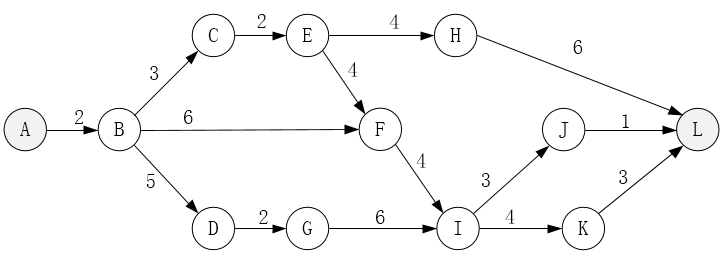

### 问题1
- A. 17
- B. 19
- C. 20
- D. 22
### 问题2
- A. 3和3
- B. 3和6
- C. 5和3
- D. 5和6

## 第15题（单选题）

工作量估算模型COCOMO II的层次结构中，估算选择不包括（  ）。

- A. 对象点
- B. 功能点
- C. 用例数
- D. 源代码行

## 第16题（单选题）

（  ）是一种函数式编程语言。

- A. Lisp
- B. Prolog
- C. Python
- D. Java/C++

## 第17题（单选题）

将高级语言源程序翻译为可在计算机上执行的形式有多种不同的方式，其中（  ）。

- A. 编译方式和解释方式都生成逻辑上与源程序等价的目标程序
- B. 编译方式和解释方式都不生成逻辑上与源程序等价的目标程序
- C. 编译方式生成逻辑上与源程序等价的目标程序，解释方式不生成
- D. 解释方式生成逻辑上与源程序等价的目标程序，编译方式不生成

## 第18题（单选题）

对于后缀表达式a b c - + d *（其中，-、+、*表示二元算术运算减、加、乘），与该后缀式等价的语法树为（  ）。

- A. 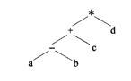
- B. 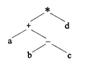
- C. 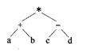
- D. 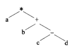

## 第19题（单选题）

假设铁路自动售票系统有n个售票终端，该系统为每个售票终端创建一个进程P**i**(i=1,2,…,n)管理车票销售过程。假设T**j**(j=1,2,…,m)单元存放某日某趟车的车票剩余票数，Temp为P**i**进程的临时工作单元，x为某用户的购票张数。P**i**进程的工作流程如下图所示，用P操作和Ⅴ操作实现进程间的同步与互斥。初始化时系统应将信号量S赋值为（  ）。图中（a）、（b）和（c）处应分别填入（  ）。
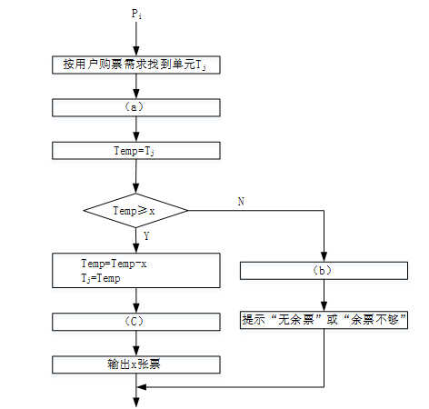

### 问题1
- A. n-1
- B. 0
- C. 1
- D. 2
### 问题2
- A. V(S)、P(S)和P(S)
- B. P(S)、P(S)和V(S)
- C. V(S)、V(S)和P(S)
- D. P(S)、V(S)和V(S)

## 第20题（单选题）

若系统在将（  ）文件修改的结果写回磁盘时发生崩溃，则对系统的影响相对较大。

- A. 目录
- B. 空闲块
- C. 用户程序
- D. 用户数据

## 第21题（单选题）

I/O设备管理软件一般分为4个层次，如下图所示。图中①②③分别对应（  ）。
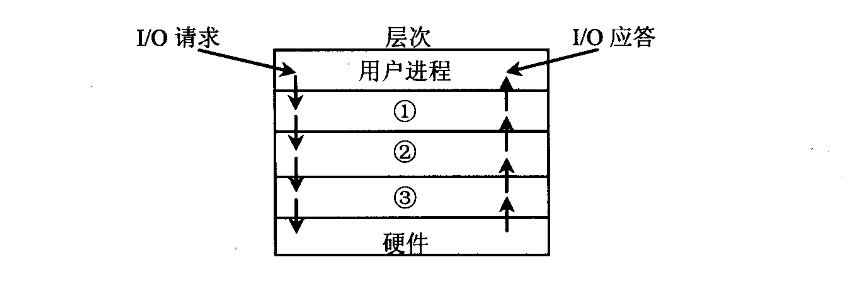

- A. 设备驱动程序、虚设备管理、与设备无关的系统软件
- B. 设备驱动程序、与设备无关的系统软件、虚设备管理
- C. 与设备无关的系统软件、中断处理程序、设备驱动程序
- D. 与设备无关的系统软件、设备驱动程序、中断处理程序

## 第22题（单选题）

若某文件系统的目录结构如下图所示，假设用户要访问文件rw.dll，且当前工作目录为swtools，则该文件的全文件名为（  ），相对路径和绝对路径分别为（  ）。
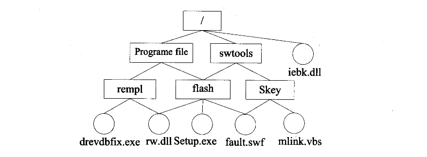

### 问题1
- A. rw.dll
- B. flash/rw.dll
- C. /swtools/flash/rw.dll
- D. /Programe file/Skey/rw.dll
### 问题2
- A. /swtools/flash/和/flash/
- B. flash/和/swtools/flash/
- C. /swtools/flash/和flash/
- D. /flash/和swtools/flash/

## 第23题（单选题）

以下关于增量模型的叙述中，不正确的是（  ）。

- A. 容易理解，管理成本低
- B. 核心的产品往往首先开发，因此经历最充分的“测试”
- C. 第一个可交付版本所需要的成本低，时间少
- D. 即使一开始用户需求不清晰，对开发进度和质量也没有影响

## 第24题（单选题）

能力成熟度模型集成（CMMI）是若干过程模型的综合和改进。连续式模型和阶段式模型是CMMI提供的两种表示方法。连续式模型包括6个过程域能力等级（Capability Level，CL），其中（  ）的共性目标是过程将可标识的输入工作产品转换成可标识的输出工作产品，以实现支持过程域的特定目标。

- A. CL1（已执行的）
- B. CL2（已管理的）
- C. CL3（已定义的）
- D. CL4（定量管理的）

## 第25题（单选题）

软件维护工具不包括（  ）工具。

- A. 版本控制
- B. 配置管理
- C. 文档分析
- D. 逆向工程

## 第26题（单选题）

概要设计文档的内容不包括（  ）。

- A. 体系结构设计
- B. 数据库设计
- C. 模块内算法设计
- D. 逻辑数据结构设计

## 第27题（单选题）

耦合是模块之间的相对独立性（互相连接的紧密程度）的度量。耦合程度不取决于（  ）。

- A. 调用模块的方式
- B. 各个模块之间接口的复杂程度
- C. 通过接口的信息类型
- D. 模块提供的功能数

## 第28题（单选题）

对下图所示的程序流程图进行判定覆盖测试，则至少需要（  ）个测试用例。采用 McCabe度量法计算其环路复杂度为（  ）。
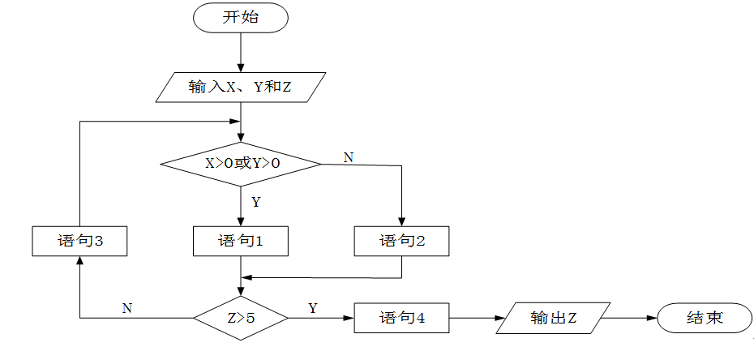

### 问题1
- A. 2
- B. 3
- C. 4
- D. 5
### 问题2
- A. 2
- B. 3
- C. 4
- D. 5

## 第29题（单选题）

软件调试的任务就是根据测试时所发现的错误，找出原因和具体的位置，进行改正。其常用的方法中，（  ）是指从测试所暴露的问题出发，收集所有正确或不正确的数据，分析它们之间的关系，提出假想的错误原因，用这些数据来证明或反驳，从而查出错误所在。

- A. 试探法
- B. 回溯法
- C. 归纳法
- D. 演绎法

## 第30题（单选题）

对象的（  ）标识了该对象的所有属性（通常是静态的）以及每个属性的当前值（通常是动态的）。

- A. 状态
- B. 唯一ID
- C. 行为
- D. 语义

## 第31题（单选题）

在下列机制中，（  ）是指过程调用和响应调用所需执行的代码在运行时加以结合；而（  ）是过程调用和响应调用所需执行的代码在编译时加以结合。

### 问题1
- A. 消息传递
- B. 类型检查
- C. 静态绑定
- D. 动态绑定
### 问题2
- A. 消息传递
- B. 类型检查
- C. 静态绑定
- D. 动态绑定

## 第32题（单选题）

同一消息可以调用多种不同类的对象的方法，这些类有某个相同的超类，这种现象是（  ）。

- A. 类型转换
- B. 映射
- C. 单态
- D. 多态

## 第33题（单选题）

如下所示的图为UML的（  ），用于展示某汽车导航系统中（  ）。Mapping对象获取汽车当前位置（GPS Location）的消息为（  ）。
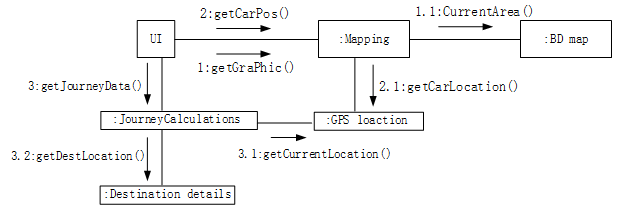

### 问题1
- A. 类图
- B. 组件图
- C. 通信图
- D. 部署图
### 问题2
- A. 对象之间的消息流及其顺序
- B. 完成任务所进行的活动流
- C. 对象的状态转换及其事件顺序
- D. 对象之间消息的时间顺序
### 问题3
- A. 1: getGraphic()
- B. 2: getCarPos()
- C. 1.1: CurrentArea()
- D. 2. 1: getCarLocation()

## 第34题（单选题）

假设现在要创建一个Web应用框架，基于此框架能够创建不同的具体Web应用，比如博客、新闻网站和网上商店等；并可以为每个Web应用创建不同的主题样式，如浅色或深色等。这一业务需求的类图设计适合采用（  ）模式（如下图所示）。其中（  ）是客户程序使用的主要接口，维护对主题类型的引用。此模式为（  ），体现的最主要的意图是（  ）。
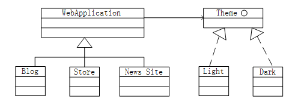

### 问题1
- A. 观察者（Observer）
- B. 访问者（Ⅴisitor）
- C. 策略（Strategy）
- D. 桥接（Bridge）
### 问题2
- A. WebApplication
- B. Blog
- C. Theme
- D. Light
### 问题3
- A. 创建型对象模式
- B. 结构型对象模式
- C. 行为型类模式
- D. 行为型对象模式
### 问题4
- A. 将抽象部分与其实现部分分离，使它们都可以独立地变化
- B. 动态地给一个对象添加一些额外的职责
- C. 为其他对象提供一种代理以控制对这个对象的访问
- D. 将一个类的接口转换成客户希望的另外一个接口

## 第35题（单选题）

下图所示为一个不确定有限自动机（NFA）的状态转换图。该NFA识别的字符串集合可用正规式（  ）描述。

- A. ab*a
- B. (ab)*a
- C. a*ba
- D. a(ba)*

## 第36题（单选题）

简单算术表达式的结构可以用下面的上下文无关文法进行描述（E为开始符号），（  ）是符合该文法的句子。
               E→T|E+T
               T→F|T*F
               F→-F|N
               N→0|1|2|3l4|5|6|7|8|9

- A. 2--3*4
- B. 2+-3*4
- C. (2+3)*4
- D. 2*4-3

## 第37题（单选题）

语法指导翻译是一种（  ）方法。

- A. 动态语义分析
- B. 中间代码优化
- C. 静态语义分析
- D. 目标代码优化

## 第38题（单选题）

给定关系模式R < U，F > ，其中U为属性集，F是U上的一组函数依赖，那么Armstrong公理系统的伪传递律是指（  ）。

- A. 若X→Y，X→Z，则X→YZ为F所蕴涵
- B. 若X→Y，WY→Z，则XW→Z为F所蕴涵
- C. 若X→Y，Y→Z为F所蕴涵，则X→Z为F所蕴涵
- D. 若Ⅹ→Y为F所蕴涵，且Z⊆U，则XZ→YZ为F所蕴涵

## 第39题（单选题）

给定关系R(A,B,C,D,E)与S(B,C,F,G)，那么与表达式π2,4,6,7(σ2 <  7(R⋈S))等价的SQL语句如下：
SELECT  （  ）  FROM  R, S  WHERE  （  ）  ；

### 问题1
- A. R.B，D，F，G
- B. R.B，E，S.C，F，G
- C. R.B，R.D，S.C，F
- D. R.B，R.C，S.C，F
### 问题2
- A. R.B=S.B OR R.C = S.C OR R.B < S.G
- B. R.B=S.B OR R.C = S.C OR R.B < S.C
- C. R.B=S.B AND R.C = S.C AND R.B < S.G
- D. R.B=S.B AND R.C = S.C AND R.B < S.C

## 第40题（单选题）

给定教师关系 Teacher（T_no, T_name, Dept_name,Tel），其中属性T_no、T_name、Dept_name和Tel的含义分别为教师号、教师姓名、学院名和电话号码。用SQL创建一个“给定学院名求该学院的教师数”的函数如下：
          Create function Dept_count(Dept_name varchar(20))
                      （  ）
                  begin
                      （  ）
                          select count(*)into d_count
                          from Teacher
                          where Teacher.Dept_ name= Dept_name
                  return d_count
                  end

### 问题1
- A. returns integer
- B. returns d_count integer
- C. declare integer
- D. declare d_count integer
### 问题2
- A. returns integer
- B. returns d_count integer
- C. declare integer
- D. declare d_count integer

## 第41题（单选题）

某集团公司下有多个超市，每个超市的所有销售数据最终要存入公司的数据仓库中。假设该公司高管需要从时间、地区和商品种类三个维度来分析某家电商品的销售数据，那么最适合采用（ ）来完成。

- A. Data Extraction
- B. OLAP
- C. OLTP
- D. ETL

## 第42题（单选题）

队列的特点是先进先出，若用循环单链表表示队列，则（  ）。

- A. 入队列和出队列操作都不需要遍历链表
- B. 入队列和出队列操作都需要遍历链表
- C. 入队列操作需要遍历链表而出队列操作不需要
- D. 入队列操作不需要遍历链表而出队列操作需要

## 第43题（单选题）

设有n阶三对角矩阵A，即非零元素都位于主对角线以及与主对角线平行且紧邻的两条对角线上，现对该矩阵进行按行压缩存储，若其压储空间用数组B表示，A的元素下标从0开始，B的元素下标从1开始。已知A[0，0]存储在B[1]，A[n-1，n-1]存储在B[3n-2]，那么非零元素A[i，j]（0 ≤ i < n，0 ≤ j < n，|i-j|≤1）存储在B[（ ）]。

- A. 2i+j-1
- B. 2i+j
- C. 2i+j+1
- D. 3i-j+1

## 第44题（单选题）

对下面的二叉树进行顺序存储（用数组MEM表示），已知节点A、B、C在MEM中对应元素的下标分别为1、2、3，那么节点D、E、F对应的数组元素下标为（ ）。
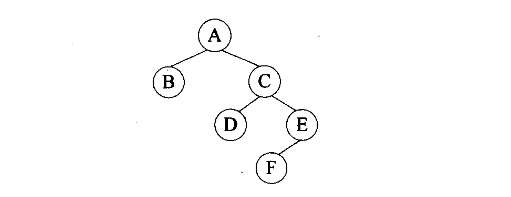

- A. 4、5、6
- B. 4、7、10
- C. 6、7、8
- D. 6、7、14

## 第45题（单选题）

用哈希表存储元素时，需要进行冲突（碰撞）处理，冲突是指（  ）。

- A. 关键字被依次映射到地址编号连续的存储位置
- B. 关键字不同的元素被映射到相同的存储位置
- C. 关键字相同的元素被映射到不同的存储位置
- D. 关键字被映射到哈希表之外的位置

## 第46题（单选题）

对有n个结点、e条边且采用数组表示法（即邻接矩阵存储）的无向图进行深度优先遍历，时间复杂度为（  ）。

- A. O(n2)
- B. O(e2)
- C. O(n+e)
- D. O(n*e)

## 第47题（单选题）

现需要申请一些场地举办一批活动，每个活动有开始时间和结束时间。在同一个场地，如果一个活动结束之前，另一个活动开始，即两个活动冲突。若活动A从1时间开始，5时间结束，活动B从5时间开始，8时间结束，则活动A和B不冲突。现要计算n个活动需要的最少场地数。
求解该问题的基本思路如下（假设需要场地数为m，活动数为n，场地集合为P1，P2，…，Pm），初始条件Pi均无活动安排：
（1）采用快速排序算法对n个活动的开始时间从小到大排序，得到活动a1，a2，…，an。对每个活动ai，i从1到n，重复步骤（2）、（3）和（4）；
（2）从p1开始，判断ai与P1的最后一个活动是否冲突，若冲突，考虑下一个场地p2，…；
（3）一旦发现ai与某个pj的最后一个活动不冲突，则将ai安排到Pj，考虑下一个活动；
（4）若ai与所有已安排活动的pj的最后一个活动均冲突，则将ai安排到一个新的场地，考虑下一个活动；
（5）将n减去没有安排活动的场地数即可得到所用的最少场地数。
算法首先采用了快速排序算法进行排序，其算法设计策略是（  ）；后面步骤采用的算法设计策略是（  ）。整个算法的时间复杂度是（  ）。下表给出了n=11的活动集合，根据上述算法，得到最少的场地数为（  ）。
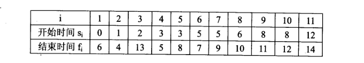

### 问题1
- A. 分治
- B. 动态规划
- C. 贪心
- D. 回溯
### 问题2
- A. 分治
- B. 动态规划
- C. 贪心
- D. 回溯
### 问题3
- A. Θ(lgn)
- B. Θ(n)
- C. Θ(nlgn)
- D. Θ(n2)
### 问题4
- A. 4
- B. 5
- C. 6
- D. 7

## 第48题（单选题）

下列网络互连设备中，属于物理层的是（  ）。

- A. 交换机
- B. 中继器
- C. 路由器
- D. 网桥

## 第49题（单选题）

在地址http://www.dailynews.com.cn/channel/welcome.html中，www.dailynews.com.cn表示（  ），welcome.html表示（  ）。

### 问题1
- A. 协议类型
- B. 主机
- C. 网页文件名
- D. 路径
### 问题2
- A. 协议类型
- B. 主机域名
- C. 网页文件名
- D. 路径

## 第50题（单选题）

在Linux中，要更改一个文件的权限设置可使用（  ）命令。

- A. attrib
- B. modify
- C. chmod
- D. change

## 第51题（单选题）

主域名服务器在接收到域名请求后，首先查询的是（  ）。

- A. 本地hosts文件
- B. 转发域名服务器
- C. 本地缓存
- D. 授权域名服务器

## 第52题（单选题）

Creating a clear map of where the project is going is an important first step. It lets you identify risks, clarify objectives, and determine if the project even makes sense. The only thing more important than the Release Plan is not to take it too seriously.
Release planning is creating a game plan for your Web project （1） what you think you want your Web site to be. The plan is a guide for the content, design elements, and functionality of a Web site to be released to the public, to partners, or internally. It also （2） how long the project will take and how much it will cost. What the plan is not is a functional （3） that defines the project in detail or that produces a budget you can take to the bank.
Basically you use a Release Plan to do an initial sanity check of the project's （4） and worthiness. Release Plans are useful road maps, but don't think of them as guides to the interstate road system. Instead, think of them as the （5） used by early explorers—half rumor and guess and half hope and expectation.
It's always a good idea to have a map of where a project is headed.

### 问题1
- A. constructing
- B. designing
- C. implementing
- D. outlining
### 问题2
- A. defines
- B. calculates
- C. estimates
- D. knows
### 问题3
- A. specification
- B. structure
- C. requirement
- D. implementation
### 问题4
- A. correctness
- B. modifiability
- C. feasibility
- D. traceability
### 问题5
- A. navigators
- B. maps
- C. guidances
- D. goals
