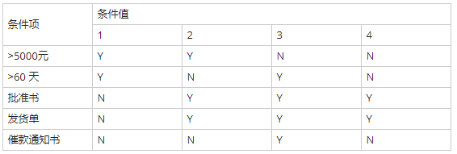
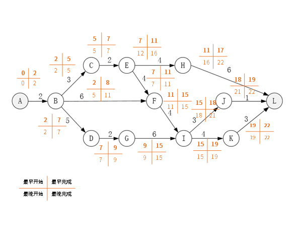

# 2018上半年选择题

- 来源标题: 2018年上半年软件设计师考试基础知识真题（专业解析+参考答案）
- 试卷介绍页: https://wangxiao.xisaiwang.com/tiku2/136/tp191657.html?cid=136
- 练习页: https://wangxiao.xisaiwang.com/tiku2/exam534904423.html
- 题量: 52

## 第1题（单选题）

浮点数的表示分为阶和尾数两部分。两个浮点数相加时，需要先对阶，即（D）（n为阶差的绝对值）。

- A. 将大阶向小阶对齐，同时将尾数左移n位
- B. 将大阶向小阶对齐，同时将尾数右移n位
- C. 将小阶向大阶对齐，同时将尾数左移n位
- D. 将小阶向大阶对齐，同时将尾数右移n位

### 正确答案

D

### 解析

本题考查数据表示和运算知识。对阶时，小数向大数看齐；对阶是通过阶码小的尾数右移实现的。ABC选项描述有误，本题选择D选项。

## 第2题（单选题）

计算机运行过程中，遇到突发事件，要求CPU暂时停止正在运行的程序，转去为突发事件服务，服务完毕，再自动返回原程序继续执行，这个过程称为（B/C），其处理过程中保存现场的目的是（  ）。

### 问题1
- A. 阻塞
- B. 中断
- C. 动态绑定
- D. 静态绑定
### 问题2
- A. 防止丢失数据
- B. 防止对其他部件造成影响
- C. 返回去继续执行原程序
- D. 为中断处理程序提供数据

### 正确答案

B、C

### 解析

本题考查计算机系统基础知识。
中断是指计算机运行过程中，出现某些意外情况需主机干预时，机器能自动停止正在运行的程序并转入处理新情况的程序，处理完毕后又返回原被暂停的程序继续运行。
阻塞进程因等待某一件事情（如等待I/O设备）而暂时不能运行的状态，此时即使处理机空闲，进程也无法使用。
程序运行过程中，把函数（或过程）调用与响应调用所需要的代码相结合的过程称为动态绑定。
程序编译过程中，把函数（或过程）调用与响应调用所需要的代码相结合的过程称为静态绑定。
本题选择BC。

## 第3题（单选题）

海明码是一种纠错码，其方法是为需要校验的数据位增加若干校验位，使得校验位的值决定于某些被校位的数据，当被校数据出错时，可根据校验位的值的变化找到出错位，从而纠正错误。对于32位的数据，至少需要增加（D/B）个校验位才能构成海明码。
以10位数据为例，其海明码表示为 D9D8D7D6D5D4P4D3D2D1P3D0P2P1中，其中D**i**（0≤i≤9）表示数据位，P**j**（1 ≤j≤4）表示校验位，数据位D9由P4、P3和P2进行校验（从右至左D9的位序为14，即等于8＋4＋2，因此用第8位的P4、第4位的P3和第2位的P2校验），数据位D5由（  ）进行校验。

### 问题1
- A. 3
- B. 4
- C. 5
- D. 6
### 问题2
- A. P4P1
- B. P4P2
- C. P4P3P1
- D. P3P2P1

### 正确答案

D、B

### 解析

[['本题考查计算机系统基础知识。海明不等式：校验码个数为K，2的K次方个校验信息，1个校验信息用来指出“没有错误”，满足m+k+1 < =2k。所以32位的数据位，需要6位校验码。
第二问考查的是海明编码的规则，构造监督关系式，和校验码的位置相关：
数据位D9受到P4、P3、P2监督（14=8+4+2），那么D5受到P4、P2的监督（10=8+2）。
根据本题描述海明码表示为： D9D8D7D6D5D4P4D3D2D1P3D0P2P1数据位D9由P4、P3和P2进行校验（从右至左D9的位序为14，即等于14=8＋4＋2=23+22+21，因此用第8位的P4、第4位的P3和第2位的P2校验）。
D5的位序为10，即等于10=8+2=23+21，因此用第8位的P4、第2位的P2校验。
【这里是以2n展开】
综上所述，本题选择DB。
''],['
']]

## 第4题（单选题）

流水线的吞吐率是指单位时间流水线处理的任务数，如果各段流水的操作时间不同，则流水线的吞吐率是（C）的倒数。

- A. 最短流水段操作时间
- B. 各段流水的操作时间总和
- C. 最长流水段操作时间
- D. 流水段数乘以最长流水段操作时间

### 正确答案

C

### 解析

本题考查计算机系统基础知识。
流水线处理机在执行指令时，把执行过程分为若干个流水级，若各流水级需要的时间不同，则流水线必须选择各级中时间较大者为流水级的处理时间。
理想情况下，当流水线充满时，每一个流水级时间流水线输出一个结果。
流水线的吞吐率是指单位时间内流水线处理机输出的结果的数目，因此流水线的吞吐率为一个流水级时间的倒数，即最长流水段时间的倒数。
ABD描述错误，本题选择C选项。

## 第5题（单选题）

网络管理员通过命令行方式对路由器进行管理，需要确保ID、口令和会话内容的保密性，应采取的访问方式是（D）。

- A. 控制台
- B. AUX
- C. TELNET
- D. SSH

### 正确答案

D

### 解析

本题考查网络管理时对路由器的基础操作。SSH 为 Secure Shell 的缩写，由 IETF 的网络小组（Network Working Group）所制定；SSH 为建立在应用层基础上的安全协议。SSH 是目前较可靠，专为远程登录会话和其他网络服务提供安全性的协议。利用 SSH 协议可以有效防止远程管理过程中的信息泄露问题。
AUX接口也叫远程连接接口，主要用于远程连接路由器，登录路由器远程管理与配置路由器使用。远程连接是采用电话连接，两端都必须使用电话猫来连接电话线。这是一种很古老的连接方式，现在很少使用。
telnet通过TCP/IP协议来访问远程计算机来控制设备，其传输的数据和口令是明文形式的。这样攻击者就很容易得到口令和数据。
本题选择D选项

## 第6题（单选题）

在安全通信中，S将所发送的信息使用（B/A）进行数字签名，T收到该消息后可利用（  ）验证该消息的真实性。

### 问题1
- A. S的公钥
- B. S的私钥
- C. T的公钥
- D. T的私钥
### 问题2
- A. S的公钥
- B. S的私钥
- C. T的公钥
- D. T的私钥

### 正确答案

B、A

### 解析

本题考查数字签名方面的基础知识。数字签名技术是将摘要信息用发送者的私钥加密，与原文一起传送给接收者。接收者只有用发送者的公钥才能解密被加密的摘要信息，然后用HASH函数对收到的原文产生一个摘要信息，与解密的摘要信息对比。如果相同，则说明收到的信息是完整的，在传输过程中没有被修改，否则说明信息被修改过，因此数字签名能够验证信息的完整性。
数字签名是个加密的过程，数字签名验证是个解密的过程。保证信息传输的完整性、发送者的身份认证、防止交易中的抵赖发生。
本题选择B选项。

## 第7题（单选题）

在网络安全管理中，加强内防内控可采取的策略有（D）。
①控制终端接入数量
②终端访问授权，防止合法终端越权访问
③加强终端的安全检查与策略管理
④加强员工上网行为管理与违规审计

- A. ②③
- B. ②④
- C. ①②③④
- D. ②③④

### 正确答案

D

### 解析

本题考查校网络安全相关的基础知识。加强内防内控主要通过访问授权、安全策略、安全检查与行为审计等多种安全手段的综合应用来实现。终端接入的数量影响的是网络的规模、数据交换的性能，不是内防内控关注的重点。
本题选择D选项。

## 第8题（单选题）

攻击者通过发送一个目的主机已经接收过的报文来达到攻击目的，这种攻击方式属于（A）攻击。

- A. 重放
- B. 拒绝服务
- C. 数据截获
- D. 数据流分析

### 正确答案

A

### 解析

本题目考查网络攻击相关基础知识。重放攻击（Replay Attacks）又称重播攻击、回放攻击，是指攻击者发送一个目的主机已接收过的包，来达到欺骗系统的目的，主要用于身份认证过程，破坏认证的正确性。重放攻击可以由发起者，也可以由拦截并重发该数据的敌方进行。
拒绝服务（英文名称denial of service;DoS）是指通过向服务器发送大量垃圾信息或干扰信息的方式，导致服务器无法向正常用户提供服务的现象。  
数据截取攻击是指黑客通过窃取或截取网络中传输的数据包,来获取敏感信息的一种攻击方式。  
数据流分析攻击是指攻击者对网络流量进行捕获、分析和处理,从而获取其中的敏感信息,比如用户的行为、偏好、习惯等  。
本题选择A选项。

## 第9题（单选题）

以下有关计算机软件著作权的叙述中，正确的是（A）。

- A. 非法进行拷贝、发布或更改软件的人被称为软件盗版者
- B. 《计算机软件保护条例》是国家知识产权局颁布的，用来保护软件著作权人的权益
- C. 软件著作权属于软件开发者，软件著作权自软件开发完成之日起产生
- D. 用户购买了具有版权的软件，则具有对该软件的使用权和复制权

### 正确答案

A

### 解析

本题考查软件著作权相关知识。选项B 中由国务院颁布；选项C中委托开发、合作开发软件著作权的归属及行使原则与一般作品著作权归属及行使原则一样，但职务计算机软件的著作权归属有一定的特殊性。自然人在法人或者其他组织中任职期间所开发的软件有下列情形之一的，该软件著作权由该法人或者其他组织享有，该法人或者其他组织可以对开发软件的自然人进行奖励；D选项中复制权，是指制作作品复制品的权利。依作品表现形式不同分为三种情形：（1）以图书、报纸、期刊等印刷品形式复制和传播作品的权利，即通常所说的出版权；（2）以唱片、磁带、幻灯片等音像制品形式复制和传播作品的权利，即录音录像权或机械复制权；（3）使用临摹、照相、雕塑、雕刻等方法复制和传播美术等作品的权利，即狭义上的复制权。
本题选择A选项。

## 第10题（单选题）

王某是某公司的软件设计师，完成某项软件开发后按公司规定进行软件归档。以下有关该软件的著作权的叙述中，正确的是（B）。

- A. 著作权应由公司和王某共同享有
- B. 著作权应由公司享有
- C. 著作权应由王某享有
- D. 除署名权以外，著作权的其他权利由王某享有

### 正确答案

B

### 解析

本题考查软件著作权相关知识。此为职务作品，凡是供职于某公司，利用公司相关资源进行开发完成的作品，其著作权归公司所有。

## 第11题（单选题）

著作权中，（C）的保护期不受限制。

- A. 发表权
- B. 发行权
- C. 署名权
- D. 展览权

### 正确答案

C

### 解析

本题考查著作权期限相关知识。《中华人民共和国著作权法》对著作权的保护期限作了如下规定：（1）著作权中的署名权、修改权、保护作品完整权的保护期不受限制。

## 第12题（单选题）

数据字典是结构化分析的一个重要输出。数据字典的条目不包括（A）。

- A. 外部实体
- B. 数据流
- C. 数据项
- D. 基本加工

### 正确答案

A

### 解析

本题考查结构化分析与设计的相关知识。数据字典是指对数据的数据项、数据结构、数据流、数据存储、处理逻辑、外部实体等进行定义和描述，其目的是对数据流程图中的各个元素作出详细的说明，使用数据字典为简单的建模项目。其条目有数据流、数据项、数据存储、基本加工等。

## 第13题（单选题）

某商店业务处理系统中，基本加工“检查订货单”的描述为：若订货单金额大于5000元，且欠款时间超过60天，则不予批准；若订货单金额大于5000元，且欠款时间不超过60天，则发出批准书和发货单；若订货单金额小于或等于5000元，则发出批准书和发货单，若欠款时间超过60天，则还要发催款通知书。现采用决策表表示该基本加工，则条件取值的组合数最少是（B）。

- A. 2
- B. 3
- C. 4
- D. 5

### 正确答案

B

### 解析

本题考查结构化分析与设计的相关知识。根据题意可得出如下决策表：

其中第2条和第4条可进行合并，故该条件取值的组合数为3。

## 第14题（单选题）

某软件项目的活动图如下图所示，其中顶点表示项目里程碑，连接顶点的边表示包含的活动，边上的数字表示活动的持续天数，则完成该项目的最少时间为（D/C）天。活动EH和IJ的松弛时间分别为（  ）天。

### 问题1
- A. 17
- B. 19
- C. 20
- D. 22
### 问题2
- A. 3和3
- B. 3和6
- C. 5和3
- D. 5和6

### 正确答案

D、C

### 解析

本题考查软件项目管理的基础知识。在网络图中的某些活动可以并行地进行，所以完成工程的最少时间是从开始顶点到结束顶点的最长路径长度，从开始顶点到结束顶点的最长（工作时间之和最大）路径为关键路径，关键路径上的活动为关键活动。
本题关键路径为：A-B-D-G-I-K-L，共22天。
EH的松弛时间是22-（2+3+2+4+6）=5天。
IJ的松弛时间是22-（2+5+2+6+3+1）=3天。

## 第15题（单选题）

工作量估算模型COCOMO II的层次结构中，估算选择不包括（C）。

- A. 对象点
- B. 功能点
- C. 用例数
- D. 源代码行

### 正确答案

C

### 解析

本题考查项目管理中工作量估算的相关知识。COCOMO II模型也是需要使用规模去估算信息，
在模型层次结构中总共有3种不同规模估算选择：对象点、功能点和代码行。
本题选择C选项

## 第16题（单选题）

（A）是一种函数式编程语言。

- A. Lisp
- B. Prolog
- C. Python
- D. Java/C++

### 正确答案

A

### 解析

本题考查程序语言分类知识。
LISP是一种通用高级计算机程序语言，长期以来垄断人工智能领域的应用。LISP作为因应人工智能而设计的语言，是第一个声明式系内函数式程序设计语言，有别于命令式系内过程式的C、Fortran和面向对象的Java、C++等结构化程序设计语言。
prolog (Programming in logic)是一种面向演绎推理的逻辑型程序设计语言。
python语言属于解释型的脚本语言，同时也是一种面向对象的动态类型语言 。
因此，BCD描述与题意不符，本题选择A选项。

## 第17题（单选题）

将高级语言源程序翻译为可在计算机上执行的形式有多种不同的方式，其中（C）。

- A. 编译方式和解释方式都生成逻辑上与源程序等价的目标程序
- B. 编译方式和解释方式都不生成逻辑上与源程序等价的目标程序
- C. 编译方式生成逻辑上与源程序等价的目标程序，解释方式不生成
- D. 解释方式生成逻辑上与源程序等价的目标程序，编译方式不生成

### 正确答案

C

### 解析

本题考查程序语言基础知识。
编译语言是一种以编译器来实现的编程语言。它不像直译语言一样，由解释器将代码一句一句运行，而是以编译器，先将代码编译为机器码，再加以运行。将某一种程序设计语言写的程序翻译成等价的另一种语言的程序，称之为编译程序。因此编译方式生成目标程序，解释方式不生成。
ABD描述与题意不符，本题选择C选项。

## 第18题（单选题）

对于后缀表达式a b c - + d *（其中，-、+、*表示二元算术运算减、加、乘），与该后缀式等价的语法树为（B）。

- A. 
- B. 
- C. 
- D. 

### 正确答案

B

### 解析

本题考查程序语言相关知识。
对题中ABCD4个二叉树进行后序遍历，得出结果与该后缀表达式一致的则为与其等价的语法树。
A为：ab-c+d*
B为：abc-+d*
C为：ab+cd-*
D为：abcd-+*
因此，ACD描述与题意不符，本题选择B选项。

## 第19题（单选题）

假设铁路自动售票系统有n个售票终端，该系统为每个售票终端创建一个进程P**i**(i=1,2,…,n)管理车票销售过程。假设T**j**(j=1,2,…,m)单元存放某日某趟车的车票剩余票数，Temp为P**i**进程的临时工作单元，x为某用户的购票张数。P**i**进程的工作流程如下图所示，用P操作和Ⅴ操作实现进程间的同步与互斥。初始化时系统应将信号量S赋值为（C/D）。图中（a）、（b）和（c）处应分别填入（  ）。

### 问题1
- A. n-1
- B. 0
- C. 1
- D. 2
### 问题2
- A. V(S)、P(S)和P(S)
- B. P(S)、P(S)和V(S)
- C. V(S)、V(S)和P(S)
- D. P(S)、V(S)和V(S)

### 正确答案

C、D

### 解析

本题考查PV操作方面的知识。
信号量S应当是同一时间能查询Tj的进程数。而买票只能一个一个买，所以同一时间能查询Tj的进程数应当是1，即信号量S初值为1。
（a）应为申请资源，（b）（c）应当为释放资源，故是一个P，两个V操作。
信号量S应当是该单元数，对某日某趟车为一个单元的话，单元数只能为1。
（a）应为申请资源，（b）（c）应当为释放资源，故是一个P，两个V操作。
综上所述，本题选择CD。

## 第20题（单选题）

若系统在将（A）文件修改的结果写回磁盘时发生崩溃，则对系统的影响相对较大。

- A. 目录
- B. 空闲块
- C. 用户程序
- D. 用户数据

### 正确答案

A

### 解析

本题考查操作系统文件管理可靠性方面的知识。
目录：目录文件（或称为文件系统元数据）包含了关于文件系统中文件和目录的信息，如文件名、文件大小、文件位置等。如果目录文件在修改过程中崩溃，可能会导致文件系统的不一致，使得系统无法正确地找到或访问文件。这可能导致数据丢失或文件系统损坏，需要修复或重建。
空闲块：空闲块是文件系统中尚未分配给任何文件的存储空间。对空闲块的修改主要是为了标记哪些块是可用的或已分配的。如果在这个过程中系统崩溃，虽然可能会导致一些空间管理上的不一致，但通常不会导致数据丢失，因为系统可以通过其他机制来修复这些不一致。
用户程序：用户程序文件包含了程序代码和可能的数据。如果系统在写回用户程序文件的修改结果时崩溃，最坏的情况是该程序文件损坏，但通常不会导致整个系统崩溃或数据丢失。用户可以通过重新编译或恢复备份的程序文件来解决问题。
用户数据：用户数据文件包含了用户创建或使用的数据，如文档、图片、视频等。如果系统在写回用户数据文件的修改结果时崩溃，可能会导致数据丢失或损坏。然而，与目录文件相比，这种数据丢失通常是局部的，仅限于特定的文件或文件集，而不是整个文件系统。  
因此，BCD错误，本题选择A选项。

## 第21题（单选题）

I/O设备管理软件一般分为4个层次，如下图所示。图中①②③分别对应（D）。

- A. 设备驱动程序、虚设备管理、与设备无关的系统软件
- B. 设备驱动程序、与设备无关的系统软件、虚设备管理
- C. 与设备无关的系统软件、中断处理程序、设备驱动程序
- D. 与设备无关的系统软件、设备驱动程序、中断处理程序

### 正确答案

D

### 解析

本题考查I/O设备相关知识。
具体层次从上往下分别为用户级I/O层、设备无关I/O层、设备驱动程序、中断处理程序、硬件。
硬件：完成具体的I/O操作。
中断处理程序：I/O完成后唤醒设备驱动程序。
设备驱动程序：设置寄存器，检查设备状态。
设备无关I/O层：设备名解析、阻塞进程、分配缓冲区。
用户级I/O层：发出I/O调用。
因此，ABC描述不符，本题选择D选项。

## 第22题（单选题）

若某文件系统的目录结构如下图所示，假设用户要访问文件rw.dll，且当前工作目录为swtools，则该文件的全文件名为（C/B），相对路径和绝对路径分别为（  ）。

### 问题1
- A. rw.dll
- B. flash/rw.dll
- C. /swtools/flash/rw.dll
- D. /Programe file/Skey/rw.dll
### 问题2
- A. /swtools/flash/和/flash/
- B. flash/和/swtools/flash/
- C. /swtools/flash/和flash/
- D. /flash/和swtools/flash/

### 正确答案

C、B

### 解析

本题考查对操作系统文件管理方面的基础知识。
该文件的全文件名包括其所在路径及其文件名称，为/swtools/flash/rw.dll。
相对路径就是指由这个文件所在的路径引起的跟其他文件（或文件夹）的路径关系；题中为flash/；
绝对路径是指目录下的绝对位置，直接到达目标位置；题中为/swtools/flash/。
综上所述，本题选择CB。

## 第23题（单选题）

以下关于增量模型的叙述中，不正确的是（D）。

- A. 容易理解，管理成本低
- B. 核心的产品往往首先开发，因此经历最充分的“测试”
- C. 第一个可交付版本所需要的成本低，时间少
- D. 即使一开始用户需求不清晰，对开发进度和质量也没有影响

### 正确答案

D

### 解析

本题考查软件过程模型的相关知识。增量模型又称为渐增模型，也称为有计划的产品改进模型，它从一组给定的需求开始，通过构造一系列可执行中间版本来实施开发活动。第一个版本纳入一部分需求，下一个版本纳入更多的需求，依此类推，直到系统完成。每个中间版本都要执行必需的过程、活动和任务。增量模型是瀑布模型和原型进化模型的综合，它对软件过程的考虑是：在整体上按照瀑布模型的流程实施项目开发，以方便对项目的管理；但在软件的实际创建中，则将软件系统按功能分解为许多增量构件，并以构件为单位逐个地创建与交付，直到全部增量构件创建完毕，并都被集成到系统之中交付用户使用。与瀑布模型和原型进化模型相比，增量模型具有非常显著的优越性。但增量模型对软件设计有更高的技术要求，特别是对软件体系结构，要求它具有很好的开放性与稳定性，能够顺利地实现构件的集成。增量模型有以下不足之处：如果没有对用户的变更要求进行规划，那么产生的初始增量可能会造成后来增量的不稳定；如果需要不像早期思考的那样稳定和完整，那么一些增量就可能需要重新开发，重新发布；管理发生的成本、进度和配置的复杂性可能会超出组织的能力。一开始需求不清晰，会影响开发的进度，D选项错误。

## 第24题（单选题）

能力成熟度模型集成（CMMI）是若干过程模型的综合和改进。连续式模型和阶段式模型是CMMI提供的两种表示方法。连续式模型包括6个过程域能力等级（Capability Level，CL），其中（A）的共性目标是过程将可标识的输入工作产品转换成可标识的输出工作产品，以实现支持过程域的特定目标。

- A. CL1（已执行的）
- B. CL2（已管理的）
- C. CL3（已定义的）
- D. CL4（定量管理的）

### 正确答案

A

### 解析

本题考查能力成熟度模型，
CL0（未完成的）：过程域未执行或未得到CL1中定义的所有目标。
CL1（已执行的）：其共性目标是过程将可标识的输入工作产品转换成可标识的输出工作产品，以实现支持过程域的特定目标。
CL2（已管理的）：其共性目标是集中于已管理的过程的制度化。根据组织级政策规定过程的运作将使用哪个过程，项目遵循已文档化的计划和过程描述，所有正在工作的人都有权使用足够的资源，所有工作任务和工作产品都被监控、控制和评审。
CL3（已定义级的）：其共性目标集中于已定义的过程的制度化。过程是按照组织的裁剪指南从组织的标准过程中裁剪得到的，还必须收集过程资产和过程的度量，并用于将来对过程的改进。
CL4（定量管理的）：其共性目标集中于可定量管理的过程的制度化。使用测量和质量保证来控制和改进过程域，建立和使用关于质量和过程执行的质量目标作为管理准则。
CL5（优化的）：使用量化（统计学）手段改变和优化过程域，以满足客户的改变和持续改进计划中的过程域的功效。本题选择A选项。

## 第25题（单选题）

软件维护工具不包括（B）工具。

- A. 版本控制
- B. 配置管理
- C. 文档分析
- D. 逆向工程

### 正确答案

B

### 解析

本题考查软件开发和维护的基础知识。辅助软件维护过程中的活动的软件称为“软件维护工具”，它辅助维护人员对软件代码及其文档进行各种维护活动。软件维护工具主要有：1、版本控制工具；2、文档分析工具；3、开发信息库工具；4、逆向工程工具；5、再工程工具；6、配置管理支持工具。
本题选择B选项。

## 第26题（单选题）

概要设计文档的内容不包括（C）。

- A. 体系结构设计
- B. 数据库设计
- C. 模块内算法设计
- D. 逻辑数据结构设计

### 正确答案

C

### 解析

本题考查软件设计的相关知识。一般来讲，概要设计的内容可以包含系统构架、模块划分、系统接口、数据设计4个主要方面的内容，不包括模块内算法设计。
本题选择C选项。

## 第27题（单选题）

耦合是模块之间的相对独立性（互相连接的紧密程度）的度量。耦合程度不取决于（D）。

- A. 调用模块的方式
- B. 各个模块之间接口的复杂程度
- C. 通过接口的信息类型
- D. 模块提供的功能数

### 正确答案

D

### 解析

本题考查软件设计的相关知识。耦合性也叫块间联系。指软件系统结构中各模块间相互联系紧密程度的一种度量。模块之间联系越紧密，其耦合性就越强，模块之间越独立则越差，模块间耦合的高低取决于模块间接口的复杂性，调用的方式以及传递的信息。
本题选择D选项

## 第28题（单选题）

对下图所示的程序流程图进行判定覆盖测试，则至少需要（A/B）个测试用例。采用 McCabe度量法计算其环路复杂度为（  ）。

### 问题1
- A. 2
- B. 3
- C. 4
- D. 5
### 问题2
- A. 2
- B. 3
- C. 4
- D. 5

### 正确答案

A、B

### 解析

本题考查软件测试的相关知识。判定覆盖是设计足够多的测试用例，使得程序中的每一个判断至少获得一次“真”和一次“假”，即使得程序流程图中的每一个真假分支至少被执行一次。根据题意，只需2个测试用例即可；根据环路复杂度的计算公式V（G）=m-n+2=11-10+2=3。

## 第29题（单选题）

软件调试的任务就是根据测试时所发现的错误，找出原因和具体的位置，进行改正。其常用的方法中，（C）是指从测试所暴露的问题出发，收集所有正确或不正确的数据，分析它们之间的关系，提出假想的错误原因，用这些数据来证明或反驳，从而查出错误所在。

- A. 试探法
- B. 回溯法
- C. 归纳法
- D. 演绎法

### 正确答案

C

### 解析

本题考查软件调试的相关知识。无论哪种调试方法，其目的都是为了对错误进行定位。目前常用的调试方法有试探法、回溯法、对分查找法、演绎法和归纳法。
试探法：调试人员分析错误的症状，猜测问题所在的位置，利用在程序中设置输出语句，分析寄存器、存储器的内容等手段获得错误的线索，一步一步地试探和分析出错误所在。这种方法效率都很低，适合于错误比较简单的程序。
回溯法：调试人员从发现错误症状的位置开始，人工沿着程序的控制流程往回跟踪代码，直到找出错误根源为止。这种方法适合于小型程序，对于大规模程序，由于其需要回溯的路径太多而变得不可操作。
对分查找法：这种方法主要用来缩小错误的范围，如果已经知道程序中的变量在若干位置的正确取值，可以在这些位置给这些变量以正确值，观察程序运行的输出结果，如果没有发现问题，则说明从赋予变量一个正确值开始到输出结果之间的程序没有错误，问题可能在除此以外的程序中。否则错误就在所观察的这部分程序中，对含有错误的程序段再使用这种方法，直到把故障范围缩小到比较容易诊断为止。
归纳法：归纳法就是从测试所暴露的问题出发，收集所有正确或不正确的数据，分析它们之间的关系，提出假想的错误原因，用这些数据来证明或反驳，从而查出错误所在。本题题干描述的是归纳法。
演绎法：演绎法根据测试结果，列出所有可能的错误原因；分析已有数据，排除不可能和彼此矛盾的原因；对其余原因，选择可能性最大的，利用已有的数据完善该假设，使假设更具体；用假设来解释所有的原始测试结果，如果能解释这一切，则假设得以证实，也就是找出错误，否则，要么是假设不完备或不成立，要么有多个错误同时存在，需要重新分析，提出新的假设，直到发现错误为止。
本题选择C选项。

## 第30题（单选题）

对象的（A）标识了该对象的所有属性（通常是静态的）以及每个属性的当前值（通常是动态的）。

- A. 状态
- B. 唯一ID
- C. 行为
- D. 语义

### 正确答案

A

### 解析

本题考查面向对象的基本知识。对象的状态包括这个对象的所有属性（通常是静态的）以及每个属性当前的值（通常是动态的）；
ID是为了将一个对象与其他所有对象区分开来，我们通常会给它起一个“标识”；
行为是对象根据它的状态改变和消息传递所采取的行动和所作出的反应；对象的行为代表了其外部可见的活动；操作代表了一个类提供给它的对象的一种服务。
对象语义也叫指针语义，引用语义等。通常是指一个目标对象由源对象拷贝生成，但生成后与源对象之间依然共享底层资源，对任何一个的改变都将随之改变另一个
本题选择A选项

## 第31题（单选题）

在下列机制中，（D/C）是指过程调用和响应调用所需执行的代码在运行时加以结合；而（  ）是过程调用和响应调用所需执行的代码在编译时加以结合。

### 问题1
- A. 消息传递
- B. 类型检查
- C. 静态绑定
- D. 动态绑定
### 问题2
- A. 消息传递
- B. 类型检查
- C. 静态绑定
- D. 动态绑定

### 正确答案

D、C

### 解析

本题考查面向对象的基本知识。程序运行过程中，把函数（或过程）调用与响应调用所需要的代码相结合的过程称为动态绑定。在程序编译过程中，把函数（方法或者过程）调用与响应调用所需的代码结合的过程称之为静态绑定。
  消息传递，并行计算机中各台处理机通过传递消息包来实现通信和同步的机制。 
  类型检查指验证操作接收的是否为合适的类型数据以及赋值是否合乎类型要求。
  本题选择D、C选项。

## 第32题（单选题）

同一消息可以调用多种不同类的对象的方法，这些类有某个相同的超类，这种现象是（D）。

- A. 类型转换
- B. 映射
- C. 单态
- D. 多态

### 正确答案

D

### 解析

本题考查面向对象的基本知识。多态指相同的对象收到不同的消息或者不同的对象收到相同的消息时产生的不同的实现动作。
单态指同一个类,无论实例化多少次,都有且只有一个对象。
  类型转换即把数据从一种类型转换为另一种类型  。
  映射(mapping)通常指的是将一个数据结构或者一个值，通过某种规则或者函数，转换为另一个数据结构或者另一个值的过程。比如在哈希表中，将一个关键字(key)映射为一个哈希值(hash value)；

## 第33题（单选题）

如下所示的图为UML的（C/A/D），用于展示某汽车导航系统中（  ）。Mapping对象获取汽车当前位置（GPS Location）的消息为（  ）。

### 问题1
- A. 类图
- B. 组件图
- C. 通信图
- D. 部署图
### 问题2
- A. 对象之间的消息流及其顺序
- B. 完成任务所进行的活动流
- C. 对象的状态转换及其事件顺序
- D. 对象之间消息的时间顺序
### 问题3
- A. 1: getGraphic()
- B. 2: getCarPos()
- C. 1.1: CurrentArea()
- D. 2. 1: getCarLocation()

### 正确答案

C、A、D

### 解析

本题考查统一建模语言（UML）的基本知识。
类图（Class diagram）是显示了模型的静态结构，特别是模型中存在的类、类的内部结构以及它们与其他类的关系。
组件图表示组件是如何互相组织以构建更大的组件或是软件系统的。
描述了一个系统运行时的硬件节点、在这些节点上运行的软件构件将在何处物理运行以及它们将如何彼此通信的静态视图。
通信图（communication diagram）是一种交互图，它强调收发消息的对象或参与者的结构组织。
顺序图和通信图表达了类似的基本概念，但它们所强调的概念不同，顺序图强调的是时序，通信图强调的是对象之间的组织结构（关系）；
对象的状态转换及其事件顺序：状态图。
完成任务所进行的活动流：活动图。
对象之间消息的时间顺序：时序图
获取汽车当前位置的消息为2.1：getCarLocation()。

## 第34题（单选题）

假设现在要创建一个Web应用框架，基于此框架能够创建不同的具体Web应用，比如博客、新闻网站和网上商店等；并可以为每个Web应用创建不同的主题样式，如浅色或深色等。这一业务需求的类图设计适合采用（D/A/B/A）模式（如下图所示）。其中（  ）是客户程序使用的主要接口，维护对主题类型的引用。此模式为（  ），体现的最主要的意图是（  ）。

### 问题1
- A. 观察者（Observer）
- B. 访问者（Ⅴisitor）
- C. 策略（Strategy）
- D. 桥接（Bridge）
### 问题2
- A. WebApplication
- B. Blog
- C. Theme
- D. Light
### 问题3
- A. 创建型对象模式
- B. 结构型对象模式
- C. 行为型类模式
- D. 行为型对象模式
### 问题4
- A. 将抽象部分与其实现部分分离，使它们都可以独立地变化
- B. 动态地给一个对象添加一些额外的职责
- C. 为其他对象提供一种代理以控制对这个对象的访问
- D. 将一个类的接口转换成客户希望的另外一个接口

### 正确答案

D、A、B、A

### 解析

本题考查设计模式相关基本知识。桥接模式是一种结构型软件设计模式。Bridge模式基于类的最小设计原则，通过使用封装、聚合及继承等行为让不同的类承担不同的职责。将类的抽象部分和它的实现部分分离开来，使它们可以独立地变化。
观察者模式属于行为型模式，它定义了一种一对多的依赖关系，让多个观察者对象同时监听某一个主题对象。这个主题对象在状态上发生变化时，会通知所有观察者对象，使它们能够自动更新自己。
访问者模式属于行为型模式，表示一个作用于某对象结构中的各元素的操作,它使我们可以在不改变各元素的类的前提下定义作用于这些元素的新操作。
策略模式属于行为型模式，定义一系列的算法，把它们一个个封装起来，并且使它们可以相互替换。
桥接模式属于结构型模式，它将抽象部分与它的实现部分分离，使它们都可以独立地变化。
第四空B为装饰模式，C为代理模式，D为适配器模式  
本题选择D、A、B、A选项

## 第35题（单选题）

下图所示为一个不确定有限自动机（NFA）的状态转换图。该NFA识别的字符串集合可用正规式（A）描述。

- A. ab*a
- B. (ab)*a
- C. a*ba
- D. a(ba)*

### 正确答案

A

### 解析

本题考查有限自动机相关知识。
根据图中展示，其正规式应以a开头，a结尾，b在中间可以出现0次或多次，所以是 ab*a。
B项是ab必须一起出现，C项b仅出现1次，D项是ba连续出现，不符合。
因此，BCD描述与题意不符，本题选择A选项。

## 第36题（单选题）

简单算术表达式的结构可以用下面的上下文无关文法进行描述（E为开始符号），（B）是符合该文法的句子。
               E→T|E+T
               T→F|T*F
               F→-F|N
               N→0|1|2|3l4|5|6|7|8|9

- A. 2--3*4
- B. 2+-3*4
- C. (2+3)*4
- D. 2*4-3

### 正确答案

B

### 解析

本题考查程序语言基础知识。一个上下文无关语法定义一个语言，其主要思想是从文法的开始符号出发，反复连续使用产生式，对非终结符进行替换和展开。
推出2+- -3*4 的过程如下:E= > E+T= > T+T= > F+T= > 2+T= > 2+T*F= > 2+F*F= > 2+- -F*F= > 2+- -3*F= > 2+-3*4；
文法中的二元运算只有加号和乘号，文法中也没有括号。所以ACD错误。

## 第37题（单选题）

语法指导翻译是一种（C）方法。

- A. 动态语义分析
- B. 中间代码优化
- C. 静态语义分析
- D. 目标代码优化

### 正确答案

C

### 解析

本题考查程序语言基础知识。
翻译的任务：首先是语义分析和正确性检查，若正确，则翻译成中间代码或目标代码。其基本思想是，根据翻译的需要设置文法符号的属性，以描述语法结构的语义。例如，一个变量的属性有类型，层次，存储地址等。表达式的属性有类型，值等。属性值的计算和产生式相联系。随着语法分析的进行，执行属性值的计算，完成语义分析和翻译的任务。
动态语义分析 指运行期间的语义问题，如0作为除数进行运算。
所谓代码优化是指对程序代码进行等价（指不改变程序的运行结果）变换。程序代码可以是中间代码（如四元式代码），也可以是目标代码。 
因此，ABD描述与题意不符，本题选择C选项。

## 第38题（单选题）

给定关系模式R < U，F > ，其中U为属性集，F是U上的一组函数依赖，那么Armstrong公理系统的伪传递律是指（B）。

- A. 若X→Y，X→Z，则X→YZ为F所蕴涵
- B. 若X→Y，WY→Z，则XW→Z为F所蕴涵
- C. 若X→Y，Y→Z为F所蕴涵，则X→Z为F所蕴涵
- D. 若Ⅹ→Y为F所蕴涵，且Z⊆U，则XZ→YZ为F所蕴涵

### 正确答案

B

### 解析

本题考查关系数据库相关的基础知识。从已知的一些函数依赖，可以推导出另外一些函数依赖，这就需要一系列推理规则。函数依赖的推理规则最早出现在1974年W.W.Armstrong 的论文里，这些规则常被称作“Armstrong 公理”。
设U是关系模式R的属性集，F 是R 上成立的只涉及U中属性的函数依赖集。函数依赖的推理规则有以下三条：
自反律：若属性集Y包含于属性集X，属性集X包含于U，则X→Y 在R上成立。（此处X→Y是平凡函数依赖）
增广律：若X→Y 在R上成立，且属性集Z包含于属性集U，则XZ→YZ 在R上成立。
传递律：若X→Y 和 Y→Z在R 上成立，则X→Z 在R 上成立。
 根据上面三条推理规则，又可推出下面三条推理规则：
 ④ 合并规则：若X→Y，X→Z，则X→YZ为F所蕴含；
 ⑤ 伪传递规则：若X→Y，WY→Z，则XW→Z为F所蕴含；
 ⑥ 分解规则：若X→Y，Z⊆Y，则X→Z为F所蕴含。

## 第39题（单选题）

给定关系R(A,B,C,D,E)与S(B,C,F,G)，那么与表达式π2,4,6,7(σ2 <  7(R⋈S))等价的SQL语句如下：
SELECT  （A/C）  FROM  R, S  WHERE  （  ）  ；

### 问题1
- A. R.B，D，F，G
- B. R.B，E，S.C，F，G
- C. R.B，R.D，S.C，F
- D. R.B，R.C，S.C，F
### 问题2
- A. R.B=S.B OR R.C = S.C OR R.B < S.G
- B. R.B=S.B OR R.C = S.C OR R.B < S.C
- C. R.B=S.B AND R.C = S.C AND R.B < S.G
- D. R.B=S.B AND R.C = S.C AND R.B < S.C

### 正确答案

A、C

### 解析

[['本题考查关系代数运算与SQL查询相关的基础知识。自然连接是一种特殊的等值连接，它要求两个关系中进行比较的分量必须是相同的属性组，并且在结果中把重复的属性列去掉。经过自然连接后的结果属性有（A，R.B，R.C，D，E，F，G)；投影运算就是从表中选择需要的属性列，第2,4,6,7列分别为（R.B，D，F，G)，即第一空选A；选择运算σ2 < 7（R⋈S）的意思是在R⋈S的结果中，选择出满足属性列2的值  < 属性列7的值的那些行。R⋈S是自然连接，通过相同列名相等连接，即R.B=S.B AND R.C = S.C，同时需要满足属性列2的值  < 属性列7的值，即R.B  < S.G，所以第二空选C。
''],['
']]

## 第40题（单选题）

给定教师关系 Teacher（T_no, T_name, Dept_name,Tel），其中属性T_no、T_name、Dept_name和Tel的含义分别为教师号、教师姓名、学院名和电话号码。用SQL创建一个“给定学院名求该学院的教师数”的函数如下：
          Create function Dept_count(Dept_name varchar(20))
                      （A/D）
                  begin
                      （  ）
                          select count(*)into d_count
                          from Teacher
                          where Teacher.Dept_ name= Dept_name
                  return d_count
                  end

### 问题1
- A. returns integer
- B. returns d_count integer
- C. declare integer
- D. declare d_count integer
### 问题2
- A. returns integer
- B. returns d_count integer
- C. declare integer
- D. declare d_count integer

### 正确答案

A、D

### 解析

本题考查SQL函数定义的基本知识。第1空最后应当加一个AS，也可缺省。为函数的返回值类型，即为integer。
第2空为声明变量d_count。
本题选择A、D选项

## 第41题（单选题）

某集团公司下有多个超市，每个超市的所有销售数据最终要存入公司的数据仓库中。假设该公司高管需要从时间、地区和商品种类三个维度来分析某家电商品的销售数据，那么最适合采用（B）来完成。

- A. Data Extraction
- B. OLAP
- C. OLTP
- D. ETL

### 正确答案

B

### 解析

本题考查数据仓库的基础知识。联机分析处理OLAP是一种软件技术，它使分析人员能够迅速、一致、交互地从各个方面观察信息，以达到深入理解数据的目的。
联机分析处理OLAP是一种分析工具，其提供用户一个便利的多维度观点和方法。题目高管需要从三个维度来分析数据，无疑B是最合适的。
数据提取Data Extraction是从数据源中提取数据的过程。
联机事务处理过程OLTP也称面向交易的处理过程，其基本特征是前台接受的用户数据可以立即传送到计算中心进行处理，并在很短的时间内给出处理结果，是对用户操作快速响应的方式之一。
ETL用来描述将数据从来源段经过抽取、转换、加载至目的端的过程，是构建数据仓库的重要一环。
本题选择B选项。

## 第42题（单选题）

队列的特点是先进先出，若用循环单链表表示队列，则（A）。

- A. 入队列和出队列操作都不需要遍历链表
- B. 入队列和出队列操作都需要遍历链表
- C. 入队列操作需要遍历链表而出队列操作不需要
- D. 入队列操作不需要遍历链表而出队列操作需要

### 正确答案

A

### 解析

本题考查数据结构相关基础知识。
循环单链表中最后一个结点的指针域rear不仅仅是结束标志，还是指向整个链表的第一个结点，从而使链表形成一个环。
对于队列，先进先出，后进后出。
在循环单链表中，出队操作从表头开始删除，也就是rear→next指针直接指向下一个结点，即rear→next=rear→next→next，然后释放原rear→next指向的结点即可，不需要遍历。
在循环单链表中，入队操作从队尾开始插入，新结点s→next指向首元素，然后rear→next指向新的结点s，最后调整尾指针rear指向新结点s即可，不需要遍历。
因此，BCD描述与题意不符，本题选择A选项。

## 第43题（单选题）

设有n阶三对角矩阵A，即非零元素都位于主对角线以及与主对角线平行且紧邻的两条对角线上，现对该矩阵进行按行压缩存储，若其压储空间用数组B表示，A的元素下标从0开始，B的元素下标从1开始。已知A[0，0]存储在B[1]，A[n-1，n-1]存储在B[3n-2]，那么非零元素A[i，j]（0 ≤ i < n，0 ≤ j < n，|i-j|≤1）存储在B[（C）]。

- A. 2i+j-1
- B. 2i+j
- C. 2i+j+1
- D. 3i-j+1

### 正确答案

C

### 解析

本题考查数据结构基础知识。将i=0，j=0和i=n-1，j=n-1分别代入4个选项中，使其分别满足结果1和3×n-2的为正确答案。
只有C项满足，ABD不符合。

## 第44题（单选题）

对下面的二叉树进行顺序存储（用数组MEM表示），已知节点A、B、C在MEM中对应元素的下标分别为1、2、3，那么节点D、E、F对应的数组元素下标为（D）。

- A. 4、5、6
- B. 4、7、10
- C. 6、7、8
- D. 6、7、14

### 正确答案

D

### 解析

本题考查数据结构基础知识。
二叉树的顺序存储，就是用一组连续的存储单元存放二叉树中的节点；把二叉树的所有节点安排成为一个恰当的序列，反映出节点中的逻辑关系；
用编号的方法从树根起，自上层至下层，每层自左至右地给所有节点编号。包括没有对应的左右孩子节点。
由此可知第一层的A编号为1，第二层的BC编号分别为2、3。第三层虽然B节点没有左右孩子节点，但也要占用两个编号4、5，所以DE编号应该是从6、7开始。
同理可得F编号为14。 因此，ABC描述与题意不符，本题选择D选项。

## 第45题（单选题）

用哈希表存储元素时，需要进行冲突（碰撞）处理，冲突是指（B）。

- A. 关键字被依次映射到地址编号连续的存储位置
- B. 关键字不同的元素被映射到相同的存储位置
- C. 关键字相同的元素被映射到不同的存储位置
- D. 关键字被映射到哈希表之外的位置

### 正确答案

B

### 解析

本题考查数据结构相关基础知识。
哈希法又称散列法、杂凑法以及关键字地址计算法等，相应的表称为哈希表。其基本思想：首先在元素的关键字K和元素的位置P之间建立一个对应关系f，使得P=f(K)，其中f称为哈希函数。创建哈希表时，把关键字K的元素直接存入地址为f(K)的单元；查找关键字K的元素时利用哈希函数计算出该元素的存储位置P=f(K)；当关键字集合很大时，关键字值不同的元素可能会映射到哈希表的同一地址上，即K1≠K2，但f(K1)=f(K2)，这种现象称为hash冲突，实际冲突是不可避免的，只能通过改进哈希函数的性能来减少冲突。
因此，ACD描述与题意不符，本题选择B选项。

## 第46题（单选题）

对有n个结点、e条边且采用数组表示法（即邻接矩阵存储）的无向图进行深度优先遍历，时间复杂度为（A）。

- A. O(n2)
- B. O(e2)
- C. O(n+e)
- D. O(n*e)

### 正确答案

A

### 解析

本题考查数据结构基础知识。
在邻接表中，就是要依次访问每个顶点，然后在每个顶点中依次访问每条边，把这些边的终点的入度+1。也就是每个顶点和每条边依次要各访问一遍，所以时间复杂度是O(n+e)。
在邻接矩阵中，算法需要遍历邻接矩阵×n个点，所以时间复杂度是O(n×n)。
因此，BCD错误，本题选择A选项。

## 第47题（单选题）

现需要申请一些场地举办一批活动，每个活动有开始时间和结束时间。在同一个场地，如果一个活动结束之前，另一个活动开始，即两个活动冲突。若活动A从1时间开始，5时间结束，活动B从5时间开始，8时间结束，则活动A和B不冲突。现要计算n个活动需要的最少场地数。
求解该问题的基本思路如下（假设需要场地数为m，活动数为n，场地集合为P1，P2，…，Pm），初始条件Pi均无活动安排：
（1）采用快速排序算法对n个活动的开始时间从小到大排序，得到活动a1，a2，…，an。对每个活动ai，i从1到n，重复步骤（2）、（3）和（4）；
（2）从p1开始，判断ai与P1的最后一个活动是否冲突，若冲突，考虑下一个场地p2，…；
（3）一旦发现ai与某个pj的最后一个活动不冲突，则将ai安排到Pj，考虑下一个活动；
（4）若ai与所有已安排活动的pj的最后一个活动均冲突，则将ai安排到一个新的场地，考虑下一个活动；
（5）将n减去没有安排活动的场地数即可得到所用的最少场地数。
算法首先采用了快速排序算法进行排序，其算法设计策略是（A/C/D/B）；后面步骤采用的算法设计策略是（  ）。整个算法的时间复杂度是（  ）。下表给出了n=11的活动集合，根据上述算法，得到最少的场地数为（  ）。

### 问题1
- A. 分治
- B. 动态规划
- C. 贪心
- D. 回溯
### 问题2
- A. 分治
- B. 动态规划
- C. 贪心
- D. 回溯
### 问题3
- A. Θ(lgn)
- B. Θ(n)
- C. Θ(nlgn)
- D. Θ(n2)
### 问题4
- A. 4
- B. 5
- C. 6
- D. 7

### 正确答案

A、C、D、B

### 解析

本题考查算法设计与分析技术的知识。快速排序采用的是分治法，其基本思想是将原问题分解成若干个规模更小但结构与原问题相似的子问题。通过递归解决这些子问题，然后再将这些子问题的解组合成原问题的解，其时间复杂度为Θ(nlog2n)。贪心法总是做出在当前来说是最好的选择，而并不从整体上加以考虑，它所做的每步选择只是当前步骤的局部最优选择，但从整体来说不一定是最优的选择。根据其算法可得，p1场地可排a1、a8、a11；p2场地可排a2、a6、a9；p3场地可排a3；p4场地可排a4、a7；p5场地可排a5、a10；最少需要的场地数为5。通过比较过程可以看到，比较时需要对场地和活动两个维度进行遍历，二者最大值都可以取到n，是两层嵌套循环，时间复杂度为Θ(n2 )，整体时间复杂度选择D选项。

## 第48题（单选题）

下列网络互连设备中，属于物理层的是（B）。

- A. 交换机
- B. 中继器
- C. 路由器
- D. 网桥

### 正确答案

B

### 解析

本试题考查网络连接设备知识。中继器（RP repeater）是工作在物理层上的连接设备。适用于完全相同的两类网络的互连，主要功能是通过对数据信号的重新发送或者转发，来扩大网络传输的距离。中继器是对信号进行再生和还原的网络设备，是OSI模型的物理层设备。
交换机是工作在数据链路层（三层交换机工作在网络层）上的连接设备。
路由器是工作在网络层上的连接设备。
网桥是工作在数据链路层上的连接设备。
本题选择B选项。

## 第49题（单选题）

在地址http://www.dailynews.com.cn/channel/welcome.html中，www.dailynews.com.cn表示（B/C），welcome.html表示（  ）。

### 问题1
- A. 协议类型
- B. 主机
- C. 网页文件名
- D. 路径
### 问题2
- A. 协议类型
- B. 主机域名
- C. 网页文件名
- D. 路径

### 正确答案

B、C

### 解析

[['本题考查URL的基本知识。一个标准的URL格式如下：
 协议：//主机名.域名.域名后缀或IP地址（：端口号）/目录/文件名。
域名地址用来在Internet上唯一确定位置的地址，通常用来指明所使用的计算机资源位置及查询信息的类型。其由字母或数字组成，中间以“.”隔开，如http://www.ceiaec.org中，http表示所使用的协议，www.ceiaec.org表示访问的主机和域名。
http表示所使用的协议类型，网页名是.html，路径一般指文件位置。本题选择B选项。 
''],['
']]

## 第50题（单选题）

在Linux中，要更改一个文件的权限设置可使用（C）命令。

- A. attrib
- B. modify
- C. chmod
- D. change

### 正确答案

C

### 解析

本题考查有关文件访问权限管理命令的相关知识。
修改linux文件权限命令：chmod。
 attrib指令用于修改文件的属性  ；
modify 指最后一次修改数据的时间；
change命令可用来更改用户密码到期信息；
因此，ABD描述错误，本题选择C选项。

## 第51题（单选题）

主域名服务器在接收到域名请求后，首先查询的是（C）。

- A. 本地hosts文件
- B. 转发域名服务器
- C. 本地缓存
- D. 授权域名服务器

### 正确答案

C

### 解析

本试题考查域名解析相关知识。域名解析流程：1.客户机提出域名解析请求，并将该请求发送给本地的域名服务器。
2.当本地的域名服务器收到请求后，就先查询本地的缓存，如果有该记录项,则本地的域名服务器就直接把查询的结果返回。
3.如果本地的缓存中没有该记录，则本地域名服务器就直接把请求发给根域名服务器，然后根域名服务器再返回给本地域名服务器一个所查询域(根的子域)的主域名服务器的地址。
4.本地服务器再向上一步返回的域名服务器发送请求，然后接受请求的服务器查询自己的缓存，如果没有该记录，则返回相关的下级的域名服务器的地址。
5.重复第四步，直到找到正确的记录。
6.本地域名服务器把返回的结果保存到缓存，以备下一次使用,同时还将结果返回给客户机。本地hosts文件后于本地缓存。
本题选择C选项

## 第52题（单选题）

Creating a clear map of where the project is going is an important first step. It lets you identify risks, clarify objectives, and determine if the project even makes sense. The only thing more important than the Release Plan is not to take it too seriously.
Release planning is creating a game plan for your Web project （1） what you think you want your Web site to be. The plan is a guide for the content, design elements, and functionality of a Web site to be released to the public, to partners, or internally. It also （2） how long the project will take and how much it will cost. What the plan is not is a functional （3） that defines the project in detail or that produces a budget you can take to the bank.
Basically you use a Release Plan to do an initial sanity check of the project's （4） and worthiness. Release Plans are useful road maps, but don't think of them as guides to the interstate road system. Instead, think of them as the （5） used by early explorers—half rumor and guess and half hope and expectation.
It's always a good idea to have a map of where a project is headed.

### 问题1
- A. constructing
- B. designing
- C. implementing
- D. outlining
### 问题2
- A. defines
- B. calculates
- C. estimates
- D. knows
### 问题3
- A. specification
- B. structure
- C. requirement
- D. implementation
### 问题4
- A. correctness
- B. modifiability
- C. feasibility
- D. traceability
### 问题5
- A. navigators
- B. maps
- C. guidances
- D. goals

### 正确答案

D、C、A、C、B

### 解析

[['本题考查专业英语知识。创建一个清晰的项目，地图是一个重要的第一步。它让你识别风险，明确目标，并确定项目是否有意义。唯一比发布计划更重要的是不要太认真。
发布计划是为你的Web项目创建一个游戏计划，概述你认为你想要得到什么样的网站。该计划指导将网站的内容、设计元素和功能发布给公众、合作伙伴或内部。它还估算了项目将花费多长时间和资源。这个计划不是一个功能性的说明书——详细地定义了项目或者形成一个可以提交到银行的预算。基本上，你使用发布计划来对项目的可行性和价值进行初步的安全检查。发布计划是有用的路线图，但不要认为它们是州际公路系统的指南。相反，把它们看作是早期探险家使用的地图——一半是传闻和猜测。一半是希望和期望。
有一个项目走向的地图总是一个好主意。
''],['
'],['
'],['
'],['
']]
