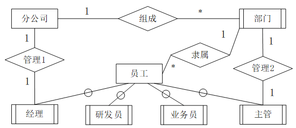
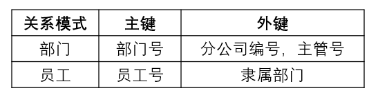

# 2018下半年案例题

- 来源标题: 2018年下半年软件设计师考试应用技术真题（专业解析+参考答案）
- 试卷介绍页: https://wangxiao.xisaiwang.com/tiku2/136/tp203901.html?cid=136
- 练习页: https://wangxiao.xisaiwang.com/tiku2/exam534904419.html
- 题量: 6

## 第1题（案例题）

阅读下列说明和图，回答问题1至问题4，将解答填入答题纸的对应栏内。
【说明】
某房产中介连锁企业欲开发一个基于Web的房屋中介信息系统，以有效管理房源和客户，提高成交率。该系统的主要功能是：
1.房源采集与管理。系统自动采集外部网站的潜在房源信息，保存为潜在房源。由经纪人联系确认的潜在房源变为房源，并添加出售/出租房源的客户。由经纪人或者客户登记的出售/出租房源，系统将其保存为房源。房源信息包括基本情况、配套设施、交易类型、委托方式、业主等。经纪人可以对房源进行更新等管理操作。
2.客户管理。求租/求购客户进行注册、更新，推送客户需求给经纪人，或由经纪人对求租/求购客户进行登记、更新。客户信息包括身份证号、姓名、手机号、需求情况、委托方式等。
3.房源推荐。根据客户的需求情况（求购/求租需求情况以及出售/出租房源信息），向已登录的客户推荐房源。
4.交易管理。经纪人对租售客户双方进行交易信息管理，包括订单提交和取消，设置收取中介费比例。财务人员收取中介费之后，表示该订单已完成，系统更新订单状态和房源状态，向客户和经纪人发送交易反馈。
5.信息查询。客户根据自身查询需求查询房屋供需信息。
现采用结构化方法对房屋中介信息系统进行分析与设计，获得如图1-1 所示的上下文数据流图和图1-2所示的0层数据流图。

### 补充题面

【问题1】（4分）
使用说明中的词语，给出图1-1中的实体E1-E4的名称。
【问题2】（4分）
使用说明中的词语，给出图1-2中的数据存储D1-D4的名称。
【问题3】（3 分）
根据说明和图中术语，补充图1-2中缺失的数据流及其起点和终点。
【问题4】 （4 分）
根据说明中术语，给出图1-1中数据流“客户信息”、“房源信息”的组成。

### 参考答案

【问题1】
E1：客户；E2：经纪人；E3：财务人员；E4：外部网站
【问题2】
D1：客户记录；D2：潜在房源记录；D3：房源记录；D4：订单记录
【问题3】
缺失数据流如下：
本题1条1分，3条满分。
缺失数据流如下：
1、交易反馈：起点-4交易管理，终点-E2
2、客户需求：起点-D1，终点-3房源推荐
3、房源状态：起点-4交易管理，终点-D3
4、检索潜在房源信息：起点-D2，终点-1房源采集与管理
5、更新客户信息：起点-2客户管理，终点-D1客户记录
【问题4】
客户信息=身份证号+姓名+手机号+需求情况+委托方式。
房源信息=基本情况+配套设施+交易类型+委托方式+业主等。

### 解析

【问题1】
题干说明中，自动采集潜在房源信息，并且无反馈信息的为外界网站，即1-1中的E4；
只有经纪人可以确认潜在房源，因此E2为经纪人；
系统只向客户推送推荐房源，因此E1为客户；
财务管理人员收取中介费用，因此E3为财务人员；
综上，E1：客户；E2：经纪人；E3：财务人员；E4：外部网站。
【问题2】
  本题结合题干描述和数据流图分析。
由“由经纪人对求租/求购客户进行登记更新过”，加工P2向D1中添加新客户信息，可知D1是客户记录。
由“系统自动采集外部网站的潜在房源信息，保存为潜在房源”，加工P1向存储写入潜在房源信息，可知D2是潜在房源记录;
由“由经纪人联系确认的潜在房源变为房源”，可知这个加工P1向存储中写入新房源信息，可知D3是房源记录。
由“经纪人对租售客户双方进行交易信息管理，包括订单提交和取消” “系统更新订单状态”等，可知D4是订单记录。  
【问题3】
由顶层图和0层图的父子平衡可知，图1-2遗漏P4→E2，交易反馈；
由题干描述可知，对于P4交易管理，“系统更新订单状态和房源状态”，此时需要更新房源记录，此处缺少数据流P4→D3；
由题干描述可知，对于P3房源推荐，“根据客户的需求情况（求购/求租需求情况以及出售/出租房源信息），向已登录的客户推荐房源。”，此处缺少数据流，D1→P3。
由题干描述可知，对于房源采集与管理“
系统自动采集外部网站的潜在房源信息，保存为潜在房源。由经纪人联系确认的潜在房源变为房源，并添加出售/出租房源的客户。”可知加工房源采集与管理P1从潜在房源D2读取数据进行确认，此处缺少数据流D2→P1。
【问题4】
 “房源信息包括基本情况、配套设施、交易类型、委托方式、业主等”“客户信息包括身份证号、姓名、手机号、需求情况、委托方式等。”根据题干说明列出数据项即可。

## 第2题（案例题）

阅读下列说明，回答问题1至问题4，将解答填入答题纸的对应栏内。
【说明】
某集团公司拥有多个分公司，为了方便集团公司对分公司各项业务活动进行有效管理，集团公司决定构建一个信息系统以满足公司的业务管理需求。
【需求分析】
1.分公司关系需要记录的信息包括分公司编号、名称、经理、联系地址和电话。分公司编号唯一标识分公司信息中的每一个元组。每个分公司只有一名经理，负责该分公司的管理工作。每个分公司设立仅为本分公司服务的多个业务部门，如研发部、财务部、采购部、销售部等。
2.部门关系需要记录的信息包括部门号、部门名称、主管号、电话和分公司编号。部门号唯一标识部门信息中的每一个元组。每个部门只有一名主管，负责部门的管理工作。每个部门有多名员工，每名员工只能隶属于一个部门。
3.员工关系需要记录的信息包括员工号、姓名、隶属部门、岗位、电话和基本工资。其中，员工号唯一标识员工信息中的每一个元组。岗位包括：经理、主管、研发员、业务员等。
【概念模型设计】
根据需求阶段收集的信息，设计的实体联系图和关系模式(不完整)如图2-1 所示:
   
 【关系模式设计】
 分公司（分公司编号，名称，（a），联系地址，电话）
 部门（部门号，部门名称，（b），电话）
 员工（员工号，姓名（c），电话，基本工资）

### 补充题面

【问题 1】 （4分）
根据问题描述，补充4个联系，完善图 2-1的实体联系图。联系名可用联系1、联系2、联系3和联系4代替，联系的类型为 1:1、1:n 和 m:n （或 1:1、1:*和*:*）。
【问题 2】（5分）
根据题意，将关系模式中的空 (a)-(c) 补充完整。
【问题 3】（4 分）
给出“部门”和“员工”关系模式的主键和外键。
【问题 4】（2 分）
假设集团公司要求系统能记录部门历任主管的任职时间和任职年限，那么是否需要在数据库设计时增设一个实体？为什么？

### 参考答案

【问题1】
联系1：分公司：经理，1:1
联系2：分公司：部门，1:*
联系3：部门：主管，1:1
联系4：部门：员工，1:*
  
【问题2】
（a）经理工号
（b）分公司编号，主管号
（c）隶属部门，岗位
【问题3】
部门
主键：部门号；外键：分公司编号，主管号
员工
主键：员工号；外键：隶属部门

 【问题4】
不需要增加新的实体，对于任职情况，可以将任职时间和任职年限放入联系的属性即可，将部门与主管的联系单独形成关系模式，任职（部门号，主管工号，任职时间，任职年限）。

### 解析

【问题1-3】
根据题干描述，可以找到对应答案。
“分公司关系需要记录的信息包括分公司编号、名称、经理、联系地址和电话。”（a）需要补充经理工号；
“部门关系需要记录的信息包括部门号、部门名称、主管号、电话和分公司编号。部门号唯一标识部门信息中的每一个元组。”（b）需要补充分公司编号和主管号，且部门号唯一标识元组，为部门关系主键，其中分公司编号、主管号分别是分公司关系和员工关系的主键，所以在部门关系中为外键；
同理，“员工关系需要记录的信息包括员工号、姓名、隶属部门、岗位、电话和基本工资。其中，员工号唯一标识员工信息中的每一个元组。”可知（c）空需补充隶属部门和岗位，其中员工号为主键，隶属部门为外键。
【问题4】
不需要增加新的实体，对于任职情况，可以将任职时间和任职年限放入联系的属性即可，将部门与主管的联系单独形成关系模式，任职（部门号，主管工号，任职时间，任职年限）。

## 第3题（案例题）

阅读下列说明，回答问题 1 至问题 3，将解答填入答题纸的对应栏内。
【说明】
社交网络平台（SNS）的主要功能之一是建立在线群组，群组中的成员之间可以互相分享或挖掘兴趣和活动。每个群组包含标题、管理员以及成员列表等信息。
社交网络平台的用户可以自行选择加入某个群组。每个群组拥有一个主页，群组内的所有成员都可以查看主页上的内容。如果在群组的主页上发布或更新了信息，群组中的成员会自动接收到发布或更新后的信息。
用户可以加入一个群组也可以退出这个群组。用户退出群组后，不会再接收到该群组发布或更新的任何信息。
现采用面向对象方法对上述需求进行分析与设计，得到如表3-1所示的类列表和如图3-1所示的类图。 

### 补充题面

【问题1】（6分）
根据说明中的描述，给出图 3-1 中 C1~ C3 所对应的类名。
【问题2】 (6分)
图 3-1 中采用了哪一种设计模式？说明该模式的意图及其适用场合。
【问题3】 (3分)
现在对上述社交网络平台提出了新的需求：一个群体可以作为另外一个群体中的成员，例如群体A加入群体B。那么，群体A中的所有成员就自动成为群体B中的成员。
若要实现这个新需求，需要对图3-1进行哪些修改？（以文字方式描述）

### 参考答案

【问题1】
C1：SNSGroup；C2：SNSUser；C3：SNSAdmin。
（其中C2、C3可以互换）
【问题2】
采用的设计模式：观察者模式
意图：定义对象间的 一种一对多的依赖关系，当一个对象的状态发生改变时，所有依赖于它的对象都得到通知并自动更新。
适用场合：
（1）当一个抽象模型有两个方面，其中一个方面依赖于另一个方面，将这两者封装在独立的对象中以使它们可以各自独立地改变和复用。
（2）当对一个对象的改变需要同时改变其他对象，而不知道具体有多少对象有待改变时。
（3）当一个对象必须通知其他对象，而它又不能假定其他对象是谁，即不希望这些对象是紧耦合的。
【问题3】
（1）在SNSSubject和SNSObserver之间增加继承关系，SNSObserver为基类，SNSSubject为派生类。
（2）为类SNSGroup增加自关联（自己到自己的关联关系）。

### 解析

【问题1】
本题补充类名，来源是表3-1所给出的类名。根据图示，对于SNSSubje是抽象的被观察者，具体被观察的对象应该是在主页发布消息的群组，即C1是SNSGroup；SNSObserver是抽象的观察者，具体的观察者应该是关注主页的群组成员或群组管理员，即C2是SNSUser；C3是SNSAdmin，且二者可以互换。
【问题2】
根据图示可知本题所用的是观察者模式。观察者模式是行为型设计模式。
意图：定义对象间的一种一对多的依赖关系，当一个对象的状态发生改变时，所有依赖于它的对象都得到通知并自动更新。
适用场合：
（1）当一个抽象模型有两个方面，其中一个方面依赖于另一个方面，将这两者封装在独立的对象中以使它们可以各自独立地改变和复用。
（2）当对一个对象的改变需要同时改变其他对象，而不知道具体有多少对象有待改变时。
（3）当一个对象必须通知其他对象，而它又不能假定其他对象是谁，即不希望这些对象是紧耦合的。
【问题3】
对于新需求： 一个群体可以作为另外一个群体中的成员，例如群体A加入群体B。那么，群体A中的所有成员就自动成为群体B中的成员。即群组是可以嵌套的，针对这个需求：
（1）在SNSSubject和SNSObserver之间增加继承关系，SNSObserver为基类，SNSSubject为派生类。
（2）为类SNSGroup增加自关联（自己到自己的关联关系）。

## 第4题（案例题）

阅读下列说明和 C 代码，回答问题 1至问题 3，将解答写在答题纸的对应栏内。【说明】
给定一个字符序列B=b1b2…bn，其中bi∈{A,C,G,U}。B上的二级结构是一组字符对集合S={(bi,bj)}，其中i,j∈{1,2,…,n}，并满足以下四个条件：
（1）S中的每对字符是(A,U),(U,A),(C,G)和(G,C)四种组合之一；
（2）S中的每对字符之间至少有四个字符将其隔开，即k）的配对存在以下两种情况：bk不参与任何配对；bk和字符bt配对，其中t<k-4;
（4）（不交叉原则）若（bi,bj）和（bk,bl）是S中的两个字符对，且i<k，则i<k<j<l不成立。
B的具有最大可能字符对数的二级结构S被称为最优配对方案，求解最优配对方案中的字符对数的方法如下：
假设用C(i,j)表示字符序列bibi+1…bj的最优配对方案（即二级结构S）中的字符对数，则C(i,j)可以递归定义为：

</k，则i<k<j<1不成立。
</k-4；
</j-4；
下面代码是算法的C语言实现，其中
n:字符序列长度
B[]:字符序列
C[][]:最优配对数量数组
【C代码】
#include<stdio.h>
#include<stdlib.h>
#define LEN 100
/*判断两个字符是否配对*/
int isMatch(char a,char b){
if((a ==‘A’ && b == ‘U’) || (a == ‘U’ && b == ‘A’))
  return 1;
if((a == ‘C’ && b == ‘G’) || (a == ‘G’ && b == ‘C’))
  return 1;
return 0;
}
/*求最大配对数*/
int RNA_2(char B[LEN], int n){
int i,j,k,t;
int max;
int C[LEN][LEN] = {0};
for(k = 5; k <= n-1; k++){
  for(i = 1;i <=n-k; i++){
    j = i+k;
    (1);
    for( (2) ；t <= j-4; t++){
            if( (3) && max < C[i][t - 1] + 1 + C[t+1][j-1])
                  max = C[i][t-1] + 1 +C[t+1][j-1];
    }
    C[i][j] = max;
    printf(“c[%d][%d] = %d--”, i,j, C[i][j]);
  }
 }
 return(4);
}

### 补充题面

【问题 1】（8分）
根据题干说明，填充 C 代码中的空（1）-（4）。
【问题2】 （4分）
根据题干说明和 C 代码，算法采用的设计策略为（5）。
算法的时间复杂度为（6）,（用O表示）。
【问题 3】 (3 分〉
给定字符序列 ACCGGUAGU  ，根据上述算法求得最大字符对数为（7）。

### 参考答案

【问题1】
（1）max=C[i][j-1] 
（2）t=i
（3）isMatch(B[t],B[j])，或isMatch(B[t],B[j])==1，或与其等价的形式
（4）C[1][n]
【问题2】
采用的算法策略：动态规划法
时间复杂度：O(n3)
 【问题3】
最大字符对数：2

### 解析

本题考查的是用动态规划法，以非递归方式实现。
根据题干，配对要求：
（1）满足四种组合之一；
（2）配对的2个字符间距至少有4个字符；
（3）若字符已配对，则其他配对不再考虑，也就是说1个字符不能配对2次，比如ACCCCUCCCCA，只有1组配对AU，U不能再与后面的A形成第2组配对；
（4）不交叉，2组配对字符位置能交叉，比如ACCCCCUUUUG，只有1组配对AU，CG与AU有交叉不能形成配对。
【问题1】
对于问题1代码填空，主要根据题干描述和代码上下文进行推导。
根据代码上下文可知，在整段代码中，缺少对变量max和t赋初值，这两个初值的赋值，应该填在空（1）和空（2）中，一般t作为循环变量，在for中进行赋值。
代码中有三层嵌套for循环。
其中第一层for循环，变量为k，取值范围从5到n-1，从题干描述，我们可以看到对于整个比较过程，要求字符对的位置相差大于4，因此此处的k值是字符对下标的差值；
第二层for循环，变量为i，取值范围从1到n-k，从题干描述，我们可以得出i是字符对较小的下标；
第三层for循环，变量为t，取值范围需要赋初值，并且t<=j-4，从题干描述和递归式可以看到，t是中间字符下标，用来划分子问题的，并且从递归式我们可以得出，t的最小值应该从i开始，因此空（2）为t=i；
在第二层for循环内部，有j=i+k，根据代码和题干描述，可以得出j是字符对较大的下标，根据i和k的取值，可以看到j的取值范围为从6到n-1，对于空（1）作为max的初始赋值，又根据递归式，可以看到max应该在C[i][j-1]和C[i][t-1]+1+C[t+1][j-1]之间取最大值，在代码中可以看到if会判断max与C[i][t-1]+1+C[t+1][j-1]之间的大小，因此，max之前的赋值应该为C[i][j-1]，才能对二者进行比较，也就是说空（1）应该为max=C[i][j-1]。
空（3）在if判断中作为判断条件，根据递归式的条件和代码上下文，此处缺少字符匹配的判断，题干描述字符下标从1开始，因此，在比较过程中，实际比较的应该为B[t]和B[j]位置的字符，空（3）应该填写isMatch(B[t],B[j)，或isMatch(B[t],B[j])==1，或与其等价的形式。
空（4）作为整个函数的返回值，因此空（4）应该为C[1][n]为最终结果。
【问题2】
本题采取的是动态规划的策略，代码为三层嵌套循环时间复杂度为k*i*t，由于k的取值范围是6~n-1，i的取值范围是1~n-5，t的取值范围是1~n-5，都是与n的取值相关，因此本题的时间复杂度为O(n3)。
【问题3】
字符序列ACCGGUAGU的最大匹配情况为，(b1,b9)，（b2,b8）或(b1,b9)，(b3,b8)，这两种情况的最大匹配对数都为2，因此本题答案（7）空为2。

## 第5题（案例题）

阅读下列说明和 C++代码，将应填入(n)处的字句写在答题纸的对应栏内。
【说明】
某航空公司的会员积分系统将其会员划分为:普卡（Basic）、银卡（Silver）和金卡（Gold）三个等级。非会员 （Non Member）可以申请成为普卡会员。会员的等级根据其一年内累积的里程数进行调整。描述会员等级调整的状态图如图 5-1 所示。现采用状态 (State) 模式实现上述场景，得到如图 5-2 所示的类图。

### 补充题面

 #include <iostream>
 using namespace std;
 class FrequentFlyer; class Cbasic; class Csilver; class Cgold; class CnoCustomer; // 提前引用
//提前引用
class CState {
private: int flyMiles; // 里程数
public:
（1） ； // 根据累积里程数调整会员等级
};
 class FrequentFlyer {
 friend class Cbasic; friend class Csilver; friend class Cgold;
private:
 Cstate *state; Cstate *nocustomer; Cstate *basic; Cstate *silver; Cstate *gold;
 double flyMiles;
public:
  CFrequentFlyer(){ flyMiles = 0; setState(nocustomer); }
  void setState(CState *state){ this->state = state; }
  void travel(int miles) {
    double bonusMiles = state->travel(miles,this);
    flyMiles = flyMiles + bonusMiles;
 }
};
 class CnoCustomer : public CState { // 非会员
 public:
    double travel(int miles, FrequentFlyer* context) { // 不累积里程数
      cout << “Your travel will not account for points\n”; return miles;
   }
 };
 class CBasic : public CState { // 普卡会员
public:
   double travel(int miles, FrequentFlyer* context) {
  if(context->flyMiles >= 25000 && context->flyMiles < 50000)
       （2） ；
  if(context->flyMiles >=50000) (3) ；
 return miles + 0.5*miles; // 累积里程数
 }
};
 class CGold : public CState { // 金卡会员
 public:
    double travel(int miles, FrequentFlyer* context) {
    if(context->flyMiles >= 25000 && context->flyMiles < 50000)
           （4） ；
    if(context->flyMiles < 25000)   (5) ；
    return miles + 0.5*miles; // 累积里程数
 }
};
 class Csilver : public CState { // 银卡会员
 public:
    double travel(int miles, FrequentFlyer* context) {
      if(context-> flyMiles < 25000)
        context->setState(context->basic);
      if(context-> flyMiles >= 50000)
        context->setState(context->gold);
      return(miles + 0.25*miles);
   }
};

### 参考答案

（1）virtual double travel(int miles,FrequentFlyer* context)=0
（2）context->setState(context→silver)
（3）context->setState(context→gold)
（4）context->setState(context→silver)
（5）context->setState(context→basic)

### 解析

由代码可知，（1）空缺少一个抽象方法，根据下面的子类可以发现，子类都有double travel(int miles, FrequentFlyer context)方法，是从该抽象类中继承而来，因此（1）空应该补充这个方法，并加上abstract修饰，即（1）virtual  double travel(int miles,FrequentFlyer* context)=0。
（2）（3）（4）（5）可以从状态图中根据相关状态推断出来。
首先，（2）（3）属于普卡会员CBasic，从状态图和代码可以看到，当里程>=25000且<5000时，会员等级应该从普卡会员CBasic升级到银卡会员CSilver，根据后面已有的代码，可以推断表示升级到银卡会员CSilver的表示方式为：
context->setState(context->silver)；同理对于（3）空，在普卡会员CBasic状态，里程>=50000时，应该升级为金卡会员CGold，此时升级金卡CGold的表示方式为context->setState(ncontext-> gold)，以此类推，（4）（5）分别对应金卡会员CGold状态下，不同条件，降低的不同等级。因此（4）为降级为银卡会员CSilver，（5）为降级为普卡会员CBasic，对应的表示方式分别为context->setState(context->silver)和context->setState(context->basic)。

## 第6题（案例题）

阅读下列说明和 Java代码，将应填入（n）处的字句写在答题纸的对应栏内。
【说明】
某航空公司的会员积分系统将其会员划分为:普卡 (Basic) 、银卡(Silver)和金卡 (Gold)
三个等级。非会员 (Non Member)可以申请成为普卡会员。会员的等级根据其 一年内累积的里程数进行调整。描述会员等级调整的状态图如图 6-1 所示 。现采用状态 (State) 模式
 实现上述场景，得到如图 6-2 所示的类图。

### 补充题面

import java.util.*;
abstract class CState {
    public int flyMiles; // 里程数
    public （1） ； // 根据累积里程数调整会员等级
}
class CNoCustomer extends CState { // 非会员
    public double travel(int miles, FrequentFlyer context) {
      System.out.println ( “Your travel will not account for points”);
     return miles; // 不累积里程数
}
}
class CBasic extends CState { // 普卡会员
    public double travel(int miles, FrequentFlyer context) {
      if(context.flyMiles >= 25000 && context.flyMiles < 50000)
            （2） ；
      if(context.flyMiles >= 50000)
           （3） ；
     return miles;
    }
}
class CGold extends CState { // 金卡会员
    public double travel(int miles, FrequentFlyer context) {
      if(context.flyMiles >= 25000 && context.flyMiles < 50000)
          （4） ；
    if(context.flyMiles < 25000)
         （5） ；
   return miles + 0.5*miles; // 累积里程数
    }
}
class CSilver extends CState { // 银卡会员
public double travel(int miles, FrequentFlyer context) {
    if(context.flyMiles <= 25000)
       context.setState(new Cbasic());
    if(context.flyMiles >= 50000)
      context.setState(new Cgold());
     return (miles + 0.25*miles); // 累积里程数
    }
}
class FrequentFlyer {
    CState state;
    double flyMiles;
    public FrequentFlyer(){
     state = new CnoCustomer();
     flyMiles = 0;
     setState(state);
}
    public void setState(CState state){ this.state = state; }
    public void travel(int miles) {
      double bonusMiles = state.travel(miles,this);
      flyMiles = flyMiles + bonusMiles;
    }
}

### 参考答案

（1）abstract double travel(int miles,FrequentFlyer context)
（2）context.setState(new CSilver())
（3）context.setState(new CGold ())
（4）context.setState(new CSilver())
（5）context.setState(new CBasic())

### 解析

由代码可知，（1）空缺少一个抽象方法，根据下面的子类可以发现，子类都有double travel(int miles, FrequentFlyer context)方法，是从该抽象类中继承而来，因此（1）空应该补充这个方法，并加上abstract修饰。
（2）（3）（4）（5）可以从状态图中根据相关状态推断出来。
首先，（2）（3）属于普卡会员CBasic，从状态图和代码可以看到，当里程>=25000且<5000时，会员等级应该从普卡会员CBasic升级到银卡会员CSilver，根据后面已有的代码，可以推断表示升级到银卡会员CSilver的表示方式为context.setState(new CSilver())；同理对于（3）空，在普卡会员CBasic状态，里程>=50000时，应该升级为金卡会员CGold，此时升级金卡CGold的表示方式为context.setState(new CGold ())，以此类推，（4）（5）分别对应金卡会员CGold状态下，不同条件，降低的不同等级。因此（4）为降级为银卡会员CSilver，（5）为降级为普卡会员CBasic，对应的表示方式分别为context.setState(new CSilver())和context.setState(new CBasic())。
