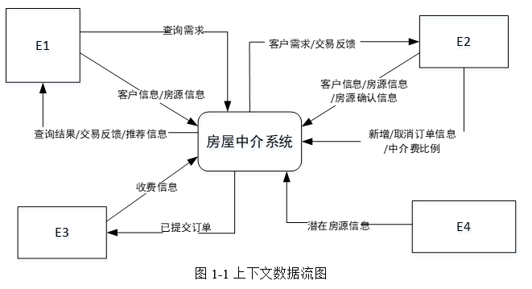
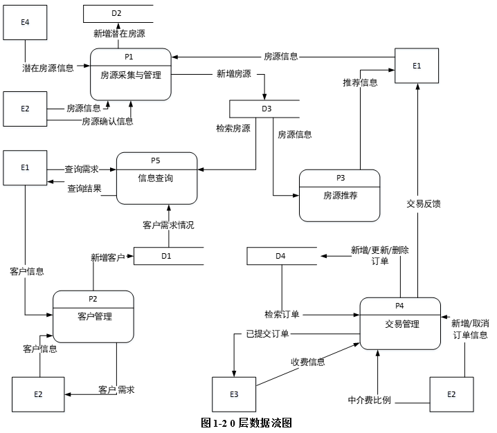
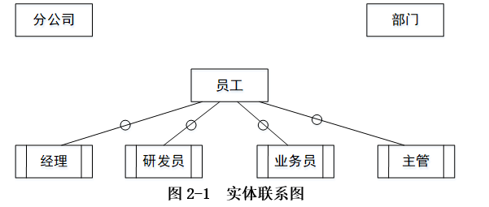
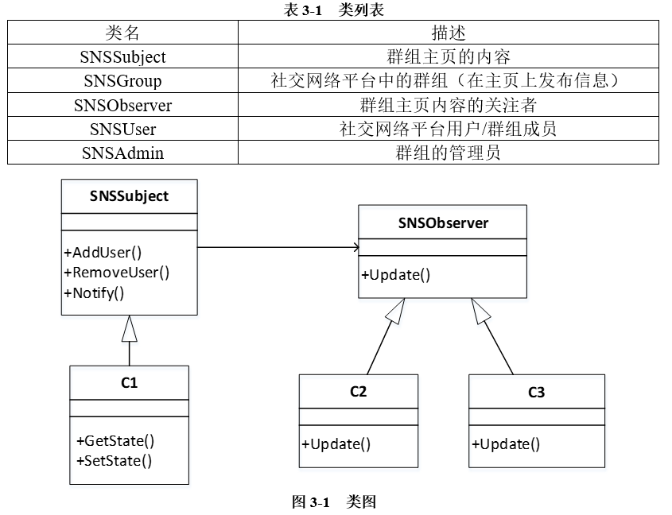
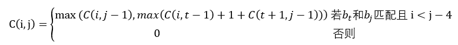
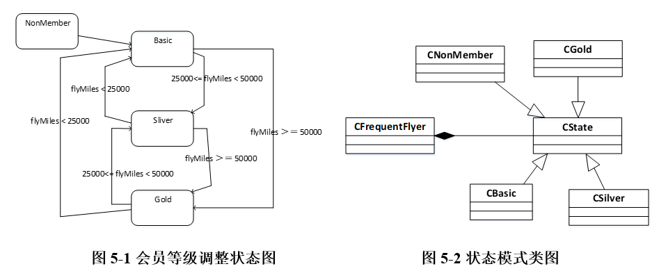
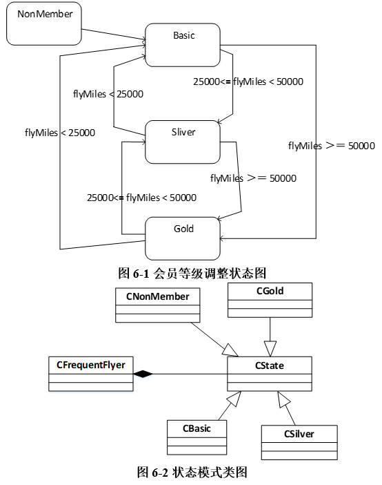

# 2018下半年案例题

- 来源标题: 2018年下半年软件设计师考试应用技术真题（专业解析+参考答案）
- 试卷介绍页: https://wangxiao.xisaiwang.com/tiku2/136/tp203901.html?cid=136
- 练习页: https://wangxiao.xisaiwang.com/tiku2/exam534903428.html
- 题量: 6

## 第1题（案例题）

阅读下列说明和图，回答问题1至问题4，将解答填入答题纸的对应栏内。
【说明】
某房产中介连锁企业欲开发一个基于Web的房屋中介信息系统，以有效管理房源和客户，提高成交率。该系统的主要功能是：
1.房源采集与管理。系统自动采集外部网站的潜在房源信息，保存为潜在房源。由经纪人联系确认的潜在房源变为房源，并添加出售/出租房源的客户。由经纪人或者客户登记的出售/出租房源，系统将其保存为房源。房源信息包括基本情况、配套设施、交易类型、委托方式、业主等。经纪人可以对房源进行更新等管理操作。
2.客户管理。求租/求购客户进行注册、更新，推送客户需求给经纪人，或由经纪人对求租/求购客户进行登记、更新。客户信息包括身份证号、姓名、手机号、需求情况、委托方式等。
3.房源推荐。根据客户的需求情况（求购/求租需求情况以及出售/出租房源信息），向已登录的客户推荐房源。
4.交易管理。经纪人对租售客户双方进行交易信息管理，包括订单提交和取消，设置收取中介费比例。财务人员收取中介费之后，表示该订单已完成，系统更新订单状态和房源状态，向客户和经纪人发送交易反馈。
5.信息查询。客户根据自身查询需求查询房屋供需信息。
现采用结构化方法对房屋中介信息系统进行分析与设计，获得如图1-1 所示的上下文数据流图和图1-2所示的0层数据流图。

### 补充题面

【问题1】（4分）
使用说明中的词语，给出图1-1中的实体E1-E4的名称。
【问题2】（4分）
使用说明中的词语，给出图1-2中的数据存储D1-D4的名称。
【问题3】（3 分）
根据说明和图中术语，补充图1-2中缺失的数据流及其起点和终点。
【问题4】 （4 分）
根据说明中术语，给出图1-1中数据流“客户信息”、“房源信息”的组成。

## 第2题（案例题）

阅读下列说明，回答问题1至问题4，将解答填入答题纸的对应栏内。
【说明】
某集团公司拥有多个分公司，为了方便集团公司对分公司各项业务活动进行有效管理，集团公司决定构建一个信息系统以满足公司的业务管理需求。
【需求分析】
1.分公司关系需要记录的信息包括分公司编号、名称、经理、联系地址和电话。分公司编号唯一标识分公司信息中的每一个元组。每个分公司只有一名经理，负责该分公司的管理工作。每个分公司设立仅为本分公司服务的多个业务部门，如研发部、财务部、采购部、销售部等。
2.部门关系需要记录的信息包括部门号、部门名称、主管号、电话和分公司编号。部门号唯一标识部门信息中的每一个元组。每个部门只有一名主管，负责部门的管理工作。每个部门有多名员工，每名员工只能隶属于一个部门。
3.员工关系需要记录的信息包括员工号、姓名、隶属部门、岗位、电话和基本工资。其中，员工号唯一标识员工信息中的每一个元组。岗位包括：经理、主管、研发员、业务员等。
【概念模型设计】
根据需求阶段收集的信息，设计的实体联系图和关系模式(不完整)如图2-1 所示:
   
 【关系模式设计】
 分公司（分公司编号，名称，（a），联系地址，电话）
 部门（部门号，部门名称，（b），电话）
 员工（员工号，姓名（c），电话，基本工资）

### 补充题面

【问题 1】 （4分）
根据问题描述，补充4个联系，完善图 2-1的实体联系图。联系名可用联系1、联系2、联系3和联系4代替，联系的类型为 1:1、1:n 和 m:n （或 1:1、1:*和*:*）。
【问题 2】（5分）
根据题意，将关系模式中的空 (a)-(c) 补充完整。
【问题 3】（4 分）
给出“部门”和“员工”关系模式的主键和外键。
【问题 4】（2 分）
假设集团公司要求系统能记录部门历任主管的任职时间和任职年限，那么是否需要在数据库设计时增设一个实体？为什么？

## 第3题（案例题）

阅读下列说明，回答问题 1 至问题 3，将解答填入答题纸的对应栏内。
【说明】
社交网络平台（SNS）的主要功能之一是建立在线群组，群组中的成员之间可以互相分享或挖掘兴趣和活动。每个群组包含标题、管理员以及成员列表等信息。
社交网络平台的用户可以自行选择加入某个群组。每个群组拥有一个主页，群组内的所有成员都可以查看主页上的内容。如果在群组的主页上发布或更新了信息，群组中的成员会自动接收到发布或更新后的信息。
用户可以加入一个群组也可以退出这个群组。用户退出群组后，不会再接收到该群组发布或更新的任何信息。
现采用面向对象方法对上述需求进行分析与设计，得到如表3-1所示的类列表和如图3-1所示的类图。 

### 补充题面

【问题1】（6分）
根据说明中的描述，给出图 3-1 中 C1~ C3 所对应的类名。
【问题2】 (6分)
图 3-1 中采用了哪一种设计模式？说明该模式的意图及其适用场合。
【问题3】 (3分)
现在对上述社交网络平台提出了新的需求：一个群体可以作为另外一个群体中的成员，例如群体A加入群体B。那么，群体A中的所有成员就自动成为群体B中的成员。
若要实现这个新需求，需要对图3-1进行哪些修改？（以文字方式描述）

## 第4题（案例题）

阅读下列说明和 C 代码，回答问题 1至问题 3，将解答写在答题纸的对应栏内。【说明】
给定一个字符序列B=b1b2…bn，其中bi∈{A,C,G,U}。B上的二级结构是一组字符对集合S={(bi,bj)}，其中i,j∈{1,2,…,n}，并满足以下四个条件：
（1）S中的每对字符是(A,U),(U,A),(C,G)和(G,C)四种组合之一；
（2）S中的每对字符之间至少有四个字符将其隔开，即k）的配对存在以下两种情况：bk不参与任何配对；bk和字符bt配对，其中t<k-4;
（4）（不交叉原则）若（bi,bj）和（bk,bl）是S中的两个字符对，且i<k，则i<k<j<l不成立。
B的具有最大可能字符对数的二级结构S被称为最优配对方案，求解最优配对方案中的字符对数的方法如下：
假设用C(i,j)表示字符序列bibi+1…bj的最优配对方案（即二级结构S）中的字符对数，则C(i,j)可以递归定义为：

</k，则i<k<j<1不成立。
</k-4；
</j-4；
下面代码是算法的C语言实现，其中
n:字符序列长度
B[]:字符序列
C[][]:最优配对数量数组
【C代码】
#include<stdio.h>
#include<stdlib.h>
#define LEN 100
/*判断两个字符是否配对*/
int isMatch(char a,char b){
if((a ==‘A’ && b == ‘U’) || (a == ‘U’ && b == ‘A’))
  return 1;
if((a == ‘C’ && b == ‘G’) || (a == ‘G’ && b == ‘C’))
  return 1;
return 0;
}
/*求最大配对数*/
int RNA_2(char B[LEN], int n){
int i,j,k,t;
int max;
int C[LEN][LEN] = {0};
for(k = 5; k <= n-1; k++){
  for(i = 1;i <=n-k; i++){
    j = i+k;
    (1);
    for( (2) ；t <= j-4; t++){
            if( (3) && max < C[i][t - 1] + 1 + C[t+1][j-1])
                  max = C[i][t-1] + 1 +C[t+1][j-1];
    }
    C[i][j] = max;
    printf(“c[%d][%d] = %d--”, i,j, C[i][j]);
  }
 }
 return(4);
}

### 补充题面

【问题 1】（8分）
根据题干说明，填充 C 代码中的空（1）-（4）。
【问题2】 （4分）
根据题干说明和 C 代码，算法采用的设计策略为（5）。
算法的时间复杂度为（6）,（用O表示）。
【问题 3】 (3 分〉
给定字符序列 ACCGGUAGU  ，根据上述算法求得最大字符对数为（7）。

## 第5题（案例题）

阅读下列说明和 C++代码，将应填入(n)处的字句写在答题纸的对应栏内。
【说明】
某航空公司的会员积分系统将其会员划分为:普卡（Basic）、银卡（Silver）和金卡（Gold）三个等级。非会员 （Non Member）可以申请成为普卡会员。会员的等级根据其一年内累积的里程数进行调整。描述会员等级调整的状态图如图 5-1 所示。现采用状态 (State) 模式实现上述场景，得到如图 5-2 所示的类图。

### 补充题面

 #include <iostream>
 using namespace std;
 class FrequentFlyer; class Cbasic; class Csilver; class Cgold; class CnoCustomer; // 提前引用
//提前引用
class CState {
private: int flyMiles; // 里程数
public:
（1） ； // 根据累积里程数调整会员等级
};
 class FrequentFlyer {
 friend class Cbasic; friend class Csilver; friend class Cgold;
private:
 Cstate *state; Cstate *nocustomer; Cstate *basic; Cstate *silver; Cstate *gold;
 double flyMiles;
public:
  CFrequentFlyer(){ flyMiles = 0; setState(nocustomer); }
  void setState(CState *state){ this->state = state; }
  void travel(int miles) {
    double bonusMiles = state->travel(miles,this);
    flyMiles = flyMiles + bonusMiles;
 }
};
 class CnoCustomer : public CState { // 非会员
 public:
    double travel(int miles, FrequentFlyer* context) { // 不累积里程数
      cout << “Your travel will not account for points\n”; return miles;
   }
 };
 class CBasic : public CState { // 普卡会员
public:
   double travel(int miles, FrequentFlyer* context) {
  if(context->flyMiles >= 25000 && context->flyMiles < 50000)
       （2） ；
  if(context->flyMiles >=50000) (3) ；
 return miles + 0.5*miles; // 累积里程数
 }
};
 class CGold : public CState { // 金卡会员
 public:
    double travel(int miles, FrequentFlyer* context) {
    if(context->flyMiles >= 25000 && context->flyMiles < 50000)
           （4） ；
    if(context->flyMiles < 25000)   (5) ；
    return miles + 0.5*miles; // 累积里程数
 }
};
 class Csilver : public CState { // 银卡会员
 public:
    double travel(int miles, FrequentFlyer* context) {
      if(context-> flyMiles < 25000)
        context->setState(context->basic);
      if(context-> flyMiles >= 50000)
        context->setState(context->gold);
      return(miles + 0.25*miles);
   }
};

## 第6题（案例题）

阅读下列说明和 Java代码，将应填入（n）处的字句写在答题纸的对应栏内。
【说明】
某航空公司的会员积分系统将其会员划分为:普卡 (Basic) 、银卡(Silver)和金卡 (Gold)
三个等级。非会员 (Non Member)可以申请成为普卡会员。会员的等级根据其 一年内累积的里程数进行调整。描述会员等级调整的状态图如图 6-1 所示 。现采用状态 (State) 模式
 实现上述场景，得到如图 6-2 所示的类图。

### 补充题面

import java.util.*;
abstract class CState {
    public int flyMiles; // 里程数
    public （1） ； // 根据累积里程数调整会员等级
}
class CNoCustomer extends CState { // 非会员
    public double travel(int miles, FrequentFlyer context) {
      System.out.println ( “Your travel will not account for points”);
     return miles; // 不累积里程数
}
}
class CBasic extends CState { // 普卡会员
    public double travel(int miles, FrequentFlyer context) {
      if(context.flyMiles >= 25000 && context.flyMiles < 50000)
            （2） ；
      if(context.flyMiles >= 50000)
           （3） ；
     return miles;
    }
}
class CGold extends CState { // 金卡会员
    public double travel(int miles, FrequentFlyer context) {
      if(context.flyMiles >= 25000 && context.flyMiles < 50000)
          （4） ；
    if(context.flyMiles < 25000)
         （5） ；
   return miles + 0.5*miles; // 累积里程数
    }
}
class CSilver extends CState { // 银卡会员
public double travel(int miles, FrequentFlyer context) {
    if(context.flyMiles <= 25000)
       context.setState(new Cbasic());
    if(context.flyMiles >= 50000)
      context.setState(new Cgold());
     return (miles + 0.25*miles); // 累积里程数
    }
}
class FrequentFlyer {
    CState state;
    double flyMiles;
    public FrequentFlyer(){
     state = new CnoCustomer();
     flyMiles = 0;
     setState(state);
}
    public void setState(CState state){ this.state = state; }
    public void travel(int miles) {
      double bonusMiles = state.travel(miles,this);
      flyMiles = flyMiles + bonusMiles;
    }
}
