# 2018下半年选择题

- 来源标题: 2018年下半年软件设计师考试基础知识真题（专业解析+参考答案）
- 试卷介绍页: https://wangxiao.xisaiwang.com/tiku2/136/tp203984.html?cid=136
- 练习页: https://wangxiao.xisaiwang.com/tiku2/exam534904389.html
- 题量: 54

## 第1题（单选题）

CPU在执行指令的过程中，会自动修改（B）的内容，以使其保存的总是将要执行的下一条指令的地址。

- A. 指令寄存器
- B. 程序计数器
- C. 地址寄存器
- D. 指令译码器

### 正确答案

B

### 解析

本题考查计算机系统硬件基础知识。CPU执行指令的过程中，会自动修改PC的内容，PC是程序计数器，用来存放将要执行的下一条指令，本题选择B选项。
对于指令寄存器（IR）存放即将执行的指令，指令译码器（ID）对指令中的操作码字段进行分析和解释，地址寄存器（AR），不是我们常用的CPU内部部件，其作用是用来保存当前CPU所要访问的内存单元或I/O设备的地址。

## 第2题（单选题）

在微机系统中，BIOS（基本输入输出系统）保存在（A）中。

- A. 主板上的ROM
- B. CPU的寄存器
- C. 主板上的RAM
- D. 虚拟存储器

### 正确答案

A

### 解析

本题考查计算机系统硬件知识。BIOS（Basic Input Output System）（基本输入输出系统）是一组固化到计算机内主板上一个ROM芯片上的程序，它保存着计算机最重要的基本输入输出的程序、开机后自检程序和系统自启动程序，它可从CMOS中读写系统设置的具体信息。
BCD描述错误，本题选择A选项。

## 第3题（单选题）

采用n位补码（包含一个符号位）表示数据，可以直接表示数值（D）。

- A. 2n
- B. -2n
- C. 2n-1
- D. -2n-1

### 正确答案

D

### 解析

本题考查计算机系统硬件知识。在计算机中，n位补码（最高位符号位，n-1位数据位），表示范围是-2n-1~+2n-1-1，其中最小值为人为定义，以n=8为例，其中-128的补码是人为定义的1000 0000。
A、B、C三项都超出范围，本题选择D选项。

## 第4题（单选题）

某系统由下图所示的部件构成，每个部件的千小时可靠度都为R，该系统的千小时可靠度为（C）。

- A. （3R+2R）/2
- B. R/3+R/2
- C. （1-（1-R）3）（1-（1-R）2）
- D. （1-（1-R）3-（1-R）2）

### 正确答案

C

### 解析

本题考查计算机系统可靠性知识。对于可靠度计算，串联系统可靠度为R1×R2，并联系统R1=1-(1-R)×(1-R)×(1-R)，并联系统R2=1-(1-R)×(1-R)，因此本题选择C选项。

## 第5题（单选题）

以下关于采用一位奇校验方法的叙述中，正确的是（C）。

- A. 若所有奇数位出错，则可以检测出该错误但无法纠正错误
- B. 若所有偶数位出错，则可以检测出该错误并加以纠正
- C. 若有奇数个数据位出错，则可以检测出该错误但无法纠正错误
- D. 若有偶数个数据位出错，则可以检测出该错误并加以纠正

### 正确答案

C

### 解析

本题考查计算机系统中数据表示基础知识。对于奇偶校验，是由若干位有效信息，再加上一个二进制位（校验位）组成校验码，其中奇校验“1”的个数为奇数，而偶校验“1”的个数为偶数，以此校验，如果其中传输过程中有偶数个数发生错误（即1变成0或0变成1），则“1”的个数其奇偶就不会发生改变，也就无法发现错误了，只有奇数个数据位发生错误，才能发现错误。同时，奇偶校验只能查错不能纠错，D项错误。A、B描述的"所有奇数位"、"所有偶数位"有误，本题选择C选项。

## 第6题（单选题）

下列关于流水线方式执行指令的叙述中，不正确的是（A）。

- A. 流水线方式可提高单条指令的执行速度
- B. 流水线方式下可同时执行多条指令
- C. 流水线方式提高了各部件的利用率
- D. 流水线方式提高了系统的吞吐率

### 正确答案

A

### 解析

本题考查计算机系统硬件基础知识。
流水线方式可提高单条指令的执行速度是不正确的，对于只有单条指令的情况下，流水线方式与顺序执行时没有区别。流水线的原理是在某一时刻可以让多个部件同时处理多条指令，避免各部件等待空闲，由此提高了各部件的利用率，也提高了系统的吞吐率。BCD描述正确，A描述错误，本题选择A选项。

## 第7题（单选题）

DES是（B）算法。

- A. 公开密钥加密
- B. 共享密钥加密
- C. 数字签名
- D. 认证

### 正确答案

B

### 解析

本题考查加密算法的基础知识。对于非对称加密又称为公开密钥加密，而共享密钥加密指对称加密。常见的对称加密算法有：DES，三重DES、RC-5、IDEA、AES，数字签名和认证不是加密算法，因此本题选择B选项。

## 第8题（单选题）

计算机病毒的特征不包括（D）。

- A. 传染性
- B. 触发性
- C. 隐蔽性
- D. 自毁性

### 正确答案

D

### 解析

本题考查电脑病毒的相关知识。计算机病毒(Computer Virus)是指编制或者在计算机程序中插入的破坏计算机功能或者毁坏数据，影响计算机使用，并能自我复制的一组计算机指令或者程序代码。
计算机病毒一般都具有：传染性、破坏性、潜伏性、隐蔽性、触发性等特征 。
传染性：正常的计算机程序一般是不会将自身的代码强行连接到其他程序之上的，而计算机病毒一旦进入计算机并得以执行，会搜寻其他符合其感染条件的程序或存储介质，确定目标后将自身代码插入其中，达到自我繁殖的目的。
隐蔽性：计算机病毒代码通常设计得非常短小，它附在正常程序中或磁盘较隐蔽的地方，或以隐藏文件形式出现，如果不经过代码分析，病毒程序与正常程序是不容易区别的，具有很强的隐蔽性。一般在没有防护措施的情况下，计算机病毒程序取得系统控制权后，可以在很短的时间里感染大量程序，而且受到感染后，计算机系统通常仍能正常运行，用户不会感到任何异常。
潜伏性：大部分计算机病毒感染系统之后一般不会马上发作，可长期隐藏在系统中，只有在满足其特定条件时才启动表现（破坏）模块。 破坏性：任何计算机病毒只要侵入系统，都会对系统及应用程序产生程度不同的影响。轻者会降低计算机的工作效率，占用系统资源，重者可导致系统崩溃。
破坏性：计算机系统一旦感染了病毒程序，系统的稳定性将受到不同程度的影响。一般情况下，计算机病毒发作时，由于其连续不断的自我复制，大部分系统资源被占用，从而减缓了计算机的运行速度，使用户无法正常使用。严重者，可使整个系统瘫痪，无法修复，造成损失。
触发性：一般情况下，计算机病毒侵入系统后，并不会立刻发作，而是较为隐蔽地潜伏在某个程序或某个磁盘中，当达到病毒程序所敲定的触发条件，例如设定日期为触发条件或设定操作为触发条件，当条件满足预设时，病毒程序立即自动执行，并且不断地进行自我复制和传染其它磁盘，对系统进行破坏。　　
希赛点拨：计算机命名一般格式为：〔前缀〕．〔病毒名〕．〔后缀〕。其中病毒前缀表示的是病毒的种类，常见的有Script（脚本病毒）、Trojan（木马病毒）、Worm（蠕虫病毒）、MACRO（宏病毒）、Win32／W32（系统病毒）等。
本题选择D

## 第9题（单选题）

MD5是（B/B）算法，对任意长度的输入计算得到的结果长度为（  ）位。

### 问题1
- A. 路由选择
- B. 摘要
- C. 共享密钥
- D. 公开密钥
### 问题2
- A. 56
- B. 128
- C. 140
- D. 160

### 正确答案

B、B

### 解析

本题考查摘要算法的基础知识。MD5是一种摘要算法，经过一系列处理后，算法的输出由四个32位分组组成，将这四个32位分组级联后将生成一个128位散列值。共享密钥和公开密钥属于加密算法。
路由算法，又名选路算法。算法的目的是找到一条从源路由器到目的路由器的“好”路径（即具有最低费用的路径  ）。
本题选择B选项。

## 第10题（单选题）

使用Web方式收发电子邮件时，以下描述错误的是（B）。

- A. 无须设置简单邮件传输协议
- B. 可以不设置账号密码登录
- C. 邮件可以插入多个附件
- D. 未发送邮件可以保存到草稿箱

### 正确答案

B

### 解析

本题考查计算机-电子邮件基础知识。使用WEB方式收发电子邮件时必须设置账号密码登录。B项描述有误。ACD描述正确。

## 第11题（单选题）

有可能无限期拥有的知识产权是（C）。

- A. 著作权
- B. 专利权
- C. 商标权
- D. 集成电路布图设计权

### 正确答案

C

### 解析

本题考查知识产权相关知识。
 商标权可以通过续注延长拥有期限，而著作权、专利权和设计权的保护期限都是有限期的。
本题选择C选项

## 第12题（单选题）

（B）是构成我国保护计算机软件著作权的两个基本法律文件。

- A. 《软件法》和《计算机软件保护条例》
- B. 《中华人民共和国著作权法》和《计算机软件保护条例》
- C. 《软件法》和《中华人民共和国著作权法》
- D. 《中华人民共和国版权法》和《计算机软件保护条例》

### 正确答案

B

### 解析

本题考查知识产权。我国保护计算机软件著作权的两个基本法律文件是《中华人民共和国著作权法》（一般简称《著作权法》）和《计算机软件保护条例》（简称《软著权法》）。
《中华人民共和国版权法》不是只针对计算机软件著作权的基本法。没有《软件法》这一说法。

## 第13题（单选题）

某软件程序员接受一个公司（软件著作权人）委托开发完成一个软件，三个月后又接受另一公司委托开发功能类似的软件，此程序员仅将受第一个公司委托开发的软件略作修改即提交给第二家公司，此种行为（D）。

- A. 属于开发者的特权
- B. 属于正常使用著作权
- C. 不构成侵权
- D. 构成侵权

### 正确答案

D

### 解析

本题考查知识产权。本题已注明第一个公司为软件著作权人，因此该程序员的行为对原公司构成侵权。不存在特权这一情况，所以ABC说法有误。

## 第14题（单选题）

结构化分析的输出不包括（D）。

- A. 数据流图
- B. 数据字典
- C. 加工逻辑
- D. 结构图

### 正确答案

D

### 解析

本题考查结构化分析与设计的基础知识。参考《软件设计师教程（第5版）》P325页：结构化方法的分析结果由以下几部分组成：一套分层的数据流图、一本数据词典、一组小说明（也称加工逻辑说明）、补充材料。
因此本题选择D选项，结构图不属于结构化分析的输出。

## 第15题（单选题）

某航空公司拟开发一个机票预订系统， 旅客预订机票时使用信用卡付款。付款通过信用卡公司的信用卡管理系统提供的接口实现。若采用数据流图建立需求模型，则信用卡管理系统是（A）。

- A. 外部实体
- B. 加工
- C. 数据流
- D. 数据存储

### 正确答案

A

### 解析

本题考查结构化分析的基础知识。数据流图中的基本图形元素包括数据流、加工、数据存储和外部实体。其中，数据流、加工和数据存储用于构建软件系统内部的数据处理模型，而外部实体表示存在于系统之外的对象，用来帮助用户理解系统数据的来源和去向。外部实体包括：人/物、外部系统、组织机构等。 所以信用卡管理系统是外部实体。
本题选择A选项。

## 第16题（单选题）

某软件项目的活动图如下图所示，其中顶点表示项目里程碑，连接顶点的边表示包含的活动，边上的数字表示活动的持续时间（天），则完成该项目的最少时间为（D/C）天。活动FG的松弛时间为（  ）天。
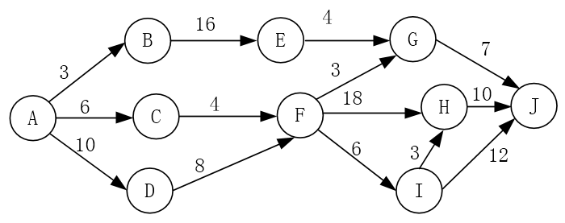

### 问题1
- A. 20
- B. 37
- C. 38
- D. 46
### 问题2
- A. 9
- B. 10
- C. 18
- D. 26

### 正确答案

D、C

### 解析

[['本题考查软件项目管理的基础知识。项目工期是AOE中最长的路径，称之为关键路径（项目最短工期）。
本题最长路径为：A→D→F→H→J，长度为46天，没有比它更长的路径。
FG活动不在关键路径上，并且FG活动所在的路径，其中最长的为ADFGJ，长度为28天，因此该活动的松弛时间为46-28=18天。
  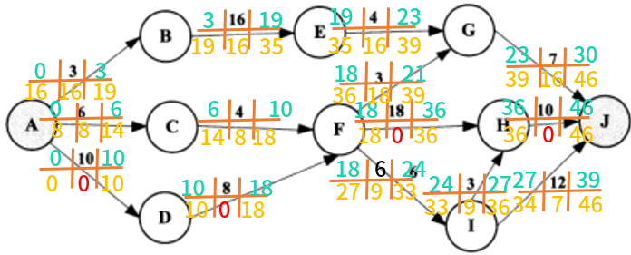''],['
']]

## 第17题（单选题）

以下叙述中，（B）不是一个风险。

- A. 由另一个小组开发的子系统可能推迟交付，导致系统不能按时交付客户
- B. 客户不清楚想要开发什么样的软件，因此开发小组开发原型帮助其确定需求
- C. 开发团队可能没有正确理解客户的需求
- D. 开发团队核心成员可能在系统开发过程中离职

### 正确答案

B

### 解析

本题考查的是风险的概念。一般认为风险包括两个特性：不确定性和损失。不确定性是指风险可能发生也可能不发生；损失是指如果风险发生，就会产生恶性后果。
本题B选项“客户不清楚想要开发什么样的软件”是已经发生的事件，没有不确定性，因此不是一个风险。ACD都是可能的情况，所以存在不确定性。

## 第18题（单选题）

对布尔表达式进行短路求值是指：无须对表达式中所有操作数或运算符进行计算就可确定表达式的值。对于表达式“a or ((c <  d) and b)”，（B）时可进行短路计算。

- A. d为true
- B. a为true
- C. b为true
- D. c为true

### 正确答案

B

### 解析

本题考查程序语言基础知识。根据本题题干“a or (( c < d ) and b )”，最后计算的是or，对于或运算，只要有一个为真则结果为真，不需要进行后面的计算，因此当a为true时，可进行短路计算，直接得到后面的结果。b、c、d单独为true都不能确定表达式的值为真。因此，ACD错误，本题选择B选项。

## 第19题（单选题）

下面二叉树表示的简单算术表达式为（C）。
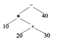

- A. 10*20+30-40
- B. 10*（20+30-40）
- C. 10*（20+30）-40
- D. 10*20+（30-40）

### 正确答案

C

### 解析

本题考查程序语言基础-二叉树的相关知识。本题由二叉树可知，表达式最后计算的为-，其次为*，最先做的为+，只有C选项的表达式是先加法后乘法最后减法。
A是先乘再加最后减，B项先加法后减法最后乘法，D是先乘法和减法最后加法。
也可将A、B、C、D四个选项对应的二叉树全部画出，找出相符的选项。

## 第20题（单选题）

在程序运行过程中，（C）时涉及整型数据转换为浮点型数据的操作。

- A. 将浮点型变量赋值给整型变量
- B. 将整型常量赋值给整型变量
- C. 将整型变量与浮点型变量相加
- D. 将浮点型常量与浮点型变量相加

### 正确答案

C

### 解析

本题考查程序语言基础知识。
本题A选项需要将浮点数转换为整型数；B选项和D选项同类型数据，不需要转换数据类型；C选项需要将整型数转换为浮点数再计算。
因此，ABD描述与题意不符，本题选择C选项。

## 第21题（单选题）

某计算机系统中互斥资源R的可用数为8，系统中有3个进程P1、P2和P3竞争R，且每个进程都需要i个R，该系统可能会发生死锁的最小i值为（D）。

- A. 1
- B. 2
- C. 3
- D. 4

### 正确答案

D

### 解析

本题考查操作系统进程管理信号量基础知识。
本题R资源的可用数为8，分配到3个进程中，为了让最后的i值最小，所以每个进程尽量平均分配，可以得到3 、3、2的分配情况，此时如果假设i的取值为3，则必定不会形成死锁。当i > 3时系统会形成死锁，此时取整，即最小i值为4。
因此，ABC错误，本题选择D选项。

## 第22题（单选题）

进程P1、P2、P3、P4和P5的前趋图如下所示：
 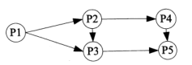
 若用PV操作控制这5个进程的同步与互斥的程序如下，那么程序中的空①和空②处应分别为（D/B/C）；空③和空④处应分别为（  ）；空⑤和空⑥处应分别为（  ）。
 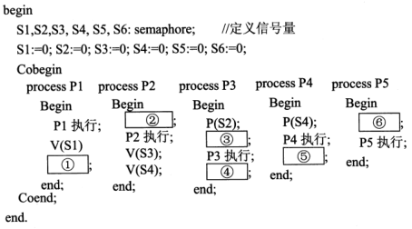

### 问题1
- A. V（S1）和P（S2）
- B. P（S1）和V（S2）
- C. V（S1）和V（S2）
- D. V（S2）和P（S1）
### 问题2
- A. V（S3）和V（S5）
- B. P（S3）和V（S5）
- C. V（S3）和P（S5）
- D. P（S3）和P（S5）
### 问题3
- A. P（S6）和P（S5）V（S6）
- B. V（S5）和V（S5）V（S6）
- C. V（S6）和P（S5）P（S6）
- D. P（S6）和P（S5）P（S6）

### 正确答案

D、B、C

### 解析

本题考查的是利用PV操作控制进程的并发执行。
先理清楚前趋图中的逻辑关系：P1没有前驱，P2的前驱是P1，P3的前驱是P1、P2，P4的前驱是P2，P5的前驱是P3、P4。
前驱就是指只有在前驱进程完成后，该进程才能开始执行。由图可知，这里进程之间有6条有向弧，分别表示为P1→P2，P1→P3，P2→P3，P2→P4，P3→P5，P4→P5，各个进程间的逻辑关系，那么我们需要设定6个信号量（S1、S2、S3、S4、S5、S6），利用PV操作来控制这些过程。
对于第一个空，P1执行完成之后，需要通知P2、P3可以开始，此处需要V（S1）、V（S2）操作分别唤醒P2、P3进程，已有V（S1），此处需要填写V（S2）。
对于第二个空，P2执行之前，需要检查P1进程是否完成，因此需要通过P（S1）操作来判定，P1是否完成。
对于第三个空，在P3执行之前，需要检查P1、P2进程是否完成，因此需要通过P（S2）、P（S3）操作来判定P1、P2是否完成，已有P（S2），此处填写P（S3）。
对于第四空，P3执行完成后，需要通知P5进程可以开始，此处需要通过V（S5）操作唤醒P5进程。
对于第五空，P4进程完成后，需要通知P5进程可以开始，此处需要通过V（S6）操作唤醒P5进程。
对于第六空，P5进程开始之前，需要检查P3、P4进程是否已完成，因此需要P（S5）、P（S6）操作来判断P3、P4是否完成。
综上，本题分别选择D、B、C选项。

## 第23题（单选题）

某文件管理系统在磁盘上建立了位示图（bitmap），记录磁盘的使用情况。若磁盘上物理块的编号依次为：0、1、2、....；系统中的字长为32位，位示图中字的编号依次为：0、1、2、..，每个字中的一个二进制位对应文件存储器上的一个物理块，取值0和1分别表示物理块是空闲或占用。假设操作系统将2053号物理块分配给某文件，那么该物理块的使用情况在位示图中编号为（C）的字中描述。

- A. 32
- B. 33
- C. 64
- D. 65

### 正确答案

C

### 解析

本题考查操作系统内存管理方面的基本知识。
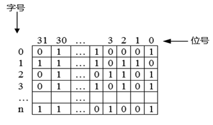
2053号物理块是第2054块物理块，每一个字可以表示32个物理块的存储情况，2054/32=64.…..6，比64个字多6位，因此，此时应该排在第65个字，从0号开始编号，则为第64号字。
因此，ABD错误，本题选择C选项。

## 第24题（单选题）

某操作系统文件管理采用索引节点法。每个文件的索引节点有8个地址项，每个地址项大小为4字节，其中5个地址项为直接地址索引，2个地址项是一级间接地址索引，1个地址项是二级间接地址索引，磁盘索引块和磁盘数据块大小均为1KB。若要访问文件的逻辑块号分别为1和518，则系统应分别采用（B）。

- A. 直接地址索引和一级间接地址索引
- B. 直接地址索引和二级间接地址索引
- C. 一级间接地址索引和一级间接地址索引
- D. 一级间接地址索引和二级间接地址索引

### 正确答案

B

### 解析

本题考查操作系统文件管理方面的基础知识。
每个物理块大小为1KB，每个地址项大小为4B，因此每个物理块可以对应地址项个数为：1KB/4B=256。
直接索引即索引直接指向物理块，可以表示逻辑块号范围：0~4号
一级索引即索引节点指向的物理块用来存放地址项，可以表示256个地址项，即256个物理块，可以表示逻辑地址块号范围：5~260，261~516号
二级索引即索引节点指向的物理块，存放的是一级索引的地址块地址，一共有256个地址块用来存放一级索引，每个块可以存放256个地址项，共有2562=65536个地址项，因此可以表示的逻辑块号范围：517~66052号。
因此，ACD描述错误，本题选择B选项。

## 第25题（单选题）

某企业拟开发一个企业信息管理系统，系统功能与多个部门的业务相关。现希望该系统能够尽快投入使用，系统功能可以在使用过程中不断改善。则最适宜采用的软件过程模型为（C）。

- A. 瀑布模型
- B. 原型模型
- C. 演化（迭代）模型
- D. 螺旋模型

### 正确答案

C

### 解析

本题考查软件开发过程模型的基础知识。
本题要求尽快投入使用，并可以在使用过程中不断完善，原型模型和演化（迭代）模型相比，演化模型更合适。
原型模型更适用于需求不明确时用以获取需求。
瀑布模型适用于需求非常全面，且在开发过程中没有或很少变化，用户的使用环境非常稳定，开发工作对用户参与的要求低。
螺旋模型将开发活动和风险管理结合起来，以减小风险。
本题选择C选项。

## 第26题（单选题）

能力成熟度模型集成（CMMI）是若干过程模型的综合和改进。连续式模型和阶段式模型是CMMI提供的两种表示方法，而连续式模型包括6个过程域能力等级，其中（D）使用量化（统计学）手段改变和优化过程域，以应对客户要求的改变和持续改进计划中的过程域的功效。

- A. CL2（已管理的）
- B. CL3（已定义级的）
- C. CL4（定量管理的）
- D. CL5（优化的）

### 正确答案

D

### 解析

本题考查软件过程和过程改进的基础知识。
CL0（未完成的）：过程域未执行或未得到CL1中定义的所有目标。
CL1（已执行的）：其共性目标是过程将可标识的输入工作产品转换成可标识的输出工作产品，以实现支持过程域的特定目标。
CL2（已管理的）：其共性目标是集中于已管理的过程的制度化。根据组织级政策规定过程的运作将使用哪个过程，项目遵循已文档化的计划和过程描述，所有正在工作的人都有权使用足够的资源，所有工作任务和工作产品都被监控、控制和评审。
CL3（已定义级的）：其共性目标集中于已定义的过程的制度化。过程是按照组织的裁剪指南从组织的标准过程中裁剪得到的，还必须收集过程资产和过程的度量，并用于将来对过程的改进。
CL4（定量管理的）：其共性目标集中于可定量管理的过程的制度化。使用测量和质量保证来控制和改进过程域，建立和使用关于质量和过程执行的质量目标作为管理准则。
CL5（优化的）：使用量化（统计学）手段改变和优化过程域，以满足客户的改变和持续改进计划中的过程域的功效。
本题选择D选项。

## 第27题（单选题）

在ISO/IEC 9126软件质量模型中，可靠性质量特性是指在规定的一段时间内和规定的条件下，软件维持在其性能水平有关的能力，其质量子特性不包括（A）。

- A. 安全性
- B. 成熟性
- C. 容错性
- D. 易恢复性

### 正确答案

A

### 解析

本题考查软件质量的基础知识。
可靠性质量属性包括：成熟性、容错性和易恢复性。A项安全性应该是功能性子特性。
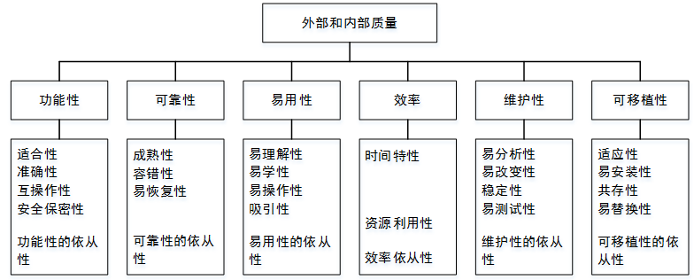

## 第28题（单选题）

以下关于模块化设计的叙述中，不正确的是（B）。

- A. 尽量考虑高内聚、低耦合，保持模块的相对独立性
- B. 模块的控制范围在其作用范围内
- C. 模块的规模适中
- D. 模块的宽度、深度、扇入和扇出适中

### 正确答案

B

### 解析

本题考查软件设计的基础知识。
模块化设计要求高内聚、低耦合。
 在结构化设计中，系统由多个逻辑上相对独立的模块组成，在模块划分时需要遵循如下原则：
（1）模块的大小要适中。系统分解时需要考虑模块的规模，过大的模块可能导致系统分解不充分，其内部可能包括不同类型的功能，需要进一步划分，尽量使得各个模块的功能单一；过小的模块将导致系统的复杂度增加，模块之间的调用过于频繁，反而降低了模块的独立性。一般来说，一个模块的大小使其实现代码在1～2页纸之内，或者其实现代码行数在50～200行之间，这种规模的模块易于实现和维护。
（2）模块的扇入和扇出要合理。一个模块的扇出是指该模块直接调用的下级模块的个数；扇出大表示模块的复杂度高，需要控制和协调过多的下级模块。扇出过大一般是因为缺乏中间层次，应该适当增加中间层次的控制模块；扇出太小时可以把下级模块进一步分解成若干个子功能模块，或者合并到它的上级模块中去。一个模块的扇入是指直接调用该模块的上级模块的个数；扇入大表示模块的复用程度高。设计良好的软件结构通常顶层扇出比较大，中间扇出较少，底层模块则有大扇入。一般来说，系统的平均扇入和扇出系数为3或4，不应该超过7，否则会增大出错的概率。
（3）深度和宽度适当。深度表示软件结构中模块的层数，如果层数过多，则应考虑是否有些模块设计过于简单，看能否适当合并。宽度是软件结构中同一个层次上的模块总数的最大值，一般说来，宽度越大系统越复杂，对宽度影响最大的因素是模块的扇出。在系统设计时，需要权衡系统的深度和宽度，尽量降低系统的复杂性，减少实施过程的难度，提高开发和维护的效率。
模块的扇入指模块直接上级模块的个数。模块的直属下级模块个数即为模块的扇出。
B应该是
模块的作用范围应在控制范围之内本题选择B选项。

## 第29题（单选题）

某企业管理信息系统中，采购子系统根据材料价格、数量等信息计算采购的金额，并给财务子系统传递采购金额、收款方和采购日期等信息，则这两个子系统之间的耦合类型为（B）耦合。

- A. 数据
- B. 标记
- C. 控制
- D. 外部

### 正确答案

B

### 解析

本题考查软件设计-耦合性基础知识。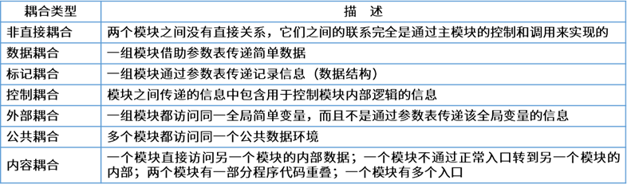
非直接耦合：两个模块之间没有直接关系，它们之间的联系完全是通过主模块的控制和调用来实现的。
数据耦合：一个模块访问另一个模块时，彼此之间是通过简单数据参数（不是控制参数、公共数据结构或外部变量）来交换输入、输出信息的。
标记耦合 ：一组模块通过参数表传递记录信息，就是标记耦合。这个记录是某一数据结构的子结构，而不是简单变量。其实传递的是这个数据结构的地址；
控制耦合：如果一个模块通过传送开关、标志、名字等控制信息，明显地控制选择另一模块的功能，就是控制耦合。
外部耦合：一组模块都访问同一全局简单变量而不是同一全局数据结构，而且不是通过参数表传递该全局变量的信息，则称之为外部耦合。
公共耦合：若一组模块都访问同一个公共数据环境，则它们之间的耦合就称为公共耦合。公共的数据环境可以是全局数据结构、共享的通信区、内存的公共覆盖区等。
内容耦合：如果发生下列情形，两个模块之间就发生了内容耦合。
（1）一个模块直接访问另一个模块的内部数据；
（2） 一个模块不通过正常入口转到另一模块内部；
（3）两个模块有一部分程序代码重叠（只可能出现在汇编语言中）；
（4）一个模块有多个入口。
根据本题题干描述，采购子系统“给财务子系统传递采购金额、收款方和采购日期等信息”，传递时应将这些数据包装在数据结构中，因此二者之间是标记耦合。本题选择B选项。

## 第30题（单选题）

对以下的程序伪代码（用缩进表示程序块）进行路径覆盖测试，至少需要（B/C）个测试用例。采用McCabe度量法计算其环路复杂度为（  ）。
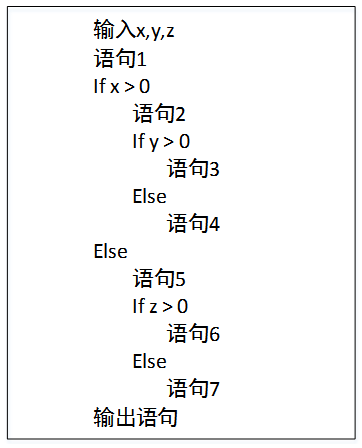

### 问题1
- A. 2
- B. 4
- C. 6
- D. 8
### 问题2
- A. 2
- B. 3
- C. 4
- D. 5

### 正确答案

B、C

### 解析

[['本题考查软件测试的相关知识。
对于本题，用例（x，y，z）分别为（1，1，0）（1，-1，0）（-1，0，1）（-1，0，-1），这4个测试用例可以走完所有可能路径。因为在伪代码中，我们可以看到，当x > 0时，只需要对Y分别取大于0和不大于0的值即可，z不参与比较；当x不大于0时，只需要对z分别取大于0和不大于0的值即可，y不参与比较，只需要4个用例即可。
对于第二空，转换为结点图如下：
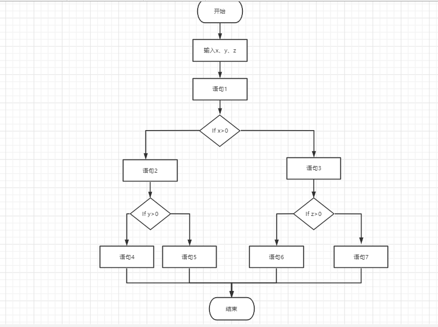
 根据V（G）=m-n+2，其中m是有向图的弧，为15，n为有向图的节点数，为13，15-13+2=4，即环路复杂度为4。
''''],['
']]

## 第31题（单选题）

某商场的销售系统所使用的信用卡公司信息系统的数据格式发生了更改，因此对该销售系统进行的修改属于（B）维护。

- A. 改正性
- B. 适应性
- C. 改善性
- D. 预防性

### 正确答案

B

### 解析

本题考查软件维护的基础知识。
在系统运行过程中，软件需要维护的原因是多样的，根据维护的原因不同，可以将软件维护分为以下四种：
（1）改正性维护。为了识别和纠正软件错误、改正软件性能上的缺陷、排除实施中的错误使用，应当进行的诊断和改正错误的过程就称为改正性维护。
（2）适应性维护。在使用过程中，外部环境（新的硬、软件配置）、数据环境（数据库、数据格式、数据输入/输出方式、数据存储介质）可能发生变化。为使软件适应这种变化，而去修改软件的过程就称为适应性维护。
（3）改善性维护。在软件的使用过程中，用户往往会对软件提出新的功能与性能要求。为了满足这些要求，需要修改或再开发软件，以扩充软件功能、增强软件性能、改进加工效率、提高软件的可维护性。这种情况下进行的维护活动称为改善性维护。
（4）预防性维护。这是指预先提高软件的可维护性、可靠性等，为以后进一步改进软件打下良好基础。
本题对该销售系统的修改是为了应对数据格式的变化而作出的修改。

## 第32题（单选题）

在面向对象方法中，继承用于（A）。

- A. 在已存在的类的基础上创建新类
- B. 在已存在的类中添加新的方法
- C. 在已存在的类中添加新的属性
- D. 在已存在的状态中添加新的状态

### 正确答案

A

### 解析

本题考查面向对象的基本知识。
考查的是继承的定义：继承是类之间的一种关系，在定义和实现一个类的时候，可以在一个已经存在的类的基础上进行。因此本题选择A选项。
BC描述的封装，D是多态。 本题选择A选项。

## 第33题（单选题）

（C）多态是指操作（方法）具有相同的名称、且在不同的上下文中所代表的含义不同。

- A. 参数
- B. 包含
- C. 过载
- D. 强制

### 正确答案

C

### 解析

本题考查面向对象技术的基本知识。
参数多态：应用广泛、最纯的多态。
包含多态：同样的操作可用于一个类型及其子类型。包含多态一般需要进行运行时的类型检查。
强制多态：编译程序通过语义操作，把操作对象的类型强行加以变换，以符合函数或操作符的要求。
过载多态：同一个名（操作符﹑函数名）在不同的上下文中有不同的类型。 
本题应该选择C选项过载多态。

## 第34题（单选题）

在某销售系统中，客户采用扫描二维码进行支付。若采用面向对象方法开发该销售系统，则客户类属于（B/A）类，二维码类属于（  ）类。

### 问题1
- A. 接口
- B. 实体
- C. 控制
- D. 状态
### 问题2
- A. 接口
- B. 实体
- C. 控制
- D. 状态

### 正确答案

B、A

### 解析

本题考查面向对象技术的基本知识。
类可以分为三种：实体类、接口类（边界类）和控制类。实体类的对象表示现实世界中真实的实体，如人、物等。接口类（边界类）的对象为用户提供一种与系统合作交互的方式，分为人和系统两大类，其中人的接口可以是显示屏、窗口、Web窗体、对话框、菜单、列表框、其他显示控制、条形码、二维码或者用户与系统交互的其他方法。系统接口涉及把数据发送到其他系统，或者从其他系统接收数据。控制类的对象用来控制活动流，充当协调者。并不包括状态类。
本题选择B、A选项。

## 第35题（单选题）

下图所示UML图为（B/C/D），用于展示（  ）。①和②分别表示（  ）。
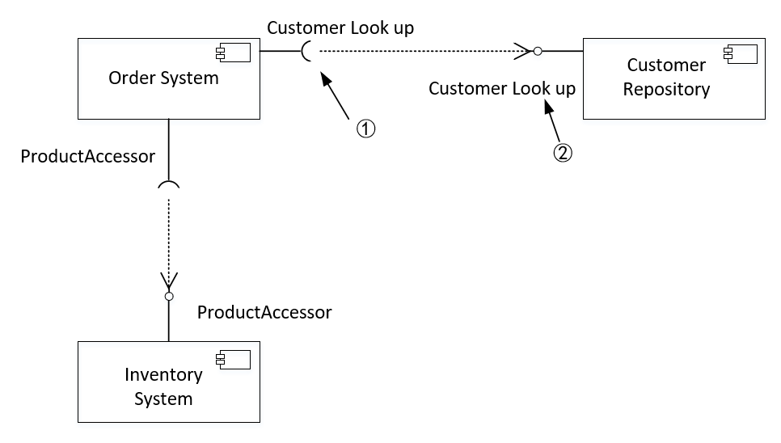

### 问题1
- A. 类图
- B. 组件图
- C. 通信图
- D. 部署图
### 问题2
- A. 一组对象、接口、协作和它们之间的关系
- B. 收发消息的对象的结构组织
- C. 组件之间的组织和依赖
- D. 面向对象系统的物理模型
### 问题3
- A. 供接口和供接口
- B. 需接口和需接口
- C. 供接口和需接口
- D. 需接口和供接口

### 正确答案

B、C、D

### 解析

本题考查统一建模语言(UML)的基本知识。
图示为组件图的小图标画法；
组件图表示的是组件之间的组织和依赖；
根据UML常规定义为供接口，为需接口。
类图(Class diagram)是显示了模型的静态结构，特别是模型中存在的类、类的内部结构以及它们与其他类的关系等。
 类图(Class Diagram)展现了一组对象、接口、协作和它们之间的关系
通信图（协作图）是表现对象交互关系的图，它展现了多个对象在协同工作达成共同目标的过程中互相通信的情况。 通信图收发消息的对象的结构组织。
部署图是用来显示系统中软件和硬件的物理架构。它面向对象系统的物理模型。
本题选择B选项。

## 第36题（单选题）

假设现在要创建一个简单的超市销售系统，顾客将毛巾、饼干、酸奶等物品（Item）加入购物车（Shopping_Cart），在收银台（Checkout）人工（Manual）或自动（Auto）地将购物车中每个物品的价格汇总到总价格后结账。这一业务需求的类图（方法略）设计如下图所示，采用了（B/A/D/C）模式。其中（  ）定义以一个Checkout对象为参数的accept操作，由子类实现此accept操作。此模式为（  ），适用于（  ）。
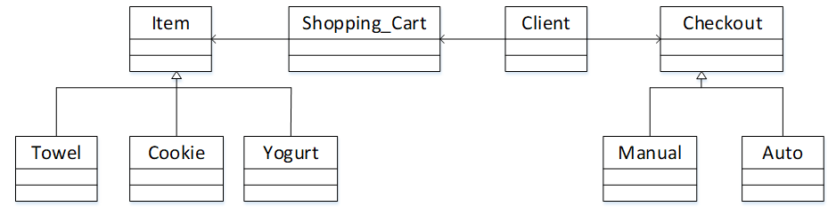

### 问题1
- A. 观察者（Observer）
- B. 访问者（Visitor）
- C. 策略（Strategy）
- D. 桥接器（Bridge）
### 问题2
- A. Item
- B. Shopping_Cart
- C. Checkout
- D. Manual和Auto
### 问题3
- A. 创建型对象模式
- B. 结构型对象模式
- C. 行为型类模式
- D. 行为型对象模式
### 问题4
- A. 必须保存一个对象在某一个时刻的（部分）状态
- B. 想在不明确指定接收者的情况下向多个对象中的一个提交一个请求
- C. 需要对一个对象结构中的对象进行很多不同的并且不相关的操作
- D. 在不同的时刻指定、排列和执行请求

### 正确答案

B、A、D、C

### 解析

本题考查设计模式的基本概念。
本题为访问者模式。对于观察者模式是一个被观察者和多个观察者对象，与图示不符；桥接模式是结构型模式，存在部分与整体的联系，与本题不符；策略模式是对于不同算法的封装和切换，但是调用策略的对象只有一个，与本题不符。一个对象结构包含很多类对象（Item），而系统要求这些对象实施一些依赖于某具体类（Checkout）的操作时，可以使用访问者模式。
创建型模式又分为对象创建型模式和类创建型模式。对象创建型模式处理对象的创建，类创建型模式处理类的创建。详细地说，对象创建型模式把对象创建的一部分推迟到另一个对象中，而类创建型模式将它对象的创建推迟到子类中。
结构型模式涉及如何组合类和对象以获得更大的结构，即通过多个类和对象来实现更复杂的结构。
行为型模式包括类行为和对象行为模式，用于描述程序在运行时复杂的流程控制，即描述多个类或对象之间怎样相互协作共同完成单个对象都无法单独完成的任务，它涉及算法与对象间职责的分配。
必须保存一个对象在某一个时刻的（部分）状态属于备忘录模式。
想在不明确指定接收者的情况下向多个对象中的一个提交一个请求 属于 责任链模式。
需要对一个对象结构中的对象进行很多不同的并且不相关的操作属于访问者模式。
在不同的时刻指定、排列和执行请求属于命令模式。
本题选择B、A、D、C选项

## 第37题（单选题）

在以阶段划分的编译器中，（B）阶段的主要作用是分析程序中的句子结构是否正确。

- A. 词法分析
- B. 语法分析
- C. 语义分析
- D. 代码生成

### 正确答案

B

### 解析

本题考查程序语言基础知识。
词法分析：从左到右逐个扫描源程序中的字符，识别其中如关键字（或称保留字）、标识符、常数、运算符以及分隔符（标点符号和括号）等。
语法分析：根据语法规则将单词符号分解成各类语法单位，并分析源程序是否存在语法上的错误。包括：语言结构出错、if…end if不匹配，缺少分号、括号不匹配、表达式缺少操作数等。本题属于语法分析阶段的作用。
语义分析：进行类型分析和检查，主要检测源程序是否存在静态语义错误。包括：运算符和运算类型不符合，如取余时用浮点数。
目标代码生成是编译的最后一个阶段。目标代码生成器把语法分析后或优化后的中间代码变换成目标代码。

## 第38题（单选题）

下图所示为一个不确定有限自动机（NFA）的状态转换图。该NFA可识别字符串（A）。
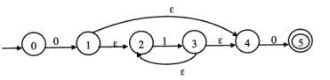

- A. 0110
- B. 0101
- C. 1100
- D. 1010

### 正确答案

A

### 解析

本题考查程序语言基础知识。
因为是不确定的有限自动机，中间内容有多种可能，但由图可以看到，从初态0开始，首字符只能为0，到终态结束之前，尾字符也只能为0，只有A选项满足首字符和尾字符都为0。
BCD不符合。本题选A。

## 第39题（单选题）

函数f和g的定义如下图所示。执行函数f时若采用引用（call by reference）方式调用函数g(a)，则函数f的返回值为（D）。
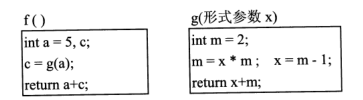

- A. 14
- B. 18
- C. 24
- D. 28

### 正确答案

D

### 解析

本题考查程序语言基础知识。
采用引用调用，会改变实参的值。对于实参a，传递给g(a)之后，在g(a)函数，表现为形参x。
根据g(x)代码：m=5*2=10，x=10-1=9，返回值x+m=19；
返回f( )代码，此时a（即g(x)中的x）的值已经改变，为9；c等于g(a)的返回值，也就是19。
最终可得f( )的返回值a+c=28。

## 第40题（单选题）

数据库系统中的视图、存储文件和基本表分别对应数据库系统结构中的（D）。

- A. 模式、内模式和外模式
- B. 外模式、模式和内模式
- C. 模式、外模式和内模式
- D. 外模式、内模式和模式

### 正确答案

D

### 解析

本题考查的是数据库体系结构三层模式。对于题干给出的视图、存储文件、基本表分别对应：视图-外模式，存储文件-内模式，基本表-模式。
因此本题选择D选项，需要注意对应位置。

## 第41题（单选题）

在分布式数据库中，（C）是指用户或应用程序不需要知道逻辑上访问的表具体如何分块存储。

- A. 逻辑透明
- B. 位置透明
- C. 分片透明
- D. 复制透明

### 正确答案

C

### 解析

本题考查的是分布式数据库相关知识。
分片透明：是指用户不必关心数据是如何分片的，它们对数据的操作在全局关系上进行，即关心如何分片对用户是透明的，因此，当分片改变时应用程序可以不变。分片透明性是最高层次的透明性，如果用户能在全局关系一级操作，则数据如何分布，如何存储等细节自不必关心，其应用程序的编写与集中式数据库相同。
复制透明：用户不用关心数据库在网络中各个节点的复制情况，被复制的数据的更新都由系统自动完成。在分布式数据库系统中，可以把一个场地的数据复制到其他场地存放，应用程序可以使用复制到本地的数据在本地完成分布式操作，避免通过网络传输数据，提高了系统的运行和查询效率。但是对于复制数据的更新操作，就要涉及对所有复制数据的更新。
位置透明：是指用户不必知道所操作的数据放在何处，即数据分配到哪个或哪些站点存储对用户是透明的。
局部映像透明性（逻辑透明）是最低层次的透明性，该透明性提供数据到局部数据库的映像，即用户不必关心局部DBMS支持哪种数据模型、使用哪种数据操纵语言，数据模型和操纵语言的转换是由系统完成的。因此，局部映像透明性对异构型和同构异质的分布式数据库系统是非常重要的。
本题提到不需要了解具体如何分块存储，如果描述为不需要了解物理存储或存储位置，则为位置透明，而涉及如何分块存储，应该为分片透明。对于分布式数据库，分片是一种大局性的划分，而物理上的存储位置则更为低层，所以对于如何分块存储，强调更多的是分片而不是物理位置。本题选择C选项。

## 第42题（单选题）

设有关系模式R（A1，A2，A3，A4，A5，A6），函数依赖集F={A1→A3，A1 A2→A4，A5 A6→A1，A3 A5→A6，A2 A5→A6}。关系模式R的一个主键是（B/D）， 从函数依赖集F可以推出关系模式R（  ）。

### 问题1
- A. A1A4
- B. A2A5
- C. A3A4
- D. A4A5
### 问题2
- A. 不存在传递依赖，故R为1NF
- B. 不存在传递依赖，故R为2NF
- C. 存在传递依赖，故R为3NF
- D. 每个非主属性完全函数依赖于主键，故R为2NF

### 正确答案

B、D

### 解析

[['本题主要考查关系模式规范化方面的相关知识。
根据函数依赖集，可以简单分析，在本题中唯一入度为0的属性为A2，因此，A2一定属于候选键集合，在选项中只有B选项符合要求。
第二空，根据第一空可知R的一个主键为A2A5，由函数依赖集F可知，存在A2A5→A6，A5A6→A1，A1→A3，这里存在传递函数依赖，故A、B选项均不正确，C选项本身不正确，存在非主属性对候选键的传递函数依赖，是不满足3NF的。因此本题选择D选项。
也可将完整的依赖图示绘制出来判断本题A2A5为候选键，并且每个非主属性完全函数依赖于主键。本题选择B、D选项。
''],['
']]

## 第43题（单选题）

给定关系R（A, B,C,D）和S（C,D,E），若关系R与S进行自然连接运算，则运算后的元组属性列数为（B/D）；关系代数表达式π1,4（σ2=5（R⋈S））与（  ）等价。

### 问题1
- A. 4
- B. 5
- C. 6
- D. 7
### 问题2
- A. πA,D(σC=D(R×S))
- B. πR.A,R.D(σR.B=S.C(R×S))
- C. πA,R.D(σR.C=S.D(R×S))
- D. πR.A,R.D(σR.B=S.E(R×S))

### 正确答案

B、D

### 解析

本题考查的是数据库中关系代数的相关知识内容。
对于第一空，关系R与S进行自然连接后，属性列数为二者之和并减去其中的重复列，本题R和S都存在C、D属性，因此自然连接后属性列数为4+3-2=5，因此本空选择B选项。
对于第二空，4个选项都不正确。正确的结果应该是πR.A,R.D(σR.B=S.E ^ R.C=S.C ^ R.D=S.D(R×S))或πR.A,R.D(σR.B=S.E
(R⋈S))。
这4个选项都缺失了同名属性列取值相等的判断，选择其中最接近的选项应该是D选项。

## 第44题（单选题）

栈的特点是后进先出，若用单链表作为栈的存储结构，并用头指针作为栈顶指针，则（A）。

- A. 入栈和出栈操作都不需要遍历链表
- B. 入栈和出栈操作都需要遍历链表
- C. 入栈操作需要遍历链表而出栈操作不需要
- D. 入栈操作不需要遍历链表而出栈操作需要

### 正确答案

A

### 解析

本题考查数据结构基础知识。
本题用单链表作为栈的存储结构，因为栈的操作是先进后出，因此无论是入栈还是出栈，都只对栈顶元素操作，而在单链表中用头指针作为栈顶指针，此时无论是出栈还是入栈，都只需要对头指针指向的栈顶指针操作即可，不需要遍历链表。
因此，BCD描述与题意不符，本题选择A选项。

## 第45题（单选题）

已知某二叉树的先序遍历序列为ABCDEF、中序遍历序列为BADCFE，则可以确定该二叉树（B）。

- A. 是单支树（即非叶子结点都只有一个孩子）
- B. 高度为4（即结点分布在4层上）
- C. 根结点的左子树为空
- D. 根结点的右子树为空

### 正确答案

B

### 解析

本题考查数据结构基础知识。
先序遍历即先根后左子树再右子树，中序遍历为先左子树后根再右子树。先序遍历的最开始结点A即为整棵树的根，结合中序遍历，A结点左侧B即为根节点A的左子树，右侧DCFE则为A的右子树，同理可以得出C为A的右子树的根节点，D为C的左子树，EF为C的右子树，F为E的左子树。可以得到如下图，所以该二叉树的高度为4。
   
由图可知，叙述符合的只有B选项，树的高度为4。  
C节点有两个孩子，不是单支树A错误。
根节点左右子树都不为空，CD错误。
因此，ACD描述与题意不符，本题选择B选项。

## 第46题（单选题）

可以构造出下图所示二叉排序树（二叉检索树、二叉查找树）的关键码序列是（B）。
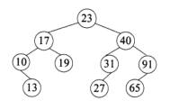

- A. 10 13 17 19 23 27 31 40 65 91
- B. 23 40 91 17 19 10 31 65 27 13
- C. 23 19 40 27 17 13 10 91 65 31
- D. 27 31 40 65 91 13 10 17 23 19

### 正确答案

B

### 解析

本题考查数据结构基础知识。
二叉排序树的构造过程：
若查找二叉树为空树，则以新结点为查找二叉树；
将要插入结点键值与插入后父结点键值比较，就能确定新结点是父结点的左子结点，还是右子结点，直到将序列中的所有元素（关键码）全部插入。
根据排序二叉树的构造过程，可知A选项的根节点为10，D选项的根节点为27，因此可以排除。对于C选项，构造根节点的子结点，可知19为其左孩子结点，而图示显示为17，不符和。本题只有B选项可以构造出图示的排序二叉树。
因此，ACD描述与题意不符，本题选择B选项。

## 第47题（单选题）

图G的邻接矩阵如下图所示（顶点依次表示为v0、v1、v2、v3、v4、v5），G是（B/A）。对G进行广度优先遍历（从v0开始），可能的遍历序列为（  ）。
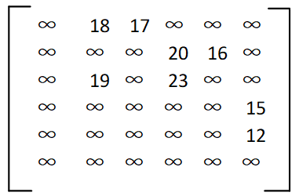

### 问题1
- A. 无向图
- B. 有向图
- C. 完全图
- D. 强连通图
### 问题2
- A. v0、v1、v2、v3、v4、v5
- B. v0、v2、v4、 v5、v1、v3
- C. v0、v1、v3、v5、v2、v4
- D. v0、v2、v4、v3、v5、v1

### 正确答案

B、A

### 解析

本题考查数据结构基础知识。
由邻接矩阵可知，对于结点V0和V1之间，只存在弧V0→V1，而没有弧V1→V0，因此图G不属于无向图，也不属于完全图。
强连通图：在有向图G中如果对于每一对顶点Vi，Vj，从顶点Vi到顶点Vj和从顶点Vj到顶点Vi都存在路径，则称图为强连通图。本题不满足该条件。
无向图：边没有方向的图称为无向图。
有向图：具有方向性的图，是由一组顶点和一组有方向的边组成的，每条方向的边都连接着一对有序的顶点。 
完全图：一个简单的无向图，其中每对不同的顶点之间都恰有一条边相连。
因此本题第一空应该选择B选项有向图。
对于第二空，图的广度遍历过程：从图中的某个顶点V触发，在访问了V之后依次访问V的各个未被访问的邻接点，然后分别从这些邻接点出发，依次访问它们的邻接点，并使“先被访问的顶点的邻接点”先于“后被访问的顶点的邻接点”被访问，直到图中所有已被访问的顶点的邻接点都被访问到。本题从V0出发，依次访问其邻接点V1、V2，只有A选项符合条件。

## 第48题（单选题）

在一条笔直公路的一边有许多房子，现要安装消防栓，每个消防栓的覆盖范围远大于房子的面积，如下图所示。现求解能覆盖所有房子的最少消防栓数和安装方案（问题求解过程中，可将房子和消防栓均视为直线上的点）。
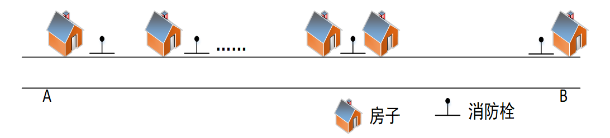
该问题求解算法的基本思路为：从左端的第一栋房子开始，在其右侧m米处安装一个消防栓，去掉被该消防栓覆盖的所有房子。在剩余的房子中重复上述操作，直到所有房子被覆盖。算法采用的设计策略为（C/B/B/C）；对应的时间复杂度为（  ）。
假设公路起点A的坐标为0，消防栓的覆盖范围（半径）为20米，10栋房子的坐标为（10，20,，30，35，60，80，160，210，260，300），单位为米。根据上述算法，共需要安装（  ）个消防栓。以下关于该求解算法的叙述中，正确的是（  ）。

### 问题1
- A. 分治
- B. 动态规划
- C. 贪心
- D. 回溯
### 问题2
- A. Θ(lgn)
- B. Θ(n)
- C. Θ(nlgn)
- D. Θ(n2)
### 问题3
- A. 4
- B. 5
- C. 6
- D. 7
### 问题4
- A. 肯定可以求得问题的一个最优解
- B. 可以求得问题的所有最优解
- C. 对有些实例，可能得不到最优解
- D. 只能得到近似最优解

### 正确答案

C、B、B、C

### 解析

[['本题考查算法设计与分析的基础知识。
（一）对于第一空，本题使用的是贪心法。 
1、分治法特征：对于一个规模为n的问题，若该问题可以容易地解决（比如说规模n较小）则直接解决；否则将其分解为k个规模较小的子问题，这些子问题互相独 立且与原问题形式相同，递归地解这些子问题，然后将各子问题的解合并得到原问题的解。
2、动态规划法：在求解问题中，对于每一步决策，列出各种可能的局部解，再依据某种判定条件，舍弃那些肯定不能得到最优解的局部解，在每一步都经过筛选，以每一步都是最优解来保证全局是最优解。本题情景没有列出所有的可能解进行筛选，因此，本题不属于动态规划法。
3、回溯法：回溯法是一种选优搜索法，按选优条件向前搜索，以达到目标。但当搜索到某一步时，发现原先选择并不优或达不到目标，就退回一步重新选择。这种走不通就退回再走的技术就是回溯法。本题情景没有探索和回退的过程，因此，本题不属于回溯法。
4、贪心法：总是做出在当前来说是最好的选择，而并不从整体上加以考虑，它所做的每步选择只是当前步骤的局部最优选择，但从整体来说不一定是最优的选择。由于它不必为了寻找最优解而穷尽所有可能解，因此其耗费时间少，一般可以快速得到满意的解，但得不到最优解。
5、“能够覆盖左侧第一栋房子的最远位置，放置消防栓”为策略进行处理，取当前位置最优，因此本题属于贪心法的算法思想。
（二）对于第二空，时间复杂度。
由于本题的算法过程，是依次与各个房子进行判断，当所有房子都被比较之后，则问题结束，因此时间复杂度与房子的个数相关，本问题的时间复杂度应该趋于线性，为Θ(n)。
（三）对于第三空，关于对应序列。（10，20，30，35，60，80，160，210，260，300）
1、第一轮放置：在第一座房子x=10的右侧20米处安装一个消防栓，可以覆盖10，20，30，35这4栋房子；
2、第二轮放置：去掉前4栋房子，在第5栋房子x=60的右侧20米处安装一个消防栓，可以覆盖60、80这2栋房子；
3、第三轮放置：去掉前面已覆盖的房子，在第7栋房子x=160的右侧20米处安装一个消防栓，只可以覆盖160这一栋房子；
4、第四轮放置：去掉前面已覆盖的房子，在第8栋房子x=210的右侧20米处安装一个消防栓，可以覆盖210这一栋房子；
5、第五轮放置：去掉前面已覆盖的房子，在第9栋房子x=260的右侧20米处安装一个消防栓，可以覆盖260、300这2栋房子；
6、房子全部覆盖完毕，因此共需安装5个消防栓。
（四）对于第四空，对于得到一个最优解是动态规划的特点，可以得到问题所有的最优解，是回溯法的特征，可以排除A、B选项。对于C、D选项，C选项说法更恰当一些。
''''],['
'],['
'],['
']]

## 第49题（单选题）

使用ADSL接入Internet，用户端需要安装（D）协议。

- A. PPP
- B. SLIP
- C. PPTP
- D. PPPoE

### 正确答案

D

### 解析

本题考查ADSL基础知识。
ADSL Modem上网拨号方式有3种，即专线方式（静态IP）、PPPoA和PPPoE。
PPPoE（英语：Point-to-Point Protocol Over Ethernet），以太网上的点对点协议，是将点对点协议（PPP）封装在以太网（Ethernet）框架中的一种网络隧道协议。
PPTP（Point-to-Point Tunneling Protocol），即点对点隧道协议。该协议是在PPP协议的基础上开发的一种新的增强型安全协议，支持多协议虚拟专用网（VPN），可以通过密码验证协议（PAP）、可扩展认证协议（EAP）等方法增强安全性。可以使远程用户通过拨入ISP、通过直接连接Internet或其他网络安全地访问企业网。
SLIP（Serial Line Internet Protocol，串行线路网际协议），该协议是Windows远程访问的一种旧工业标准，主要在Unix远程访问服务器中使用，现今仍然用于连接某些ISP。
PPP（点到点协议）是为在同等单元之间传输数据包这样的简单链路设计的链路层协议。这种链路提供全双工操作，并按照顺序传递数据包。设计目的主要是用来通过拨号或专线方式建立点对点连接发送数据，使其成为各种主机、网桥和路由器之间简单连接的一种共通的解决方案。
因此本题选择D选项。

## 第50题（单选题）

下列命令中，不能用于诊断DNS故障的是（A）。

- A. netstat
- B. nslookup
- C. ping
- D. tracert

### 正确答案

A

### 解析

本题考查网络命令的基础知识。
netstat是控制台命令，是一个监控TCP/IP网络的非常有用的工具，它可以显示路由表、实际的网络连接以及每一个网络接口设备的状态信息。netstat用于显示与IP、TCP、UDP和ICMP协议相关的统计数据，一般用于检验本机各端口的网络连接情况。
nslookup是一个监测网络中DNS服务器是否能正确实现域名解析的命令行工具。
ping命令常用于测试连通性，在此过程中可看出是直接ping的目标地址。
tracert是路由跟踪实用程序，用于确定IP数据包访问目标所采取的路径。
nslookup、ping、tracert都可以加上一个主机域名作为其命令参数来诊断DNS故障，nslookup还可以看到本地DNS服务器地址。
netstat命令一般用于检验本机各端口的网络连接情况 ，与DNS无关联。

## 第51题（单选题）

以下关于TCP/IP协议和层次对应关系的表示中，正确的是（A）。

- A. 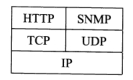
- B. 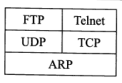
- C. 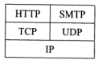
- D. 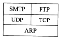

### 正确答案

A

### 解析

本题考查TCP/IP协议簇和各协议的层次对应关系。
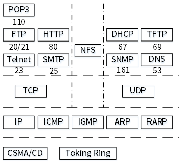
本题基于TCP的协议有HTTP、SMTP、FTP、Telnet。基于UDP的协议有SNMP。本题符合的只有A选项。

## 第52题（单选题）

把CSS样式表与HTML网页关联，不正确的方法是（C）。

- A. 在HTML文档的 < head > 标签内定义CSS样式
- B. 用@import引入样式表文件
- C. 在HTML文档的 < !-- -- > 标签内定义CSS样式
- D. 用 < link > 标签链接网上可访问的CSS样式表文件

### 正确答案

C

### 解析

本题考查CSS样式表的基础知识。 < !-- -- > 是HTML注释的表示方式，在这里定义CSS样式无效。
本题选择C选项

## 第53题（单选题）

使用（C）命令可以释放当前主机自动获取的IP地址。

- A. ipconfig/all
- B. ipconfig/reload
- C. ipconfig/release
- D. ipconfig/reset

### 正确答案

C

### 解析

本题考查网管命令。
ipconfig/all能为DNS和WINS服务器显示它已配置且所要使用的附加信息（如IP地址等），并且显示内置于本地网卡中的物理地址。
ipconfig/release也只能在向DHCP服务器租用其IP地址的计算机上起作用。如果你输入ipconfig /release，那么所有接口的租用IP地址便重新交付给DHCP服务器。
/reset和/reload为干扰项，ipconfig不支持这两个参数。

## 第54题（单选题）

The project workbook is not so much a separate document as it is a structure imposed on the documents that the project will be producing anyway.
All the documents of the project need to be part of this （1）. This includes objectives ,external specifications , interface specifications , technical standards , internal specifications and administrative memoranda（备忘录）.
Technical prose is almost immortal. If one examines the genealogy（手册）of a customer manual for a piece of hardware or software , one can trace not only the ideas , but also many of the very sentences and paragraphs back to the first （2） proposing the product or explaining the first design. For the technical writer, the paste-pot is as mighty as the pen.
Since this is so, and since tomorrow's product-quality manuals will grow from today’s memos, it is very important to get the structure of the documentation right. The early design of the project （3） ensures that the documentation structure itself is crafted, not haphazard. Moreover, the establishment of a structure molds later writing into segments that fit into that structure.
The second reason for the project workbook is control of the distribution of （4）. The problem is not to restrict information, but to ensure that relevant information gets to all the people who need it.
The first step is to number all memoranda, so that ordered lists of titles are available and each worker can see if he has what he wants. The organization of the workbook goes well beyond this to establish a tree-structure of memoranda. The （5） allows distribution lists to be maintained by subtree, if that is desirable.

### 问题1
- A. structure
- B. specification
- C. standard
- D. objective
### 问题2
- A. objective
- B. memoranda
- C. standard
- D. specification
### 问题3
- A. title
- B. list
- C. workbook
- D. quality
### 问题4
- A. product
- B. manual
- C. document
- D. information
### 问题5
- A. list
- B. document
- C. tree-structure
- D. number

### 正确答案

A、B、C、D、C

### 解析

[['本题考查专业英语知识。
项目工作手册不是单独的一篇文档，它是对项目必须产出的一系列文档进行组织的一种结果。
项目的所有文档都必须是该结构的一部分。这包括目标，外部规范说明，接口规范，技术标准，内部规范和管理备忘录。
技术说明几乎是必不可少的。如果某人就硬件和软件的某部分，去查看一系列相关的用户手册。他发现的不仅仅是思路，而且还有能追溯到最早备忘录的许多文字和章节，这些备忘录对产品提出建议或者解释设计。对于技术作者而言,文章的剪裁粘贴与钢笔一样有用。基于上述理由，再加上“未来产品”的质量手册将诞生于“今天产品”的备忘录，所以正确的文档结构非常重要。事先将项目工作手册设计好，能保证文档的结构本身是规范的，而不是杂乱无章的。另外，有了文档结构，后来书写的文字就可以放置在合适的章节中。使用项目手册的第二个原因是控制信息发布。控制信息发布并不是为了限制信息，而是确保信息能到达所有需要它的人的手中项目手册的第一步是对所有的备忘录编号，从而每个工作人员可以通过标题列表来检索是否有他所需要的信息。还有一种更好的组织方法，就是使用树状的索引结构。而且如果需要的话，可以使用树结构中的子树来维护发布列表。
'''],['
'],['
'],['
'],['
']]
