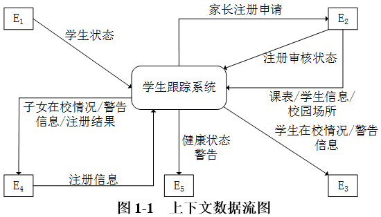
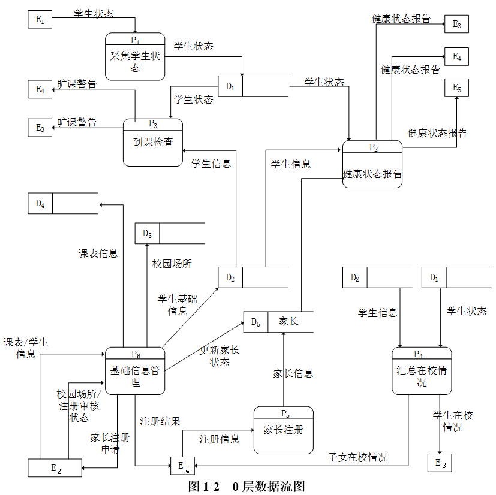
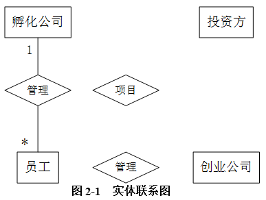
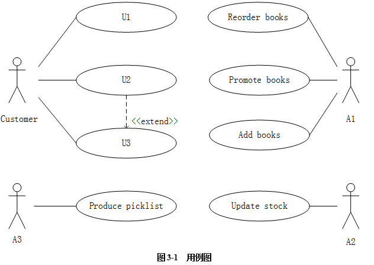
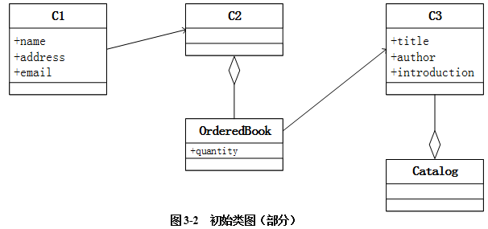
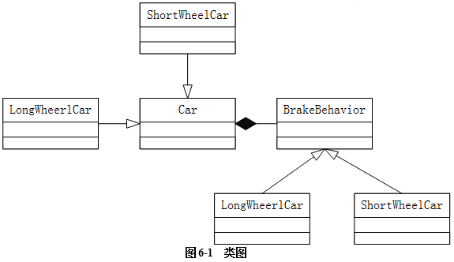

# 2019上半年案例题

- 来源标题: 2019年上半年软件设计师考试应用技术真题（专业解析+参考答案）
- 试卷介绍页: https://wangxiao.xisaiwang.com/tiku2/136/tp340413.html?cid=136
- 练习页: https://wangxiao.xisaiwang.com/tiku2/exam534903402.html
- 题量: 6

## 第1题（案例题）

阅读下列说明和图，回答问题1至问题4，将解答填入答题纸的对应栏内。
【说明】
某学校欲开发一学生跟踪系统，以便更自动化、更全面地对学生在校情况（到课情况和健康状态等）进行管理和追踪，使家长能及时了解子女的到课情况和健康状态，并在有健康问题时及时与医护机构对接。该系统的主要功能是：
（1）采集学生状态。通过学生卡传感器，采集学生心率、体温（摄氏度）等健康指标及其所在位置等信息并记录。每张学生卡有唯一的标识（ID）与一个学生对应。
（2）健康状态告警。在学生健康状态出问题时，系统向班主任、家长和医护机构健康服务系统发出健康状态警告，由医护机构健康服务系统通知相关医生进行处理。
（3）到课检查。综合比对学生状态、课表以及所处校园场所之间的信息对学生到课情况进行判定。对旷课学生，向其家长和班主任发送旷课警告。
（4）汇总在校情况。定期汇总在校情况，并将报告发送给家长和班主任。
（5）家长注册。家长注册使用该系统，指定自己子女，存入家长信息，待审核。
（6）基础信息管理。学校管理人员对学生及其所用学生卡和班主任、课表（班级、上课时间及场所等）、校园场所（名称和所在位置区域）等基础信息进行管理；对家长注册申请进行审核，更新家长状态，将家长ID加入学生信息记录中使家长与其子女进行关联，向家长发送注册结果。一个学生至少有一个家长，可以有多个家长。课表信息包括班级、班主任、时间和位置等。
现采用结构化方法对学生跟踪系统进行分析与设计，获得如图1-1所示的上下文数据流图和图1-2所示的0层数据流图。

### 补充题面

【问题1】（5分）
 使用说明中的词语，给出图1-1中的实体E1〜E5的名称。
【问题2】（4分）
 使用说明中的词语，给出图1-2中的数据存储D1〜D4的名称。
【问题3】（3分）
 根据说明和图中术语，补充图1-2中缺失的数据流及其起点和终点（三条即可）。
【问题4】（3分）
 根据说明中的术语，说明图1-1中数据流“学生状态”和“学生信息”的组成。

## 第2题（案例题）

阅读下列说明，回答问题1至问题3，将解答填入答题纸的对应栏内。
【说明】
某创业孵化基地管理若干孵化公司和创业公司，为规范管理创业项目投资业务，需要开发一个信息系统。请根据下述需求描述完成该系统的数据库设计。
【需求描述】
（1）记录孵化公司和创业公司的信息。孵化公司信息包括公司代码、公司名称、法人代表名称、注册地址和一个电话；创业公司信息包括公司代码、公司名称和一个电话。孵化公司和创业公司的公司代码编码不同。
（2）统一管理孵化公司和创业公司的员工。员工信息包括工号、身份证号、姓名、性别、所属公司代码和一个手机号，工号唯一标识每位员工。
（3）记录投资方信息。投资方信息包括投资方编号、投资方名称和一个电话。
（4）投资方和创业公司之间依靠孵化公司牵线建立创业项目合作关系，具体实施由孵化公司的一位员工负责协调投资方和创业公司的一个创业项目。一个创业项目只属于一个创业公司，但可以接受若干投资方的投资。创业项目信息包括项目编号、创业公司代码、投资方编号和孵化公司员工工号。
【概念模型设计】
根据需求阶段收集的信息，设计的实体联系图（不完整）如图2-1所示。

【逻辑结构设计】
 根据概念模型设计阶段完成的实体联系图，得出如下关系模式（不完整）：
孵化公司（公司代码，公司名称，法人代表名称，注册地址，电话）
创业公司（公司代码，公司名称，电话）
员工（工号，身份证号，姓名，性别， （a），手机号）
投资方（投资方编号、投资方名称，电话）
项目（项目编号，创业公司代码#，（b），孵化公司员工工号#）

### 补充题面

【问题1】（5分）
根据问题描述，补充图2-1的实体联系图。
【问题2】（4分）
补充逻辑结构设计结果中的（a）、（b）两处空缺及完整性约束关系。
【问题3】（6分）
若创业项目的信息还需要包括投资额和投资时间，那么：
（1）是否需要增加新的实体来存储投资额和投资时间？
（2）如果增加新的实体，请给出新实体的关系模式，并对图2-1进行补充。如果不需要增加新的实体，请将“投资额”和“投资时间”两个属性补充连线到图2-1合适的对象上，并对变化的关系模式进行修改 。

## 第3题（案例题）

阅读下列说明和图，回答问题1至问题3，将解答填入答题纸的对应栏内。
【说明】
某图书公司欲开发一个基于Web的书籍销售系统，为顾客（Customer）提供在线购买书籍（Books）的功能，同时对公司书籍的库存及销售情况进行管理。系统的主要功能描述如下：
（1）首次使用系统时，顾客需要在系统中注册（Registerdetail）。顾客填写注册信息表要求的信息，包括姓名（name）、收货地址（address）、电子邮箱（email）等，系统将为其生成一个注册码。
（2）注册成功的顾客可以登录系统在线购买书籍（Buybooks）。购买时可以浏览书籍信息，包括书名（title）、作者（author）、内容简介（introduction）等。如果某种书籍的库存量为0，那么顾客无法查询到该书籍的信息。顾客选择所需购买的书籍及购买数量 （quantities），若购买数量超过库存量，提示库存不足；若购买数量小于库存量，系统将显示验证界面，要求顾客输入注册码。注册码验证正确后，自动生成订单（Order），否则，提示验证错误。如果顾客需要，可以选择打印订单（Printorder）。
（3）派送人员（Dispatcher）每天早晨从系统中获取当日的派送列表信息（Producepicklist），按照收货地址派送顾客订购的书籍。
（4）用于销售的书籍由公司的采购人员（Buyer）进行采购（Reorderbooks）。采购人员每天从系统中获取库存量低于再次订购量的书籍信息，对这些书籍进行再次购买，以保证充足的库存量。新书籍到货时，采购人员向在线销售目录（Catalog）中添加新的书籍信息（Addbooks）。
（5）采购人员根据书籍的销售情况，对销量较低的书籍设置折扣或促销活动（Promotebooks）。
（6）当新书籍到货时，仓库管理员（Warehouseman）接收书籍，更新库存（Updatestock）。
现采用面向对象方法开发书籍销售系统，得到如图3-1所示的用例图和图3-2所示的初始类图（部分）。

### 补充题面

【问题1】（6分）
根据说明中的描述，给出图3-1中A1〜A3所对应的参与者名称和U1〜U3处所对应的用例名称。
【问题2】（6分）
根据说明中的描述，给出图3-1中用例U3的用例描述。（用例描述中必须包括基本事件流和所有的备选事件流）。
【问题3】（3分）
根据说明中的描述，给出图3-2中C1〜C3所对应的类名。

## 第4题（案例题）

阅读下列说明和C代码，回答问题1至问题3，将解答写在答题纸的对应栏内。
【说明】
n皇后问题描述为：在一个n×n的棋盘上摆放n个皇后，要求任意两个皇后不能冲突，即任意两个皇后不在同一行、同一列或者同一斜线上。
算法的基本思想如下：
将第i个皇后摆放在第i行，i从1开始，每个皇后都从第1列开始尝试。尝试时判断在该列摆放皇后是否与前面的皇后有冲突，如果没有冲突，则在该列摆放皇后，并考虑摆放下一个皇后；如果有冲突，则考虑下一列。如果该行没有合适的位置，回溯到上一个皇后，考虑在原来位置的下一个位置上继续尝试摆放皇后，……，直到找到所有合理摆放方案。
【C代码】
下面是算法的C语言实现。
（1）常量和变量说明
n: 皇后数，棋盘规模为n×n
queen[]:  皇后的摆放位置数组， queen[i]表示第i个皇后的位置， 1≤queen[i]≤n
（2）C程序
#include <stdio.h>
#define n 4
int queen[n+1];
void Show(){     /* 输出所有皇后摆放方案 */
         int i;
         printf("(");
         for(i=1;i<=n;i++){
                   printf(" %d",queen[i]);
          }
          printf(")\n");
}
int Place(int j){       /*  检查当前列能否放置皇后，不能放返回0，能放返回1 */
        int i;
        for(i=1;i<j;i++){    /*  检查与已摆放的皇后是否在同一列或者同一斜线上  */
               if(  (   （1）   )  ‖ abs(queen[i]-queen[j]) == (j-i)  )  {
                    return 0;
                }
        }
        return     （2）      ;
}
        void Nqueen(int j){
                 int i;
                 for(i=1;i<=n;i++){
                         queen[j] = i;
                         if(       （3）     ){
                               if(j == n) {      /* 如果所有皇后都摆放好，则输出当前摆放方案 */
                                       Show();
                               } else {          /* 否则继续摆放下一个皇后 */
                                               （4）    ;
                               }
                         }
                  }
}
int main(){
         Nqueen (1);
         return 0;
}

### 补充题面

【问题1】（8分）
根据题干说明，填充C代码中的空（1）〜（4）。
【问题2】（3分）
根据题干说明和C代码，算法采用的设计策略为 （5）。
【问题3】（4分）
当n=4时，有 （6） 种摆放方式，分别为 （7） 。

## 第5题（案例题）

阅读下列说明和Java代码，将应填入（n）处的字句写在答题纸的对应栏内。
【说明】
某软件公司欲开发一款汽车竞速类游戏，需要模拟长轮胎和短轮胎急刹车时在路面上留下的不同痕迹，并考虑后续能模拟更多种轮胎急刹车时的痕迹。现采用策略（Strategy）设计模式来实现该需求，所设计的类图如图5-1所示。

图5-1 类图

### 补充题面

【Java 代码】
import java.util.*;
interface BrakeBehavior  {
        public        （1）        ;
           /*   其余代码省略  */
};
class LongWheelBrake implements BrakeBehavior {
       public void stop() { System.out.println("模拟长轮胎刹车痕迹！ "); }
          /*  其余代码省略 */
};
class ShortWheelBrake implements BrakeBehavior {
          public void stop() { System.out.println("模拟短轮胎刹车痕迹！  "); }
          /* 其余代码省略 */
};
abstract class Car {
       protected           （2）      wheel;
       public  void brake() {          （3）      ; }
       /* 其余代码省略 */
}:
class ShortWheelCar extends Car {
        public ShortWheelCar(BrakeBehavior behavior) {
                     （4）    ;
        }
        /* 其余代码省略 */
};
class StrategyTest{
     public static void main(String[] args) {
          BrakeBehavior brake = new ShortWheelBrake();
          ShortWheelCar car1 = new ShortWheelCar(brake);
          car1.   （5）    ;
      }
}

## 第6题（案例题）

阅读下列说明和C++代码，将应填入（n）处的字句写在答题纸的对应栏内。
【说明】
某软件公司欲开发一款汽车竞速类游戏，需要模拟长轮胎和短轮胎急刹车时在路面上留下的不同痕迹，并考虑后续能模拟更多种轮胎急刹车时的痕迹。现采用策略（Strategy）设计模式来实现该需求，所设计的类图如图6-1所示。
  

### 补充题面

【C++代码】
#include<iostream>
using namespace std;
class BrakeBehavior {
public:
               （1）    ;
          /*  其余代码省略 */
};
class LongWheelBrake：public BrakeBehavior {
public:
         void stop() { cout << "模拟长轮胎刹车痕迹!  " << endl; }
         /*  其余代码省略 */
};
class ShortWheelBrake : public BrakeBehavior {
public:
          void stop() { cout << "模拟短轮胎刹车痕迹!  " << endl; }
           /*  其余代码省略   */
};
class Car {
protected:
        （2）      wheel;
public:
       void brake() {     （3）     ; }
          /*  其余代码省略  */
};
class ShortWheelCar : public Car {
public:
       ShortWheelCar(BrakeBehavior* behavior) {
                   （4）    ;
       }
        /*  其余代码省略  */
};
int main() {
         BrakeBehavior* brake = new ShortWheelBrake();
         ShortWheelCar car1(brake):
         car1.   （5）    ;
         return 0;
}
