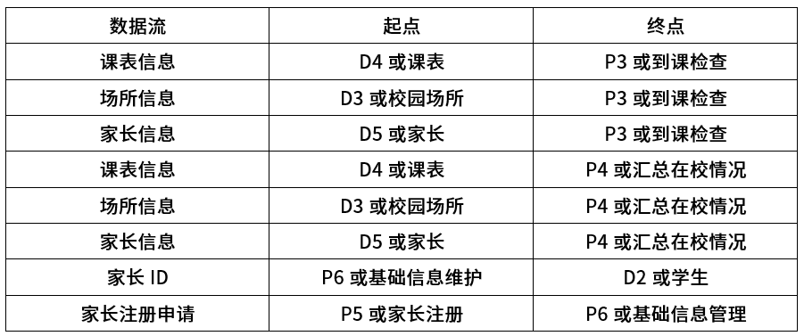
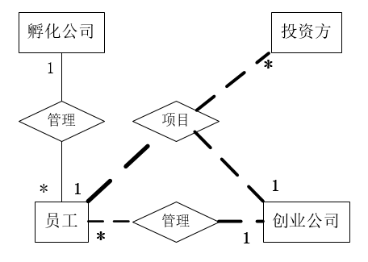
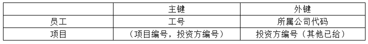
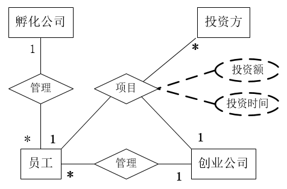
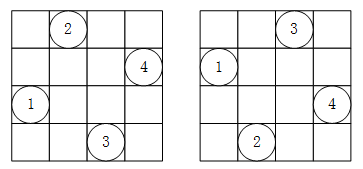

# 2019上半年案例题

- 来源标题: 2019年上半年软件设计师考试应用技术真题（专业解析+参考答案）
- 试卷介绍页: https://wangxiao.xisaiwang.com/tiku2/136/tp340413.html?cid=136
- 练习页: https://wangxiao.xisaiwang.com/tiku2/exam534904371.html
- 题量: 6

## 第1题（案例题）

阅读下列说明和图，回答问题1至问题4，将解答填入答题纸的对应栏内。
【说明】
某学校欲开发一学生跟踪系统，以便更自动化、更全面地对学生在校情况（到课情况和健康状态等）进行管理和追踪，使家长能及时了解子女的到课情况和健康状态，并在有健康问题时及时与医护机构对接。该系统的主要功能是：
（1）采集学生状态。通过学生卡传感器，采集学生心率、体温（摄氏度）等健康指标及其所在位置等信息并记录。每张学生卡有唯一的标识（ID）与一个学生对应。
（2）健康状态告警。在学生健康状态出问题时，系统向班主任、家长和医护机构健康服务系统发出健康状态警告，由医护机构健康服务系统通知相关医生进行处理。
（3）到课检查。综合比对学生状态、课表以及所处校园场所之间的信息对学生到课情况进行判定。对旷课学生，向其家长和班主任发送旷课警告。
（4）汇总在校情况。定期汇总在校情况，并将报告发送给家长和班主任。
（5）家长注册。家长注册使用该系统，指定自己子女，存入家长信息，待审核。
（6）基础信息管理。学校管理人员对学生及其所用学生卡和班主任、课表（班级、上课时间及场所等）、校园场所（名称和所在位置区域）等基础信息进行管理；对家长注册申请进行审核，更新家长状态，将家长ID加入学生信息记录中使家长与其子女进行关联，向家长发送注册结果。一个学生至少有一个家长，可以有多个家长。课表信息包括班级、班主任、时间和位置等。
现采用结构化方法对学生跟踪系统进行分析与设计，获得如图1-1所示的上下文数据流图和图1-2所示的0层数据流图。

### 补充题面

【问题1】（5分）
 使用说明中的词语，给出图1-1中的实体E1〜E5的名称。
【问题2】（4分）
 使用说明中的词语，给出图1-2中的数据存储D1〜D4的名称。
【问题3】（3分）
 根据说明和图中术语，补充图1-2中缺失的数据流及其起点和终点（三条即可）。
【问题4】（3分）
 根据说明中的术语，说明图1-1中数据流“学生状态”和“学生信息”的组成。

### 参考答案

【问题1】（5分）
E1：学生
E2：学校管理人员
E3：班主任
E4：家长
E5：医护机构健康服务系统
【问题2】（4分）
D1：学生状态记录表
D2：学生信息表
D3：校园场所记录表
D4：课表信息记录
【问题3】（3分）

（注：数据流没有顺序要求，按题目要求写出其中3条）
【问题4】（3分）
学生状态=学生卡ID+心率+体温+位置+时间
学生信息=学生ID+学生卡ID+1{家长ID}*+班主任ID+班级

### 解析

【问题1】
根据题干描述，与P1采集学生状态相关的是实体E1即学生；与P5家长注册相关的是实体E4家长；与P4汇总在校情况相关的是实体E4家长与实体E3，即班主任；与P2健康状态告警相关是实体E3班主任、E4家长，以及E5即医护机构健康服务系统；与P6基础信息管理相关的是实体E2即学校管理人员。
【问题2】
“通过学生卡传感器，采集学生心率、体温（摄氏度）等健康指标及其所在位置等信息并记录”记录学生状态信息，即D1学生状态记录表；
“学校管理人员对学生及其所用学生卡和班主任、课表（班级、 上课时间及场所等）、校园场所（名称和所在位置区域）等基础信息进行管理”，即D4课表信息记录，D3校园场所记录，D2学生信息记录。
【问题3】
根据父图与子图平衡判断没有数据流缺失。
综合题干分析，“到课检查。综合比对学生状态、课表以及所处校园场所之间的信息对学生到课情况进行判定。对旷课学生，向其家长和班主任发送旷课警告。”P3到课检查缺失2条数据流入，分别是课表信息、校园场所信息，起点分别是D4、D3，终点是P3。
“对家长注册申请进行审核，更新家长状态，将家长ID加入学生信息记录中使家长与其子女进行关联”此处缺失数据流，家长ID，起点为P6，终点为D2。
【问题4】
“通过学生卡传感器，采集学生心率、体温（摄氏度）等健康指 标及其所在位置等信息并记录。每张学生卡有唯一的标识（ID）与一个学生对应。”，根据题干描述，“学生状态”应该包括学生心率、体温（摄氏度）等健康指标及其所在位置等信息，以及学生卡ID。
“学校管理人员对学生及其所用学生卡和班主任、课表（班级、 上课时间及场所等）…”“将家长ID加入学生信息记录中”根据题干描述，“学生信息”应该包括学生卡、班主任、学生ID等信息。

## 第2题（案例题）

阅读下列说明，回答问题1至问题3，将解答填入答题纸的对应栏内。
【说明】
某创业孵化基地管理若干孵化公司和创业公司，为规范管理创业项目投资业务，需要开发一个信息系统。请根据下述需求描述完成该系统的数据库设计。
【需求描述】
（1）记录孵化公司和创业公司的信息。孵化公司信息包括公司代码、公司名称、法人代表名称、注册地址和一个电话；创业公司信息包括公司代码、公司名称和一个电话。孵化公司和创业公司的公司代码编码不同。
（2）统一管理孵化公司和创业公司的员工。员工信息包括工号、身份证号、姓名、性别、所属公司代码和一个手机号，工号唯一标识每位员工。
（3）记录投资方信息。投资方信息包括投资方编号、投资方名称和一个电话。
（4）投资方和创业公司之间依靠孵化公司牵线建立创业项目合作关系，具体实施由孵化公司的一位员工负责协调投资方和创业公司的一个创业项目。一个创业项目只属于一个创业公司，但可以接受若干投资方的投资。创业项目信息包括项目编号、创业公司代码、投资方编号和孵化公司员工工号。
【概念模型设计】
根据需求阶段收集的信息，设计的实体联系图（不完整）如图2-1所示。

【逻辑结构设计】
 根据概念模型设计阶段完成的实体联系图，得出如下关系模式（不完整）：
孵化公司（公司代码，公司名称，法人代表名称，注册地址，电话）
创业公司（公司代码，公司名称，电话）
员工（工号，身份证号，姓名，性别， （a），手机号）
投资方（投资方编号、投资方名称，电话）
项目（项目编号，创业公司代码#，（b），孵化公司员工工号#）

### 补充题面

【问题1】（5分）
根据问题描述，补充图2-1的实体联系图。
【问题2】（4分）
补充逻辑结构设计结果中的（a）、（b）两处空缺及完整性约束关系。
【问题3】（6分）
若创业项目的信息还需要包括投资额和投资时间，那么：
（1）是否需要增加新的实体来存储投资额和投资时间？
（2）如果增加新的实体，请给出新实体的关系模式，并对图2-1进行补充。如果不需要增加新的实体，请将“投资额”和“投资时间”两个属性补充连线到图2-1合适的对象上，并对变化的关系模式进行修改 。

### 参考答案

【问题1】（5分）

【问题2】（4分）
（a）所属公司代码
（b）投资方编号
完整性约束关系
员工-外键：所属公司代码
项目-主键：（项目编号、投资方编号）组合主键 
项目-外键：
投资方编号，题干已给出外键创业公司编号、孵化公司员工工号  
【问题3】（6分）
（1）不需要
（2）关系模式：项目（项目编号，创业公司代码，投资方编号，孵化公司员工工号，投资额，投资时间）

### 解析

【问题1】
（1）根据题干描述，“统一管理孵化公司和创业公司的员工”，图示给出孵化公司与员工1：*的联系，需要补充创业公司与员工1：*的联系；
（2）根据题干描述，“具体实施由孵化公司的一位员工负责协调投资方和创业公司的一个创业项目。”这里有一个三元联系，联系的实体应该是员工、投资方和创业公司，这个联系就是图示中的“项目”。
对于三元关系的类别判定：
“具体实施由孵化公司的一位员工负责协调投资方和创业公司的一个创业项目，一个创业项目只属于一个创业公司，但可以接受若干投资方的投资。”
根据语义描述，由1位员工协调1个项目和1个创业公司，但1个项目可以接受若干个也就是多个投资方的投资，综上，补充员工、投资方、创业公司三元联系，联系类型为1：*：1。
【问题2】
（a）根据题干描述“员工信息包括工号、身份证号、姓名、性别、所属公司代码和一个手机号，工号唯一标识每位员工。”结合关系模式：
员工（工号，身份证号，姓名，性别， （a），手机号） ，缺少的部分为所属公司代码，其中工号为主键，所属公司代码为孵化公司或创业公司的主键，所以在员工关系中，所属公司代码是外键约束。
（b） 根据题干描述“创业项目信息包括项目编号、创业公司代码、投资方编号和孵化公司员工工号。”结合关系模式：
项目（项目编号，创业公司代码，（b），孵化公司员工工号） ，缺少的部分为投资方编号。根据一般情况，这里的项目编号是针对单个项目而来，又因为“具体实施由孵化公司的一位员工负责协调投资方和创业公司的一个创业项目，一个创业项目只属于一个创业公司，但可以接受若干投资方的投资。”所以本关系中每个创业项目只对应一个创业公司，一个员工协调，但可以对应多个投资方，因此项目关系的主键为（项目编号，投资方编号）组合键。创业公司代码是创业公司主键，投资方编号是投资方主键，孵化公司员工工号是员工主键，因此本关系存在投资方编号、创业公司编号、孵化公司员工工号三个外键。
其他完整性约束：创业公司主键-公司代码；孵化公司主键-公司代码；投资方主键-投资方编号，题目已经用下划线标出。
【问题3】
关系本身可以具有属性，根据题目要求，创业项目的信息还需要包括投资额和投资时间，这些内容可以直接添加到项目关系上，本题项目关系主键为（项目编号，投资方）组合键，可以据此添加投资额和投资时间，因此不需要增加实体，可以直接在项目关系模式中增加这2个属性即可。

## 第3题（案例题）

阅读下列说明和图，回答问题1至问题3，将解答填入答题纸的对应栏内。
【说明】
某图书公司欲开发一个基于Web的书籍销售系统，为顾客（Customer）提供在线购买书籍（Books）的功能，同时对公司书籍的库存及销售情况进行管理。系统的主要功能描述如下：
（1）首次使用系统时，顾客需要在系统中注册（Registerdetail）。顾客填写注册信息表要求的信息，包括姓名（name）、收货地址（address）、电子邮箱（email）等，系统将为其生成一个注册码。
（2）注册成功的顾客可以登录系统在线购买书籍（Buybooks）。购买时可以浏览书籍信息，包括书名（title）、作者（author）、内容简介（introduction）等。如果某种书籍的库存量为0，那么顾客无法查询到该书籍的信息。顾客选择所需购买的书籍及购买数量 （quantities），若购买数量超过库存量，提示库存不足；若购买数量小于库存量，系统将显示验证界面，要求顾客输入注册码。注册码验证正确后，自动生成订单（Order），否则，提示验证错误。如果顾客需要，可以选择打印订单（Printorder）。
（3）派送人员（Dispatcher）每天早晨从系统中获取当日的派送列表信息（Producepicklist），按照收货地址派送顾客订购的书籍。
（4）用于销售的书籍由公司的采购人员（Buyer）进行采购（Reorderbooks）。采购人员每天从系统中获取库存量低于再次订购量的书籍信息，对这些书籍进行再次购买，以保证充足的库存量。新书籍到货时，采购人员向在线销售目录（Catalog）中添加新的书籍信息（Addbooks）。
（5）采购人员根据书籍的销售情况，对销量较低的书籍设置折扣或促销活动（Promotebooks）。
（6）当新书籍到货时，仓库管理员（Warehouseman）接收书籍，更新库存（Updatestock）。
现采用面向对象方法开发书籍销售系统，得到如图3-1所示的用例图和图3-2所示的初始类图（部分）。

### 补充题面

【问题1】（6分）
根据说明中的描述，给出图3-1中A1〜A3所对应的参与者名称和U1〜U3处所对应的用例名称。
【问题2】（6分）
根据说明中的描述，给出图3-1中用例U3的用例描述。（用例描述中必须包括基本事件流和所有的备选事件流）。
【问题3】（3分）
根据说明中的描述，给出图3-2中C1〜C3所对应的类名。

### 参考答案

【问题1】（6分）
A1：采购人员或Buyer
A2：仓库管理员Warehouseman
A3：派送人员或Dispatcher
U1：注册或Registerdetail
U2：打印订单或
Printorder  
U3：购买书籍或Buybooks
【问题2】
U3用例描述
参与者顾客。
主要事件流：
1、顾客登录系统；
2、顾客浏览书籍信息；
3、系统检查某种书籍的库存量是否为0；
4、顾客选择所需购买的书籍及购买数量；
5、系统检查库存量是否足够；
6、系统显示验证界面；
7、顾客输入验证码验证；
8、系统自动生成订单；
备选事件流：
3a. 若库存量为0则无法查询到该书籍信息，退回到2；
5a. 若购买数量超过库存量，则提示库存不足，并退回到4；
7a. 若验证错误，则提示验证错误，并退回到6；
8a. 若顾客需要可以选择打印订单。
前置条件：
1、注册成功。
后置条件：
1、购买成功
【问题3】
C1：顾客或Customer
C2：订单或Order
C3：书籍或Books

### 解析

【问题1】
（1）根据题干描述“用于销售的书籍由公司的采购人员（Buyer）进行采购（Reorderbooks）”，与采购（Reorderbooks）相关的参与者是采购人员（Buyer），因此A1为采购人员或Buyer；
（2）根据题干描述“当新书籍到货时，仓库管理员（Warehouseman）接收书籍，更新库存（Update stock）。”，与更新库存（Updatestock）相关的参与者是仓库管理员（Warehouseman），因此A2为仓库管理员或Warehouseman；
（3）根据题干描述“派送人员（Dispatcher）每天早晨从系统中获取当日的派送列表信息（Producepicklist）”，与Producepicklist相关的参与者是派送人员（Dispatcher），因此A3为派送人员或Dispatcher；
（4）根据题干描述“（1）首次使用系统时，顾客需要在系统中注册（Registerdetail）。顾客填写注册信息表要求的信息，包括姓名（name）、收货地址（address）、电子邮箱（email）等，系统将为其生成一个注册码。”这里有顾客相关用例注册（Registerdetail）。
根据题干描述“（2）注册成功的顾客可以登录系统在线购买书籍（Buybooks）。购买时可以浏览书籍信息，包括书名（title）、作者（author）、内容简介（introduction）等。如果某种书籍的库存量为0，那么顾客无法查询到该书籍的信息。顾客选择所需购买的书籍及购买数量 （quantities），若购买数量超过库存量，提示库存不足；若购买数量小于库存量，系统将显示验证界面，要求顾客输入注册码。注册码验证正确后，自动生成订单（Order），否则， 提示验证错误。如果顾客需要，可以选择打印订单（Printorder）。”这里有顾客相关用例在线购买书籍（Buybooks）、打印订单（Printorder），并且这里提到如果顾客需要，可以选择打印订单，可以知道打印订单（Printorder）是在线购买书籍（Buybooks）在某个条件下的扩展。打印订单（Printorder）是在线购买书籍（Buy books）的扩展，体现在图示当中，<<extend>>箭头指向基用例在线购买书籍（Buybooks）即U3，<<extend>>箭头流出端为扩展用例打印订单（Printorder）即U2，注意箭头指向的区别。
U1与其他用例没有相关关系，即U1为注册（Registerdetail）。
【问题2】
当用例图不能提供用例所具有的全部信息，需要使用文字描述那些不能反映在图形上的信息。用例描述是加上关于参与者和系统如何交互的规格说明，在编写用例描述的时候，应该只注重外部能力，不涉及内部细节。一般用例描述包括以下内容：
1.目的： 简要描述系统的最终任务和结果 。
2.事件流：
（1）说明用例是怎么启动的，那些参与者在什么情况下启动执行用例；
（2）说明参与者和用例之间的信息处理过程；
（3）说明用例在不同的条件下，可以选择执行的多种方案；
（4）说明用例在什么情况下才能被视作完成，完成时结果传给参与者；
基本流说明了参与者和系统之间的相互交互或对话的顺序，当这种交互完成后，参与者便实现了预期目的；可选流程也可以促进成功的完成任务，但它们代表了任务的细节或用于完成任务的途径的变化部分。
3.特殊要求：说明此用例的特殊要求。
4.前提条件：说明此例的前提条件。
5.后置条件：用例执行结束后，结果应该传给说明参与者。
本题用例描述可以大致概括为：
参与者顾客。
主要事件流：
1、顾客登录系统；
2、顾客浏览书籍信息；
3、系统检查某种书籍的库存量是否为0；
4、顾客选择所需购买的书籍及购买数量；
5、系统检查库存量是否足够；
6、系统显示验证界面；
7、顾客输入验证码验证；
8、系统自动生成订单。
备选事件流：
3a. 若库存量为0则无法查询到该书籍信息，退回到2；
5a. 若购买数量超过库存量，则提示库存不足，并退回到4；
7a. 若验证错误，则提示验证错误，并退回到6；
8a. 若顾客需要可以选择打印订单。
【由于本题用例给出的并不详细，没有给出登录用例等内容，所有描述都在购买书籍用例描述当中，所以这里也就没有给出前置条件和后置条件，将所有内容都放在了主要事件流当中。此处答案不唯一。】
【问题3】
（1）根据题干描述“顾客填写注册信息表要求的信息，包括姓名（name）、收货地址（address）、电子邮箱（email）等”，包含name、address、email属性的类应该是顾客，即C1：顾客或Customer；
（2）根据题干描述“购买时可以浏览书籍信息，包括书名（title）、作者（author）、内容简介（introduction）等”，包含title、author、introduction属性的类应该是书籍，即C3：书籍或Books；
（3）根据图示OrderedBook类即已订购的书籍类，与顾客相关的类，并且是已订购书籍的整体，所以C2应该是生成的订单，列出已订购书籍，并且与顾客有依赖关系，即C2：订单或Order。

## 第4题（案例题）

阅读下列说明和C代码，回答问题1至问题3，将解答写在答题纸的对应栏内。
【说明】
n皇后问题描述为：在一个n×n的棋盘上摆放n个皇后，要求任意两个皇后不能冲突，即任意两个皇后不在同一行、同一列或者同一斜线上。
算法的基本思想如下：
将第i个皇后摆放在第i行，i从1开始，每个皇后都从第1列开始尝试。尝试时判断在该列摆放皇后是否与前面的皇后有冲突，如果没有冲突，则在该列摆放皇后，并考虑摆放下一个皇后；如果有冲突，则考虑下一列。如果该行没有合适的位置，回溯到上一个皇后，考虑在原来位置的下一个位置上继续尝试摆放皇后，……，直到找到所有合理摆放方案。
【C代码】
下面是算法的C语言实现。
（1）常量和变量说明
n: 皇后数，棋盘规模为n×n
queen[]:  皇后的摆放位置数组， queen[i]表示第i个皇后的位置， 1≤queen[i]≤n
（2）C程序
#include <stdio.h>
#define n 4
int queen[n+1];
void Show(){     /* 输出所有皇后摆放方案 */
         int i;
         printf("(");
         for(i=1;i<=n;i++){
                   printf(" %d",queen[i]);
          }
          printf(")\n");
}
int Place(int j){       /*  检查当前列能否放置皇后，不能放返回0，能放返回1 */
        int i;
        for(i=1;i<j;i++){    /*  检查与已摆放的皇后是否在同一列或者同一斜线上  */
               if(  (   （1）   )  ‖ abs(queen[i]-queen[j]) == (j-i)  )  {
                    return 0;
                }
        }
        return     （2）      ;
}
        void Nqueen(int j){
                 int i;
                 for(i=1;i<=n;i++){
                         queen[j] = i;
                         if(       （3）     ){
                               if(j == n) {      /* 如果所有皇后都摆放好，则输出当前摆放方案 */
                                       Show();
                               } else {          /* 否则继续摆放下一个皇后 */
                                               （4）    ;
                               }
                         }
                  }
}
int main(){
         Nqueen (1);
         return 0;
}

### 补充题面

【问题1】（8分）
根据题干说明，填充C代码中的空（1）〜（4）。
【问题2】（3分）
根据题干说明和C代码，算法采用的设计策略为 （5）。
【问题3】（4分）
当n=4时，有 （6） 种摆放方式，分别为 （7） 。

### 参考答案

【问题1】
（1）queen[i]==queen[j]或其等价形式
（2）1
（3）Place(j)或其等价形式
（4）Nqueen(j+1)
【问题2】
（5）回溯法
【问题3】
（6）2
（7）（2413）或（2,4,1,3）
（3142）或（3,1,4,2）

### 解析

【问题1】
（1）第一空根据代码上下文：
  for(i=1;i<j;i++){    /*  检查与已摆放的皇后是否在同一列或者同一斜线上  */
               if(   （1）   )  ‖ abs(queen[i]-queen[j]) == (j-i))  {
                    return 0;
                }
        }  
abs(queen[i]-queen[j]) == (j-i) 判断是否在同一斜线上，此处还缺少对同一列的判断，即 queen[i]==queen[j]或其等价形式。
（2）第二空根据 Place(int j)函数首行注释：
    int Place(int j){       /*  检查当前列能否放置皇后，不能放返回0，能放返回1 */
此处是成功后的返回，返回值应该是1。
（3）第三空根据代码上下文
  if(       （3）     ){
                               if(j == n) {      /* 如果所有皇后都摆放好，则输出当前摆放方案 */
                                       Show();
                               } else {          /* 否则继续摆放下一个皇后 */
                                               （4）    ;
                               }
                         }  
（3）与j==n结合可以判断所有皇后都摆好，（3）与j!=n结合可以判断继续摆放下一个皇后，即前面的皇后已摆放好。
所以（3）的判断条件应该是摆放函数Place()返回值为1，即（3）Place(j)或其等价形式。
（4）第四空填写摆放下一个皇后，即（4）Nqueen(j+1)。
【问题2】
根据题干描述“如果该行没有合适的位置，回溯到上一个皇后，考虑在原来位置的下一个位置上继续尝试摆放皇后”，本题采用的是回溯法的设计策略。
【问题3】
当n=4时，可以有2种摆放方式，如下所示：

即（2413）（3142）。

## 第5题（案例题）

阅读下列说明和Java代码，将应填入（n）处的字句写在答题纸的对应栏内。
【说明】
某软件公司欲开发一款汽车竞速类游戏，需要模拟长轮胎和短轮胎急刹车时在路面上留下的不同痕迹，并考虑后续能模拟更多种轮胎急刹车时的痕迹。现采用策略（Strategy）设计模式来实现该需求，所设计的类图如图5-1所示。

图5-1 类图

### 补充题面

【Java 代码】
import java.util.*;
interface BrakeBehavior  {
        public        （1）        ;
           /*   其余代码省略  */
};
class LongWheelBrake implements BrakeBehavior {
       public void stop() { System.out.println("模拟长轮胎刹车痕迹！ "); }
          /*  其余代码省略 */
};
class ShortWheelBrake implements BrakeBehavior {
          public void stop() { System.out.println("模拟短轮胎刹车痕迹！  "); }
          /* 其余代码省略 */
};
abstract class Car {
       protected           （2）      wheel;
       public  void brake() {          （3）      ; }
       /* 其余代码省略 */
}:
class ShortWheelCar extends Car {
        public ShortWheelCar(BrakeBehavior behavior) {
                     （4）    ;
        }
        /* 其余代码省略 */
};
class StrategyTest{
     public static void main(String[] args) {
          BrakeBehavior brake = new ShortWheelBrake();
          ShortWheelCar car1 = new ShortWheelCar(brake);
          car1.   （5）    ;
      }
}

### 参考答案

（1）void stop()
（2）BrakeBehavior
（3）wheel.stop()
（4）wheel=behavior
（5）brake()

### 解析

策略模式是定义一系列算法，把它们一个个封装起来，并且使它们之间可相互替换，从而让算法可以独立于使用它的用户而变化。  
（1）第一空接口BrakeBehavior有内容缺失，结合其实现类LongWheelBrake代码如下：
class LongWheelBrake implements BrakeBehavior {
       public void stop() { System.out.println("模拟长轮胎刹车痕迹！ "); }
          /*  其余代码省略 */
};
第一空需要补充stop()方法，即（1）void stop()
（2）（3）第二、三空是抽象类Car缺少属性wheel的类型和brake()方法的方法体。
abstract class Car {
       protected           （2）      wheel;
       public  void brake() {          （3）      ; }
       /* 其余代码省略 */
}:
根据图示策略模式，Car与BrakeBehavior 是整体与部分的关系，因此Car的属性有这一个部分，即（2）BrakeBehavior ，这里在类Car中，命名了一个与之联系的部分BrakeBehavior 类型wheel。对于BrakeBehavior 类，所包含的方法是stop，因此第（3）空填写的方法应该是wheel.stop()。这样就将Car与BrakeBehavior 联系起来了。
（4）第四空是实现子类ShortWheelCar缺失ShortWheelCar(BrakeBehavior behavior)此带参构造方法的方法体：
class ShortWheelCar extends Car {
        public ShortWheelCar(BrakeBehavior behavior) {
                     （4）    ;
        }
        /* 其余代码省略 */
};    
构造方法是对类的构造，带参构造函数一般是对其属性进行参数赋值，第四空将实现子类与其父类联系起来，子类继承父类属性wheel，此处应该是对参数wheel赋值，即（4）wheel=behavior
（5）第五空是实际调用测试过程，缺失方法名：
class StrategyTest{
     public static void main(String[] args) {
          BrakeBehavior brake = new ShortWheelBrake();
          ShortWheelCar car1 = new ShortWheelCar(brake);
          car1.         （5）    ;
      }
}    
由代码可知，car1是ShortWheelCar(brake)实例化的对象，类ShortWheelCar本身没有方法，只有默认继承父类的一个方法brake()，因此此处调用的是brake()，即（5）brake()。

## 第6题（案例题）

阅读下列说明和C++代码，将应填入（n）处的字句写在答题纸的对应栏内。
【说明】
某软件公司欲开发一款汽车竞速类游戏，需要模拟长轮胎和短轮胎急刹车时在路面上留下的不同痕迹，并考虑后续能模拟更多种轮胎急刹车时的痕迹。现采用策略（Strategy）设计模式来实现该需求，所设计的类图如图6-1所示。
  

### 补充题面

【C++代码】
#include<iostream>
using namespace std;
class BrakeBehavior {
public:
               （1）    ;
          /*  其余代码省略 */
};
class LongWheelBrake：public BrakeBehavior {
public:
         void stop() { cout << "模拟长轮胎刹车痕迹!  " << endl; }
         /*  其余代码省略 */
};
class ShortWheelBrake : public BrakeBehavior {
public:
          void stop() { cout << "模拟短轮胎刹车痕迹!  " << endl; }
           /*  其余代码省略   */
};
class Car {
protected:
        （2）      wheel;
public:
       void brake() {     （3）     ; }
          /*  其余代码省略  */
};
class ShortWheelCar : public Car {
public:
       ShortWheelCar(BrakeBehavior* behavior) {
                   （4）    ;
       }
        /*  其余代码省略  */
};
int main() {
         BrakeBehavior* brake = new ShortWheelBrake();
         ShortWheelCar car1(brake):
         car1.   （5）    ;
         return 0;
}

### 参考答案

（1）virtual void stop()=0
（2）BrakeBehavior*
（3）wheel->stop()
（4）wheel=behavior
（5）brake()

### 解析

策略模式是定义一系列算法，把它们一个个封装起来，并且使它们之间可相互替换，从而让算法可以独立于使用它的用户而变化。  
（1）第一空类BrakeBehavior有内容缺失，结合其实现类LongWheelBrake代码如下：
class LongWheelBrake：public BrakeBehavior {
public:
         void stop() { cout << "模拟长轮胎刹车痕迹!  " << endl; }
         /*  其余代码省略 */
};  
第一空需要补充stop()方法，即（1）virtual void stop()=0
（2）（3）第二、三空是抽象类Car缺少属性wheel的类型和brake()方法的方法体。
class Car {
protected:
        （2）      wheel;
public:
       void brake() {     （3）     ; }
          /*  其余代码省略  */
};  
根据图示策略模式，Car与BrakeBehavior 是整体与部分的关系，因此Car的属性有这一个部分，即（2）BrakeBehavior *，这里在类Car中，命名了一个与之联系的部分BrakeBehavior* 类型wheel。对于BrakeBehavior 类，所包含的方法是stop，因此第（3）空填写的方法应该是
wheel->stop()  。这样就将Car与BrakeBehavior 联系起来了。
（4）第四空是实现子类ShortWheelCar缺失
ShortWheelCar(BrakeBehavior* behavior)   此带参构造方法的方法体：
class ShortWheelCar : public Car {
public:
       ShortWheelCar(BrakeBehavior* behavior) {
                   （4）    ;
       }
        /*  其余代码省略  */
};  
构造方法是对类的构造，带参构造函数一般是对其属性进行参数赋值，第四空将实现子类与其父类联系起来，子类继承父类属性wheel，此处应该是对参数wheel赋值，即（4）wheel=behavior
（5）第五空是实际调用测试过程，缺失方法名：
int main() {
         BrakeBehavior* brake = new ShortWheelBrake();
         ShortWheelCar car1(brake):
         car1.   （5）    ;
         return 0;
}　  
由代码可知，car1是ShortWheelCar实例化的对象，类ShortWheelCar本身没有方法，只有默认继承父类的一个方法brake()，因此此处调用的是brake()，即（5）brake()。
