# 2019上半年选择题

- 来源标题: 2019年上半年软件设计师考试基础知识真题（专业解析+参考答案）
- 试卷介绍页: https://wangxiao.xisaiwang.com/tiku2/136/tp340099.html?cid=136
- 练习页: https://wangxiao.xisaiwang.com/tiku2/exam534904374.html
- 题量: 61

## 第1题（单选题）

计算机执行指令的过程中，需要由（A）产生每条指令的操作信号并将信号送往相应的部件进行处理，以完成指定的操作。

- A. CPU的控制器
- B. CPU的运算器
- C. DMA控制器
- D. Cache控制器

### 正确答案

A

### 解析

本题考查计算机系统基础知识。
CPU的操作控制功能：一条指令功能的实现需要若干操作信号配合来完成，CPU产生每条指令的操作信号并将其送往对应的部件，控制相应的部件按指令的功能进行操作。
CPU的运算器只能完成运算，而控制器用于控制整个CPU的工作。
DMA（Direct Memory Access）控制器是一种在系统内部转移数据的独特外设，可以将其视为一种能够通过一组专用总线将内部和外部存储器与每个具有DMA能力的外设连接起来的控制器。  
cache控制器是用来控制cache的，它将主存中的数据或代码自动拷贝到cache存储器中。
BCD不符合题干要求，本题选择A选项。

## 第2题（单选题）

DMA控制方式是在（C）之间直接建立数据通路进行数据的交换处理。

- A. CPU与主存
- B. CPU与外设
- C. 主存与外设
- D. 外设与外设

### 正确答案

C

### 解析

本题考查计算机系统基础知识。
直接主存存取（Direct Memory Access，DMA）是指数据在主存与I/O设备间（即主存与外设之间）直接成块传送。
CPU与外设之间是程序直接控制传送方式。CPU与主存之间是总线，外设不直接与其他外设进行数据交换。
ABD描述错误，本题选择C选项。

## 第3题（单选题）

CPU访问存储器时，被访问数据一般聚集在一个较小的连续存储区域中。若一个存储单元已被访问，则其邻近的存储单元有可能还要被访问，该特性被称为（C）。

- A. 数据局部性
- B. 指令局部性
- C. 空间局部性
- D. 时间局部性

### 正确答案

C

### 解析

本题考查计算机系统基础知识。
程序的局限性表现在时间局部性和空间局部性：
（1）时间局部性是指如果程序中的某条指令一旦被执行，则不久的将来该指令可能再次被执行；
（2）空间局部性是指一旦程序访问了某个存储单元，则在不久的将来，其附近的存储单元也最有可能被访问。
数据局部性：刚刚被访问过的结点，极有可能在不久之后再次被访问到；将被访问的下一结点，极有可能处于不久之前被访问过的某个结点的附近；
指令局部性：指令在短时间内会被多次读取，其附近的指令也会被多次读取。
ABD不符合题干描述，本题选择C选项。

## 第4题（单选题）

某系统由3个部件构成，每个部件的千小时可靠度都为R，该系统的千小时可靠度为（1-（1-R）²）R,则该系统的构成方式是（C）。

- A. 3个部件串联
- B. 3个部件并联
- C. 前两个部件并联后与第三个部件串联
- D. 第一个部件与后两个部件并联构成的子系统串联

### 正确答案

C

### 解析

本题考查计算机系统基础知识。
A选项可靠度为R×R×R；
B选项可靠度为1-（1-R）×（1-R）×（1-R）；
C选项可靠度为（1-（1-R）×（1-R））×R；
D选项可靠度为R×（1-（1-R）×（1-R））。
ABD描述错误，本题选择C选项。

## 第5题（单选题）

在（D）校验方法中，采用模2运算来构造校验位。

- A. 水平奇偶
- B. 垂直奇偶
- C. 海明码
- D. 循环冗余

### 正确答案

D

### 解析

本题考查计算机系统校验码相关知识。
采用模二除法运算的只有循环冗余检验CRC。
奇偶校验是一种通过增加冗余位使得码字中“1”的个数恒为奇数个或者偶数个的编码方式。包括水平奇偶校验、垂直奇偶校验、
水平垂直奇偶校验。
海明码的检错、纠错是将有效信息按某种规律分成若干组，每组安排一个校验位进行奇偶性测试，然后产生多位检测信息，并从中得出具体的出错位置，最后通过对错误位取反来将其纠正。  
ABC描述错误，本题选项D选项。

## 第6题（单选题）

以下关于RISC（精简指令系统计算机）技术的叙述中，错误的是（B）。

- A. 指令长度固定、指令种类尽量少
- B. 指令功能强大、寻址方式复杂多样
- C. 增加寄存器数目以减少访存次数
- D. 用硬布线电路实现指令解码，快速完成指令译码

### 正确答案

B

### 解析

本题考查计算机指令系统相关知识。
RISC寻址方式比较单一，多寄存器寻址，B选项描述错误，ACD描述正确，本题选择B选项。

## 第7题（单选题）

（B）防火墙是内部网和外部网的隔离点，它可对应用层的通信数据流进行监控和过滤。

- A. 包过滤
- B. 应用级网关
- C. 数据库
- D. Web

### 正确答案

B

### 解析

本题考查防火墙的基础知识。
包过滤防火墙：包过滤防火墙一般有一个包检查块（通常称为包过滤器），数据包过滤可以根据数据包头中的各项信息来控制站点与站点、站点与网络、网络与网络之间的相互访问，但无法控制传输数据的内容，因为内容是应用层数据，而包过滤器处在网络层和数据链路层之间，不符合本题要求。
应用级网关防火墙：应用代理网关防火墙彻底隔断内网与外网的直接通信，内网用户对外网的访问变成防火墙对外网的访问，然后再由防火墙转发给内网用户。所有的通信都必须经应用层代理软件转发，它可对应用层的通信数据流进行监控和过滤。
数据库防火墙：数据库防火墙技术是针对关系型数据库保护需求应运而生的一种数据库安全主动防御技术，数据库防火墙部署于应用服务器和数据库之间，不符合本题要求。
Web防火墙：Web防火墙是入侵检测系统，入侵防御系统的一种。从广义上来说，Web应用防火墙就是应用级的网站安全综合解决方案，与我们所讲到的防火墙概念有一定区别，不符合本题要求。
本题选择B选项。

## 第8题（单选题）

下述协议中与安全电子邮箱服务无关的是（C）。

- A. SSL
- B. HTTPS
- C. MIME
- D. PGP

### 正确答案

C

### 解析

本题考查安全电子邮箱服务相关基础知识。
MIME它是一个互联网标准，扩展了电子邮件标准，使其能够支持，与安全无关。与安全电子邮件相关的是S/MIME安全多用途互联网邮件扩展协议。
A选项SSL和B选项HTTPS涉及邮件传输过程的安全，D选项PGP（全称：Pretty Good Privacy，优良保密协议），是一套用于信息加密、验证的应用程序，可用于加密电子邮件内容。

## 第9题（单选题）

用户A和B要进行安全通信，通信过程需确认双方身份和消息不可否认。A和B通信时可使用（A/D）来对用户的身份进行认证；使用（  ）确保消息不可否认。

### 问题1
- A. 数字证书
- B. 消息加密
- C. 用户私钥
- D. 数字签名
### 问题2
- A. 数字证书
- B. 消息加密
- C. 用户私钥
- D. 数字签名

### 正确答案

A、D

### 解析

本题考查数字签名方面相关知识。
第一空考查的是关于用户身份进行认证也就是数字签名的认证，这里使用的应该是发送方的公钥，这4个选项中，能包含发送方公钥的只有A选项数字证书；
第二空确保消息不可否认，也就是考查确保发送者身份的不可抵赖，所以这里使用的应该是发送方的数字签名。
消息加密是利用数学或物理手段，对电子信息在传输过程中和存储体内进行保护，以防止泄露的技术。
用户私钥：公钥与私钥是通过加密算法得到的一个密钥对（即一个公钥和一个私钥，也就是非对称加密方式）。公钥可对会话进行加密、验证数字签名，只有使用对应的私钥才能解密会话数据，从而保证数据传输的安全性。公钥是密钥对外公开的部分，私钥则是非公开的部分，由用户自行保管。
本题选择A、D选项

## 第10题（单选题）

震网（Stuxnet）病毒是一种破坏工业基础设施的恶意代码，利用系统漏洞攻击工业控制系统，是一种危害性极大的（D）。

- A. 引导区病毒
- B. 宏病毒
- C. 木马病毒
- D. 蠕虫病毒

### 正确答案

D

### 解析

本试题考查计算机病毒相关知识。
震网（Stuxnet），指一种蠕虫病毒。它的复杂程度远超一般电脑黑客的能力。这种震网（Stuxnet）病毒于2010年6月首次被检测出来，是第一个专门定向攻击真实世界中基础（能源）设施的“蠕虫”病毒，比如核电站，水坝，国家电网。
A选项引导区病毒破坏的是引导盘、文件目录等，B选项宏病毒破坏的是OFFICE文件相关，C选项木马的作用一般强调控制操作。

## 第11题（单选题）

刘某完全利用任职单位的实验材料、实验室和不对外公开的技术资料完成了一项发明。以下关于该发明的权利归属的叙述中，正确的是（B）。

- A. 无论刘某与单位有无特别约定，该项成果都属于单位
- B. 原则上应归单位所有，但若单位与刘某对成果的归属有特别约定时遵从约定
- C. 取决于该发明是否是单位分派给刘某的
- D. 无论刘某与单位有无特别约定，该项成果都属于刘某

### 正确答案

B

### 解析

本题考查知识产权相关知识。
这里的B选项描述更为严谨，A选项太过绝对。
C、D项描述有误，原则上是属于单位，有约定按照约定。
本题选择B选项

## 第12题（单选题）

甲公司购买了一工具软件，并使用该工具软件开发了新的名为“恒友”的软件。 甲公司在销售新软件的同时，向客户提供工具软件的复制品，则该行为（A/B）。甲公司未对“恒友”软件注册商标就开始推向市场，并获得用户的好评。三个月后，乙公司也推出名为“恒友”的类似软件，并对之进行了商标注册，则其行为（  ）。

### 问题1
- A. 侵犯了著作权
- B. 不构成侵权行为
- C. 侵犯了专利权
- D. 属于不正当竞争
### 问题2
- A. 侵犯了著作权
- B. 不构成侵权行为
- C. 侵犯了商标权
- D. 属于不正当竞争

### 正确答案

A、B

### 解析

本题考查知识产权相关知识。
第一空，软件申请专利是需要满足条件的，一般是申请软件著作权。这里涉及向客户提供工具软件的复制品，这里侵犯了工具软件的著作权，而不是侵犯专利权。
不正当竞争行为包括混淆行为、商业贿赂、虚假宣传、侵犯商业秘密、倾销、不正当有奖销售和诋毁商誉，这里不涉及。
第二空，甲公司没有注册商标，对于未注册的，并不提供保护，不构成侵权，本题选B。

## 第13题（单选题）

数据流图建模应遵循（B）的原则。

- A. 自顶向下、从具体到抽象
- B. 自顶向下、从抽象到具体
- C. 自底向上、从具体到抽象
- D. 自底向上、从抽象到具体

### 正确答案

B

### 解析

本题考查数据流图建模相关知识。
数据流图是结构化分析的工具，结构化方法就是采用自顶向下逐层分解的思想进行分析建模的。随着分解层次的增加，抽象的级别也越来越低，即越来越接近问题的解。数据流图建模应遵循：自顶向下、从抽象到具体的原则。ACD描述有误。

## 第14题（单选题）

结构化设计方法中使用结构图来描述构成软件系统的模块以及这些模块之间的调用关系。结构图的基本成分不包括（D）。

- A. 模块
- B. 调用
- C. 数据
- D. 控制

### 正确答案

D

### 解析

本题考查结构化分析与设计的基础知识。
模块结构图由模块、调用、数据、控制信息和转接符号5种基本符号组成。
模块：这里所说的模块通常是指用一个名字就可以调用的一段程序语句。在模块结构图中用矩形表示。
调用：模块结构图中箭头总是由调用模块指向被调用模块。
数据：当一个模块调用另一个模块时，调用模块可以把数据传送到被调用模块供处理，而被调用模块又可以将处理的结果送回到调用模块。在模块之间传送的数据，使用与调用箭头平行的带空心圆的箭头表示，并在旁边标上数据名。
控制信息：在模块间有时必须传送某些控制信息。控制信息与数据的主要区别是前者只反映数据的某种状态，不必进行处理。
控制信息与控制成分并不等价。软设在程序设计语言中提到的语言控制成分。控制成分指明语言允许表述的控制结构，程序员使用控制成分来构造程序中的控制逻辑。理论上已经证明，可计算问题的程序都可以用顺序、选择和循环这3种控制结构来描述。
转接符号：当模块结构图在一张纸上画不下，需要转接到另一张纸上，或者为了避免图上线条交叉时，都可以使用转接符号，圆圈内加上标号。
本题选择D选项。

## 第15题（单选题）

10个成员组成的开发小组，若任意两人之间都有沟通路径，则一共有（D）条沟通路径。

- A. 100
- B. 90
- C. 50
- D. 45

### 正确答案

D

### 解析

本题考查软件项目管理相关知识。
题干中描述任意两人之间都有沟通路径，那么A1与A2、A3、…、A10之间存在9条沟通路径，A2与A1沟通路径已计算，与A3、A4、…、A10之间有8条沟通路径，依次类推，总的沟通路径数为9+8+7+6+5+4+3+2+1=(9+1)×4+5=45条沟通路径。
也可直接利用无主程序员模式沟通路径计算的公式，n×(n-1)/2=45。
本题答案选择D选项。

## 第16题（单选题）

某项目的活动持续时间及其依赖关系如下表所示，则完成该项目的最少时间为 （D）天。
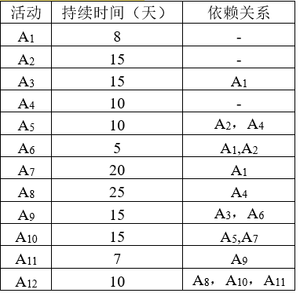

- A. 43
- B. 45
- C. 50
- D. 55

### 正确答案

D

### 解析

本题考查软件项目管理中进度管理相关知识。
根据表格能够画出进度网络图如下所示：
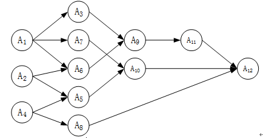
据此分析每个活动的最早开始和最早完成时间如下所示：
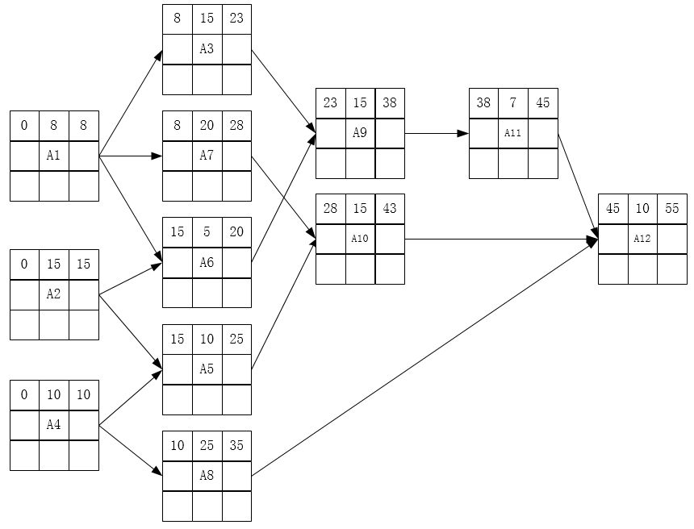
综上，完成该项目的最少时间即项目工期为55天。
本题选择D选项。

## 第17题（单选题）

以下不属于软件项目风险的是（A）。

- A. 团队成员可以进行良好沟通
- B. 团队成员离职
- C. 团队成员缺乏某方面培训
- D. 招不到符合项目技术要求的团队成员

### 正确答案

A

### 解析

本题考查软件项目管理中风险管理相关知识。
一般认为软件风险包含两个特性：不确定性和损失。不确定性是指风险可能发生也可能不发生；损失是指如果风险发生，就会产生恶性后果。
A选项可以进行良好的沟通不满足软件风险的损失特性。
BCD都可能造成损失，属于风险。
本题选择A选项

## 第18题（单选题）

通用的高级程序设计语言一般都会提供描述数据、运算、控制和数据传输的语言成分，其中，控制包括顺序、（A）和循环结构。

- A. 选择
- B. 递归
- C. 递推
- D. 函数

### 正确答案

A

### 解析

本题考查程序语言基础知识。
程序设计语言的基本成分包括数据、运算、控制和传输等。
程序设计语言的控制成分包括顺序、选择和循环3种结构。
B项递归和C项递推属于算法。
D项函数是一个固定的一个程序段，或称其为一个子程序。
因此，BCD描述与题意不符，本题选择A选项。

## 第19题（单选题）

以编译方式翻译C/C++源程序的过程中，（C）阶段的主要任务是对各条语句的结构进行合法性分析。

- A. 词法分析
- B. 语义分析
- C. 语法分析
- D. 目标代码生成

### 正确答案

C

### 解析

本题考查程序语言基础知识。
词法分析阶段依据语言的词法规则，对源程序进行逐个字符地扫描，从中识别出一个个“单词”符号，主要是针对词汇的检查。
语法分析的任务是在词法分析的基础上，根据语言的语法规则将单词符号序列分解成各类语法单位，如“表达式”“语句”和“程序”等。语法规则就是各类语法单位的构成规则，主要是针对结构的检查。
语义分析阶段分析各语法结构的含义，检查源程序是否包含语义错误，主要是针对句子含义的检查。
目标代码生成是编译的最后一个阶段。目标代码生成器把语法分析后或优化后的中间代码变换成目标代码。  
本题描述的是语法分析， ABD描述与题意不符，本题选择C选项。

## 第20题（单选题）

在对高级语言源程序进行编译或解释处理的过程中，需要不断收集、记录和使用源程序中一些相关符号的类型和特征等信息，并将其存入（B）中。

- A. 哈希表
- B. 符号表
- C. 堆栈
- D. 队列

### 正确答案

B

### 解析

本题考查程序语言基础知识。
符号表在编译程序工作的过程中需要不断收集、记录和使用源程序中一些语法符号的类型和特征等相关信息。这些信息一般以表格形式存储于系统中。
哈希表是根据关键码值(Key value)而直接进行访问的数据结构。
堆栈是一种只能在一端进行插入和删除操作的特殊线性表，它按照后进先出的原则存储数据的数据结构。
队列允许在表的前端（front）进行删除操作，而在表的后端（rear）进行插入操作，和栈一样，队列是一种操作受限制的线性表。

## 第21题（单选题）

在单处理机系统中，采用先来先服务调度算法。系统中有4个进程P1、P2、P3、P4（假设进程按此顺序到达），其中P1为运行状态，P2为就绪状态，P3和P4为等待状态，且P3等待打印机，P4等待扫描仪。若P1 （A/C），则P1、P2、P3和P4的状态应分别为（  ）。

### 问题1
- A. 时间片到
- B. 释放了扫描仪
- C. 释放了打印机
- D. 已完成
### 问题2
- A. 等待、就绪、等待和等待
- B. 运行、就绪、运行和等待
- C. 就绪、运行、等待和等待
- D. 就绪、就绪、等待和运行

### 正确答案

A、C

### 解析

本题考查操作系统进程通信相关基础知识。
部分信息比较隐晦，首先这里采用的是先来先服务调度算法，即按照申请的顺序来安排运行，申请顺序已在题干假设为P1-P2-P3-P4。
其次，单个空无法判断结构，那么结合第二空的选项来分析。首先不能2个进程同时运行，因此B选项排除。
再根据原本P1-P2-P3-P4的状态分别是（运行、就绪、等待、等待），因此接下来能够在运行态的，要么是保持运行未改变的P1，否则应该是已经进入就绪态的P2（依据先来先服务的调度原则），由于第二空4个选项中，符合的只有C选项，因此这里应该选择C选项，此时P1-P2-P3-P4的状态分别是（就绪、运行、等待、等待）。
据此再来分析第一空，P1由运行态转变为就绪态，条件应该是时间片到，所以选择A选项。

## 第22题（单选题）

某文件系统采用位示图（bitmap）记录磁盘的使用情况。若计算机系统的字长为64 位，磁盘的容量为1024GB，物理块的大小为4MB，那么位示图的大小需要（C）个字。

- A. 1200
- B. 2400
- C. 4096
- D. 9600

### 正确答案

C

### 解析

本题考查操作系统文件管理相关基础知识。
计算机字长为64位，那么利用位示图表示时每个字能够表示64个物理块的存储情况；
磁盘的容量为1024GB，物理块的大小为4MB，则共有1024GB/4MB=（256×1024）个物理块。（注意单位转换）
256×1024个物理块，每64个物理块占用一个字，所以需要256×1024/64=4096个字。

## 第23题（单选题）

若某文件系统的目录结构如下图所示，假设用户要访问文件Book2.doc，且当前工作目录为MyDrivers，则该文件的绝对路径和相对路径分别为（C）。

- A. MyDrivers\user2\和\user2\
- B. \MyDrivers\user2\和\user2\
- C. \MyDrivers\user2\和user2\
- D. MyDrivers\user2\和user2\

### 正确答案

C

### 解析

[['本题考查操作系统文件路径相关知识。
绝对路径从根目录\开始，本题Book2.doc的绝对路径为\MyDrivers\user2\；AD错误。
相对路径从当前目录下一级开始，本题Book2.doc的相对路径为user2\。B项多了"\"。
']]

## 第24题（单选题）

PV操作是操作系统提供的具有特定功能的原语。利用PV操作可以（B）。

- A. 保证系统不发生死锁
- B. 实现资源的互斥使用
- C. 提高资源利用率
- D. 推迟进程使用共享资源的时间

### 正确答案

B

### 解析

本题考查操作系统进程-PV操作相关知识。
PV操作利用信号量机制，是一种有效的进程同步与互斥工具，可以实现资源的互斥使用，所以B选项正确；
PV操作使用不当容易引起死锁，所以PV不能保证“系统不发生死锁”，A选项错误；
PV操作对应进程每次只能发送一个消息，执行效率低，不能提高资源的利用率，C选项错误；
PV操作针对的是互斥资源而不是共享资源，D选项错误。
因此，ACD描述错误，本题选择B选项。

## 第25题（单选题）

从减少成本和缩短研发周期考虑，要求嵌入式操作系统能运行在不同的微处理器平台上，能针对硬件变化进行结构与功能上的配置。该要求体现了嵌入式操作系统的（A）。

- A. 可定制性
- B. 实时性
- C. 可靠性
- D. 易移植性

### 正确答案

A

### 解析

本题考查嵌入式操作系统的基本概念。
嵌入式操作系统的特点：
（1）微型化，从性能和成本角度考虑，希望占用的资源和系统代码量少；
（2）可定制性，从减少成本和缩短研发周期考虑，要求嵌入式操作系统能运行在不同的微处理器平台上，能针对硬件变化进行结构与功能上的配置，以满足不同应用的需求；
（3）实时性，嵌入式操作系统主要应用于过程控制、数据采集、传输通信、多媒体信息及关键要害领域需要迅速响应的场合，所以对实时性要求较高；
（4）可靠性，系统构件、模块和体系结构必须达到应有的可靠性，对关键要害应用还要提供容错和防故障措施；
（5）易移植性，为了提高系统的易移植性，通常采用硬件抽象层和板级支撑包的底层设计技术。
本题描述的内容为可定制特性。BCD描述不符合，本题选择A选项。

## 第26题（单选题）

以下关于系统原型的叙述中，不正确的是（C）。

- A. 可以帮助导出系统需求并验证需求的有效性
- B. 可以用来探索特殊的软件解决方案
- C. 可以用来指导代码优化
- D. 可以用来支持用户界面设计

### 正确答案

C

### 解析

本题考查软件开发模型的相关知识。
1、原型方法适用于用户需求不清、需求经常变化的情况，可以帮助导出系统需求并验证需求的有效性；
2、探索型原型的目的是弄清目标的要求，确定所希望的特性，并探讨多种方案的可行性，可以用来探索特殊的软件解决方案；
3、原型法能够迅速地开发出一个让用户看得见的系统框架，可以用来支持用户界面设计。
原型法不能用来指导代码优化。

## 第27题（单选题）

以下关于极限编程（XP）的最佳实践的叙述中，不正确的是（B）。

- A. 只处理当前的需求，使设计保持简单
- B. 编写完程序之后编写测试代码
- C. 可以按日甚至按小时为客户提供可运行的版本
- D. 系统最终用户代表应该全程配合XP团队

### 正确答案

B

### 解析

本题考查软件开发方法的基础知识。
极限编程12个最佳实践：
简单设计（只处理当前的需求，使设计保持简单），A选项正确；
测试先行（先写测试代码，然后再编写程序），B选项错误；
持续集成（可以按日甚至按小时为客户提供可运行的版本），C选项正确；
现场客户（系统最终用户代表应该全程配合XP团队），D选项正确。
其他：
计划游戏（快速制定计划、随着细节的不断变化而完善）；
小型发布（系统的设计要能够尽可能早地交付）；
隐喻（找到合适的比喻传达信息）；
重构（重新审视需求和设计，重新明确地描述它们以符合新的和现有的需求）；
结对编程；
集体代码所有制；
每周工作40小时；
编码标准。

## 第28题（单选题）

在ISO/IEC 9126软件质量模型中，软件质量特性（A）包含质量子特性安全性。

- A. 功能性
- B. 可靠性
- C. 效率
- D. 可维护性

### 正确答案

A

### 解析

本题考查软件质量的基础知识。
ISO/IEC 9126软件质量模型，该模型的质量特性和质量子特性如下：
功能性（适合性、准确性、互用性、依从性、安全性）；
可靠性（成熟性、容错性、易恢复性）；
易使用性（易理解性、易学性、易操作性）；
效率（时间特性、资源特性）；
可维护性（易分析性、易改变性、稳定性、易测试性）；
可移植性（适应性、易安装性、一致性、易替换性）。
安全性是功能特性的子特性。

## 第29题（单选题）

已知模块A给模块B传递数据结构X，则这两个模块的耦合类型为（D）。

- A. 数据耦合
- B. 公共耦合
- C. 外部耦合
- D. 标记耦合

### 正确答案

D

### 解析

本题考查软件设计-耦合性基础知识。
数据耦合：一个模块访问另一个模块时，彼此之间是通过简单数据参数（不是控制参数、公共数据结构或外部变量）来交换输入、输出信息的。
公共耦合：若一组模块都访问同一个公共数据环境，则它们之间的耦合就称为公共耦合。公共的数据环境可以是全局数据结构、共享的通信区、内存的公共覆盖区等。
外部耦合：一组模块都访问同一全局简单变量而不是同一全局数据结构，而且不是通过参数表传递该全局变量的信息，则称之为外部耦合。
标记耦合 ：一组模块通过参数表传递记录信息，就是标记耦合。这个记录是某一数据结构的子结构，而不是简单变量。本题描述的是标记耦合。

## 第30题（单选题）

Theo Mandel在其关于界面设计所提出的三条“黄金准则”中，不包括（B）。

- A. 用户操纵控制
- B. 界面美观整洁
- C. 减轻用户的记忆负担
- D. 保持界面一致

### 正确答案

B

### 解析

本题考查软件设计的基础知识。
人机交互“黄金三原则”包括：用户操纵控制、减轻用户的记忆负担、保持界面的一致性。
用户操纵控制：以不强迫用户进入不必要或不希望的动作的方式来定义交互模式；提供灵活的交互；允许中断和撤销用户交互；当技能级别增长时可以使交互流线化并允许定制交互；使用户与内部技术细节隔离开来；设计应允许用户与出现在屏幕上的对象直接交互。
减轻用户的记忆负担：减少对短期记忆的要求；建立有意义的默认；定义直观的快捷方式；界面的视觉布局应该基于真实世界的象征；以不断进展的方式揭示信息。
保持界面的一致性：允许用户将当前任务放入有意义的环境中；在应用系统家族中保持一致；如果过去的交互模型已经建立起了用户期望，除非有不得已的理由，否则不要改变它。
B项不属于。
本题选择B选项

## 第31题（单选题）

以下关于测试的叙述中，正确的是（D）。

- A. 实际上，可以采用穷举测试来发现软件中的所有错误
- B. 错误很多的程序段在修改后错误一般会非常少
- C. 测试可以用来证明软件没有错误
- D. 白盒测试技术中，路径覆盖法往往能比语句覆盖法发现更多的错误

### 正确答案

D

### 解析

本题考查软件测试相关知识。
一个高效的测试是指用少量的测试用例，发现被测软件尽可能多的错误。软件测试不能说明软件中不存在错误，不能用穷举法来进行测试。A选项错误。
经验表明，测试中存在集群规律，即未发现的错误数量与已发现的错误数量成正比，已发现的错误数量越多，则该模块未被发现的错误也就越多。B选项错误。
软件测试的目的就是在软件投入生产性运行之前，尽可能多地发现软件产品（主要是指程序）中的错误和缺陷。C选项错误。
D选项的描述是正确的，白盒测试中语句覆盖是覆盖度最弱的，所以路径覆盖往往能比语句覆盖发现更多的错误。
本题选择D选项

## 第32题（单选题）

招聘系统要求求职的人年龄在20岁到60岁之间（含），学历为本科、硕士或者博士，专业为计算机科学与技术、通信工程或者电子工程。其中（C）不是好的测试用例。

- A. （20，本科，电子工程）
- B. （18，本科，通信工程）
- C. （18，大专，电子工程）
- D. （25，硕士，生物学）

### 正确答案

C

### 解析

本题考查软件测试的基础知识。
在设计测试用例时，一个好的无效等价类，应该只从一个角度违反规则。C选项有2个维度错误，不能直接定位到错误的位置。

## 第33题（单选题）

系统交付用户使用了一段时间后发现，系统的某个功能响应非常慢。修改了某模块的一个算法使其运行速度得到了提升，则该行为属于（C）维护。

- A. 改正性
- B. 适应性
- C. 改善性
- D. 预防性

### 正确答案

C

### 解析

本题考查软件维护的基础知识。
（1）改正性维护。为了识别和纠正软件错误、改正软件性能上的缺陷、排除实施中的错误使用，应当进行的诊断和改正错误的过程就称为改正性维护。
（2）适应性维护。在使用过程中，外部环境（新的硬、软件配置）、数据环境（数据库、数据格式、数据输入/输出方式、数据存储介质）可能发生变化。为使软件适应这种变化，而去修改软件的过程就称为适应性维护。
（3）改善性维护。在软件的使用过程中，用户往往会对软件提出新的功能与性能要求。为了满足这些要求，需要修改或再开发软件，以扩充软件功能、增强软件性能、改进加工效率、提高软件的可维护性。这种情况下进行的维护活动称为改善性维护。
（4）预防性维护。这是指预先提高软件的可维护性、可靠性等，为以后进一步改进软件打下良好基础。
题干中“使其运行速度得到提升”是对性能的提升，所以这里应该选择改善性维护。

## 第34题（单选题）

一个类中可以拥有多个名称相同而参数表（参数类型或参数个数或参数类型顺序） 不同的方法，称为（C）。

- A. 方法标记
- B. 方法调用
- C. 方法重载
- D. 方法覆盖

### 正确答案

C

### 解析

本题考查面向对象的基本知识。
重载，简单说就是函数或者方法有同样的名称，但是参数列表不相同的情形，这样的同名不同参数的函数或者方法之间，互相称之为重载函数或者重载方法。
覆盖是在子类中重新定义父类中已经定义的方法。
方法调用，简单理解就是在其他地方调用这个方法；  
方法由方法名称、参数表和返回类型唯一标识。
本题选择C选项。

## 第35题（单选题）

采用面向对象方法进行软件开发时，将汽车作为一个系统。以下（D）之间不属于组成（Composition）关系。

- A. 汽车和座位
- B. 汽车和车窗
- C. 汽车和发动机
- D. 汽车和音乐系统

### 正确答案

D

### 解析

本题考查面向对象技术-组成关系基本知识。
Composition组成关系，即组合关系，指的是整体与部分的关系，并且整体与部分的生命周期相同。
本题中A、B、C选项中，将汽车作为一个系统，包含汽车的座位、车窗、发动机等模块，而D选项音乐系统可以是一个独立的系统，能够放到其他地方使用，所以D选项不属于组合关系。

## 第36题（单选题）

进行面向对象设计时，就一个类而言，应该仅有一个引起它变化的原因，这属于（A）设计原则。

- A. 单一责任
- B. 开放-封闭
- C. 接口分离
- D. 里氏替换

### 正确答案

A

### 解析

本题考查面向对象技术设计原则相关知识。
单一职责原则：设计目的单一的类，本题描述“就一个类而言，应该仅有一个引起它变化的原因”属于单一职责原则。
开放-封闭原则：对扩展开放，对修改封闭。
李氏（Liskov）替换原则：子类可以替换父类。
接口隔离原则：使用多个专门的接口比使用单一的总接口要好。
本题选择A选项

## 第37题（单选题）

聚合对象是指一个对象（C）。

- A. 只有静态方法
- B. 只有基本类型的属性
- C. 包含其他对象
- D. 只包含基本类型的属性和实例方法

### 正确答案

C

### 解析

本题考查面向对象技术的基本知识。
聚合对象是指一个对象包含其他对象。
静态方法不属于对象,而是属于类  。
普通类和对象都有基本类型属性或者方法。
只有C项描述正确。

## 第38题（单选题）

在UML图中，（D）图用于展示所交付系统中软件组件和硬件之间的物理关系。

- A. 类
- B. 组件
- C. 通信
- D. 部署

### 正确答案

D

### 解析

本题考查UML (统一建模语言)的基本知识。
类图（Class Diagram）展现了一组对象、接口、协作和它们之间的关系。在面向对象系统的建模中，最常见的就是类图，它给出系统的静态设计视图。
组件图（Component Diagram）展现了一组组件之间的组织和依赖。
通信图（communication diagram）。通信图也是一种交互图，它强调收发消息的对象或参与者的结构组织。
部署图（Deploy Diagram）是用来对面向对象系统的物理方面建模的方法，展现了运行时处理结点以及其中构件（制品）的配置。"用于展示所交付系统中软件组件和硬件之间的物理关系"的是部署图。
本题选择D选项。

## 第39题（单选题）

下图所示UML图为（C/B），用于展示系统中（  ）。

### 问题1
- A. 用例图
- B. 活动图
- C. 序列图
- D. 交互图
### 问题2
- A. 一个用例和一个对象的行为
- B. 一个用例和多个对象的行为
- C. 多个用例和一个对象的行为
- D. 多个用例和多个对象的行为

### 正确答案

C、B

### 解析

本题考查UML-序列图基本知识。
顺序图（sequence diagram，序列图）。顺序图是一种交互图（interaction diagram），交互图展现了一种交互，它由一组对象或参与者以及它们之间可能发送的消息构成。交互图专注于系统的动态视图。顺序图是强调消息的时间次序的交互图。
本题图示为序列图。序列图展示了1个用例和多个对象的行为。
用例图是用户与系统交互的最简表示形式，展现用户和与他相关的用例之间的关系  。
 活动图本质上是一种流程图,它描述活动的序列,即系统从一个活动到另一个活动的控制流
交互图是描述对象之间的关系以及对象之间的信息传递的图。序列图（时序图）、协作图（通信图）、交互概览图统称交互图。
本题选择C、B选项

## 第40题（单选题）

以下设计模式中，（A/D/C）模式使多个对象都有机会处理请求，将这些对象连成一条链，并沿着这条链传递该请求，直到有一个对象处理为止，从而避免请求的发送者和接收者之间的耦合关系；（  ）模式提供一种方法顺序访问一个聚合对象中的各个元素， 且不需要暴露该对象的内部表示。这两种模式均为（  ）。

### 问题1
- A. 责任链（Chain of Responsibility）
- B. 解释器（Interpreter）
- C. 命令（Command）
- D. 迭代器（Iterator）
### 问题2
- A. 责任链（Chain of Responsibility）
- B. 解释器（Interpreter）
- C. 命令（Command）
- D. 迭代器（Iterator）
### 问题3
- A. 创建型对象模式
- B. 结构型对象模式
- C. 行为型对象模式
- D. 行为型类模式

### 正确答案

A、D、C

### 解析

本题考查设计模式的基本概念。
责任链模式（Chain of Responsibility）：通过给多个对象处理请求的机会，减少请求的发送者与接收者之间的耦合。将接收对象链接起来，在链中传递请求，直到有一个对象处理这个请求。
迭代器模式（Iterator）：提供一种方法顺序访问一个聚合对象中的各个元素，而不需要暴露该对象的内部表示。
命令模式（Command）：将一个请求封装为一个对象，从而可用不同的请求对客户进行参数化，将请求排队或记录请求日志，支持可撤销的操作。
解释器模式（Interpreter）：给定一种语言，定义它的文法表示，并定义一个解释器，该解释器用来根据文法表示来解释语言中的句子。
责任链模式和迭代器模式都是行为型对象模式。
本题选择A、D、C选项。

## 第41题（单选题）

观察者（Observer）模式适用于（D）。

- A. 访问一个聚合对象的内容而无须暴露它的内部表示
- B. 减少多个对象或类之间的通信复杂性
- C. 将对象的状态恢复到先前的状态
- D. 一对多对象依赖关系，当一个对象修改后，依赖它的对象都自动得到通知

### 正确答案

D

### 解析

本题考查设计模式的基本概念。
观察者模式（Observer）：定义对象间的一种一对多的依赖关系，当一个对象的状态发生改变时，所有依赖于它的对象都得到通知并自动更新。
A选项描述的是迭代器（Iterator）模式：提供一种方法顺序访问一个聚合对象中的各个元素，而不需要暴露该对象的内部表示。
B选项描述的是中介者（Mediator）模式：用一个中介对象来封装一系列的对象交互。它使各对象不需要显式地相互调用，从而达到低耦合，还可以独立地改变对象间的交互。
C选项描述的是备忘录（Memento）模式：在不破坏封装性的前提下，捕获一个对象的内部状态，并在该对象之外保存这个状态，从而可以在以后将该对象恢复到原先保存的状态。
本题选择D选项。

## 第42题（单选题）

在以阶段划分的编译器中，（A）阶段的主要作用是分析构成程序的字符及由字符按照构造规则构成的符号是否符合程序语言的规定。

- A. 词法分析
- B. 语法分析
- C. 语义分析
- D. 代码生成

### 正确答案

A

### 解析

本题考查程序语言基础知识。
在词法分析阶段，其任务是从左到右逐个字符地读入源程序，对构成源程序的字符流进行扫描和分解，从而识别出一个个单词（也称单词符号或符号）。这里所谓的单词是指逻辑上紧密相连的一组字符，这些字符组合在一起才表示某一含义。词法分析过程依据的是语言的词法规则，即描述“单词”
分析构成程序的字符及由字符按照构造规则构成的符号是否符合程序语言的规定”是对单词的检查。
语法分析的任务是在词法分析的基础上，根据语言的语法规则将单词符号序列分解成各类语法单位，如“表达式”“语句”和“程序”等。语法规则就是各类语法单位的构成规则。
语义分析阶段分析各语法结构的含义，检查源程序是否包含静态语义错误，并收集类型信息供后面的代码生成阶段使用。
目标代码生成是编译的最后一个阶段。目标代码生成器把语法分析后或优化后的中间代码变换成目标代码。  
中间代码生成是产生中间代码的过程。它的复杂性介于源程序语言和机器语言之间，容易将它翻译成目标代码。  
 因此，BCD描述与题意不符，本题选择A选项。

## 第43题（单选题）

下图所示为一个不确定有限自动机（NFA）的状态转换图，与该NFA等价的DFA 是（C）。
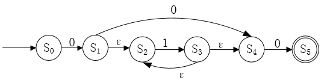

- A. 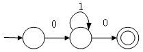
- B. 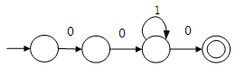
- C. 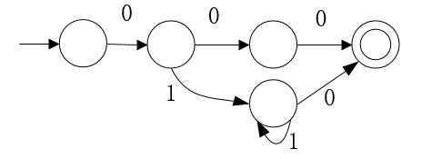
- D. 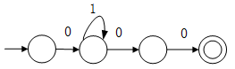

### 正确答案

C

### 解析

本题考查程序语言-自动机相关知识。
本题可以直接以实例方式排除错误选项。本题给出的NFA，能够识别字符串000，010等，以这两个字符串为例进行分析。
与之等价的DFA，也必须能够识别这样的串。A选项不能识别000，B选项不能识别010，D选项不能识别010。只有C选项能够同时识别这2个串。
因此，ABD描述与题意不符，本题选择C选项。

## 第44题（单选题）

函数f、g的定义如下，执行表达式“y = f(2)”的运算时，函数调用g(la)分别采用引用调用（call by reference）方式和值调用（call by value）方式，则该表达式求值结束后 y的值分别为（B）。
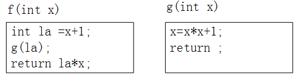

- A. 9、 6
- B. 20、6
- C. 20、9
- D. 30、9

### 正确答案

B

### 解析

[['本题考查程序语言-函数调用方式基础知识。
执行y=f(2)，即传参x=2至f(x)。
首先la=x+1=2+1=3。
（1）g(la)采用引用调用时，在g(la)函数中，将x记为x'以区分函数，x'=x'*x'+1=la*la+1=10，由于是引用调用，会影响形参la的取值，此时la=10，接下来计算la*x=10*2=20。
（2）g(la)采用值调用，在g(la)函数中，将x记为x'以区分函数，x'=x'*x'+1=la*la+1=10，由于是值调用，不会影响形参la的取值，此时la仍然为3，接下来计算la*x=3*2=6。
综上，本题选择B选项。
']]

## 第45题（单选题）

给定关系R(A,B,C,D,E)和关系S(A,C,E,F,G)，对其进行自然连接运算R⋈S后其结果集的属性列为（B）。

- A. R.A,R.C,R.E,S.A,S.C,S.E
- B. R.A,R.B,R.C,R.D,R.E,S.F,S.G
- C. R.A,R.B,R.C,R.D,R.E,S.A,S.C,S.E
- D. R.A,R.B,R.C,R.D,R.E,S.A,S.C,S.E,S.F,S.G

### 正确答案

B

### 解析

本题考查关系数据库的基础知识。
自然连接是一种特殊的等值连接，它要求两个关系中进行比较的分量必须是相同的属性列，并且在结果集中将重复属性列去掉。
自然连接的结果默认以左侧R为主，右侧关系S去除重复列A、C、E。因此最终结果为R的5个属性列A、B、C、D、E，以及S的非重复列F、G。答案为B选项。

## 第46题（单选题）

假设关系R < U ，F > ，U={A1，A2，A3，A4}，F={A1A3→A2，A1A2→A3，A2→A4}，那么在关系R中（C/A），各候选关键字中必定含有属性（  ）。

### 问题1
- A. 有1个候选关键字A2A3
- B. 有1个候选关键字A2A4
- C. 有2个候选关键字A1A2和A1A3
- D. 有2个候选关键字A1A2和A2A3
### 问题2
- A. A1，其中A1A2A3为主属性，A4为非主属性
- B. A2，其中A2A3A4为主属性，A1为非主属性
- C. A2A3，其中A2A3为主属性，A1A4为非主属性
- D. A2A4，其中A2A4为主属性，A1A3为非主属性

### 正确答案

C、A

### 解析

本题考查关系数据库中候选关键字方面的基本知识。
首先判断候选码，先找入度为0的结点，本题中A1没有在函数依赖右侧出现，体现在图中，即入度为0，因此候选码必定包含属性A1。根据选项，只有C选项符合。
第二空，候选码必定包含A1，并且根据候选码为A1A2、A1A3，可以得出主属性有A1A2A3，非主属性有A4。根据选项，只有A选项符合。

## 第47题（单选题）

要将部门表Dept中name列的修改权限赋予用户Ming，并允许Ming将该权限授予他人。实现该要求的SQL语句如下：
GRANT UPDATE(name) ON TABLE Dept TO Ming （C）；

- A. FOR ALL
- B. CASCADE
- C. WITH GRANT OPTION
- D. WITH CHECK OPTION

### 正确答案

C

### 解析

本题考查标准SQL授权语句知识。
这里为SQL固定语句。
授权语句格式：
 GRANT  < 权限 > [，…n] [ON  < 对象类型 > < 对象名 > ] TO < 用户 > [，…n]
[WITH GRANT OPTION]，其中WITH GRANT OPTION，除授予用户相关权限外，还可以使用户将相关权限授予给其他用户。

## 第48题（单选题）

若事务T1对数据D1加了共享锁，事务T2T3分别对数据D2和数据D3加了排它锁，则事务（D）。

- A. T1对数据D2D3加排它锁都成功，T2T3对数据D1加共享锁成功
- B. T1对数据D2D3加排它锁都失败，T2T3对数据D1加排它锁成功
- C. T1对数据D2D3加共享锁都成功，T2T3对数据D1加共享锁成功
- D. T1对数据D2D3加共享锁都失败，T2T3对数据D1加共享锁成功

### 正确答案

D

### 解析

本题考查数据库并发控制基础知识。
共享锁（S锁）：又称读锁，若事务T对数据对象A加上S锁，其他事务只能再对A加S锁，而不能加X锁，直到T释放A上的S锁。
排他锁（X锁）：又称写锁。若事务T对数据对象A加上X锁，其他事务不能再对A加任何锁，直到T释放A上的锁。

## 第49题（单选题）

当某一场地故障时，系统可以使用其他场地上的副本而不至于使整个系统瘫痪。 这称为分布式数据库的（C）。

- A. 共享性
- B. 自治性
- C. 可用性
- D. 分布性

### 正确答案

C

### 解析

本题考查分布式数据库基本概念。
在分布式数据库系统中，共享性是指数据存储在不同的结点数据共享；
自治性是指每个结点对本地数据都能独立管理；
可用性是指当某一场地故障时，系统可以使用其他场地上的副本而不至于使整个系统瘫痪；
分布性是指在不同场地上的存储。

## 第50题（单选题）

某n阶的三对角矩阵A如下图所示，按行将元素存储在一维数组M中，设a1,1存储在M[1]，那么ai,j （1 < =i，j < =n且ai,j位于三条对角线中）存储在M（D）。
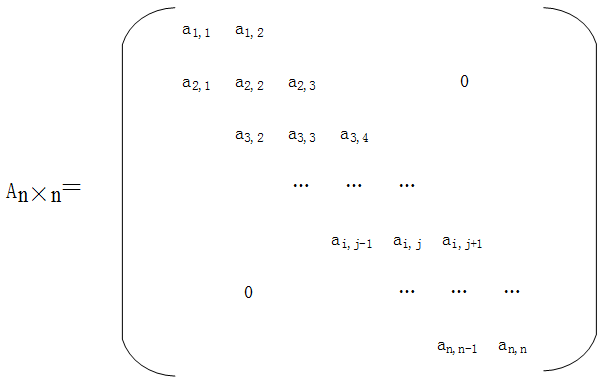

- A. i+2j
- B. 2i+j
- C. i+2j-2
- D. 2i+j-2

### 正确答案

D

### 解析

本题考查数据结构-对角矩阵基础知识。
这类题型可以直接用实例来排除错误选项。a11存在M[1]，将i=1，j=1带入选项，A、B不正确。然后根据题干描述按行存储，下一个元素应该是a12，存放在M[2]中，将i=1，j=2带入选项，只有D选项符合题意。
因此，ABC描述与题意不符，本题选择D选项。

## 第51题（单选题）

具有3个结点的二叉树有5种，可推测出具有4个结点的二叉树有（C）种。

- A. 10
- B. 11
- C. 14
- D. 15

### 正确答案

C

### 解析

本题考查数据结构-二叉树相关知识。
题干给出具有3个结点的二叉树有5种，多增加一个根结点之后，可以有左右不同的3结点二叉树，所以左右分别有单个3结点子树的二叉树有2*5=10种；除此之外，3个结点可以构造成2结点子树和单结点子树，所有不同共有4种。
综上，具有4个结点的二叉树有14种。
也可以使用公式计算，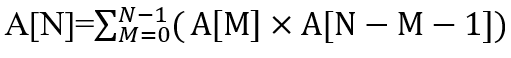。
这是1个求和公式。
N=0，是空树，只有1种形态，即A[0]=1。
N=1，是单结点树，只有1种形态。即A[1]=1。
当N > =2时，A[N]是对A[N]A[N-M-1]，M从0~N-1的求和。
如：
当N=2时，M=0~N-1=0~1，
A[2]=A[0] ×A[2-0-1]+A[1] ×A[2-1-1]=A[0] ×A[1]+A[1] ×A[0]=2，即A[2]=2。
当N=3时，M=0~N-1=0~2，
A[3]=A[0] ×A[3-0-1]+A[1] ×A[3-1-1]+A[2] ×A[3-2-1]
=A[0] ×A[2]+A[1] ×A[1]+A[2]A[0]=1×2+1×1+2×1=5，即A[3]=5。
当N=4时，M=0~N-1=0~3，
A[4]=A[0] ×A[4-0-1]+A[1] ×A[4-1-1]+A[2] ×A[4-2-1]+A[3] ×A[4-3-1]
= A[0] ×A[3]+A[1] ×A[2]+ A[2] ×A[1]+A[3]A[0]= 1×5+ 1×2+2×1+5×1=14，即A[4]=14。
因此，本题选择C选项。

## 第52题（单选题）

双端队列是指在队列的两个端口都可以加入和删除元素，如下图所示。现在要求元素进队列和出队列必须在同一端口，即从A端进队的元素必须从A端出、从B端进队的元素必须从B端出，则对于4个元素的序列a、b、c、d，若要求前2个元素（a、b）从 A端口按次序全部进入队列，后两个元素（c、d）从B端口按次序全部进入队列，则不可能得到的出队序列是（A）。
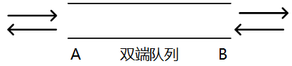

- A. d、a、b、c
- B. d、c、b、a
- C. b、a、d、c
- D. b、d、c、a

### 正确答案

A

### 解析

本题考查数据结构-队列基础知识。
a、b从A端口进入，c、d从B端口进入，如下图所示：
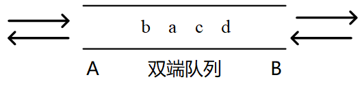
根据题意：从A端进入的元素必须从A端出、从B端进入的元素必须从B端出；则出队顺序中b在a前面，d在c前面。
只有答案A不满足，BCD符合要求，本题选择A选项。

## 第53题（单选题）

设散列函数为H(key)=key%11，对于关键码序列（23,40, 91, 17, 19, 10, 31, 65, 26），用线性探查法解决冲突构造的哈希表为（B）。

- A. 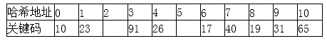
- B. 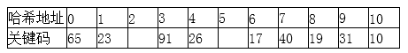
- C. 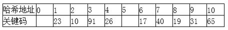
- D. 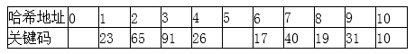

### 正确答案

B

### 解析

本题考查的是哈希表的线性探测法。
首先根据关键码序列，分别求取H(Key)=key%11。得到如下所示关键字散列值：
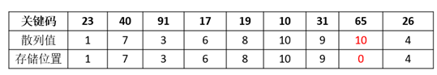
当关键码65对11取模余10的时候，此时10号位置已经存放了关键码10，因此放到下一个位置，即0号位置。
因此，ACD描述与题意不符，本题选择B选项。

## 第54题（单选题）

对于有序表（8,15,19,23,26,31,40,65,91），用二分法进行查找时，可能的关键字比较顺序为（C）。

- A. 26,23,19
- B. 26,8,19
- C. 26,40,65
- D. 26,31,40

### 正确答案

C

### 解析

本题考查数据结构-二分法知识。
将有序表放入数组如下：
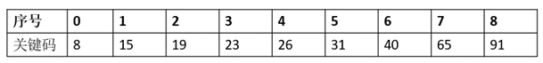
根据二分法的查找过程：
（1）第一轮比较对象（0+8）/2=4，即与序号为4的关键字26进行比较；
（2）第二轮如果选择左侧较小列，则下一个比较对象应该为（0+3）/2=1（向下取整），即与序号为1的关键字15比较，没有对应的选项；
（3）第二轮如果选择右侧较大列，则下一个比较对象应该为（5+8）/2=6（向下取整），即与序号为6的关键字40进行比较。
因此，ABD描述与题意不符，本题选择C选项。

## 第55题（单选题）

已知矩阵Am*n和Bn*p相乘的时间复杂度为O(mnp)。矩阵相乘满足结合律，如三个矩阵A、B、C相乘的顺序可以是(A*B)*C也可以是A*(B*C)。不同的相乘顺序所需进行的乘法次数可能有很大的差别。因此确定n个矩阵相乘的最优计算顺序是一个非常重要的问题。已知确定n个矩阵A1A2......An相乘的计算顺序具有最优子结构，即A1A2......An的最优计算顺序包含其子问题A1A2......Ak和Ak+1Ak+2……An（1≤k）的最优计算顺序。
可以列出其递归式为：

其中，Ai的维度为pi-1*pi，m[i,j]表示AiAi+1……Aj最优计算顺序的相乘次数。
先采用自底向上的方法求n个矩阵相乘的最优计算顺序。则求解该问题的算法设计策略为（B/C/A/D）。算法的时间复杂度为（ ），空间复杂度为（ ）。
给定一个实例，（p0p1……p5）=（20,15,4,10,20,25），最优计算顺序为（ ）。

### 问题1
- A. 分治法
- B. 动态规划法
- C. 贪心法
- D. 回溯法
### 问题2
- A. O(n²)
- B. O(n²lgn)
- C. O(n³)
- D. O(2^n)
### 问题3
- A. O(n²)
- B. O(n²lgn)
- C. O(n³)
- D. O(2^n)
### 问题4
- A. (((A1×A2)×A3)×A4)×A5
- B. A1×(A2×(A3×(A4×A5)))
- C. ((A1×A2)×A3)× (A4×A5)
- D. (A1×A2) ×( (A3×A4)×A5)

### 正确答案

B、C、A、D

### 解析

[['本题考查算法设计与分析-动态规划知识。
第一空：本题提到“已知确定n个矩阵A1A2......An相乘的计算顺序具有最优子结构，即A1A2......An的最优计算顺序包含其子问题A1A2......Ak和Ak+1Ak+2……An（1≤k）的最优计算顺序”，即规模为n的问题的解与较小规模为k的问题的解有关，具有最优子结构，并且提到“m[i,j]表示AiAi+1……Aj最优计算顺序的相乘次数”即，用中间数组m[i,j]存放中间子结果，所以本题描述的算法策略是动态规划法，特点是具有最优子结构，并且会利用中间表记录中间结果，最后利用查表得到最优解。
分治算法的基本思想是将一个规模为N的问题分解为K个规模较小的子问题，这些子问题相互独 立且与原问题性质相同。  
贪心在对问题求解时，总是做出在当前看来是最好的选择。也就是说，不从整体最优上加以考虑，算法得到的是在某种意义上的局部最优解 。
回溯法是一种选优搜索法，又称为试探法，按选优条件向前搜索，以达到目标。但当探索到某一步时，发现原先选择并不优或达不到目标，就退回一步重新选择  。
'],['第二空：题干给出“已知矩阵Am*n和Bn*p相乘的时间复杂度为O(mnp)”，即矩阵乘法的实现过程，可以简单理解为3层嵌套循环，所以时间复杂度为O(n^3)。
下面给出一个简单的矩阵乘法的代码段（只列出动态规划过程，具体变量声明已忽略）：
int cmm(int n,int p[]){
//n为矩阵个数，p[]为维度记录，本题n=5，p[]={20,15,4,10,20,25}
for(t=1;t < n;t++){
for(i=0;i < n-t;i++){
j=i+t;
tempCost = -1;
for(k=i;k < j;k++){
temp=m[i][k]+m[k+1][j]+p[i]*p[k]*p[j];
//此处由p[]数组从0开始记录，i下标无需减1，原公式Pi-1*Pk*Pj转换为p[i]*p[k]*p[j]即可
if(tempCost==-1||tempCost > temp){
tempCost=temp;
tempTrace=k;
}
}
m[i][j]=tempCost; //m[][]：二维数组，长度为n×n，此处数组从0开始记录，矩阵A的i、j、k下标无需减1，用m[i][j]表示 Ai+1Ai+2…Aj+1 的最优计算的计算代价
trace[i][j]=tempTrace; // trace[][]：二维数组，长度为n*n，其中元素trace[i][j]表示Ai+1*Ai+2*Aj+1的最优计算对应的划分位置，即k。
}
}
return m[0][n-1]; //返回值为最优计算的计算代价，即乘法的次数
}
''''],['第三空：本题在计算过程中，需要临时存储空间存放中间结果m[][]，二维数组占据空间为n*n，即空间复杂度为O(n^2)。
'],['第四空：可以按照选项直接计算出相应乘法次数进行判断。
给定一个实例，（p0p1……p5）=（20,15,4,10,20,25）, 表示A1(20×15)，A2(15×4)，A3(4×10)，A4(10×20)，A5(20×25)。
选项A：(((A1×A2) ×A3) ×A4) ×A5，根据括号计算顺序，先计算A1×A2=A12(20×4)，乘法次数为20×15×4=1200；然后计算A12×A3=A123(20×10)，乘法次数为20×4×10=800；接着计算A123×A4=A1234(20×20)，乘法次数为20×10×20=4000；最后计算A1234×A5=A12345(20×25)，乘法次数为20×20×25=10000。
A选项乘法次数为1200+800+4000+10000=16000次；
选项A1×(A2×(A3×(A4×A5))) ，根据括号计算顺序，先计算A4×A5=A45(10×25)，乘法次数为10×20×25=5000；然后计算A3×A45=A345(4×25)，乘法次数为4×10×25=1000；接着计算A2×A345=A2345(15×25)，乘法次数为15×4×25=1500；最后计算A1×A2345=A12345(20×25)，乘法次数为20×15×25=7500。
B选项乘法次数为5000+1000+1500+7500=15000次；
C：((A1×A2)×A3)× (A4×A5) ，根据括号计算顺序，先计算A1×A2=A12(20×4)，乘法次数为20×15×4=1200；然后计算A12×A3=A123(20×10)，乘法次数为20×4×10=800；接着计算A4×A5=A45(10×25)，乘法次数为10×20×25=5000；最后计算A123×A45=A12345(20×25)，乘法次数为20×10×25=5000。
C选项乘法次数为1200+800+5000+5000=12000次；
选项D：(A1×A2) ×( (A3×A4)×A5) ，根据括号计算顺序，先计算A1×A2=A12(20×4)，乘法次数为20×15×4=1200；然后计算A3×A4=A34(4×20)，乘法次数为4×10×20=800；接着计算A34×A5=A345(4×25)，乘法次数为4×20×25=2000；最后计算A12×A345=A12345(20×25)，乘法次数为20×4×25=2000。
D选项乘法次数为1200+800+2000+2000=6000次；
D选项为最优计算顺序。
']]

## 第56题（单选题）

浏览器开启了无痕浏览模式后，（C）依然会被保存下来。

- A. 浏览历史
- B. 搜索历史
- C. 下载文件
- D. 临时文件

### 正确答案

C

### 解析

本题考查浏览器无痕浏览方面的知识。
启用无痕浏览模式，下载文件仍然会被保留。
浏览历史、搜索历史和临时文件都不会保留。
本题选择C选项。

## 第57题（单选题）

下面是HTTP的一次请求过程，正确的顺序是（A）。
①浏览器向DNS服务器发出域名解析请求并获得结果
②在浏览器中输入URL，并按下回车键
③服务器将网页数据发送给浏览器
④根据目的IP地址和端口号，与服务器建立TCP连接
⑤浏览器向服务器发送数据请求
⑥浏览器解析收到的数据并显示
⑦通信完成，断开TCP连接

- A. ②①④⑤③⑦⑥
- B. ②①⑤④③⑦⑥
- C. ②①④⑤③⑥⑦
- D. ②①④③⑤⑦⑥

### 正确答案

A

### 解析

本题考查的是HTTP的连接过程。
②在浏览器中输入URL，并按下回车键；
①浏览器向DNS服务器发出域名解析请求并获得结果；
④根据目的IP地址和端口号，与服务器建立TCP连接；
⑤浏览器向服务器发送数据请求；
③服务器将网页数据发送给浏览器；
⑦通信完成，断开TCP连接；
⑥浏览器解析收到的数据并显示；
一般情况下，一旦Web服务器向浏览器发送了请求数据，它就要关闭TCP连接。
本题选择A选项。

## 第58题（单选题）

TCP和UDP协议均提供了（D）能力。

- A. 连接管理
- B. 差错校验和重传
- C. 流量控制
- D. 端口寻址

### 正确答案

D

### 解析

本题考查TCP和UDP工作原理。
TCP和UDP均提供了端口寻址功能。
UDP是一种不可靠的、无连接的协议，没有连接管理能力，不负责重新发送丢失或出错的数据消息，也没有流量控制的功能。
本题选择D选项。

## 第59题（单选题）

在Windows命令行窗口中使用（B）命令可以查看本机DHCP服务是否已启用。

- A. ipconfig
- B. ipconfig /all
- C. ipconfig /renew
- D. ipconfig /release

### 正确答案

B

### 解析

本题考查ipconfig命令相关基础知识。
ipconfig 显示简要信息，不能查看DHCP服务开启情况。
ipconfig /all 显示详细信息 ，可查看DHCP服务是否已启用。
ipconfig /renew 更新所有适配器。
 ipconfig /release 释放所有匹配的连接。
本题选择B选项。

## 第60题（单选题）

下列无线网络技术中，覆盖范围最小的是（A）。

- A. 802.15.1 蓝牙
- B. 802.11n 无线局域网
- C. 802.15.4 ZigBee
- D. 802.16m 无线城域网

### 正确答案

A

### 解析

本题考查扩频技术的相关知识。
1、802.11n无线局域网：传输距离在100-300m，功耗10-50mA。
2、Zigbee，传输距离50-300M，功耗5mA，最大特点是可自组网，网络节点数最大可达65000个。
3、蓝牙，传输距离2-30M，速率1Mbps，功耗介于zigbee和WIFI之间。  
4、无线城域网， 其覆盖范围的典型值为3~5km。
本题选择A选项。

## 第61题（单选题）

A project is a [temporary]（C/A/B/A/D）of unique, complex, and connected activities having one goal or purpose and that must be completed by a specific time, within budget, and according to（  ）.
Project management is the process of scoping, planning, staffing，organizing, directing, and controlling the development of a(n)（  ）system at a minimum cost within a specified time frame.
For any systems development project, effective project management is necessary to ensure that the project meets the（  ）, is developed within an acceptable budget, and fulfills customer expectations and specifications. Project management is a process that starts at the beginning of a project, extends through a project, and doesn’t culminate until the project is completed.
The prerequisite for good project management is a well-defined system development process. Process management is an ongoing activity that documents, manages the use of, and improves an organization’s chosen methodology (the “process”)for system development. Process management is concerned with the activities, deliverables, and quality standards to be applied to（  ）project(s).

### 问题1
- A. task
- B. work
- C. sequence
- D. activity
### 问题2
- A. specifications
- B. rules
- C. estimates
- D. designs
### 问题3
- A. perfect
- B. acceptable
- C. controlled
- D. completed
### 问题4
- A. deadline
- B. specification
- C. expectation
- D. requirement
### 问题5
- A. a single
- B. a particular
- C. some
- D. all

### 正确答案

C、A、B、A、D

### 解析

[['本题考查专业英语知识。
一个项目是一个(临时)独特的、复杂的、相关的活动序列，它有一个目标或目的,必须在特定的时间完成,在预算之内，并且遵循相关说明书。
项目管理是针对在有限时间内以最低成本完成一个可接受系统的开发，其范围、计划、人员、组织、指导和控制的过程。
对于任何系统开发项目而言，有效的项目管理是必要的，以确保该项目在工期截止前，能够以一个可接受的预算开发和实现，并且符合用户的期望和规范。
项目管理是一个从项目开始，到项目结束，贯穿整个项目，直到项目完成才结束的过程。
良好的项目管理的先决条件是定义良好的系统开发过程。过程管理是一种持续的活动，它记录、管理和改进组织为系统开发所选择的方法（“过程”）。流程管理涉及的活动、可交付成果和质量标准适用于所有的项目。
（1）A-任务    B-工作    C-序列    D-活动
（2）A-规格说明书    B-规则    C-估计    D-设计
（3）A-完美的    B-可接受的    C-受约束的    D-完整的
（4）A-工期    B-规范    C-期望    D-需求
（5）A-单个的    B-特定的    C-一些的    D-所有的
'],['
'],['
'],['
'],['
']]
