# 2019下半年案例题

- 来源标题: 2019年下半年软件设计师考试应用技术真题（专业解析+参考答案）
- 试卷介绍页: https://wangxiao.xisaiwang.com/tiku2/136/tp402078.html?cid=136
- 练习页: https://wangxiao.xisaiwang.com/tiku2/exam534904349.html
- 题量: 6

## 第1题（案例题）

阅读下列说明和图，回答问题1至问题4，将解答填入答题纸的对应栏内。
【说明】
某公司欲开发一款二手车物流系统，以有效提升物流成交效率。该系统的主要功能是：
（1）订单管理：系统抓取线索，将车辆交易系统的交易信息抓取为线索。帮买顾问看到有买车线索后，会打电话询问买家是否需要物流，若需要，帮买顾问就将这个线索发起为订单并在系统中存储，然后系统帮助买家寻找物流商进行承运。
（2）路线管理：帮买顾问对物流商的路线进行管理，存储的路线信息包括路线类型、物流商、起止地点。路线分为三种，即固定路线、包车路线、竞拍体系，其中固定路线和包车路线是合约制。包车路线的发车时间由公司自行管理，是订单的首选途径。
 （3）合约管理：帮买顾问根据公司与物流商确定的合约，对合约内容进行设置，合约信息包括物流商信息、路线起止城市、价格、有效期等。
 （4）寻找物流商：系统根据订单的类型（保卖车、全国购和普通二手车）、起止城市，需要的服务模式（买家接、送到买家等）进行自动派发或以竞拍体系方式选择合适的物流商。即：有新订单时，若为保卖车或全国购，则直接分配到竞拍体系中。否则，若符合固定路线或包车路线，系统自动分配给合约物流商，若不符合固定路线或包车路线，系统将订单信息分配到竞拍体系中。竞拍体系接收到订单后，将订单信息推送给有相关路线的物流商，物流商对订单进行竞拍出价，最优报价的物流商中标。最后，给承运的物流商发送物流消息，更新订单的物流信息，给车辆交易系统发送物流信息。
 （5）物流商注册：物流商账号的注册开通。
 现采用结构化方法对二手车物流系统进行分析与设计，获得如图1-1所示的上下文数据流图和图1-2所示的0层数据流图。
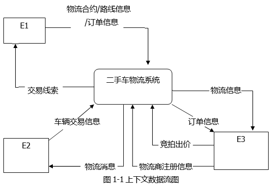
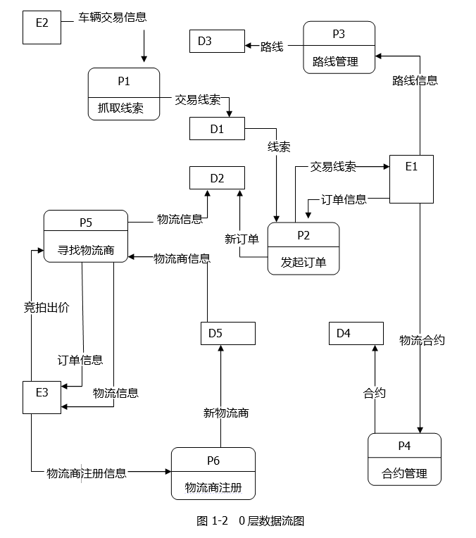

### 补充题面

【问题1】（3分）
使用说明中的词语，给出图1-1中的实体E1~E3的名称。
【问题2】（5分）
使用说明中的词语，给出图1-2中的数据存储D1~D5的名称。
【问题3】（4分）
根据说明和图中术语，补充图1-2中缺失的数据流及其起点和终点。
【问题4】（3分）
根据说明，采用结构化语言对“P5：寻找物流商”的加工逻辑进行描述。

### 参考答案

【问题1】
E1：帮买顾问；E2：车辆交易系统；E3：物流商。
【问题2】
D1：线索信息表/线索信息存储；D2：订单信息表/订单信息存储；
D3：路线信息表/路线信息存储；D4：合约信息表/合约信息存储；
D5：物流商信息表。
【问题3】
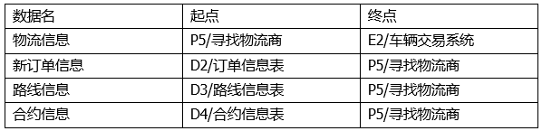
【问题4】
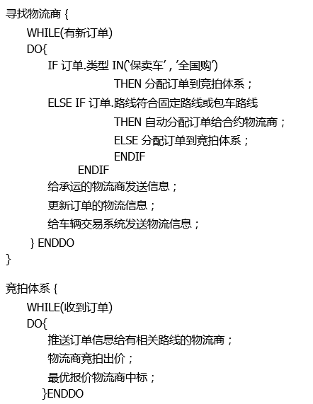
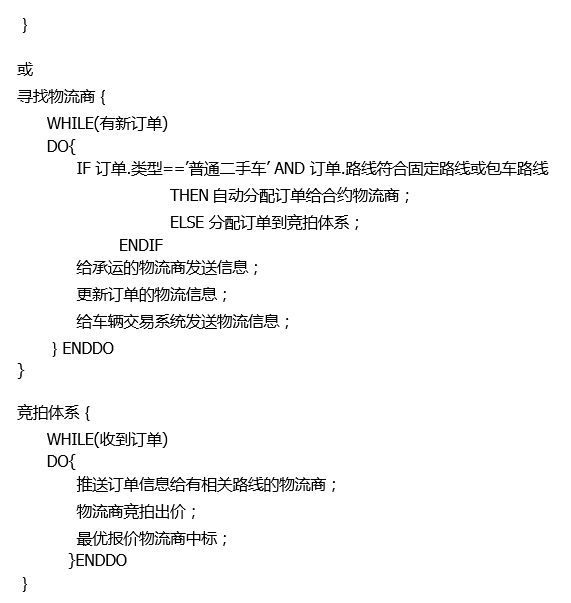

### 解析

【问题1】
本题属于常规题型，补充数据流图中的实体名，实体一般为人员、组织机构、第三方系统等。
根据题干描述，“帮买顾问看到有买车线索后，……”可知接收交易线索的E1对应实体应该是帮买顾问；根据题干描述“将车辆交易系统的交易信息抓取为线索”可知提供车辆交易信息的E2对应实体应该是车辆交易信息；根据题干描述“物流商注册：物流商账号的注册开通。”可知提供物流商注册信息的E3对应实体应该是物流商。
【问题2】
本题属于常规题型，补充数据流图中的数据存储名，一般对应**库、**表、**档案等。
根据题干描述和图示P1抓取线索后交易线索数据流入并且有线索数据流出的数据存储，应该是线索存储，即D1为线索信息表（线索信息存储等）。根据题干描述“帮买顾问将这个线索发起为订单并在系统中存储”和图示P2发起订单，有新订单数据流入的数据存储D2应该是订单信息表。根据题干描述和图示P3路线管理，有路线数据流入的数据存储D3应该是路线信息表。根据题干描述和图示P4合约管理，有合约数据流入的数据存储D4应该是合约信息表。根据题干描述和图示P5、P6，有新物流商数据流入、物流商信息数据流出的数据存储D5，应该是物流商信息表。
【问题3】
本题属于常规题型，补充缺失的数据流及其起点和终点。
1、根据父图-子图平衡原则，父图存在E2→二手车物流系统的物流信息数据流，子图不存在，又根据题干描述：寻找物流商：……，给车辆交易系统发送物流信息，所以图1-2缺失数据流p5→E2，物流信息。
2、根据题干描述“系统根据订单的类型（保卖车、全国购和普通二手车）、起止城市、……选择合适的物流商”，P5寻找物流商缺失订单信息流入。
3、根据题干描述“若符合固定路线或包车路线，系统自动分配给合约物流商，若不符合……”，P5寻找物流商需要依据固定路线或包车路线，还需要根据合约的有效期等信息判断是否可以分配，所以需要补充数据流路线信息：D3→P5，合约信息： D4→P5。
【问题4】
本题属于扩展题型。结构化语言是一种介于自然语言和形式化语言之间的半形式化语言，是自然语言的一个受限子集。结构化语言没有严格的语法，通常分为内层和外层。外层有严格的语法，内层接近于自然语言的描述。
外层用来描述控制结构，采用顺序、选择和重复3种基本结构。顺序结构是一组祈使句、选择语句、重复语句的顺序排列。选择结构一般用IF-THEN-ENDIF等关键字。重复结构一般用DO-WHILE-ENDDO等关键字。内层一般使用祈使句的自然语言短语。

## 第2题（案例题）

阅读下列说明，回答问题1至问题4，将解答填入答题纸的对应栏内。
【说明】
公司拟开发新入职员工的技能培训管理系统，以便使新员工快速胜任新岗位。该系统的部分功能及初步需求分析的结果如下所述：1.部门信息包括部门号、名称、部门负责人、电话等，其中部门号唯一标识部门关系中的每一个元组，一个部门有多个员工，但一名员工只属于一个部门，每个部门只有一名负责人，负责部门工作。
2.员工信息包括员工号、姓名、部门号、岗位、基本工资、电话、家庭住址等，其中员工号唯一标识员工关系中的每一个元组。岗位有新入职员工，培训师、部门负责人等不同岗位设置不同的基本工资，新入职员工要选择多门课程进行培训，并通过考试取得课程成绩，一名培训师可以讲授多门课程、一门课程可由多名培训师讲授。
3.课程信息包括课程号，课程名称、学时等；其中课程号唯一标识课程关系的每一个元组。
根据需求阶段收集的信息，设计的实体联系图如图2-1所示 
 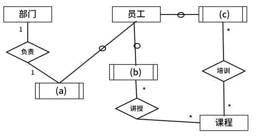
图2-1 实体联系图
【关系模式设计】
        部门（部门号，部门名，部门负责人，电话）
        员工（员工号，姓名，部门号，d，电话，家庭住址）
        课程（e，课程名称，学时）
        讲授（课程号，培训师，培训地点）
        培训（课程号，（f） ）

### 补充题面

【问题1】（5分）
（1）补充图2 -1中的空（a）-（c）。
（2）图2-1中是否存在缺失的联系？若存在，则说明所缺失的联系和联系类型。
【问题2】（3分）
根据题意，将关系模式中的空（d） - （f） 补充完整。
【问题3】（5分）
员工关系模式的主键为（g） ，外键为（h） ；
讲授关系模式的主键为（i），外键为（j）。
【问题4】（2分）
员工关系是否存在传递依赖？用100字以内的文字说明理由 。

### 参考答案

【问题1】
（1）（a）部门负责人；（b）培训师；（c）新入职员工
（2）存在缺失联系：员工与部门之间隶属关系，联系类型*:1。
（或，存在缺失联系：部门与员工之间隶属关系，联系类型1:*）。
【问题2】
（d）岗位，基本工资；（e）课程号；（f）新入职员工/新入职员工工号，课程成绩
【问题3】
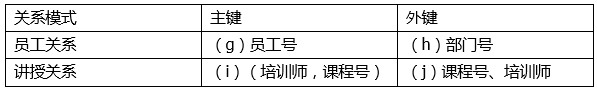
【问题4】
存在传递函数依赖。
在员工关系中，员工的岗位有新入职员工，培训师，部门负责人，不同岗位设置不同的基本工资，即存在传递函数依赖，员工号→岗位，岗位→基本工资。

### 解析

【问题1】
（本题预估分值5分，填空每空1分，联系2分）
（1）根据题干描述员工岗位有新入职员工、培训师、部门负责人，所以对于员工的特殊化实体有新入职员工、培训师、部门负责人，又根据图示，（a）与部门之间有负责关系，所以（a）是部门负责人，（b）与课程之间有讲授关系，所以（b）为培训师，（c）与课程之间有培训关系，根据题干描述新入职员工需要选择多门课程进行培训，所以（c）是新入职员工。
（2）根据题干说明，一个部门有多个员工，但一名员工只属于一个部门，所以员工与部门之间存在隶属关系，并且员工与部门之间联系类型为*:1。（或部门与员工之间存在1:*的联系）。
【问题2】
（本题预估分值3分，每空1分）
根据题干说明“员工信息包括员工号、姓名、部门号、岗位、基本工资、电话、家庭住址等”，员工关系缺少属性（d）：岗位，基本工资。
根据题干说明“课程信息包括课程号、课程名称、学时等”，课程关系缺失属性（e）：课程号。
根据题干说明，培训关系是新入职员工与课程之间多对多联系的转换，所以必须包含二者的主键即新入职员工的员工号（员工号唯一标识员工关系中的每一个元组）和课程的课程号（课程号唯一标识课程关系的每一个元组），又根据说明“新入职员工要选择多门课程进行培训，并通过考试取得课程成绩”，因此培训还需要有自身的属性课程成绩，即培训关系缺失属性（f）：新入职员工/新入职员工工号，课程成绩。
【问题3】
（本题预估分值4分，每空1分）
本题考查对主键和外键的判断，主键可以唯一标识元组，外键是其他关系的主键。
根据题干说明“员工号唯一标识员工关系中的每一个元组”，因此员工关系的主键（g）为员工号，又因为“部门号唯一标识部门关系中的每一个元组”，即部门号是部门关系的主键，在员工关系中，是作为外键（h）的。
根据题干说明和图示可知，讲授关系是培训师与课程之间多对多的联系转换，此时主键应该是二者的主键组合，即主键（i）（培训师，课程号），又因为培训师是培训师的主键，课程号是课程的主键，所以二者又是讲授关系的外键（j）。本题由于培训地点是否固定并没有给出描述，所以无法判断是否属于主键组合的一部分，因此给出主键（i）（培训师，课程号，培训地点）组合键也可以得分。
【问题4】
（本题预估3分，判断1分，理由2分）
本题存在传递函数依赖。
在员工关系中，员工的岗位有新入职员工，培训师，部门负责人，不同岗位设置不同的基本工资，即存在传递函数依赖，员工号→岗位，岗位→基本工资。

## 第3题（案例题）

阅读下列说明和图，回答问题1至问题3。
【说明】某牙科诊所拟开发一套信息系统，用于管理病人的基本信息和就诊信息。诊所工作人员包括：医护人员（Dental Staff）、接待员（Receptionist）和办公人员（Office Staff）等。系统主要功能需求描述如下：
1.记录病人基本信息（Maintain patient info）。初次就诊的病人，由接待员将病人基本信息录入系统。病人基本信息包括病人姓名、身份证号、出生日期、性别、首次就诊时间和最后一次就诊时间等。每位病人与其医保信息（Medical Insurance）关联。
2.记录就诊信息（Record office visit info）。病人在诊所的每一次就诊，由接待员将就诊信息（Office Visit）录入系统。就诊信息包括就诊时间、就诊费用、支付代码、病人支付费用和医保支付费用等。
3.记录治疗信息（Record dental procedure）。病人在就诊时，可能需要接受多项治疗，每项治疗（Procedure）可能由多位医护人员为其服务。治疗信息包括：治疗项目名称、治疗项目描述、治疗的牙齿和费用等。治疗信息由每位参与治疗的医护人员分别向系统中录入。
4.打印发票（Print invoices）。发票（Invoice）由办公人员打印。发票分为两种：给医保机构的发票（Insurance Invoice）和给病人的发票（Patient Invoice）。两种发票内容相同，只是支付的费用不同。当收到治疗费用后，办公人员在系统中更新支付状态（Enter payment）。
5.记录医护人员信息（Maintain dental staff info）。办公人员将医护人员信息录入系统。医护人员信息包括姓名、职位、身份证号、家庭住址和联系电话等。
6.医护人员可以查询并打印其参与的治疗项目相关信息（Search and print procedure info）。
现采用面向对象方法开发该系统，得到如图3-1所示的用例图和3-2所示的初始类图。
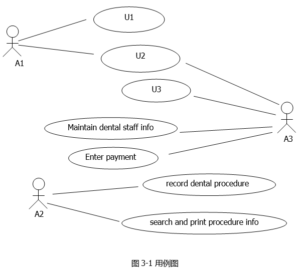
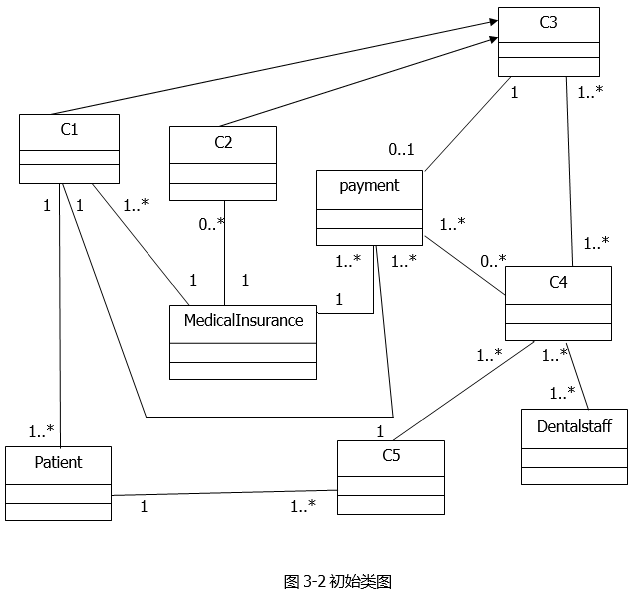

### 补充题面

【问题1】（6分）
根据说明中的描述，给出图3-1中A1~A3所对应的参与者名称和U1~U3所对应的用例名称。
【问题2】（5分）
根据说明中的描述，给出图3-2中C1~C5所对应的类名。
【问题3】（4分）
根据说明中的描述，给出图3-2中类C4、C5、Patient和Dental Staff的必要属性。

### 参考答案

【问题1】
A1： Receptionist（接待员）
A2： Dental Staff（医护人员）
A3： Office Staff（办公人员）
U1：Maintain patient info （记录病人基本信息）
U2：Record office visit info （记录就诊信息）
U3： Print invoices（打印发票）
【问题2】
C1： Patient Invoice
C2： Insurance Invoice
C3： Invoice
C4： Procedure
C5：Office Visit
【问题3】
C4：治疗项目名称、治疗项目描述、治疗的牙齿和费用
C5：病人就诊时间和费用、支付代码、病人支付费用、医保支付费用
Patient：姓名、身份证号、出生日期、性别、
首次就诊时间和最后一次就诊时间
Dental Staff：姓名、职位、身份证号、住址、联系电话。

### 解析

【问题1】
本题属于常规考题，考查对参与者和用例名的补充，系统的参与者一般为人员、机构或第三方系统。用例名一般为动词+名词或名词+动词，是对系统功能的概括和描述。
本题根据题干说明，参与者即诊所工作人员包括：医护人员（Dental Staff）、 接待员（Receptionist） 和办公人员（Office Staff） 等。
根据用例图已有信息，A2使用用例Record dental procedure和Search and print procedure info，根据题干说明记录治疗信息（Record dental procedure）由每位参与治疗的医护人员分别录入，医护人员可以查询并打印其参与的治疗项目相关信息（Search and print procedure info），因此A2为医护人员（Dental Staff）。
根据用例图已有信息A3使用用例Maintain dental staff info和Enter payment，根据题干说明记录医护人员信息（Maintain dental staff info），由办公人员录入系统，所以A3为Office Staff（办公人员）。并且根据题干办公人员还需要打印发票（Print invoices）、更新支付状态（Enterpayment），缺失的U3应该是打印发票（Print invoices）。根据题干描述A3与U2之间的联系没有意义，不参考。
根据题干描述和图示，A1对应的参与者应该是A1： Receptionist（接待员），接待员需要参与的功能有记录病人基本信息（Maintain patient info）和记录就诊信息（Record office visit info），分别对应U1、U2，二者与办公人员都没有明确联系，位置可以互换。
【问题2】
本题属于常规考查题型，补充缺失的类名，常见的实体类类名一般为名词形式，也会有特殊的边界类/接口类和协调类。需要参照题干描述和类图中类与类之间的关系，来确定缺失的类名及其位置。
根据初始类图，存在一组泛化关系，C3是C1、C2的泛化，即C3是C1、C2的父类，根据题干描述存在这样泛化关系的只有发票（Invoice）、病人发票（Patient Invoice）、医保机构发票（Insurance Invoice），又根据多重度来分析，由于可能存在全自费的情况，即医保发票不存在，所以多重度0…*对应的C2类名应该是医保机构发票（Insurance Invoice），C1对应的是病人发票（Patient Invoice），父类C3对应的是发票（Invoice）。
又根据图示和题干，与医护人员（Dental Staff）相关的用例有记录治疗信息（Record dental procedure）、查询并打印其参与的治疗项目相关信息（Search and print procedure info），其中能够找到相关内容治疗信息procedure，即C4对应的是实体类治疗信息Procedure，与治疗相关的是就诊信息office visit，即C5对应的是实体类就诊信息Office Visit。
【问题3】
根据题干描述，“病人基本信息包括病人姓名、身份证号、出生日期、性别、首次就诊时间和最后一次就诊时间等”，因此Patient的必要属性包括病人姓名、身份证号、出生日期、性别、首次就诊时间和最后一次就诊时间。
根据题干描述，“医护人员信息包括姓名、职位、身份证号、家庭住址和联系电话等”，因此Dental Staff的必要属性包括姓名、职位、身份证号、家庭住址和联系电话等。
根据题干描述，C5 Office Visit就诊信息包括就诊时间、就诊费用、支付代码、病人支付费用和医保支付费用等。
根据题干描述C4: Procedure治疗信息包括：治疗项目名称、治疗项目描述、治疗的牙齿和费用等。

## 第4题（案例题）

阅读下列说明和C代码，回答问题1至问题3。
【说明】
0-1背包问题定义为：给定i个物品的价值v[1…i]、小重量w[1…i]和背包容量T，每个物品装到背包里或者不装到背包里。求最优的装包方案，使得所得到的价值最大。
0-1背包问题具有最优子结构性质。定义c[i][T]为最优装包方案所获得的最大价值，则可得到如下所示的递归式。

【c代码】
下面是算法的C语言实现。
（1）常量和变量说明
T：背包容量
v[]：价值数组
w[]：重量数组
c[][]：c[i][j]表示前i个物品在背包容量为j的情况下最优装包方案所能获得的最大价值
（2） C程序
#include < stdio.h > 
#include < math.h > 
#define N 6
#define maxT 1000
int c[N] [maxT]={0};
int Memoized_Knapsack(int v[N],int w[N],int T){
 int i;
 int j;
 for(i=0;i < N;i++){
 for(i=0;i < =T;j++){
 c[i] [j]=-1;
 }
}
return Calculate_Max_Value(v,w,N-1,T);
}
int Calculate_Max_Value(int v[N],int w[N],int i,int j){
 int temp =0;
 if(c[i] [j]!=-1){
 return(1);
}
if(i==0||j==0){
 c[i] [j]=0;
}else{
 c[i] [j]= Calculate_Max_Value(v,w,i-1,j);
 if( (2) ){
 temp= (3);
if(c[i][j] < temp){
 (4)
}
}
}
return c [i] [j];
}
【问题1】 （8分）
根据说明和C代码，填充C代码中的空（1）-（4）。
【问题2】 （4分）
根据说明和C代码，算法采用了 （5） 设计策略。在求解过程中，采用了（6）
（自底向上或者自顶向下）的方式。
【问题3】 （3分）
若5项物品的价值数组和重量数组分别为v[]= {0，1，6，18，22，28}和w[]= {0，1，2，5，6，7}背包容量为T= 11，则获得的最大价值为 （7） 。

### 参考答案

【问题1】
（1）c[i][j]
（2）i > 0&&j  > =w[i]
（3）Calculate_Max_Value(v, w, i-1, j-w[i] ) + v[i]
（4）c[i][j]=temp
【问题2】
（5）动态规划
（6）自顶向下
【问题3】
（7）40

### 解析

[["本题考查的是动态规划法，将中间结果存在二维数组c[][]当中。
【问题1】
结合题干描述中的递归式，函数最终返回值应该是c[i][T]，又根据代码上下文，T在函数中传参为j，所以第（1）空返回的结果为c[i][j]。
根据递归式和代码上下文可知，c[i][j]=0已处理，if后面处理的是max递归部分，又根据上下文可以看到temp会与c[i][j]进行比较，递归时i=i-1，所以这里判断的是temp与c[i-1][T]的值，第（3）空的处理是将c[i-1][j-w[i]]+v[i]传递给temp，即temp= Calculate_Max_Value(v, w,i-1,j-w[i])+v[i]，注意这里不是直接传c[][]数组值，而是递归调用Calculate_Max_Value()函数。那么第（2）空缺失的判断条件根据第3个表达式条件为i > 0且T > =w[i]，对应代码中的参数即i > 0&&j > =w[i]。
第（4）空是c[i][j] < temp比较后的返回值，根据题干，我们需要返回max最大值，最终返回的结果是c[i][j]，因此要保证c[i][j]最大，当c[i][j] < temp时，将temp赋值给c[i][j]，即c[i][j]=temp。
【问题2】
本题采用递归形式，并且求取的是全局最优解，中间结果存在二维数组c[][]当中，所以采用的是动态规划法。动态规划法采用递归形式，i会从N-1递减至0，所以是自顶向下的方式。
【问题3】
本题考查最优解，可以忽略题干描述，直接凑数，可得第3和第4个物品，重量为11，价值为40，此时为最优解，即为最大价值。
"]]

## 第5题（案例题）

阅读下列说明和C++代码，将应填入(n）处的字句写在答题纸的对应栏内。
【说明】
某文件管理系统中定义了类OfficeDoc和DocExplorer。当类OfficeDoc发生变化时， 类DocExplorer的所有对象都要更新其自身的状态。现采用观察者（Observer）设计模式来实现该需求，所设计的类图如图5-1所示。
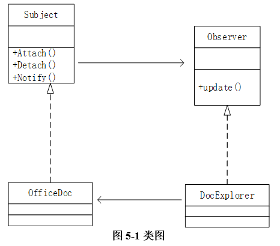

### 补充题面

【C++代码】
#include<iostream>
#include<vector>
#include<string>
Using namespace std;
Class Observer{
Public:
     (1);
};
Class Subject{
Protected:
  Vector< (2) >myobs;
public:
  virtual void Attach(Observer*obs) {myobs.push_back(obs);}
  virtual void Detach(Observer*obs) {
  for (vector<observer*>::iterator iter = myobs.begin();iter !=myobs.end(); iter++){
  if(*iter == obs){myobs.erase(iter);return;}
}
}
virtual void Notify(){
for (vector<observer*>::iterator iter = myobs.begin();iter !=myobs.end(); iter++){
  (3);}
}
virtual int getStatus() = 0;
virtual void setStatus(int status) = 0;
};
classOfficeDoc : public Subject{
private:
  stringmySubjectName;
  intm_status;
public:
  OfficeDoc(string name): mySubjectName(name), m_status(0){}
  voidsetStatus(int status){m_status = status;}
  intgetStatus(){return m_status;}
};
classDocExplorer : public observer{
private:
  stringmyObsName;
public:
DocExplorer(string name, (4) sub):myobsName(name){sub->(5);}
  Void update(){cout<<“update observer:”<<myObsName<<endl;}
};
int main(){
  Subject *subjectA = new OfficeDoc(“subject A”);
  Observer *observerA = new DocExplorer(“observerA”,subjectA);
  subjectA->setStatus(1);subjectA->Notify();
  return 0;
}

### 参考答案

（1）virtual void update()=0
（2）Observer*
（3）(*iter)->update()
（4）Subject*
（5）Attach(this)

### 解析

本题考查设计模式中的观察者（Observer）模式。
观察者模式的意图是，定义对象间的一种一对多的依赖关系，当一个对象的状态发生改变时,所有依赖于它的对象都得到通知并被自动更新。
（1）空需要填写的是在目标发生改变时通知观察者的更新接口的Observer中的核心方法，并且还需要在其子类中进行重置，所以第（1）空应填入virtual void update()=0。一个Subject可以有多个观察者，在Subject中需要提供增加和删除观察者的接口，即类中的Attach、Detach方法。这两个方法的主要操作对象就是类中的属性myObs。 根据程序上下文推断，myObs表示的应该是观察者的集合，所以第（2）空应填入Observer*。第（3）空出现在Subject的方法Notify中，这个方法的功能是当目标发生变化时， 通知所有与该目标关联的观察者，即调用每个观察者定义的update方法，所以第（3）空应填入(*iter)-＞update()。DocExplore是一个具体的观察者，它需要维护一个指向目标的对象，在这里实际上就是指向OfficeDoc的对象。观察者与目标的关联关系是通过DocExplore的构造函数实现的。在面向对象的继承机制中，通常倾向于用基类指针代替派生类指针，因此第（4）空应填入Subject*。观察者与目标的关联关系的建立需要调用Subject中的方法Attach，因此第（5）空应填入Attach(this)。

## 第6题（案例题）

阅读下列说明和Java代码，将应填入 （n） 处的字句写在答题纸的对应栏内。
【说明】
某文件管理系统中定义了类OfficeDoe和DocExplorer。当类OfficeDoe发生变化时，类DocExplorer的所有对象都要更新其自身的状态。现采用观察者（Observer）设计模式来实现该需求，所设计的类图如图6-1所示。
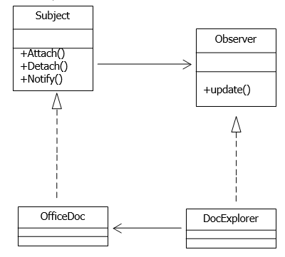
图6-1
【Java代码】
import java.util.*;
interface Observer{
     public （1） ;
}
interface Subject{
     public void Attach(Observer obs);
     public void Detach(Observer obs);
     public void Notify();
     public void setStatus(int status);
     public int getStatus();
}
class OfficeDoc implements Subject{
     private List< （2） > myObs;
     private String mySubjectName;
     private int m_status;
     public OfficeDoc(String name){
       mySubjectName=name;
       this.myObs=new ArrayList<Observer>();
       m_status=0;
     }
     public void Attach(Observer obs){this.myObs.add(obs);}
     public void Detach(Observer obs){this.myObs.remove(obs);}
     public void Notify(){
       for(Observer obs:this.myObs){
       （3）;
     }
 }
 public void setStatus(int status){
       m_status=status;
       System.out.println("SetStatus subject["+mySubjectName+"]status:"+status);
     }
     public int getStatus(){return m_status;}
}
class DocExplorer implements Observer{
     private String myObsName;
     public DocExplorer(String name, （4） sub){
       myObsName=name;
       sub. （5） ;
     }
     public void update(){
       System.out.println("update observer["+myObsName+"]");
     }
}
class ObserverTest{
   public static void main(String []args) {
     System.out.println("Hello World!");
       Subject subjectA=new OfficeDoc("subject A");
       Observer oberverA=new DocExplorer("observer A",subjectA);
      subjectA.setStatus(1);
     subjectA.Notify();
     }
}

### 参考答案

（1）void update()
（2）Observer
（3）obs.update()
（4）Subject
（5）Attach(this)

### 解析

本题是对观察者模式的考查，观察者模式的意图是：定义对象间的一种一对多的依赖关系，当一个对象的状态发生改变时，所有依赖于它的对象都得到通知并被自动更新。
本题根据Observer接口的实现类DocExplorer，实现类包括同名构造函数和update()方法，所以接口Observer缺失的是update()方法，并且没有方法体，（1）空填写void update()。
第2空是myObs表单类型的缺失，根据代码上下文，在构造函数中，根据this.myObs=new ArrayList<Observer>()，可以知道myObs是Observer表单，第（2）空填写Observer。
第3空是Notify()方法体的缺失，根据代码上下文，Notify传入了一个参数Observer obs，又根据代码上下文可知Observer只有一个update()方法，此时方法体调用的应该是update()方法，调用方法的对应是传入的obs，第（3）空填写obs.update()。
第4空、第5空缺失的是DocExplorer类的同名构造函数传入的参数类型以及构造方法体，这里结合根据观察者模式填空，对于实际观察者类，需要与被观察者联系起来，所以这里是与被观察者Subject联系，也就是调用Subject中的Attach()添加观察者列表。因此第（4）空需要填写参数类型Subject，形参名sub已经给出了提示；sub调用增加观察者方法，将当前观察者添加到对应列表，即第（5）空填写Attach(this)。
