# 2020下半年选择题

- 来源标题: 2020年软件设计师考试基础知识真题（专业解析+参考答案）
- 试卷介绍页: https://wangxiao.xisaiwang.com/tiku2/136/tp20414747.html?cid=136
- 练习页: https://wangxiao.xisaiwang.com/tiku2/exam534904325.html
- 题量: 57

## 第1题（单选题）

在程序执行过程中，高速缓存（Cache）与主存间的地址映射由（D）。

- A. 操作系统进行管理
- B. 存储管理软件进行管理
- C. 程序员自行安排
- D. 硬件自动完成

### 正确答案

D

### 解析

本题考查的是Cache的概念。
高速缓冲存储器由高速存储器、联想存储器、替换逻辑电路和相应的控制线路组成，通过硬件自动实现Cache与主存间的地址映射。与操作系统、存储管理软件、程序员无关。ABC说法错误，本题选择D选项。

## 第2题（单选题）

计算机中提供指令地址的程序计数器PC在（A）中。

- A. 控制器
- B. 运算器
- C. 存储器
- D. I/O设备

### 正确答案

A

### 解析

本题是对CPU组成相关概念的考查。
存储器和I/O设备是计算机中的其他组成部分，与程序计数器PC无关。
CPU可以分为运算器和控制器两个部分。
运算器包括：算术逻辑单元ALU、累加寄存器AC、数据缓冲寄存器DR。状态条件寄存器PSW归属有争议，既可以属于运算器，也可以属于控制器。
控制器包括：程序计数器PC、指令寄存器IR、指令译码器ID、时序部件。
PC是控制器中的子部件，BCD不符合，本题选择A选项。

## 第3题（单选题）

以下关于两个浮点数相加运算的叙述中，正确的是（B）。

- A. 首先进行对阶，阶码大的向阶码小的对齐
- B. 首先进行对阶，阶码小的向阶码大的对齐
- C. 不需要对阶，直接将尾数相加
- D. 不需要对阶，直接将阶码相加

### 正确答案

B

### 解析

本题是对浮点数基本概念的考查。
浮点数运算的过程如下所示：对阶→尾数运算→规格化。所以C、D选项描述都是错误的。
其中对阶的过程如下所示：小数向大数看齐，阶码小的较小数的尾数右移。所以A选项描述错误，本题选择B选项。

## 第4题（单选题）

某计算机系统的CPU主频为2.8GHz。某应用程序包括3类指令，各类指令的CPI（执行每条指令所需要的时钟周期数）及指令比例如下表所示。执行该应用程序时的平均CPI为（C/B）；运算速度用MIPS表示，约为（  ）。
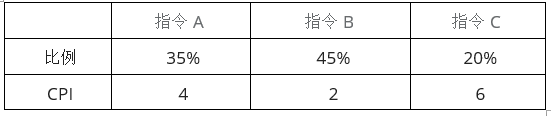

### 问题1
- A. 25
- B. 3
- C. 3.5
- D. 4
### 问题2
- A. 700
- B. 800
- C. 930
- D. 1100

### 正确答案

C、B

### 解析

本题考查计算机性能指标的计算。
第一问是关于平均CPI，即对列出的CPI求平均数。
4*35%+2*45%+6*20%=3.5。第一空选择C选项。
第二问求MIPS，即每秒执行的百万条指令数。
根据第一问CPI，每条指令需要的时钟周期为3.5，每个时钟周期为主频的倒数，即1/2.8G秒，则每条指令需要时间3.5/2.8G秒。
每秒执行指令数为1/(3.5/2.8G)=2.8G/3.5=0.8G=800M。第二空选择B选项。
（1M=106，1G=109）

## 第5题（单选题）

中断向量提供（D）。

- A. 函数调用结束后的返回地址
- B. I/O设备的接口地址
- C. 主程序的入口地址
- D. 中断服务程序入口地址

### 正确答案

D

### 解析

本题是对中断的概念考查。
中断是这样一个过程: 在CPU执行程序的过程中，由于某一个外部的或CPU内部事件的发生，使CPU暂时中止正在执行的程序，转去处理这一事件（即执行中断服务程序），当事件处理完毕后又回到原先被中止的程序，接着中止前的状态继续向下执行。这一过程就称为中断。
其中对于中断源的识别标志，是可用来形成相应的中断服务程序的入口地址或存放中断服务程序的首地址，也称为中断向量。其他选项为干扰项。本题选择D选项。

## 第6题（单选题）

以下关于认证和加密的叙述中，错误的是（C）。

- A. 加密用以确保数据的保密性
- B. 认证用以确保报文发送者和接收者的真实性
- C. 认证和加密都可以阻止对手进行被动攻击
- D. 身份认证的目的在于识别用户的合法性，阻止非法用户访问系统

### 正确答案

C

### 解析

本题考查信息安全认证和加密的情况。
认证一般有账户名/口令认证、使用摘要算法认证和基于PKI的认证。
认证只能阻止主动攻击，不能阻止被动攻击。A、B、D的说法都是正确的，C选项说法错误。
故答案选择C选项。

## 第7题（单选题）

访问控制是对信息系统资源进行保护的重要措施，适当的访问控制能够阻止未经授权的用户有意或者无意地获取资源。计算机系统中，访问控制的任务不包括（A）。

- A. 审计
- B. 授权
- C. 确定存取权限
- D. 实施存取权限

### 正确答案

A

### 解析

本题考查信息安全机制相关问题。
安全审计对主体访问和适用客体的情况进行记录和审查，以保证安全规则被正确执行，并帮助分析安全事故产生的原因。与访问控制无关。授权、确定存取权限、实施存取权限都是安全访问控制的任务，故正确答案选择A选项。

## 第8题（单选题）

由于Internet规模太大，常把它划分成许多小的自治系统，通常把自治系统内部的路由协议称为内部网关协议，自治系统之间的协议称为外部网关协议。以下属于外部网关协议的是（C）。

- A. RIP
- B. OSPF
- C. BGP
- D. UDP

### 正确答案

C

### 解析

本题考查的是网关协议相关内容，这一部分在软件设计师考试中涉及不多。
RIP：RIP（Routing Information Protocol，路由信息协议）是一种内部网关协议（IGP），是一种动态路由选择协议，用于自治系统（AS）内的路由信息的传递，A选项错误。
OSPF：OSPF（Open Shortest Path First，开放式最短路径优先）是一个内部网关协议（Interior Gateway Protocol，简称IGP），用于在单一自治系统（autonomous system,AS）内决策路由。是对链路状态路由协议的一种实现，隶属内部网关协议（IGP），故运作于自治系统内部，B选项错误
BGP：边界网关协议（BGP）是运行于 TCP 上的一种自治系统的外部网关协议。 BGP 是唯一一个用来处理像因特网大小的网络的协议，也是唯一能够妥善处理好不相关路由域间的多路连接的协议。本题选择C选项。
UDP：传输层协议，D选项错误。
综上所述，本题选C。

## 第9题（单选题）

所有资源只能由授权方或以授权的方式进行修改，即信息未经授权不能进行改变的特性是指信息的（A）。

- A. 完整性
- B. 可用性
- C. 保密性
- D. 不可抵赖性

### 正确答案

A

### 解析

本题考查的是信息安全知识。
A、数据的完整性是指数据在传输过程中不能被非法篡改，本题涉及修改的只有完整性，所以A选项正确。
B、数据的可用性指的是发送者和接受者双方的通信方式正常，B选项排除。
C、数据的机密性（保密性）是指数据在传输过程中不能被非授权者偷看，C选项排除。
D、数据的真实性（不可抵赖性）是指信息的发送者身份的确认或系统中有关主体的身份确认，这样可以保证信息的可信度，D选项排除；
故正确答案选择A选项。

## 第10题（单选题）

在Windows操作系统下，要获取某个网络开放端口所对应的应用程序信息，可以使用命令（C）。

- A. ipconfig
- B. traceroute
- C. netstat
- D. nslookup

### 正确答案

C

### 解析

本题考查的是网络命令的使用。
ipconfig（linux: ifconfig）：显示TCP/IP网络配置值，如：IP地址，MAC地址，网关地址等。A选项排除。
tracert（linux: traceroute）：用于确定IP数据包访问目标所采取的路径，若网络不通，能定位到具体哪个节点不通。B选项排除。
netstat：用于显示网络连接、路由表和网络接口信息。与题目描述场景相符，C选项正确。
nslookup：查询DNS记录。D选项排除。

## 第11题（单选题）

甲、乙两个申请人分别就相同内容的计算机软件发明创造，向国务院专利行政部门提出专利申请，甲先于乙一日提出，则（A）。

- A. 甲获得该项专利申请权
- B. 乙获得该项专利申请权
- C. 甲和乙都获得该项专利申请权
- D. 甲和乙都不能获得该项专利申请权

### 正确答案

A

### 解析

本题考查知识产权的归属。
专利申请权指的是发明创造在向国家知识产权局提出申请之后，该发明创造的申请人享有是否继续进行专利申请程序、是否转让专利申请的权利。对于专利申请权而言，先向专利行政部门提出申请的获得专利申请权。题中甲先于乙一日提出，故甲获得该项专利申请权。
正确答案选择A选项。

## 第12题（单选题）

小王是某高校的非全日制在读研究生，目前在甲公司实习，负责了该公司某软件项目的开发工作并撰写相关的软件文档。以下叙述中，正确的是（B）。

- A. 该软件文档属于职务作品，但小王享有该软件著作权的全部权利
- B. 该软件文档属于职务作品，甲公司享有该软件著作权的全部权利
- C. 该软件文档不属于职务作品，小王享有该软件著作权的全部权利
- D. 该软件文档不属于职务作品，甲公司和小王共同享有该著作权的全部权利

### 正确答案

B

### 解析

本题考查著作权归属问题。
该软件文档是小王在单位任职期间所开发和撰写的，是执行本职工作的结果，所以该软件文档属于职务作品，软件著作权属于公司所有。
本题答案选B。

## 第13题（单选题）

按照我国著作权法的权利保护期，以下权利中，（B）受到永久保护。

- A. 发表权
- B. 修改权
- C. 复制权
- D. 发行权

### 正确答案

B

### 解析

本题考查著作权的保护期限问题。
著作权中修改权、署名权、保护作品完整权都是永久保护的。
故本题正确答案选择B选项。

## 第14题（单选题）

结构化分析方法中，数据流图中的元素在（D）中进行定义。

- A. 加工逻辑
- B. 实体联系图
- C. 流程图
- D. 数据字典

### 正确答案

D

### 解析

本题考查软件工程的数据流图和数据字典。
在结构化分析方法中，数据流图中的元素在数据字典中进行定义。
数据字典是结构化分析方法的一种重要工具，它起到了对数据流图中的各个基本要素的具体内容所做的完整的定义和说明的作用。数据字典包含以下几个条目：数据项条目、数据流条目、文件条目和加工条目。数据字典是对数据流图中的各个元素做出详细的说明，使用数据字典为简单的建模项目提供了必要的参考信息。
因此，正确答案是D

## 第15题（单选题）

良好的启发式设计原则上不包括（B）。

- A. 提高模块独立性
- B. 模块规模越小越好
- C. 模块作用域在其控制域之内
- D. 降低模块接口复杂性

### 正确答案

B

### 解析

本题考查的是系统开发基础中的模块设计原则。
1、模块化设计要求高内聚、低耦合，模块独立体现的就是高内聚低耦合。A选项正确。
2、在结构化设计中，系统由多个逻辑上相对独立的模块组成，在模块划分时需要遵循如下原则：
（1）模块的大小要适中。系统分解时需要考虑模块的规模，过大的模块可能导致系统分解不充分，其内部可能包括不同类型的功能，需要进一步划分，尽量使得各个模块的功能单一；过小的模块将导致系统的复杂度增加，模块之间的调用过于频繁，反而降低了模块的独立性。不是越小越好。B选项错误。
（2）模块的扇入和扇出要合理。模块的扇入指模块直接上级模块的个数。模块的直属下级模块个数即为模块的扇出。
（3）深度和宽度适当。深度表示软件结构中模块的层数，如果层数过多，则应考虑是否有些模块设计过于简单，看能否适当合并。宽度是软件结构中同一个层次上的模块总数的最大值，一般说来，宽度越大系统越复杂，对宽度影响最大的因素是模块的扇出。在系统设计时，需要权衡系统的深度和宽度，尽量降低系统的复杂性，减少实施过程的难度，提高开发和维护的效率。需要控制模块接口的复杂性。D选项正确。
3、尽力使模块的作用域在其控制域之内。模块控制域：这个模块本身以及所有直接或间接从属于它的模块的集合。模块作用域：指受该模块内一个判定所影响的所有模块的集合。C选项正确。

## 第16题（单选题）

如下所示的软件项目活动图中，顶点表示项目里程碑，连接顶点的边表示包含的活动，边上的权重表示活动的持续时间（天）， 则完成该项目的最短时间为（D/B）天。在该活动图中，共有（  ）条关键路径。
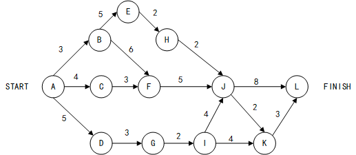

### 问题1
- A. 17
- B. 19
- C. 20
- D. 22
### 问题2
- A. 1
- B. 2
- C. 3
- D. 4

### 正确答案

D、B

### 解析

本题考查项目管理知识。
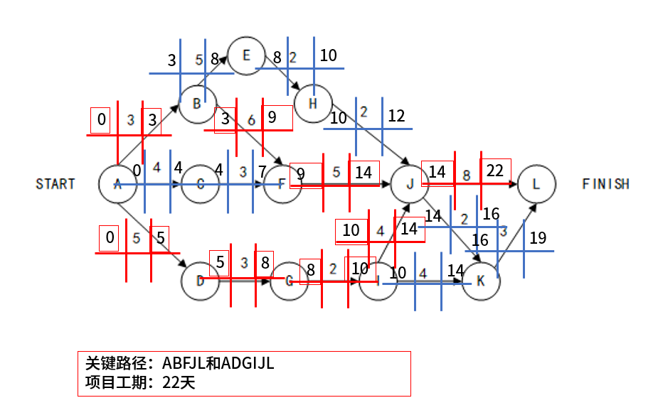
根据信息，正确答案选择D、B。

## 第17题（单选题）

软件项目成本估算模型COCOMO II中，体系结构阶段模型基于（D）进行估算。

- A. 应用程序点数量
- B. 功能点数量
- C. 复用或生成的代码行数
- D. 源代码的行数

### 正确答案

D

### 解析

本题考查项目成本估算模型。
COCOMO II模型也需要使用规模估算信息，在模型层次结构中有3种不同规模估算选择，即对象点、功能点和代码行。应用组装模型使用的是对象点；
早期设计阶段模型使用的是功能点，功能点可以转换为代码行；
体系结构模型使用的是代码行数。
所以本题选择D选项。

## 第18题（单选题）

某表达式的语法树如下图所示，其后缀式(逆波兰式)是（C）。
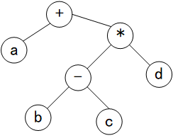

- A. abcd-+*
- B. ab-c+d*
- C. abc-d*+
- D. ab-cd+*

### 正确答案

C

### 解析

本题考查的是后缀表达式（逆波兰式）相关知识。
根据后缀表达式（逆波兰式）的定义，先遍历左节点，再遍历右节点，最后遍历根节点，对图示的语法树做后序遍历即可，结果为abc-d*+。
ABD描述与题意不符，本题选择C选项。

## 第19题（单选题）

用C/C++语言为某个应用编写的程序，经过（A）后形成可执行程序。

- A. 预处理、编译、汇编、链接
- B. 编译、预处理、汇编、链接
- C. 汇编、预处理、链接、编译
- D. 链接、预处理、编译、汇编

### 正确答案

A

### 解析

本题考查汇编语言的执行过程。
对于编译型语言，处理过程为：预处理-编译-汇编-链接。
因此，BCD描述与题意不符，本题选择A选项。

## 第20题（单选题）

在程序的执行过程中，系统用（C）实现嵌套调用（递归调用）函数的正确返回。

- A. 队列
- B. 优先队列
- C. 栈
- D. 散列表

### 正确答案

C

### 解析

本题考查递归调用相关知识。
在递归调用中，需要在前期存储某些数据，并在后面又以存储的逆序恢复这些数据，以提供之后使用的需求，因此，需要用到栈来实现递归。简单的说，就是在前行阶段，对于每一层递归，函数的局部变量、参数值以及返回地址都被压入栈中。在退回阶段，位于栈顶的局部变量、参数值和返回地址被弹出，用于返回调用层次中执行代码的其余部分，也就是恢复了调用的状态。
因此，ABD描述与题意不符，本题选择C选项。

## 第21题（单选题）

假设系统中有三个进程P1、P2和P3，两种资源R1、R2。如果进程资源图如图①和图②所示，那么（C）。
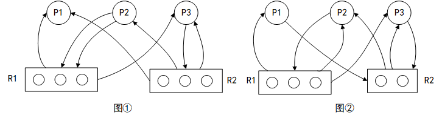

- A. 图①和图②都可化简
- B. 图①和图②都不可化简
- C. 图①可化简，图②不可化简
- D. 图①不可化简，图②可化简

### 正确答案

C

### 解析

本题考查的是进程资源图的分析。
图①当前状态下：
R1：已分配2个，剩余1个。
R2：已分配3个，剩余0个。
P1：已获得1个R1，1个R2，无其他资源需求，可化简，化简后释放当前1个R1，1个R2。
P2：已获得1个R2，仍需2个R1，此时R1资源不足，P2是阻塞结点。等待P1释放后可化简。
P3：已获得1个R1，1个R2，仍需1个R2，此时R2资源不足，P3是阻塞结点。等待P1释放后可化简。
图②当前状态下：
R1：已分配3个，剩余0个。
R2：已分配2个，剩余0个。
P1：已获得1个R1，仍需1个R2，此时R2资源不足，P1是阻塞结点。
P2：已获得1个R1，1个R2，仍需1个R1，此时R1资源不足，P2是阻塞结点。
P3：已获得1个R1，1个R2，仍需1个R2，此时R2资源不足，P3是阻塞结点。
所有结点均阻塞，无法化简。
ABD描述错误，本题选择C选项。

## 第22题（单选题）

假设计算机系统的页面大小为4KB，进程P的页面变换表如下表所示。若P要访问的逻辑地址为十六进制3C20H，那么该逻辑地址经过地址变换后，其物理地址应为（D）。
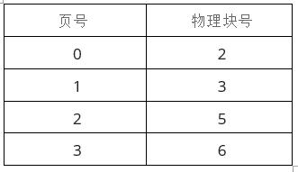

- A. 2048H
- B. 3C20H
- C. 5C20H
- D. 6C20H

### 正确答案

D

### 解析

本题考查的是页式存储相关的内容。
1、根据页面大小4KB（=212）可知，页内地址长度需要12位二进制表示。
2、根据逻辑地址3C20H，其中第12位二进制为页内地址，即对应十六进制第3位C20H为页内地址，剩余高位3H为页号，转换为十进制结果为3。
3、查表可得，页号3对应的物理块号为6（即十六进制6H），再拼接原页内地址C20H，即为最终的物理地址6C20H。ABC错误，本题选择D选项。

## 第23题（单选题）

某文件系统采用索引节点管理，其磁盘索引块和磁盘数据块大小均为1KB字节且每个文件索引节点有8个地址项iaddr[0]~iaddr[7]，每个地址项大小为4字节，其中iaddr[0]~iaddr[4]采用直接地址索引，iaddr[5]和iaddr[6]采用一级间接地址索引，iaddr[7] 采用二级间接地址索引。若用户要访问文件userA中逻辑块号为4和5的信息，则系统应分别采用（B/D）， 该文件系统可表示的单个文件最大长度是（  ）KB。

### 问题1
- A. 直接地址访问和直接地址访问
- B. 直接地址访问和一级间接地址访问
- C. 一级间接地址访问和一级间接地址访问
- D. 一级间接地址访问和二级间接地址访问
### 问题2
- A. 517
- B. 1029
- C. 65797
- D. 66053

### 正确答案

B、D

### 解析

本题是对索引文件结构的考查。
根据题干可得：
其中0~4号节点为直接索引，对应逻辑块号为0~4。
其中5~6号节点为一级间接索引方式，对应逻辑块号从5开始。本题第一空选择B选项。
每个索引盘大小为1KB，地址项大小为4B，故每个索引盘有（1KB/4B）=256个索引。
一级间接索引有2个盘块，共有512个索引，对应512个逻辑盘块。
其中7号节点为二级间接索引，共有256*256=65536个索引，对应65536个逻辑盘块。
单个文件最大为：(5+512+65536)*1KB=66053KB。本题第二空选择D选项。

## 第24题（单选题）

假设系统有n（n≥5）个进程共享资源R，且资源R的可用数为5。若采用PV操作，则相应的信号量S的取值范围应为（D）。

- A. -1~n-1
- B. -5~5
- C. -(n-1)~1
- D. -(n-5)~5

### 正确答案

D

### 解析

本题考查PV操作中信号量的分析。
PV信息量的取值表示资源数，最大值为初始可用资源5；
当信号量取值小于0时，可表示排队进程数，此时n个进程，最大排队数为n-5，信号量最小取值为-（n-5），ABC错误，本题选择D选项。
希赛点拨：
资源数是5，被进程使用。没进程使用的时候，资源数是5，来一个进程使用，就是5-1，再来一个进程使用就是（5-1）-1，以此类推，当有n个进程使用时，就是5-n，也就是-（n-5）。

## 第25题（单选题）

在支持多线程的操作系统中，假设进程P创建了线程T1、T2和T3， 那么以下叙述中错误的是（B）。

- A. 线程T1、 T2和T3可以共享进程P的代码
- B. 线程T1、T2可以共享P进程中T3的栈指针
- C. 线程T1、T2和T3可以共享进程P打开的文件
- D. 线程T1、T2和T3可以共享进程P的全局变量

### 正确答案

B

### 解析

本题考查的是线程的基本概念。
线程共享的内容包括：进程代码段、进程的公有数据（利用这些共享的数据，线程很容易实现相互之间的通讯）、进程打开的文件描述符、信号的处理器、进程的当前目录、进程用户ID与进程组ID 。
线程独有的内容包括：线程ID、寄存器组的值、线程的堆栈（比如，栈指针）、错误返回码、线程的信号屏蔽码。
综上所述，本题选择B选项。

## 第26题（单选题）

喷泉模型是一种适合于面向（A/D）开发方法的软件过程模型。该过程模型的特点不包括（  ）。

### 问题1
- A. 对象
- B. 数据
- C. 数据流
- D. 事件
### 问题2
- A. 以用户需求为动力
- B. 支持软件重用
- C. 具有迭代性
- D. 开发活动之间存在明显的界限

### 正确答案

A、D

### 解析

本题考查软件工程开发模型的特点。
喷泉模型是一种适合于面向对象开发方法的软件过程模型。
喷泉模型的特点包括：
- 以用户需求为动力：喷泉模型强调以用户的需求和期望为软件开发的主要驱动力。
- 支持软件重用：喷泉模型鼓励在软件开发过程中重用已有的代码、设计和其他资源，以提高开发效率和软件质量。
- 具有迭代性：喷泉模型支持迭代开发，即在软件开发过程中，可以不断地根据用户的反馈和需求变化对软件进行修改和优化。
喷泉模型的特点不包括：
- 开发活动之间存在明显的界限：喷泉模型认为软件开发过程是一个迭代和无缝的过程，各种活动（如需求分析、设计、编码和测试）之间没有明显的界限，而是相互交织、相互促进的。
综上所述，喷泉模型是一种适合于面向对象开发方法的软件过程模型，其特点不包括开发活动之间存在明显的界限。
所以正确答案为A，D。

## 第27题（单选题）

若某模块内所有处理元素都在同一个数据结构上操作，则该模块的内聚类型为（C）内聚。

- A. 逻辑
- B. 过程
- C. 通信
- D. 功能

### 正确答案

C

### 解析

本题考查软件工程的内聚性。
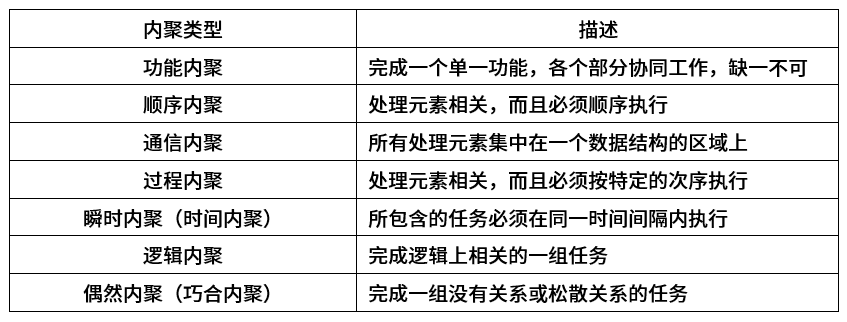
根据描述可得正确答案为C选项。

## 第28题（单选题）

软件质量属性中，（B）是指软件每分钟可以处理多少个请求。

- A. 响应时间
- B. 吞吐量
- C. 负载
- D. 容量

### 正确答案

B

### 解析

本题考查的是计算机性能指标的概念。
吞吐量：指在给定的时间内，系统所能处理的任务的数量。
响应时间：指系统对请求作出响应的时间。
容量：存储器所能存储的全部信息量称为该存储器的容量。
负载：负载能力一般指的是系统能够承受的最大任务数。
ACD描述不符合，本题选择B选项。

## 第29题（单选题）

提高程序执行效率的方法一般不包括（D）。

- A. 设计更好的算法
- B. 采用不同的数据结构
- C. 采用不同的程序设计语言
- D. 改写代码使其更紧凑

### 正确答案

D

### 解析

本题考查软件工程的设计原则。
改写代码仅使其结构上更紧凑，并不能提高执行效率问题。其他三项都能够提高执行效率。
故正确答案选择D选项。

## 第30题（单选题）

软件可靠性是指系统在给定的时间间隔内、在给定条件下无失效运行的概率。若MTTF和MTTR分别表示平均无故障时间和平均修复时间，则公式（A）可用于计算软件可靠性。

- A. MTTF/(1+MTTF)
- B. 1/(1+MTTF)
- C. MTTR/(1+MTTR)
- D. 1/(1+MTTR)

### 正确答案

A

### 解析

本题考查的是计算机性能指标的概念。
可靠性可以用MTTF/(1+MTTF)来度量。
MTBF/(1+MTBF)可以用来度量可用性。
1/(1+MTTR)可以用来度量可维护性。没有MTTR/(1+MTTR)的表示。
BCD描述错误，本题选择A选项。

## 第31题（单选题）

用白盒测试技术对下面流程图进行测试，设计的测试用例如下表所示。至少采用测试用例（A/D）才可以实现语句覆盖；至少采用测试用例（  ）才可以实现路径覆盖。
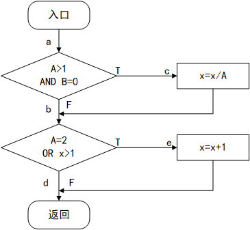
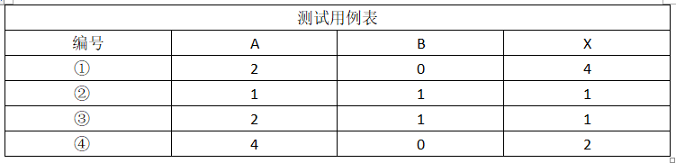

### 问题1
- A. ①
- B. ②
- C. ③
- D. ④
### 问题2
- A. ①
- B. ①②
- C. ③④
- D. ①②③④

### 正确答案

A、D

### 解析

本题考查软件工程软件测试问题。
根据测试用例：
用例①可以满足覆盖所有语句，满足语句覆盖。
用例①可以满足路径ace，用例②可以满足路径abd，用例③可以满足路径abe，用例④可以满足路径acd。所以满足路径覆盖需要测试用例1、2、3、4。
故正确答案选择A、D选项。

## 第32题（单选题）

面向对象程序设计语言C++、JAVA中，关键字（D）可以用于区分同名的对象属性和局部变量名。

- A. private
- B. protected
- C. public
- D. this

### 正确答案

D

### 解析

本题考查面向对象基本属性。
public：表示全局，类内部外部子类都可以访问；
private：表示私有的，只有本类内部可以使用；
protected：表示受保护的，只有本类或子类或父类中可以访问；
this：可以区分同名的对象属性和局部变量名。
故本题正确答案选择D选项。

## 第33题（单选题）

采用面向对象方法进行系统开发时，以下与新冠病毒有关的对象中，存在“一般-特殊“关系的是（A）。

- A. 确诊病人和治愈病人
- B. 确诊病人和疑似病人
- C. 医生和病人
- D. 发热病人和确诊病人

### 正确答案

A

### 解析

本题是对面向对象基本概念的考查。
特殊/一般关系也叫作泛化（Generalization）关系。特殊元素（子元素）的对象可替代一般元素（父元素）的对象，父元素是子元素的泛化（一般表示），子元素是父元素的特殊化。用这种方法，子元素共享了父元素的结构和行为。
在一般-特殊关系中，可以理解为特殊元素（即子类对象）是一般元素（即父类对象）的一种特殊体现。
本题中，“采用面向对象方法进行系统开发时，以下与新冠病毒有关的对象中”：
A选项“确诊病人”与“治愈病人”（“治愈病人”是一种特殊的“确诊病人”）存在一般-特殊的关系。本题选择A选项。
B选项“确诊病人”不一定是“疑似病人”并且 “疑似病人”  不一定成为“确诊病人”，不满足一般-特殊的关系 。
C选项“医生”不一定是“病人”并且“病人”   不一定是 “医生”  ，不满足一般-特殊的关系。
D选项“发热病人”不一定是“确诊病人”并且“确诊病人”也不一定是“发热病人”，不满足一般-特殊的关系

## 第34题（单选题）

进行面向对象系统设计时，针对包中的所有类对于同一类性质的变化；一个变化若对一个包产生影响，则将对该包中的所有类产生影响，而对于其他的包不造成任何影响。这属于（D）设计原则。

- A. 共同重用
- B. 开放-封闭
- C. 接口分离
- D. 共同封闭

### 正确答案

D

### 解析

本题考查面向对象的设计原则。
A选项，共同重用原则：面向对象编程术语，指一个包中的所有类应该是共同重用的。如果重用了包中的一个类，那么也就相当于重用了包中的所有类，与题目描述不符。
B选项，开放-封闭原则：对扩展开放，对修改封闭，与题目描述不符。
C选项，接口隔离原则：使用多个专门的接口比使用单一的总接口要好，与题目描述不符。
D选项，共同封闭原则：包中的所有类对于同一种性质的变化应该是共同封闭的。一个变化若对一个封闭的包产生影响，则将对该包中的所有类产生影响，而对于其他包则不造成任何影响。面向对象设计的原则之一。与题目描述相符，故D选项正确。
故本题选择D选项。

## 第35题（单选题）

多态有不同的形式，（C）的多态是指同一个名字在不同上下文中所代表的含义不同。

- A. 参数
- B. 包含
- C. 过载
- D. 强制

### 正确答案

C

### 解析

本题考查面向对象概念。
A、参数多态：应用广泛、最纯的多态。
B、包含多态：同样的操作可用于一个类型及其子类型。包含多态一般需要进行运行时的类型检查。包含多态在许多语言中都存在，最常见的例子就是子类型化，即一个类型是另外一个类型的子类型。
C、过载多态：同一个名（操作符﹑函数名）在不同的上下文中有不同的类型。 目前软设考查比较多的是过载多态，与题目描述相符，C选项正确。
D、强制多态：编译程序通过语义操作，把操作对象的类型强行加以变换，以符合函数或操作符的要求。
故本题选择C选项。

## 第36题（单选题）

关于以下UML类图的叙述中，错误的是（D）。
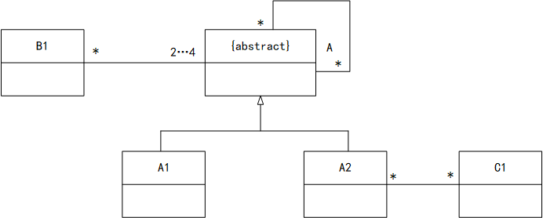

- A. 一个A1的对象可能与一个A2的对象关联
- B. 一个A的非直接对象可能与一个A1 的对象关联
- C. 类B1的对象可能通过A2与C1的对象关联
- D. 有可能A的直接对象与B1的对象关联

### 正确答案

D

### 解析

本题考查面向对象的知识。
本题图中B1与A类的继承层次关系有关联关系，1个A的对象可以与多个B1的对象关联,1个B1对象可以与2到多个A的对象关联;1个A的对象可以与多个A的对象关联;1个A2的对象与多个C1类的对象关联，1个C1的对象与多个A2的对象关联;那么1个B1对象可以通过A2与C1的对象关联。因为A标识为{abstract}，即抽象类，抽象类不能直接进行实例化，即没有直接对象，只能有非直接对象，即子类的对象，因此，所有A的对象都是其子类的对象。
故本题选择D选项。

## 第37题（单选题）

UML图中，对象图展现了（C/D），（  ）所示对象图与下图所示类图不一致。
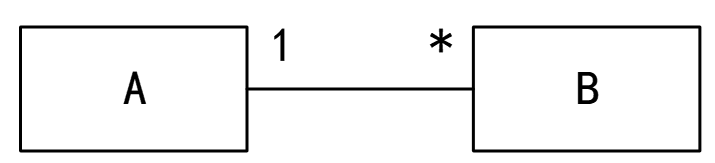

### 问题1
- A. 一组对象、接口、协作和它们之间的关系
- B. 一组用例、参与者以及它们之间的关系
- C. 某一时刻一组对象以及它们之间的关系
- D. 以时间顺序组织的对象之间的交互活动
### 问题2
- A. 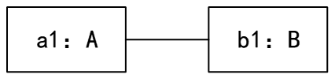
- B. 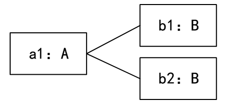
- C. 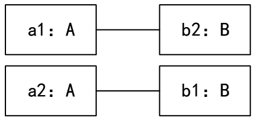
- D. 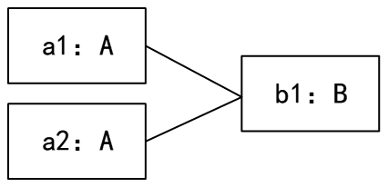

### 正确答案

C、D

### 解析

本题考查UML图示。
对象图：展现了某一个时刻一组对象以及它们之间的关系。
类图：展现了一组对象、接口、协作和它们之间的关系。
用例图：展现了一组用例、参与者以及它们之间的关系。
序列图：是场景的图形化表示，描述了以时间顺序组织的对象之间的交互活动。
多重度：图示表示的是1个A可以对应多个B，1个B只能对应1个A 。
故正确答案选择C。
D图错误。
A和B是1对多关系，D图错误。

## 第38题（单选题）

某快餐厅主要制作并出售儿童套餐，一般包括主餐（各类比萨)、饮料和玩具，其餐品种类可能不同，但制作过程相同。前台服务员（Waiter） 调度厨师制作套餐。欲开发一软件，实现该制作过程，设计如下所示类图。该设计采用（A/C/A/D）模式将一个复杂对象的构建与它的表示分离，使得同样的构建过程可以创建不同的表示。其中，（  ）构造一个使用Builder接口的对象。该模式属于（  ）模式，该模式适用于（  ）的情况。
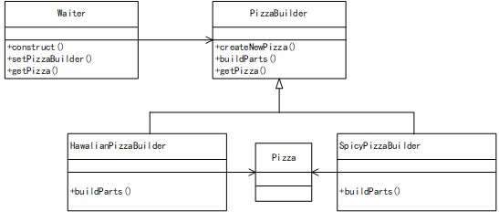

### 问题1
- A. 生成器（Builder）
- B. 抽象工厂（Abstract Factory）
- C. 原型（Prototype）
- D. 工厂方法（Factory Method）
### 问题2
- A. PizzaBuilder
- B. SpicyPizzaBuilder
- C. Waiter
- D. Pizza
### 问题3
- A. 创建型对象
- B. 结构型对象
- C. 行为型对象
- D. 结构型类
### 问题4
- A. 当一个系统应该独 立于它的产品创建、构成和表示时
- B. 当一个类希望由它的子类来指定它所创建的对象的时候
- C. 当要强调一系列相关的产品对象的设计以便进行联合使用时
- D. 当构造过程必须允许被构造的对象有不同的表示时

### 正确答案

A、C、A、D

### 解析

本题是对设计模式应用的考查。
本题类图中有明确的builder关键字，是生成器模式。并且题干描述“将一个复杂对象的构建与它的表示分离，使得同样的构建过程可以创建不同的表示”是
生成器（构建器）模式的意图  ，第一空选择A选项。
（2）生成器模式类图如下：
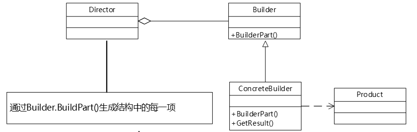
Builder：抽象建造者，为创建一个Product对象各个部件指定抽象接口，把产品的生产过程分解为不同的步骤，从而使具体建造者在具体的建造步骤上具有更多弹性，从而创造出不同表示的产品。
ConcreteBuilder：具体建造者，实现Builder接口，构造和装配产品的各个部件定义并明确它所创建的表示，提供一个返回这个产品的接口。
Director：指挥者，构建一个使用Builder接口的对象。即对应本题waiter，第二空选择C选项。
Product：产品角色，被构建的复杂对象，具体产品建造者，创建该产品的内部表示并定义它的装配过程。包含定义组成组件的类，包括将这些组件装配成最终产品的接口。
（3）生成器模式是创建型对象模式，第三空选择A选项。
（4）生成器模式的适用场景（复杂对象构造）：
当创建复杂对象的算法应该独 立于该对象的组成部分以及它们的装配方式时。
当构造过程必须允许被构造的对象有不同的表示时。第四空选择D选项。
“当一个系统应该独 立于它的产品创建、构成和表示时”是原型模式的适用场景。
“当一个类希望由它的子类来指定它所创建的对象的时候”是工厂模式的适用场景。
“当要强调一系列相关的产品对象的设计以便进行联合使用时”是抽象工厂模式的适用场景。

## 第39题（单选题）

函数foo()、hoo()定义如下，调用函数hoo()时，第一个参数采用传值(call by value)方式，第二个参数采用传引用(call by reference)方式。设有函数调用foo(5)，那么“print(x)”执行后输出的值为（A）。
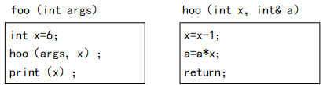

- A. 24
- B. 25
- C. 30
- D. 36

### 正确答案

A

### 解析

本题考查的是函数调用过程（值调用与引用调用相关知识）。
根据题干描述的调用过程，hoo()第一个参数是传值调用，第二个参数是引用调用，因此，在hoo()中对a的修改最终会影响到原foo()函数中传递的参数x，也就是最终x打印的值。
根据hoo()函数过程，x初始传参为原args=5，此时x=x-1=4（注意这里的x是局部变量，只在hoo()使用），a初始传参为原x=6，此时a=a*x=6*4=24，最终全局变量x值为24。（注意这里的原x是全局变量，在hoo()参数中可以理解为别名为a，现x是局部变量，也就是之前求取的4）。
本题选择A选项。

## 第40题（单选题）

程序设计语言的大多数语法现象可以用CFG (上下文无关文法)表示。下面的CFG产生式集用于描述简单算术表达式，其中+、-、*表示加、减、乘运算，id表示单个字母表示的变量，那么符合该文法的表达式为（A）。
P：E→E+T|E-T|T
T→T*F|F
F→-F|id

- A. a+-b-c
- B. a*(b+c)
- C. a*-b+2
- D. -a/b+c

### 正确答案

A

### 解析

本题考查文法推导树相关知识。
根据本题的语法推导式，可以发现，这里没有终结符"("、")"、"/"，因此选项B和D错误。
id表示单个字母表示的变量不能表示数字2，所以这里无法识别字符2，C选项错误。
也可以进行推导，在推导的过程中，会发现"*"只能通过T推导，此时必定经过了E+T或E-T，不可能出现数字2。因此C错误。
只有A能够被推导，推导过程如下：
（1）通过E→E-T，从起始符E得到E-T；
（2）通过E→E+T，将上面的E展开为E+T，得到E+T-T；
（3）通过E→T→F→id→单个字母a；
（4）通过T→F→-F→-id→单个字母-b；
（5）通过T→F→id→单个字母c。
可以从起始符E得到a+-b-c，即为A选项。
因此，BCD描述与题意不符，本题选择A选项。

## 第41题（单选题）

某有限自动机的状态转换图如下图所示，该自动机可识别（B）。
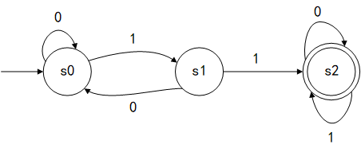

- A. 1001
- B. 1100
- C. 1010
- D. 0101

### 正确答案

B

### 解析

本题考查的是有限自动机相关知识。
A选项从s0出发，1001到达s1，没有到达终态s2，不能被自动机识别。
B选项从s0出发，1100成功到达终态s2，可以被自动机识别。
C选项从s0出发，1010到达s0，没有到达终态s2，不能被自动机识别。
D选项从s0出发，0101到达s1，没有到达终态s2，不能被自动机识别。
因此，ACD描述与题意不符，本题选择B选项。

## 第42题（单选题）

某高校信息系统设计的分E-R图中，人力部门定义的职工实体具有属性：职工号、姓名、性别和出生日期；教学部门定义的教师实体具有属性：教师号、姓名和职称。这种情况属于（C/B），在合并E-R图时，（  ）解决这一冲突。

### 问题1
- A. 属性冲突
- B. 命名冲突
- C. 结构冲突
- D. 实体冲突
### 问题2
- A. 职工和教师实体保持各自属性不变
- B. 职工实体中加入职称属性，删除教师实体
- C. 教师也是学校的职工，故直接将教师实体删除
- D. 将教师实体所有属性并入职工实体，删除教师实体

### 正确答案

C、B

### 解析

本题是对数据库概念设计的考查。
关于冲突的概念：
A选项属性冲突。同一属性可能会存在于不同的分E-R图，由于设计人员不同或是出发点不同，对属性的类型、取值范围和数据单位等可能会不一致。
B选项命名冲突。相同意义的属性在不同的分E-R图中有着不同的命名，或是名词相同的属性在不同的分E-R图中代表着不同的意义。
C选项结构冲突。同一实体在不同的分E-R图中有不同的属性，同一对象在某一分E-R图中被抽象为实体，而在另一分E-R图中又被抽象为属性，需要统一。（教师实体有着职工号和教师号这两个不同的属性）本题属于结构冲突，选择C选项。
D选项没有实体冲突的说法。
根据题干来看，因为存在冲突，需要某些操作去解决，所以A选项保持不变无法解决问题。C选项直接删除教师实体，会丢失教师中的职称属性。D选项并入的方式，会重复记录姓名属性。只有B选项相对合适一些，将职称属性加入职工实体，然后删除教师实体，过程中还需要对属性名称进行统一调整。本题选择B选项。

## 第43题（单选题）

假设关系R < U, F > ， U={A,B,C,D}，F= {A→BC,AC→D,B→D}，那么在关系R中（C）。

- A. 不存在传递依赖，候选关键字A
- B. 不存在传递依赖，候选关键字AC
- C. 存在传递依赖A→D，候选关键字A
- D. 存在传递依赖B→D，候选关键字C

### 正确答案

C

### 解析

本题考查的是候选键相关内容。
根据函数依赖，首先找到入度为0的属性集合A，又根据A→BC，这里根据amstrong公理中的分解规则，可以得到A→B，A→C，同时存在B→D，此时有传递函数依赖A→D，可以通过A遍历全图，因此候选键为A。本题选择C选项。

## 第44题（单选题）

关系R、S如下表所示，R⋈S的结果集为（B/D），R、S的左外连接、右外连接和完全外连接的元组个数分别为（  ）。
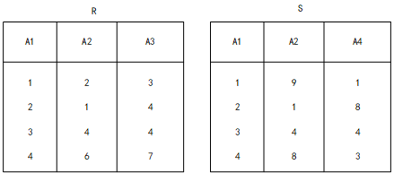

### 问题1
- A. { (2,1,4),(3,4,4)}
- B. { (2,1,4,8),(3,4,4,4)}
- C. { (1.4.2,1.8),(3.4.4.3,4,4)}
- D. { (1,2,3,1,9,1),(2,1,4,2,1,8),(3,4,4,3,4,4).(4,6,7.4,8,3)}
### 问题2
- A. 2,2,4
- B. 2,2,6
- C. 4,4,4
- D. 4,4,6

### 正确答案

B、D

### 解析

本题考查的是关系代数相关内容。
第一空根据自然连接的结果，属性列数是二者之和减去重复属性列，所以结果有4个属性列，只有B选项满足要求。
元组行满足同名属性列取值相等，B选项同样满足要求。
第二空左外连接、右外连接、完全外连接，在软设中考查较少。
左外连接：取出左侧关系中所有与右侧关系中任一元组都不匹配的元组，用空值NULL填充所有来自右侧关系的属性，将结果加入自然连接的结果中。结果如下：
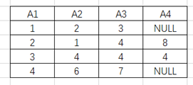
左外连接共有4个元组。
右外连接：取出右侧关系中所有与左侧关系中任一元组都不匹配的元组，用空值NULL填充所有来自左侧关系的属性，将结果加入自然连接的结果中。结果如下：
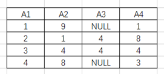
右外连接共有4个元组。
完全外连接：完成左外连接和右外连接操作，结果如下：
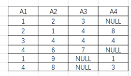
完全外连接共有6个元组。
本题第二空选择D选项。

## 第45题（单选题）

某企业信息系统采用分布式数据库系统。“当某一场地故障时，系统可以使用其他场地上的副本而不至于使整个系统瘫痪”称为分布式数据库的（C）。

- A. 共享性
- B. 自治性
- C. 可用性
- D. 分布性

### 正确答案

C

### 解析

本题考查的是分布式数据库的基本概念。
在分布式数据库系统中，
A共享性是指数据存储在不同的节点数据共享，与题目描述不符；
B自治性是指每个节点对本地数据都能独立管理，与题目描述不符；
C可用性是指当某一场地故障时，系统可以使用其他场地上的副本而不至于使整个系统瘫痪，与题目描述相符，C选项正确；
D分布性是指在不同场地上的存储，与题目描述不符。
本题选择C选项。

## 第46题（单选题）

以下关于Huffman（哈夫曼）树的叙述中，错误的是（D）。

- A. 权值越大的叶子离根节点越近
- B. Huffman（哈夫曼）树中不存在只有一个子树的节点
- C. Huffman（哈夫曼）树中的节点总数一定为奇数
- D. 权值相同的节点到树根的路径长度一定相同

### 正确答案

D

### 解析

本题考查的是哈夫曼树相关知识。
根据哈夫曼树的构造过程，权值越大的叶子节点选择越靠后也就离根越近，A选项描述正确。
每一次构造都会选择两个权值，所以哈夫曼树中不存在只有一个子树的节点，B选项描述正确。
二叉树存在一个特定度为0的节点（叶子节点）记作n0，度为2的节点记作n2，满足n2+1= n0。哈夫曼树只有度为0和度为2的节点，二者必定差值为1，因此，节点总数即二者之和。n0+n2=（n2+1）+n2=2n2+1时，必定为奇数，所以C选项正确。
对于D选项，权值相同的节点可能会因为构造的形态不同，导致构造结果不一样，权值不一样，所以描述是错误的。本题选择错误的描述，因此选择D选项。

## 第47题（单选题）

通过元素在存储空间中的相对位置来表示数据元素之间的逻辑关系，是（A）的特点。

- A. 顺序存储
- B. 链表存储
- C. 索引存储
- D. 哈希存储

### 正确答案

A

### 解析

本题考查数据结构与算法基础。
顺序存储时，通过元素在存储空间中的相对位置来表示数据元素之间的逻辑关系，元素的逻辑相对位置与物理相对位置是一致的。
链表存储：链表是一种物理存储单元上非连续、非顺序的存储结构，数据元素的逻辑顺序是通过链表中的指针链接次序实现的。
索引存储：分别存放数据元素和元素间关系的存储方式。
哈希存储：哈希存储的基本思想是以关键字Key为自变量，通过一定的函数关系（散列函数或哈希函数），计算出对应的函数值（哈希地址），以这个值作为数据元素的地址，并将数据元素存入到相应地址的存储单元中。
因此，BCD描述与题意不符，本题选择A选项。

## 第48题（单选题）

在线性表L中进行二分查找，要求L（C）。

- A. 顺序存储，元素随机排列
- B. 双向链表存储，元素随机排列
- C. 顺序存储，元素有序排列
- D. 双向链表存储，元素有序排列

### 正确答案

C

### 解析

本题考查二分查找相关知识。
二分查找的前提条件是顺序存储，且有序排列。
因此，ABD描述与题意不符，本题选择C选项。

## 第49题（单选题）

某有向图如下所示，从顶点v1出发对其进行深度优先遍历，可能得到的遍历序列是（D/B）；从顶点v1出发对其进行广度优先遍历，可能得到的遍历序列是（  ）。
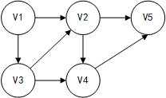
①v1 v2 v3 v4 v5
②v1 v3 v4 v5 v2
③v1 v3 v2 v4 v5
④v1 v2 v4 v5 v3

### 问题1
- A. ①②③
- B. ①③④
- C. ①②④
- D. ②③④
### 问题2
- A. ①②
- B. ①③
- C. ②③
- D. ③④

### 正确答案

D、B

### 解析

本题考查图的遍历操作。
根据图示：
第一空，作为深度遍历，v1-v2，下一个遍历的节点，一定是有v2指向的v4或v5，序列①不符合要求。因此本题排除①后，选择D选项。
作为广度遍历，v1下一个访问的一定是其邻接顶点v2或v3，这2个顶点访问结束后，才能往后进行遍历，因此只有序列①③符合要求 ，此处选择B选项。

## 第50题（单选题）

对数组A=(2,8,7,1,3,5,6,4)用快速排序算法的划分方法进行一趟划分后得到的数组A为（C/C）（非递减排序，以最后一个元素为基准元素）。进行一趟划分的计算时间为（  ）。

### 问题1
- A. (1,2,8,7,3,5,6,4)
- B. (1,2,3,4,8,7,5,6)
- C. (2,3,1,4,7,5,6,8)
- D. (2,1,3,4,8,7,5,6)
### 问题2
- A. O(1)
- B. O(lgn)
- C. O(n)
- D. O(nlgn)

### 正确答案

C、C

### 解析

本题考查的是排序算法。
本题根据快速排序的过程，首先选定基准元素为最后一个元素（题干给出的要求），下面进行排序过程：
（1）基准元素4与另一端待排第一个元素2进行比较，满足非递减，不需要交换；
（2）基准元素4与另一端待排第一个元素8进行比较，不满足非递减，交换位置，此时序列为（2，4，7，1，3，5，6，8）；
（3）基准元素4与另一端待排第一个元素6进行比较，满足非递减，不需要交换；
（4）基准元素4与另一端待排第一个元素5进行比较，满足非递减，不需要交换；
（5）基准元素4与另一端待排第一个元素3进行比较，不满足非递减，交换位置，此时序列为（2，3，7，1，4，5，6，8）；
（6）基准元素4与另一端待排第一个元素7进行比较，不满足非递减，交换位置，此时序列为（2，3，4，1，7，5，6，8）；
（7）基准元素4与另一端待排第一个元素1进行比较，不满足非递减，交换位置，此时序列为（2，3，1，4，7，5，6，8）。
综上，本题第一空选择C选项。
因为一趟划分的过程会与整个序列n个元素进行比较，因此一趟划分的时间复杂度为O(n)，第二空选择C选项。

## 第51题（单选题）

某简单无向连通图G的顶点数为n，则图G最少和最多分别有（B）条边。

- A. n,n2/2
- B. n-1,n*(n-1)/2
- C. n,n*(n-1)/2
- D. n-1,n2/2

### 正确答案

B

### 解析

本题考查图的基本概念。
方法一：本题可以用实例法进行分析，简单画出一个无相连通图，比如两个顶点相连接，此时结点n=2，边最少为1，最多也为1，满足要求的只有B选项。
方法二：一个无向连通图要满足连通性，至少需要n−1条边。这是因为，如果我们从n个顶点中任选一个作为起点，然后依次连接其他n−1个顶点（确保每个顶点都与起点相连），就可以得到一个连通图，并且这样的图只有n−1条边。
接下来，考虑无向连通图G的最多边数。
对于无向图，任意两个顶点之间都可以有一条边，因此最多有n(n−1)/2条边（因为每条边连接两个顶点，但每条边被计算了两次，所以要除以2）。
综上，无向连通图G的最少边数是n−1，最多边数是n(n−1)/2。
因此，ACD描述与题意不符，本题选择B选项。

## 第52题（单选题）

根据渐进分析，表达式序列：n4, lgn, 2n, 1000n, n2/3, n!从低到高排序为（D）。

- A. lgn,1000n,n2/3,n4,n!,2n
- B. n2/3,1000n,lgn,n4,n!,2n
- C. lgn,1000n,n2/3,2n,n4,n!
- D. lgn,n2/3,1000n,n4,2n,n!

### 正确答案

D

### 解析

本题考查时间复杂度的相关知识。
根据选项来看，1000n的渐进表示就是O(n)。因此lgn规模是小于1000n的，B选项错误。
n2/3是小于n的，AC选项错误。
因此，ABC描述错误，本题选择D选项。

## 第53题（单选题）

采用DHCP动态分配IP地址，如果某主机开机后没有得到DHCP服务器的响应。则该主机获取的IP地址属于网络（D）。

- A. 202.117.0.0/24
- B. 192.168.1.0/24
- C. 172.16.0.0/16
- D. 169.254.0.0/16

### 正确答案

D

### 解析

本题考查的是DHCP协议的应用。
根据题干中主机开机之后没有得到DHCP服务器的响应，可以知道客户端为该主机请求网络地址没有响应，则放弃请求为网卡自动配上一个私有IP地址，地址段为169.254.0.0/16。
所以D选项正确。

## 第54题（单选题）

在浏览器的地址栏中输入xxxyftp.abc.can.cn，在该URL中（A）是要访问的主机名。

- A. xxxyftp
- B. abc
- C. can
- D. cn

### 正确答案

A

### 解析

本题考查的是URL格式。
一个标准的URL格式如下：
协议：//主机名.域名.域名后缀或IP地址（：端口号）/目录/文件名。
本题xxxyftp是主机名，选择A选项。

## 第55题（单选题）

当接收邮件时，客户与POP3服务器之间通过（B/D）建立连接，所使用的端口是（  ）。

### 问题1
- A. HTTP
- B. TCP
- C. UDP
- D. HTTPS
### 问题2
- A. 52
- B. 25
- C. 1100
- D. 110

### 正确答案

B、D

### 解析

本题考查的是计算机网络中的·TCP/IP协议基础
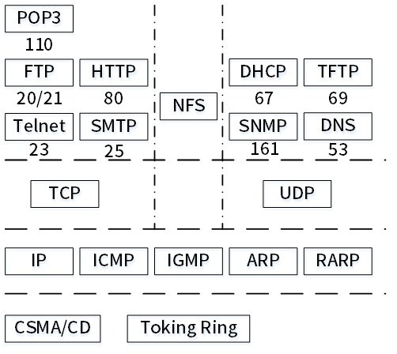
POP3是基于TCP协议的，默认端口110。

## 第56题（单选题）

因特网中的域名系统（Domain Name System）是一个分层的域名，在根域下面是顶级域，以下顶级域中，（D）属于国家顶级域。

- A. NET
- B. EDU
- C. COM
- D. UK

### 正确答案

D

### 解析

本题考查域名分类相关知识。
常见域名分类如下：
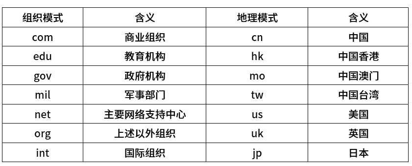
本题中只有D选项UK属于国家顶级域。

## 第57题（单选题）

Regardless of how well designed, constructed, and tested a system or application may be, errors or bugs will inevitably occur. Once a system has been（B/A/C/D/A）,it enters operations and support.
Systems support is the ongoing technical support for user, as well as the maintenance required to fix any errors, omissions,or new requirements that may arise. Before an information system can be（  ）, it must be in operation. System operation is the day-to-day, week-to-week, month-to-month, and year-t-year（  ）of an information system's business processes and application programs.
Unlike systems analysis, design, and implementation, systems support cannot sensibly be（  ）into actual phases that a support project must perform. Rather, systems support consists of four ongoing activities that are program maintenance, system recovery, technical support, and system enhancement.Each activity is a type of support project that is（  ）by a particular problem,event, or opportunity encountered with the implemented system.

### 问题1
- A. designed
- B. implemented
- C. investigated
- D. analyzed
### 问题2
- A. supported
- B. tested
- C. implemented
- D. constructed
### 问题3
- A. construction
- B. maintenance
- C. execution
- D. implementation
### 问题4
- A. broke
- B. formed
- C. composed
- D. decomposed
### 问题5
- A. triggered
- B. leaded
- C. caused
- D. produced

### 正确答案

B、A、C、D、A

### 解析

无论系统或应用程序设计、构造和测试得多么完善，错误或故障总是会不可避免地出现。一旦一个系统实现了，这个系统就进入运行和支持阶段。
   系统支持是对用户的不间断的技术支持以及改正错误、遗漏或者可能产生的新需求所需的维护。在信息系统可以被支持之前，它必须首先投入运行。系统运行是信息系统的业务过程和应用程序逐日的、逐周的、逐月的和逐年的执行。
   不像系统分析、设计和实现那样，系统支持不能明显地分解成一些系统支持项目必须执行的任务阶段。相反，系统支持包括4个进行中的活动，这些活动是程序维护、系统恢复、技术支持和系统改进。每个活动都是一类系统支持项目，这些活动由已经实现的系统遇到的特定问题、事件或机会触发。
A、 设计
B、 实施
C、 调查
D、 分析
A、支持
B、测试
C、实施
D、建造
A、结构
B、维护
C、执行
D、实施
A、划分
B、形成
C、组成
D、分解
A、触发
B、导致
C、引起
D、产生
