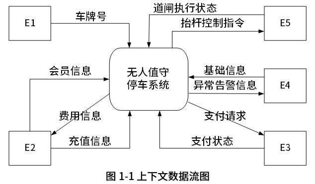
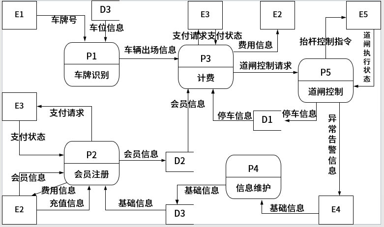
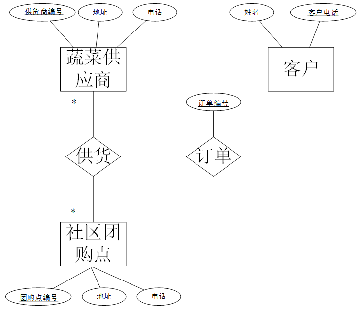
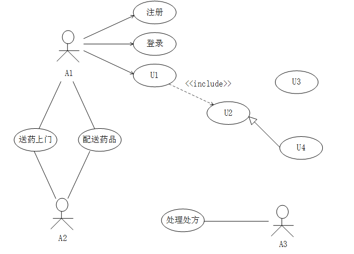
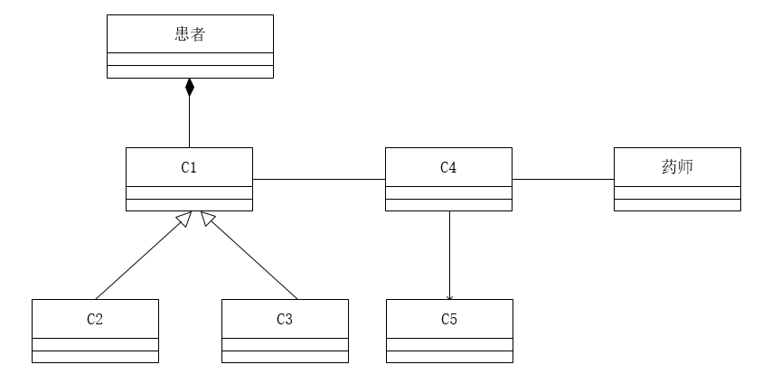
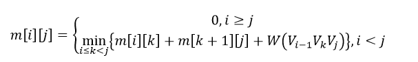

# 2021上半年案例题

- 来源标题: 2021年上半年软件设计师考试应用技术真题（专业解析+参考答案）
- 试卷介绍页: https://wangxiao.xisaiwang.com/tiku2/136/tp20419208.html?cid=136
- 练习页: https://wangxiao.xisaiwang.com/tiku2/exam534903360.html
- 题量: 6

## 第1题（案例题）

阅读下列说明和图，回答问题1至问题4
【说明】
某停车场运营方为了降低运营成本，减员增效，提供良好的停车体验，欲开发无人值守停车系统，该系统的主要功能是∶
1、 信息维护。管理人员对车位（总数、空余车位数等）计费规则等基础信息进行设置。
2、 会员注册。车主提供手机号、车牌号等信息进行注册，提交充值信息 （等级、绑定并授权支付系统进行充值或交费的支付账号） 不同级别和充值额度享受不同停车折扣点。
3、车牌识别。 当车辆进入停车场时，若有 （空余车位数大于1），自动识别车牌号后进行道闸控制，当车主开车离开停车场时，识别车牌号，计费成功后，请求道闸控制。
4、 计费。 更新车辆离场时间，根据计费规则计算出停车费用，若车主是会员，提示停车费用：若储存余额够本次停车费用，自动扣费，更新余额，若储值余额不足，自动使用授权缴费账号请求支付系统进行支付，获取支付状态。若非会员临时停车，提示停车费用，车主通过扫描费用信息中的支付码调用支付系统自助交费，获取支付状态。
5、 道闸控制。 根据道闸控制请求向道闸控制系统发送放行指令和接收道闸执行状态。若道闸执行状态为正常放行时，对入场车辆，将车牌号及其入场时间信息存入停车记录，修改空余车位数；对出场车辆更新停车状态，修改空余车位数。当因道闸重置系统出现问题（断网断电或是故障为抬杠等情况），而无法在规定的时间内接收到其返回的执行状态正常放行时，系统向管理人员发送异常告警信息，之后管理人员安排故障排查处理，确保车辆有序出入停车场。
现采用结构化方法对无人值守停车系统进行分析与设计，获得如图1-1所示的上下文数据流图和图1-2所示的 0层数据流图。

                                图1-2 0层数据流图

### 补充题面

【问题1】（5分）
使用说明中的词语，给出图1-1中实体E1-E5的名称。
【问题2】（3分）
  使用说明中的词语，给出图1-2中数据存储D1-D3的名称。 
【问题3】（4分）
  使用说明中的词语，补充图1-2中缺失的数据流及其起点和终点。 
【问题4】（3分）
  根据说明，用结构化语言描述“道闸控制”加工逻辑。

## 第2题（案例题）

阅读下列说明，回答问题1至问题3，将解答填入答题纸的对应栏内。
【说明】
某社区蔬菜团购网站，为规范商品收发流程，便于查询客户订单情况，需要开发一个信息系统。请根据下述需求描述完成该系统的数据库设计。
【需求描述】
（1）记录蔬菜供应商的信息，包括供应商编号、地址和一个电话。
（2）记录社区团购点的信息，包括团购点编号、地址和一个电话。
（3）记录客户信息，包括客户姓名和一个电话。客户可以在不同的社区团购点下订单，不直接与蔬菜供应商发生联系。
（4）记录客户订单信息，包括订单编号、团购点编号、客户电话、订单内容和日期。
【概念模型设计】
根据需求阶段收集的信息，设计的实体联系图（不完整）如图2-1所示。

                                                                                         图2-1 实体联系图
【逻辑结构设计】
根据概念模型设计阶段完成的实体联系图，得出如下关系模式（不完整）：
蔬菜供货商（供货商编号，地址，电话）
社区团购点（团购点编号，地址，电话）
供货（供货商编号，（a））
客户（姓名，客户电话）
订单（订单编号，团购点编号，订单内容，日期，（b））

### 补充题面

【问题1】(6分)
根据问题描述，补充图2-1的实体联系图。
【问题2】 (4分)
补充逻辑结构设计结果中的(a)、(b)两处空缺及完整性约束关系。
【问题3】(5分)
若社区蔬菜团购网站还兼有代收快递的业务，请增加新的“快递”实体，并给出客户实体和快递实体之间的“收取”联系，对图2-1进行补充。“快递” 关系模式包括快递编号、客户电话和日期。

## 第3题（案例题）

阅读下列说明和图，回答问题1至问题3，将解答填入答题纸的对应栏内。
【说明】
某中医医院拟开发一套线上抓药APP，允许患者凭借该医院医生开具的处方线上抓药，并提供免费送药上门服务。该系统的主要功能描述如下：
（1）注册。患者扫描医院提供的二维码进行注册，注册过程中，患者需提供其病历号，系统根据病历号自动获取患者基本信息。
（2）登录。已注册的患者可以登录系统进行线上抓药，未注册的患者系统拒绝其登录。
（3）确认处方。患者登录后，可以查看医生开具的所有处方。患者选择需要抓药的处方和数量（需要抓几副药）， 同时说明是否需要煎制。选择取药方式：自行到店取药或者送药上门，若选择送药上门，患者需要提供收货人姓名、联系方式和收货地址。系统自动计算本次抓药的费用，患者可以使用微信或支付宝等支付方式支付费用。支付成功之后，处方被发送给药师进行药品配制。
（4）处理处方。药师根据处方配置好药品，若患者要求煎制，药师对配置好的药品进行煎制。煎制完成，药师将对该处方设置已完成。若患者选择的是自行取药，取药后确认已取药。
（5）药品派送。处方完成后，对于选择送药上门的患者，系统将给快递人员发送药品的配置信息，等待快递人员来取药；并给患者发送收获验证码。
（6）送药上门。快递人员将配置好的药品送到患者指定的收货地址。患者收获时，向快递人员出示收获验证码，快递人员使用该验证码确认药品已送到。

【问题1】 (7分)
根据说明中的描述，给出图3-1中A1~ A3所对应的参与者名称和U1 ~U4处所对应的用例名称。
【问题2】    (5分)
根据说明中的描述，给出图3-2中C1~C5所对应的类名。
【问题3】    (3分)
简要解释用例之间的include、extend 和generalize关系的内涵。

## 第4题（案例题）

阅读下列说明和代码，回答问题1和问题2，将解答写在答题纸的对应栏内。
【说明】
凸多边形是指多边形的任意两点的连线均落在多边形的边界或内部。相邻的点连线落在多边形边界上，称为边；不相邻的点连线落在多边形内部，称为弦。假设任意两点连线上均有权重，凸多边形最优三角剖分问题定义为：求将凸多边形划分为不相交的三角形集合，且各三角形权重之和最小的剖分方案。每个三角形的权重为三条边权重之和。
假设N个点的凸多边形点编号为V1,V2,……,VN,若在VK处将原凸多边形划分为一个三角形V1VkVN，两个子多边形V1,V2,…,Vk和Vk,Vk+1,…VN，得到一个最优的剖分方案，则该最优剖分方案应该包含这两个子凸边形的最优剖分方案。用m[i][j]表示带你Vi-1,Vi,…Vj构成的凸多边形的最优剖分方案的权重，S[i][j]记录剖分该凸多边形的k值。
则

其中：W(Vi-1VkVj)=Wi-1,k＋Wk,j＋Wj,i-1为三角形Vi-1VkVj的权重，Wi-1,k，Wk,j，Wj,i-1分别为该三角形三条边的权重。求解凸多边形的最优剖分方案，即求解最小剖分的权重及对应的三角形集。
[C代码]
＃include＜stdio.h＞
＃define N 6 //凸多边形规模
int m[N＋1] [N＋1]; //m[i][j]表示多边形Vi-1到Vj最优三角剖分的权值
int S[N＋1] [N＋1]; //S[i][j]记录多边形Vi-1到Vj最优三角剖分的k值
int W[N＋1] [N＋1]; //凸多边形的权重矩阵，在main函数中输入
/*三角形的权重a，b，c，三角形的顶点下标*/
int get_ triangle_weight（int a，int b，int c）
{
     return W[a][b]＋W[b][c]＋W[c][a];
}
/*求解最优值*/
void triangle_partition(){
int i,r,k,j;
int temp;
/*初始化*/
for(i=1;i<=N;i++){
m[i][i]=0;
}
/*自底向上计算m，S*/
for(r=2;（1）;r++)
{     /*r为子问题规模*/
       for(i=1;i<=N-r+1;i++)
     {
        （2）;
         m[i][j]= m[i][i]+m[i+1][j]+get_triangle_weight(i-1,i,j); /*k=i*/
         S[i][j]=i;
         for(k=i+1;k<j;k++)
          {     /*计算 [i][j]的最小代价*/
                 temp=m[i][k]+m[k+1][j]+ge_triangle_ weight(i-1,k,j);
                if((3))
                   {         /*判断是否最小值*/ 
                               m[i][j]=temp;
                               S[i][j]=k;
                   }
          }
     }
}
}
/*输出剖分的三角形i，j：凸多边形的起始点下标*/
void print_triangle(int i,int j){
if(i==j) return;
print_triangle(i,S[i][j]);
print_ triangle((4));
print(“V%d- -V%d- -V%d\n“,i-1,S[i][j],j);
}

### 补充题面

【问题1】（8分）
根据题干说明，填充C代码中的空（1）~（4）。
【问题2】（7分）
根据题干说明和C代码，该算法采用的设计策略为（5）。
算法的时间复杂度为（6），空间复杂度为（7）（用O表示）

## 第5题（案例题）

阅读下列说明和C++代码，将应填入（n）处的字句写在答题纸的对应栏内。
【说明】
层叠菜单是窗口风格的软件系统中经常采用的一种系统功能组织方式。层叠菜单（如图5-1示例）中包含的可能是一个菜单项（直接对应某个功能），也可能是一个子菜单，现采用组合（composite）设计模式实现层叠菜单，得到如图5-2所示的类图，层叠菜单（如图5-1示例）。

 图5-2 类图

### 补充题面

【C++代码】
#include<list>
#include<iosteram>
#include<string>
using namespace std;
class MenuComponent { //构成层叠菜单的元素
（1）：
string name; //菜单项或子菜单名称
public：
void printMenu（）{cout<<name;}
（2）；
virtual void removeMenuElement（MenuComponent *element）=0；
（3）；
}；
class MenuItem：public MenuComponent {
public：
MenuItem（string name）{this->name=name；}
void addMenuElement（MenuComponet *element）{return ；}
void removeMenuElement（MenuComponent *element）{return ；}
list<MenuComponent *> *getElement（）{return NULL;}
}；
class Menu ：public MenuComponent{
private：
（4）；
public：
Menu（string name）{this->name=name；}
void addMenuElement（MenuComponent *element）
{elementList.push_back（element）；}
void removeMenuElement（MenuComponent *element）
{elementList.remove（element）；}
list<MenuComponent *>*getElement（）{return &elementList；}
}；
int main（）{
MenuComponent *mainMenu=new Menu（“Insert”）;
MenuComponent *subMenu=new Menu（“Chart”）；
MenuComponent *element =new MenuItem（“On This Sheet”）；
（5）；
subMenu->addMenuElement（element）；
return 0；
}

## 第6题（案例题）

阅读下列说明和Java代码，将应填入（n）处的字句写在答题纸的对应栏内。
【说明】
层叠菜单是窗口风格的软件系统中经常采用的一种系统功能组织方式。层叠菜单（如图5-1示例）中包含的可能是一个菜单项（直接对应某个功能），也可能是一个子菜单，现在采用组合（composite）设计模式实现层叠菜单，得到如图5-2所示的类图，层叠菜单（如图5-1示例）。

            图5-2   类图

### 补充题面

import java.util.*;
abstract class MenuComponent { // 构成层叠菜单的元素
（1） String name; // 菜单项或子菜单名称
public void printName() { System.out.println(name); }
public （2） ;
public abstract boolean removeMenuElement(MenuComponent element);
public (3) ;
}
class MenuItem extends MenuComponent {
public MenuItem(String name) { this.name=name; }
public boolean addMenuElement(MemuComponent element) { return false; }
public boolean removeMenuElement(MenuComponent element){ return false; }
public List < MenuComponent >  getElement(){ return null; }
}
class Menu extends MemuComponent {
private (4);
public Menu(String name){
this.name = name;
this.elementList = new ArrayList < MenuComponent > ;
}
public boolean addMenuElement(MenuComponent element){
return elementList.add(element);
}
public boolean removeMenuElement(MenuComponent element){
return elementList.remove(element);
}
public List < MenuComponent >  getElement() {return elementList;}
}
class CompositeTest {
public static void main(String[] args) {
MenuComponent mainMenu = new Menu(“Insert”);    
MenuComponent subMenu = new Menu(“Chart”);
MenuComponent element = new MenuItem(“On This Sheet”);
(5);
subMenu.addMenuElement(element);
printMenus(mainMenu);
}
private static void printMenus(MenuComponent ifile){
ifile.printName();
List < MenuComponent >  children = ifile.getElement();
if(children == null) return; //打印
for(MenuComponent element: children){
printMenus(element);
}
}
}
